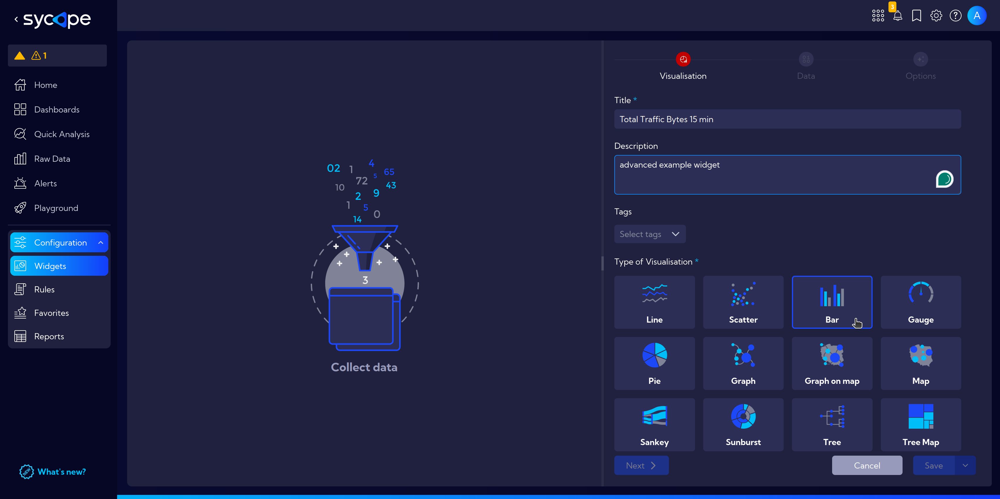
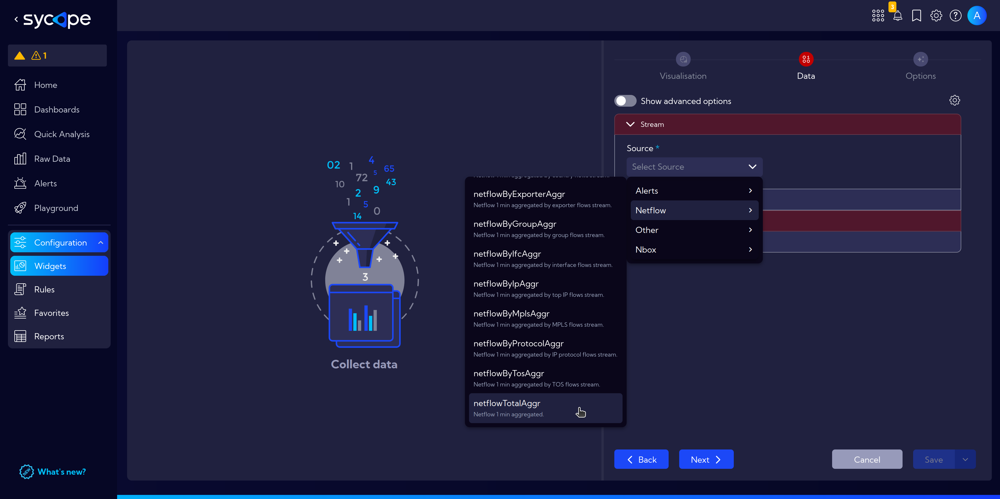
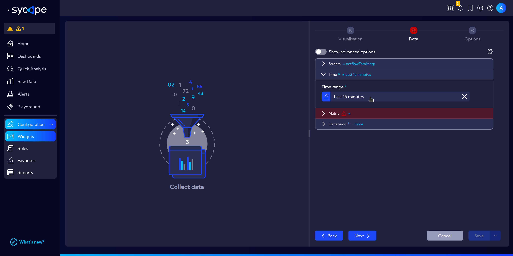
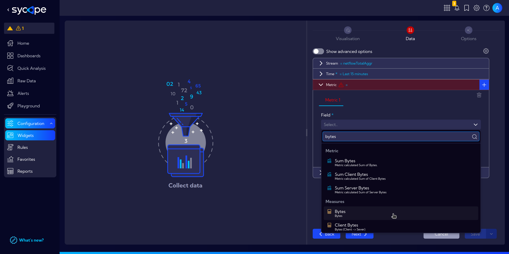
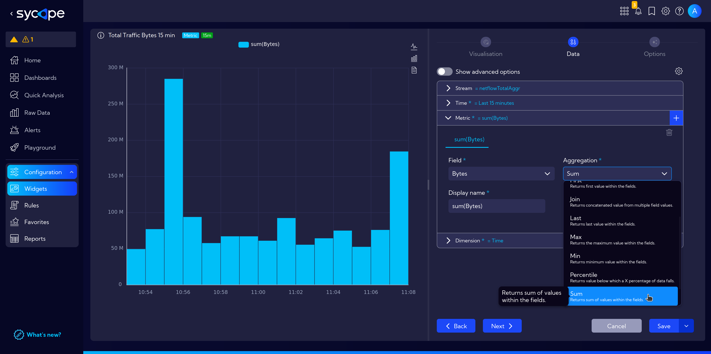
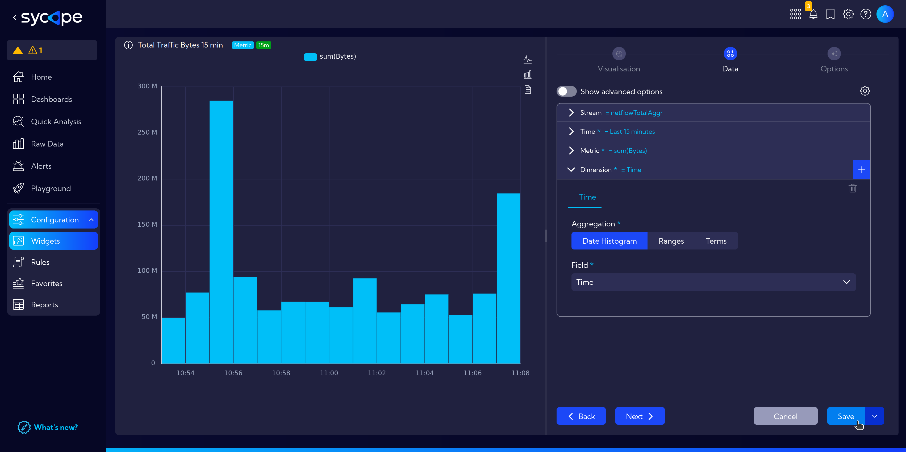
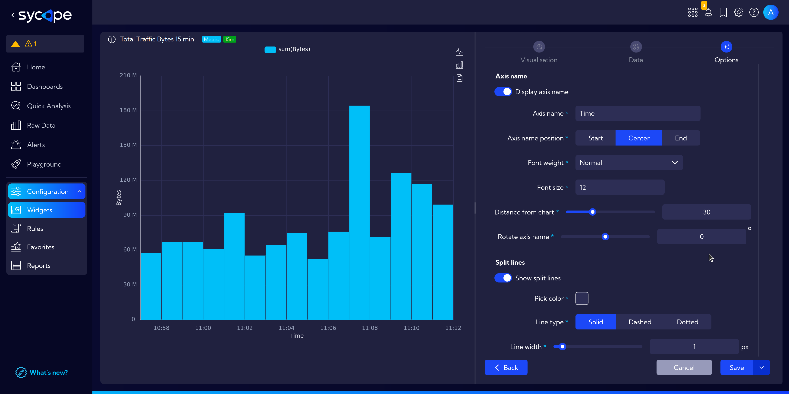

# Widget Advanced Example: Total Traffic Bytes 15 min.

In this example, we will create a widget showing **total traffic bytes** over the **last 15 minutes**.

Again navigate to **`[Configuration > Widgets]`**, then click on the **`Add widget`** button.

Fill in the **Title** and **Description**.   
This time we want to create a widget with a bar chart, therefore in the **Type of Visualization** choose `Bar`.

Next, in the `Data tab` we select the appropriate data source, i.e. Stream: `Source > NetFlow > netflowTotalAggr`.

This time, the appropriate time range is selected by default: **Last 15 minutes**.

In the drop-down menu **Metrics**, select the appropriate aggregation method.  
In **Field** select `Bytes` *(You can use the search function to avoid scrolling)*.

 And in **Aggregation** method search for `Sum`.  

Before we click `Save` and finish work with our widget, let's customize our chart a bit.

Go to the `Options tab`, and there in the `Y axes > Axis name` section, toggle `Display axis name`.  
Customize the following fields to add an informative label for the y-axis. This example covers **Axis name**: *Bytes*, **Axis name position**: *Center*, **Distance from chart** set to *40* and **Rotate axis name** 90 degrees for a nicely aligned axis label.

Apply similar settings to the x-axis in `X axes > X axis 1 > Axis labels` to display the appropriate **Time** label.

:::tip
Now, let's use our widgets and create a customized [example Dashboard](/Examples/Create-Custom-Dashboard).
:::
