# Examples of widget creation - simple widget

## Number of security incidents in last 24h - example assumptions

We want to create a widget that displays the number of security incidents in the last 24 hours.

## Implementation

1. Widgets are created and edited in the menu [Dashboard>Management>**Widgets**]. 

2. To add a widget, click on the **Add Widget** button, then the widget wizard will appear. 

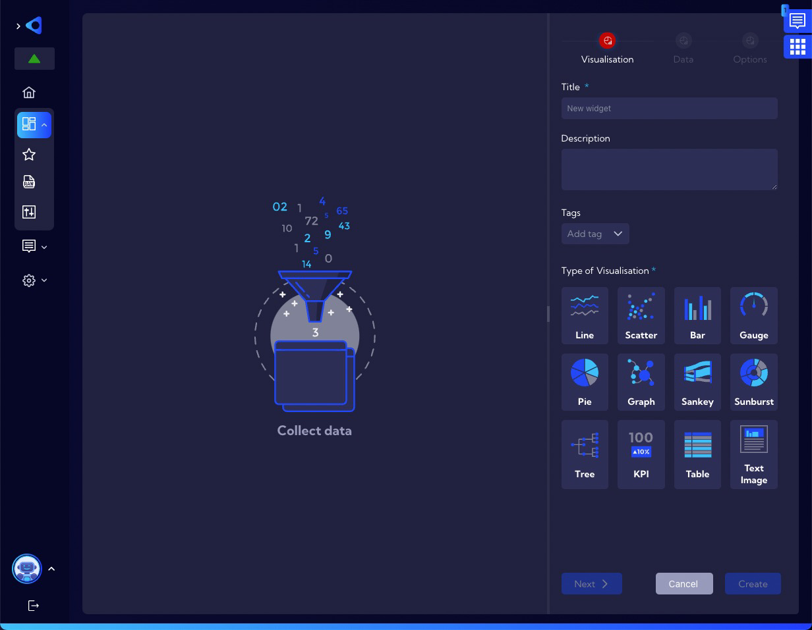

3. In the **Visualization Tab**, enter the name of the **Widget** in the field **Title**. In addition to entering a name, you can enter a short description of the **Widget** in the field **Description** and assign **Tags**. Now it is necessary to select the type of visualization you want to use. In this example it will be **KPI**.

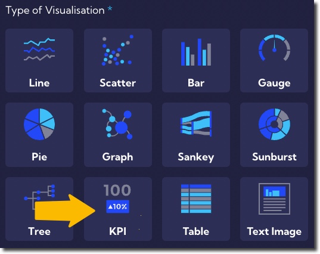

As we know, the widget creation process is divided into three tabs:

- Visualisation,
- Data,
- Option.

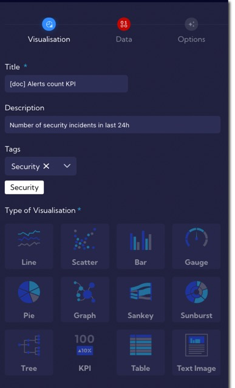

4. Change the tab to **Data**. 

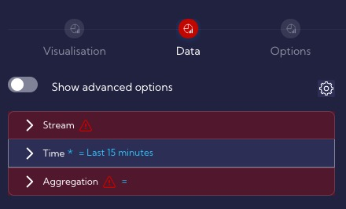

5. In order to count the number of alarms, you need to choose a data stream from which such information can be obtained. Information about security incidents are contained in the **Alerts stream**, which must be selected in the **Source** field.

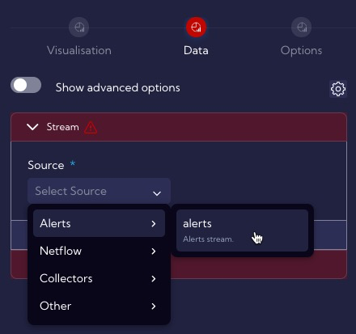

6. Specify the time period for which **Widget** will analyze data - in our example it is **last 24h**.

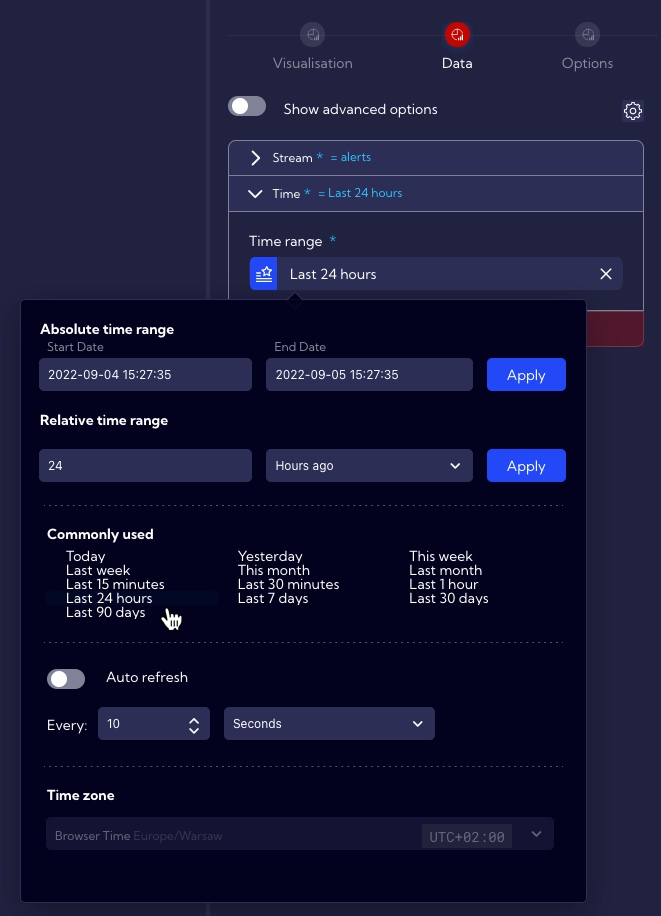

7. Define an **Aggregation** that will allow you to calculate the number of unique alerts that have been generated. To do this, select field  **Alert id**  in the **Metrics** and **Unique count** in the **Aggregation**. **Alert id** is a **Field** in the **Alerts Data Stream** that stores the unique **id** of the alert and **Unique Count** is an aggregation that returns count of unique non empty fields.

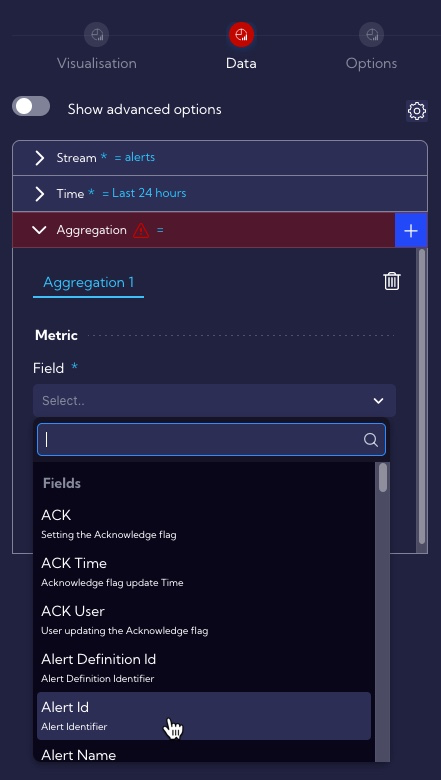

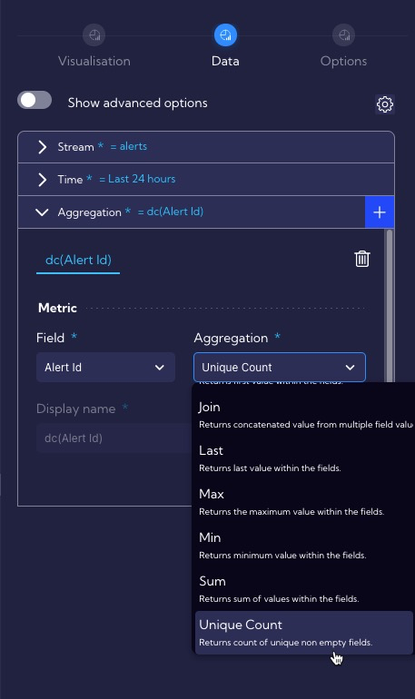

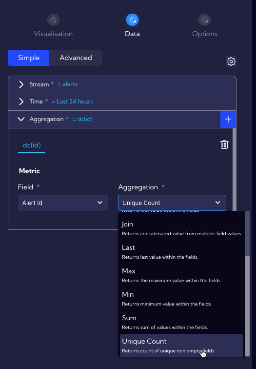

7. At this point the widget in its **simplest form is almost ready**, but it can be edited in various ways to suit individual preferences. As you can see our Widget counted 4296 security incidents in the last 24h. To save the **Widget**, use the **Create button**, then it appears on the list of widgets and is ready to be used as part of the **Dashboard**.

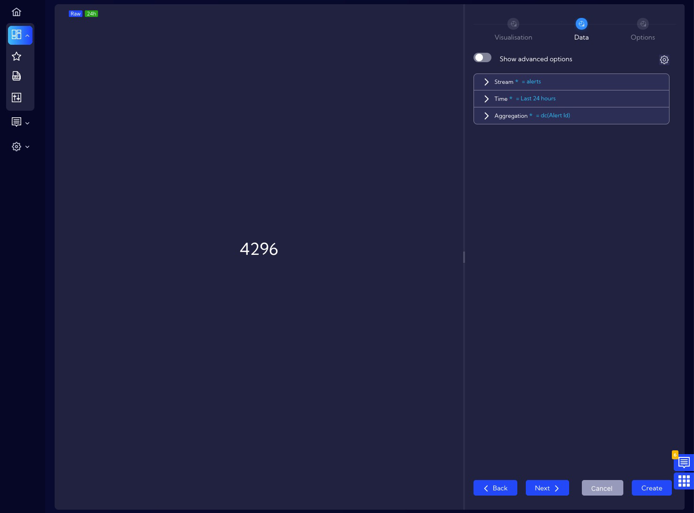

---

## Visual tuning

1. Change the tab to the **Options** and add an icon to the number displayed and to allow other users to launch the widget.

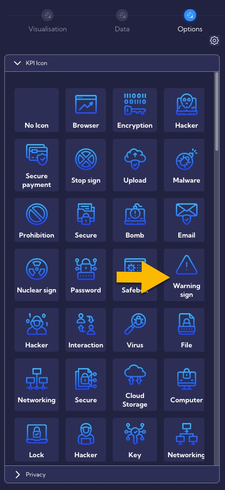

In the **KPI icon** section there are many icons to choose, in the example let’s choose the **Warning sign** icon. The result looks like this:

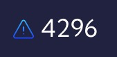

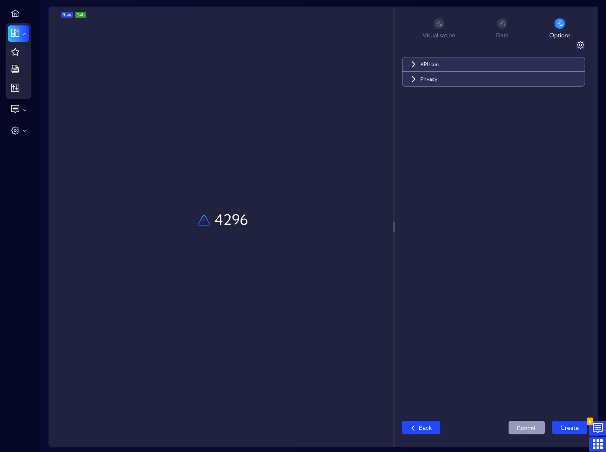

## Changing widget permissions

1. Change the tab to the **Options**. By default, the Widget has permission settings as **Private**. 

If you want other users to be able to use the **Widget**, change its permissions to **Public**.

