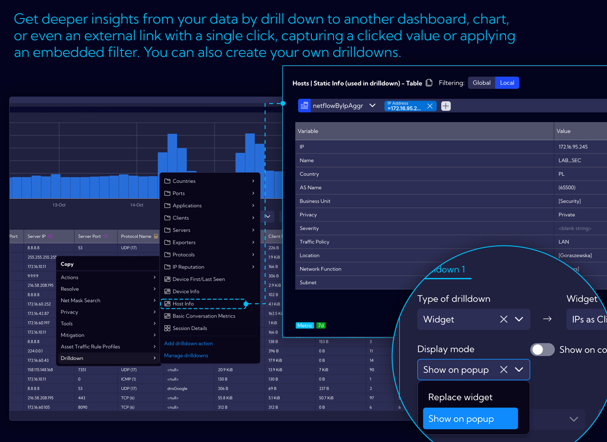
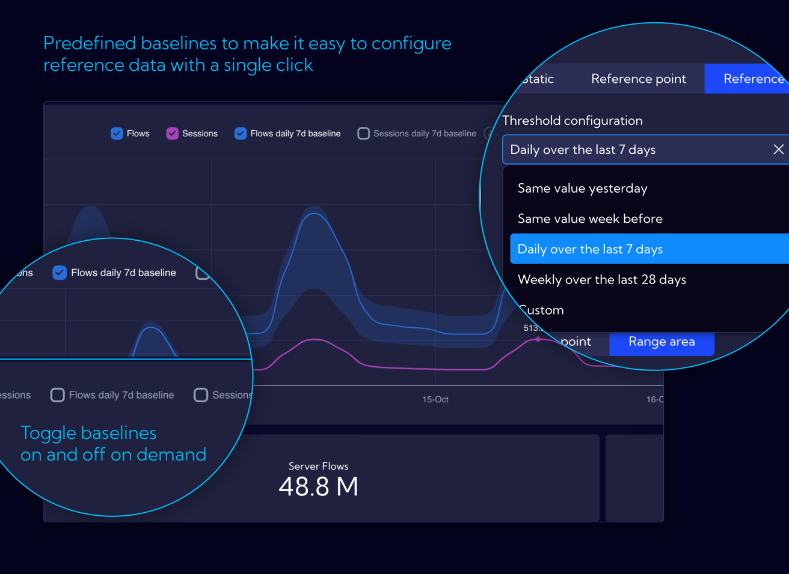

# Release Notes

## ver. 3.1.0

### New Reporting System
A major upgrade to the internal reporting engine for more flexibility, better performance, and an improved user experience.

### New REST API
Upgraded API provides full control over request content and structure, unlocking third-party integrations.

#### Starting with Zabbix and Suricata
Including dedicated dashboards and ready-to-use scripts, available through [our public repository](https://github.com/SycopeSolutions/).

### Custom Streams via API
Create and manage custom data streams, including data injection, directly through the REST API.

### Right-click Menu
New structure for right-click menus with logical grouping, quick filters, and better access to actions.  
Define custom shortcuts in the context menu for frequently used actions or lookups.

#### Contextual Analysis
Perform data exploration in just a few clicks — right-click on any value and instantly apply filters to dig into the context.

#### Quick Actions
Quick Actions are now directly available in context menus, offering greater user control and customization.

### Dashboard Improvements
- Contextual filtering widgets in detail dashboards
- Mandatory filter enforcement on selected dashboards
- Hidden main menu by default to increase workspace

### Pivot Table Widget
Pivot tables are now available as widgets in Sycope. Dynamically group, filter, and analyze data using a flexible interface.

### User Query History
Quickly access and reuse recent operations using the new History panel accessible from the search bar.

### Hiding Empty Values
Automatically hide columns with only null or empty values to improve clarity. Available in tables and advanced views. Fully configurable.

### Lookup Enhancements
- Create new lookups manually without needing a CSV file.
- Edit headers, reorder columns, and search values.
- Append entries or purge entire lookups via API.
- Use the new CSV editor to manually adjust lookup files or import/export them with ease.
- LookupSearchIPFunction for advanced IP Lookups

#### Deep Search

The new Deep Search functionality enables users to efficiently search across all defined Lookups.

### New Shortcut Type for Dynamic Lookups and NQL Queries
- Enables querying a user-defined lookup.
- Runs a custom NQL query defined by the user.
- Uses the $param placeholder to dynamically insert values from a table or widget.
- Supports context-aware actions directly within the interface.

### Alert Manager
Improved alert handling and actions. REST actions now support templated messages and dual serialization.

The CTI module has been upgraded with new and refreshed threat intelligence feeds, powered by a redesigned mechanism that ensures richer source diversity and higher reliability.  

### Asset Discovery Enhancements

#### Custom Asset Metrics 
Sycope API now supports saving custom metrics to the Asset Discovery stream, enabling the storage of historical statistics or dynamic inventory data directly linked to your assets. This functionality facilitates seamless integration with third-party systems, such as CMDBs, where time-stamped data is essential. Examples and implementation guides are available in our public repository. 

#### Drilldown for Asset Device View
A new drilldown action **Asset Device View** enables access to detailed information and statistics for a specific asset based on its IP address. This functionality is available from any dashboard or directly within the Asset Discovery module. This feature provides data related to the asset’s configuration, inventory, and network traffic, allowing for more in-depth analysis of individual endpoints or servers.

### Other Changes

- Optimizations
    - SubPipe performance tuning.
    - Optimized NQL queue handling.
    - Index optimizer simplification.

- Widget Wizard Redesign

- Time Picker Enhancements
    - Quick-select options like “Last 15 minutes”, “1h”, “1 day”, and a redesigned time range editor.

- Visual Enhancements
    - Color-coding values in tables.

- Internal Changes
    - Unified DNS Resolutions.
    - Refactored validation for config-element operations.
    - Improved handling of alert-related REST actions and template messages.
    - Enhanced support for IPv6 in SubnetFTree modules.
    - Fixes for tenantStatusHistory state transitions.

- User preferences can now control left-click behavior in tables (e.g. add to filter instead of showing record details).
- Improved system update process.
- Web URLs displayed in tables are now clickable.
- New option in table headers and stats sections allows you to add a filter to the global search bar without specifying a value.

## ver. 3.0.1

### Refresh many configuration views like Netflow, Support & Diagnostics, General.  

### Application field removed from netflow stream.  

### Fix the problem with netflow forwarder.  

### Fix the problem with data collectors.  

### Improve database query performance.  

### Upgrade many internal libraries.  

### Improve many internal processes.  

### Fix the problem with opening dashboards from the drilldown menu.  

### Other Changes

- Add tooltips for active/inactive status dots.  

- Kpi more than one drilldown.  

- Show all selected tags in form tags info.  

- New table search mode (global search).  

- Auto select profile in Raw-Data.  

- User custom color palettes – also for static values.  

- CSV editors - trimming of entered values.  

- Change assigning exporter groups to roles.  

- Fix drilldown hide conditions.  

- Highlight search texts in tables.  

- Highlight search texts in dropdowns.  

- Fix saving empty proxy username.  

- Added disable cache switch in playground.  

- Enable using saved fields in save fields.  

- Remove empty auto-column from table widgets, make last column auto resizable.  

- Add create collector from widget wizard.  

- Enable create alert from widget.  

- Added edit sub lookup from compond lookup form.  

- Added icons to graph nodes.  

- Added "show other" to limit series section.  

- Added min and max aggregation default value.  

- Import traffic profiles with rules.  

- Added Asset discovery alert type.  

- Limit raw data columns to 60.  

- Update the print styles for the charts.

## ver. 3.0

### Built-in Content

Sycope 3.0 is first and foremost a huge number of new built-in views for data analysis organized into three categories:
- **Trends** category allow for finding certain patterns, peaks and lows in different statistics over time. They are designed to work with different time ranges such as days, weeks or even months and calculate trends in real time.
- Dashboards in **Overview** include counters for different scenarios and charts with Top limitations, in order to focus on the most important sources. This category was designed with a specific point in time in mind – periods of 15-60 minutes.
- **Details** provide answers to specific questions and problems and allow you to view NetFlow level data about specific objects.

### Containers

We created new main view for selecting dashboard groups, designed with the concepts of categories, entities and licenses in mind so that you can quickly find what you are looking for. New built-in content in following sections is presented:  Visibility & Performance, Probe (L7 Packet Inspection), Security, Asset Discovery, System and Custom.

This is the main entrance to the system, and we encourage you to go through it both at the start of your analysis and at any other time.

### Easier navigation between dashboards and quicker access to related elements

Although the main view is clear and convenient, Sycope provides other paths to get directly to the destination: related groups, related dashboards.

By clicking on the group name, you will find a list of related groups of dashboards first. Additionally, we display quick links to dashboards that are related to the group you are currently viewing.

### Easier navigation between dashboards and quicker access to related elements

Although the main view is clear and convenient, Sycope provides other paths to get directly to the destination: related groups, related dashboards.

By clicking on the group name, you will find a list of related groups of dashboards first. Additionally, we display quick links to dashboards that are related to the group you are currently viewing.

### More options in context menu for better navigation and analysis

The context-menu, which appears when you click on a specific object, is a multi-purpose tool with dynamically changing content based on the type of the object you clicked on.

Drilldown enables contextual analysis by capturing a clicked value, displaying it on another dashboard, chart, or even an external link, often including a built-in filter.

Now you can easily use the built-in content for specific types of objects and navigate between drilldown options in the context menu.

### More options in context menu for better navigation and analysis

The context-menu, which appears when you click on a specific object, is a multi-purpose tool with dynamically changing content based on the type of the object you clicked on.

Drilldown enables contextual analysis by capturing a clicked value, displaying it on another dashboard, chart, or even an external link, often including a built-in filter.

Now you can easily use the built-in content for specific types of objects and navigate between drilldown options in the context menu.

### It is now easy to put the KPIs in context

**KPI** is a commonly used widget that is great for an overview and taking a quick glance at the dashboard. However, we believe that it should be more than just a number. In our new built-in content, all KPIs will provide more in-depth information about the data behind them by showing how specific values change over time or by highlighting other important data, depending on what is most useful in a given context.

### Historical baselines as reference values

Getting the data you need is the first step to solve any problem. The values we see are frequently meaningless without a context – for example, a historical perspective. Sycope provides multiple ways to automatically access and use reference points based on historical data – **baselines**. To make it even more accessible, most built-in chart widgets include pre-configured baselines for timelines, which can be visible with a click of a button.

### Even quicker and better configuration

We continue to improve our **Quick Setup** process to make it faster in defining valuable information about your network, hosts and applications, in order to take a full advantage of flow data with business, location or severity contexts.

Our **Quick Setup** wizard now provides suggestions and auto-completion, where applicable, based on already collected flows and saved configuration.

The data can also be imported in CSV format by using prepared templates as a starting point.

### Smart calculator for easier retention configuration

Configuration of data retention parameters is vital for system performance. To make it easier our Quick Setup wizard now **dynamically calculates** usage and space requirements based on current rate of flow data and theoretical usage as per the license limit. This will help you in defining the retention values to maximize performance and fully use the available space.

### Others

Save local filters in user preferences

Add suggestion overlay when changing streams

Add simple dashboard frames

Add deprecated annotation

Display baseline on KPI

Change KPI click action to drill-down

Add by-value coloring for KPI and table

Add toggle for log scale in chart toolbox

Add dynamic baseline time range

Enable server-side sorting for all widget tables

Add related groups and related dashboards

Enable adding/removing dashboards to/from groups directly in the dashboard list

Add deprecated section to dashboard group dropdown menu

Add inverted table view

Add new units data formatter:
- Auto-calculated decimal and binary bits and bits per second (b/s and ib/s)
- Auto-calculated decimal and binary bytes and bytes per second (B/s and iB/s)
- Flows per second (flows/s)

Add option to edit lookup values from widget settings

Add map chart with multiple metrics

Add suggested fields in Quick Setup (group, latitude, longitude)

Add exporters section to Quick Setup

Add ability to double-click on chart legend to show only the selected data series or object

Enable search by tag name in tables

Refactor color picker, add gradient picker, support single color definitions, and allow gradient by threshold

Implement "Add and Import" dashboard from group
Add "not enough data" message to filters

Add support for deprecated objects

Update "not enough data" condition in visualization filter

Add additional legend options for grid charts

Load queries based on selected legend metrics

Enable open ranges in range-based coloring

Add option to reset domain names in Asset Discovery module

Add assets retention configuration to Quick Setup

Enable editing of Traffic Profile from context menu

Secure Asset Discovery view by license

Add export options ("Export All" and "Export Sample") to asset traffic rules

Enable filtering between assetNetflowAggr and assetDevices

Set maximum table limit to 5000

Round previous week and previous month data to UTC for bucket optimization

Set default stream in personal settings

Expand features of filter widget

Add '...' button for horizontal filters in dashboard

Enable auto-formatting for duration values

Extend rich text component to support tile widget creation (e.g., link handling)

Add in-built lookup validation

Add support for various system messages, such as query queue overflow notifications

Enable permission delegation for object and role editing

Save state (open/closed) of the statistics window in raw data view and dashboards

Apply navigational changes, e.g., updating locations of macros, shortcuts, and filters

Enable reordering of items in lists (e.g., bookmarks and favorite filters)

Allow defining column profiles in tables separately for each data stream

Enhance functionality for adding and editing objects, lists, and groups across the system

Improve widget types, including tree map, graph, scatter plot, sunburst, heatmap, trajectory, and filter widgets

Fix background color for tables

Correct suffixes (sec and min)

Fix metric bar color

Correct retention disk size calculation

Validate files properly in Firefox

Save table state in user preferences and fix column resizing when a minimum width is set
