## Introduction

The Update Portal is a platform that allows the user to access the FlowControl installation files. It is available at https://portal.sycope.com.

Using the portal, the user can download the FlowControl system image and the update file for the selected sytem version. In addition, the Platform indicates the full upgrade path related to version. 

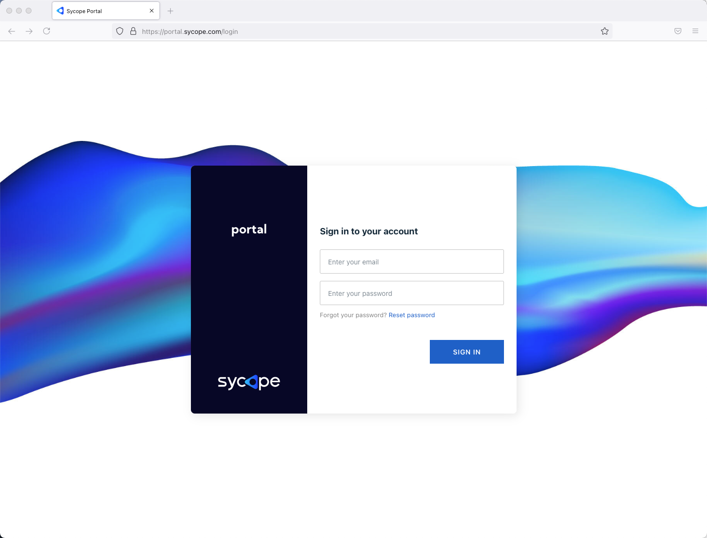

An account generated by Sycope Support or local administrator is required to log in to the Update Portal.

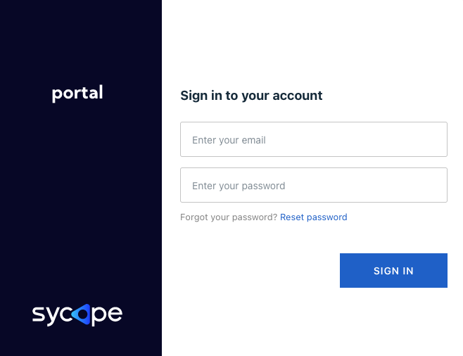

In the login window there is an option *Reset password*, after selecting it the user can reset the password using the verification by code sent to the appropriate e-mail address.

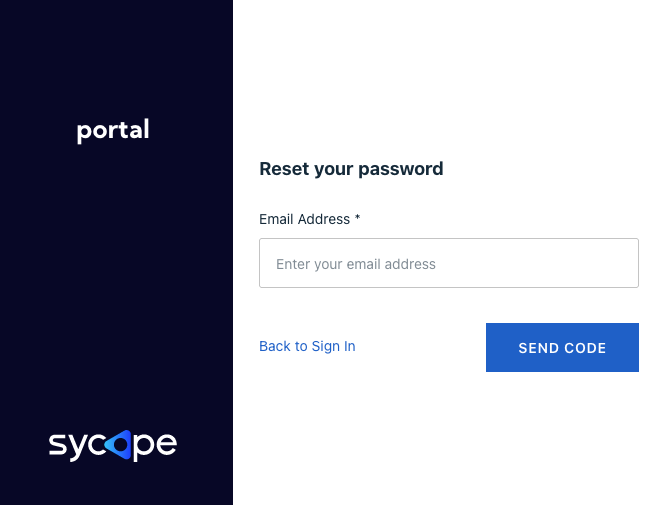

Two types of accounts are used to log in:

- Admin account
- User Account

The administrator account is different only from the user account with the ability to manage the team.

After logging into the portal using the administrator account the main window is displayed where in the left part there is the Main section with the following menus:

- **Updates** - update files management
- **Images** - system images management
- **Team** - users management - appears only for Administrator account
- **Documentation** - link to current version of documentation

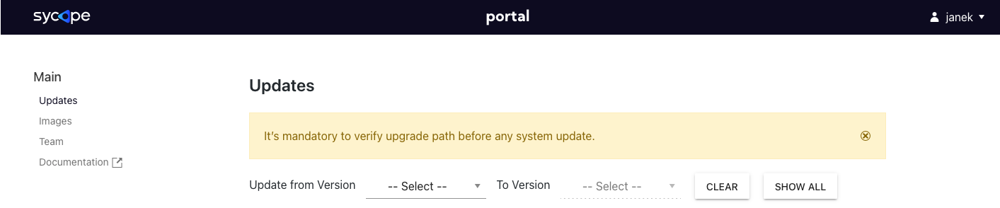

> **IMPORTANT NOTE:**
>
> 
>
> 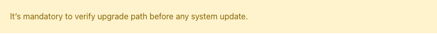
>
> 

In the upper right corner there is an information about the user, after clicking on it a window with a role assigned and an option to log out appears.

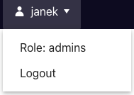

## **Updates**

Allows to find the correct version of an upgrade file including the update path. 

In order to do this, the user has to expand the Select version field and then select the system version from which the update should be done.

Then, in the next field, the version of the system to which the update is to be done must be selected.

After entering the appropriate values, the system will show the correct update path along with a list of files to download.

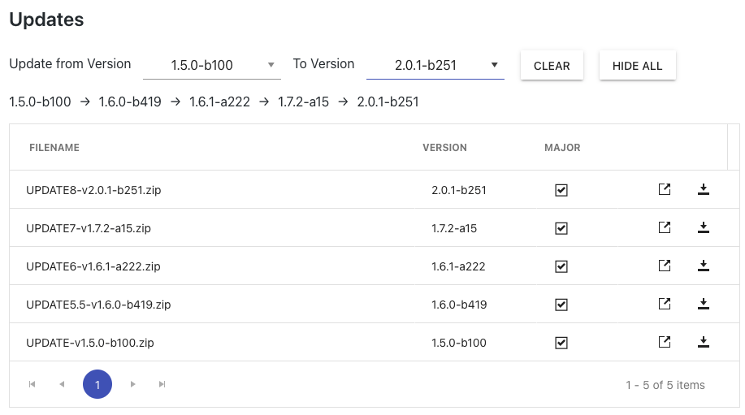

.

In the table where the files are displayed there are the following fields:

- *FILENAME* - name of the update file.

- *VERSION* - system version 

- *MAJOR* - major version indicator 

- *Release notes* - information about changes related to update version

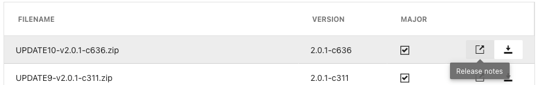

- *Download* - field to download file

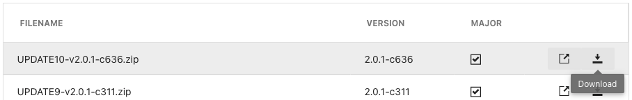

**SHOW ALL** - displays a list of all available updates files.

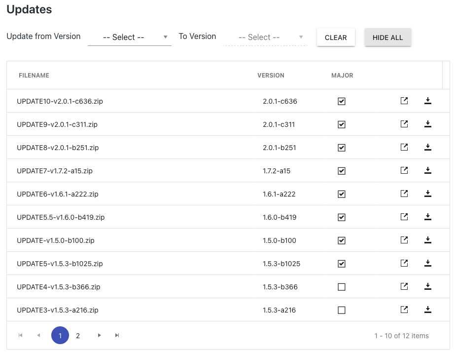

**CLEAR** - clears the window to initial state.

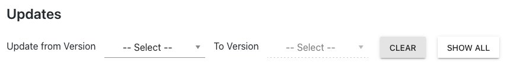

**HIDE ALL** - hides the file list and leaves the update path.

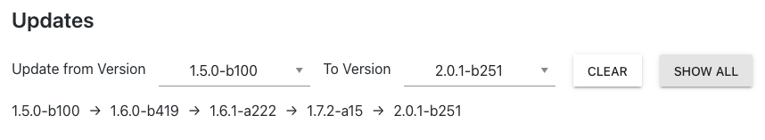 

## Images

In this menu the user can download system images for the available versions.

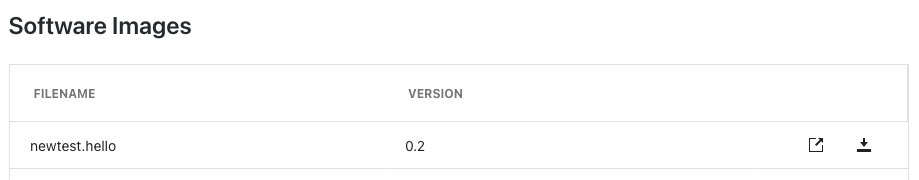

In the table where the files are displayed there are the following fields:

- *FILENAME* - name of the image file.

- *VERSION* - system version related to image. 

- *Release notes* - information about changes in related version.

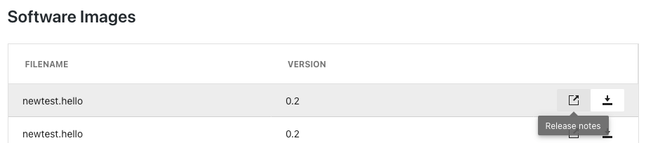

*Download* - field to download file.

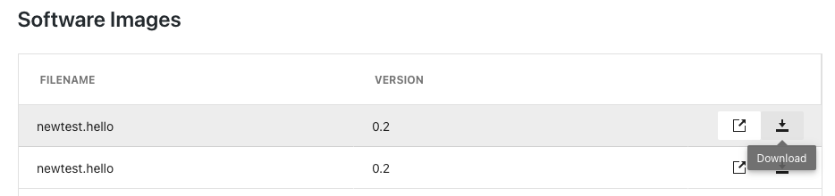

## Team

It is used to manage the team and is only available to the system administrator.

There are four columns in the table:

- *E-MAIL*
- *IS ADMIN*
- *Grand/Revoke admin*
- *Delete*

**E-MAIL** - user e-mail address.

**IS ADMIN** - indicator if user has administrator rights.

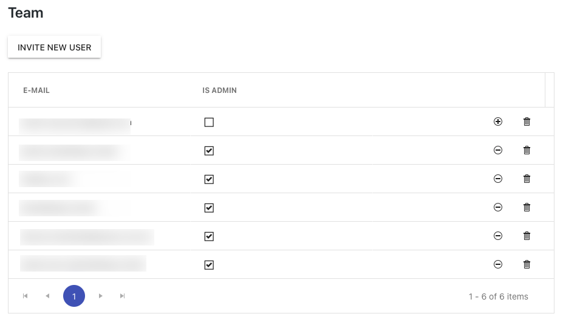

**Grand admin** - granting administrator rights.

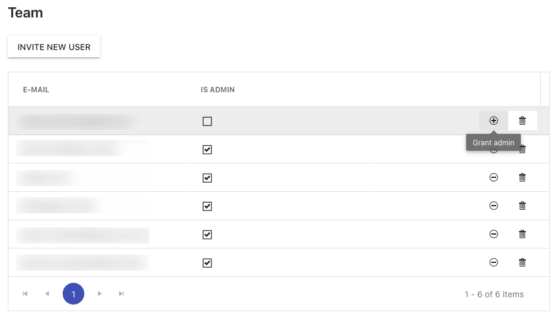

**Revoke admin** - revoking administrator rights.

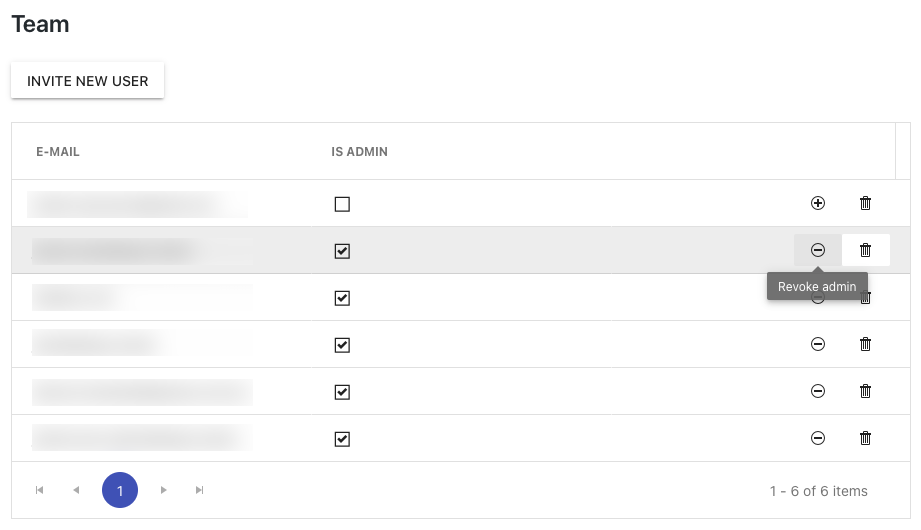

**Delete user** - deleting user.

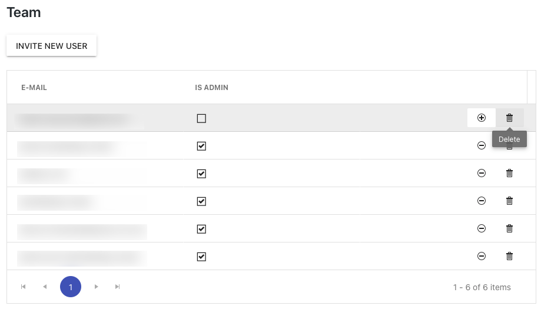

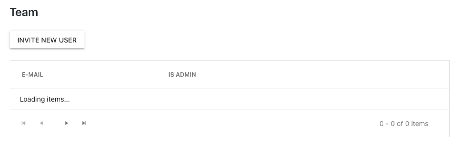

After clicking on INVITE NEW USER, window pop-up in which the administrator enters the email address of the user to be added to the system.

## Documentation

Sycope FlowControl Documentation: https://documentation.sycope.com