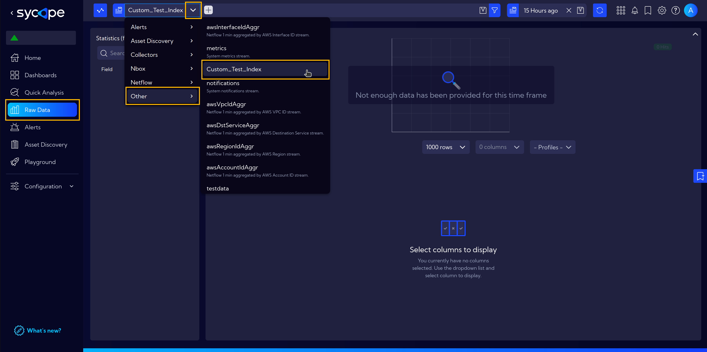
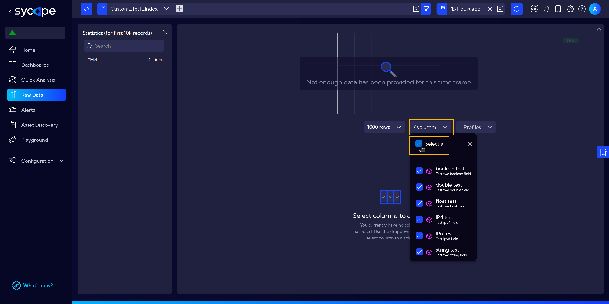
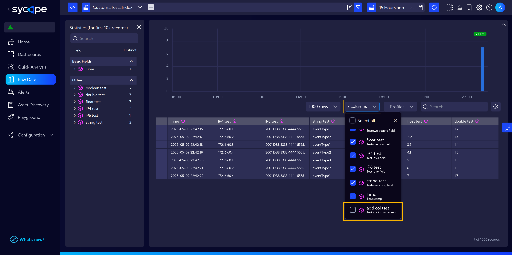
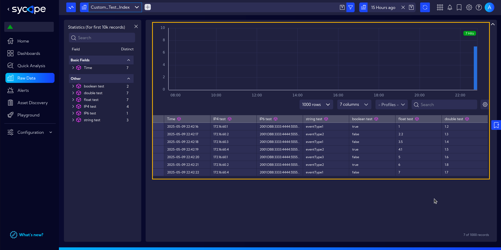

# API Documentation

## Introduction

This part of the Sycope system documentation presents an example of how to interact with the system's API.

## Interacting with the API from Python

This is a minimal example of interacting with the API using a Python script. When working with code in a development or production environment, it’s important to ensure secure storage of credentials, such as passwords and other sensitive variables.

The code shown below is also available in a [notebook](assets/notebook.ipynb).

### Imports and Setup

At the beginning of our script, we import the necessary libraries.  
In the case of requests, it must first be installed using `pip install requests`.  
Because we are using a self-signed certificate, for code clarity, it's possible to disable warnings.

```python
import requests
from urllib3.exceptions import InsecureRequestWarning

# Disable SSL warnings (self-signed certificate)
requests.packages.urllib3.disable_warnings(category=InsecureRequestWarning)
```

### Initiate a Connection

The code shown below initiates a connection to the Sycope API.

Remember to replace the variables with your own values.
- **HOST** - The IP address of the host, or the domain if one is used, e.g. `"https://10.0.0.100"`, `"https://sycope.example.com"`  
- **USERNAME** and **PASSWORD** are the same as for the web interface, i.e., the ones set during the initial setup of Sycope in [Let's Start](/Installation-Guide/Lets-Start#set-sycope-admin-password) (the default values are shown below).

```python
# Variables
HOST = "https://10.0.0.100"
USERNAME = "admin"
PASSWORD = "qwerty"

# Start a Session
session = requests.Session()

# Send a POST Request to Log in
payload = {"username": USERNAME, "password": PASSWORD}
request = session.post(HOST + "/npm/api/v1/login", json=payload, verify=False)
```

Next, we check the response. Status **200** and code **OK** indicate that the session has started correctly.

```python
# Check the Request
request.json()

# Output
{'status': 200, 'code': 'OK'}
```
Once the session is open, we can start interacting with the API.

### Interaction with Custom Indexes

In this section, we will show how to create a new custom index, make modifications to it, send data to the index, and also how to delete a selected index.

#### Create an Index

To add a new index, it is necessary to specify its name and define the fields (columns) it should contain.

Variables:
- **CUSTOM_INDEX_NAME** - The name of the new index.
- **FIELDS** - Fields in the index. 

**Fields** is a list of dictionaries containing the following keys: 
- **name** - The column name.
- **type** - The data type.
    - Available types: **string**, **boolean**, **byte**, **short**, **int**, **long**, **float**, **double**, **ip**, **ip4**, **ip6**, **subnet**, **ifc**, **mac**, **set**
- **sortable** - Boolean value indicating whether it is possible to sort by this column. Can be set only for numeric types: **byte**, **short**, **int**, **long**, **float**, **double**.
- **description** - The column description.
- **displayName** - The display name.

Fields can be defined according to your needs, however, the only mandatory one is **`Timestamp`**, which accepts values in **milliseconds**. e.g. **1738677059000**.

Timestamp:
```python
{
    "name": "timestamp",
    "type": "long",
    "sortable": True,
    "description": "Timestamp",
    "displayName": "Time Field",
}
```

Below is the code to create a sample custom index:

```python
CUSTOM_INDEX_NAME = "Custom_Test_Index"
FIELDS = [
    {
        "name": "timestamp",
        "type": "long",
        "sortable": True,
        "description": "Timestamp",
        "displayName": "Time Field",
    },
    {
        "name": "test_ip4",
        "type": "ip4",
        "description": "Test ipv4 field",
        "displayName": "IP4 test",
    },
    {
        "name": "test_ip6",
        "type": "ip6",
        "description": "Test ipv6 field",
        "displayName": "IP6 test",
    },
    {
        "name": "test_string",
        "type": "string",
        "description": "Test string field",
        "displayName": "string test",
    },
    {
        "name": "test_boolean",
        "type": "boolean",
        "description": "Test boolean field",
        "displayName": "boolean test",
    },
    {
        "name": "test_float",
        "type": "float",
        "description": "Test float field",
        "displayName": "float test",
    },
    {
        "name": "test_double",
        "type": "double",
        "description": "Test double field",
        "displayName": "double test",
    },
]


payload = {
    "category": "userIndex.index",
    "config": {
        "name": CUSTOM_INDEX_NAME,
        "active": True,
        "rotation": "daily",
        "storeRaw": True,
        "fields": FIELDS,
    },
}
request = session.post(
    HOST + "/npm/api/v1/config-element-index/user-index", json=payload, verify=False
)
```

```python
# Check the Request
request.json()

# Output
{'status': 200, 'code': 'OK', 'id': '65ac6a43-8173bfdf-d1815c2c'}
```
The output also includes the **ID** of the newly created index.  
The ID will be needed later for **modifying** or **deleting** the index.

This is how it looks in Sycope under **`[Menu > Raw Data]`**.



By clicking on **Columns**, you can select which ones will be visible.




#### List Indexes

Run the code below to list the existing custom indexes in your Sycope system.

```python
request = session.get(
    HOST + '/npm/api/v1/config-elements?filter=category="userIndex.index"', verify=False
)
```

This is what the response looks like. In our case, there is only one custom index.

```python
request.json()["total"]

# Output
1
```

We can access the ID directly.

```python
request.json()["data"][0]["id"]

# Output
'65adb33f-cb50dadf-8bf808d8'
```

And here is the full response with detailed data.

```python
request.json()["data"]

# Output
[{'id': '65adb33f-cb50dadf-8bf808d8',
  'category': 'userIndex.index',
  'module': None,
  'created': 1746823609965,
  'createdBy': 'admin',
  'modified': 1746823609965,
  'modifiedBy': 'admin',
  'annotations': None,
  'miscData': None,
  'attributes': None,
  'singleConfigurationInstance': None,
  'tags': None,
  'config': {'name': 'Custom_Test_Index',
   'active': True,
   'rotation': 'daily',
   'storeRaw': True,
   'fields': [{'name': 'timestamp',
     'type': 'long',
     'sortable': True,
     'description': 'Timestamp',
     'displayName': 'Time Field'},
    {'name': 'test_ip4',
     'type': 'ip4',
     'description': 'Test ipv4 field',
     'displayName': 'IP4 test'},
    {'name': 'test_ip6',
     'type': 'ip6',
     'description': 'Test ipv6 field',
     'displayName': 'IP6 test'},
    {'name': 'test_string',
     'type': 'string',
     'description': 'Testowe string field',
     'displayName': 'string test'},
    {'name': 'test_boolean',
     'type': 'boolean',
     'description': 'Testowe boolean field',
     'displayName': 'boolean test'},
    {'name': 'test_float',
     'type': 'float',
     'description': 'Testowe float field',
     'displayName': 'float test'},
    {'name': 'test_double',
     'type': 'double',
     'description': 'Testowe double field',
     'displayName': 'double test'}]}}]
```

#### Modify an Index

You can modify an index by adding new fields or updating existing ones.  
However, updates are limited to the **description** and **displayName** properties — the **name**, **sortable**, and **type** of a field cannot be changed.  
Additionally, it's not possible to remove fields that already exist in the index.

In the example below, we add a new field named **test_additional_column**.  
Keep in mind that modifying an index requires its ID. You can find it using the [List Indexes](#list-indexes) function.

```shell
INDEX_ID = "65adb33f-cb50dadf-8bf808d8"

CUSTOM_INDEX_NAME = "Custom_Test_Index"
FIELDS = [
    {
        "name": "timestamp",
        "type": "long",
        "sortable": True,
        "description": "Timestamp",
        "displayName": "Time Field",
    },
    {
        "name": "test_ip4",
        "type": "ip4",
        "description": "Test ipv4 field",
        "displayName": "IP4 test",
    },
    {
        "name": "test_ip6",
        "type": "ip6",
        "description": "Test ipv6 field",
        "displayName": "IP6 test",
    },
    {
        "name": "test_string",
        "type": "string",
        "description": "Test string field",
        "displayName": "string test",
    },
    {
        "name": "test_boolean",
        "type": "boolean",
        "description": "Test boolean field",
        "displayName": "boolean test",
    },
    {
        "name": "test_float",
        "type": "float",
        "description": "Test float field",
        "displayName": "float test",
    },
    {
        "name": "test_double",
        "type": "double",
        "description": "Test double field",
        "displayName": "double test",
    },
    {
        "name": "test_additional_column",
        "type": "string",
        "description": "Test adding a column",
        "displayName": "add col test",
    },
]


payload = {
    "category": "userIndex.index",
    "config": {
        "name": CUSTOM_INDEX_NAME,
        "active": True,
        "rotation": "daily",
        "storeRaw": True,
        "fields": FIELDS,
    },
}
request = session.put(
    HOST + f"/npm/api/v1/config-element-index/user-index/{INDEX_ID}", json=payload, verify=False
)
```
```python
request.json()
# Output
{'status': 200, 'code': 'OK'}
```

The modification was successful, and our index now includes the additional column:




#### Data Injection into the Index

Sending data to a custom index is shown in the example below.
To do this, just create a payload with the data you want to send and submit it.  
Use the example as a reference.

:::info
Remember that data can only be injected into **custom indexes** — the system will not allow you to add data to built-in indexes, such as **netflow**.
:::

```python
columns = [
        "timestamp",
        "test_string",
        "test_ip4",
        "test_ip6",
        "test_float",
        "test_double",
        "test_boolean",
    ]

input = [
    [
        1746823336771,
        "eventType1",
        "172.16.60.1",
        "2001:db8:3333:4444:5555:6666:7777:8888",
        1,
        1.2,
        True,
    ],
    [
        1746823337771,
        "eventType2",
        "172.16.60.2",
        "2001:db8:3333:4444:5555:6666:7777:8888",
        2.2,
        1.3,
        False,
    ],
    [
        1746823338771,
        "eventType1",
        "172.16.60.3",
        "2001:db8:3333:4444:5555:6666:7777:8888",
        3.5,
        1.4,
        False,
    ],
]

payload = {
    "columns": columns,
    "indexName": CUSTOM_INDEX_NAME,
    "sortTimestamp": True,
    "rows": input,
}
request = session.post(HOST + "/npm/api/v1/index/inject", json=payload, verify=False)
```

```python
request.json()
# Output
{'status': 200, 'code': 'OK'}
```

The data was sent successfully, and we can now view it in Sycope:



#### Delete an Index

Deleting an index is quite straightforward — all you need is to send the appropriate request with an index ID.

```python
INDEX_ID = "65ac6a43-8173bfdf-d1815c2c"

request = session.delete(HOST+f"/npm/api/v1/config-element-index/user-index/{INDEX_ID}", verify=False)
```
```python
request.json()
# Output
{'status': 200, 'code': 'OK'}
```
