### Added:

- New fields in netflow Data Stream - clientASNumber, serverAsNumber, clientFunction, serverFunction, clientLocation, serverLocation, clientRole, serverRole

- New version preAggrByAsn Data Stream - based on clientASNumber and serverAsNumber fields from IP solution address to ASNumber (new lookup)

- New version of preAggrByGroup - based on fields clientFunction, serverFunction, clientLocation, serverLocation, clientRole, serverRole - added new fields groupType and direction 

- New version of CSV lookup that supports large files - used for build as-asName lookup

- New lookups:

  - ip-as: ip-as-user [CSV], ip-as-db[MAXMIND] - used to build a fields clientAsNumber i serverAsNumber in netflow and  preAggrByAsn Data stream
  - as-asName: as-asName-user[CSV], as-asName-db[CSV]
  -  Subnet Lookup  - support for  /31 i /32 masks

- New Mapper: as-asName

- Diagnostic Dashboards and Widgets eg.:

  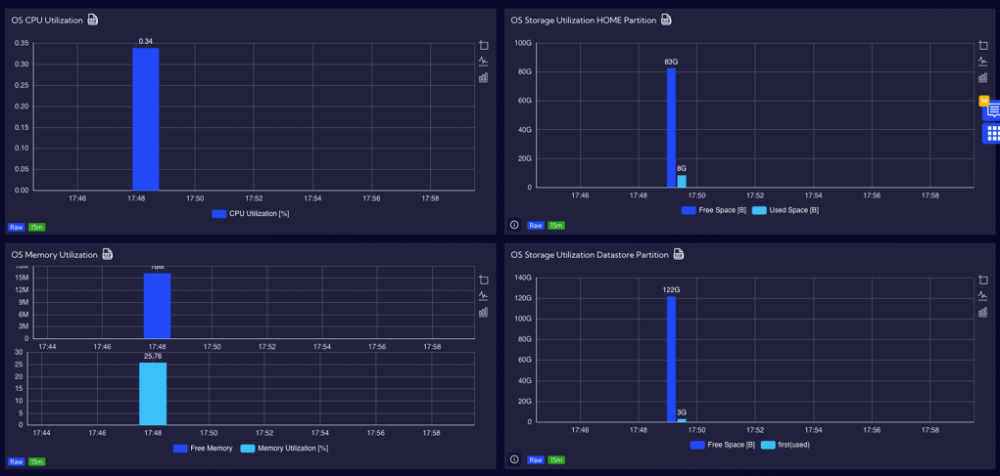

- New tools for the menu [General Settings->Diagnostics] - tcp dump, tcp connection test, etc.

  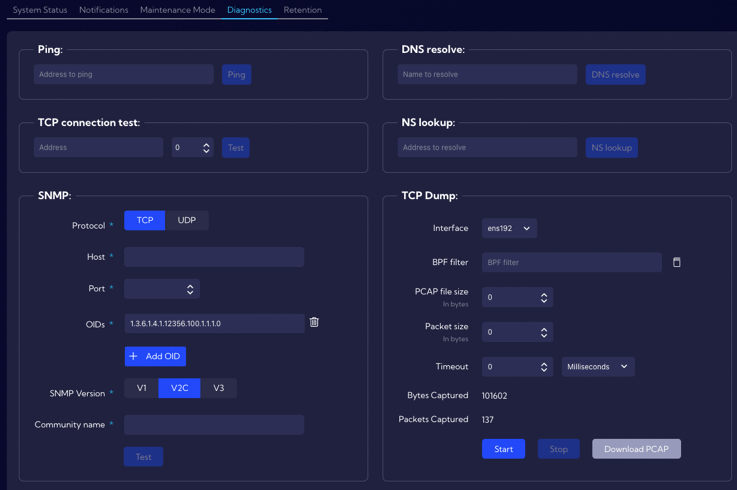

- Configuration of metrics and alert fields in one tab in the menu  [Configuration->Object-> Metrics]. 

  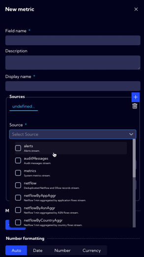

- Support for advanced context menu for different types of widgets

  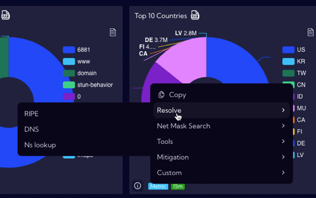

- Favorites menu

  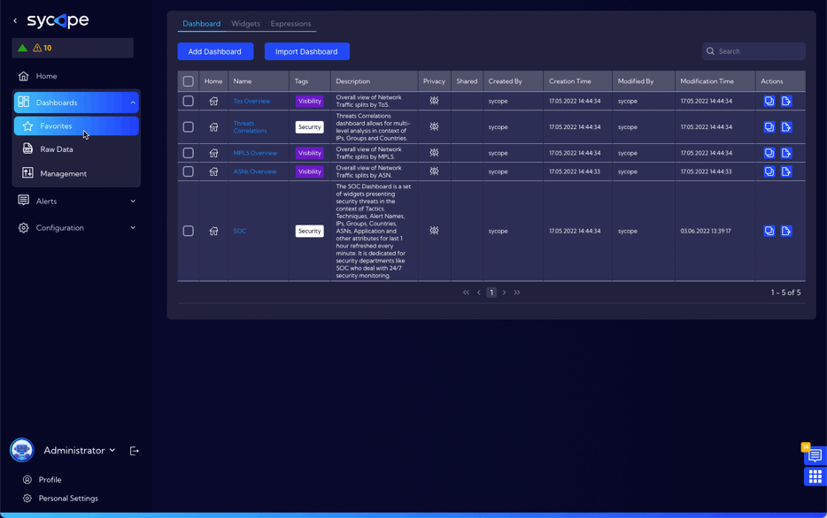

- New design of widgets - new icons for time, streams and so on.

- Button "go to raw data" for a widgets - allows you to jump directly from the widget to the [Dashboards->Raw Data] menu.

  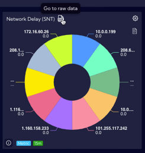

- For table Widget conditional coloring of cells - text or background

- For the Pie Chart Widget - the ability to display a number and a percentage side by side as a label

- Search and filtering in lookups table and mappers table

  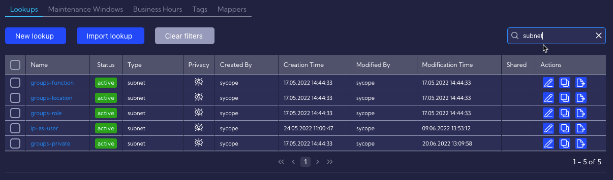

- Option to save user preference settings in the menu [Personal Settings]

  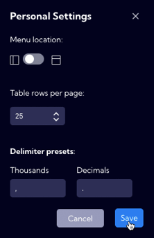

- In the menu [Dashboards->Raw Data] - showing on the chart data that does not exist in the netflow stream 

- Grouping fields in the alerts stream by Alert Name 

  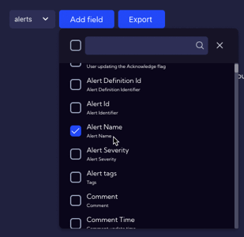

- New wizards

- New (compact) tables design

- User avatars in profile settings

  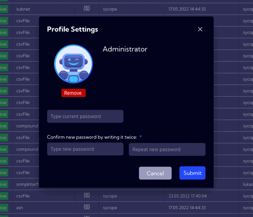****

- Ability to use mappers in alert fields

  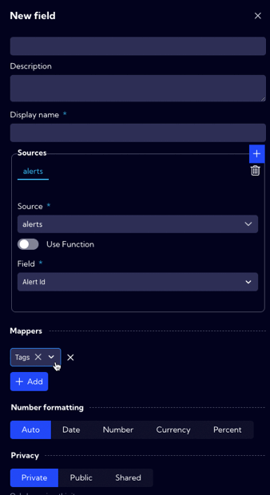

- Ability to create mappers based on CSV lookups type

  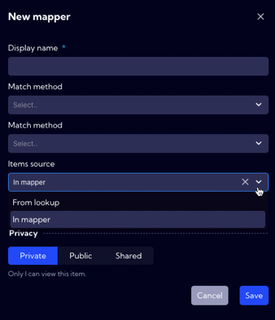

- Ability to hide the chart in Raw Data view

  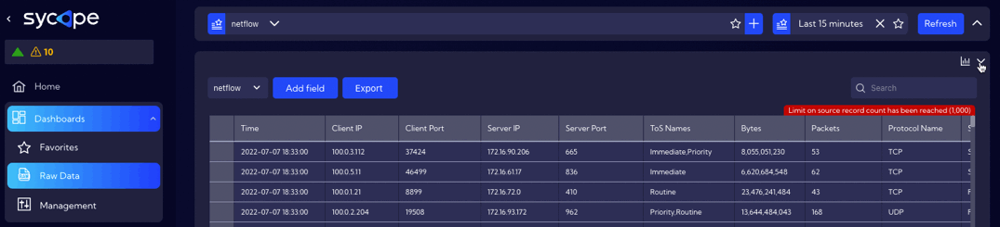

- Columns creator and modifier for many views

- Ability to select an equation operator (>, >=, etc.) when a filter is created from table fields in the menu [Dashboards->Raw Data]

  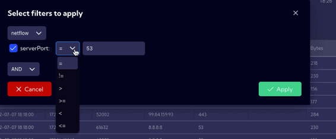

- Ability to filter by calculated fields

- Auth provider connection test button in the menu [Configuration->Account Management->Auth Providers]

  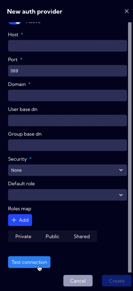

- Label for sum of values in bar for the stacked Bar chart 

- Additional columns in object tables showing relationships between objects

  

- In the object tables, links to dependent objects

  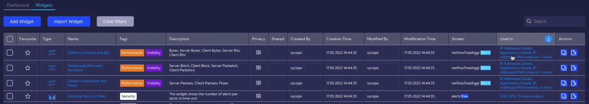

- Objects counter in objects tables

  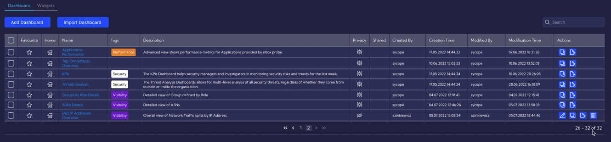

- SNMP section in the menu [General Settings->Diagnostics]

  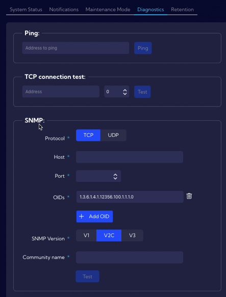

- Sharing default formatting between fields and widgets

- SSH chalange-response mechanism in the menu [General Settings->Maintenance Mode]

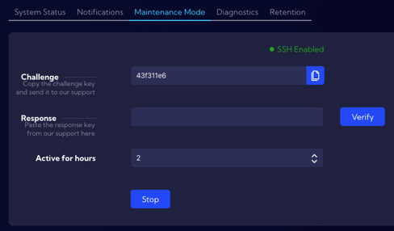

- Proxy support

  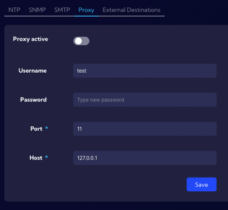

- Column filtering functionalities for Widget table type

  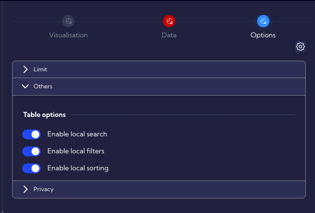

  

- Include new versions of preaggregates in the transition between preAggry - based widgets and netflow. Can filter by fields that are not mapped one-to-one in neftlow.

  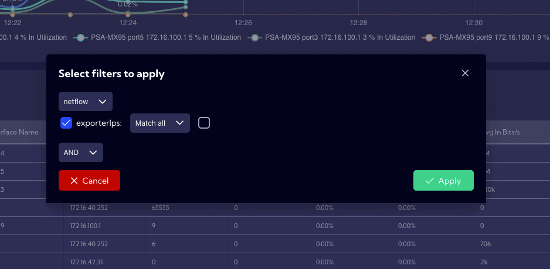

- Filtering by Interface Index from preAggrByIfc stream

- Ability to define data filtering in the field wizard - an additional field when using "Use function”

  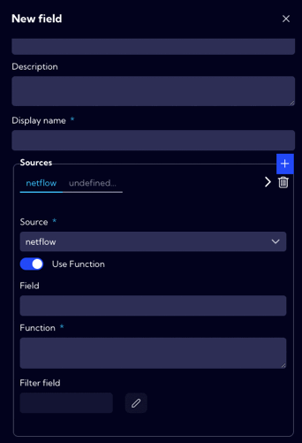

- Showing on the chart (grey bars) data that does not exist in the netflow in menu [Dashboard-Raw Data]

  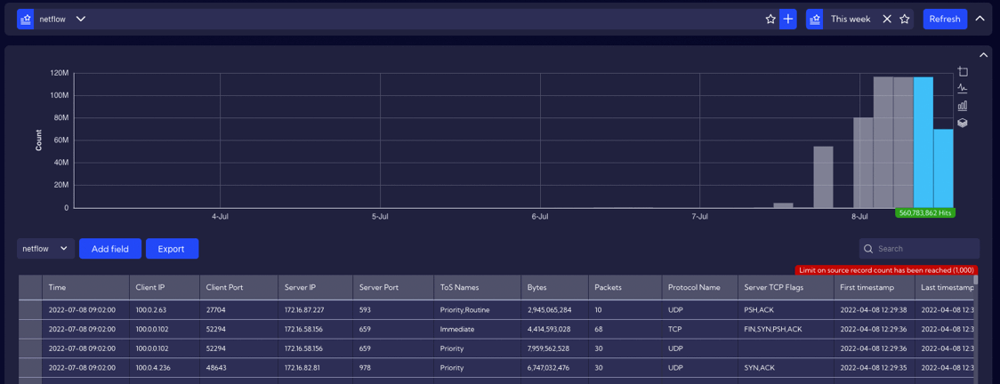

- In the widget, "Metric" badge tooltip showing what data stream the widget use

  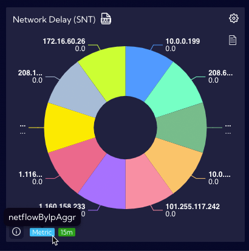

- In the widget, "Time"  badge tooltip showing custom time range selected by user

  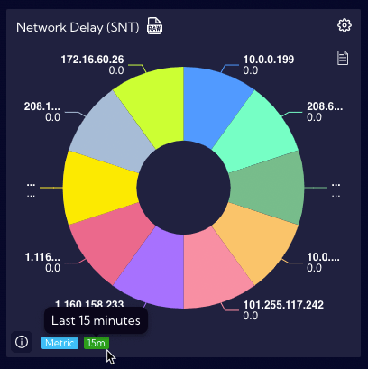

- In table Widget conditional colouring of cells - text or background 

- Ability to filter by base stream and preaggregate - index selection in searchbar + modal with selection by clicking on value in widget

- In the menu [Configuration->Update]

  - release notes
  - offline update mechanism
  - various update path
  - update wizard

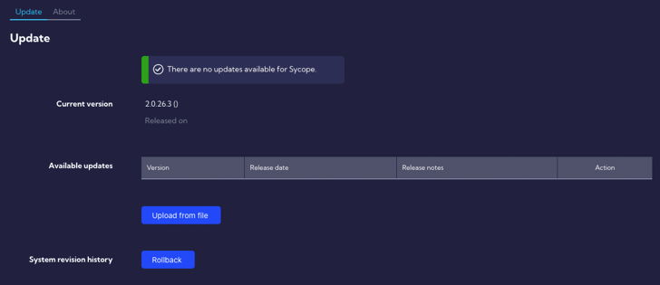

---

### Improved

- Local filtering in tables - multiselect, date picker for time columns, etc.

- Improve filtering from widgets in NQL, such as the ability to filter by lookup data

---

### Fixed

- Various privilege-related errors.

- Protection against system blocking in case of disk overflow

- Speed of changes to alerts - false positives, etc.

- Support for large numbers (>2GB) in a rules thresholds 

- Flyout search engine performance

- Information about logged-in user for AD authentication

- Number formatting in tooltips

- Exporting data to CSV and pdf from table widget

- Lookups operations in a query rules

- Changing date formatting on charts

- Preserving flyout width with “pins”

---

### Others

- Corrections and changes for a lookups operation

- Removed fields: clientGroups and serverGroups

- Various graphical fixes and improvements

