## Introduction

In this document you will find information about the most important options available in the FlowControl System. How to operate with data, graphs and charts as well as a general description of options available in the system. 

## System Architecture

> A flow is defined as a unidirectional sequence of packets with some common properties that pass through a network device.  These collected flows are exported to an external device, the NetFlow collector.  Network flows are highly granular e.g.: flow records include details such as IP addresses, packet and byte counts, timestamps, Type of Service (ToS), application ports, input and output interfaces, etc.

Source: [RFC3954](https://www.ietf.org/rfc/rfc3954.txt)

According to the RFC3964 FlowControl solution works as a Flow Collector which collects, analyzes and visualize the collected flows. Metrics are presented and examined from two perspectives: Network and Security giving the operator valuable input into network/application problems analysis as well as security threats hunting. 

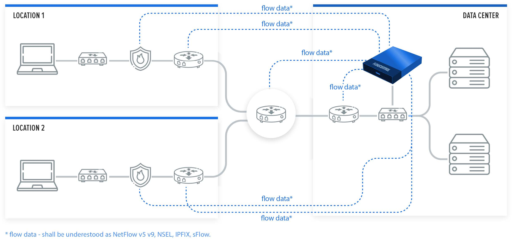

FlowControl supports the following flow protocol data sources: 

- NetFlow 

- sFlow, 

- IPFIX,

- NSEL.

> **Note:** Specific options such as NSEL (Cisco ASA) or different sampling multipliers per device must be additionally configured. System uses SNMP v1/2/3 to query devices. 

## 1. Overview

The main option to configure the solution is the web GUI. The most important thing to notice when working with the FlowControl System are the menus on the left-hand side (**XN, XNS, XND, XNR, SYS**) and the icons in the top right corner  (**Configuration options**). They are all vital components for working with the system, effective problem identification and data mining.

### 1.1 Main

On the left side there are four main sections: XN, XNS, XND, XNRand SYS. Each section consists of a menu where you will find desired information about collected data and system configuration. The main section works in hide/reveal mode. In order to show full names of the menu components, minority and majority please click on the minority sign icons ( < ) located at the top left corner. In order to hide the menu, please click the minority sign icons ( > ).

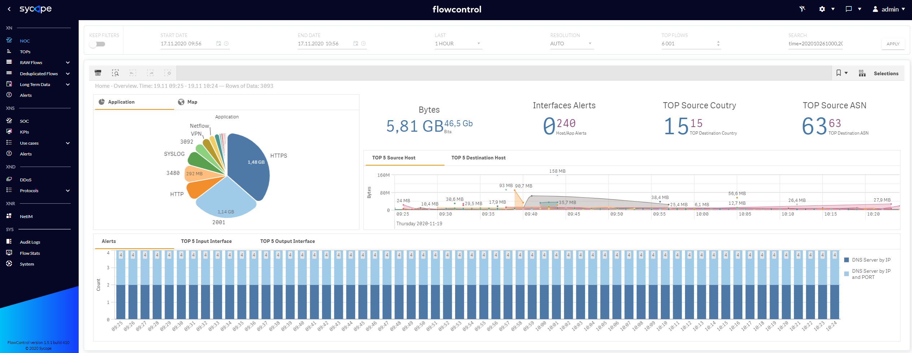

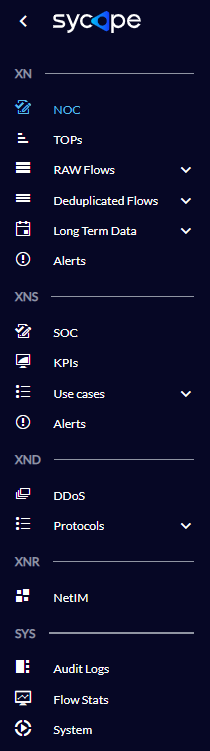

Below is presented table with general description of what can be found in each section. Elements of the main menu were emphasized, while elements of the submenu were written in plain text.

| **FlowControl XN**                                           | Description                                                  |
| ------------------------------------------------------------ | ------------------------------------------------------------ |
|   <u><b> NOC </b></u> | General overview of network infrastructure parameters        |
|   <u><b> TOPs </b></u> | Information about top talkers in the network.                |
|   <u><b> RAW Flows </b></u> | Detailed information about traffic.                          |
|    **Raw Data** | Extensive information about every flow in the traffic.       |
|    **ASA Devices** | Detailed information about flows from ASA Devices.           |
|    <u>**Deduplicated Flows**</u> | Information about deduplicated flows.                        |
|    **Traffic** | Network traffic based on deduplicated flows.                 |
| **   Applications** | Network traffic analysis in view of application based on deduplicated flows. |
|   **Geolocalization** | Maps with various geolocations.                              |
|  <b> Groups </b> | Flows organized into various groups, e.g. business roles, location. |
|    **AS Names** | Flows organized according to AS Names.                       |
|    <u>**Long Term Data**</u> | Aggregated date from previous time periods.                  |
|   **Last Day** | Aggregated data from last day.                               |
|   **Last Week** | Aggregated data from last week.                              |
|   **Last month** | Aggregate data from last month                               |
| <u><b>  Alerts  </b></u> | Information and details about alerts that occurred in the network. |

> **Note:** All views except **Raw Data** use deduplicated traffic. In order to see unique information about flows that may change on the flow path, e.g. QoS tags – please use **Raw Data** views. 

---

| **FlowControl XNS**                                          | Description                                            |
| ------------------------------------------------------------ | ------------------------------------------------------ |
|   <u><b> SOC </b></u> | General overview of security aspects of the network.   |
|   <u><b> KPIs </b></u> | General overview of the basic values of alerts.        |
| 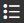   <u>**Use Cases**</u> | Monitoring scenarios of IT security threat.            |
|   <b> Threat Analysis </b> | Information on all threats.                            |
| 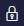  <b> External Threats</b> | Information on threats outside the customer network.   |
|   <b> Internal  Threats</b> | Information on threats inside the customer network.    |
|   <u><b> Alerts  </b></u> | Table with all information about alarms in the system. |

---

| **FlowControl XND**                                          | Description                                                  |
| ------------------------------------------------------------ | ------------------------------------------------------------ |
| 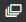 <u><b> DDOS </b></u> | Information about DDoS attacks.                              |
|  <u><b> Protocols</b></u> | Network traffic characteristics in the context of DDoS attacks. |
| <b> Overview </b> | Network traffic characteristics in the context of protocols. |
|  **Details** | Detailed information about DDoS attacks.                     |

---

| **System Section**                                           | Description                                        |
| ------------------------------------------------------------ | -------------------------------------------------- |
|  **Audit Logs** | Information on users logins.                       |
| <b> Flow  Stats </b> | General statistics about raw and aggregated flows. |
| <b> System  </b> | Disk utilization information.                      |

### 1.2 Configuration

On the right-hand side of the system there are three drop-down menus and one switch . The switch  is used to hide the date selection and overload bar. The first menu, marked with this icon  , is the settings menu available only for admin accounts. This section is described in the *Administration Settings* paragraph. The second drop-down menu, marked with , is available for all users. Things that can be found in this section are :

- License Info,
- User Guide,
- Documentation,
- About. 

The license is delivered as a text file. To activate the license, the text from the delivered file must be copied into to the field “Add License” [settings menu/config/license] as below.

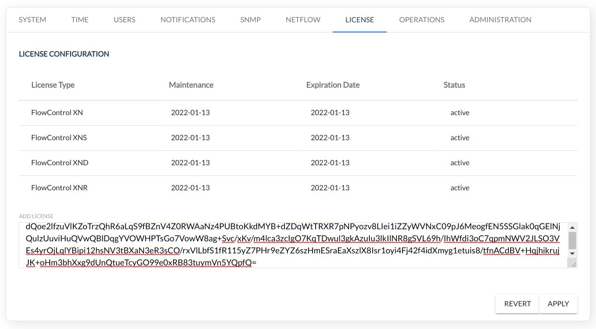

> **Important note:**
>
>  **The standard license includes one administrator account and two user accounts.**

> **Notice:**
>
> If there is **no license** in the system it is not possible to: 
>
> - add user, 
> - update software, 
> - collect Netflow.

The user guide will redirect users to the documentation stored on the system. The about section system will take users to the general web page with information about https://www.sycope.com/.

The third drop down menu, available for all users. In this menu the following things can be found:

 -   Profile

      -  User Settings
      -  Change Password
      -  User Time Zone

 -   Logout

     

### 1.3 Administration Settings

The administrator can change and personalize various aspects of the FlowControl environment. Configuration options that can be set up in this menu are the options required to properly configure and maintain the FlowControl system.

### 1.3.1 Alerts

In the **Alerts** section users can manage and configure customized alerts based on specified metric thresholds.

Configuration of the specific alert consists of three main parts:

- GENERAL -  input Name and Description ,
- FILTERS - specify logical conditions when the alert is triggered,
- NOTIFICATION -  define what would be the alert delivery mechanism (LOG/SYSLOG/SNMP TRAP or E-MAIL)

This system presents all the alerts in a list form where each individual alert can be enabled/disabled, modified or eliminated.

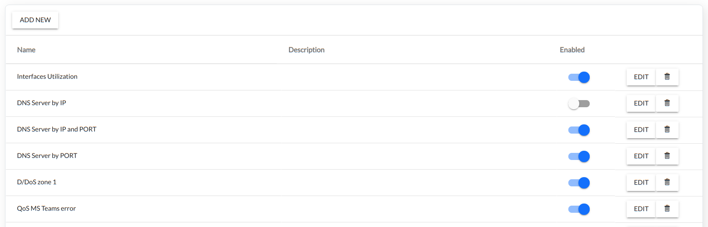

###  1.3.2 Config

In the **Config** section users can configure main system aspects. Options available here are:

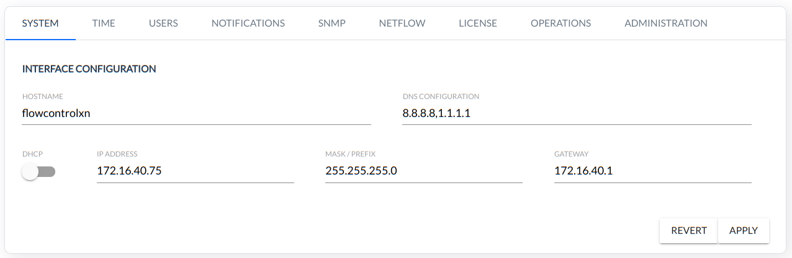

 

- SYSTEM  -  Basic network configuration: Hostname, DNS and IP address, DHCP and Gateway.

- TIME  - Manual or NTP server configuration.

  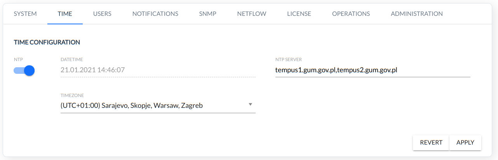

  

- USERS  - System user configuration and role assignment.

  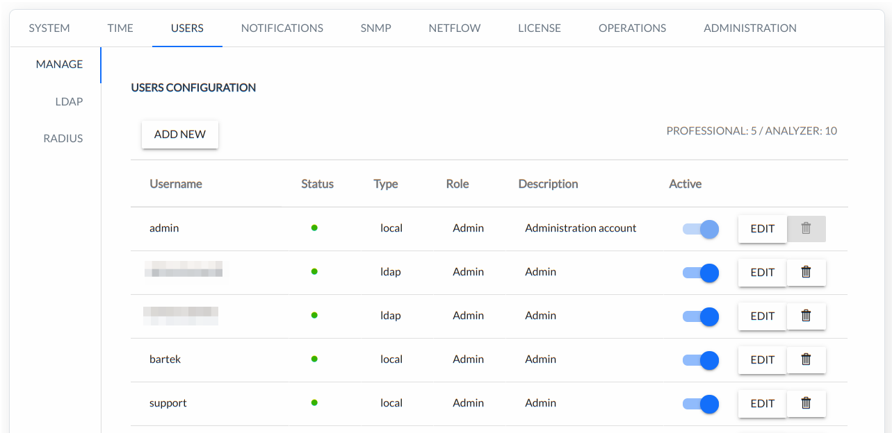

  

- NOTIFICATIONS - Email, Syslog and SNMP trap configuration.

  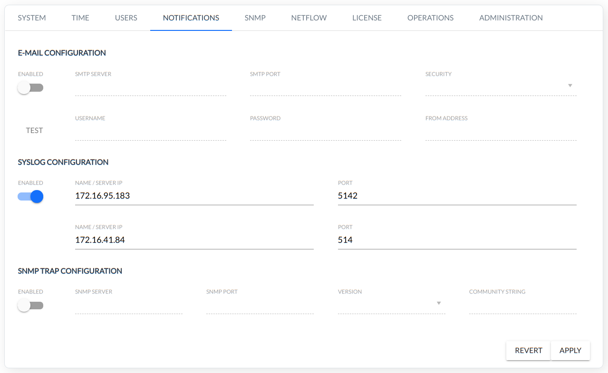

- SNMP - SNMP pooling configuration (supported options v1/v2c/v3).

  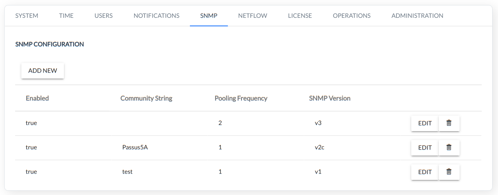

  

- NETFLOW - Configuration of NetFlow, sFlow, IPFIX, NSEL parameters.

  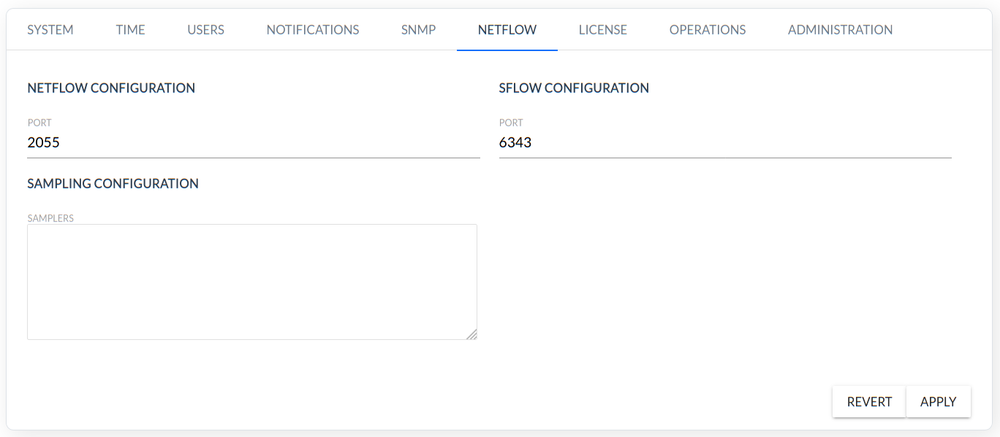

  

- LICENSE - License management.

  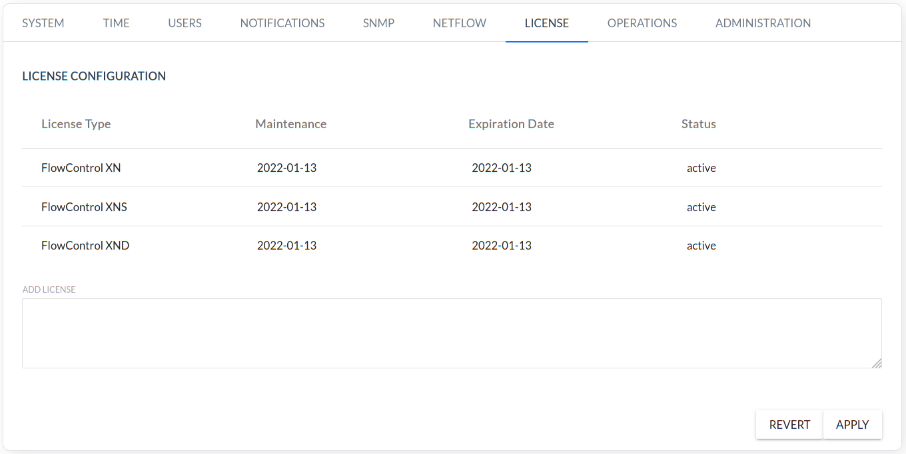

  

- OPERATIONS - Application and system restart/shutdown options.

  

  

- ADMINISTRATION - System utilities such as update, backup, restore, logs.

  

  There are 4 processes: Update, Backup, Restore, and Logs. All processes are dependant. Only one process can be completed at a time and if one process executes it blocks the others. In case, the system support expires, these processes will be blocked.

  When you start the process, its status appears in the pane and when you refresh the browser during the process, you get a popup with a message about its status.

  

  - ADMINISTRATION-UPDATE - This command is used to make an update to the latest version of the system.

    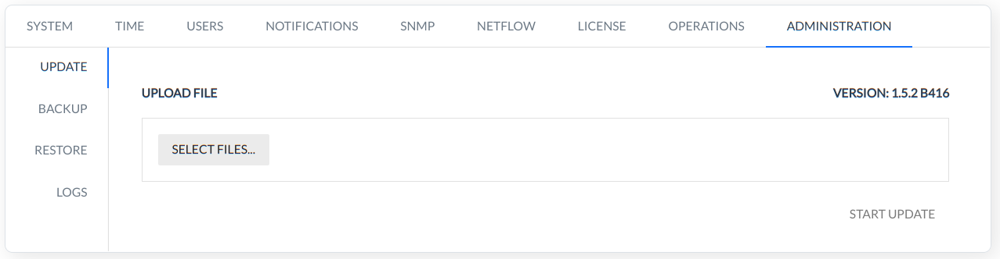

  

  - ADMINISTRATION-BACKUP - This command is used to generate backup.

    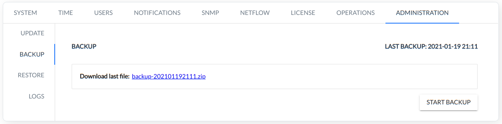

    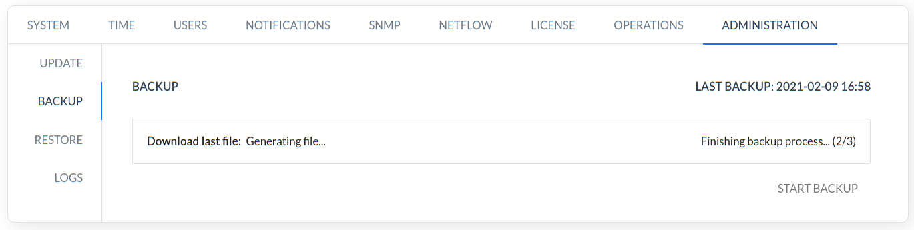

    

  - ADMINISTRATION-RESTORE - This command is used to restore the backup.

    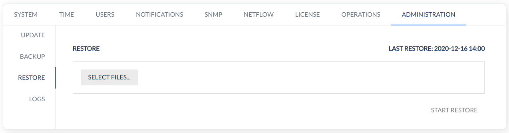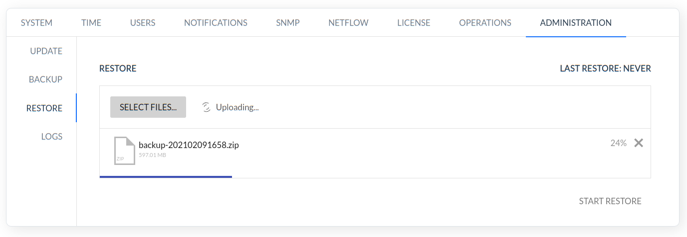 

     After loading the backup file, we get a list of elements we can restore.

    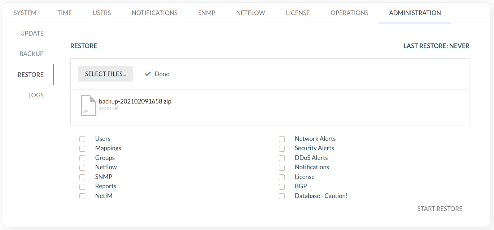

      Backup restore also restores views, dashboards and bookmarks. 

  - ADMINISTRATION-LOGS - This command is used to generate logs.

    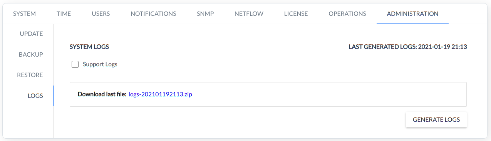

    Two types of log collections can be generated: Basic and Support Logs. Basic type log is saved to a regular ZIP file used for basic diagnosis like: checking the execution of the backup, restore, logs, update commands or checking the logs engine. A file with the collected logs is available for download through the GUI as shown in the figure above.

    Support Logs option is used to generate logs for support team.

### 1.3.3 DDoS

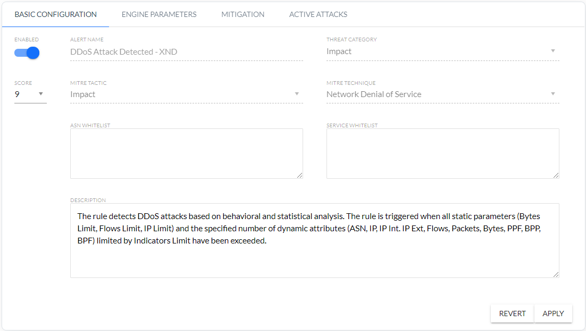

- BASIC CONFIGURATION. 
- ENGINE PARAMETERS. 
- FLOWSPEC BGP.
- ACTIVE ATTACKS.

 

### 1.3.4 Security

In the **Security** section the system allows users to review and manage security rules created according to the MITRE ATT&CK methodology.

> MITRE ATT&CK™ is a globally-accessible knowledge base of adversary tactics and techniques based on real-world observations. The ATT&CK knowledge base is used as a foundation for the development of specific threat models and methodologies in the private sector, in government, and in the cybersecurity product and service community.

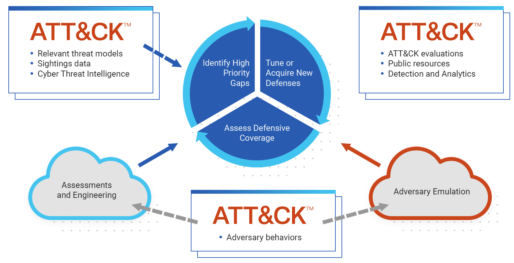

Source: [Mitre](https://attack.mitre.org/)

 Configuration of the security ruleset is based on three sections:

- THREAT DETECTION - Identification of different threat patterns based on proprietary Sycope created rules (this section allows rule set modification but no rule adding).

  
  
  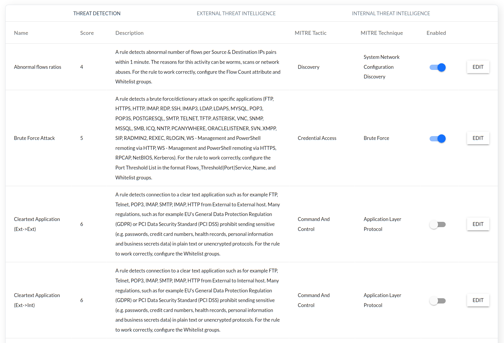
  
  
  
  The table below includes all threat patterns based on proprietary Sycope created rules.

| NAME                                    | SCORE | Description                                                  | MITRE TACTIC        | MITRE Techniqe                         |
| --------------------------------------- | ----- | ------------------------------------------------------------ | ------------------- | -------------------------------------- |
| mal flows ratios                        | 4     | A rule detects abnormal number of flows per Source & Destination IPs pairs within 1 minute. The reasons for this activity can be worms, scans or network abuses. For the rule to work correctly, configure the Flow Count attribute and Whitelist groups. | Discovery           | System Network Configuration Discovery |
| Brute Force Attack                      | 5     | A rule detects a brute force/dictionary attack on specific applications (FTP, HTTPS, HTTP, IMAP, RDP, SSH, IMAP3, LDAP, LDAPS, MYSQL, POP3, POP3S, POSTGRESQL, SMTP, TELNET, TFTP, ASTERISK, VNC, SNMP, MSSQL, SMB, ICQ, NNTP, PCANYWHERE, ORACLELISTENER, SVN, XMPP, SIP, RADMIN2, REXEC, RLOGIN, WS - Management and PowerShell remoting via HTTP, WS - Management and PowerShell remoting via HTTPS, RPCAP, NetBIOS, Kerberos). For the rule to work correctly, configure the Port Threshold List in the format Flows_Threshold\|Port\|Service_Name, and Whitelist groups. | Credential Access   | Brute Force                            |
| Cleartext Application (Ext->Ext)        | 6     | A rule detects connection to a clear text application such as for example FTP, Telnet, POP3, IMAP, SMTP, IMAP, HTTP from External to External host. Many regulations, such as for example EU's General Data Protection Regulation (GDPR) or PCI Data Security Standard (PCI DSS) prohibit sending sensitive (e.g. passwords, credit card numbers, health records, personal information and business secrets data) in plain text or unencrypted protocols. For the rule to work correctly, configure the Whitelist groups. | Command And Control | Application Layer Protocol             |
| Cleartext Application (Ext->Int)        | 6     | A rule detects connection to a clear text application such as for example FTP, Telnet, POP3, IMAP, SMTP, IMAP, HTTP from External to Internal host. Many regulations, such as for example EU's General Data Protection Regulation (GDPR) or PCI Data Security Standard (PCI DSS) prohibit sending sensitive (e.g. passwords, credit card numbers, health records, personal information and business secrets data) in plain text or unencrypted protocols. For the rule to work correctly, configure the Whitelist groups. | Command And Control | Application Layer Protocol             |
| Cleartext Application (Int->Ext)        | 6     | A rule detects connection to a clear text application such as for example FTP, Telnet, POP3, IMAP, SMTP, IMAP, HTTP from Internal to External host. Many regulations, such as for example EU's General Data Protection Regulation (GDPR) or PCI Data Security Standard (PCI DSS) prohibit sending sensitive (e.g. passwords, credit card numbers, health records, personal information and business secrets data) in plain text or unencrypted protocols. For the rule to work correctly, configure the Whitelist groups. | Command And Control | Application Layer Protocol             |
| Cleartext Application (Int->Int)        | 6     | A rule detects connection to a clear text application such as for example FTP, Telnet, POP3, IMAP, SMTP, IMAP, HTTP from Internal to Internal host. Many regulations, such as for example EU's General Data Protection Regulation (GDPR) or PCI Data Security Standard (PCI DSS) prohibit sending sensitive (e.g. passwords, credit card numbers, health records, personal information and business secrets data) in plain text or unencrypted protocols. For the rule to work correctly, configure the Whitelist groups. | Command And Control | Application Layer Protocol             |
| DDoS Attack Detected                    | 9     | A rule detects DDoS attack based on traffic volume from multiple IP addresses to a single destination IP on the same port. The attack involves saturating network resources causing disruption of normal traffic on the target server. For the rule to work correctly, configure the Counter Threshold and Whitelist groups. | Impact              | Endpoint Denial of Service             |
| DDoS DNS Amplification Attack           | 9     | A rule detects DDoS DNS Amplification Attack based on network traffic statistics (Signature 1). To create heavy traffic, an attacker send be sends a request in a way that generates the largest possible response from DNS name resolution services. As a result, the target receives reinforcement of the initial attacker's traffic, and their network is clogged with false traffic, which causes denial of service. For the rule to work correctly, configure the following attributes: Flow Count and PPF (Packets Per Flow). | Impact              | Endpoint Denial of Service             |
| Horizontal Scan                         | 4     | A rule detects a Horizontal Scan attack. The Horizontal Scan is a scan against a group of IPs for a single port. For the rule to work correctly, configure a Port Threshold List in a format Flows_Threshold\|Port\|Service and Whitelist groups. | Discovery           | Network Service Scanning               |
| Unauthorized Internet Access            | 4     | A rule detects access to Internet from non-permitted group based on should be defined zones. This type of activity may indicate on security policy violation. For the rule to work correctly, configure the Permitted Groups. | Discovery           | Permission Groups Discovery            |
| Unauthorized DHCP Activity              | 4     | A rule detects traffic from unauthorized DHCP server. For the rule to work correctly, configure the DHCP SERVERS groups. | Discovery           | System Network Configuration Discovery |
| Unauthorized DNS Activity               | 4     | A rule detects traffic from internal host to unauthorized DNS server. For the rule to work correctly, configure the DNS SERVERS groups. | Discovery           | System Network Configuration Discovery |
| Vertical Scan Detected                  | 4     | A rule detects a Vertical Scan attack. A Vertical Scan is a scan against a single IP for multiple ports. The number of ports is configurable in the "# of ports scanned threshold" parameter. For the rule to work correctly configure the Whitelist groups as well. | Discovery           | Network Service Scanning               |
| DoS Attack Detected                     | 10    | A rule detects DoS attack based on traffic volume from one IP address to single IP on specific port. For the rule to work correctly, configure the Port Threshold List in a format: Flows_Threshold\|Port\|Service and Whitelist groups. | Impact              | Endpoint Denial of Service             |
| DoS - ICMP Flood                        | 10    | A rule detects the DoS ICMP attack. An attacker can send a large number of ICMP packets to consume all available bandwidth of an victim's host.;For the rule to work correctly, configure the following attributes: Flow Count, PPF (Packets per Flow), PPM (Packets Per Minute) and Whitelist groups. | Impact              | Endpoint Denial of Service             |
| DoS - TCP Flood                         | 10    | A rule detects TCP DoS attack. An attacker can send a large number of TCP packets to one or several ports of the victim, which eventually renders the attacked host unable to process the incoming packets. For the rule to work correctly, configure the following attributes: Flow Count, PPF (Packets per Flow), PPM (Packets Per Minute) and Whitelist groups. | Impact              | Endpoint Denial of Service             |
| DoS - UDP Flood                         | 10    | A rule detects the DoS UDP attack. An attacker can send a large number of UDP packets to consume all available bandwidth of the victim's host. For the rule to work correctly, configure the following attributes: Flow Count, PPF (Packets per Flow), PPM (Packets Per Minute) and Whitelist groups. | Impact              | Endpoint Denial of Service             |
| Abnormal DNS Query Limit                | 7     | A rule detects anomaly in DNS protocol regarding abnormal query volume traffic. This rule will be triggered after detecting many DNS queries from the same IP. This activity may indicate on connections to C2 master severs. For the rule to work correctly, configure the Query Limit and Whitelist groups. | Exfiltration        | Data Transfer Size Limits              |
| Abnormal DNS Response Limit             | 7     | A rule detects anomaly in DNS protocol regarding abnormal response volume traffic. This rule will be triggered after detecting many DNS queries to the same IP. This activity may indicate on malware activity over DNS. For the rule to work correctly, configure the Response Limit and Whitelist groups. | Exfiltration        | Data Transfer Size Limits              |
| DNS Transfer Limit                      | 7     | A rule detects anomaly in DNS protocol regarding abnormal query volume traffic. This activity may indicate on connections to C2 master severs. For the rule to work correctly, configure the Transfer Limit and Whitelist groups. | Exfiltration        | Data Transfer Size Limits              |
| High Data Transfer (Int->Ext)           | 7     | A rule detects a high data transfer from internal to external host within 1 minute. For the rule work correctly, configure the Low and High Thresholds, which are given in Megabytes. | Exfiltration        | Data Transfer Size Limits              |
| High Data Transfer (Ext->Int)           | 7     | A rule detects a high data transfer from external to internal host within 1 min. For the rule work correctly, configure the Low and High Thresholds, which are given in Megabytes. | Exfiltration        | Data Transfer Size Limits              |
| High Data Transfer (Int->Int)           | 7     | A rule detects a high data transfer from internal to internal host within 1 min. Thresholds are given in Megabytes. | Exfiltration        | Data Transfer Size Limits              |
| Unusually High Data Transfer (Int->Ext) | 7     | A rule detects a high data transfer from internal to external host within 1 minute. A reasons for this type of activity may be unauthorized data exfiltration outside the organization. For the rule work correctly, configure the Low Threshold which is given in Megabytes. | Exfiltration        | Data Transfer Size Limits              |
| Unusually High Data Transfer (Ext->Int) | 7     | A rule detects a high data transfer from external to internal host within 1 minute. For the rule work correctly, configure the Low Threshold which is given in Megabytes.; | Exfiltration        | Data Transfer Size Limits              |
| P2P Activity                            | 2     | A rule detects P2P traffic based on port analysis. This activity may indicate on policy violation. For the rule to work correctly, configure the P2P Port Ranges in a format StartPort,EndPort,protocol,P2P_Name,Description and a Whitelist groups. | Initial Access      | Drive-by Compromise                    |
| Large Size Protocol Anomaly             | 7     | A rule detects packets of known protocols (ICMP, UDP, TCP) with large size which may indicate on protocol attacks.;For the rule to work correctly, configure the following attributes: Flow Count, and BPF (Bytes per Flow) for each IP Protocol. | Exfiltration        | Data Transfer Size Limits              |
| SPAM (Ext->Int)                         | 7     | A rule detects a SPAM traffic from External to Internal host. An external host is sending excessive email traffic to the organization. For the rule to work correctly, configure the following attributes: Flow Count, PPF (Packets per Flow). | Exfiltration        | Data Transfer Size Limits              |
| SPAM (Ext->Ext)                         | 7     | A rule detects a SPAM traffic between External hosts.;For the rule to work correctly, configure the following attributes: Flow Count, PPF (Packets per Flow). | Exfiltration        | Data Transfer Size Limits              |
| SPAM (Int->Ext)                         | 7     | A rule detects a SPAM traffic from Internal to External host. An internal host may be infected with a spam malware. For the rule to work correctly, configure the following attributes: Flow Count, PPF (Packets per Flow). | Exfiltration        | Data Transfer Size Limits              |
| SPAM (Int->Int)                         | 7     | A rule detects a SPAM traffic between Internal hosts. An internal host may be infected with a spam malware. For the rule to work correctly, configure the following attributes: Flow Count, PPF (Packets per Flow). | Exfiltration        | Data Transfer Size Limits              |
| Suspicious Port BL                      | 6     | A rule detects traffic to a single host on suspicious ports. Suspicious ports are all ports defined in Suspicious Ports list. For the rule to work correctly, update the list of Suspicious Ports and configure Flow Count and Whitelist attributes. | Command And Control | Non-Standard Port                      |
| Suspicious Port WL                      | 6     | A rule detects traffic to a single host on suspicious ports. Suspicious ports are all ports not defined on the Permitted Ports list. For the rule to work correctly, update the list of permitted ports and configure Flow Count and Whitelist attributes. | Command And Control | Non-Standard Port                      |
| Unauthorized LLMNR/NetBIOS Activity     | 5     | A rule detects unauthorized LLMNR/NetBIOS traffic.;Link-Local Multicast Name Resolution (LLMNR) and NetBIOS Name Service (NBT-NS) are Microsoft Windows components that serve as alternate methods of host identification. Attacker may spoof an authoritative source for name resolution on a victim network by responding to LLMNR (UDP 5355)/NBT-NS (UDP 137) traffic as if they know the identity of the requested host, effectively poisoning the service so that the victims will communicate with the adversary controlled system. More details: MITRE T1171. For the rule to work correctly, configure the LLMNRAndNetBIOS Group. | Credential Access   | LLMNR/NBT-NS Poisoning and Relay       |
| Unauthorized MAIL Activity              | 4     | A rule detects traffic from unauthorized Mail Server. For the rule to work correctly, configure the Mail Servers Whitelist groups. | Discovery           | System Network Configuration Discovery |
| Unauthorized RDP Connection             | 5     | A rule detects unauthorized RDP connection attempts from outside the organization. An attacker may connect to a remote system over RDP to expand access if the service is enabled. For the rule to work correctly, configure the Authorized RDP Servers groups. | Lateral Movement    | Remote Desktop Protocol                |
| Virus Outbreak                          | 4     | A rule detects a potential virus outbreak based on abnormal activity between hosts from Workstation group. For the rule to work correctly, configure the following attributes: Uniqe Hosts Count and Workstation group. For the rule to work correctly, configure the Port Threshold List in the format Flows_Threshold\|Port\|Service_Name, and Whitelist groups. | Discovery           | Network Service Scanning               |

- EXTERNAL THREAT INTELLIGENCE - Identification of different threat patterns utilizing several external threat feeds (this section allows rule set modification but no rule adding).

  

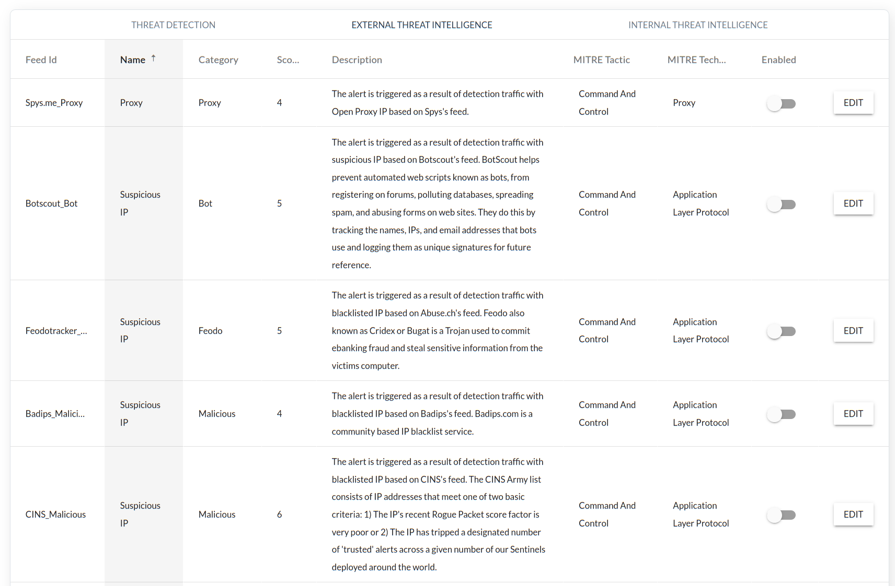

The table below includes all threat patterns based on external threat feeds.

| Feed id                        | Name          | Category  | Score | Description                                                  | MITRE Tactic        | MITRE Techniqe             |
| ------------------------------ | ------------- | --------- | ----- | ------------------------------------------------------------ | ------------------- | -------------------------- |
| Spys.me_Proxy                  | Proxy         | Proxy     | 4     | The alert is triggered as a result of detection traffic with Open Proxy IP based on Spys's feed. | Command And Control | Proxy                      |
| SSLBL_Malicious                | Suspicious IP | Malicious | 4     | The alert is triggered as a result of detection traffic with blacklisted IP based on Abuse.ch's feed. | Command And Control | Application Layer Protocol |
| Feodotracker_Feodo             | Suspicious IP | Feodo     | 5     | The alert is triggered as a result of detection traffic with blacklisted IP based on Abuse.ch's feed. Feodo also known as Cridex or Bugat is a Trojan used to commit ebanking fraud and steal sensitive information from the victims computer. | Command And Control | Application Layer Protocol |
| Alienvault_Malware             | Suspicious IP | Malware   | 8     | The alert is triggered as a result of detection traffic with blacklisted IP based on Alienvault's feed. | Command And Control | Application Layer Protocol |
| Badips_Malicious               | Suspicious IP | Malicious | 4     | The alert is triggered as a result of detection traffic with blacklisted IP based on Badips's feed. Badips.com is a community based IP blacklist service. | Command And Control | Application Layer Protocol |
| Blocklist.de_Malware           | Suspicious IP | Malware   | 4     | The alert is triggered as a result of detection traffic with blacklisted IP based on Blocklist's feed. The www.blocklist.de is a free and voluntary service provided by a Fraud/Abuse-specialist, whose servers are often attacked via SSH-, Mail-Login-, FTP-, Webserver- and other services. | Command And Control | Application Layer Protocol |
| CINS_Malicious                 | Suspicious IP | Malicious | 6     | The alert is triggered as a result of detection traffic with blacklisted IP based on CINS's feed. The CINS Army list consists of IP addresses that meet one of two basic criteria: 1) The IP's recent Rogue Packet score factor is very poor or 2) The IP has tripped a designated number of 'trusted' alerts across a given number of our Sentinels deployed around the world. | Command And Control | Application Layer Protocol |
| Charles_SSH                    | Suspicious IP | SSH BL    | 4     | The alert is triggered as a result of detection traffic with blacklisted IP based on Charles's feed. The feed contains IP addresses launching SSH dictionary attacks. | Command And Control | Application Layer Protocol |
| Cybercrime-tracker.net_Malware | Suspicious IP | Malware   | 5     | The alert is triggered as a result of detection traffic with blacklisted IP based on Cybercrime-tracker's feed. | Command And Control | Application Layer Protocol |
| TI_Dan_TOR                     | TOR Activity  | TOR       | 7     | The alert is triggered as a result of detection traffic with blacklisted IP based on Dan's feed. | Command And Control | Proxy                      |
| COVID_03                       | Suspicious IP | Malware   | 7     | The alert is triggered as a result of detection traffic with blacklisted IP based on MalwarePatrolExport's feed. | Command And Control | Application Layer Protocol |
| COVID_02                       | Suspicious IP | Malware   | 7     | The alert is triggered as a result of detection traffic with blacklisted IP based on Managedsentinel's feed. | Command And Control | Application Layer Protocol |
| COVID_01                       | Suspicious IP | Malware   | 7     | The alert is triggered as a result of detection traffic with blacklisted IP based on Parthdmaniar's feed. | Command And Control | Application Layer Protocol |
| RogueDNS                       | Suspicious IP | Rogue DNS | 5     | The alert is triggered as a result of detection traffic with blacklisted IP based on RogueDNS's feed. | Command And Control | Application Layer Protocol |
| Talos_Intel                    | Suspicious IP | Malware   | 9     | The alert is triggered as a result of detection traffic with blacklisted IP based on Talos's sample feed. Talos's IP and Domain Data Center is the world's most comprehensive real-time threat detection network. The data is made up of daily security intelligence across millions of deployed web, email, firewall and IPS appliances. Talos detects and correlates threats in real time using the largest threat detection network in the world spanning web requests, emails, malware samples, open-source data sets, endpoint intelligence, and network intrusions. The free Talos feed contains an incomplete number of malicious IP addresses | Command And Control | Application Layer Protocol |
| Torstatus.rueckgr.at_TOR       | TOR Activity  | TOR       | 7     | The alert is triggered as a result of detection traffic with blacklisted IP based on Torstatus's feed. | Command And Control | Proxy                      |
| Botscout_Bot                   | Suspicious IP | Bot       | 5     | The alert is triggered as a result of detection traffic with suspicious IP based on Botscout's feed. BotScout helps prevent automated web scripts known as bots, from registering on forums, polluting databases, spreading spam, and abusing forms on web sites. They do this by tracking the names, IPs, and email addresses that bots use and logging them as unique signatures for future reference. | Command And Control | Application Layer Protocol |

The system retrieves the feeds from the external sources at intervals of hour.

- INTERNAL THREAT INTELLIGENCE - Identification of the custom threat patterns configured by users.

  

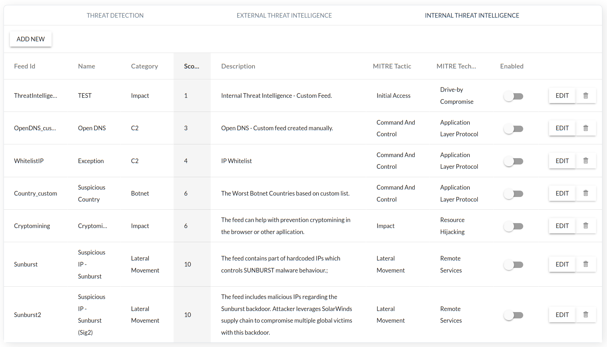

The table below includes examples of the custom threat patterns configured by users.

| Feed id                   | Name                            | Category         | Score | Description                                                  | MITRE Tactic        | MITRE Techniqe             |
| ------------------------- | ------------------------------- | ---------------- | ----- | ------------------------------------------------------------ | ------------------- | -------------------------- |
| ThreatIntelligence_custom | TEST                            | Impact           | 1     | Internal Threat Intelligence - Custom Feed.                  | Initial Access      | Drive-by Compromise        |
| OpenDNS_custom            | Open DNS                        | C2               | 3     | Open DNS - Custom feed created manually.                     | Command And Control | Application Layer Protocol |
| WhitelistIP               | Exception                       | C2               | 4     | IP Whitelist                                                 | Command And Control | Application Layer Protocol |
| Country_custom            | Suspicious Country              | Botnet           | 6     | The Worst Botnet Countries based on custom list.             | Command And Control | Application Layer Protocol |
| Cryptomining              | Cryptomining                    | Impact           | 6     | The feed can help with prevention cryptomining in the browser or other apllication. | Impact              | Resource Hijacking         |
| Sunburst                  | Suspicious IP - Sunburst        | Lateral Movement | 10    | The feed contains part of hardcoded IPs which controls SUNBURST malware behaviour. | Lateral Movement    | Remote Services            |
| Sunburst2                 | Suspicious IP - Sunburst (Sig2) | Lateral Movement | 10    | The feed includes malicious IPs regarding the Sunburst backdoor. Attacker leverages SolarWinds supply chain to compromise multiple global victims with this backdoor. | Lateral Movement    | Remote Services            |

### 1.3.5 Mapping

This system allows mapping between internal networks into a more comprehensive convention which is then used in data presentation. There are three main sections of the mapping configuration:

- NAMES - we can assign names to the following data objects:
  - DEVICES - rule defines a name for the IP,
  - INTERFACES - rule defines several aspects of the Device Interface (Device IP: Interface ID,Interface Name/Description,Interface Speed),
  - HOSTS/SERVERS - rule defines a name for the Server/HOST IP,
  - APPLICATIONS - rule defines a name for the custom APPLICATIONS (Protocol/Port Number,Name).

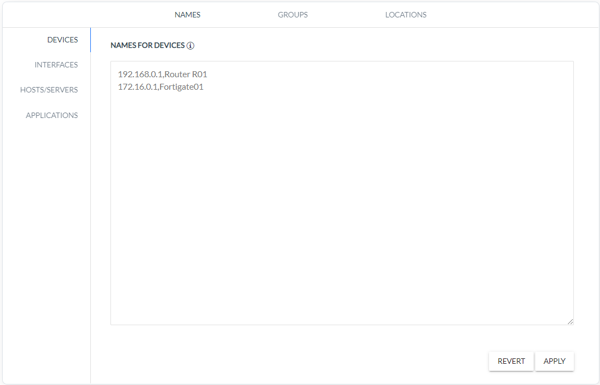

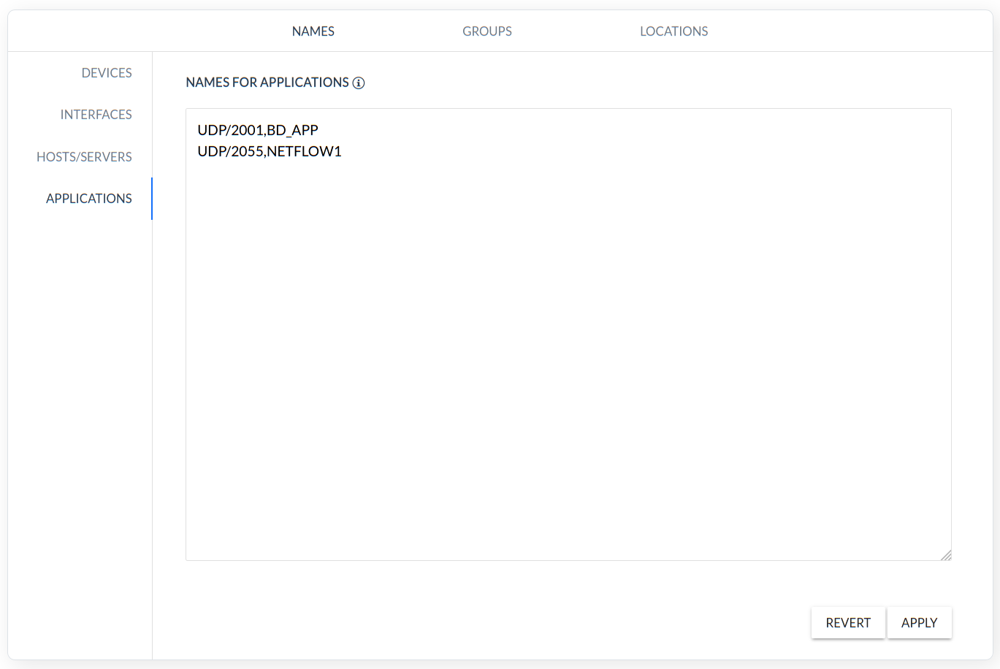

> **Note:** Please remember that in case a NAME or any other parameter exists already and is predefined in the system ex. Application Definitions, mapping will override those values with the user defined ones.

For the system, the order of default applications is as follows:

80,HTTP,TCP

443,HTTPS,TCP

445,SMB,TCP

22,SSH,TCP

23,TELNET,TCP

25,SMTP,TCP

110,POP3,TCP

143,IMAP4,TCP

20,FTP,TCP

21,FTP,TCP

1194,OPENVPN,TCP

5432,PostgreSQL,TCP

If you set up your applications in Mappings, the applications will be displayed first, and then the default applications that did not match with the Mappings applications.

- GROUPS - users can assign names to the internal networks utilizing three grouping sets :
  - LOCATION - grouping based on NETWORK location (CIDR, Name, Description),
  
    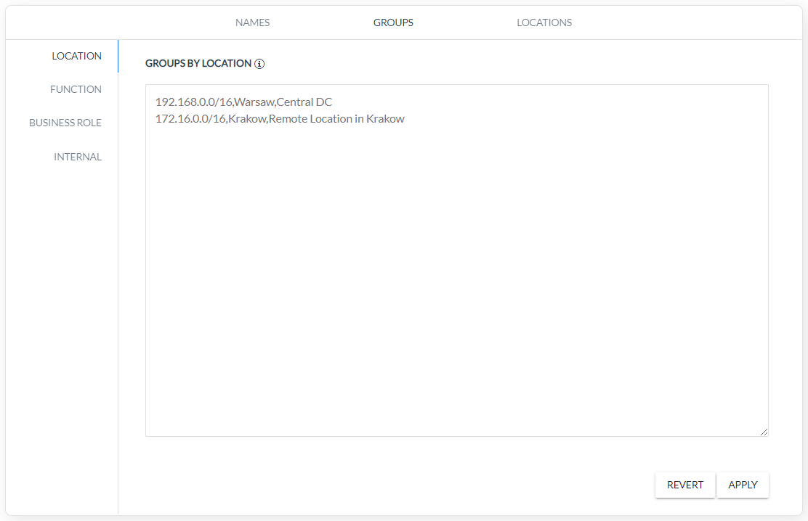
  
    
  
  - FUNCTION - grouping based on NETWORK logical function (CIDR, Name, Description),
  
    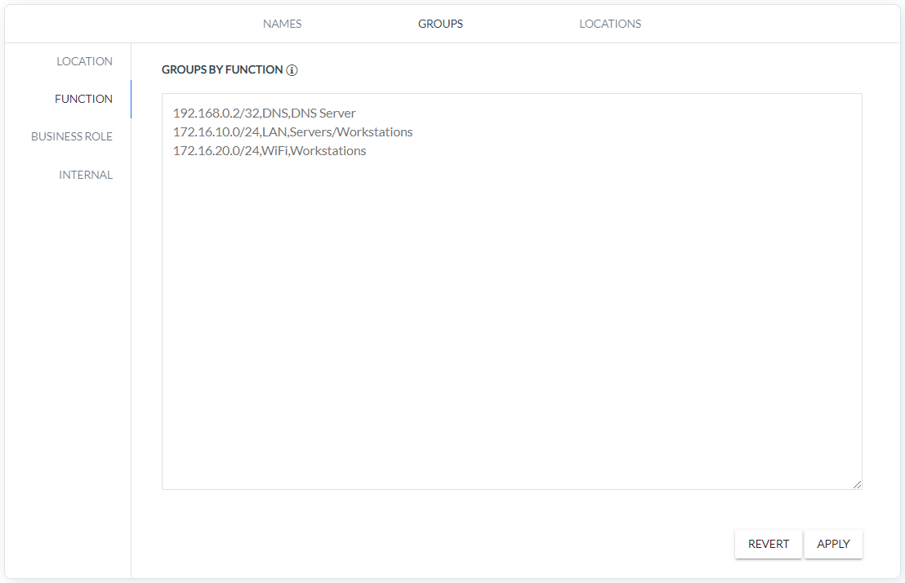
  
    
  
  - BUSINESS ROLE - grouping based on NETWORK business role in Organization (CIDR, Name, Description),
  
    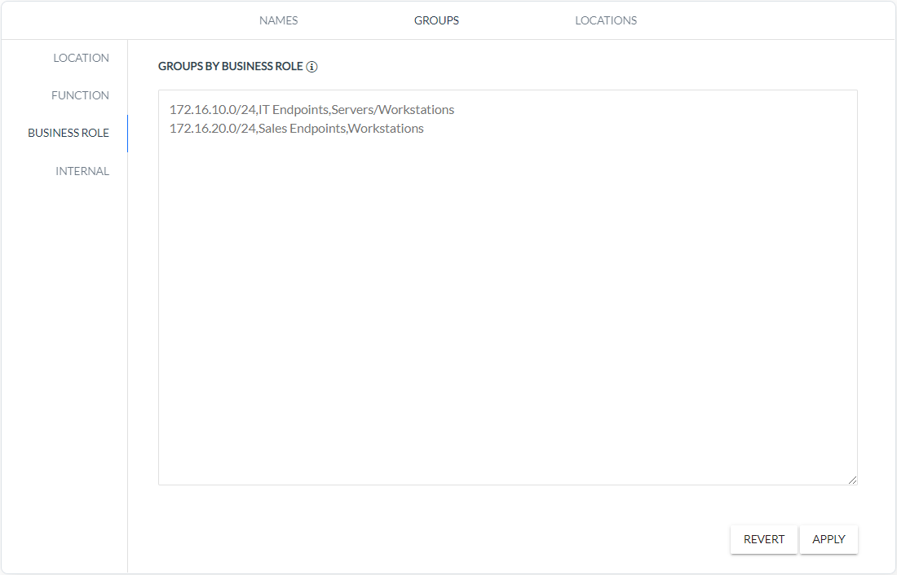
  
    
  
  - INTERNAL  - grouping based on internal Classless Inter-Domain Routing  (CIDR),
  
    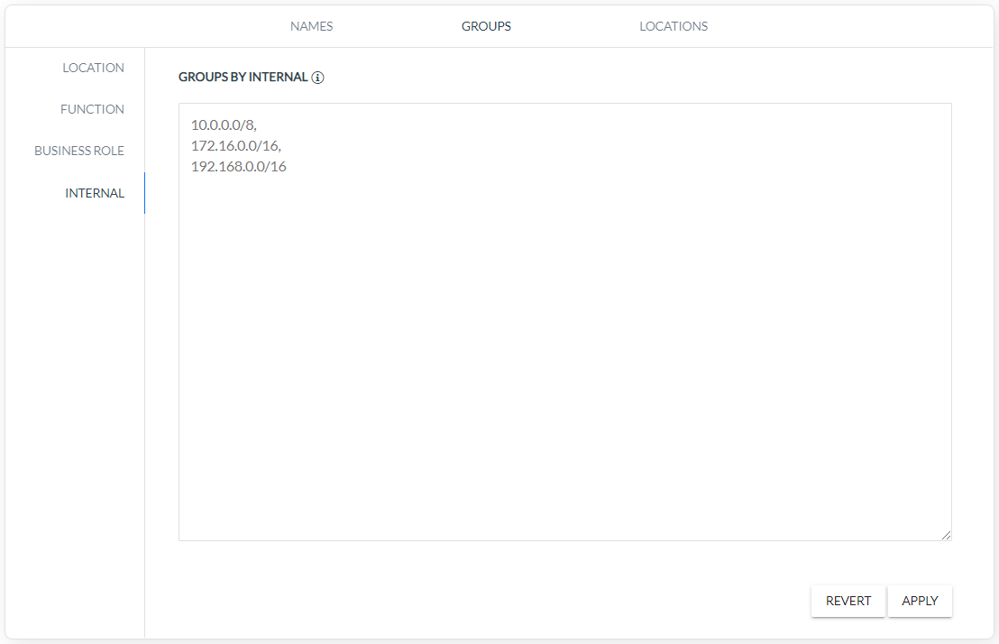

> **Note:** Grouping is very useful for presentation purposes as well as for implementation verification of widely used security zone segmentation concepts, utilized for both traffic filtering and risk mitigation.

- Locations - users can assign geographic coordinates to the following data objects:

  - DEVICES - rule defines coordinates to the DEVICE IP (Device IP, Longitude, Attitude, City, Country, Country Code).

    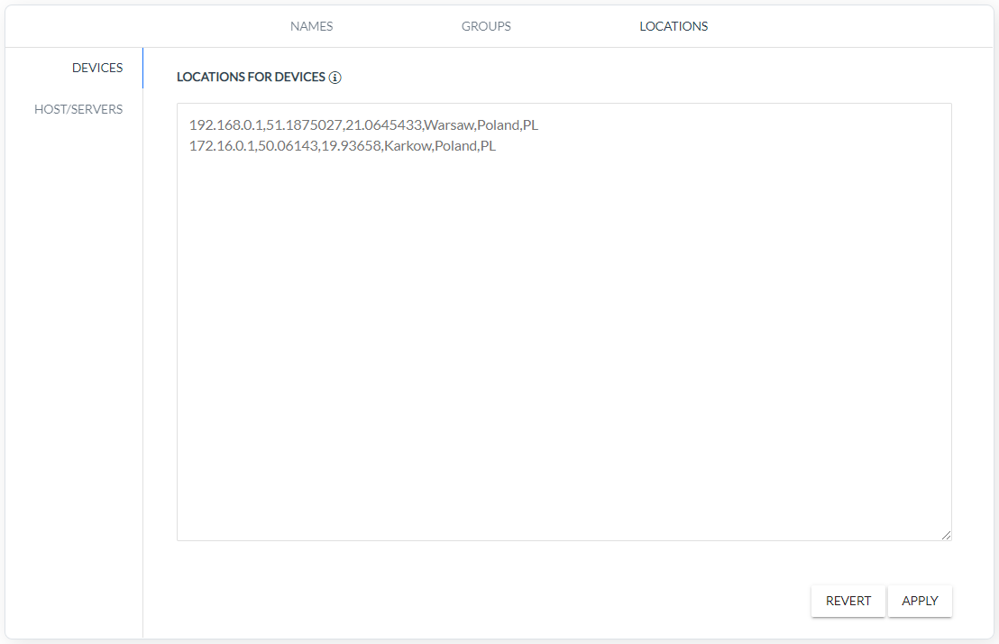

    
  
  - HOST/SERVERS - rule defines coordinates to the HOST/SERVER IP (Host/Server IP, Longitude, Attitude, City, Country, Country Code).
  
    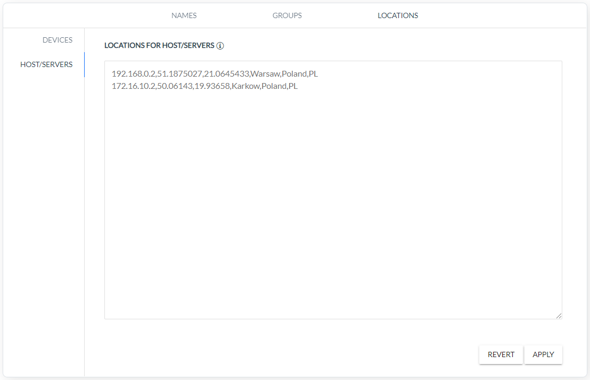
    
    
    
    

### 1.3.6 Reports

This system is preconfigured with four report templates which can be enabled/disabled on request:

* Security Summary - summary of detected security threats from the last day,
*  Network Traffic Report - overview of top talkers and devices,
*  Interface Utilization - top interfaces and threshold violations,
*  Application Servers - view on the most used application servers.

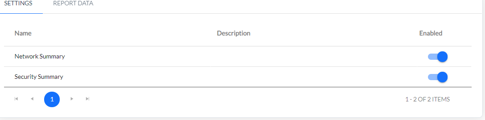

 Reports are run on a daily basis and the outcome is saved and visible in a list form from the UI.

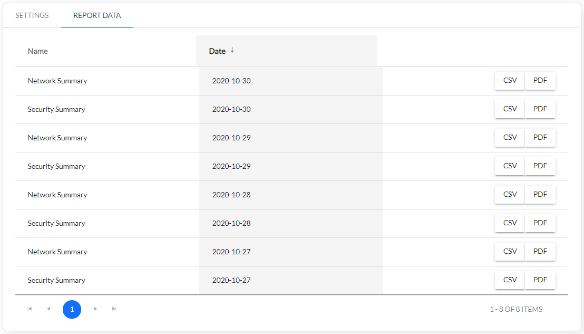

## 2. Dashboards

This section will cover various aspects of working with selected data. We will divide this section into different aspects that FlowControl uses to interpret data from the network. This will include various graphs, charts and tables as well as best practices on how to work with the data. 

### 2.1 Date Range Tab

An important element of the UI is the data range tab at the top of the page that stays with the user at all times in both XN, XNS and XND tabs and XNR. By default the system shows data and statistics for the last 15 minutes after initial login. When starting work on FlowControl it is crucial to remember to change the time range accordingly. Use the data range tab in order to make  the changes listed below: 

●   **Keep filters** – switching this option on, allows users to keep the filters and selections while switching between a different sections. By default, this option is turned off therefore switching to different section will reset all filters and selections. When enabled filters in different subsection views will be preserved. 

●   **Start date/End date** - choose time slots for which network traffic will be shown. Increasing a time slot might influence loading time for data and statistics. 

●   **Last** - this option will change displayed network traffic to the one from the chosen time period.

●   **Resolution** - choose for what period of time data will be merged.  

●   **Top flows** - choose how many top flows will be shown. By default, it is 10,000 flows. Increasing flows might influence loading time for data and statistics.

●   **Search** - specific IPv4 addresses can be searched for. Every widget will be automatically adjusted to show information regarding only the IPv4 address being searched for. 

> **Note:** In order to save your preferences, please click the **APPLY** button available on right-hand side. 

The FlowControl system allows advanced search with filters. The number of available filters depends on the selected database on which the filtering operation will be performed. The table below lists with a description all available filters for the given database.

| Filter description          | Filer name | Database/ RAW flows | Database/  Dedupplicated | Databese/  Utilization| Database/  Total traffic |
| ---------------------------- | ------------------ | ------------------------ | -------------------------------------- | ------------------------------------ | ----------------------------- |
| time                         | unix_secs          | X                        | X                                      | X                                    | X                             |
| byte                         | octets             | X                        | X                                      | X                                    |                               |
| packets                      | packets            | X                        | X                                      |                                      |                               |
| source IP address            | srcaddr            | X                        | X                                      |                                      |                               |
| destination IP address       | dstaddr            | X                        | X                                      |                                      |                               |
| scraddr or dstaddr           | addr               | X                        | X                                      |                                      |                               |
| protocol                     | proto              | X                        | X                                      |                                      |                               |
| source port number           | srcport            | X                        |                                        |                                      |                               |
| destination port number      | dstport            | X                        |                                        |                                      |                               |
| srcport or dstport           | port               | X                        | X                                      |                                      |                               |
| direction                    | direction          |                          | X                                      |                                      |                               |
| number of deduplicated Flows | counter            |                          | X                                      |                                      |                               |
| device                       | dev                | X                        |                                        | X                                    |                               |
| input interface              | inputint           | X                        |                                        | X                                    |                               |
| output interface             | outputint          | X                        |                                        | X                                    |                               |
| inputint or outputint        | int                | X                        |                                        | X                                    |                               |
| IP type of service           | tos                | X                        |                                        |                                      |                               |
| source network               | srcnet             | X                        | X                                      |                                      |                               |
| destination network          | dstnet             | X                        | X                                      |                                      |                               |
| srcnet or dstnet             | net                | X                        | X                                      |                                      |                               |

 

The available filters can be chained together to create any complicated search. Examples of complex searches are presented below.

<u>**Example 1**</u>

Filter fold: unix_secs=202010261000,202010261001;

Assuming that  **X1**=unix_secs, the filtration result is shown in the figure below.

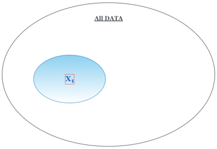

<u>**Example 2**</u>

**Filter fold:** unix_secs=202010261000,202010261001&scraddr=1.1.1.1,2.2.2.2

Assuming that :

**X1**=unix_secs=202010261000,202010261001;

**X2**=scraddr=1.1.1.1,2.2.2.2;

then

**X1 & X2 = X3**.

The filtration result is shown in the figure below.

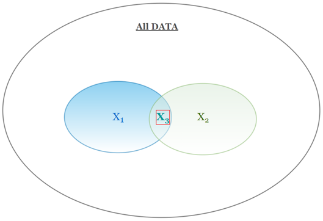

<u>**Example 3**</u>

**Filter fold:**  unix_secs=202010261000,202010261001&scraddr=1.1.1.1,2.2.2.2&dstaddr=3.3.3.3,4.4.4.4

Assuming that :

**X1**= unix_secs

**X2** =srcaddr

**X3**=dstaddr

then

**X1&X2&X3=X5**

The filtration result is shown in the figure below.

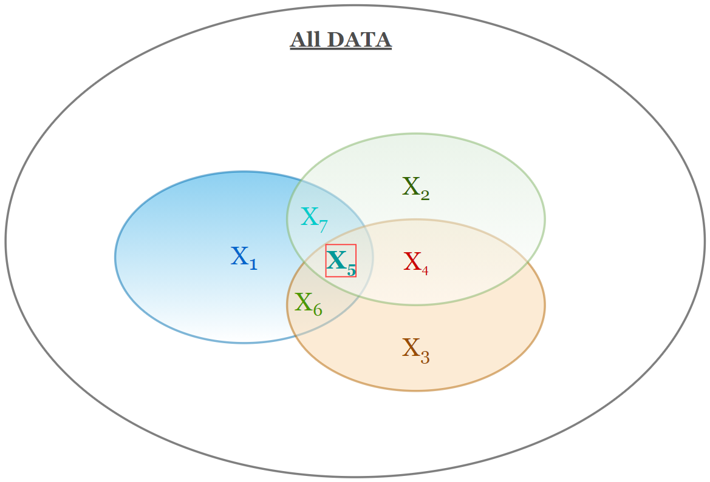

<u>**Example 4**</u>

**Filter fold:** unix_secs=202010261000,202010261001&addr=1.1.1.1,2.2.2.2

Assuming that :

**X1**= unix_secs

**X2** =srcaddr

**X3**=dstaddr

and

addr=srcaddr or dstaddr  (see table above)

then

**X1 & (X2 or X3) = X5+X6+X7**.

The filtration result is shown in the figure below.

 

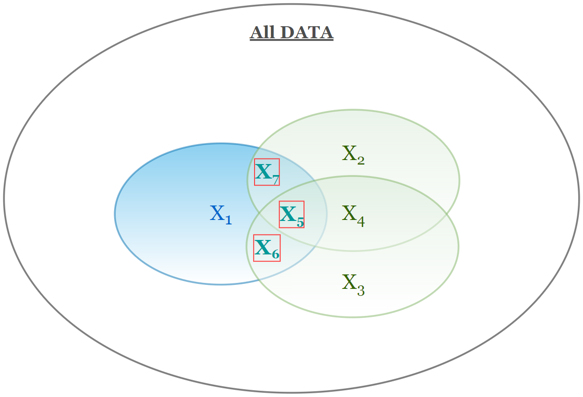

### 2.2 Data Specific Selection Tab

When creating any selections, the configuration output will be shown in a form of tabs. Each individual component of the tab can be managed separately. In order to deselect, press the     button on the tab.

  <b>Smart search </b> clicking this option will pop up a type in section, where any phrase can be typed in that is being looked for. This system automatically suggests options while typing.

 <b> Step back </b> - clicking this option will take a step back in data selections.

  <b>Step forward </b> - clicking this option will take a step forward in data selections.

  <b> Clear all selections </b> - this option will clear every data selection made.

**Bookmark** - this option is a shortcut to the users filter parameters

### 2.3 Visualization Options

This system will present the data, metrics and outcome of a configured rule set in different graphical forms according to the data granularity and metric structure. The presentation layer is configured according to the best practice in the data presentation techniques.

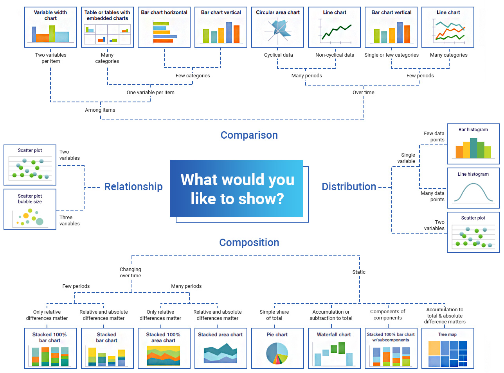

### 2.4 Visualization Drill Down

### 2.4.1 Drill Down Options

Depending on the specific dashboard and widget chosen, this system allows different drill down options. The universal method is clicking over any chart, graph or table where the user will be prompted with:

- **Exploration menu** - clicking this option will pop up an exploration menu. This is the place where users can adjust the graph, table or chart to their own needs. Options available for change are as follows: data to be shown, way of sorting data, presentation of given graph, chart or table, colors and legend.

- **Full screen** - clicking this option, it will take user to the full screen mode of the graph, table or chart. This option is most widely used among mentioned three. This will allow to view more detailed information. In order to exit the full screen mode, presswhen in full screen mode.
- **Export** - Preconfigured export options:

  - Export as an image,

  - Export to PDF,

  - Export data.

In some sections, there is a possibility to select data by choosing from drop down menus:

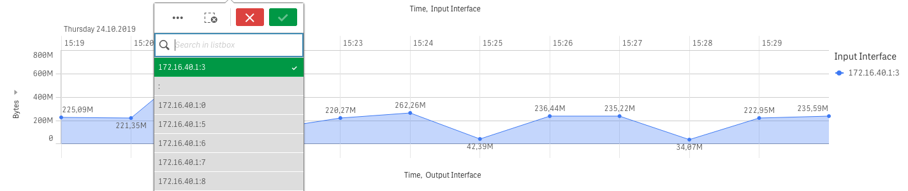 

This system allows users to type in a searched phrase or select it from the drop down menu. Please remember that depending on the data chosen, fields will change color according to the data availability, suggesting to users which data types are aligned.

### 2.4.2 Visual Data Extraction

The first thing to notice when working with charts is that when users hover their mouse over any bar/data point it will show more details regarding that specific data.  

When clicking on bars, they will be selected. You can click on multiple bars in order to view only them in the chart. In order to confirm the selection, please press the green button on the top right corner. If data is presented on multiple elements of the dashboard, users’ selection on one plot will impact data presentation on others according to the selection made.

This system has drop down menus on the left-hand side and at the bottom of the chart (X/Y axes). They can be adjusted (if possible) to show different data types. There is also a lasso selection option available in the top right corner  This allows users to draw a line which, when passing through data it will select it accordingly.

Data from graphs can be selected by clicking and dragging just below the x axis, i.e. vertically, to select narrowed, i.e. period of time.

 Data can also be selected just by clicking and dragging the y axis, i.e. horizontally. This will allow to check for the details of highest data used.

### 2.4.3 Exact Values Search

 Tables are the most precise way of presenting data gathered because it shows exact values and measures.

 

 

There are two ways of selecting data in tables. The first one is by clicking on the magnifier icon next to a chosen heading, e.g. Source Host. The drop down menu will pop up where users can either search for a desired source host or by simply scrolling down and looking for it manually, then by clicking it. In order to accept the selection, press the green button. After making a selection, all data will be adjusted. The second option is to simply click the desired data in the table.  

## 3. System Status

This system provides information about its current status and performance. This information is divided into two main sections, Flows and System Statistics.

### 3.1 Flows Stats

FlowControl actively counts the number of raw and deduplicated flows giving users overview on the current network load of the system. This information is very useful for proper license sizing of the solution. 

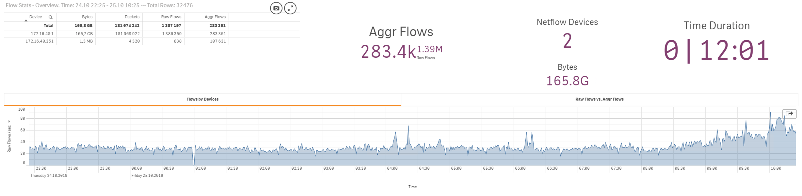

###  3.2 System Status

This System monitors disk space of the application in real time which is crucial for sizing and maintenance of the solution. Monitored disk space is divided into 3 functional sections:

- Disk Utilization.
- Actual Free Disk Space.
-  Free space on Cache Partition. 
-  Free space on Database Partition.
-  Free space on System Partition.

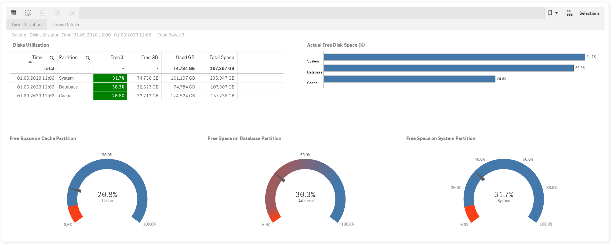

 

​	