## Introduction

In this document you will find information about the most important options available in the FlowControl System. How to operate with data, graphs and charts as well as a general description of options available in the system. 

## System Architecture

> A flow is defined as a unidirectional sequence of packets with some common properties that pass through a network device.  These collected flows are exported to an external device, the NetFlow collector.  Network flows are highly granular e.g.: flow records include details such as IP addresses, packet and byte counts, timestamps, Type of Service (ToS), application ports, input and output interfaces, etc.

Source: [RFC3954](https://www.ietf.org/rfc/rfc3954.txt)

According to the RFC3964 FlowControl solution works as a Flow Collector which collects, analyzes and visualize the collected flows. Metrics are presented and examined from two perspectives: Network and Security giving the operator valuable input into network/application problems analysis as well as security threats hunting. 


FlowControl supports the following flow protocol data sources: 

- NetFlow 

- sFlow, 

- IPFIX,

- NSEL.


> **Note:** Specific options such as NSEL (Cisco ASA) or different sampling multipliers per device must be additionally configured. System uses SNMP v1/2/3 to query devices. the above fields are handled from the ver. 1.6 of the FlowControl system. In order to analyze the historical data collected  in previous versions of the system, the handling of all additional  fields in the N Mentions must be disabled


## 1. Overview

The main option to configure the solution is the web GUI. The most important thing to notice when working with the FlowControl System are the menus on the left-hand side (**XN, XNS, XND, XNR, SYS**) and the icons in the top right corner  (**Configuration options**). They are all vital components for working with the system, effective problem identification and data mining.


### 1.1 Main

On the left side there are four main sections: XN, XNS, XND, XNRand SYS. Each section consists of a menu where you will find desired information about collected data and system configuration. The main section works in hide/reveal mode. In order to show full names of the menu components, minority and majority please click on the minority sign icons ( < ) located at the top left corner. In order to hide the menu, please click the minority sign icons ( > ).


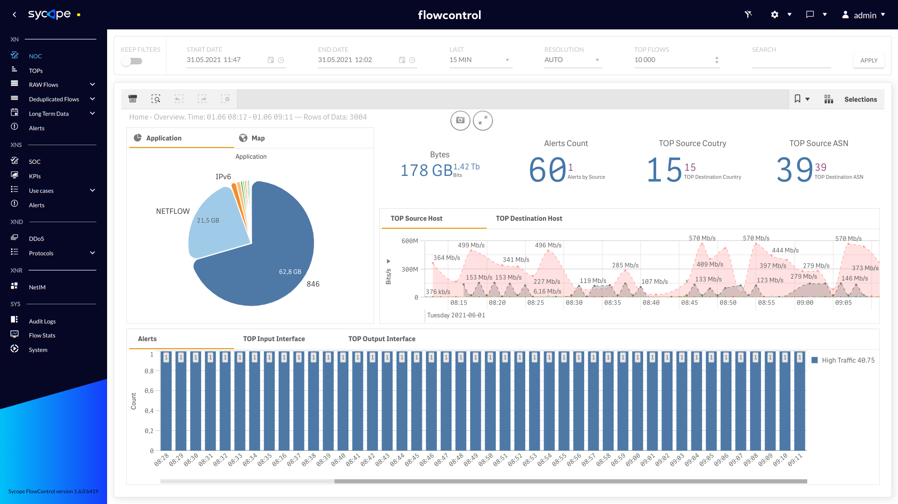


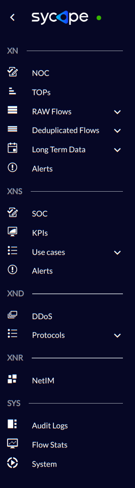


Below is presented table with general description of what can be found in each section. Elements of the main menu were emphasized, while elements of the submenu were written in plain text.

| **FlowControl XN**                                           | Description                                                  |
| ------------------------------------------------------------ | ------------------------------------------------------------ |
|   <u><b> NOC </b></u> | General overview of network infrastructure parameters        |
|   <u><b> TOPs </b></u> | Information about top talkers in the network.                |
|   <u><b> RAW Flows </b></u> | Detailed information about traffic.                          |
|    **Raw Data** | Extensive information about every flow in the traffic.       |
|    **ASA Devices** | Detailed information about flows from ASA Devices.           |
|    <u>**Deduplicated Flows**</u> | Information about deduplicated flows.                        |
|    **Traffic** | Network traffic based on deduplicated flows.                 |
| **   Applications** | Network traffic analysis in view of application based on deduplicated flows. |
|   **Geolocalization** | Maps with various geolocations.                              |
|  <b> Groups </b> | Flows organized into various groups, e.g. business roles, location. |
|    **AS Names** | Flows organized according to AS Names.                       |
|    <u>**Long Term Data**</u> | Aggregated date from previous time periods.                  |
|   **Last Day** | Aggregated data from last day.                               |
|   **Last Week** | Aggregated data from last week.                              |
|   **Last month** | Aggregate data from last month                               |
| <u><b>  Alerts  </b></u> | Information and details about alerts that occurred in the network. |

> **Note:** All views except **Raw Data** use deduplicated traffic. In order to see unique information about flows that may change on the flow path, e.g. QoS tags – please use **Raw Data** views. 

---


| **FlowControl XNS**                                          | Description                                            |
| ------------------------------------------------------------ | ------------------------------------------------------ |
|   <u><b> SOC </b></u> | General overview of security aspects of the network.   |
|   <u><b> KPIs </b></u> | General overview of the basic values of alerts.        |
|    <u>**Use Cases**</u> | Monitoring scenarios of IT security threat.            |
|   <b> Threat Analysis </b> | Information on all threats.                            |
|   <b> External Threats</b> | Information on threats outside the customer network.   |
|   <b> Internal  Threats</b> | Information on threats inside the customer network.    |
|   <u><b> Alerts  </b></u> | Table with all information about alarms in the system. |

---


| **FlowControl XND**                                          | Description                                                  |
| ------------------------------------------------------------ | ------------------------------------------------------------ |
|  <u><b> DDOS </b></u> | Information about DDoS attacks.                              |
|  <u><b> Protocols</b></u> | Network traffic characteristics in the context of DDoS attacks. |
| <b> Overview </b> | Network traffic characteristics in the context of protocols. |
|  **Details** | Detailed information about DDoS attacks.                     |


---


| **System Section**                                           | Description                                        |
| ------------------------------------------------------------ | -------------------------------------------------- |
|  **Audit Logs** | Information on users logins.                       |
| <b> Flow  Stats </b> | General statistics about raw and aggregated flows. |
| <b> System  </b> | Disk utilization information.                      |


The **DOT** on the right side of the logo (as shown below) indicates the system status, in this case system events and network alerts.     


The **DOT** takes on four colors depending on the event/alert:

- **green**,
- **yellow**,
- **red**,
- **blue**.

When the color of the dot changes, a popup appears with the text describing the event. When an event occurs, apart from the fact that it is indicated by a change of color of the dot, a window pops up in the lower right corner of the screen with information about the  event/alarm.


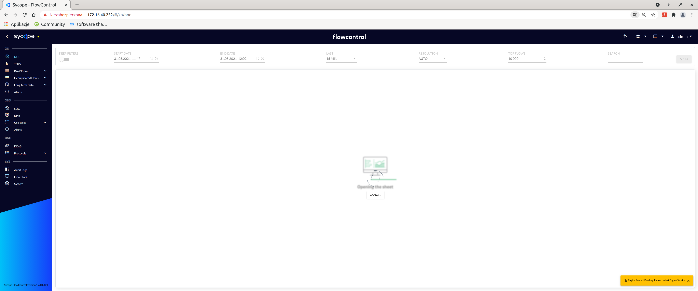


 Event/alarm information is also available by pointing the dot with the mouse pointer.


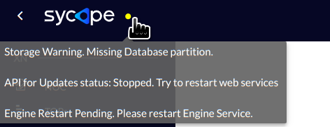


Below is a list of all events/alerts that are indicated by the dot:

| Message                                                      | Color  |
| ------------------------------------------------------------ | ------ |
| System does not signal any events/alerts.                    | green  |
| "API for Updates status: Stopped. Try to restart web services" | yellow |
| "API for SNMP status: Stopped. Try to restart other services" | yellow |
| "API for Restarts status: Stopped. Try to restart other services" | yellow |
| "API for Configs status: Stopped. Try to restart web service" | yellow |
| "Storage Warning. Missing Database partition."               | yellow |
| "Storage on Database partition is less than 5GB."            | yellow |
| "Storage on Cache partition is less than 5GB."               | yellow |
| "Storage on System partition is less than 5GB."              | yellow |
| "Engine Restart Pending. Please restart Engine Service"      | yellow |
| "API for Authentication status: Stopped. Try to restart web services" | red    |
| "API for Reloads status: Stopped. Try to restart web services" | red    |
| "Database Services status: Stopped (Running $QlikServicesCount/8). Try to restart database" | red    |
| "Engine Fatal Error. Netflow Engine status: $Engine. Try to restart engine" | red    |
| "Storage Fatal Error. Missing Cache partition. Restart server is required." | red    |
| "ESXi CPU Configuration Error. Logical CPUs are less than 8. There should be max 2 sockets on Esxi CPU configuration. Actual logical CPUs: $cores" | red    |
| "New Update is available for download. $updateVersion."      | blue   |


### 1.2 Configuration

On the right-hand side of the system there are three drop-down menus and one switch . The switch  is used to hide the date selection and overload bar. The first menu, marked with this icon  , is the settings menu available only for admin accounts. This section is described in the *Administration Settings* paragraph. The second drop-down menu, marked with , is available for all users. Things that can be found in this section are :

- License Info,
- User Guide,
- Documentation,
- About. 


The license is delivered as a text file. To activate the license, the text from the delivered file must be copied into to the field “Add License” [settings menu/config/license] as below.

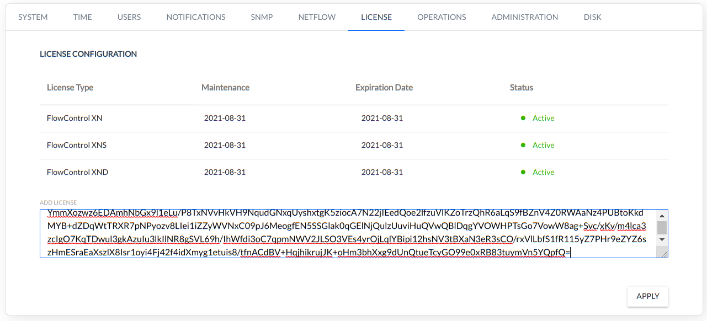


> **Important note:**
>
>  **The standard license includes one administrator account and two user accounts.**


> **Notice:**
>
> If there is **no license** in the system it is not possible to: 
>
> - add user, 
> - update software, 
> - collect Netflow.


The user guide will redirect users to the documentation stored on the system. The about section system will take users to the general web page with information about https://www.sycope.com/.

The third drop down menu, available for all users. In this menu the following things can be found:

 -   Profile

      -  User Settings
      -  Change Password
      -  User Time Zone

 -   Logout

     

### 1.3 Administration Settings

The administrator can change and personalize various aspects of the FlowControl environment. Configuration options that can be set up in this menu are the options required to properly configure and maintain the FlowControl system.

The following options are available for selection in the administration menu:

- **Alerts**
- **Config**
- **Security**
- **Mapping**
- **Reports**

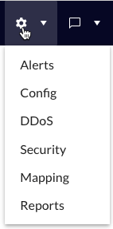


### 1.3.1 Alerts

There are two tabs available in the Alerts menu:

- **Alerts**

- **Notifications**

  

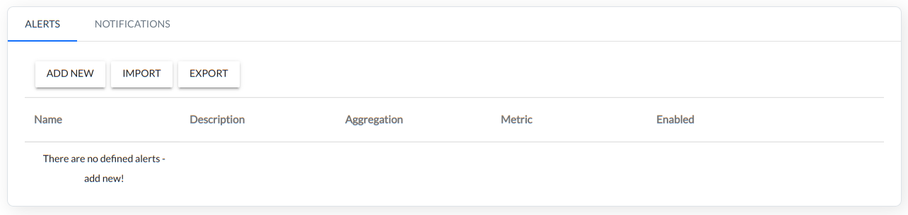

#### 1.3.1.1 Alerts tab

From version 1.6 FlowControl provides an advanced alarm wizard that allows the user to flexibly configure alarms based on multiple aggregations, parameters/fields, metrics, using a number of operators.

The alarm configuration consists of four steps:

1. **INITIAL**
2. **OBJECT FILTER**
3. **METRICS**
4. **SUMMARY**

To configure alarm in the first step, add a new alarm ADD NEW in the ALERTS tab.


The wizard is started - a window appears with the first step of alarm configuration.

**1. INITIAL**

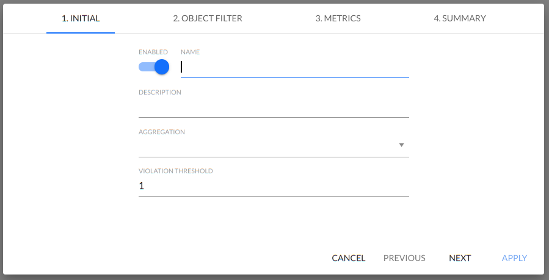

At this point, the system provides four fields:

- ENABLE - Alarm activation/deactivation,
- NAME - user assigned alarm name,
- DESCRIPTION - alarm description (optional),
- AGGREGATION - select the aggregation on which the alarm is based: 
  - Conversation,
  - Exporter,
  - Total,
  - Apps
  - Ip Bidirectional,
  - BGP AS,
  - Interface Bidirectional.


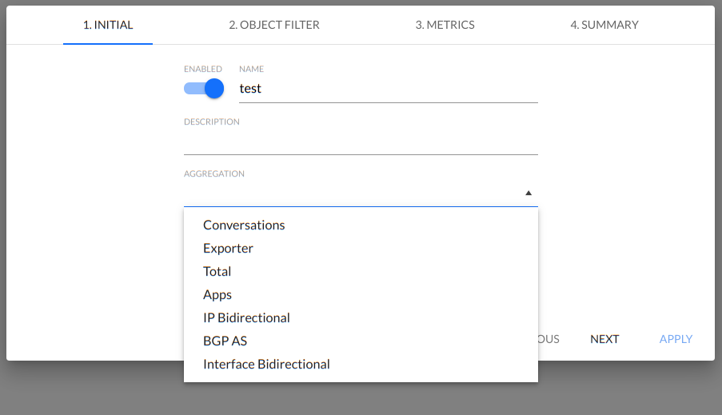


- VIOLATION THRESHOLD - This field indicates how many intervals (minutes) the alarm parameters must be exceeded for a given alarm to be triggered.

- ENABLE - switch used to alarm enable/disable.

  


After accepting the first configuration step APPLAY, NEXT is used to start the second configuration step.

**2. OBJECT FILTER**

Each aggregation in the system has a number of parameters/fields and metrics based on which a filter can be created such as SRIP, DSTIP and so on. In this step the user can select parameters and combine them with filters and logical operators.

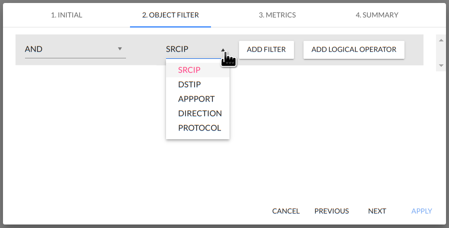


The following is a list of available aggregations with their associated parameters/fields and metrics.

| Agregation              | Parameter/Field                                              | Metric                                                       |
| ----------------------- | ------------------------------------------------------------ | ------------------------------------------------------------ |
| Conversation            | srcip   <br/>dstip   <br/>appport   <br/>direction   <br/>protocol | flows   <br/>packets   <br/>octets                           |
| Exporter                | exporterip   <br/>inputint   <br/>outputint   <br/>mplstoplabelexp   <br/>type   <br/>mplslabel1   <br/>mplslabel2   <br/>mplslabel3   <br/>mplslabel4   <br/>mplslabel5 | flows   <br/>packets   <br/>octets                           |
| Total                   | -                                                            | flows   <br/>packets   <br/>octets                           |
| Apps                    | appport   <br/>direction   <br/>proto                        | flows   <br/>packets   <br/>octets                           |
| IP Bidirectional        | ip                                                           | octetsin   <br/>octetsout   <br/>flowsin   <br/>flowsout   <br/>packetsin   <br/>packetsout |
| BGP AS                  | srcas <br/>dstas                                             | flows   <br/>packets   <br/>octets                           |
| Interface Bidirectional | exporterip <br/>int                                          | octetsin   <br/>octetsout   <br/>flowsin   <br/>flowsout   <br/>packetsin   <br/>packetsout <br/>utilin<br/>utilout |


In turn, to each parameter/field are assigned appropriate operators such as EQUALS, NOT EQUALS, MATCHES and so on.

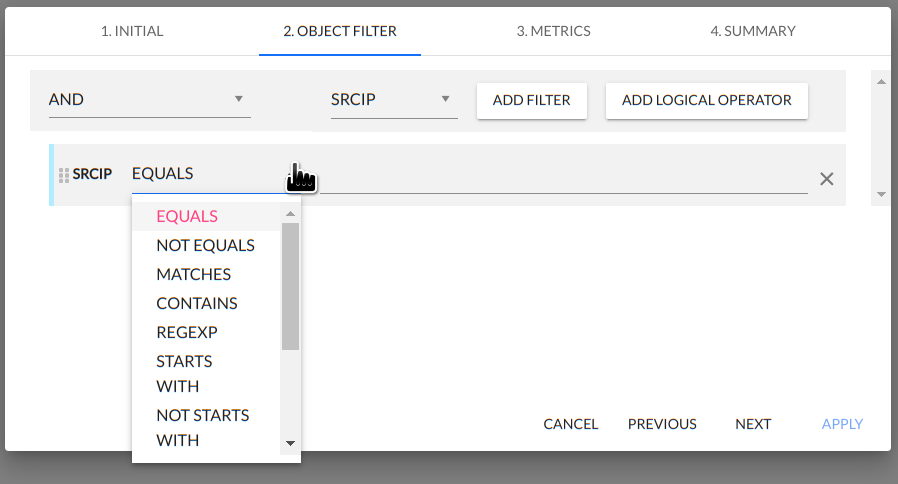


The following is a list of operators associated with the relevant parameters/fields:

| Parameter/Field | Operator                                                     |
| --------------- | ------------------------------------------------------------ |
| srcip           | equals<br/>not equals <br/>matches <br/>contains <br/>regexp<br/>starts with<br/>not starts with<br/>ends with <br/>not ends with<br/>is in subnet <br/>is not in subnet |
| dstip           | equals<br/>not equals <br/>matches <br/>contains <br/>regexp<br/>starts with<br/>not starts with<br/>ends with <br/>not ends with<br/>is in subnet <br/>is not in subnet |
| appport         | lower than <br/>lower or equal than <br/>greater than<br/>greater or equal than<br/>equals<br/>not equals <br/>matches<br/>contains<br/>regexp <br/>starts with<br/>not starts with<br/>ends with<br/>not ends with |
| direction       | lower than <br/>lower or equal than <br/>greater than<br/>greater or equal than<br/>equals<br/>not equals <br/>matches<br/>contains<br/>regexp <br/>starts with<br/>not starts with<br/>ends with<br/>not ends with |
| protocol        | lower than <br/>lower or equal than <br/>greater than<br/>greater or equal than<br/>equals<br/>not equals <br/>matches<br/>contains<br/>regexp <br/>starts with<br/>not starts with<br/>ends with<br/>not ends with |
| exporterip      | equals<br/>not equals <br/>matches <br/>contains <br/>regexp<br/>starts with<br/>not starts with<br/>ends with <br/>not ends with<br/>is in subnet <br/>is not in subnet |
| inputint        | lower than <br/>lower or equal than <br/>greater than<br/>greater or equal than<br/>equals<br/>not equals <br/>matches<br/>contains<br/>regexp <br/>starts with<br/>not starts with<br/>ends with<br/>not ends with |
| outputint       | lower than <br/>lower or equal than <br/>greater than<br/>greater or equal than<br/>equals<br/>not equals <br/>matches<br/>contains<br/>regexp <br/>starts with<br/>not starts with<br/>ends with<br/>not ends with |
| int             | lower than <br/>lower or equal than <br/>greater than<br/>greater or equal than<br/>equals<br/>not equals <br/>matches<br/>contains<br/>regexp <br/>starts with<br/>not starts with<br/>ends with<br/>not ends with |
| mplstoplabelexp | lower than <br/>lower or equal than <br/>greater than<br/>greater or equal than<br/>equals<br/>not equals <br/>matches<br/>contains<br/>regexp <br/>starts with<br/>not starts with<br/>ends with<br/>not ends with |
| type            | lower than <br/>lower or equal than <br/>greater than<br/>greater or equal than<br/>equals<br/>not equals <br/>matches<br/>contains<br/>regexp <br/>starts with<br/>not starts with<br/>ends with<br/>not ends with |
| mplslabel1      | lower than <br/>lower or equal than <br/>greater than<br/>greater or equal than<br/>equals<br/>not equals <br/>matches<br/>contains<br/>regexp <br/>starts with<br/>not starts with<br/>ends with<br/>not ends with |
| mplslabel2      | lower than <br/>lower or equal than <br/>greater than<br/>greater or equal than<br/>equals<br/>not equals <br/>matches<br/>contains<br/>regexp <br/>starts with<br/>not starts with<br/>ends with<br/>not ends with |
| mplslabel3      | lower than <br/>lower or equal than <br/>greater than<br/>greater or equal than<br/>equals<br/>not equals <br/>matches<br/>contains<br/>regexp <br/>starts with<br/>not starts with<br/>ends with<br/>not ends with |
| mplslabel4      | lower than <br/>lower or equal than <br/>greater than<br/>greater or equal than<br/>equals<br/>not equals <br/>matches<br/>contains<br/>regexp <br/>starts with<br/>not starts with<br/>ends with<br/>not ends with |
| mplslabel5      | lower than <br/>lower or equal than <br/>greater than<br/>greater or equal than<br/>equals<br/>not equals <br/>matches<br/>contains<br/>regexp <br/>starts with<br/>not starts with<br/>ends with<br/>not ends with |
| srcas           | lower than <br/>lower or equal than <br/>greater than<br/>greater or equal than<br/>equals<br/>not equals <br/>matches<br/>contains<br/>regexp <br/>starts with<br/>not starts with<br/>ends with<br/>not ends with |
| dstas           | lower than <br/>lower or equal than <br/>greater than<br/>greater or equal than<br/>equals<br/>not equals <br/>matches<br/>contains<br/>regexp <br/>starts with<br/>not starts with<br/>ends with<br/>not ends with |


The system has a very flexible mechanism for creating rules. Individual rows of rules can be nested and combined using operators, depending on the user's needs and creating complex/expanded expressions.

Relationships between rows can be specified using the three operators AND, OR, and NOT.


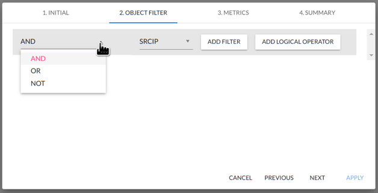


It is possible to move the rows and swap positions by clicking and holding the left mouse button on the left side of the row. 


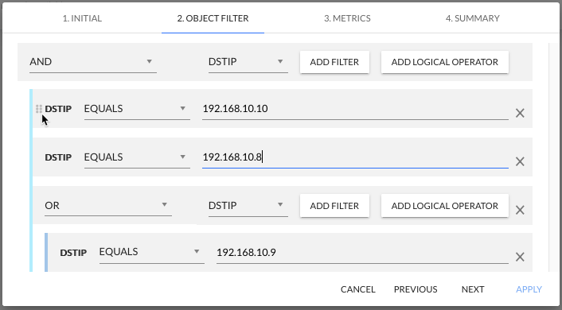


In the example above, the logical expression for the alarm is as follows:

ALARM=(DSTIP EQUALS to 192.168.10.10) AND (DSTIP EQUALS to 192.168.10.8)  OR (DSTIP EQUALS to 192.168.10.9) 

The third configuration step allows the user to select metrics for the filters previously configured in step two.

**3. METRICS**

This configuration step allows to configure the alarm triggers by specifying a metric value for a pre-selected aggregation, an alarm trigger operator, and specifying value levels for the three alarm levels.


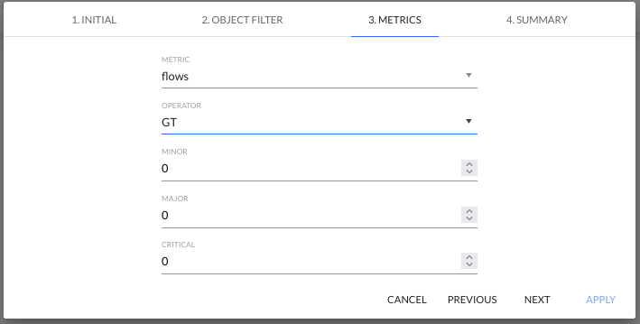


In this step, specify the parameters for the following fields:

- METRICS
  - flows,
  - packets,
  - octets.
- OPERATOR
  - GT - greater than,
  - LT - lower than.
- MINOR - numerical value for the minor alarm threshold  
- MAJOR - numerical value for the major alarm threshold 
- CRITICAL  - numerical value for the critical alarm threshold 


**4. SUMMARY**

The window in step four shows a summary of the most important parameters for the alarm being configured :


- NAME - Alert name.
- ACTIVE - status Enable/Disable.
- AGGRATION - Alert selected aggregation.
- METRICS - Alert selected metric.
- CONSECUTIVEVIOLATIONS  is equal to VIOLATION THRESHOLD - This field indicates how many intervals (minutes) the alarm parameters must be exceeded for a given alarm to be triggered.

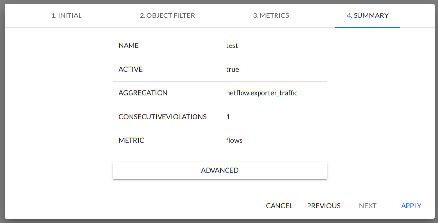


After confirming the configuration process with APPLY button, the configured alarm appears in the list of created alarms.

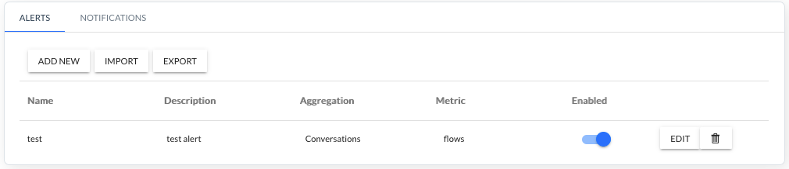


> NOTE: After accepting the alarm configuration (APPLY), RESTART Engine Service must be performed to activate the alarm:
>
> 

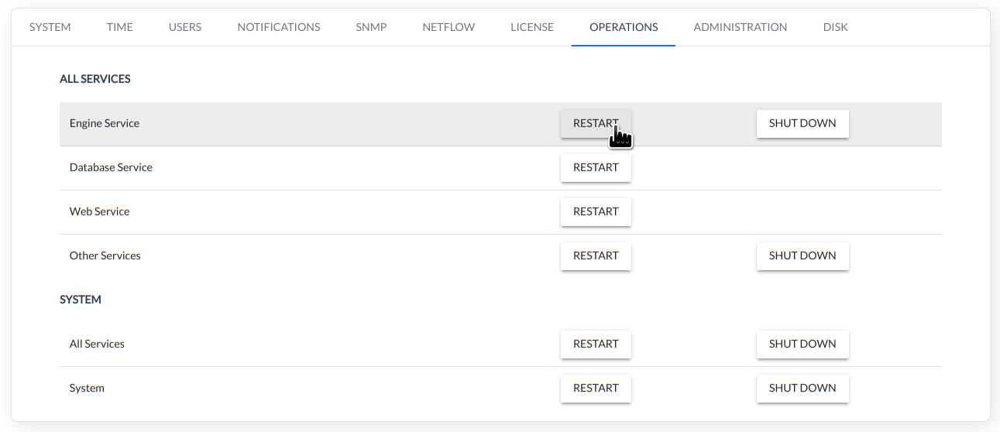


- ADVANCE - Configure an alarm by importing a JSON script.

  The FlowControl system allows to configure the alarm by importing a file in JSON format. The ADVANCE button opens a window with the alarm configuration in JSON format.

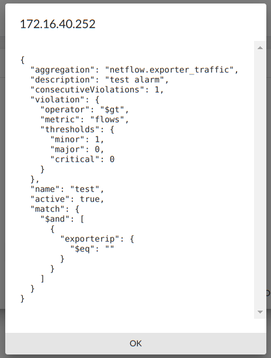

Example script:

```json
{
  "aggregation": "netflow.exporter_traffic",
  "description": "test alert",
  "match": {
    "$and": [
      {
        "exporterip": {
          "$eq": "192.168.10.101"
        }
      }
    ]
  },
  "violation": {
    "operator": "$gt",
    "metric": "flows",
    "thresholds": {
      "minor": 2,
      "critical": 0,
      "major": 0
    }
  },
  "name": "import_test",
  "active": true,
  "consecutiveViolations": 1
}
```

The script prepared and saved to disk as a file is imported using THE IMPORT button.

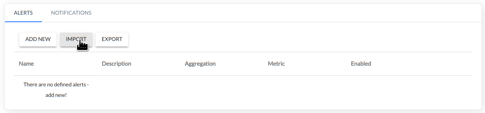


After the import of the script the alarm appears in the list of created alarms. The imported alarm can be edited in the same way as the alarm created by the configurator.

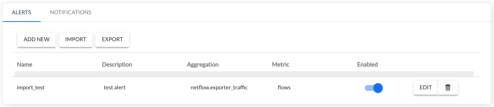


The current alarms status (new/ongoing/update/closed) is shown in the graphs on the XN->Alert->Overview  view.

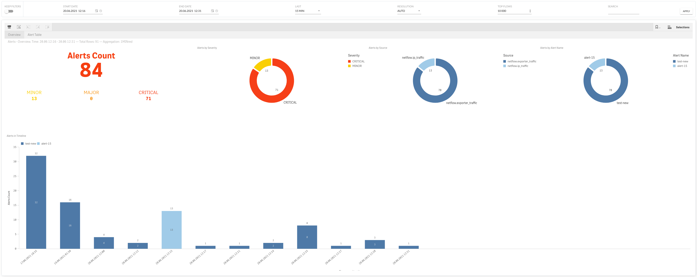


The current alarms status with configuration parameters is also available in tabular form shown in XN->Alert->Alert Table

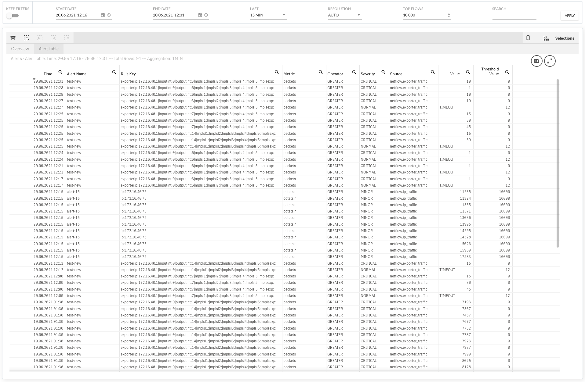


#### 1.3.1.2 Notification tab

FlowControl has extensive alarm notifications capabilities which are configured in the NOTIFICATION tab. To add a new notification, use the ADD NEW button.

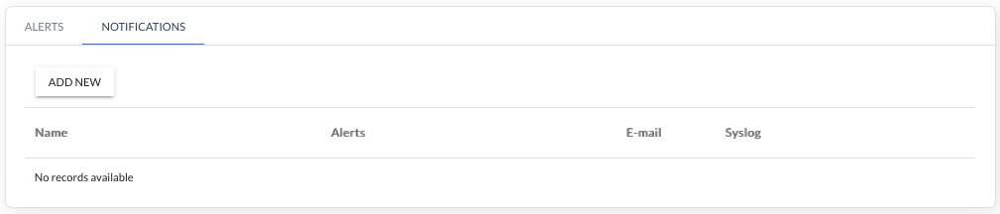

Then the Notification Configuration window opens.


The pane has the ability to fill in the following fields:

- NAME - User-defined notification name 
- TIME RANGE - the times when notifications are activeadresy 
- ALERTS - Alarm(s) to be notified 
- SOURCE - User-defined name of alarm source(s)
- SEVERITY 
  - MINOR
  - MAJOR
  - CRITICAL
- E-MAIL RECIPENTS - e-mail addresses to which notifications should be sent
- ENABLE switch - enable or disable the sending of notifications to the entered e-mail addresses 
- SYSLOG switch - enable or disable the sending of notifications to syslog
- VISUAL NOTIFICATION switch - enable or disable pop-up notifications 


Here is an example of a filled window with notification configuration:

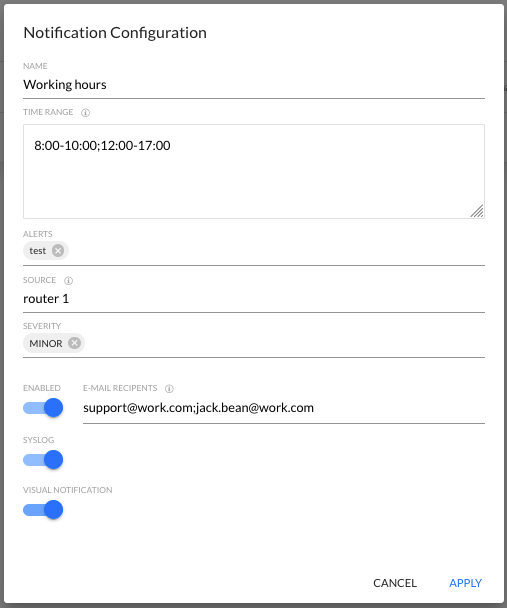


After the configuration is confirmed with the APPLY button, the notification appears on the list of created notifications.

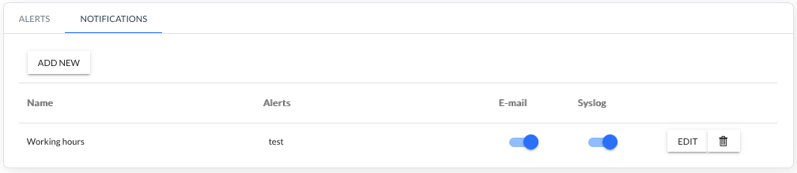


Enabling or disabling the sending of notifications to e-mail addresses and Syslog is also possible using the switches on the notification list.

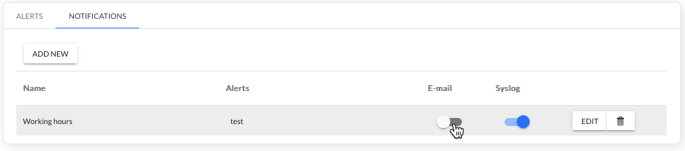

### 1.3.2 Config

In the **Config** section users can configure main system aspects. Options available here are:

- SYSTEM
- TIME
- USERS
- NOTIFICATIONS
- SNMP
- NETFLOW
- LICENSE
- OPERATIONS
- ADMINISTRATION
- DISK

#### 1.3.2.1 SYSTEM  

Basic network configuration: Hostname, DNS and IPv4, IPv6 address, DHCP and Gateway.

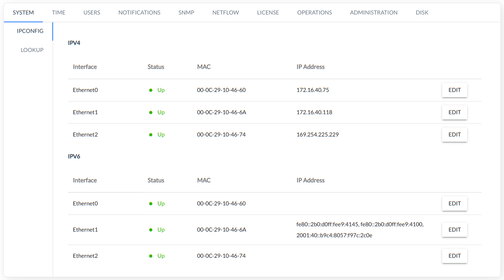


- IPCONFIG

  The interface configuration is shown in the figure below:	

  

- LOOKUP - FlowControl system engine DNS configuration.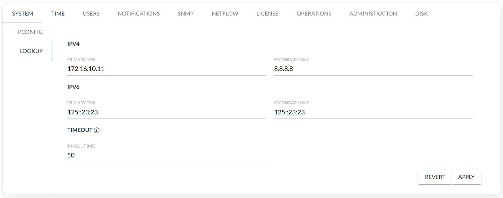


#### 1.3.2.2  TIME

 Manual or NTP server configuration.

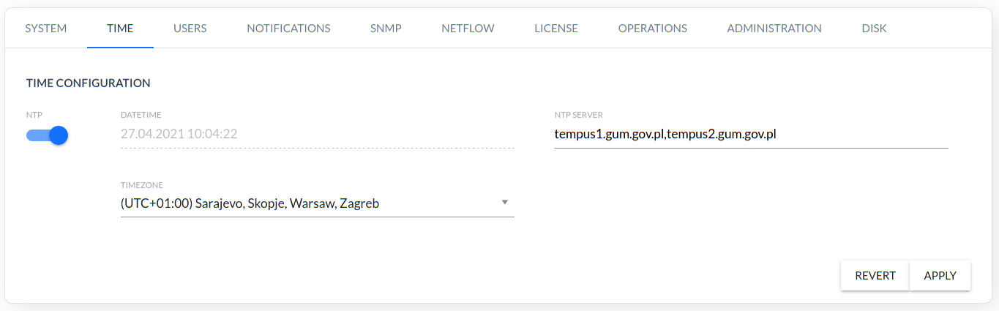


#### 1.3.2.3 USERS

System user configuration and role assignment.


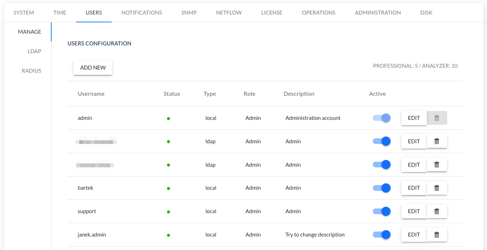


#### 1.3.2.4 NOTIFICATION

Email, Syslog and SNMP trap configuration.

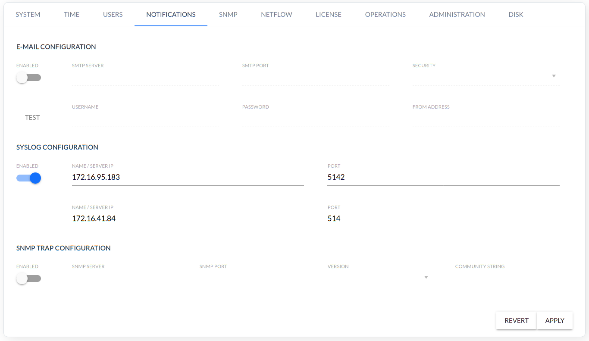


#### 1.3.2.5 SNMP

SNMP pooling configuration (supported options v1/v2c/v3).

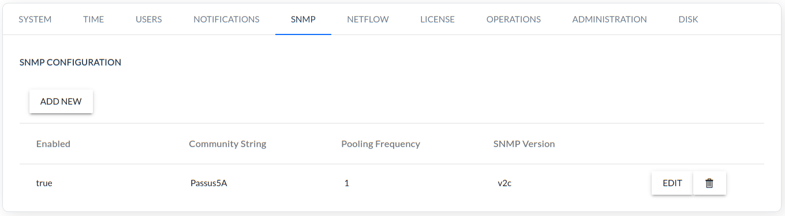


#### 1.3.2.6 NETFLOW

Configuration of NetFlow, sFlow, IPFIX, NSEL parameters.

- **CONFIGURATION**
  - NETFLOW CONFIGURATION - port to receive NetFlow packets
  - SFLOW CONFIGURATION - port to receive NetFlow packets
  - SAMPLING CONFIGURATION - NetFlow sampling rate

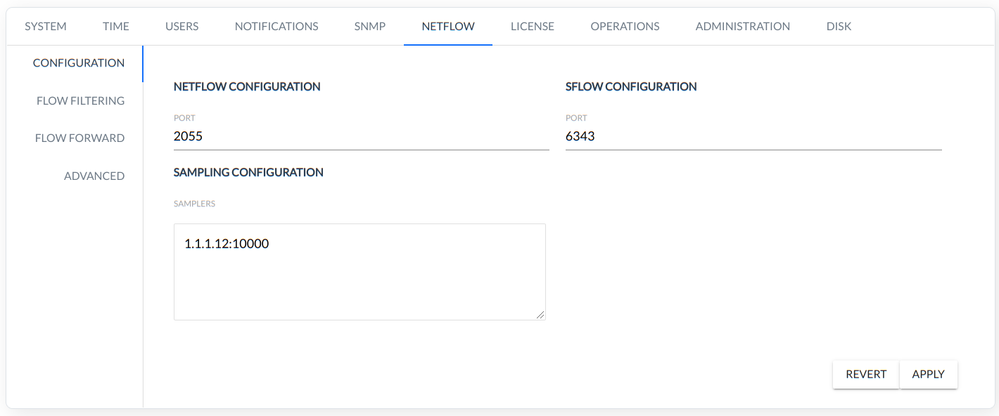


- **FLOW FILTERING**

  FlowControl  allows the user to create rules to limit the data collected by the system to the collection that the user needs. Using this option saves disk space and system resources as well as helps  to analyze data by operating only filtered data – which are critical to  the user.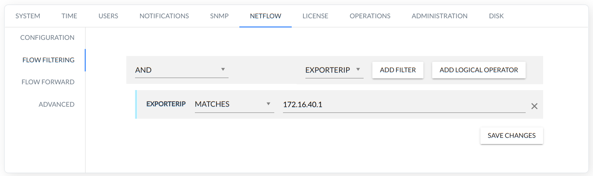
  
  The system has a very flexible mechanism for creating rules. Individual rows of rules can be nested and combined using operators, depending on the user's needs and creating complex/expanded expressions.
  
  When creating a filter rule, the user can use the following parameters/fields, each of which has its own set of operators.

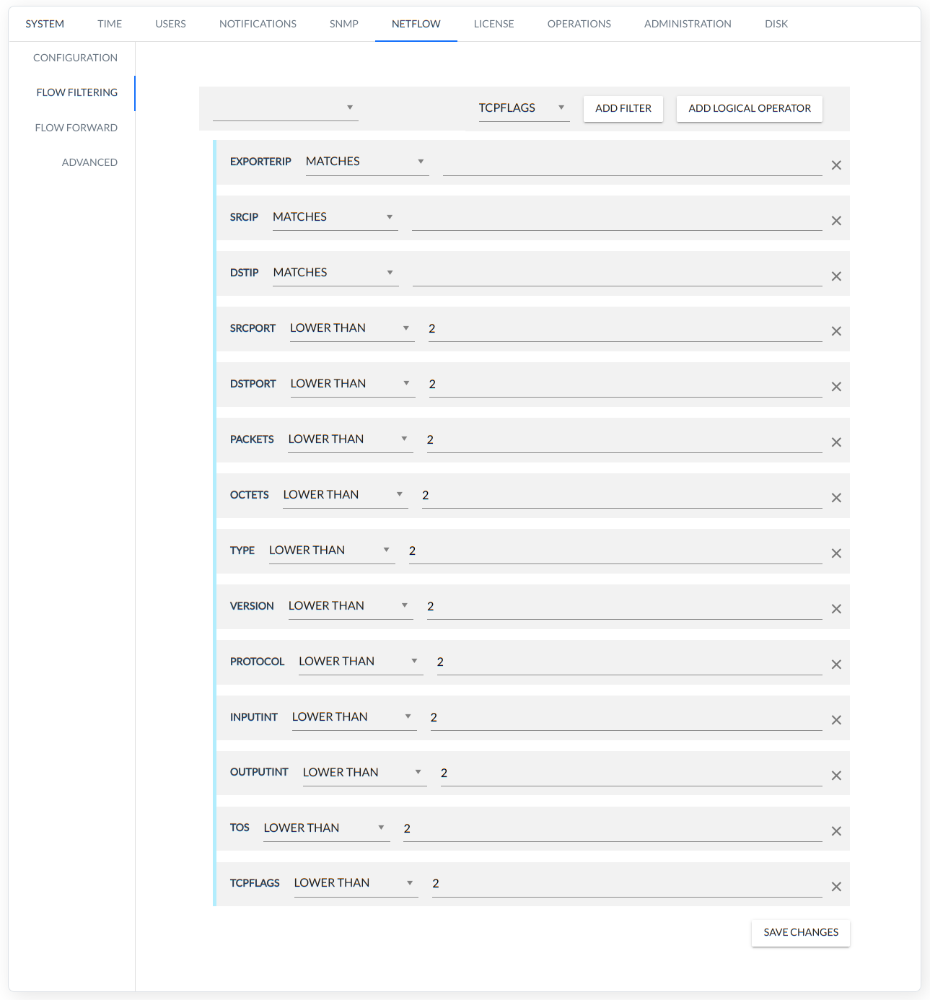


The following is a list of fields/parameters with their own operators.

| Parameter/Field | Operator                                                     |
| --------------- | ------------------------------------------------------------ |
| exporterIp      | matches <br/>contains <br/>regexp <br/>is in subnet <br/>is in range<br/>is in |
| srcIp           | matches <br/>contains <br/>regexp <br/>is in subnet <br/>is in range<br/>is in |
| dstIp           | matches <br/>contains <br/>regexp <br/>is in subnet <br/>is in range<br/>is in |
| srcPort         | lower than<br/>lower or equal than   <br/>greater than   <br/>greater or equal than   <br/>equals   <br/>not equals  <br/>is in |
| dstPort         | lower than<br/>lower or equal than   <br/>greater than   <br/>greater or equal than   <br/>equals   <br/>not equals  <br/>is in |
| packets         | lower than<br/>lower or equal than   <br/>greater than   <br/>greater or equal than   <br/>equals   <br/>not equals  <br/>is in |
| octets          | lower than<br/>lower or equal than   <br/>greater than   <br/>greater or equal than   <br/>equals   <br/>not equals  <br/>is in |
| type            | lower than<br/>lower or equal than   <br/>greater than   <br/>greater or equal than   <br/>equals   <br/>not equals  <br/>is in |
| version         | lower than<br/>lower or equal than   <br/>greater than   <br/>greater or equal than   <br/>equals   <br/>not equals  <br/>is in |
| protocol        | lower than<br/>lower or equal than   <br/>greater than   <br/>greater or equal than   <br/>equals   <br/>not equals  <br/>is in |
| input           | lower than<br/>lower or equal than   <br/>greater than   <br/>greater or equal than   <br/>equals   <br/>not equals  <br/>is in |
| output          | lower than<br/>lower or equal than   <br/>greater than   <br/>greater or equal than   <br/>equals   <br/>not equals  <br/>is in |
| tos             | lower than<br/>lower or equal than   <br/>greater than   <br/>greater or equal than   <br/>equals   <br/>not equals  <br/>is in |
| tcpFlags        | lower than<br/>lower or equal than   <br/>greater than   <br/>greater or equal than   <br/>equals   <br/>not equals  <br/>is in |


Relationships between rows can be specified using the three operators AND, OR, and NOT (ADD LOGICAL OPERATOR).

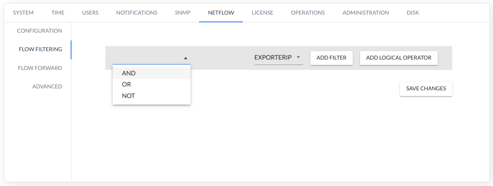              


It is possible to move the rows and swap positions by clicking and holding the left mouse button on the left side of the row.

By adding more filters and logical operator users can create complex filter expressions ( done similarly to the alert wizard).


Example filter rule:

FlowFilter rule = (EXPORTERIP MATCHES 172.16.40.1) NOT (SRCIP MATCHES 192.168.1.10)  NOT  (DSTIP MATCHES 10.10.10.10)

                                                                                                                    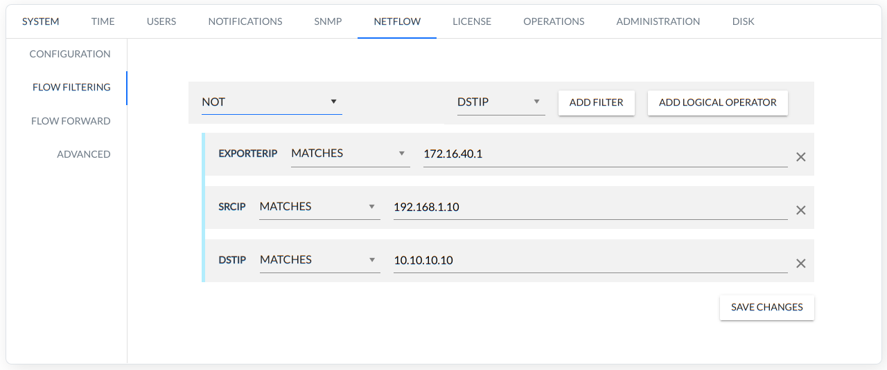

                                                                                                                  

- **FLOW FORWARD** - allows the NETFLOW stream to be forwarded to additional user-defined devices.

  

  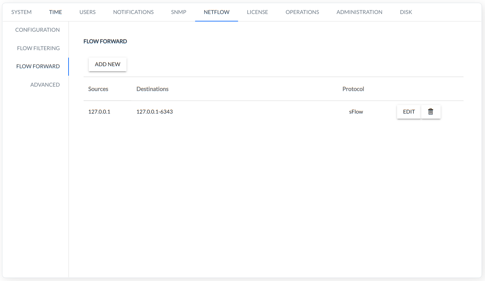

  

- **ADVANCED**

  This menu allows configure the handling of additional fields in NetFlow and IPFIX. All additional fields are <u>available only in the RawData menu</u>. 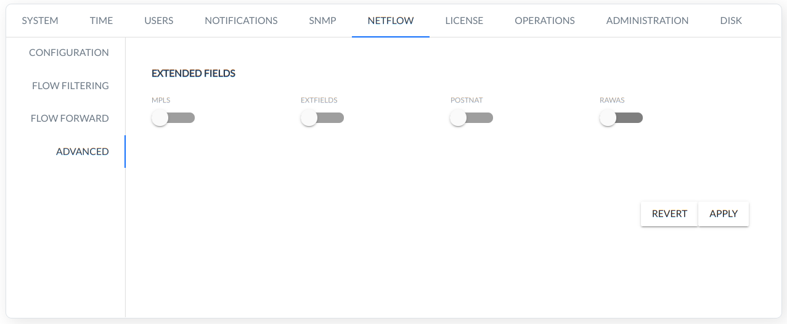
  
  
  
  The fields are divided into the following four group:
  
  - **MPLS**,
  
  - **EXTFIELD**,
  
  - **POSTNAT**,
  
  - **RAWS**.
  
  

> NOTE: The system-supported additional/extended fields must be configured on devices that have the ability to transmit these data using NETFLOW, IPFIX.


The **MPLS** group consists of the following additional fields:

- "MPLS Top Label Exp"

- "MPLS Label 1"

- "MPLS Label 2"

- "MPLS Label 3"

- "MPLS Label 4"

- "MPLS Label 5"


The **EXTFIELD** group consists of the following additional  fields:

- "Min Packet Length"

- "Max Packet Length"

- "Flow Label"

- "IPv6 Option Header"


The **POSTNAT** group consists of the following additional  fields:

- "NAT Source IP"

- "NAT Source Port"


The **RAWS** group consists of the following additional fields:

- "Raw Source Host AS Name"	

- "Raw Destination Host AS Name"
- "Raw Source Host AS Number"

- "Raw Destination Host AS Number"


The FC system can handle each of the above groups independantly by moving the corresponding switch  in the menu NETFLOW-ADVANCED to on (blue).


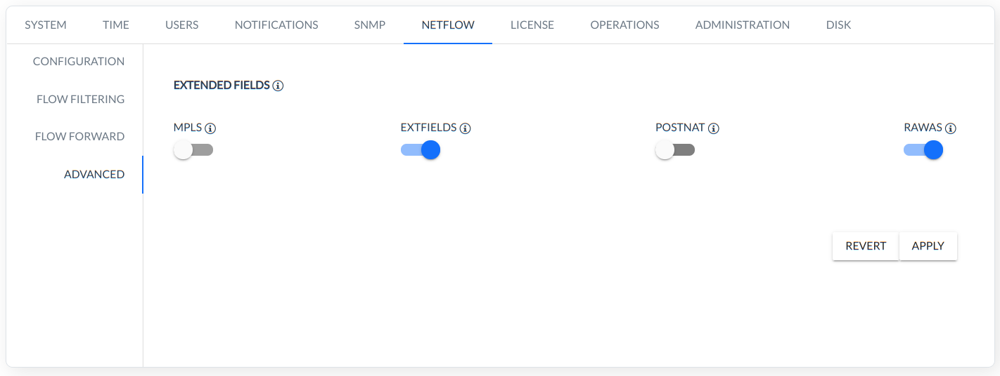

> **NOTICE**: The above fields are handled from the 1.6 version of the FlowControl system. In order to analyze the historical data collected in previous versions of the system, the handling of all additional  fields in the NETFLOW-ADVANCED must be disabled.


#### 1.3.2.7 LICENSE

License management.


#### 1.3.2.8 OPERATIONS

Application and system restart/shutdown options.

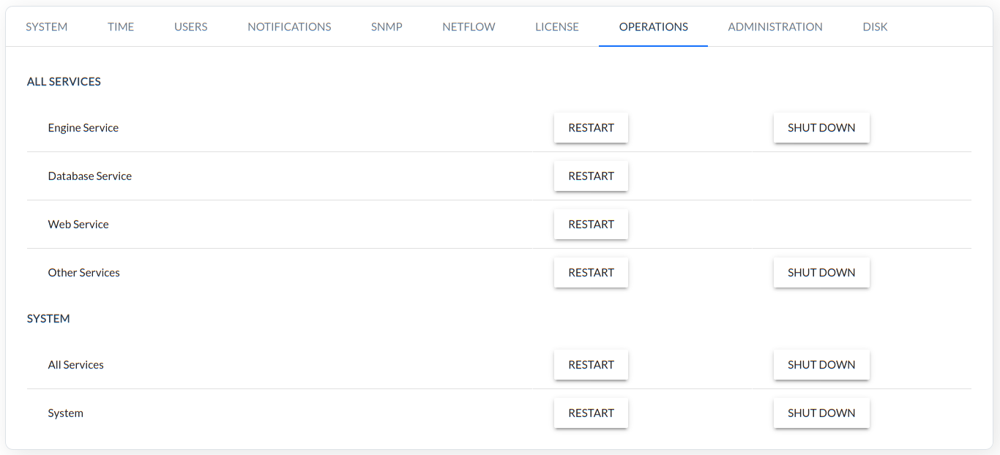


#### 1.3.2.9 ADMINISTRATION

System utilities such as update, backup, restore, logs.

There are 4 processes: Update, Backup, Restore, and Logs. All processes are dependant. Only one process can be completed at a time and if one process executes it blocks the others. In case, the system support expires, these processes will be blocked.

When the process started, its status appears in the pane and after the browser has been refreshed during the process, a status popup is appear

- ADMINISTRATION

  - UPDATE - This command is used to make an update to the latest version of the system.

    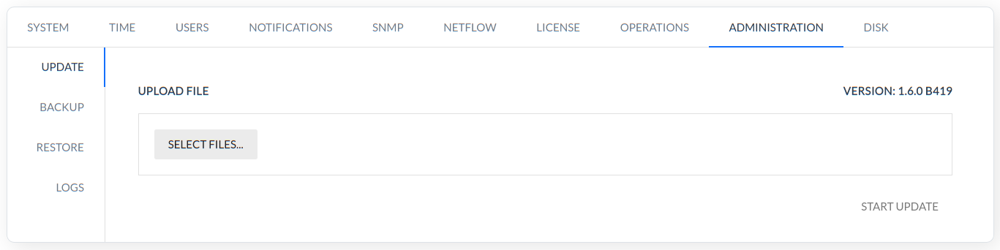

  - BACKUP - This command is used to generate backup.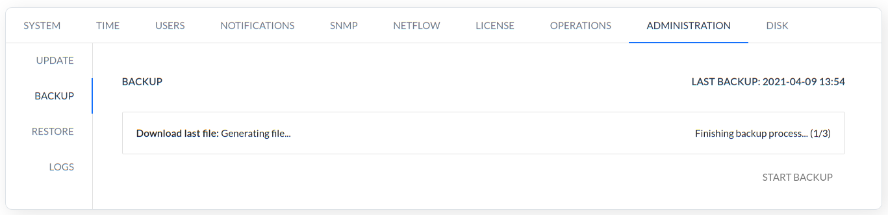

  - RESTORE - This command is used to restore the backup.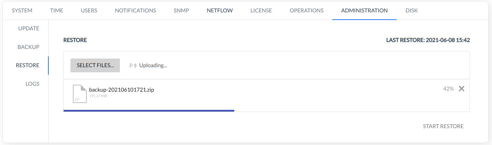

    

    After uploading the backup file, a list of elements that can be restored appears.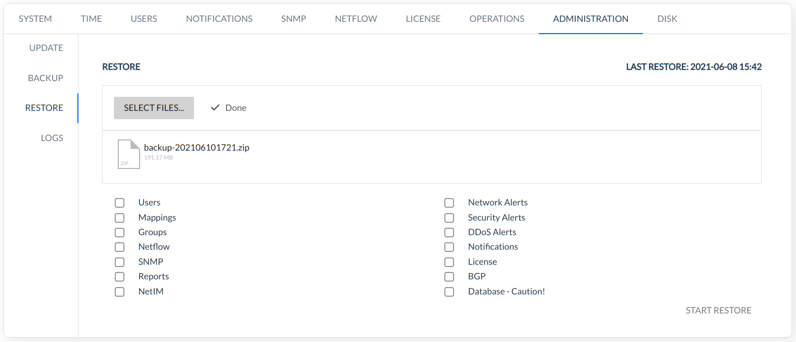   Backup restore command also restores views, dashboards and bookmarks. 

  - LOGS - This command is used to generate logs.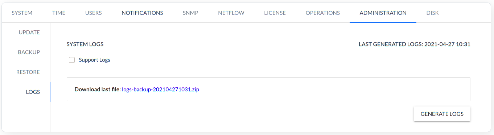Two types of log collections can be generated: Basic and Support Logs. Basic type log is saved to a regular ZIP file used for basic diagnosis like: checking the execution of the backup, restore, logs, update commands or checking the logs engine. A file with the collected logs is available for download through the GUI as shown in the figure above.

    Support Logs option is used to generate logs for support team.


#### 1.3.2.10 DISK

DISK-CAPACITY - This command is used to handle the length of time the data is stored in the system depends on granulation and the type of database.

 

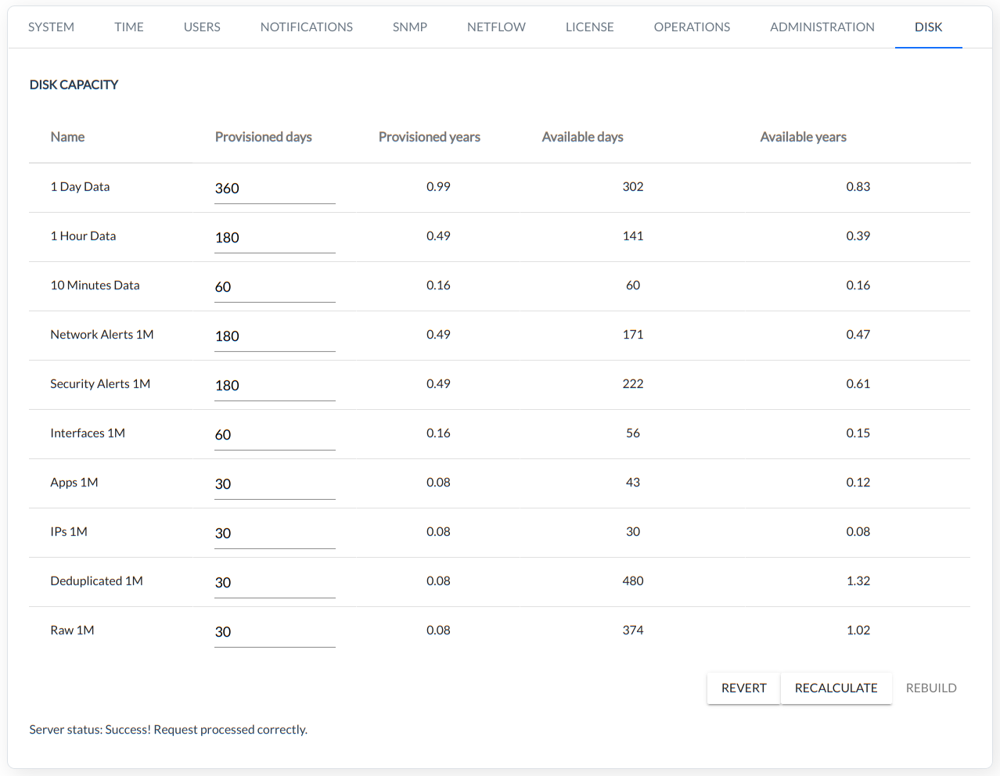


The table below lists the parameters in the DISK CAPACITY window with their descriptions.

| Name               | Description                                       |
| :----------------- | :------------------------------------------------ |
| 1 Day Data         | All databases with 1-day granularity              |
| 1 Hour Data        | All databases with 1-hour granularity             |
| 10 Minutes Data    | All databases with 10-minutes granularity         |
| Network Alerts 1M  | XN module network alarms                          |
| Security Alerts 1M | XNS module security alarms                        |
| DDoS Alerts 1M     | XND module DDoS alarms                            |
| Interfaces 1M      | Interface database with 1-minute granulation.     |
| Apps 1M            | Application database with 1-minute granulation.   |
| IPs 1M             | IP data base with 1-minute granularity.           |
| Deduplicated 1M    | De-duplicated database  with 1-minute granulation |
| Raw 1M             | RAW Flows database with 1-minute granularity      |


### 1.3.3 DDoS

This is DDOS attack detection based on behavioral and statistical analysis witch mitigation attack module.


- BASIC CONFIGURATION. 
- ENGINE PARAMETERS. 
- FLOWSPEC BGP.
- ACTIVE ATTACKS.


**XND module** full description can be found in the documentation *XND User Guide* https://documentation.sycope.com/XND

 

### 1.3.4 Security

In the **Security** section the system allows users to review and manage security rules created according to the MITRE ATT&CK methodology.

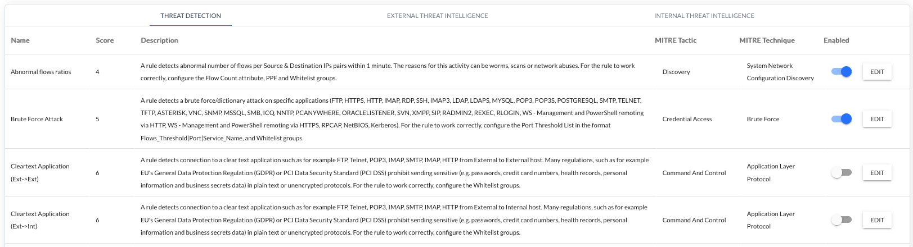


 Configuration of the security ruleset is based on three sections:

- THREAT DETECTION - Identification of different threat patterns based on proprietary Sycope created rules (this section allows rule set modification but no rule adding).


- EXTERNAL THREAT INTELLIGENCE - Identification of different threat patterns utilizing several external threat feeds (this section allows rule set modification but no rule adding).

  The system retrieves the feeds from the external sources at intervals of hour.

- INTERNAL THREAT INTELLIGENCE - Identification of the custom threat patterns configured by users.


**XNS module** full description can be found in the documentation *XNS User Guide* https://documentation.sycope.com/XNS


### 1.3.5 Mapping

The system allows mapping between internal networks into a more comprehensive convention which is then used in data presentation. There are six main sections of the mapping configuration:

- **NAME** - here is a possibility to  assign names to the following data objects: 
  
  - DEVICES - rule defines a name for the IP,
  
    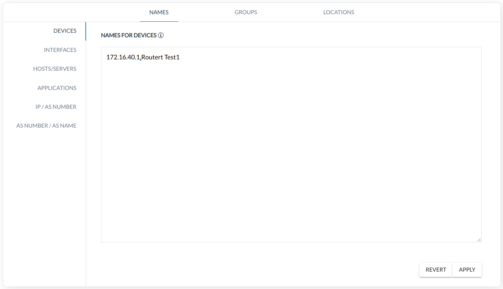
  
  - INTERFACES - rule defines several aspects of the Device Interface (Device IP: Interface ID,Interface Name/Description,Interface Speed),
  
    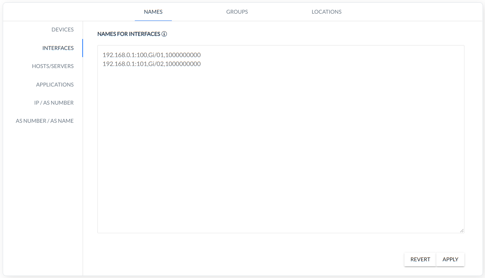
  
  - HOSTS/SERVERS - rule defines a name for the Server/HOST IP,
  
    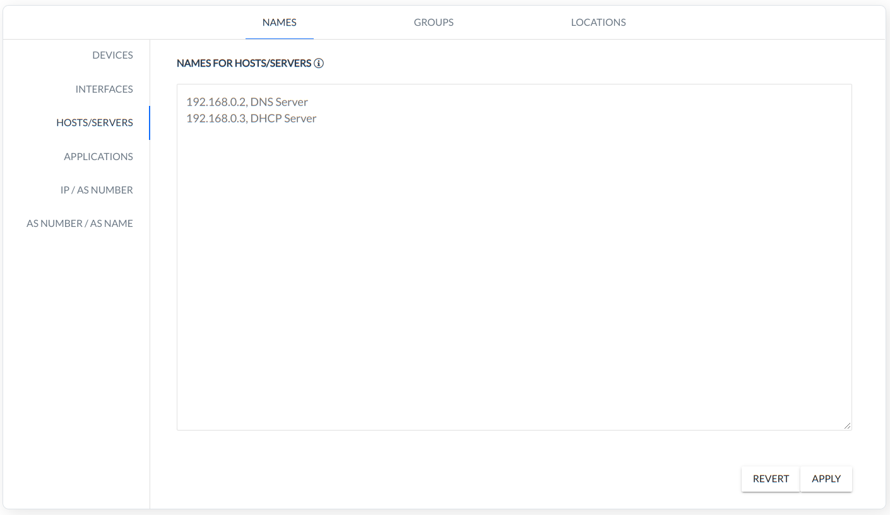
  
  - APPLICATIONS - rule defines a name for the custom APPLICATIONS (Protocol/Port Number,Name),
  
    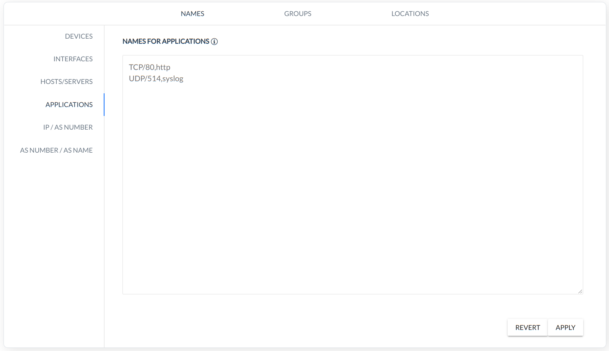
  
    
  
    > **Note:** Please remember that in case a NAME or any other parameter exists already and is predefined in the system ex. Application Definitions, mapping will override those values with the user defined ones.
  
    For the system, the order of default applications is as follows:
  
    1. 80,HTTP,TCP
    2. 443,HTTPS,TCP
  
    3. 445,SMB,TCP
  
    4. 22,SSH,TCP
  
    5. 23,TELNET,TCP
  
    6. 25,SMTP,TCP
    7. 110,POP3,TCP
  
    8. 143,IMAP4,TCP
    9. 20,FTP,TCP
  
    10. 21,FTP,TCP
    11. 1194,OPENVPN,TCP
  
    12. 5432,PostgreSQL,TCP
  
    If you set up your applications in Mappings, the applications will be displayed first, and then the default applications that did not match with the Mappings applications.
  
    
  
  - IP/AS NUMBER - rule defines ip address for the AS number.
  
    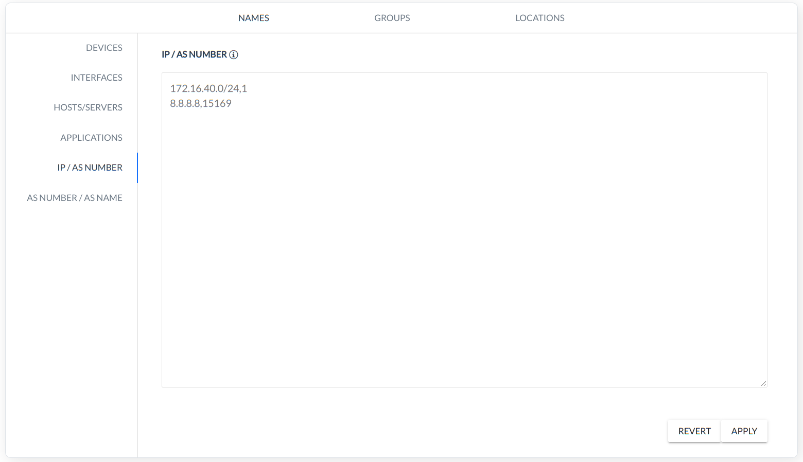
  
    
  
  - AS NUMBER/AS NAME - rule defines the custom name for AS (Number, Name).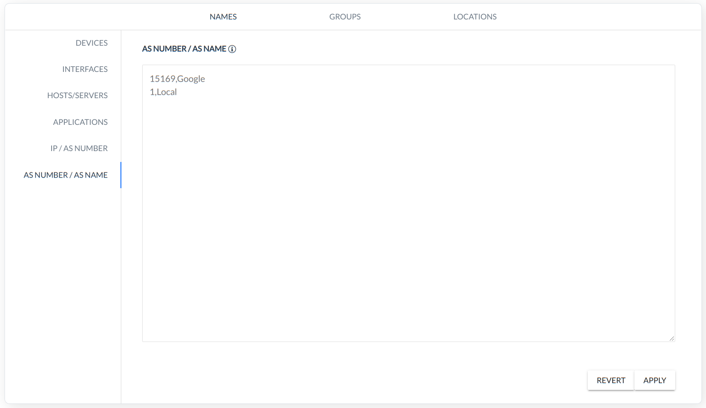


- **GROUPS** - users can assign names to the internal networks utilizing eight grouping sets : 

  - LOCATION - grouping based on NETWORK location (CIDR, Name, Description),

    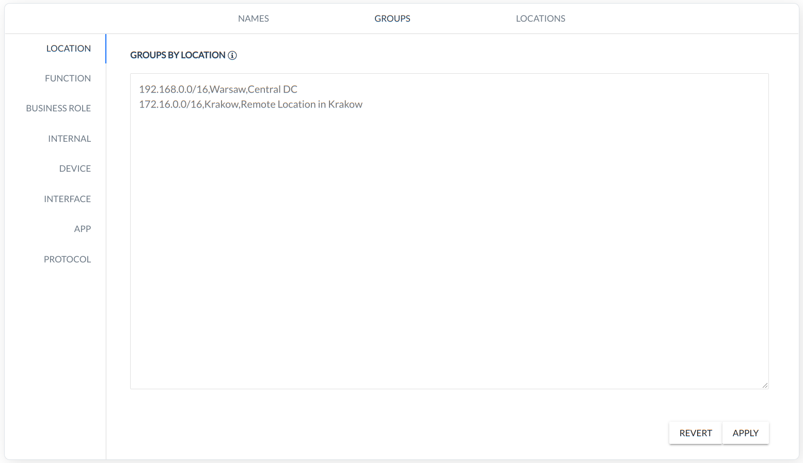

    

  - FUNCTION - grouping based on NETWORK logical function (CIDR, Name, Description),

    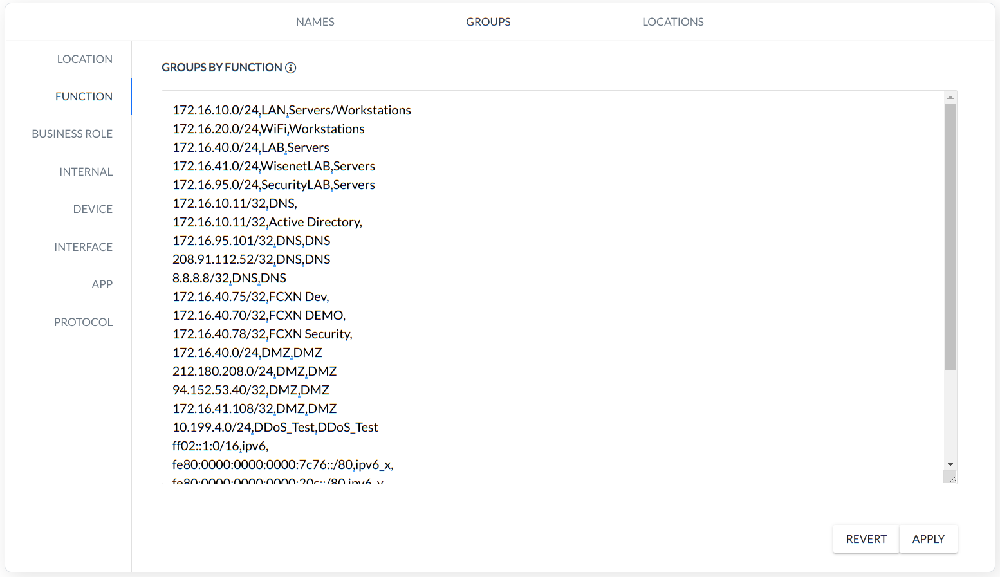

    

  - BUSINESS ROLE - grouping based on NETWORK business role in Organization (CIDR, Name, Description),

    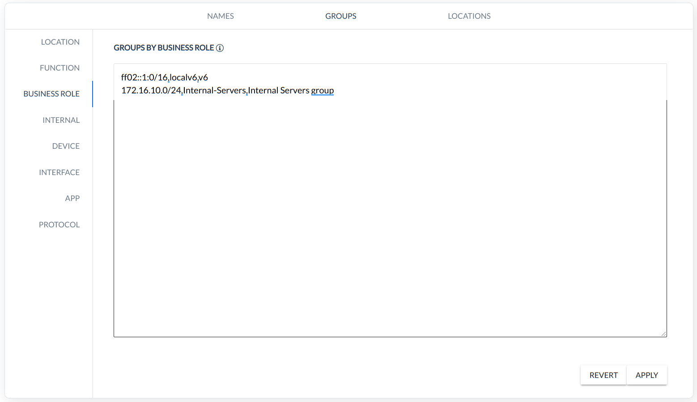

    

    

  - INTERNAL  - grouping based on internal Classless Inter-Domain Routing  (CIDR),

    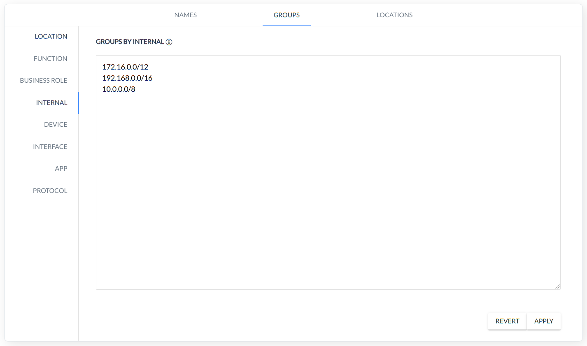

    

  - DEVICE - grouping based on internal Classless Inter-Domain Routing  (CIDR),

    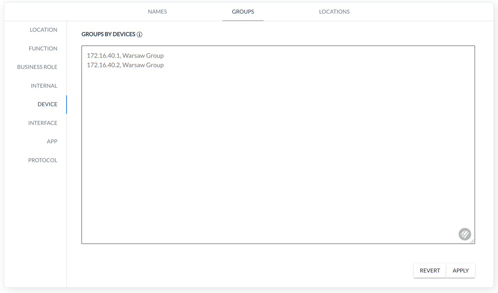

    

  - INTERFACE - grouping based on physical interfaces ip,

    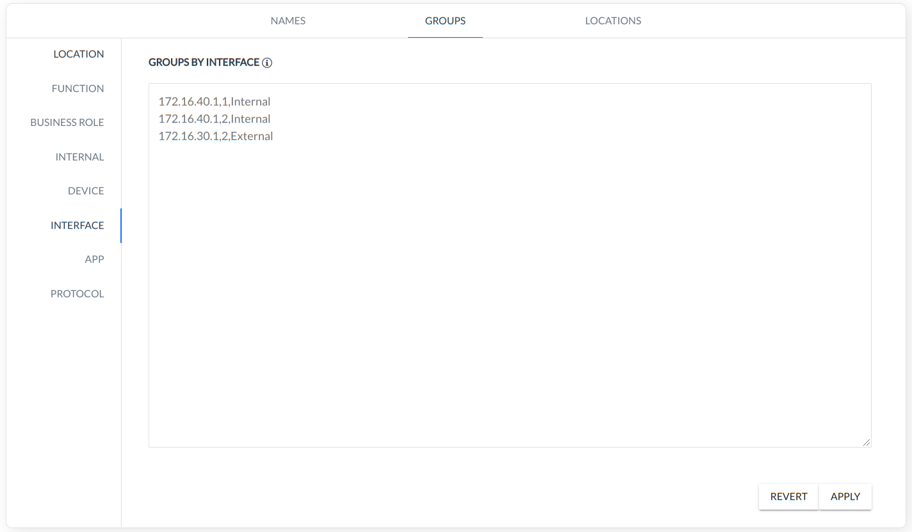

    

  - APP - grouping based on applications,

    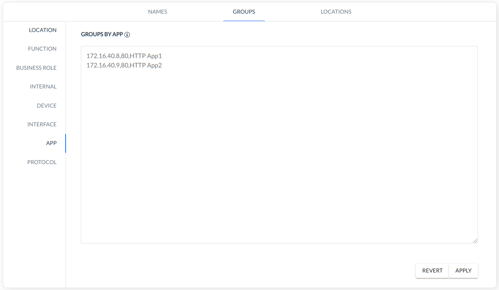
  
  - PROTOCOL - grouping based on protocol.
  
    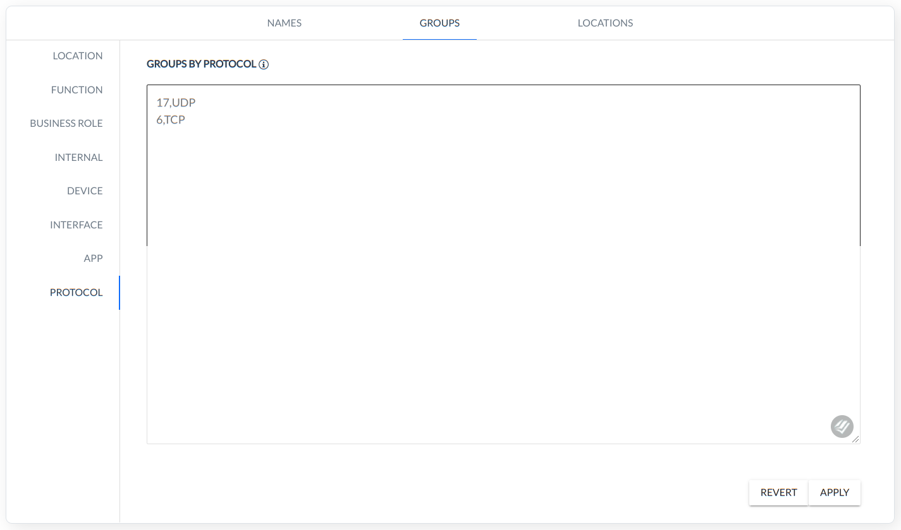

> **Note:** Grouping is very useful for presentation purposes as well as for implementation verification of widely used security zone segmentation concepts, utilized for both traffic filtering and risk mitigation.


Since the release 1.6 of the FlowControl system, it has been possible to group (as above) base on:

- Device
- Interface
- App
- Protocol

New groupings have caused the following new fields to appear in all views in the XN module:

- "Protocol Group"
- "Source Application Group"
- "Destination Application Group"
- "Device Group"
- "Input Interface Group"
-  "Output Interface Group"


- **LOCATIONS** - users can assign geographic coordinates to the following data objects:

  - DEVICES - rule defines coordinates to the DEVICE IP (Device IP, Longitude, Attitude, City, Country, Country Code).

    

    
  
  - HOST/SERVERS - rule defines coordinates to the HOST/SERVER IP (Host/Server IP, Longitude, Attitude, City, Country, Country Code).
  
    
    
    
    
    

### 1.3.6 Reports

This system is preconfigured with four report templates which can be enabled/disabled on request:

* Security Summary - summary of detected security threats from the last day,
*  Network Traffic Report - overview of top talkers and devices,
*  Interface Utilization - top interfaces and threshold violations,
*  Application Servers - view on the most used application servers.


 Reports are run on a daily basis and the outcome is saved and visible in a list form from the UI.


## 2. Dashboards

This section will cover various aspects of working with selected data. We will divide this section into different aspects that FlowControl uses to interpret data from the network. This will include various graphs, charts and tables as well as best practices on how to work with the data. 


### 2.1 Date Range Tab

An important element of the UI is the data range tab at the top of the page that stays with the user at all times in both XN, XNS and XND tabs and XNR. By default the system shows data and statistics for the last 15 minutes after initial login. When starting work on FlowControl it is crucial to remember to change the time range accordingly. Use the data range tab in order to make  the changes listed below: 


●   **Keep filters** – switching this option on, allows users to keep the filters and selections while switching between a different sections. By default, this option is turned off therefore switching to different section will reset all filters and selections. When enabled filters in different subsection views will be preserved. 

●   **Start date/End date** - choose time slots for which network traffic will be shown. Increasing a time slot might influence loading time for data and statistics. 

●   **Last** - this option will change displayed network traffic to the one from the chosen time period.

●   **Resolution** - choose for what period of time data will be merged.  

●   **Top flows** - choose how many top flows will be shown. By default, it is 10,000 flows. Increasing flows might influence loading time for data and statistics.

●   **Search** - specific IPv4 addresses can be searched for. Every widget will be automatically adjusted to show information regarding only the IPv4 address being searched for. 


> **Note:** In order to save your preferences, please click the **APPLY** button available on right-hand side. 


The FlowControl system allows advanced search with filters. The number of available filters depends on the selected database on which the filtering operation will be performed. The table below lists with a description all available filters for the given database.

| Filter description          | Filer name | Database/<br />RAW flows | Database/ <br />Dedupplicated | Databese/ <br />Utilization| Database/ <br />Total traffic |
| ---------------------------- | ------------------ | ------------------------ | -------------------------------------- | ------------------------------------ | ----------------------------- |
| time                         | unix_secs          | X                        | X                                      | X                                    | X                             |
| byte                         | octets             | X                        | X                                      | X                                    |                               |
| packets                      | packets            | X                        | X                                      |                                      |                               |
| source IP address            | srcaddr            | X                        | X                                      |                                      |                               |
| destination IP address       | dstaddr            | X                        | X                                      |                                      |                               |
| scraddr or dstaddr           | addr               | X                        | X                                      |                                      |                               |
| protocol                     | proto              | X                        | X                                      |                                      |                               |
| source port number           | srcport            | X                        |                                        |                                      |                               |
| destination port number      | dstport            | X                        |                                        |                                      |                               |
| srcport or dstport           | port               | X                        | X                                      |                                      |                               |
| direction                    | direction          |                          | X                                      |                                      |                               |
| number of deduplicated Flows | counter            |                          | X                                      |                                      |                               |
| device                       | dev                | X                        |                                        | X                                    |                               |
| input interface              | inputint           | X                        |                                        | X                                    |                               |
| output interface             | outputint          | X                        |                                        | X                                    |                               |
| inputint or outputint        | int                | X                        |                                        | X                                    |                               |
| IP type of service           | tos                | X                        |                                        |                                      |                               |
| source network               | srcnet             | X                        | X                                      |                                      |                               |
| destination network          | dstnet             | X                        | X                                      |                                      |                               |
| srcnet or dstnet             | net                | X                        | X                                      |                                      |                               |

 

The available filters can be chained together to create any complicated search. Examples of complex searches are presented below.


<u>**Example 1**</u>

Filter fold: unix_secs=202010261000,202010261001;

Assuming that  **X1**=unix_secs, the filtration result is shown in the figure below.


<u>**Example 2**</u>

**Filter fold:** unix_secs=202010261000,202010261001&scraddr=1.1.1.1,2.2.2.2

Assuming that :

**X1**=unix_secs=202010261000,202010261001;

**X2**=scraddr=1.1.1.1,2.2.2.2;

then

**X1 & X2 = X3**.

The filtration result is shown in the figure below.


<u>**Example 3**</u>

**Filter fold:**  unix_secs=202010261000,202010261001&scraddr=1.1.1.1,2.2.2.2&dstaddr=3.3.3.3,4.4.4.4

Assuming that :

**X1**= unix_secs

**X2** =srcaddr

**X3**=dstaddr

then

**X1&X2&X3=X5**

The filtration result is shown in the figure below.


<u>**Example 4**</u>

**Filter fold:** unix_secs=202010261000,202010261001&addr=1.1.1.1,2.2.2.2

Assuming that :

**X1**= unix_secs

**X2** =srcaddr

**X3**=dstaddr

and

addr=srcaddr or dstaddr  (see table above)

then

**X1 & (X2 or X3) = X5+X6+X7**.

The filtration result is shown in the figure below.

 


### 2.2 Data Specific Selection Tab

When creating any selections, the configuration output will be shown in a form of tabs. Each individual component of the tab can be managed separately. In order to deselect, press the     button on the tab.


  <b>Smart search </b> clicking this option will pop up a type in section, where any phrase can be typed in that is being looked for. This system automatically suggests options while typing.


 <b> Step back </b> - clicking this option will take a step back in data selections.

  <b>Step forward </b> - clicking this option will take a step forward in data selections.

  <b> Clear all selections </b> - this option will clear every data selection made.

**Bookmark** - this option is a shortcut to the users filter parameters


### 2.3 Visualization Options

This system will present the data, metrics and outcome of a configured rule set in different graphical forms according to the data granularity and metric structure. The presentation layer is configured according to the best practice in the data presentation techniques.


### 2.4 Visualization Drill Down

### 2.4.1 Drill Down Options

Depending on the specific dashboard and widget chosen, this system allows different drill down options. The universal method is clicking over any chart, graph or table where the user will be prompted with:

- **Exploration menu** - clicking this option will pop up an exploration menu. This is the place where users can adjust the graph, table or chart to their own needs. Options available for change are as follows: data to be shown, way of sorting data, presentation of given graph, chart or table, colors and legend.


- **Full screen** - clicking this option, it will take user to the full screen mode of the graph, table or chart. This option is most widely used among mentioned three. This will allow to view more detailed information. In order to exit the full screen mode, presswhen in full screen mode.
- **Export** - Preconfigured export options:

  - Export as an image,

  - Export to PDF,

  - Export data.


In some sections, there is a possibility to select data by choosing from drop down menus:

 

This system allows users to type in a searched phrase or select it from the drop down menu. Please remember that depending on the data chosen, fields will change color according to the data availability, suggesting to users which data types are aligned.


### 2.4.2 Visual Data Extraction

The first thing to notice when working with charts is that when users hover their mouse over any bar/data point it will show more details regarding that specific data.  


When clicking on bars, they will be selected. You can click on multiple bars in order to view only them in the chart. In order to confirm the selection, please press the green button on the top right corner. If data is presented on multiple elements of the dashboard, users’ selection on one plot will impact data presentation on others according to the selection made.


This system has drop down menus on the left-hand side and at the bottom of the chart (X/Y axes). They can be adjusted (if possible) to show different data types. There is also a lasso selection option available in the top right corner  This allows users to draw a line which, when passing through data it will select it accordingly.


Data from graphs can be selected by clicking and dragging just below the x axis, i.e. vertically, to select narrowed, i.e. period of time.


 Data can also be selected just by clicking and dragging the y axis, i.e. horizontally. This will allow to check for the details of highest data used.


### 2.4.3 Exact Values Search

 Tables are the most precise way of presenting data gathered because it shows exact values and measures.

 

 

There are two ways of selecting data in tables. The first one is by clicking on the magnifier icon next to a chosen heading, e.g. Source Host. The drop down menu will pop up where users can either search for a desired source host or by simply scrolling down and looking for it manually, then by clicking it. In order to accept the selection, press the green button. After making a selection, all data will be adjusted. The second option is to simply click the desired data in the table.  

## 3. System Status

This system provides information about its current status and performance. This information is divided into two main sections, Flows and System Statistics.


### 3.1 Flows Stats


FlowControl actively counts the number of raw and deduplicated flows giving users overview on the current network load of the system. This information is very useful for proper license sizing of the solution. 


###  3.2 System Status

This System monitors disk space of the application in real time which is crucial for sizing and maintenance of the solution. Monitored disk space is divided into 3 functional sections:

- Disk Utilization.
- Actual Free Disk Space.
-  Free space on Cache Partition. 
-  Free space on Database Partition.
-  Free space on System Partition.


 

## 4. Access to FlowControl data through REST API


Since FolowControl version 1.6 it is possible to download data based on queries through external mechanisms - REST API.


```
Link: 

https://[IP]/api_2

Method:

POST


JSON:
{
   "username":" ",
   "pass":" ",
   "method":"local",
   "appName":"fcxn-tops",
    "top":100,
   "aggr":"1MIN",
   "range":"'202105051759','202105051759'",
   "search":"",
   "appType":"xn",
   "tz":"Warsaw"
}
	
```


### 4.1 Available fields with values they can take


- method = 'local|ldap|radius'

- aggr = 'AUTO|1MIN|10MIN|1HOUR|1DAY'

- appType='xn'

- appName = 'fcxn-tops|fcxn-rawdata|fcxn-asa|fcxn-traffic|fcxn-apps|fcxn-maps|fcxn-groups|fcxn-as|fcxn-alerts'

- appType='xns'

- appName = 'fcxn-security-internal|fcxn-security-external|fcxn-security-threatanalysis|fcxn-security-alerts'

- appType='xnd'

- appName = 'fcxn-module-ddos|fcxn-ddos-protocols-details'

- appType='xnr'

- appName = 'fcxn-netim'

- appType='sys'

- appName = 'fcxn-audit-logs|fcxn-flowstats'

- tz = 'Abu Dhabi|Adelaide|Alaska|Amsterdam|Arizona|Astana|Athens|Atlantic Time (Canada)|Auckland|Azores|Baghdad|Baku|Bangkok|Beijing|Belgrade|Berlin|Bern|Bogota|Brasilia|Bratislava|Brisbane|Brussels|Bucharest|Budapest|Buenos Aires|Cairo|Canberra|Cape Verde Is.|Caracas|Casablanca|Central America|Central Time (US & Canada)|Chennai|Chihuahua|Chongqing|Copenhagen|Darwin|Dhaka|Eastern Time (US & Canada)|Edinburgh|Ekaterinburg|Fiji|Georgetown|Greenland|Greenwich Mean Time : Dublin|Guadalajara|Guam|Hanoi|Harare|Hawaii|Helsinki|Hobart|Hong Kong|Indiana (East)|International Date Line West|Irkutsk|Islamabad|Istanbul|Jakarta|Jerusalem|Kabul|Kamchatka|Karachi|Kathmandu|Kolkata|Krasnoyarsk|Kuala Lumpur|Kuwait|Kyiv|La Paz|Lima|Lisbon|Ljubljana|London|Madrid|Magadan|Mazatlan|Melbourne|Mexico City|Mid-Atlantic|Minsk|Monrovia|Monterrey|Moscow|Mountain Time (US & Canada)|Mumbai|Muscat|Nairobi|New Caledonia|New Delhi|Newfoundland|Novosibirsk|Nuku'alofa|Osaka|Pacific Time (US & Canada)|Paris|Perth|Port Moresby|Prague|Pretoria|Quito|Riga|Riyadh|Rome|Samoa|Santiago|Sapporo|Sarajevo|Saskatchewan|Seoul|Singapore|Skopje|Sofia|Solomon Is.|Sri Jayawardenepura|St. Petersburg|Stockholm|Sydney|Taipei|Tallinn|Tashkent|Tbilisi|Tehran|Tokyo|Urumqi|Warsaw|Wellington|West Central Africa|Vienna|Vilnius|Vladivostok|Volgograd|Yakutsk|Yerevan|Zagreb'

  ​	

### 4.2 Available databases for querying a specific application

**XN**

- fcxn-tops = 'HostAppTops,IntRawTops'
- fcxn-rawdata = 'IntRaw,IntUtil'
- fcxn-asa = 'IntRawASA'
- fcxn-traffic = 'HostApp,TotalAggrBytes'
- fcxn-apps = 'HostApps'
- fcxn-maps = 'HostApp,IntUtil'
- fcxn-groups = 'HostApp,TotalAggrBytes'
- fcxn-as = 'HostApp,TotalAggrBytes'
- fcxn-alerts = 'AlertHost,AlertInt'


**XNS**

- fcxn-security-internal = 'Incidents'
- fcxn-security-external = 'Incidents'
- fcxn-security-threatanalysis = 'Incidents'
- fcxn-security-alerts = 'Incidents'


**XND**

- fcxn-module-ddos = 'Incidents'
- fcxn-ddos-protocols-details = 'Incidents,Protocols'


**XNR**

- fcxn-netim = ''NetIM'


**SYS**

- fcxn-audit-logs = 'Logs'


### 4.3 Example

```
Request:

{
   "username":"admin",
   "pass":"[password]",
   "method":"local",
   "appName":"fcxn-tops",
   "top":1,
   "aggr":"1MIN",
   "range":"'202105051759','202105051759'",
   "search":"",
   "appType":"xn",
   "tz":"Warsaw"
}

Response:

{
    "Status":"Success",
    "Message":"Module  XN. Application FCXN-TOPS.",
    "Data":[
        {
            "Name":"HostAppTops-1MIN",
            "Content":"{
                "Time (Host/App)":"202105051759",
                "Bytes (Host/App)":"6615615",
                "Packets (Host/App)":"7593",
                "Source Host Name (Host/App)":"172.16.40.75",
                "Destination Host Name (Host/App)":"172.16.95.183",
                "Source Host (Host/App)":"172.16.40.75",
                "Destination Host (Host/App)":"172.16.95.183",
                "Protocol (Host/App)":"UDP",
                "Application (Host/App)":"5142",
                "Port (Host/App)":"5142",
                "Source Host Role (Host/App)":"Client",
                "Source Host ASByIP (Host/App)":"LVLT-1",
                "Destination Host ASByIP (Host/App)":"",
                "Source Host ASN (Host/App)":"1",
                "Destination Host ASN (Host/App)":"",
                "Protocol Group (Host/App)":"",
                "Source Application Group (Host/App)":"",
                "Destination Application Group (Host/App)":""
            }"
        },
        {
            "Name":"IntRawTops-1MIN",
            "Content":"{
                "Netflow Device (Int)":"172.16.40.1",
                "Device Name (Int)":"Routert Test1",
                "Time (Int)":"202105051759",
                "Bytes (Int)":"6465451",
                "Packets (Int)":"7464",
                "Input Interface (Int)":"7",
                "Output Interface (Int)":"14",
                "Input Interface Name (Int)":"LAB",
                "Output Interface Name (Int)":"TMP_5",
                "Source Host (Int)":"172.16.40.75",
                "Destination Host (Int)":"172.16.95.183",
                "Source Host Name (Int)":"172.16.40.75",
                "Destination Host Name (Int)":"172.16.95.183"
            }"
        }
    ]
}'
```

