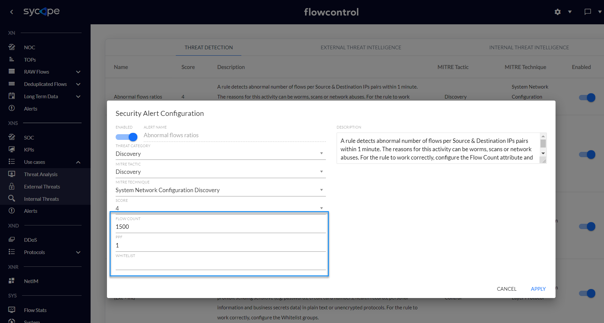
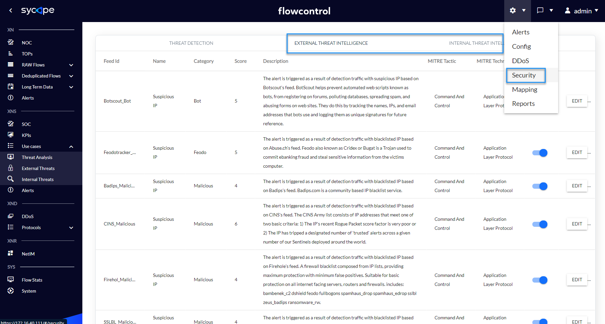
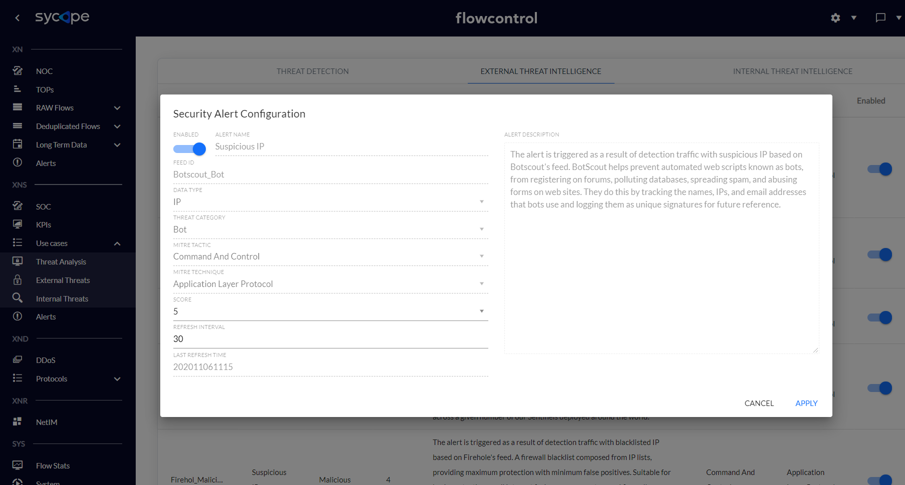
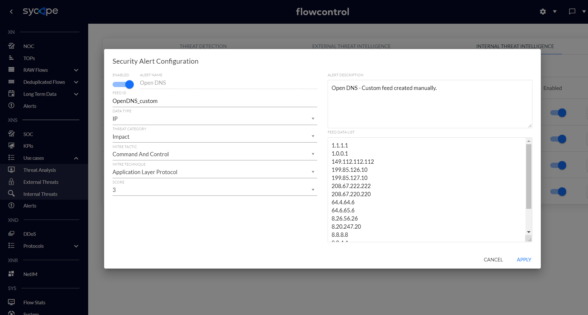
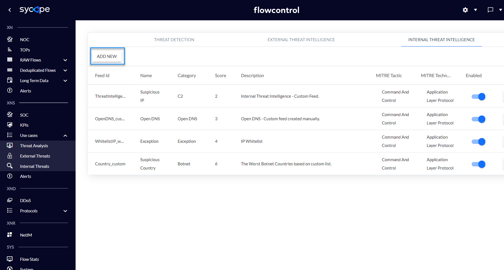
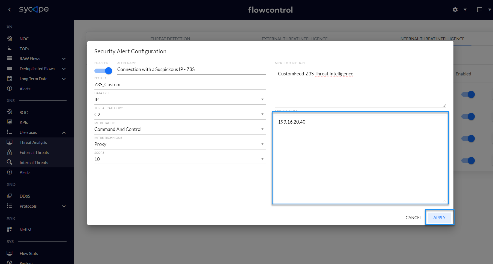
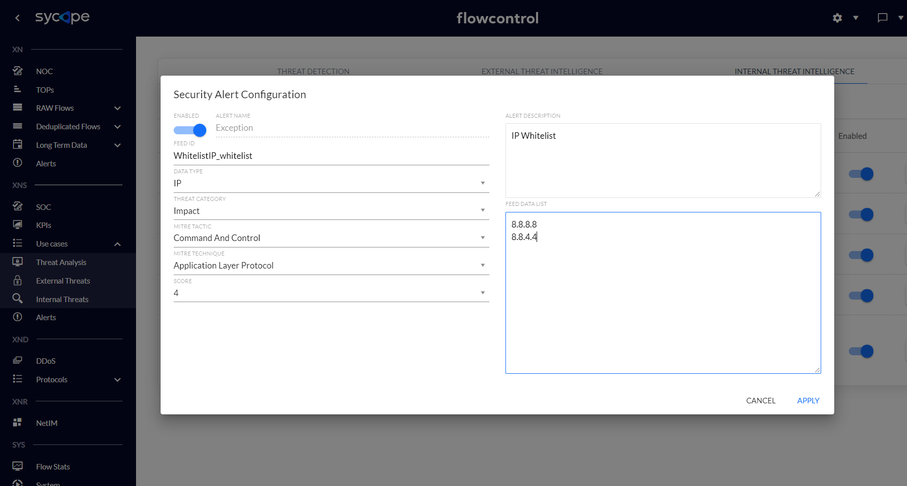

### Introduction

---

FlowControl XNS detects and analyses security threats and anomalies in a context of the entire organization based on network metadata (NetFlow) and reputation lists. For effective detection of abnormal activities, XNS uses two engines: 

•       Threat Intelligence (TI) 

•       Threat Detection (TD). 

The former detects malicious or illegal activity based on correlations with reputation lists of malicious IP addresses and suspicious countries. However, Threat Detection detects security threats and anomalies based on the correlation and aggregation of relationships between the values of various parameters of network artifacts within a specified period of time.

 A set of rules built into the system makes it easier to monitor prohibited and malicious activities in an organization. 

Key features of XNS include:

•       Using the ATT&CK MITRE methodology to enrich information on alerts and categorization of security threats detected in XNS

•       Using built-in threat detection mechanisms to discover malicious activities in the context of the whole organization

•       Limiting the number of false positives due to the ability to whitelist specific properties in security rules

•       Integrating with external databases to check the reputation of the host, e.g. Virustotal

•       Improving the visibility of threats in the context of individual parts of the organization, which is an added value for each SOC & NOC teams

•       Correlating multiple network artifacts to detect suspicious activity and security breaches

•       Improving the MTTD* indicator due to properly designed views, e.g. SOC Dashboard

•       Enrichment of data with valuable information facilitating threat analysis, e.g. ASN, geolocation, IoC

•       Helping CSO and Security Managers make decisions through KPI views

•       Supporting many security processes, such as for example incident handling, network forensics, threat hunting

•       Supporting process of meeting compliance with regulations and standards, e.g. [UoKSC (Ustawa o Krajowym Systemie Cyberbezpieczeństwa)](http://prawo.sejm.gov.pl/isap.nsf/download.xsp/WDU20180001560/T/D20181560L.pdf), 

•       Improving network and security troubleshooting process

•       Detecting correlations between systems thanks to integration with SIEMs

•       Updating security rules and IoC regularly.

 *MTTD (Mean Time To Detect) - amount of time it takes the Security Team to discover a potential security incident. 

FlowControl XNS generates security alerts which are categorized by tactics and techniques of the MITRE ATT&CK methodology. Below is a brief description of this methodology.

MITRE ATT&CK™ is a globally-accessible knowledge base of adversary tactics and techniques based on real-world observations. The ATT&CK knowledge base is used as a foundation for the development of specific threat models and methodologies in the private sector, in government, and in the cybersecurity product and service community. Full MITRE ATT&CK Matrice is available on the [MITRE ATT&CK Matrices]( https:/attack.mitre.org/ ) website. The MITRE ATT&CK Enterprise Matrice contains many techniques grouped into tactics (*Fig. I.1*).

*Fig.. I.1 MITRE ATT&CK Tactics. Source: [MITRE ATT&CK.]( https:/attack.mitre.org/ )*

 

Examples of security threats and anomalies detected by FlowControl XNS and categorized by MITRE ATT&CK are described in the *Tab I.1.*

| MITRE ATT&CK Tactic          | **Security Threats Examples**                                |
| ---------------------------- | ------------------------------------------------------------ |
| **Initial Access**           | Detection of unauthorized P2P network activities.            |
| **Credential Access**        | Detection of brute force attacks on various  services, e.g. HTTP(s), FTP, IMAP, SSH, RDP, LDAPS, MS SQL Detection of  unauthorized LLMNR / NetBIOS communications. |
| **Discovery**                | Detection of unauthorized access to certain services, e.g. DHCP, DNS, Mail Server Network scan detection, Host scan detection, Detecting malware spread, Detection of network anomalies that may be related to security. |
| **Lateral Movement**         | Detection of unauthorized RDP connections.                   |
| **Command And Control (C2)** | Detection of activity on suspicious ports  (based on Black and White-lists), Detection of unencrypted connections to critical servers or services, Detection of communication with suspicious IP addresses, e.g. Botnet, Malware, C2, Ransomware Detection of violations of security policies, e.g. TOR, Open DNS, Open Proxy. |
| **Exfiltration**             | Detection of DNS anomalies, e.g. Abnormal DNS Query Limit, Abnormal DNS Response Limit, DNS Transfer Limit Detecting a large number of unsolicited emails (SPAM), Detection of data exfiltration attempts, Detection of huge amounts of data transfers within a short period of time to / from an organization, Detection of anomalies in network protocols. |
| **Impact**                   | Detection of DoS attacks, e.g. ICMP Flood, TCP Flood, UDP Flood Detection of DDoS amplification attacks, e.g. DNS  Amplification |

*Tab. I.1 Examples of security threats and anomalies detected by FlowControl XNS and categorized by MITRE ATT&CK.*

FlowControl XNS analyses network flows to detect suspicious activity.

A flow is defined as a unidirectional sequence of packets with some common properties that pass through a network device. These collected flows are exported to an external device, the NetFlow collector. Network flows are highly granular; for example, flow records include details such as IP addresses, packet and byte counts, timestamps, Type of Service (ToS), application ports, input and output interfaces, etc.

Source: [RFC3954](https://www.ietf.org/rfc/rfc3954.txt)

The system supports the following flow protocol data sources: 

•       NetFlow v5

•       NetFlow v9

•       sFlow

•       IPFIX

•       NSEL.

**Note:** Specific options such as NSEL (Cisco ASA) or different sampling multipliers per device must be additionally configured. This system uses SNMP v1/2/3 to query devices. 

 

According to the RFC3964, FlowControl solution works as a Flow Collector (both hardware and software versions are available) which collects, analyses and visualizes the collected flows. Metrics are presented and examined from two perspectives: Network and Security giving the operator valuable input into network/application problems analysis as well as hunting security threats (*Fig. I.2*). 

*Fig. I.2 Netflow Collector – logical architecture.*

## 1. Security Dashboards

FlowControl XNS contains four menus (*Fig. 1.1)* of views for effective analysis of detected security threats: 
•       SOC
•       KPIs
•       Use Cases
•       Alerts. 

*Fig. 1.1 XNS menus*. 

Each of them has a set of dedicated tabs and dashboards that are appropriately used to monitor the security of the organization.

 *Tab. 1.1*. contains a summary description of each menu.

| View Name | Description                                                  |
| --------- | ------------------------------------------------------------ |
| SOC       | A set of dashboards presenting security threats in the context of Tactic, IP, Group, Direction, Application, Country and Technique for the last hour. These charts are great for security departments like SOC who deal with 24/7 security monitoring. |
| KPIs      | A set of KPIs to help security managers monitor security risk trends, risk analysis, and make key decisions. |
| Use Cases | A set of dashboards enabling a very detailed investigating of security threats. In order to precisely analyse specific threats, these dashboards have been divided into three Use Cases: Threat Analysis, External Threats and Internal Threats. |
| Alerts    | A set of dashboards containing a list of security alerts and a series of data enriching them through correlation with  ATT&CK MITRE knowledge base. |

*Tab. 1.1 Summary description of the XNS module menu*.

In the following sections, individual dashboards are discussed in more detail.

### 1.1. SOC

The SOC dashboards are great for security departments like SOC who deal with 24/7 security monitoring. *Tab. 1.1.1* contains a summary description of each SOC tabs.

| Dashboard Name | Description                                                  |
| -------------- | ------------------------------------------------------------ |
| Overview       | A basic view for SOC analysts containing information about the last hour's threats in the context of Tactic, Group,  IP, Attack Directions and Applications. |
| TOP IPs        | Charts showing most common attributes, such as Source and Destination Hosts or Source-Destination IP Pairs, which are found in security alerts. |
| TOPs           | Charts containing statistics on network artifacts related to detected threats, such as the number of alerts in the  context of Source-Destination Group pairs, the number of individual security alerts and the number of alerts together with the number of unique Source Hostnames for each attack Technique. |

*Tab. 1.1.1 Summary description of the SOC tabs*.

*Fig. 1.1.1-1.1.3* shows the individual dashboards of the SOC menu.

 *Fig. 1.1.1 SOC menu Overview dashboard.*

 

 *Fig. 1.1.2 SOC menu TOP IPs dashboard.*

 

  *Fig. 1.1.3 SOC menu TOPs dashboard.*

 

### 1.2. KPIs

The KPIs dashboards facilitate the process of monitoring security risk trends based on the threats detected in the XNS module. These indicators are presented on a weekly basis, comparing specific attributes to specific days of the week. Tracking risk trends makes it easier to make decisions regarding remedial actions, which is an added value for security managers. 

The indicators have been grouped into four categories: Severity, Host, Tactic and Module. *Tab. 1.2.1* contains descriptions of each individual indicators.

| Dashboard Name   | Description                                                  |
| ---------------- | ------------------------------------------------------------ |
| Risk by Severity | KPIs for detecting security threat trends in the context of their criticality. |
| Risk by Host     | KPIs for detecting threat trends in the context of the number of affected hosts. |
| Risk by Tactic   | KPIs for detecting threat trends in the context of Tactics, Techniques and Alert Names. |
| Risk by Module   | KPIs for detecting threat trends in the context of both security engines: Threat Detection and Threat Intelligence. |

*Tab. 1.2.1 XNS KPIs individual indicators descriptions*.

*Fig. 1.2.1-1.2.6* shows the individual dashboards of the KPIs menu.

 *Fig. 1.2.1 KPIs menu Risk by Severity dashboard.*

 

 *Fig. 1.2.2 KPIs menu Risk by Host dashboard.*

 

 *Fig. 1.2.3  - KPIs menu Risk by Tactic / Tactic dashboard.*

 

 *Fig. 1.2.4 KPIs menu Risk by Tactic/Technique dashboard.*

 

 *Fig. 1.2.5 KPIs menu Risk by Tactic/Alerts dashboard.* 

  *Fig. 1.2.6 KPIs menu Risk by Module dashboard.*

 

### 1.3. Use Cases

The scenarios implemented in the XNS module facilitate the process of analysis and drawing conclusions regarding the most important aspects related to the security of the monitored organization. The Use Cases menu is divided into the following three submenus: Threat Analysis, External Threats, Internal Threats which are described in the *Tab 1.3.1*. 

| Use Case         | Description                                                  |
| ---------------- | ------------------------------------------------------------ |
| Threat Analysis  | The threat analysis scenario allows you to identify the most suspicious IP addresses and then examine correlations with other addresses and network artifacts to conduct a deep analysis. |
| External Threats | The external threats scenario is used to analyse external attacks enabling multi-dimensional analysis of one or a group of suspicious IP addresses or countries, as well as other network artifacts. |
| Internal Threats | The internal threats scenario is used to analyse internal attacks enabling multi-dimensional analysis of one or a group of suspicious IP addresses, as well as other network artifacts. |

*Tab. 1.3.1 Use Cases submenu individual descriptions*.

 

#### 1.3.1. Threat Analysis

The Threat Analysis dashboards allow multi-level analysis of all security threats, regardless of whether they come from outside or inside the organization. They are described in the *Tab. 1.3.1.1*.

| Dashboard Name        | Description                                                  |
| --------------------- | ------------------------------------------------------------ |
| Alerts Drilldown      | An interactive dashboard containing a drilldown table with expandable attributes for criticality and IP addresses,  and a graph of connections between individual IP addresses. Security threats can be searched and analysed based on many attributes, such as Severity, Source Host, Destination Host, Security Module, Tactic, Technique, Alert Name, Threat Category, Application, Direction, Source Group, Destination Group, Source Country, Destination Country or Feed ID. Presenting threats in the context of these attributes facilitates an effective review of organizational security risks. |
| TOP Suspicious IPs    | Charts presenting the most suspicious hosts in an organization in the context of attackers and victims of attacks. The suspicion index is calculated based on a vendor internal algorithm. In addition, this dashboard contains the association of suspicious IP addresses with Alert Names. |
| IPs Correlation       | Graphic visualization of connections between Source and Destination Hosts, also in other attribute contexts, such as Alert Name or Application. |
| Groups Correlation    | Graphic visualization of connections between Source and Destination Groups, also in other attribute contexts, such  as Alert Name or Threat Category. |
| Countries Correlation | Graphic visualization of connections between Source and Destination Countries, also in other attribute contexts, such as Groups (Source and Destination) or Threat Categories. |
| BOTTOMs               | A set of views presenting information about threats in the context of the most rare parameters, e.g. Source-Destination pair of Groups, Source-Destination pair of Hosts, Applications and Alert Names. |
| Alerts Statistics     | A scatter plot of the relationship between the number of Alert Names and Destination Hosts. |

 *Tab. 1.3.1.1 Threat Analysis submenu dashboard description.*

*Fig. 1.3.1.1 -1.3.1.7* Shows individual dashboards from Threat Analysis submenu.

 

 *Fig. 1.3.1.1 Threat Analysis - Alerts Drilldown dashboard.*

 

 *Fig. 1.3.1.2  Threat Analysis - TOP Suspicious IPs dashboard.*

 

 *Fig. 1.3.1.3 Threat Analysis - IPs Correlation dashboard.*

 

 *Fig. 1.3.1.4 Threat Analysis - Groups Correlation dashboard.*

 

 

 *Fig. 1.3.1.5 Threat Analysis - Countries Correlation dashboard*

 

 *Fig. 1.3.1.6 Threat Analysis - BOTTOMs dashboard.*

 

 *Fig. 1.3.1.7 Threat Analysis - Alerts Statistics dashboard*.

 

#### 1.3.2. External Alerts

External Threats dashboards focus on presenting artifacts related to security threats from outside the organization. *Tab. 1.3.2.1* contains descriptions of individual dashboards. 

| Dashboard Name   | Description                                                  |
| ---------------- | ------------------------------------------------------------ |
| Alerts Drilldown | An interactive view containing a drilldown table with expandable attributes for criticality and IP addresses, and a  graph of connections between individual IP addresses. Security threats can be  searched and analysed based on many attributes, such as Severity, Source Host, Destination Host, Tactic, Technique, Alert Name, Direction,  Application, Source Country, Destination Country, Source Group and  Destination Group. |
| Alerts Data Size | A world map showing the amount of data sent in the context of individual Countries when security alerts are triggered. |
| Alerts Map       | A world map showing the number of individual Techniques in the context of the Country associated with the source of a specific Technique. |

*Tab. 1.3.2.1 Use Cases - External Threats*

 

  *Fig. 1.3.2.1 External Threats - Alerts Drilldown dashboard.*

 

 *Fig. 1.3.2.2 External Threats Alerts Data Size dashboard.*

 

 *Fig. 1.3.2.3 External Threats Alerts Map dashboard.*

 

#### 1.3.3. Internal Threats

Internal Threats dashboards focus on presenting artifacts related to security threats from within the organization. *Tab. 1.3.3.1* contains descriptions of Internal Threats submenu Alerts Drilldown dashboard.

| Dashboard Name   | Description                                                  |
| ---------------- | ------------------------------------------------------------ |
| Alerts Drilldown | An interactive view containing a drilldown table with expandable attributes for criticality and IP addresses, and a graph of connections between individual IP addresses. Security threats can be searched and analysed based on many attributes, such as Severity, Source Host, Destination Host, Tactic, Technique, Alert Name, Application, Direction, Source Group, Destination Group or Destination Country. |

*Tab. 1.3.3.1 Internal Threats - Alerts Drilldown dashboard description*.

In the *Fig. 1.3.3.1* you can see Alerts Drilldown dashboard.

 *Fig. 1.3.3.1 Internal Threats - Alerts Drilldown dashboard.*

 

### 1.4. Alerts

The alert menu contains a list of detected alarms along with their occurrence times and other attributes. There are two dashboards: Overview and Mitre KB that are described in the *Tab. 1.4.1* and shown in *Fig. 1.4.1-1.4.2.* 

| Dashboard Name | Description                                                  |
| -------------- | ------------------------------------------------------------ |
| Overview       | A table of threats and security anomalies detected by the XNS module containing the attributes necessary for their analysis. |
| MITRE KB       | A dashboard showing the integration of the MITRE ATT&CK knowledge base with XNS alerts, which enriches them with additional information about a specific threat. |

*Tab. 1.4.1 Alerts menu dashboards description*.

 

 *Fig. 1.4.1 Alerts Overview dashboards.*

 

 *Fig. 1.4.2 Alerts MITRE KB dashboard.*

 

If you need a full description of a given technique, use the redirect function to the appropriate page using the right mouse click on the **Id** attribute on the Alerts/MITRE KB dashboard (*Fig. 1.4.3*).

 *Fig. 1.4.3 MITRE KB - Right click function*.

 

## 2. Threat Detection

The Threat Detection engine generates alerts based on correlations of relevant attributes of network flows (e.g. Netflow) indicating potential security issues. This mechanism consists of 38 security rules for seven MITRE ATT&CK tactics: Initial Access, Credential Access, Discovery, Lateral Movement, Command and Control, Exfiltration and Impact.

### 2.1. Threat Detection Rules

This section describes all rules triggered by the Threat Detection engine.

| **Name**                                |
| --------------------------------------- |
| Abnormal DNS Query Limit                |
| Abnormal DNS Response Limit             |
| Abnormal flow ratios                    |
| Brute Force Attack                      |
| Cleartext Application (Ext->Ext)        |
| Cleartext Application (Ext->Int)        |
| Cleartext Application (Int->Ext)        |
| Cleartext Application (Int->Int)        |
| DDoS Attack Detected                    |
| DDoS DNS Amplification Attack           |
| DNS Transfer Limit                      |
| DoS - ICMP Flood                        |
| DoS - TCP Flood                         |
| DoS - UDP Flood                         |
| DoS Attack Detected                     |
| High Data Transfer (Ext->Int)           |
| High Data Transfer (Int->Ext)           |
| High Data Transfer (Int->Int)           |
| Horizontal Scan                         |
| Large Size Protocol Anomaly             |
| P2P Activity                            |
| SPAM (Ext->Ext)                         |
| SPAM (Ext->Int)                         |
| SPAM (Int->Ext)                         |
| SPAM (Int->Int)                         |
| Suspicious Port BL                      |
| Suspicious Port WL                      |
| Unauthorized DHCP Activity              |
| Unauthorized DNS Activity               |
| Unauthorized Internet Access            |
| Unauthorized LLMNR/NetBIOS Activity     |
| Unauthorized MAIL Activity              |
| Unauthorized RDP Connection             |
| Unusually High Data Transfer (Ext->Int) |
| Unusually High Data Transfer (Int->Ext) |
| Vertical Scan Detected                  |
| Virus Outbreak                          |

*Tab. 2.1.1 Threat Detection Rules*.

 

### 2.2. Initial Configuration

All Threat Detection rules are disabled by default to reduce the number of False Positives. In the initial rule configuration process, set rule parameters, such as groups or limits on specific attributes. Each rule has its own set of characteristics, so each of them must be configured separately. For example, in the *Abnormal flow ratios* rule, set the Flow Count, PPF and Whitelists Group parameters.

 *Fig. 2.2.1 Security Alert Configuration*. 

 

If as a result of the analysis, it was determined that a given rule generates many false alarms, then the fine tuning process should be performed.

 

 

## 3. Threat Intelligence Engine

The Threat Intelligence engine generates alerts based on correlation network flow attributes with external and internal IoCs. XNS regularly updates more than 30 security feeds of malicious IP addresses and suspicious countries.
 The Threat Intelligence mechanism consists of two parts:

•       *External Threat Intelligence*, which uses automatically updated feeds downloaded from the Internet

•       *Internal Threat Intelligence*, which uses manually created and updated feeds.

Both subsystems generate the following security alerts:

•       Connection with Suspicious IP

•       Connection with Suspicious Country

•       Connection with Open Proxy

•       Connection with Open DNS

•       Connection with TOR.

Each of these alerts can be triggered by many reputational feeds.

 

### 3.1. Threat Intelligence Feeds

The Threat Intelligence of XNS consists of external and internal (custom) feeds.

| Feed id                        | Name          | Category  | Score | Description                                                  | MITRE Tactic        | MITRE Techniqe             |
| ------------------------------ | ------------- | --------- | ----- | ------------------------------------------------------------ | ------------------- | -------------------------- |
| Spys.me_Proxy                  | Proxy         | Proxy     | 4     | The alert is triggered as a result of detection traffic with Open Proxy IP based on Spys's feed. | Command And Control | Proxy                      |
| SSLBL_Malicious                | Suspicious IP | Malicious | 4     | The alert is triggered as a result of detection traffic with blacklisted IP based on Abuse.ch's feed. | Command And Control | Application Layer Protocol |
| Feodotracker_Feodo             | Suspicious IP | Feodo     | 5     | The alert is triggered as a result of detection traffic with blacklisted IP based on Abuse.ch's feed. Feodo also known as Cridex or Bugat is a Trojan used to commit ebanking fraud and steal sensitive information from the victims computer. | Command And Control | Application Layer Protocol |
| Alienvault_Malware             | Suspicious IP | Malware   | 8     | The alert is triggered as a result of detection traffic with blacklisted IP based on Alienvault's feed. | Command And Control | Application Layer Protocol |
| Badips_Malicious               | Suspicious IP | Malicious | 4     | The alert is triggered as a result of detection traffic with blacklisted IP based on Badips's feed. Badips.com is a community based IP blacklist service. | Command And Control | Application Layer Protocol |
| Blocklist.de_Malware           | Suspicious IP | Malware   | 4     | The alert is triggered as a result of detection traffic with blacklisted IP based on Blocklist's feed. The www.blocklist.de is a free and voluntary service provided by a Fraud/Abuse-specialist, whose servers are often attacked via SSH-, Mail-Login-, FTP-, Webserver- and other services. | Command And Control | Application Layer Protocol |
| CINS_Malicious                 | Suspicious IP | Malicious | 6     | The alert is triggered as a result of detection traffic with blacklisted IP based on CINS's feed. The CINS Army list consists of IP addresses that meet one of two basic criteria: 1) The IP's recent Rogue Packet score factor is very poor or 2) The IP has tripped a designated number of 'trusted' alerts across a given number of our Sentinels deployed around the world. | Command And Control | Application Layer Protocol |
| Charles_SSH                    | Suspicious IP | SSH BL    | 4     | The alert is triggered as a result of detection traffic with blacklisted IP based on Charles's feed. The feed contains IP addresses launching SSH dictionary attacks. | Command And Control | Application Layer Protocol |
| Cybercrime-tracker.net_Malware | Suspicious IP | Malware   | 5     | The alert is triggered as a result of detection traffic with blacklisted IP based on Cybercrime-tracker's feed. | Command And Control | Application Layer Protocol |
| TI_Dan_TOR                     | TOR Activity  | TOR       | 7     | The alert is triggered as a result of detection traffic with blacklisted IP based on Dan's feed. | Command And Control | Proxy                      |
| COVID_03                       | Suspicious IP | Malware   | 7     | The alert is triggered as a result of detection traffic with blacklisted IP based on MalwarePatrolExport's feed. | Command And Control | Application Layer Protocol |
| COVID_02                       | Suspicious IP | Malware   | 7     | The alert is triggered as a result of detection traffic with blacklisted IP based on Managedsentinel's feed. | Command And Control | Application Layer Protocol |
| COVID_01                       | Suspicious IP | Malware   | 7     | The alert is triggered as a result of detection traffic with blacklisted IP based on Parthdmaniar's feed. | Command And Control | Application Layer Protocol |
| RogueDNS                       | Suspicious IP | Rogue DNS | 5     | The alert is triggered as a result of detection traffic with blacklisted IP based on RogueDNS's feed. | Command And Control | Application Layer Protocol |
| Talos_Intel                    | Suspicious IP | Malware   | 9     | The alert is triggered as a result of detection traffic with blacklisted IP based on Talos's sample feed. Talos's IP and Domain Data Center is the world's most comprehensive real-time threat detection network. The data is made up of daily security intelligence across millions of deployed web, email, firewall and IPS appliances. Talos detects and correlates threats in real time using the largest threat detection network in the world spanning web requests, emails, malware samples, open-source data sets, endpoint intelligence, and network intrusions. The free Talos feed contains an incomplete number of malicious IP addresses | Command And Control | Application Layer Protocol |
| Torstatus.rueckgr.at_TOR       | TOR Activity  | TOR       | 7     | The alert is triggered as a result of detection traffic with blacklisted IP based on Torstatus's feed. | Command And Control | Proxy                      |
| Botscout_Bot                   | Suspicious IP | Bot       | 5     | The alert is triggered as a result of detection traffic with suspicious IP based on Botscout's feed. BotScout helps prevent automated web scripts known as bots, from registering on forums, polluting databases, spreading spam, and abusing forms on web sites. They do this by tracking the names, IPs, and email addresses that bots use and logging them as unique signatures for future reference. | Command And Control | Application Layer Protocol |

*Tab. 3.1.1 Threat Intelligence - External Feeds*.

 

| Feed id                   | Name                            | Category         | Score | Description                                                  | MITRE Tactic        | MITRE Techniqe             |
| ------------------------- | ------------------------------- | ---------------- | ----- | ------------------------------------------------------------ | ------------------- | -------------------------- |
| ThreatIntelligence_custom | TEST                            | Impact           | 1     | Internal Threat Intelligence - Custom Feed.                  | Initial Access      | Drive-by Compromise        |
| OpenDNS_custom            | Open DNS                        | C2               | 3     | Open DNS - Custom feed created manually.                     | Command And Control | Application Layer Protocol |
| WhitelistIP               | Exception                       | C2               | 4     | IP Whitelist                                                 | Command And Control | Application Layer Protocol |
| Country_custom            | Suspicious Country              | Botnet           | 6     | The Worst Botnet Countries based on custom list.             | Command And Control | Application Layer Protocol |
| Cryptomining              | Cryptomining                    | Impact           | 6     | The feed can help with prevention cryptomining in the browser or other apllication. | Impact              | Resource Hijacking         |
| Sunburst                  | Suspicious IP - Sunburst        | Lateral Movement | 10    | The feed contains part of hardcoded IPs which controls SUNBURST malware behaviour.; | Lateral Movement    | Remote Services            |
| Sunburst2                 | Suspicious IP - Sunburst (Sig2) | Lateral Movement | 10    | The feed includes malicious IPs regarding the Sunburst backdoor. Attacker leverages SolarWinds supply chain to compromise multiple global victims with this backdoor. | Lateral Movement    | Remote Services            |

*Tab. 3.1.2  Sample of Threat Intelligence - Internal Feeds*.

 

### 3.2. Initial Configuration

Feed management is only possible from the system administrator level. To change any feed, go to the *Settings/Security/External Threat Intelligence* or *Settings/Security/Internal Threat Intelligence*, and then select the feed for which you want to change parameters.

 

Note: In order for external feeds to be constantly updated, it is necessary to allow communication to the addresses of individual feeds. For more information please contact Support.

 

 *Fig. 3.2.1 XNS External Threat Intelligence*.

 

The External Threat Intelligence rules contain the following attributes: Enabled, Alert Name, Feed Id, Data Type, Threat Category, MITRE Tactic, MITRE Technique, Score, Refresh Interval, Last Refresh Time and Alert Description.

| Attribute         | Description                                                  | Possible Values                                              | Modifiable                                          |
| ----------------- | ------------------------------------------------------------ | ------------------------------------------------------------ | --------------------------------------------------- |
| Enabled           | The attribute indicates the status of the rule. Disabled rules do not generate security alerts. | Enabled, Disabled                                            |          |
| Alert Name        | The attribute indicating the name of the  rule.              | Connection with a Suspicious IP, Connection with a Suspicious Country, Connection with Open Proxy, Connection with TOR |          |
| Feed Id           | The attribute indicating the Feed Id for each Threat Intelligence rule. Each rule has a unique value of the Feed Id attribute. |                                                              |          |
| Data Type         | The attribute indicating the type of collected data for each feed. | IP, Country                                                  |          |
| Threat Category   | The attribute indicating the category of feed related to types of security threats. | Bot, Botnet, C2, Feodo, Malicious Malware,  Open Proxy, Ransomware, Rogue DNS, SNMP BL, SSH BL, Telnet BL, TOR, Zeus |          |
| MITRE Tactic      | The attribute indicating the tactic of MITRE ATT&CK related to a security rule. | Initial Access, Execution, Persistence, Privilege Escalation, Defense Evasion, Credential Access Discovery, Lateral  Movement Collection, Command and Control, Exfiltration, Impact |          |
| MITRE Technique   | The attribute indicating the Technique of MITRE ATT&CK related to a security rule. There are about about 200  techniques - more details [ATT&CK MITRE](https://attack.mitre.org/matrices/enterprise/). |                                                              |          |
| Score             | Attribute indicating the importance of the feed on a scale of 1 to 10. | {1..10}                                                      |          |
| Refresh Interval  | Attribute indicating the time interval, how often (in minutes) a feed should be updated. | {0..32767}                                                   |      |
| Last Refresh Time | Attribute indicating the last feed update in format YYYYMMDDhhmm. |                                                              |  |
| Alert Description | Attribute indicating the description of the feed.            |                                                              |  |

*Tab. 3.2.1 External Threat Intelligence Feed Attributes*.

 

 *Fig. 3.2.2 External Threat Intelligence Alert Configuration*.

 

 

The Internal Threat Intelligence engine correlates custom feeds with some attributes of network flows. For this type of alert, all attributes except the alert name can be modified.

| Attribute         | Description                                                  | Possible Values                                              | Modifiable                                          |
| ----------------- | ------------------------------------------------------------ | ------------------------------------------------------------ | --------------------------------------------------- |
| Enabled           | The attribute indicates the status of the rule. Disabled rules do not generate security alerts. | Enabled, Disabled                                            |      |
| Alert Name        | The attribute indicating the name of the rule. The attribute can be set only once when creating a new custom feed. |                                                              |  |
| Feed Id           | The attribute indicating the Feed Id for each rule. Each rule has a unique value of the Feed Id attribute. |                                                              |      |
| Data Type         | The attribute indicating the type of collected data for each feed. | IP, Country                                                  |      |
| Threat Category   | The attribute indicating the category of feed related to types of security threats. | Bot, Botnet, C2, Feodo, Malicious Malware,  Open Proxy, Ransomware, Rogue DNS, SNMP BL, SSH BL, Telnet BL, TOR, Zeus |      |
| MITRE Tactic      | The attribute indicating a Tactic of MITRE  ATT&CK related to a security rule. | Initial Access, Execution, Persistence, Privilege Escalation, Defense Evasion, Credential Access Discovery, Lateral  Movement Collection, Command and Control, Exfiltration, Impact |      |
| MITRE Technique   | The attribute indicating a Technique of MITRE ATT&CK related to a security rule. There are about about 200  techniques - more details [ATT&CK MITRE](https://attack.mitre.org/matrices/enterprise/). |                                                              |      |
| Score             | Attribute indicating the importance of the feed on a scale of 1 to 10. | {1..10}                                                      |      |
| Alert Description | Attribute indicating the description of the feed.            |                                                              |      |
| Feed Data List    | Attribute indicating the values of custom feeds (IP address or Country), one value per line. |                                                              |      |

*Tab. 3.2.2 Internal Threat Intelligence Feed Attributes*.

 

 *Fig. 3.2.3 Internal Threat Intelligence Alert Configuration*.

 

#### 3.2.1. Creating a custom feed

Below are the steps to create custom feeds:

1) In the **Settings -> Security -> Internal Threat Intelligence** click **ADD NEW** option.

*Fig. 3.2.1.1  Creating a custom feed - step 1*.

 

2) Fill in the attributes of the new feed and click apply.

 

 Fig. 3.2.1.2 *Creating a custom feed - step 2*.

 

Note: Please remember that only enabled rules generate alerts.

 

#### 3.2.3. Adding IP addresses to the Whitelist

Below are the steps of adding IP addresses to the Whitelist IP for Threat Intelligence rules :

1) In the **Settings -> Security -> Internal Threat Intelligence** choose the WhitelistIP_whitelist feed.

 *Fig. 3.2.3.1 Adding IPs to the Whitelist - step 1*.

 

2) Edit the feed and add list of IPs which should be ignored by Threat Intelligence engine into the Feed Data List area.

 *Fig. 3.2.3.2 Adding IPs to the Whitelist - step 2*.
