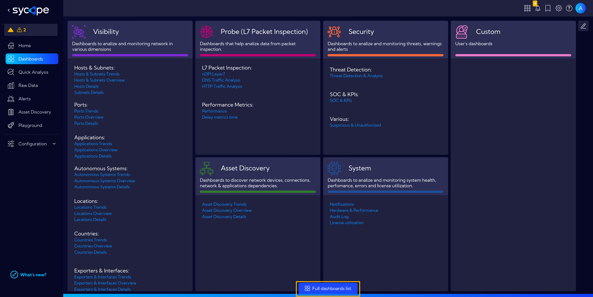
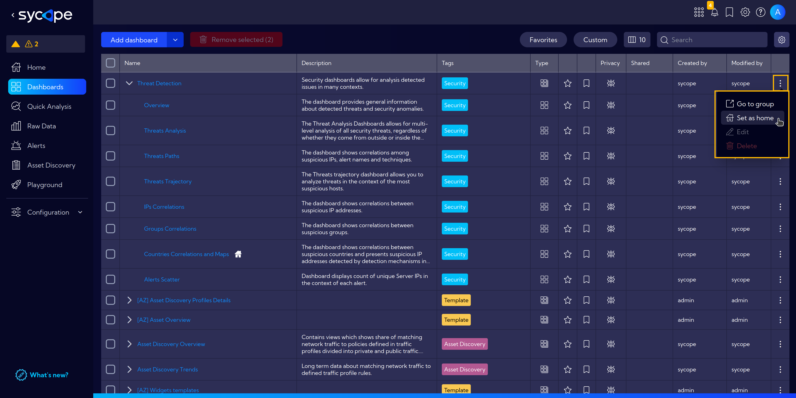

# Home

Here, you can place a **Dashboard** or a **Dashboard Group** to be displayed on the home screen after logging into the System.  
To do this, go to the **`[Dashboards]`** menu and decide whether you want to use a **Dashboard** or a **Dashboard Group**.  

Click at the bottom of the page on **Full dashboards list** to see a list of all available dashboards.

Then click on the **Raw Actions** (three dots icon) and select **Set as home** to set the selected dashboard or the entire group of dashboards as the **Home**.

