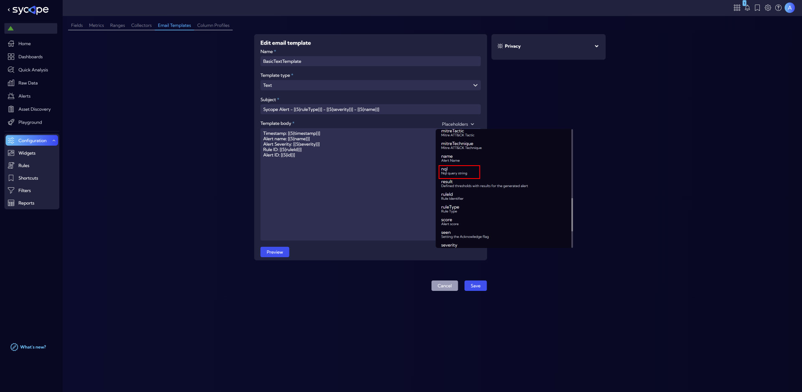

# Email Templates

This menu **[Settings > Configuration > Objects > Email Templates]** can be used to create a template email message that will be sent to recipients that are input into the system (see [**[Configuration > Reports > Recipients]**](/User-Guide/Configuration/Reports/Recipients)). The email will be sent as a reaction to an event generated by the system.

The list of **Email templates** is included in a table with the following columns:

- **Name** - template name.
- **Type** - template type - Html or Text.
- **Action**
  - Edit - edit an existing **Email Template**
  - Duplicate - can be used as a template for a new **Email template**
  - Delete - delete  Email Templates.

To add a new **Email Template** click **New email template** button then the **New email template** wizard will appear. In the wizard window there are the following fields:

- **Template type**
  - Html/Text
- **Name** - system **Email Template** name
- **Subject** - email subject
- **Template body** - email body

## Adding Placeholders
When creating an Email Template, placeholders can be added to insert dynamic variables into the email content. These placeholders are replaced with actual data when the email is generated. Some common placeholders include: ***Timestamp*** - The time of the event, ***Alert name*** - The name of the alert that triggered the email, etc.

### NQL Placeholder
A special placeholder, ***NQL***, can be used to create a link to the Sycope system. This link directs the recipient to the Raw Data view to show the network activity that correlates with the actiity that triggered the alert.
This feature enables recipients to quickly access relevant data in the system, making it easier to investigate the cause of an alert.
