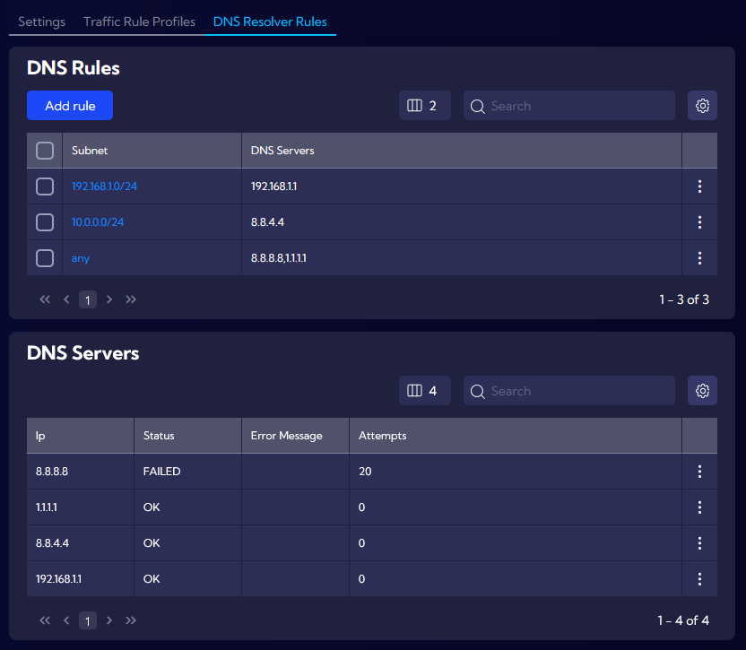
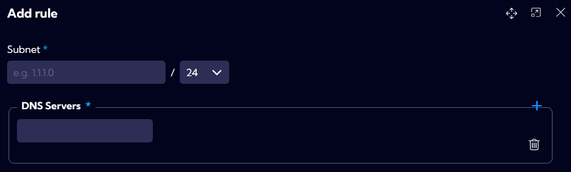
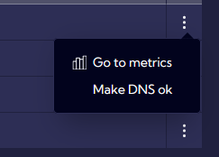

# DNS Resolver Rules

The **`[Settings > IT Asset Discovery > DNS Resolver Rules]`** menu can be used to define and manage DNS Rules as well as DNS Servers. Asset Discovery functionality includes support for multiple DNS Servers and assigning them to different subnets.

After clicking **Add rule**, a window will appear for adding new DNS rule. User can assign multiple DNS Servers to specific subnet. Once the rule is saved, it will appear in the DNS Rules list.

DNS Servers list is populated using saved Servers from DNS Rules. It includes additional options **Go to metrics** for DNS query analysis and **Make DNS ok** for resetting the health **Status**.

