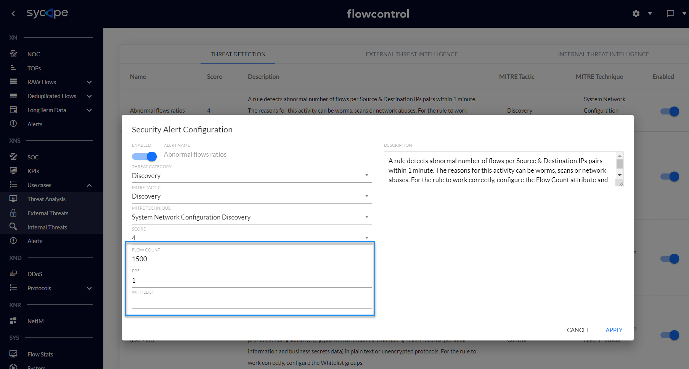

<!-- Wersja 1.6.1 - docusaurus 2.0 dopasowana rozdzielczość rysunków -->

## Threat Detection

The Threat Detection engine generates alerts based on correlations of relevant attributes of network flows (e.g. Netflow) indicating potential security issues. This mechanism consists of 38 security rules for seven MITRE ATT&CK tactics: Initial Access, Credential Access, Discovery, Lateral Movement, Command and Control, Exfiltration and Impact.

### Threat Detection Rules

This section describes all rules triggered by the Threat Detection engine.

| **Name**                                           |
| -------------------------------------------------- |
| Anormal  flows ratios                              |
| Brute  Force Attack                                |
| Cleartext  Application (Ext->Ext)                  |
| Cleartext  Application (Ext->Int)                  |
| Cleartext  Application (Int->Ext)                  |
| Cleartext  Application (Int->Int)                  |
| DDoS  Attack Detected                              |
| DDoS  DNS Amplification Attack                     |
| Horizontal  Scan                                   |
| Unauthorized  Internet Access                      |
| Unauthorized  DHCP Activity                        |
| Unauthorized  DNS Activity                         |
| Vertical  Scan Detected                            |
| DoS  Attack Detected                               |
| DoS -  ICMP Flood                                  |
| DoS -  TCP Flood                                   |
| DoS -  UDP Flood                                   |
| Abnormal  DNS Query Limit                          |
| Abnormal  DNS Response Limit                       |
| DNS  Transfer Limit                                |
| High  Data Transfer (Int->Ext)                     |
| High  Data Transfer (Ext->Int)                     |
| High  Data Transfer (Int->Int)                     |
| Unusually  High Data Transfer (Int->Ext)           |
| Unusually  High Data Transfer (Ext->Int)           |
| P2P  Activity                                      |
| Large  Size Protocol Anomaly                       |
| Multicast  DNS (mDNS) from Internet                |
| OT  Device Discovered                              |
| SPAM  (Ext->Int)                                   |
| SPAM  (Ext->Ext)                                   |
| SPAM  (Int->Ext)                                   |
| SPAM  (Int->Int)                                   |
| Suspicious  Port BL                                |
| Suspicious  Port WL                                |
| Unauthorized  NFS Export Outside The Local Network |
| Unauthorized  RDP from Internet                    |

*Tab. 2.1.1 Threat Detection Rules*.

 

### Initial Configuration

All Threat Detection rules are disabled )to reduce the number of False Positives. In the initial rule configuration process, set rule parameters, such as groups or limits on specific attributes. Each rule has its own set of characteristics, so each of them must be configured separately. For example, in the *Abnormal flow ratios* rule, set the Flow Count, PPF and Whitelists Group parameters.

 *Fig. 2.2.1 Security Alert Configuration*. 

 

If as a result of the analysis, it was determined that a given rule generates many false alarms, then the fine tuning process should be performed.

 

 