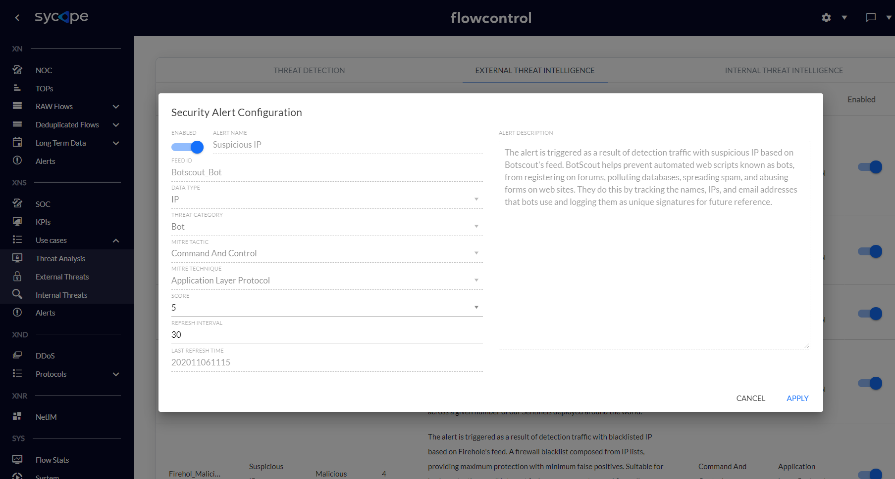
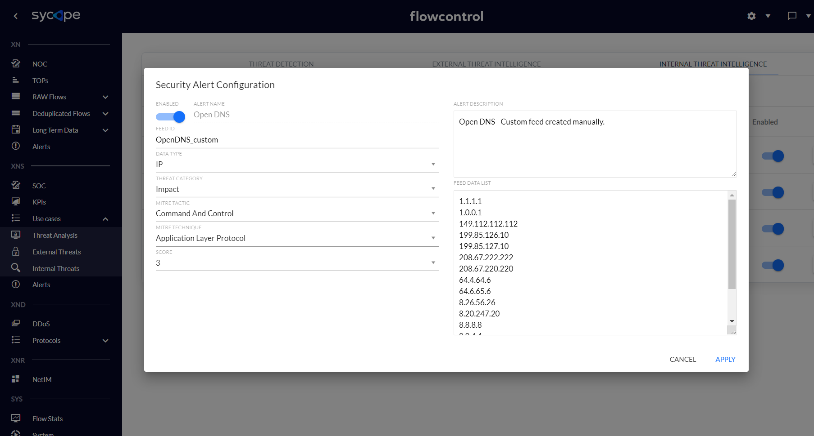

<!-- Wersja 1.6.1 - docusaurus 2.0 dopasowana rozdzielczość rysunków -->

## Threat Intelligence Engine

The Threat Intelligence engine generates alerts based on correlation network flow attributes with external and internal IoCs. XNS regularly updates more than 30 security feeds of malicious IP addresses and suspicious countries.
 The Threat Intelligence mechanism consists of two parts:

•       *External Threat Intelligence*, which uses automatically updated feeds downloaded from the Internet

•       *Internal Threat Intelligence*, which uses manually created and updated feeds.

Both subsystems generate the following security alerts:

•       Connection with Suspicious IP

•       Connection with Suspicious Country

•       Connection with Open Proxy

•       Connection with Open DNS

•       Connection with TOR.

Each of these alerts can be triggered by many reputational feeds.

 

### Threat Intelligence Feeds

The Threat Intelligence of XNS consists of external and internal (custom) feeds.

| Feed id             | Name             | Score | Description                                                  | MITRE Tactic         | MITRE Techniqe              |
| ------------------- | ---------------- | ----- | ------------------------------------------------------------ | -------------------- | --------------------------- |
| IP_CRYPTO_MINING    | Suspicious  IP   | 6     | The  alert is triggered as a result of detection traffic with CRYPTO MINING IP  address. | Impact               | Resource  Hijacking         |
| IP_MALWARE          | Malicious  IP    | 10    | The  alert is triggered as a result of detection traffic with MALWARE IP address. | Command  and Control | Application  Layer Protocol |
| IP_OPEN_DNS         | Suspicious  IP   | 3     | The  alert is triggered as a result of detection traffic with OPEN DNS IP address. | Command  and Control | Application  Layer Protocol |
| IP_PHISHING         | Suspicious  IP   | 9     | The  alert is triggered as a result of detection traffic with PHISHING IP address. | Initial  Access      | Phishing                    |
| IP_PROXY            | Anonymous  Proxy | 4     | The  alert is triggered as a result of detection traffic with PROXY IP address. | Command  and Control | Proxy                       |
| IP_SCANNER          | Suspicious  IP   | 4     | The  alert is triggered as a result of detection traffic with SCANNER IP address. | Discovery            | Network  Service Scanning   |
| IP_SPAM             | Suspicious  IP   | 5     | The  alert is triggered as a result of detection traffic with SPAM IP address. | Initial  Access      | Phishing                    |
| IP_SYCOPE_COMMUNITY | Malicious  IP    | 8     | The  alert is triggered as a result of detection traffic with malicious IP address  noticed by Sycope Community members. | Command  and Control | Application  Layer Protocol |
| IP_TOR              | TOR  Activity    | 7     | The  alert is triggered as a result of detection traffic with TOR IP address. | Command  and Control | Proxy                       |

*Tab. 3.1.1 Threat Intelligence - External Feeds*.

 

| Feed id                   | Name                             | Score | Description                                                  | MITRE Tactic         | MITRE Techniqe              |
| ------------------------- | -------------------------------- | ----- | ------------------------------------------------------------ | -------------------- | --------------------------- |
| ThreatIntelligence_custom | Suspicious  IP                   | 8     | Internal  Threat Intelligence - Custom Feed.                 | Command  and Control | Application  Layer Protocol |
| WhitelistIP               | Exception                        | 1     | IP  Whitelist                                                | Command  and Control | Application  Layer Protocol |
| Country_custom            | Suspicious  Country              | 6     | The  Worst Botnet Countries based on custom list.            | Command  and Control | Application  Layer Protocol |
| Sunburst2                 | Suspicious  IP - Sunburst (Sig2) | 10    | The  feed includes malicious IPs regarding the Sunburst backdoor. Attacker  leverages SolarWinds supply chain to compromise multiple global victims with  this backdoor. | Lateral  Movement    | Remote  Services            |

*Tab. 3.1.2  Sample of Threat Intelligence - Internal Feeds*.

 

### Initial Configuration

Feed management is only possible from the system administrator level. To change any feed, go to the *Settings/Security/External Threat Intelligence* or *Settings/Security/Internal Threat Intelligence*, and then select the feed for which you want to change parameters.

 

Note: In order for external feeds to be constantly updated, it is necessary to allow communication to the addresses of individual feeds. For more information please contact Support.

 

 *Fig. 3.2.1 XNS External Threat Intelligence*.

 

The External Threat Intelligence rules contain the following attributes: Enabled, Alert Name, Feed Id, Data Type, Threat Category, MITRE Tactic, MITRE Technique, Score, Refresh Interval, Last Refresh Time and Alert Description.

| Attribute         | Description                                                  | Possible Values                                              | Modifiable                                          |
| ----------------- | ------------------------------------------------------------ | ------------------------------------------------------------ | --------------------------------------------------- |
| Enabled           | The attribute indicates the status of the rule. Disabled rules do not generate security alerts. | Enabled, Disabled                                            |          |
| Alert Name        | The attribute indicating the name of the  rule.              | Connection with a Suspicious IP, Connection with a Suspicious Country, Connection with Open Proxy, Connection with TOR |          |
| Feed Id           | The attribute indicating the Feed Id for each Threat Intelligence rule. Each rule has a unique value of the Feed Id attribute. |                                                              |          |
| Data Type         | The attribute indicating the type of collected data for each feed. | IP, Country                                                  |          |
| Threat Category   | The attribute indicating the category of feed related to types of security threats. | Bot, Botnet, C2, Feodo, Malicious Malware,  Open Proxy, Ransomware, Rogue DNS, SNMP BL, SSH BL, Telnet BL, TOR, Zeus |          |
| MITRE Tactic      | The attribute indicating the tactic of MITRE ATT&CK related to a security rule. | Initial Access, Execution, Persistence, Privilege Escalation, Defense Evasion, Credential Access Discovery, Lateral  Movement Collection, Command and Control, Exfiltration, Impact |          |
| MITRE Technique   | The attribute indicating the Technique of MITRE ATT&CK related to a security rule. There are about about 200  techniques - more details [ATT&CK MITRE](https://attack.mitre.org/matrices/enterprise/). |                                                              |          |
| Score             | Attribute indicating the importance of the feed on a scale of 1 to 10. | {1..10}                                                      |          |
| Refresh Interval  | Attribute indicating the time interval, how often (in minutes) a feed should be updated. | {0..32767}                                                   |      |
| Last Refresh Time | Attribute indicating the last feed update in format YYYYMMDDhhmm. |                                                              |  |
| Alert Description | Attribute indicating the description of the feed.            |                                                              |  |

*Tab. 3.2.1 External Threat Intelligence Feed Attributes*.

 

 *Fig. 3.2.2 External Threat Intelligence Alert Configuration*.

 

 

The Internal Threat Intelligence engine correlates custom feeds with some attributes of network flows. For this type of alert, all attributes except the alert name can be modified.

| Attribute         | Description                                                  | Possible Values                                              | Modifiable                                          |
| ----------------- | ------------------------------------------------------------ | ------------------------------------------------------------ | --------------------------------------------------- |
| Enabled           | The attribute indicates the status of the rule. Disabled rules do not generate security alerts. | Enabled, Disabled                                            |      |
| Alert Name        | The attribute indicating the name of the rule. The attribute can be set only once when creating a new custom feed. |                                                              |  |
| Feed Id           | The attribute indicating the Feed Id for each rule. Each rule has a unique value of the Feed Id attribute. |                                                              |      |
| Data Type         | The attribute indicating the type of collected data for each feed. | IP, Country                                                  |      |
| Threat Category   | The attribute indicating the category of feed related to types of security threats. | Bot, Botnet, C2, Feodo, Malicious Malware,  Open Proxy, Ransomware, Rogue DNS, SNMP BL, SSH BL, Telnet BL, TOR, Zeus |      |
| MITRE Tactic      | The attribute indicating a Tactic of MITRE  ATT&CK related to a security rule. | Initial Access, Execution, Persistence, Privilege Escalation, Defense Evasion, Credential Access Discovery, Lateral  Movement Collection, Command and Control, Exfiltration, Impact |      |
| MITRE Technique   | The attribute indicating a Technique of MITRE ATT&CK related to a security rule. There are about about 200  techniques - more details [ATT&CK MITRE](https://attack.mitre.org/matrices/enterprise/). |                                                              |      |
| Score             | Attribute indicating the importance of the feed on a scale of 1 to 10. | {1..10}                                                      |      |
| Alert Description | Attribute indicating the description of the feed.            |                                                              |      |
| Feed Data List    | Attribute indicating the values of custom feeds (IP address or Country), one value per line. |                                                              |      |

*Tab. 3.2.2 Internal Threat Intelligence Feed Attributes*.

 

 *Fig. 3.2.3 Internal Threat Intelligence Alert Configuration*.

 

#### Creating a custom feed

Below are the steps to create custom feeds:

1) In the **Settings -> Security -> Internal Threat Intelligence** click **ADD NEW** option.

*Fig. 3.2.1.1  Creating a custom feed - step 1*.

 

2) Fill in the attributes of the new feed and click apply.

 

 Fig. 3.2.1.2 *Creating a custom feed - step 2*.

 

Note: Please remember that only enabled rules generate alerts.

 

#### Adding IP addresses to the Whitelist

Below are the steps of adding IP addresses to the Whitelist IP for Threat Intelligence rules :

1) In the **Settings -> Security -> Internal Threat Intelligence** choose the WhitelistIP_whitelist feed.

 *Fig. 3.2.3.1 Adding IPs to the Whitelist - step 1*.

 

2) Edit the feed and add list of IPs which should be ignored by Threat Intelligence engine into the Feed Data List area.

 *Fig. 3.2.3.2 Adding IPs to the Whitelist - step 2*.
