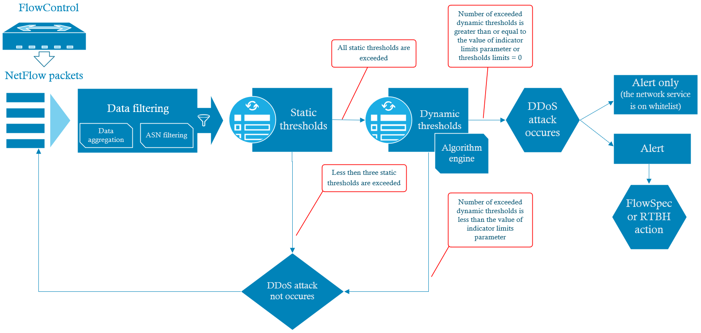
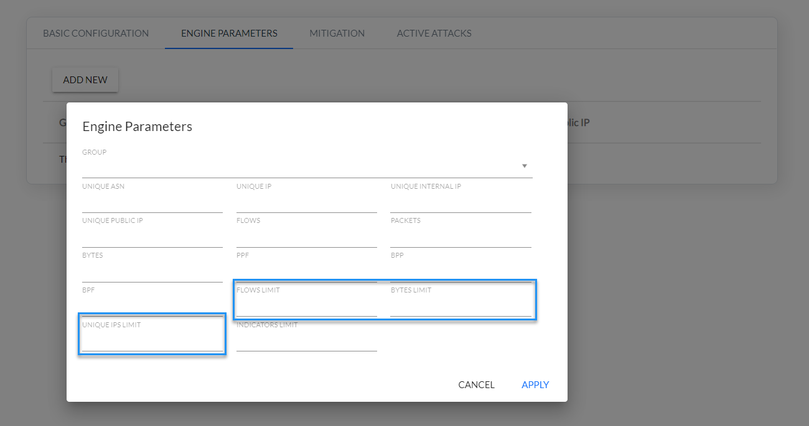
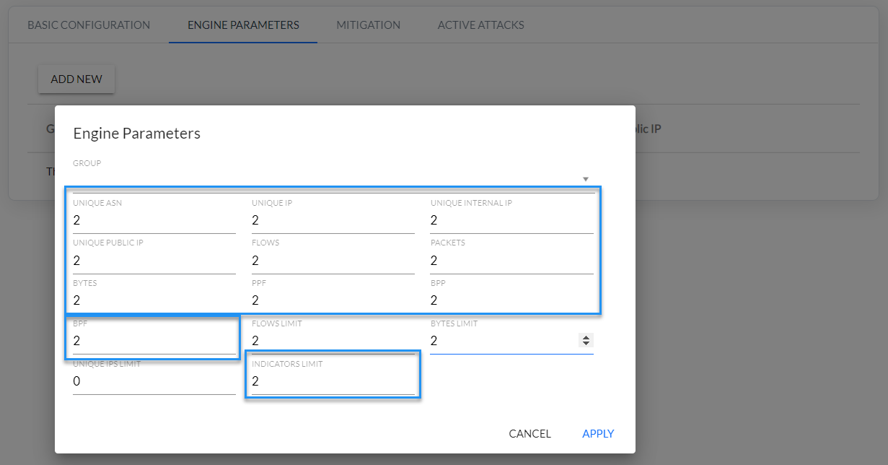

<!-- Wersja 1.6.1 - docusaurus 2.0 dopasowana rozdzielczość rysunków -->

### Introduction to XND Module

​	The FC XND module uses aggregated NetFlow, sFlow, NSEL data. Based on this data and parameters entered by the user, the algorithm calculates a set of data defining the target together with the attacked service and can then take action to limit the effects of the attack. DDoS attacks are detected by the XND module algorithm based on the parameters: static thresholds and dynamic thresholds.

**Static thresholds** are used to optimize and reduce the number of False Positives by filtering network traffic that do not meet quantitative parameters such as: bytes limit, packet limit or unique source IP addresses. All static threshold parameters have to be exceeded in order for the algorithm to start the next step, i.e. calculation of dynamic threshold parameters.

**Dynamic thresholds (behavioral)** are used to compare current network traffic characteristics with the previous sample (baseline). By default, a baseline is created for 15 minutes before the attack. The dynamic threshold parameters are configured in the XND module as a so-called multiplier, which means that multiple of a given indicator cannot be exceeded. The indicator parameter specifies the number of dynamic thresholds that must be exceeded for an attack to be confirmed from the behavioral analysis point of view. 

​	The DDoS mechanism also uses two types of whitelists: **ASN whitelist** and **service whitelist** **– monitoring mode**. The first one is used to define source ASNs to be ignored from the XND module algorithm calculation. The service whitelist, on the other hand, is used to define the services for which only DDoS alerts will be generated, and blocking will not be triggered for them using the BGP FlowSpec protocol or RTBH (Remote Triggered Black Hole Routing).

​	All parameters of the DDoS detection algorithm are configured in relation to the **function group (Settings/Mapping/Groups/Function),**  *Fig. 2.1.1.* Here the resources subject to the procedure contained in the XND module are configured, thus it is possible to fine-tune the XND module mechanism.

*Fig. 2.1.1 XND groups configuration parameters*

### XDN module operation diagram

The *Fig. 2.2.1* shows the operating principle and the individual analysis steps contained in the FlowControl XND module as a diagram.

*Fig. 2.2.1 Concept of the DDoS algorithm implemented in XND module*  

### Data filtering

​	One of the first operations performed by the XND module on input data strings is pre-filtering. Its task should be filter out redundant motion for the analysis algorithm before the grouping process. 

Pre-filtration includes:

1. Target host filtering - filters the target IP addresses of monitored resources. These addresses are configured using function groups defined in the Engine Parameters.
2. TCP client traffic filtering – used to filtering the incoming traffic to the monitored resource, which is a response to queries to external resources. This step is implemented in the FlowControl system engine.
3. Source ASN filtering – defines ASNs that are excluded from analysis by the XND Module algorithm.

### Data Grouping

​	Another activity carried out by the XND module is the network traffic aggregation, i.e. data grouping. This operation is necessary to calculate a set of parameters that determine the target with the attacked service. In this process the following indicators are calculated:

1.   Unique IP addresses
2.   Unique ASNs
3.   Unique internal IP addresses
4.   Unique public IP addresses
5.   Flow counter 
6.   Number of packets
7.   Number of bytes
8.   PPF (Packets per Flow )
9.   BPP (Bytes per Packets)
10.  BPF (Bytes per Flow).   

For a DDoS attack, each set of parameters defining the target together with the service under attack, is a combination of such attributes as: target host, protocol, application and traffic direction. The set parameters defining the target together with the service is **DDoS destination attack identifier (DDA Id).**

### Static thresholds

​	The static threshold parameters are represented by the following limits: flow limit, byte limit, and unique IPs limit – *Table* *2.5.1.* They allow data selection for the analyzed sample in order to determine which data will be taken into account in further steps in the algorithm. At this stage pre-filtered network traffic from the last minute is filtered using the above mentioned limits. In case all static thresholds for a specific DDA Id are exceeded, the XND module algorithm goes to the dynamic parameters analysis procedure. In other cases the algorithm performs filtering with static thresholds for the traffic sample from the next minute.

| **Static Threshold** | **Description**                                              |
| -------------------- | ------------------------------------------------------------ |
| **Flows Limit**      | Minimum number of network flows related to DDA Id.           |
| **Bytes Limit**      | Minimum number of bytes related to DDA I expressed in [MB].  |
| **Unique IPs Limit** | Minimum number of unique source IP addresses related to DDA Id. |

*Table 2.5.1 Static threshold parameters.*

​	Values of the static threshold parameters are configured in the Engine Parameters tab as shown in *Fig. 2.5.2.*

*Fig. 2.5.2 Static threshold parameters configuration*  

### Dynamic thresholds

​	Ten dynamic thresholds and indicator limits are implemented in the FC XND module. They are described in *Table 2.6.1*.    

| Dynamic Thresholds         | **Description**                                              |
| -------------------------- | ------------------------------------------------------------ |
| **Unique ASNs**            | Number of unique ASNs related to DDA ID.                     |
| **Unique IPs**             | Number of all unique source IP addresses (external and internal) related to DDA ID. |
| **Unique Internal IPs**    | Number of all unique source internal IP addresses related to DDA Id. Internal (private) addresses are configured in the Settings/Mapping/Groups/Internal tab. |
| **Unique Public IPs**      | Number of all unique source external IP addresses related to DDA Id. |
| **Flows**                  | Number of flows related to DDA ID.                           |
| **Packets**                | Number of packets related to DDA ID.                         |
| **Bytes**                  | Number of bytes related to DDA ID.                           |
| **PPF (Packets per Flow)** | Number of packets per network flows calculated as sum of packets divided by sum of network flows in context of DDA ID. |
| **BPP (Bytes per Packet)** | Number of bytes per packet calculated as sum of bytes divided by sum of packets in context of DDA Id. |
| **BPF (Bytes per Flow)**   | Number of bytes per flows calculated as sum of bytes divided by sum of the flows in context of DDA Id. |
| **Indicator Limit**        | Threshold – specifies the number of threshold limit parameters that must be exceeded for the algorithm to consider the analysis to be positive. |

*Table 2.6.1 Dynamic threshold parameters* 

The value of the **Indicator Limit** controls parameters determining how many dynamic parameters must be exceeded for the algorithm to consider the analysis to be positive.

***Example:***  *“Indicators limit = 2” - this means that only two out of ten parameters of the dynamic threshold limits listed in Table 2.6.1 are exceeded for the algorithm to give a positive result.*

> **Note**: for the parameter “Indicators limit =0” the algorithm for dynamic analysis always gives a positive result!

​	Values of the dynamic threshold parameters from are configured in the Engine Parameters tab as shown in *Fig. 2.6.1.*

*Fig. 2.6.1 Dynamic threshold parameters configuration* 

​	Dynamic threshold parameters are calculated using analysis behavioral mechanism for defined function groups. This mechanism uses data from time intervals preceding the analyzed sample - so-called reference data. This is base data which is used to calculate average values for a set of metrics necessary to detect DDoS attacks. A reference data is data averaged from the last fifteen minutes preceding the analyzed sample. This is used in the comparison process with the analyzed data to calculate dynamic threshold parameters. *Fig. 2.6.2* shows time intervals used to calculate dynamic threshold parameters. 

*Fig. 2.6.2 Time intervals for determining reference and analysed data*

The dynamic thresholds during an ongoing attack are calculated by the algorithm in a different way than at the beginning of the attack. In such a case the value of each dynamic threshold parameter exceeded must be less than half of the threshold value set by the user for it to be treated as an unexceeded parameter.

---

> **NOTE:**
>
> **For the DDoS algorithm to work correctly, you must set the values for all Engine Parameters, both static *(Fig. 2.5.2)* and dynamic *(Fig. 2.6.1).***

---

### XND module response to the DDoS attacks

​	In the next step of the algorithm implementation, depending on the configuration of the XND module, one of two actions can take place according to *Fig. 2.2.1*:

1. Generating an alarm and block the offending traffic on routers using FlowSpec or RTBH functionality.
2. Generating an alarm only if the service has been entered on the service whitelist.
