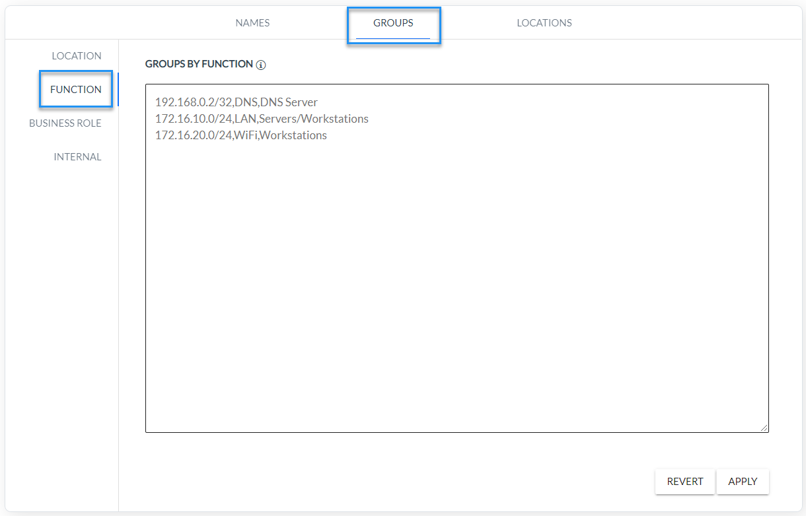
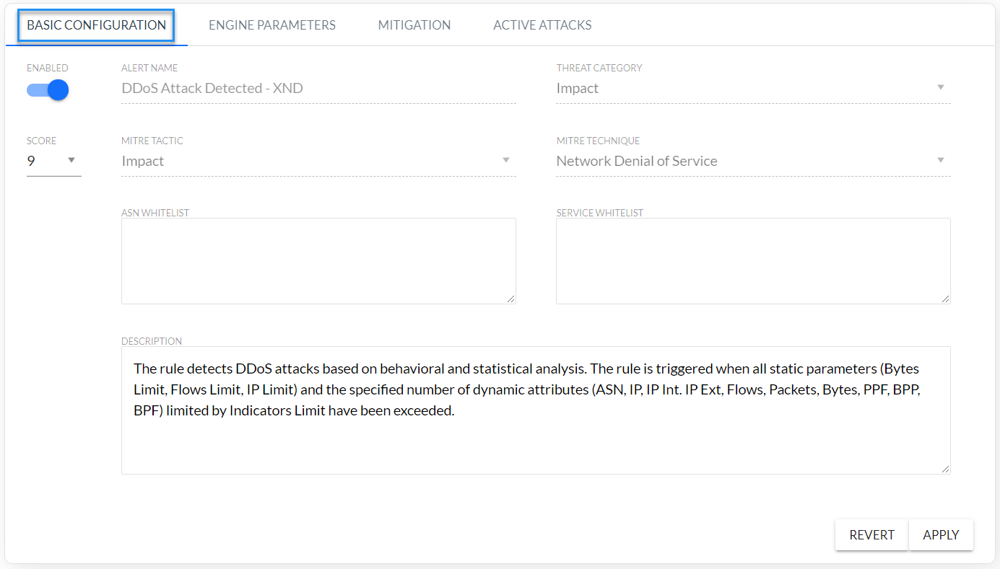
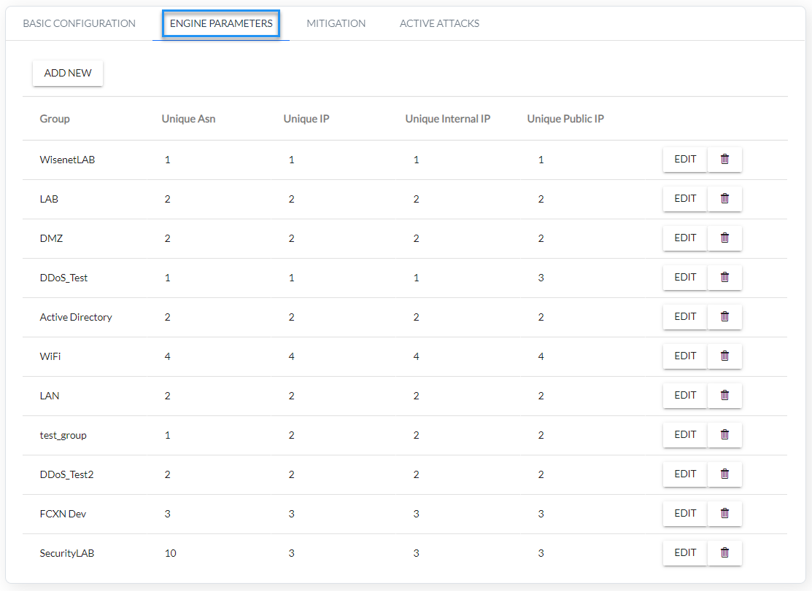
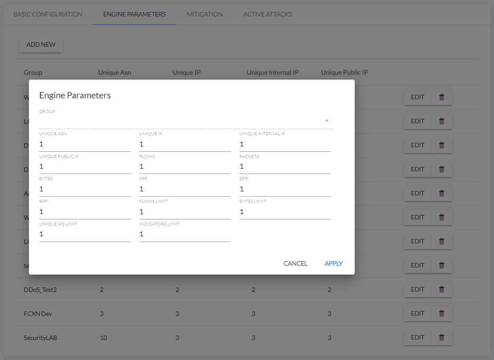
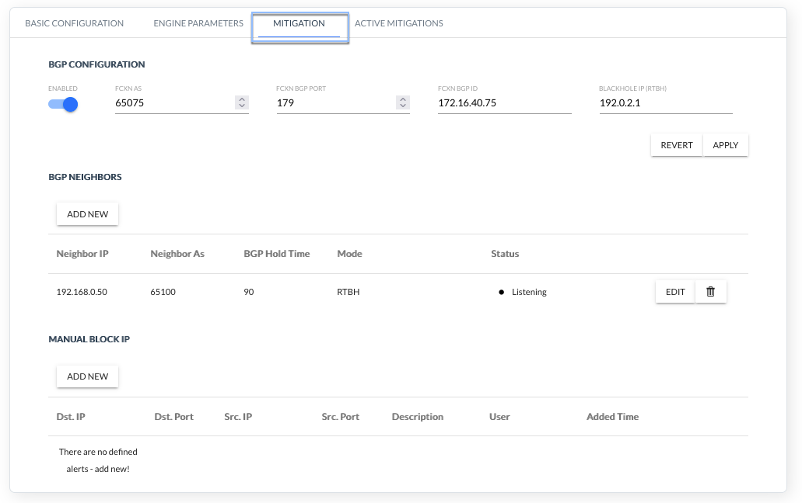
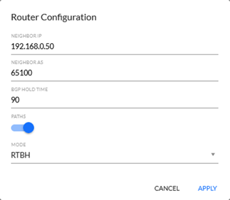
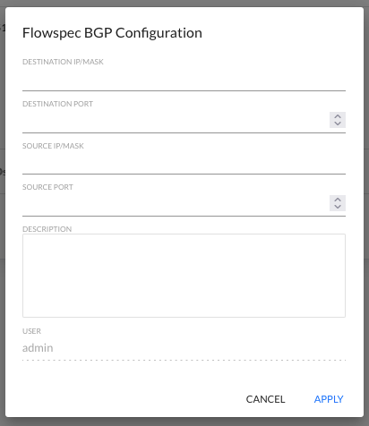
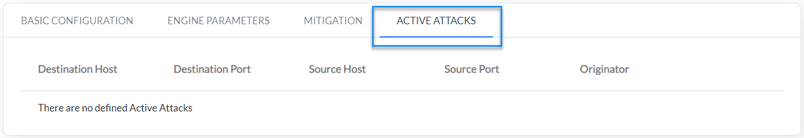

<!-- Wersja 1.6.1 - docusaurus 2.0 dopasowana rozdzielczość rysunków -->

### Introduction to XND configuration

The following section describes the configuration procedure for the detection mechanism and prevention of DDoS attacks implemented in the XND module. This mechanism extends XNS (Security) module capabilities with advanced detection algorithms and defense mechanisms against DDoS attacks.

Detection of DDoS attacks can be performed by the security threat detection engine (XNS module) as well as an advanced mechanism to detect and prevent DDoS attacks (XND module). The list of rules for detecting DDoS attacks in XNS module can be found below in *Table 4.1.1.*

| **Rule Name**                                                | **Description**                                              |
| ------------------------------------------------------------ | ------------------------------------------------------------ |
| **DDoS Attack Detected**                                     | This rule detects DDoS Attacks based on traffic volume from multiple IP addresses to a single destination IP on the same port. The attack involves saturating network resources causing disruption of normal traffic on the target server. For the rule to work correctly, configure the Counter Threshold and Whitelist groups. |
| **DDoS DNS Amplification Attack**                            | This rule detects DDoS DNS Amplification Attacks based on network traffic statistics (Signature 1). To create heavy traffic, an attacker sends a request in a way that generates the largest possible response from DNS name resolution services. As a result, the target receives reinforcement of the initial attacker's traffic, and their network is clogged with false traffic, which causes denial of service. For the rule to work correctly, configure the following attributes: Flow Count and PPF (Packets Per Flow). |
| **DoS Attack Detected**                                      | This rule detects DoS Attacks based on traffic volume from one IP address to single IPs on a specific port. For the  rule to work correctly, configure the Port Threshold List format as follows:  Flows_Threshold\ Port\ Service and Whitelist groups. |
| **DoS - ICMP                                             Flood** | This rule detects DoS ICMP attacks. An attacker can send a large number of ICMP packets to consume all available bandwidth of a victim's host. For the rule to work correctly, configure the following attributes: Flow Count, PPF (Packets per Flow), PPM (Packets Per Minute) and Whitelist groups. |
| **DoS - TCP**                                                              **Flood** | This rule detects TCP DoS attacks. An attacker can send a large number of TCP packets to one or several ports of the victim, which eventually renders the attacked host unable to process the incoming packets. For the rule to work correctly, configure the following attributes: Flow Count, PPF (Packets per Flow), PPM (Packets Per Minute) and Whitelist groups. |
| **DoS - UDP**                **Flood**                       | This rule detects DoS UDP attacks. An attacker can send a large number of UDP packets to consume all available bandwidth of the victim's host. For the rule to work correctly, configure the following attributes: Flow Count, PPF (Packets per Flow), PPM (Packets Per  Minute) and Whitelist groups. |

*Table 4.1.1 DDoS rules list in* *XNS module*

### XND module configuration steps

1. Create function groups (to be used in the XND mechanism) in the network map (Settings/Mapping/Groups/Function). A function group is a group of IP addresses that is monitored. The function group can be given its own name (*Fig. 4.2.1*). 

*Fig. 4.2.1 Function group configuration*

 

2. Configure XND basic module (*Fig. 4.2.2*)

*Fig. 4.2.2 DDoS basic configuration*

| Rule  Attribute        | Description                                                  |
| :----------------- | :----------------------------------------------------------- |
| Enabled            | Determining whether the rule is enabled                      |
| Alert Name | The name of the rule is “DDoS Attack Detected – XND”, but the name of the alarms of this rule are START: DDoS Attack Detected  - XND" and "STOP: DDoS Attack Detected - XND". |
| Threat  Category | Threat category according to FlowControl nomenclature. |
| Score              | Criticality of alarm on a scale 1-10: 10-9 Critical, 8-7 High, 6-4 Medium, 3-2 Low. |
| MITRE Tactic | Tactical name according to MITRE technique.                  |
| MITRE  Technique   | Technique name according to MITRE technique.                 |
| ASN  Whitelist | Whitelist of source ASNs, i.e. ASNs to filtered out of by XND module mechanism. |
| Service  Whitelist | List of services excluded from the attack mitigation mechanism – alerts are still generated. Examples of Whitelist records:   (1)      (Destination_IP,Port)  – blocks the selected services for specified IP address   (2)      (Destination_IP,*)  – blocks all services for the specified IP address  (3)      (Subnet,Port)  – blocks the service for hosts in specified subnet   * means all ports |

*Table 4.2.1 XND module DDoS basic configuration*

3. Configure DDoS parameters for individual function groups (*Fig. 4.2.3, Fig. 4.2.4*)

*Fig. 4.2.3 Configuration of a DDoS parameters for monitored groups.*

*Fig. 4.2.4 DDoS parameters configuration for selected function groups*.

4. Configure DDoS Mitigation (*Fig. 4.2.5*)

*Fig. 4.2.5 FlowSpec BGP configuration*

**BGP NEIGHBORS**

| Configuration  Attribute | Description|
|:--------------------------------   | :-----------|
| Enabled | Enabled/Disabled BGP support |
| FCXN AS    | BGP ASN number of FCXN system                                |
| FCXN BGP Port | BGP port of FCXN system                                      |
| FCXN BGP ID | BGP ID of FCXN system                                        |
| Blackhole IP (RTHB) | Blackhole IP address. Static route must be configured on the router that re-directs traffic destined to this IP to Null or discard interface. |
| Neighbor IP | IP address of the neighboring router                         |
| Neighbor AS | BGP ASN number of the neighboring router                      |
| BGP Hold Time | BGP Hold Time interval of FCXN system      |
| Mode                         | Mitigation type: FlowSpec or RTBH                            |
| Status                       | BGP connection status: <u>*Listening /  Waiting for connection*</u> - System FCXN waiting for BGP connection to be initiated by the router. Not  connected: remote AS different than expected (LocalAS) – disconnected. ASN number given is different from that configured on the router.     <u>*Disconnected by neighbor*</u> – BGP connection was interrupted by the router. After a few seconds the status should change to “Waiting for connection”.  <u>*Disconnected*</u> – BGP connection was interrupted by the FCXN system (e.g. after changing the settings). After a few seconds the status should change to  “Waiting for connection”.     <u>*Disconnected: other error (report to Tech  Support)*</u> – BGP connection interrupted for other reasons. After a few seconds the status should change to  “Waiting for connection”.   <u>*Connected*</u> – BGP connection established with the router. The field may contain additional information:     * actual HoldTime different than expected – Hold Time parameter give in the settings is different from that configured on the router.   * not sending IPv4/IPv6 AS paths – Path option is enabled, but the router is not configured to send BGP ASN tracks.    * exported IPv4/IPv6 AS paths ignored – Router is configured to send BGP ASN tracks, but Paths option is disabled. Paths are ignored.    * no FlowSpec IPv4/IPv6 support – FlowSpec option is enabled, but the router does not support this protocol.    * FlowSpec IPv4/IPv6 support can be turned off – Router supports FlowSpec, but in FCXN settings this option is disabled. FlowSpec rules are not sent to the router. |

*Table 4.2.2 BGP FlowSpec configuration parameters*

### 

*Click the ADD NEW button and configure router* 

| Configuration  Attribute | Description                              |
| ------------------------ | ---------------------------------------- |
| Neighbor IP              | IP address of the neighboring router     |
| Neighbor AS              | BGP ASN number of the neighboring router |
| BGP Hold Time            | BGP Hold Time interval of FCXN system    |
| Paths                    | (Not implemented  yet)                   |
| Mode                     | Mitigation type: FlowSpec, RTBH or None  |

**MANUAL BLOK IP**

*Click the ADD NEW button and configure Manual Block IP* 

| Configuration  Attribute | Description                                  |
| :----------------------- | :------------------------------------------- |
| Dst. IP                  | Destination IP address with a mask (IP/Mask) |
| Dst. Port                | Destination port (0-65535)                   |
| Src. IP                  | Source IP address with a mask (IP/Mask)      |
| Src. Port                | Source port (0-65535)                        |
| Description              | Rule description (Text)                      |
| User                     | Filled automatically                         |
| Added Time               | Filled automatically                         |

6) Check which services are blocked by BGP FlowSpec (*Fig. 4.2.6*).

*Fig. 4.2.6 Displaying services blocked by* *BGB FlowSpec*

