<!-- Wersja 1.6.1 - docusaurus 2.0 dopasowana rozdzielczość rysunków -->

## Access to the system Command Line Console (CLI)

If the installation and deployment have been successfully completed, configuration process can be applied. Run the virtual machine that has been created. In order to access the configuration panel press **Left Shift** button 5 times. **Cmd** console will pop up, there will be command line asking for a password.

> For the Admin account, the default password is: **FcxN12#$** (It is strongly recommended to change this password later in GUI). Network configuration status and list of **CLI** commands will be displayed after successful login. The list of CLI commands  are presented in figure below.

The system command root folder real terminal view is displayed. Some CLI commands are used to enter into the group of commands related to them.

## FlowControl command line interface (CLI) commands

After login to CLI console the status of network configuration and the list of CLI commands should be as seen in the figure below.

---

> **Important notice:**
>
> Users will be logged out automatically after 5 minutes of inactivity.

---

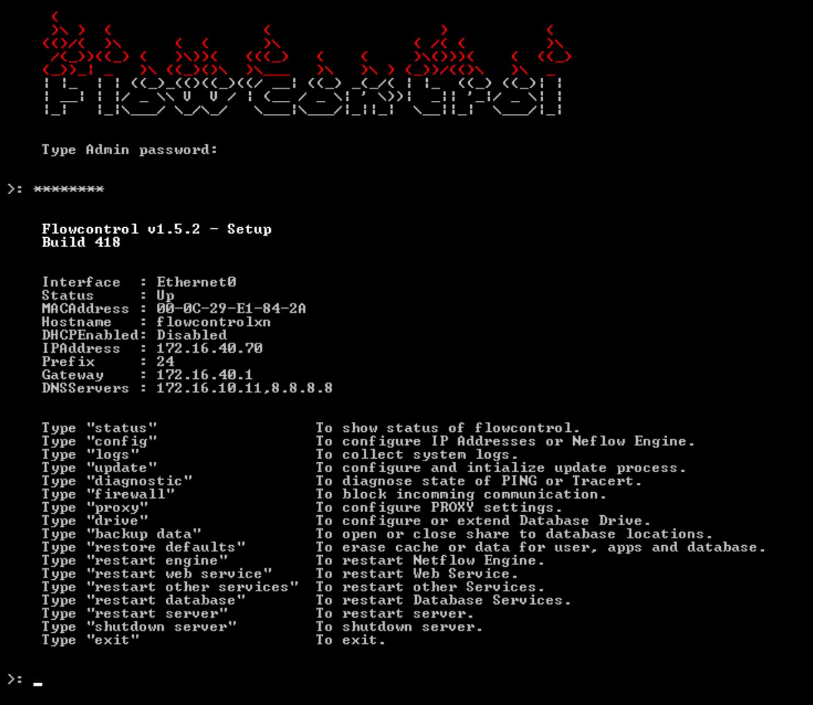

In the diagram below are the CLI commands structure tree related to real console view.
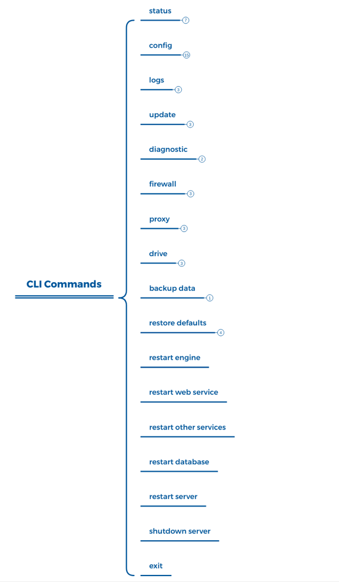

---

### [status]

The command [**status**] is used to display actual status of most important system parameters as shown below .

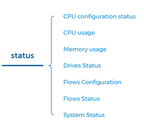

[**status**- CPU configuration status] - displays information if CPU configuration is correct and how many CPU’s the system actually uses. If not check ESX configuration. 

[**status**- CPU usage] - displays percentages of CPU’s usage. 

[**status**- Memory usage] - displays percentages and GB numbers of free Memory and total number of Memory in GB. 

[**status**- Drives status] - displays information on how physicals drives are configured related to free space. Status of status of drives is also shown here. 

[**status**- Flows configuration] - displays NetFlow, sFlow port configurations.

[**status**- Flows status] - displays actual number of Total Packets, Total Flows, Analyzed Flows and Flow Type (NetFlows, sFlows)

[**status**- System status] - displays information stating if most important system elements should be working property.

The figure below shows the real CLI console view for [status] command.  

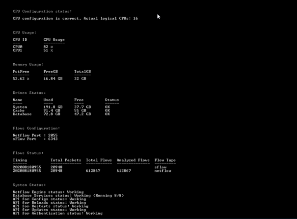

---

### [config]

The [**config**] command is used to enter the group of commands allowing changes to all of the most important system network parameters as shown below.

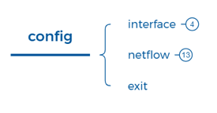

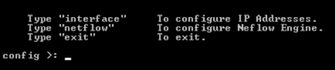

[**config**-interface] - The command  [config-interface] is used to configure IP addresses for any interfaces connected to the FC system.

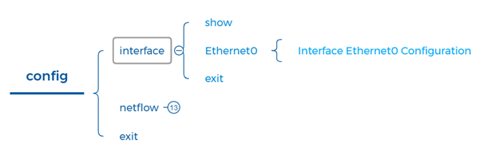

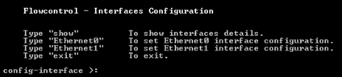

[**config**-interface-show] - The command [**config**-interface-show] is used to show detailed information of any network interfaces connected to FC system.

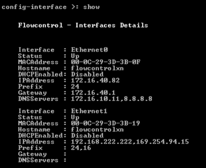

[**config**-interface-Ethernet0] -  The command [**config**-interface-Ethernet0] is used to configure network parameters of interface Ethernet0. Either DHCP or static IP address can be configured.

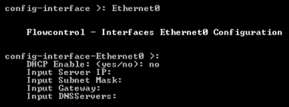

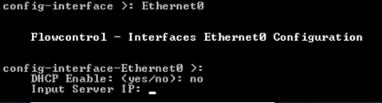

[**config**-interface-exit] - Exit to previous main menu.

[**config**-netflow] -  The command [**config**-netflow] is used to enter groups of commands related  to NetFlow, IPFIX, ASA NSEL and sFlows protocols configuration and monitoring. 

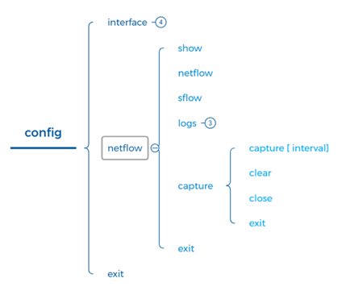

[**config**-netflow-show] - The command [**config**-netflow-show] is used to show detailed information of NetFlow port configuration.

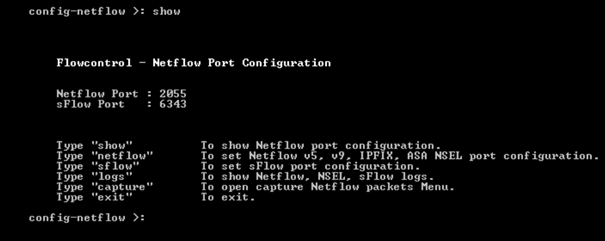

[**config**-netflow- netflow] - The command [**config**-netflow-netflow] is used to configure NetFlow, IPFIX ports.

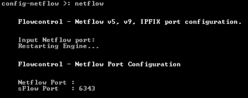

[**config**-netflow- sflow] - The command [**config**-netflow-sflow] is used to configure sFlow  ports.

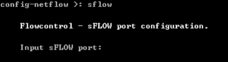

[**config**-netflow- logs] - The command [**config**-netflow-logs] is used to enter groups of commands related to NetFlow, NSEL, sFLow logs.

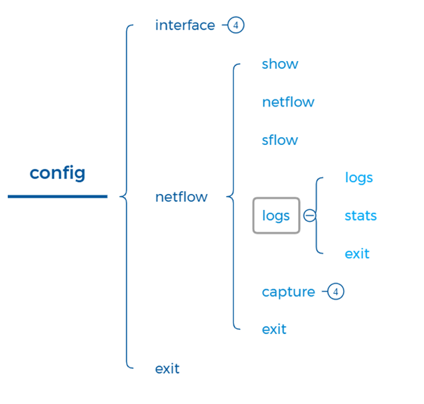

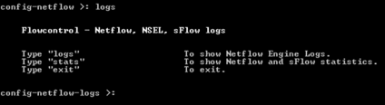

[**config**-netflow-logs-logs] - The command [**config**-netflow-logs-logs] is used to show NetFlow, NSEL, sFlow engine logs.

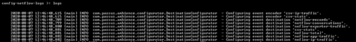

[**config**-netflow-logs-stats] - The command [**config**-netflow-logs-stats] is used to show NetFlow, NSEL, sFlow total statistics. 

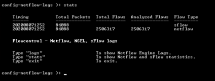

[**config**-netflow-logs-exit] - Exit to previous menu.

[**config**-netflow-capture] - The command [**config**-netflow-capture] is used to enter groups of commands related to NetFlow capture  packets.

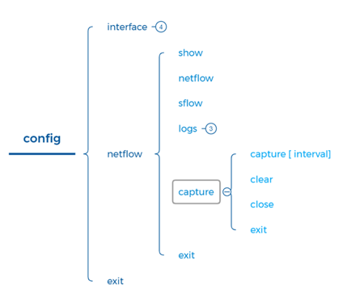

[**config**-netflow-capture-capture [interval]] - The command [**config**-netflow-capture-capture [interval] ] is used  to start capture NetFlow packets. The interval of capture must be set in range of 1 to 600 sec. All capture information is available in FlowControl share folder \\\ *IP address\captures*.

[**config**-netflow-capture-clear] - The command [**config**-netflow-capture-clear] is used to delete all capture files.

[**config**-netflow-capture-close] - The command [**config**-netflow-capture-logs-close] is used to close share with capture files.

[**config**-netflow-capture-exit] - Exit to previous menu.

[**config**-netflow-exit] - Exit to previous menu.

---

### [logs]

The command [**logs**] is used to enter groups of commands related to log collection management from the FlowControl System

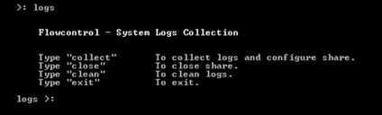

​	[**logs**-collect] - The command [**logs**-collect] is used to start collecting system logs and writing them to disc drive

[**logs**-close] - The command [**logs**-close] is used to stop collecting logs.

[**logs**-clean] - The command [**logs**-clean] is used to delete all logs/capture files.

[**logs**-exit] - Exit to previous menu.

---

### [update]

The command [**update**] is used to enter groups of commands related  to FlowControl system update.

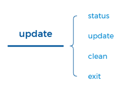

[**update** - status] - The command [**update**-status] is used to show status of the system updating.

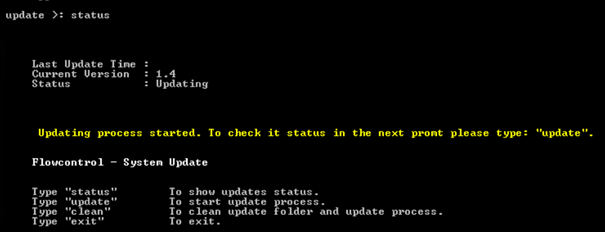

[**update** - update] - The command [**update**-update] is used to start update process. 

[**update** - clean] - The command [**update**-clean] is used to clean update folder.

[**update** - exit] - Exit to main menu.

---

### [diagnostic]

The command [**diagnostic**] is used to enter groups of commands related  to FlowControl network connections diagnostics.

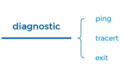

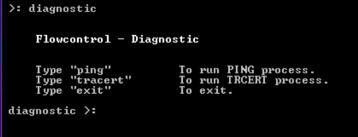

[**diagnostic**-ping] - Run ping command.

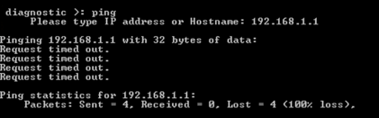

[**diagnostic**-tracert] - Run tracert command.

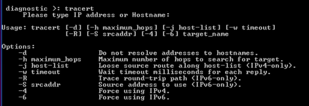

[**diagnostic**-exit] - Exit to previous menu.

---

### [firewall]

The command [**firewall**] is used to enter groups of commands related  to management of blocking/allowing  incoming communication from IP addresses.

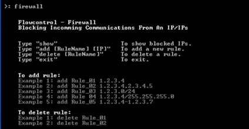

[**firewall**- show] - The command [**firewall**-show] is used to enter actual blocked IP addresses.

[**firewall**- add [RuleName] [IP]] - The command [**firewall**- add [RuleName] [IP]] is used to add rule to firewall

[**firewall**- delete [RuleName]] - The command [**firewall**- delete [RuleName]] is used to delete rule on firewall

[**firewall**- exit] - Exit to main menu.

---

### [proxy]

The command [**proxy**] is used to enter groups of commands related to configuration: of proxy server for FlowControl system. 

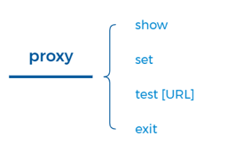

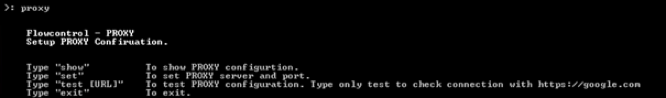

[**proxy** - show] - Shows current proxy configuration

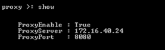

[**proxy**-set] - The command [proxy-set] is used to set PROXY server and port.

[**proxy**-test[URL]] - The command [proxy-test[URL]] is used to test PROXY server connection.

[**proxy**-exit] - Exit to main menu.

---

### [drive]

The command [ **drive**] is used to enter groups of commands related to memory drive add, configuration and monitoring. 

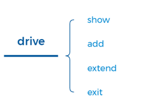

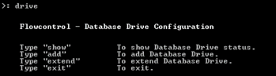

[**drive**-show] - Show current drive configuration

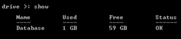

[**drive**-add] - The command [**drive**-add] is used to add new drive to the system.

[**drive**-extend] - The command [**drive**-extend] is used to extend already existing memory drive.

[**drive**-exit] - Exit to main menu.

---

### [**backup data**]

The command [**backup data**] is used to copy the database with metrics to external storage media or to move the data to another Flowcontrol server. The command "**backup data** can also be used to restore the database.

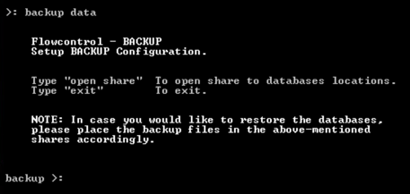

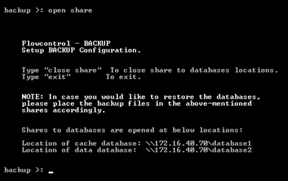

---

### [**restore defaults**]

The command [**restore defaults**] is used to restore the databases to default settings.

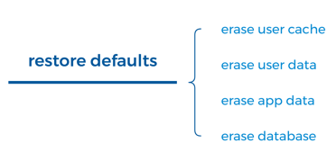

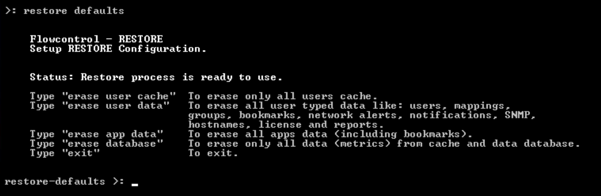

[**restore defaults**-erase user cache] - The command [**restore defaults**-erase user cache] is used to erase all users cache.

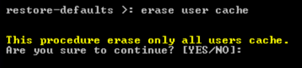

[**restore defaults**-erase user data] - The command [**restore defaults**-erase user data] is used to erase all user data like: users, mappings, groups, bookmarks, network alerts, notifications, SNMP, hostnames, license and reports.

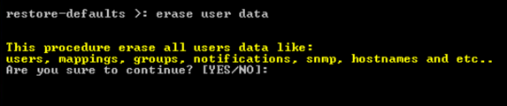

[**restore defaults**-erase app data] - The command [**restore defaults**-erase app data] is used to erase all applications data including bookmarks.

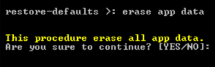

[**restore defaults**-erase database] - The command [**restore defaults**-erase database] is used to erase all data/metrics both from database and cache.

---

### [**restart engine**]

 The command [**restart engine**] is used to restart FlowControl System engine.

---

### [**restart web service**]

 The command [**restart web service**] is used to restart FlowControl System web service.

---

### [**restart other services**]

 The command [**restart other services**] is used to restart FlowControl System other services.

---

### [**restart database**]

The command [**restart database**] is used to restart FlowControl System databases.

---

### [**restart server**]

 The command [**restart server**] is used to restart FlowControl System server.

---

### [**shutdown server**]

 The command [**shutdown server**] is used to shutdown FlowControl System server.

---

