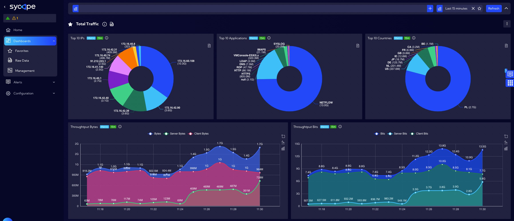

One of the most important elements of the system are Widgets. Widgets are designed to display information of a certain kind and source, which can be a summary, a value calculated from multiple data, a graph or a function, etc.

**Sycope** includes a lot of different types of widgets, designed to fulfill different data display needs. You can add, remove, and customize widgets to personalize your dashboard, displaying just the data you need. Widgets are used to create dashboards, which are views that contain multiple widgets.

The system contains built-in **Widgets** a list of which can be found in the [Dashboard>Management>**Widgets**] menu. Based on the built-in **Widgets** you can create your own by selecting the **Duplicate** button from the **Actions** column and then modify selected **Widget** elements. After saving the **Widget** with a new name, it is ready to use and will appear on the list in the **Widgets** table.

- **Select** - checkbox button - to select for further editing 
- **Favourite** - star icon -  to add to favorites
- **Type** - Widget type: Line, Scatter, Bar … 
- **Name** - unique Widget name
- **Tag** - assigned tags
- **Description** -  Widget description entered by user
- **Privacy** - privacy status icon
- **Shared** - name of the user who shared the Widget
- **Created By** - name of the user who created the Widget
- **Creation Time** - creation time
- **Modified By** - name of the user who last modified the Widget
- **Modification Time** - last modification time
- **Streams** - data streams used to create  Widget
- **Used in** - objects in the System where the  Widget is used
- **Action**

  - Duplicate - creating an editable copy of the Widget
  - Export - exporting the Widget to file in json format
  - Edit - edit a created Widget
  - Delete - delete a selected Widget

---

# Adding custom widgets

Widgets are created and edited in this menu [Dashboard>Management>**Widgets**]. To add a widget, click on the **Add Widget** button, then the widget wizard will appear. The procedure for creating a widget consists of three or four steps depending on the visualization type selected in the first step.

The system includes the following types of visualization:

1. **Line**
2. **Scatter**
3. **Bar**
4. **Gauge**
5. **Pie**
6. **Graph**
7. **Map**
8. **Sankey**
9. **Sunburst**
10. **Tree**
11. **Tree Map**
12. **KPI**
13. **Table**
14. **Text Image**
15. **Filters**
16. **Radar**

