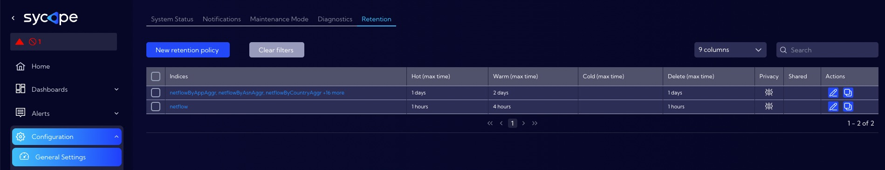
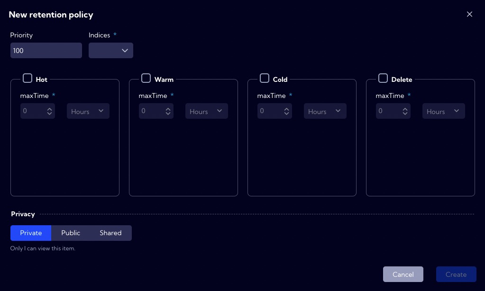
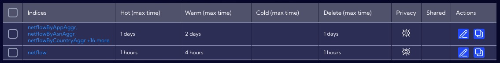
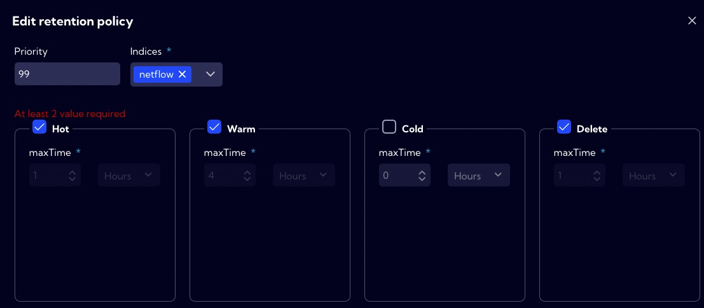

This menu [Configuration>General Settings >**Retention**] can be used to manage data retention. 

The Retention Mechanism allows automated management of data life, taking into account such factors as performance and data size.

Data streams are stored on partitions of which there are four types in the system:

- **Hot** - data just written, updated - maximum read and write speeds, high disk
  utilization.
- **Warm** - deferred data that are no longer written while they can be read and searched.
- **Cold** - low read and speed, low disk utilization.
- **Delete** - data to be deleted.

You can change the storage location of a particular **Data Stream** in the context of the partition type. The **maxTime** parameter is used for this and it is the maximum time after which the partition type will be changed to another.

When the maxTime condition is met, the partition type is changed in the following order:

:::info

It is not possible to change partitions for a particular data stream from a type with a lower status to a type with a higher status, e.g. **Cold** -> **Warm** or **Warm** -> **Hot**.

:::

## Retention policy

Data retention takes place in the system based on user-configurable **Retention policies**. It is required to define at least two types of partitions for the policy. Policies are executed periodically (every 30 minutes) in the order specified in the **Priority** field. The value in the **Priority** field must be between 1-100 where 1 is the highest priority and 100 is the lowest. When creating policies, care should be taken to ensure that policies do not overlap or duplicate because any policy defined will be executed.

:::caution

The system after installation has two built-in **Retention policies**. Please check them out and adjust them to your needs. that cannot be deleted or modified. They can be used as a template to create new user policies.

:::

:::danger

If you do not define a **Delete** partition in the **Retention policy** the data to which the policy applies will never be erased

:::

### Default Retention policy

#### 1. Build-in policy parameters for netflow data stream.

| Partition type | maxTime     |
| -------------- | ----------- |
| Hot            | 1 hour      |
| Warm           | 4 hours     |
| Cold           | not created |
| Delete         | 1 hour      |

This means that the data from the **netflow** stream are stored in the system for 6 hours, with the last hour's data stored with the **Hot** index, the next 4 hours set aside with the **Warm** index. The last hour before completely erasure, the data has a **Delete** status.

#### 2. Build-in policy parameters for aggregated data stream: netflowTotalAggr, netflowByIfcAggr, netflowByAppAggr, netflowByAsnAggr, netflowByGroupAggr, netflowByProtocolAggr, netflowByTosAggr.

| Partition type | maxTime     |
| -------------- | ----------- |
| Hot            | 1 day       |
| Warm           | 2 days      |
| Cold           | not created |
| Delete         | 1 day       |

This means that the data from the above-mentioned aggregated streams are stored in the system for 4 days, with the data from the last day stored in the **Hot** partition, the next 2 days set aside in the **Warm** partition. The last day before erasure, this data has a **Delete** status.

