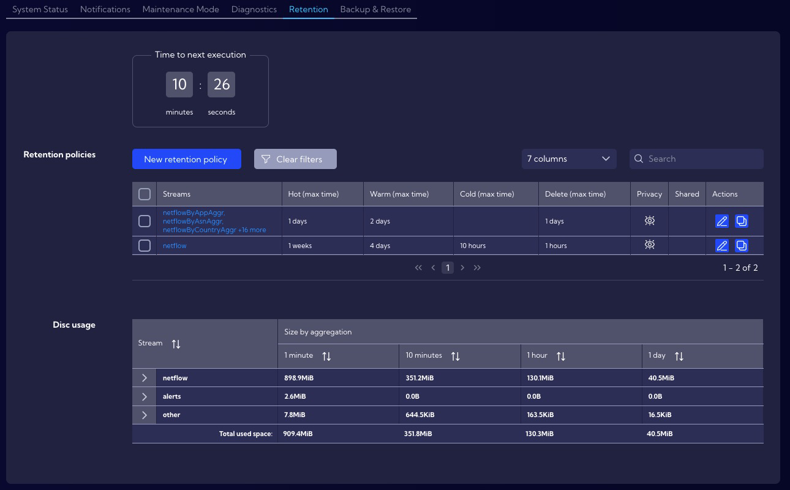
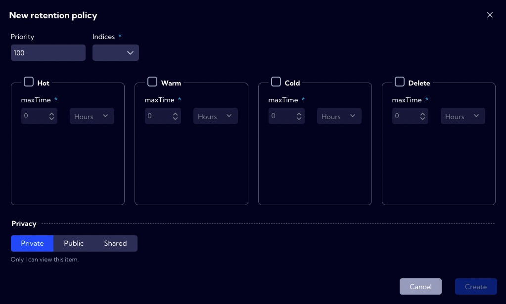
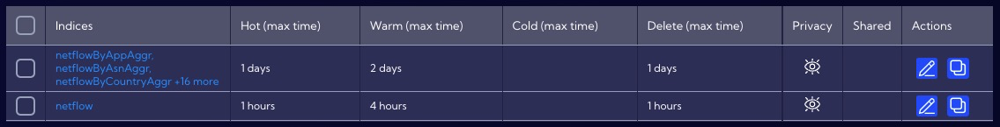

# Retention

This menu [Configuration>General Settings >**Retention**] can be used to manage data retention. 

The Retention Mechanism allows automated management of data life, considering factors such as performance and data size.

Data streams are stored on partitions, of which there are four types in the system:

- **Hot** - data just written, updated - maximum read and write speeds, high disk
  utilization.
- **Warm** - deferred data that are no longer written while they can be read and searched.
- **Cold** - low read and speed, low disk utilization.
- **Delete** - data to be deleted.

You can change the storage location of a particular **Data Stream** in the context of the partition type. The **maxTime** parameter is used for this, and it is the maximum time after which the partition type will be changed to another.

When the maxTime condition is met, the partition type is changed in the following order:

:::info

It is impossible to change partitions for a particular data stream from a type with a lower status to a type with a higher status, e.g., **Cold** -> **Warm** or **Warm** -> **Hot**.

:::

## Retention policy

Data retention takes place in the system based on user-configurable **Retention policies**. It is required to define at least two types of partitions for the policy. Policies are executed periodically in the order specified in the **Priority** field. The moment of execution is indicated by the fields **Time to next execution**. The value in the **Priority** field must be between 1-100, where 1 is the highest priority, and 100 is the lowest. When creating policies, care should be taken to ensure that policies do not overlap or duplicate because any policy defined will be executed.

:::caution

The system, after the installation, has two built-in **Retention policies**. Please check them out and adjust them to your needs. They can be used as a template to create new user policies.

:::

:::danger

If you do not define a **Delete** partition in the **Retention policy** the data to which the policy applies will never be erased.

:::

### Default Retention policy

#### 1. Build-in policy parameters for the netflow data stream.

| Partition type | maxTime  |
| -------------- | -------- |
| Hot            | 1 week   |
| Warm           | 4 days   |
| Cold           | 10 hours |
| Delete         | 1 hour   |

This means that the data from the **netflow** stream are stored in the system for 11 days and 11 hours, with the first week the data stored with the **Hot** index, and the next four days set aside with the **Warm** index. Next, 10 hours with a Cold index. The last hour before complete erasure, the data has a **Delete** status.

#### 2. Build-in policy parameters for the selected aggregated data stream.

| Partition type | maxTime     |
| -------------- | ----------- |
| Hot            | 1 day       |
| Warm           | 2 days      |
| Cold           | not created |
| Delete         | 1 day       |

This means that the data from the above-mentioned aggregated streams are stored in the system for four days, with the first two days, the data stored with the **Hot** index, and the next two days set aside with the **Warm** index. The data has a Delete index status on the last day before the complete erasure.

## Disc usage

In this section, a table indicates how much space each data takes up in the system.

