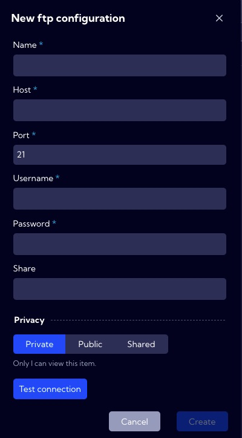

This menu [Configuration>Integrations>**FTP** ] can be used to configure FTP server connection parameters. FTP server configuration is necessary for the process of creating system backups.

:::info

In the System, it is possible to configure only one FTP server.

:::

To configure the FTP server, you need to fill in a form consisting of the following fields:

- **Name** - server name
- **Host** -  host IP address
- **Port** - service port
- **Username** - FTP server user name
- **Password** - FTP server user password

---

**Privacy** - assigning privileges 
- **Private** - accessible to the owner
- **Public** - visible to all, but You can grant permission:
  - **DELETE**
  - **EDIT**
- Shared - accessible to one or more selected **User roles**. Available privileges are:
  - **Delete**
  - **Edit**
  - **View**

 

