A **Dashboard** is a visual representation of data designed for quick analysis of the network traffic data and for informational awareness.

**Dashboards** consist of **Widgets** – objects with a graphical representation of specific data which can be added, edited, positioned, deleted or modified as you like. Sycope allows users to set up multiple **Dashboards**. 

**Dashboards** can be combined into **groups** depending on the user's needs while a single **Dashboard** can belong to multiple **groups**.

A number of **Dashboard groups** created by our specialists to implement selected troubleshooting scenarios have been built into the System. These Dashboard groups are available to the user right after the System installation.

**Dashboards** and **Dashboards groups**, both built-in and user-created, are available for use in the **[Dashboard]** menu.

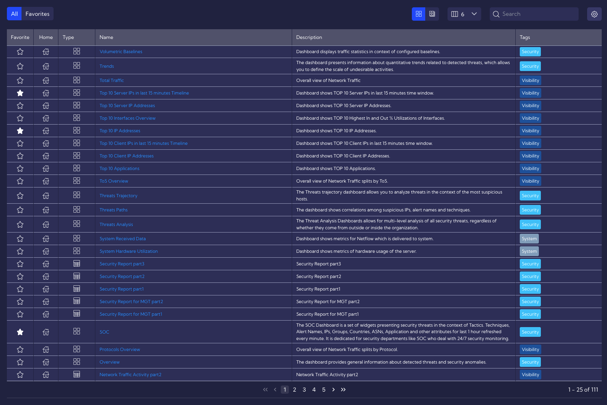

In this menu there is a table with all Dashboards and groups of dasboards that are available in the system and above the table there is a top menu.

In the top menu, there are the following options:

#### Favorites

 - two icons with which you can reduce the list of Dashbords/Dashboard groups and display only those marked as favorites. To add Dashboard/Dashboard group to favorites, just click the icon in the Dashboards table. The white-filled icon indicates that the Dashboard or Dashboard group has been correctly added to favorites. 

#### Dashboard Groups

Dashboards can be combined into Dashboard groups. The view in the table (Dashboard or Dashboard groups) depends on which icon is active - **Dashboard** or **Dashboard groups**.

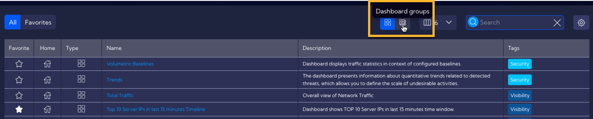

To switch the table to the Dashboard groups view, click the Dashboard groups icon. The appearance of the table will change. The rows in the table now represent Dashboard groups. You can expand the individual rows to see the Dashboards that make up the group.

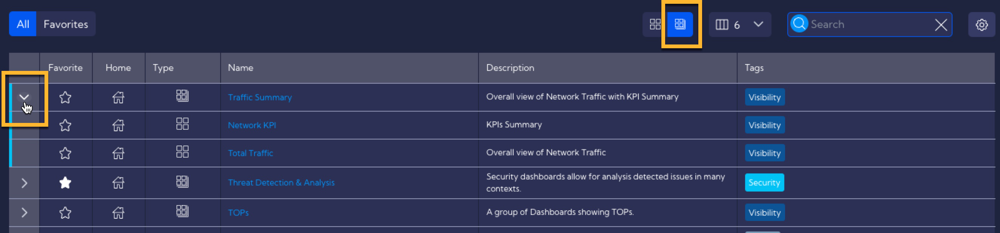

##### Add/Edit Dashboard Group

To add a new **Dashboard group** or edit an existing one, go to **[Management>Dashboards**]. You can do it in the main menu or by clicking the settings icon .

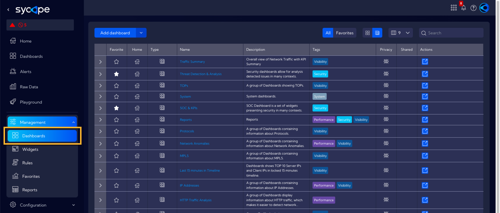

Click `Add dashboard` and select `Add dashboard group`.

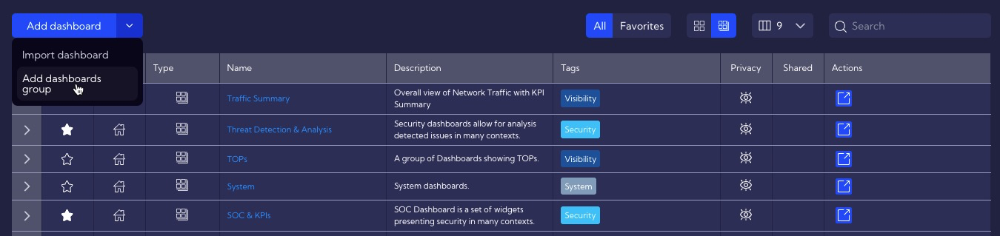

The Dashboard Group Wizard window  with the following fields will appear:

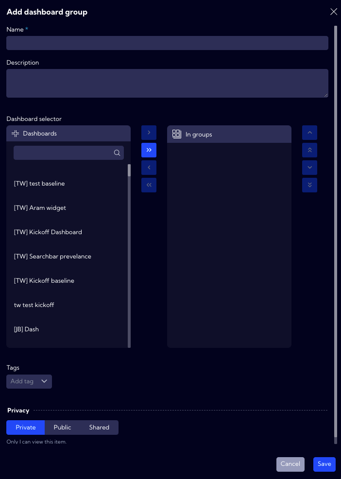

- **Name** - unique name of the Dashboard group

- **Description** - short description

- **Dashboards selector** - Here you can choose which **Dashboards** should belong to the created group. A **Dashboard** can belong to many groups. To add a **Dashboard** to a created group, find and select it in the list and then click `Add selected`.

  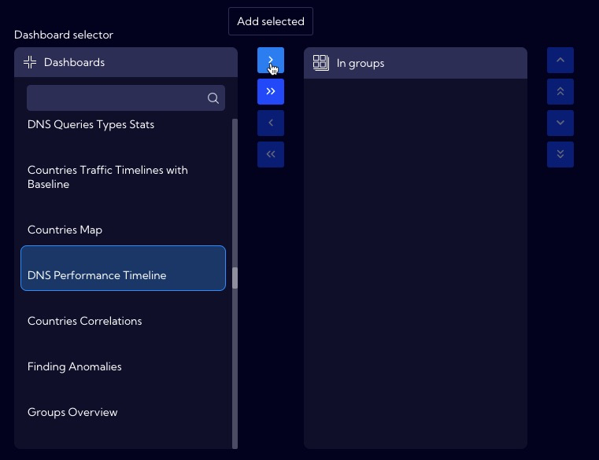
  

  To add all **Dashboards** from the list to the group click ` Add all`.

  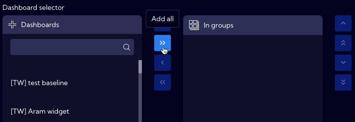

- **Tags** - Tag assignment

- **Privacy** - you can grant permissions for a Widget

  - **Private** - accessible to the owner
  - **Public** - visible to all, but You can grant permission:
    - **delete**
    - **edit**
  - **Shared** - accessible to one or more selected **User roles**. Available privileges are:
    - **delete**
    - **edit**

Once the fields are filled in correctly and the save button is clicked, the **Dashboard group** will be created and added to the list of available groups in the System.

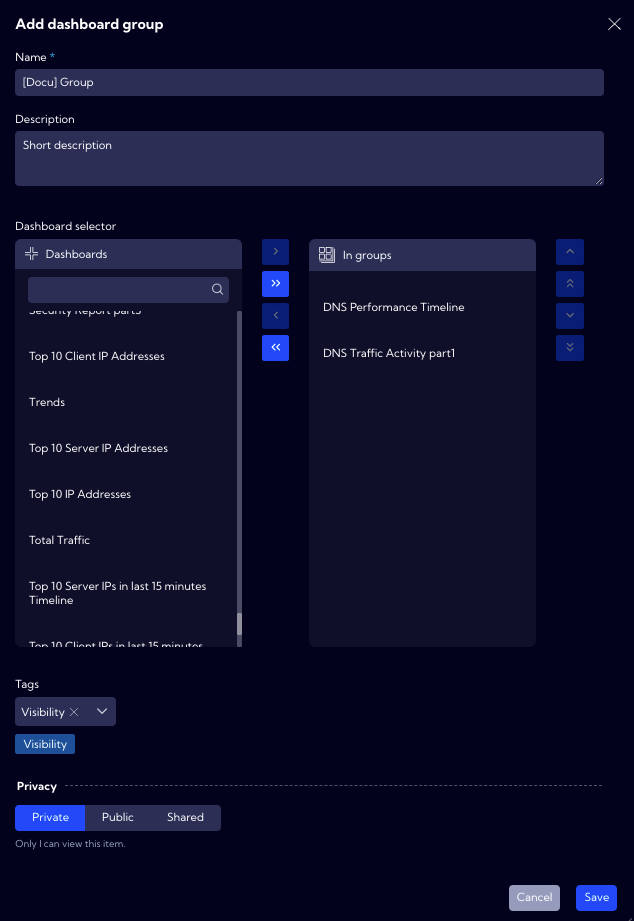

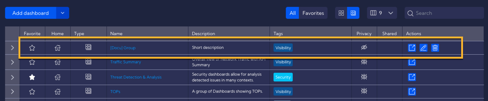

To **edit** a **Dashboard group**, click the `Edit` icon in the **Action** column.

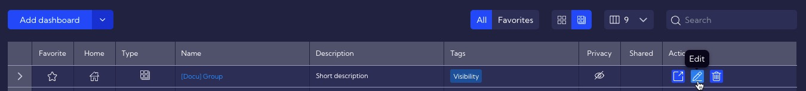

#### Displayed columns

You can customize how many and what columns in the table will be displayed.

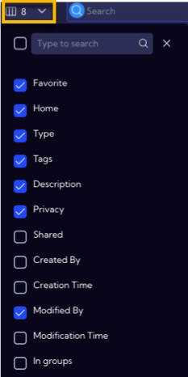

The following columns are available:

- **Favorite** - an icon indicating whether the Dashboard/Dashboard groups has been added to favorites
- **Home** - an icon indicating whether the Dashboard/Dashboard groups has been added to the Home screen
- **Type** - an icon indicating the type of row: Dashboard, Dashboard groups, Report
- **Tags** - assigned tags
- **Description** - short description
- **Privacy** - an icon indicating the status of the object's rights
- **Shared** - the name of the user who shared the Dashboard
- **Created By** - the name of the user who created the Dashboard
- **Creation Time** - time when the object was created
- **Modified By** - the name of the user who last modified the Dashboard
- **Modification Time** - last modification time
- **In groups** - group/groups the Dashboard belongs to (refers to Dashboards only)

#### Search

- field where you can enter data to be searched in the table

#### Settings

 - by clicking on this icon and selecting `Manage dashboard` you will be redirected to **[Management>Dashboards]** where you can create, edit, import and delete Dashboard/Dashboard groups

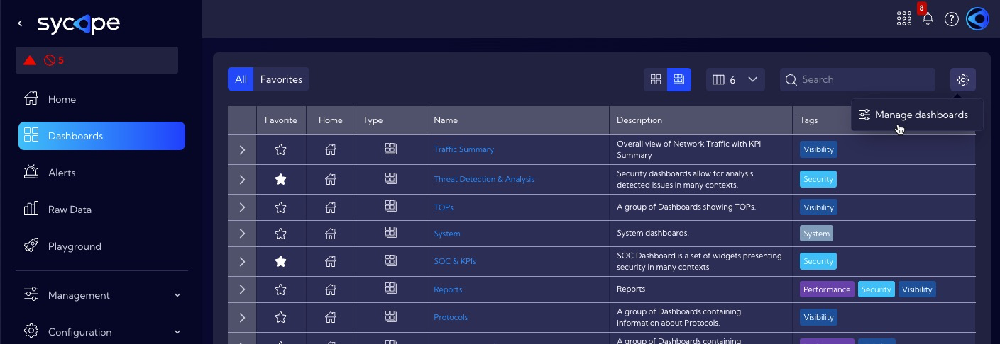

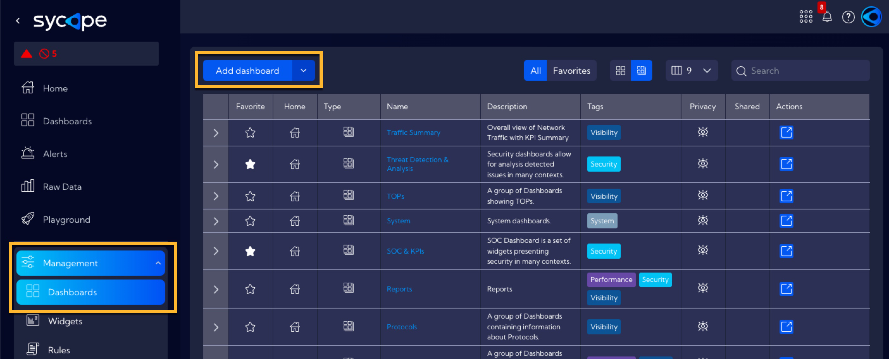

 
