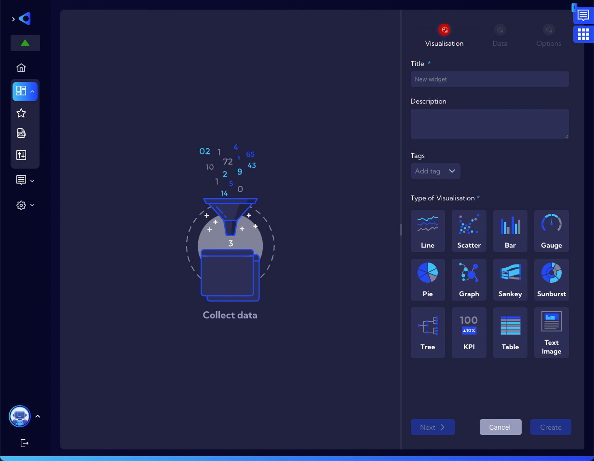

# Examples of widget creation - advanced widget

## Total traffic Bytes 15min - example assumption

We want to create a **Widget** that will show **total traffic in the last 15 minutes on the chart**.

## Implementation

1. Widgets are created and edited in the menu [Dashboard>Management>**Widgets**]. 

2. To add a widget, click on the **Add Widget** button, then the widget wizard will appear. 

3. In the **Visualization Tab**,  enter the name of the **Widget** in the field **Title**. In addition to entering a name, you can enter a short description of the **Widget** in the field **Description** and assign **Tags**. Now it is necessary to select the type of visualization you want to use. In this example it will be **Line**.

4. Change the tab to **Data**. The system marks with a maroon color and a triangle icon with an exclamation mark the sections in which it is necessary to complete the configuration. First, we need to choose the **Data Stream** that we will use to create the **Widget** - it must have, in this case, data on the amount of traffic in **Bytes**. In our case we can use one from two streams: **netflow** (Deduplicated Netflow and Sflow records stream or **netflowTotalAggr** (Netflow 1 min aggregated). In both cases the results will be the same, the only difference will be in the use of server resources - **netflowTotalAggr** is a stream already aggregated so the operations will require less resources and thus will be performed faster, so let's choose it. 

   

5. Leave the time for which calculations are to be performed at **Last 15 minutes**. To calculate the **total traffic** per unit time, we need to select the **Bytes** field and **Sum Aggregation**  to calculate sum bytes.

6. Leave the settings of the **Categories** section unchanged. Time value will be displayed on the X axis. At this point we get an overview appearance of the **Widget**.

   

7. At this point we can finish creating the widget by saving it with the **Create** button.

As you can see above the chart looks quite ascetic for example: no axis descriptions, values on the Y axis not user frendly, no legend. How to make a more custom chart is described in the section below - **Visual tuning**. 

Our new **Widget** appears in the list of widgets and is ready to be used as part of the **Dashboard**.

## Visual tuning

1. Change the tab to the **Options**.

Let's change the formatting of the numbers on the **Y-axis** to a more friendly one - set the format unit to **Decimal bytes (b).**

You can see that the values on the Y axis now looks much better.

Let's add descriptions of axes.To do this, turn on the **Custom axis name switch** in **Value Axis 1** section and enter the axis name in the **Custom name** field - in our example, we'll enter the word **Bytes**. In the **Label Location** field we can specify in which part of the **Y axis** the name will be displayed (Center, End, Start) - let's choose **End**. In the **Name gap from chart** field, we can specify the distance from the **Y axis** at which the label name will be displayed - let's enter a value of **5**.

Now our chart looks like the one below.

In the same way, let's add a description of the **Category axes** (X axis).

## Changing widget permissions

1. Change the tab to the **Options**.

   By default, the Widget has permission settings as **Private**. 

If you want other users to be able to use the **Widget**, change its permissions to **Public**.

Our new **Widget** appears in the list of widgets and is ready to be used as part of the **Dashboard**.

