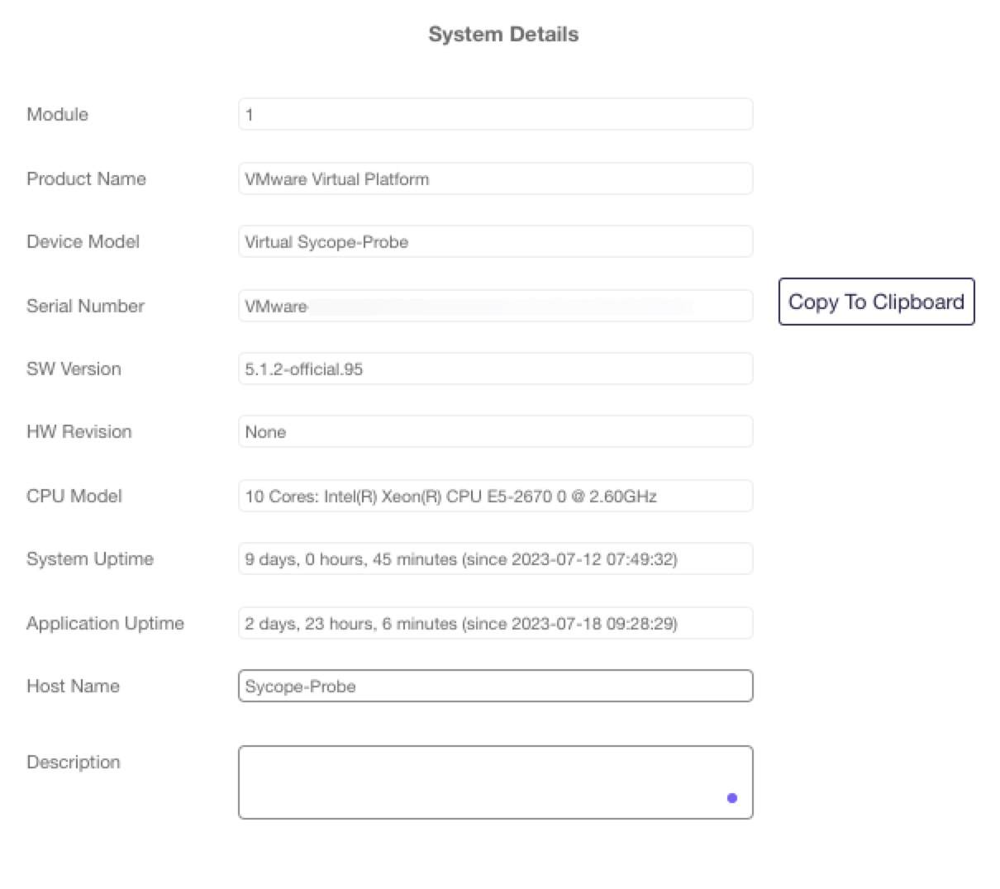
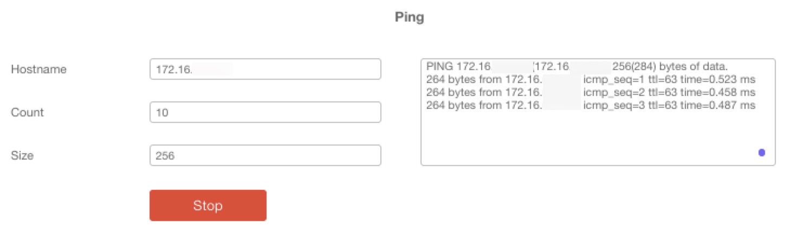

# Sycope Probe User Guide

Release 5.1.1 June 2023


# Introduction

## Product Overview

In today’s modern network architectures, cyber and monitoring tools are required to handle incoming traffic from multiple visibility devices including TAPs, SPAN ports, and NPB (Network Packet Broker) appliances. The volume and diversity in the types of traffic can be overwhelming to these tools. Duplicated packets may cause applications to be stretched to the limits of their processing power whereas packets with multiple headers (e.g. MPLS, VLAN tags, ERSPAN, etc.) are often unrecognized by these tools and are typically dropped.

Advanced network processing features, such as Deduplication, are CPU intensive and should not be performed on the aggregation device, which is CPU bound by design. The Sycope-Probe server introduces the industry’s next generation NPB by leveraging advanced, high performance, modular, and scalable ODM hardware that can be configured to the desired network capacity. This unique approach eliminates hardware performance constraints and allows alignment between hardware and performance requirements.

The Sycope-Probe server is the only NPB on the market that offers 100G network interfaces in a compact 1U form factor. The appliance is based on a powerful ultra-dense, reliable, and versatile 1U rack server that can scale up with additional compute power and memory to meet the NPB requirements.

## Key Features

- Affordable NPB (Network Packet Broker) with powerful performance

- Powerful and scalable server architecture that meets performance requirements

- Wide range of transceivers, optics, and cables that support 1G, 10G, 25G, 40G, 100G

- Aggregation, filtering, header stripping, deduplication, data masking, packet slicing, time stamping, de-fragmentation, load balancing.

- Traffic tracking

- Traffic capturing

- Traffic shaping and capping

- Regular expression filtering

- GTP correlation

- URL based filtering

- Application Aware filtering, monitoring, and metadata extraction

- Network analysis using IPFIX

- GRE and VXLAN tunneling

- Inline service chains

- Jumbo packet support

- High availability

## Use Cases

- Removal of duplicated packets to optimize security and monitoring application performance

- Enhancement of legacy packet broker deployments with advanced features

- Single appliance with basic and advanced packet broker features for small sites

- L7 application monitoring and analysis

- MPLS stripping to enable monitoring of MPLS networks

- Masking sensitive and private customer information

- Filtering based on URL lists

- Capturing traffic for analysis or troubleshooting

- Applying GTP subscribes based filtering and analysis based on GTP control and user plans correlation

- Service chaining

## Features and Benefits

**Table: Sycope-Probe Features**

| Features                 | Benefits                                                     |
| ------------------------ | ------------------------------------------------------------ |
| Scalable hardware        | Server platform with flexible  configurations (CPU, memory, number of ports, and rates) that align with  performance requirements |
| Network interfaces       | Wide range of transceivers,  optics, and cables that support 1G, 10G, 25G, 40G, 100G |
| Management               | Multiple modern management  options including CLI, SNMP V3, WEB UI, Net CONF, and REST API that can be  connected to any SDN controller based management platform  Remote network access through  SSH   Local console port  Logging that includes AAA  servers, event notification, syslog, and SNMP traps |
| High availability        | Supports high availability  clusters for continuous operation |
| GRE tunneling            | GRE termination allowing to send  and receive data over L2 and L3 GRE tunnels |
| Aggregation              | Aggregates and redirects network  traffic from selected ingress ports to egress ports for further processing |
| Filtering                | Optimizes tools performance by  filtering out unnecessary network traffic with conditional 5-tuple filtering  (MAC address, EtherType, IP address, TCP Port, UDF) |
| L7 application filtering | Filters by L7 application                                    |
| Port labelling           | Tracks packet path by adding VLAN  tags that indicate its ingress port |
| Port capping             | Limits port transmission rate  while supporting session preservation |
| Port traffic shaping     | Limits port transmission rate and  buffer overflow packets   |
| Load balancing           | Distributes traffic among several  output interfaces using hash function or round robin, supports weights to  tune load balance distribution |
| Header stripping         | Removes protocol headers (MPLS,  VLAN, PPPoE, QinQ, VN-TAG, VXLAN, GTP, GRE, L2TP, GENEVE, PBB, CFP) and  reduces tool resources required for aggregation and filtering |
| Deduplication            | Maximizes tool performance by  eliminating duplicated packets gathered from multiple collection points that  overutilize tool resources, leveraging a superior algorithm based on a window  per packet signature and configurable window size |
| Sampling                 | Processes only a sample of the  ingress traffic allowing session preservation |
| Data masking             | Allows the enterprise to protect  sensitive data by overwriting it before it is sent to the tools |
| Packet slicing           | Improves monitoring and network  data analysis performance by reducing packet size and maintaining the  required packet slice for further processing |
| Time stamping            | Enhances network visibility with  nanosecond time stamping capabilities |
| Session tracking         | Tracks IP sessions according to a  set of classifiers, including regular expression matching |
| Application monitoring   | Monitors the set of L7  applications received by the device  |
| Metadata extraction      | Extracts and exports per session  metadata, including L7 application attributes |
| IPFIX                    | Generates and forwards IPFIX  information                    |
| Capture                  | Captures PCAP files in filter  granularity for further analysis |
| De-fragmentation         | Assembles packet fragments to  complete packets              |
| DNS resolving            | Resolving URL to IP addresses  based on DNS messages         |
| File replay              | Replays imported pcaps files  through the device             |


# Getting Started

## Installation

The Sycope-Probe installation CD or USB stick contains the Linux Ubuntu distribution and the Sycope-Probe application. If you obtained the software as an ISO file, use [Rufus-3 for Windows](https://tutorials.ubuntu.com/tutorial/tutorial-create-a-usb-stick-on-windows) (recommended) or [DiscCreator](https://tutorials.ubuntu.com/tutorial/tutorial-create-a-usb-stick-on-ubuntu#2) for Ubuntu to burn it onto a USB stick.

To install, perform the following steps:

1.  Connect keyboard, mouse, and monitor to the server.

2.  Power up the server.

3.  Set up disks and/or RAID. It is recommended to delete any pre-existing configuration and to create a new single virtual disk that uses all physical disks.

4.  If UEFI boot mode is not supported by the media, set the BIOS boot mode to **Legacy**. UEFI is supported for USB created with Rufus-3.

5.  Set the following BIOS parameters:

    - Power management – Set to **performance oriented**.
    - Hyperthreading – Set to **disable**.
    - Turbo boost – Set to **enable**.
    - Virtualization – Set to **disable**.
    - Secure boot – Set to **disable**.
    - Boot from – Set to **CDROM** or **USB**.

6.  Insert the Sycope-Probe installation CD to the server CD reader, or connect the USB stick to one of the server USB connectors.

7.  Reboot the server.

8.  If asked, select **English** as the installation language and press **Enter**.

9.  Select the installation option for your device (see Table 2: Supported Hardware above)

10.  Follow the on-screen instructions.

After a successful installation, the device can be accessed as described in the next section.

## Connecting and Integrating into the Network

After installing the server, it can be connected and integrated into the network. Depending on your HW, there are two ways to do this:

- Via local graphical interface

  Access the server through the local graphical interface, set its IP address, netmask, and default gateway according to your network requirements, and then access it through SSH.

- Via management port using default settings

  Define a temporary network (usually just a laptop) according to the default management settings of the server, and connect through SSH to set its IP address, netmask, and default gateway.

Once the IP address, netmask, and default gateway are configured, the server can be accessed remotely through an SSH session.

### Connecting to the Server using the Local Graphical Interface

To access the server through the local graphical interface, perform the following steps:

1.  Connect a monitor and a keyboard to the server. The local CLI prompt appears.
1.  Connect to the local CLI using username: **admin** and password: **admin**.
1.  Now, you can set the IP address and other management settings as described in Section Setting IP Address.

Once the server’s IP address is configured, you can connect the server to the network using the server’s management port and access it remotely by SSH. Refer to Section Connecting to the Server using SSH. Connecting to the Server Using Default Management Port Settings

The Sycope-Probe is shipped with the following default management port configuration:

​	**Address: 192.168.1.1**

​	**Netmask: 255.255.255.0**

​	**Gateway: 0.0.0.0**

Configure a temporary network to work with the default settings above and connect to the server’s management port using SSH as described in the next section to change the default IP setting to your network settings.

### Connecting to the Server using SSH

Once the server is connected to the network using the front-panel management port, it can be accessed remotely by SSH.

1.  Open any SSH client on a PC that is connected to the network and can reach the server.
1.  Open an SSH session to the server’s IP, using username: **admin** and password: **admin**.

## Working with the CLI

This section introduces the Sycope-Probe CLI functionality. It gives a general overview on the CLI modes of operation and describes how to get help and how to use general and useful commands.

### CLI Modes

The CLI operates in two different modes:

- Operational mode allows the user to view the device configuration and to perform operations that do not change the device configuration, for example, to change CLI session settings.

- Configuration mode allows the user to change the device configuration.

When starting a CLI session, the user is logged in to Operational mode. To switch to Configuration mode, use the **config** command:

`Sycope-Probe# config`

`Entering configuration mode terminal`

`Sycope-Probe(config)#`

To switch back to Operational mode, use the **end** command:

`Sycope-Probe(config)# end`

`Sycope-Probe#`

The change is indicated in the CLI prompt.

#### Configuration Mode

Once in Configuration mode, the user can change the device configuration. The changes done in the Configuration mode have no effect until they are “committed” using the **Commit** command. Commit operations are first validated and then can have atomic success or fail. Changes that have not yet been committed are called “pending changes”.

You can view the set of pending changes using the **show configuration** command.

In the example below, the CLI flow sets the CLI idle timeout to 10 minutes:

```
Sycope-Probe(config)# system cli session idle-timeout 10m

Sycope-Probe(config)# show configuration 

system cli session idle-timeout 10m 

Sycope-Probe(config)# commit 

Commit complete.

Sycope-Probe(config)# show configuration`

% No configuration changes found.

Sycope-Probe(config)#
```

​	

Note how, before the commit, the change is still pending and can be observed using the **show configuration** command, while the same command does not show the change after the commit, as it is no longer pending.

### CLI Help

To view the list of available commands at any state, use either the **?** character or the tab key, for example:


To get help on a specific command, use the **help** command followed by the requested command name, for example:

```
Sycope-Probe(config)# help system cli session idle-timeout 

Help for command: system cli session idle-timeout 


Maximum idle time before terminating a CLI session. Default

is PT30M, ie 30 minutes.
```


### CLI Useful Commands

This section includes a list of commonly used CLI commands. Use **?** or the tab key to see possible completions for each command.

:::note

Some of the commands are available only in either Operational or in Configuration mode. Some are available in both. 

:::

#### \| (pipe)

The `|` character can be used to redirect command output into a set of redirect commands for analyzing the returned data. These commands can be chained to achieve more complex processing.

The list of redirect commands varies from command to command and can be displayed using the `?` character. For example, for the **show ports** command:


#### alias

The **alias** command creates aliases for commonly used commands. It, for example, enables replacing the **show system snmp** command with the alias **SNMP** for easier use:

`Sycope-Probe(config)# alias SNMP expansion "show system snmp"`

#### do

The **do** command lets you run Operational mode commands from within Configuration mode.

#### Id

The **id** command displays information about the user that is currently logged in.

#### no

The **no** command returns fields to their default values or deletes elements.

#### Show running-config

The **show running-config** command displays the currently running configuration.

#### Show

The **show** command displays status and configuration of certain features.

#### Top

The **top** command returns the user to the top level in Configuration mode. If followed by a command, the command is executed as if it was entered at the top level of the Configuration mode.

#### Who

The **who** command displays information regarding the currently open sessions.

### CLI Keyboard Shortcuts

Table below list some useful CLI keyboard shortcuts.

**Table: CLI Keyboard Shortcuts**

| Shortcut                                | Action                                                       |
| --------------------------------------- | ------------------------------------------------------------ |
| **Move Commands**                       |                                                              |
| Ctrl-b or Left Arrow                    | Move the cursor back one character                           |
| Esc-b or Alt-b                          | Move the cursor back one word                                |
| Ctrl-f or Right Arrow                   | Move the cursor forward one character                        |
| Esc-f or Alt-f                          | Move the cursor forward one word                             |
| Ctrl-a or Home                          | Move the cursor to the beginning of the command line         |
| Ctrl-e or End                           | Move the cursor to the end of the command line               |
| **Delete Commands**                     |                                                              |
| Ctrl-h, Delete, or Backspace            | Delete the character before the cursor                       |
| Ctrl-d                                  | Delete the character following the cursor                    |
| Ctrl-k                                  | Delete all characters from the cursor to the end of the line |
| Ctrl-u or Ctrl-x                        | Delete the whole line                                        |
| Ctrl-w, Esc-Backspace, or Alt-Backspace | Delete the word before the cursor                            |
| Esc-d or Alt-d                          | Delete the word after the cursor                             |
| Ctrl-y                                  | Insert the most recently deleted text at the cursor          |
| **Scroll and Search Commands**          |                                                              |
| Ctrl-p or Up Arrow                      | Scroll backward through the command history                  |
| Ctrl-n or Down Arrow                    | Scroll forward through the command history                   |
| Ctrl-r                                  | Search the command history in reverse order                  |
| **Case Commands**                       |                                                              |
| Esc-c                                   | Capitalize the word at the cursor, that is, make the first character uppercase and the rest of the word lowercase |
| Esc-l                                   | Change the word at the cursor to lowercase                   |
| Esc-u                                   | Change the word at the cursor to uppercase                   |
| **Miscellaneous Commands**              |                                                              |
| Ctrl-c                                  | Abort a command/Clear line                                   |
| Ctrl-l                                  | Redraw the screen                                            |
| Ctrl-z                                  | Exit configuration mode                                      |

### Changing the Login Banner

To modify the CLI Login banner, use the following CLI command:

`Sycope-probe(config)# system cli banner "<new banner>"`

Use the standard escaped characters \n, \r and \t for new line, carriage return, and tab.

To return to the default banner, use the following command:

`Sycope-Probe(config)# no system cli banner`

### Changing SSH Settings

The Sycope-Probe supports the following SSH Message Authentication Code (MAC) and encryption algorithms:

- MAC: hmac-md5, hmac-sha1, hmacsha2-256, hmac-sha2-512, hmac-sha1-96, hmac-md5-96

- Encryption: aes128-gcm@openssh.com, chacha20-poly1305@openssh.com, aes128-ctr, aes192-ctr, aes256-ctr, aes128-cbc, aes256-cbc, 3des-cbc

By default, all algorithms are used.

To modify the set of used algorithms from the CLI, use the following commands:

`Sycope-Probe(config)# system cli ssh mac <algorithm-list>`

`Sycope-Probe(config)# system cli ssh encryption <algorithm-list>`

where **algorithm-list** is a list of comma-separated algorithms from the sets above.

To return to the default setting, use the following command:

`Sycope-Probe(config)# no system cli ssh mac`

`Sycope-Probe(config)# no system cli ssh encryption`


## Working with the WebUI Application

### Getting Started

The Sycope-Probe device provides a Web UI application that can be used to configure and monitor the device using a web browser.

To set up the WebUI application for use, perform the following steps:

1.  Assign an IP address to the Sycope-Probe.
1.  Enable the WebUI interface using the CLI.
3.  Point your browser to the device’s IP, using Port 8008 for an HTTP connection or Port 8888 for an HTTPS connection.  
    For example: <http://192.168.1.10:8008>
1.  When the Login page is displayed, log in using one of the Sycope-Probe defined users.

The Sycope-Probe WebUI application is compatible with Chrome and Firefox internet browsers on Windows 7, Windows 10, and Ubuntu 14 (or higher) operating systems.

**Figure : WebUI Login Page**


Upon successful login, you are redirected to the WebUI home page as shown in Figure 2.

### WebUI Overview

The Sycope-Probe WebUI application is an intuitive and easy-to-use graphical interface. This section describes its main design concepts. Specific operations are described throughout this document in the relevant sections.

WebUI pages contain the following elements:

- Navigation panel on the left

- Status bar on top

- Main panel in the central area

- Extension panel on the right (optional)

**Figure : Sycope-Probe WebUI Home Page**


#### Navigation Panel

The area on the left is called the Navigation panel. It contains direct links to all the WebUI pages, grouped into categories referred to as Navigation Items (e.g. Ports, Filter and System).

At the very top of the Navigation panel appears the username and the group of the user that is currently logged in.

The Navigation panel remains accessible also when accessing other WebUI pages. It can be collapsed to get more space for the other panels.

#### Status Panel

The black bar at the top of the page is referred to as the Status panel. It contains the following information (left to right):

- Time passed since login

- Device IP and model

- Search tool for WebUI pages (Note that the tool does not search the content of the pages)

- Alarm indication showing the number of unviewed new alarms; clicking leads to the alarm page

- Commit and Discard buttons for committing or discarding pending changes

- Settings, Info and Logout widgets

**Figure : Status Panel**


#### Main Panel and Extension Panel

The content of the central area is set according to the selected page. By default, the application opens on the home page, which displays port statistics.

In many WebUI pages, the information is displayed in a table with clickable lines. The table lines contain the main attributes of each element. Where relevant, clicking the line opens an extension panel on the right, which enables viewing and editing the full set of attributes of the selected element. Extension panels can be dragged to any location on the screen by clicking and dragging the panel’s top bar.

In some tables, it is possible to configure multiple lines. To select multiple lines, mark their checkboxes while holding the Ctrl key, click while holding the Shift Key, or ‘click and drag’ to mark a range of lines.

:::note

All changes done in the WebUI are considered ‘pending’ until they are committed (see Section Configuration Mode for details on pending changes).
Pending changes are highlighted in a different color.

:::


Changes done in an extension panel usually require clicking the panel’s **Apply** button to be populated to the table (after clicking **Apply**, they are still pending!).

To view the pending changes, click **View** on the Status panel. To commit the pending changes, click **Commit**.

**Figure : Commit Changes Dialog**


Some tables include search and sort capabilities as shown below (for the alarm table).

**Figure : Example of Search and Sort Capabilities in Tables**


To sort according to a specific column, click the column header; a highlighted ˅ or ˄ symbol indicates an active column sort.

To search a specific column, use the search box below the column name. The index column is searched numerically using a specific value or a range expression. Non-index columns are searched by regular expressions. Statistics columns can be searched with comparison operators such as “\>100” and “\<= 99”.

For example, to display alarms with an ID in the range 10 to 20 that include either ‘RX’ or ‘TX’ in their message, use the numeric range expression ‘10-20’ in the Alarm column (which is the index column of this table) and the regular expression ‘RX\|TX’ in the Message column. To clear the current search, click **Show All**.

In some tables, you can select which columns shall be visible. In such tables, a crossed-eye icon is displayed near the column name. Click it to hide the column. To retrieve back all columns, click the eye icon above the leftmost checkbox column.

#### Session Timeouts

For security considerations, the Sycope-Probe WebUI application maintains session timeouts as listed below. When any of these timeouts expires, the session is terminated.

- User Idle timeout:  
  Timer resets upon user activity (mouse or keyboard). Changing the value of this timeout takes effect immediately for the current session (no commit is required). Default setting is 30 minutes.

- Server Activity timeout:  
  Timer resets upon server activity. This timeout will close a session if the session is not active, but the user has not logged out, e.g. when closing the browser without logging out or when the user is active in a different application but not in WebUI. Changing the value of this timeout takes effect at the next login (commit is required). Default setting is 2 minutes.

- Absolute timeout:  
  Timer resets only upon logout. This timeout will close a session regardless of its activity. Changing the value of this timeout takes effect at the next login (commit is required). Default setting is 16 hours.

To change the session timeouts, select **Management – General settings** in the Navigation panel.

**Figure : Session Timeouts**


#### WebUI Preferences

WebUI preferences can be customized. Preferences are kept as a user cookie in the browser. To customize WebUI preferences, select **System – General settings** in the Navigation panel.

**Figure : WebUI Preferences**


#### Embedded CLI

The WebUI application contains an embedded CLI connection, which can be used as a regular CLI interface. To use it, click **CLI** on the Navigation panel.

# System Settings

## Customization

This section describes how to customize the Sycope-Probe to work with specific HW and how to assign the HW resources according to your needs. You will typically run the customization process in the following cases:

- After a fresh server installation

- After adding or removing a NIC

- When modifying a feature that requires re-customization, e.g. session tracking, capture, or IPFIX

During customization, the set of cores, ports, disks, and memory used by the device is configured, and the different tasks performed by the device are assigned to specific cores.

As a part of customization process, the tasks performed by the device are divided between the HW cores, memory size is defined, and the management interface is set.

Table below describes the set of tasks:

**Table: Customization – Set of Tasks**

| Task            | Description                                                  | Restrictions                                                 |
| --------------- | ------------------------------------------------------------ | ------------------------------------------------------------ |
| Management      | One core on each socket is dedicated to running the Sycope-Probe management SW | Fixed to first core in each socket, cannot be changed        |
| Port forwarding | Processes ingress traffic on one of the physical ports. Assigning multiple cores will activate the NIC RSS feature, see Section Ports and RSS Settings. | Can be assigned only to cores that reside on the same socket as the physical port. The same core can be assigned to multiple ports. |
| IPFIX           | Generates and distributes IPFIX information, see Section IPFIX. | None                                                         |
| Capture         | Captures traffic into files, see Section Capturing.          | None                                                         |

Table below describes additional customization parameters:

**Table: Customization – Additional Customization Parameters**

| Parameter              | Description                                                  | Possible Values                                              |
| ---------------------- | ------------------------------------------------------------ | ------------------------------------------------------------ |
| Management interface   | Network interface to be used for  managing the device, e.g. by SSH or WebUI | One of the available network interfaces,  for example: eth0  |
| Socket memory          | The amount of memory to allocate to each  socket in GB       | At least 4G per socket                                       |
| Jumbo packet support   | The maximal supported packet size                            | Enable or disabled.  When disabled, a maximal packet size of  2,048 bytes is supported.  When enabled, the maximal packet size is  configurable in the range 2,048 to 65,536 bytes with a default value of 9,400  bytes.  Default is disabled. |
| Session tracking count | The number of sessions the tracking  session can hold, see Section Session Tracking. | Positive integer   Set to 0 if no tracking is  required.     |
| Capture disks          | Sets which disks are used to store the  capture files. By default, only the disk used for the SW installation is used. | List of disk names                                           |
| IP subscribers count   | The maximal number of concurrently  active IP subscribers. This value affects IP tracking. See IP Tracking and DNS Resolving and URL Based Filtering. | 0.. 40,000,000  Default is 0.                                |
| GTP subscribers count  | The maximal number of concurrently  active GTP subscribers. Note that each subscriber consumes approximately 2K  of assigned socket memory and 8K of unassigned memory | 0.. 10,000,000  Default is 0.                                |
| GTP attributes lists   | The maximal number of multi-value GTP  attribute lists. See GTP Correlation. | 0..10,240   Default is 0                                     |

### Ports and RSS Settings

Physical ports are identified by their PCI address. This mapping is fixed by the server’s HW architecture. The customization process defines the group of physical ports to be used by the Sycope-Probe and assigns a port ID to each of them. This ID is later used to identify and manage the port, e.g. when defining filters or load balance groups. It is recommended but not mandatory that the port IDs reflect the physical position of the ports in the HW (for example, from left to right).

When assigning more than one core to a single Port Forwarding task, the traffic is distributed between the set of cores by the NIC’s RSS (Receive Side Scaling) feature, which allows session-based distribution. The exact RSS details are NIC dependent – consult the NIC documentation for further information.

### Multiple Sockets

When working with more than one socket, each socket is considered a standalone entity with its own dedicated resources. As such, cross-socket configurations are not valid.

When working with multiple sockets, pay attention to the following:

1.  Traffic cannot be forwarded from ports on one socket ports to another socket. This includes GRE interfaces and load balance groups.
1.  Capturing is done per socket. At least one capture core must be attached to each socket on which capturing is required.
1.  Packet processing features, such as deduplication, session tracking, and defragmentation, are applied per socket. For example, two duplicate packets arriving on two ports, each defined on a different socket, are not considered a duplication by the deduplication feature.

### Customization Process

The exact details of the customization process are derived from the Sycope-Probe use case and the set of HW resources. For example, if no IPFIX is required, there is no need to assign cores for it. The same is true for capturing and session tracking. Cores per ports assignment is normally decided according to the nature of the traffic. For example, if all managed traffic is evenly distributed, it makes sense to use a ‘full mesh’ topology that assigns all cores to all ports symmetrically. If one of the ports is known to receive traffic that requires heavy processing (e.g. regular expressions filtering), it may be more efficient to assign several cores only to that port.

Customization can be done at any stage (reboot is required). However, after re-customizing, there is a chance that the configuration will need some editing. For example, if ports or features were removed.

The customization process can be divided into the following four steps:

1.  Reviewing system resources – review the set of available ports, cores, memory, and management interfaces, and decide how you wish to use these resources.
1.  Defining the tasks – define the required tasks and assign cores to each task as described in Table: Customization – Set of Tasks.
1.  Setting additional parameters – set the memory and management interface parameters as described in Table: Customization – Additional Customization Parameters.
1.  Committing your changes – this causes an automatic reboot, and the system starts up with the new customization.

Before starting the customization process, make sure that all the required HW is connected.

#### Using the CLI

To review the system resources from the CLI, use the following command:

`Sycope-Probe# show customization hw [full]`

This command displays the server’s resources. Use its output to plan your customization.

An example of the generated output is shown below:


To assign tasks to cores from the CLI, use the following command:

`Sycope-Probe(config)# customization tasks task PORT<n>|IPFIX|CAPTURE<m> cores <list of cores> [pci-address <address>|mac <address>]`

For example:

```
Sycope-Probe(config)# customization tasks task PORT1 cores 1,3-5 pci-address 0000:00:14.1

Sycope-Probe(config)# customization tasks task CAPTURE0 cores 6
```

To set additional parameters from the CLI, use the following command:

```
Sycope-Probe(config)# customization memory socket <socket-id> memory <memory>
Sycope-Probe(config)# customization mgmt-interface if-name <name>
Sycope-Probe(config)# customization jumbo disabled|enabled [max-packet-size <size>
Sycope-Probe(config)# customization track	session-count <count>
Sycope-Probe(config)# customization capture disks <disks>
Sycope-Probe(config)# customization ip subscriber-count <count>
Sycope-Probe(config)# customization gtp subscriber-count <count>
Sycope-Probe(config)# customization gtp list-count <count>

```

To display the currently configured customization parameters, use the following command:

`Sycope-Probe# show customization`

For example:


#### Using the WebUI

To customize the system from the WebUI, select **System – Customization** from the Navigation panel. Configuration is done per socket. Each socket is presented in a different diagram.

Set the global parameters using the Limits table at the top of the page.

For each socket, perform the following steps:

1.  Set the socket memory parameters.
1.  Set the session tracking memory.
1.  Use the **+/-** buttons to add or remove tasks.
1.  Set the management interface name in the Management task.
1.  Set the PCI addresses in the tasks of each port.
1.  Assign cores to tasks either by drawing lines between them or by entering core IDs in the Add Task popup

**Figure : Customization using WebUI**


**Figure : Add Task Popup**


#### Customizing Breakout Ports

To use port breakout, first define a single PORT task, assign it to the required cores, and commit this change. After reboot, configure the port breakout setting as described in Section Port Breakout. By default, a full mesh is defined between the ports sub-interfaces and the assigned cores.

To change the core assignment from the CLI, use the following command:

`Sycope-Probe(config)# customization tasks task PORT<n> channel <id> cores <cores> `


To change the core assignment from the WebUI, select **System – Customization** from the Navigation panel.

**Example**

Assuming Port 2 is assigned to Cores 8, 9, 10, and11, the default full mesh cores assignment after breakout is as follows:

**Table: Customizing Breakout Ports – Example 1**

| Port ID | Assigned Cores |
|---------|----------------|
| 2/1     | 8,9,10,11      |
| 2/2     | 8,9,10,11      |
| 2/3     | 8,9,10,11      |
| 2/4     | 8,9,10,11      |

To change this assignment to be one core per sub-interface, use the following commands:

```
Sycope-Probe(config)# customization tasks task PORT2 channel 1 cores 8
Sycope-Probe(config)# customization tasks task PORT2 channel 2 cores 9
Sycope-Probe(config)# customization tasks task PORT2 channel 3 cores 10
Sycope-Probe(config)# customization tasks task PORT2 channel 4 cores 11

```

The resulting assignment is as follows:

**Table: Customizing Breakout Ports – Example Result**

| Port ID | Assigned Cores |
|---------|----------------|
| 2/1     | 8              |
| 2/2     | 9              |
| 2/3     | 10             |
| 2/4     | 11             |

## Initial Device Configuration

### Activating the System

To activate the Sycope-Probe server, a license must be installed. In some devices, the license is pre-installed; in others, it must be installed manually by the user. Licenses are issued per machine and cannot be transferred between machines.

It is recommended to complete the customization process and to set the device’s time and date before generating and installing a license. See Sections Customization and Time and Date Settings.


If no valid license is found, the system is not active and provides very limited functionality. In this case, the following indications are present when trying to access the system from CLI and WebUI:

**Figure : System License Not Valid Notice from the CLI**

  

**Figure : System License Not Valid Notice from the WebUI**


To display the current license and its status, use the following CLI command:

`Sycope-Probe# show system license`

To display the current license and its status using WebUI, navigate to the **System – Details** page.

To install a license, perform the following steps:

1.  Generate your machine’s fingerprint. A fingerprint is an ASCII string that contains the information needed to generate a license for the machine. To generate a fingerprint from the CLI, use the following command:

    `Sycope-Probe# system license generate-fingerprint`

    The Web UI automatically generates the fingerprint. Navigate to the **System – Details** page and click **Copy To Clipboard** to copy its value.

2.  Contact Sycope support with the fingerprint to obtain a license for your machine.

3.  Install your license using the following CLI command:

    `Sycope-Probe# system license install <license-key>`

    Or navigate to the **System – Details** page, enter the license key, and click **Install.**

4.  Verify that the license was installed successfully by displaying its status as described above.

**Figure : Installing License Using WebUI**


### Setting IP Addresses

To access the Sycope-Probe remotely or to allow the Sycope-Probe to access other servers, you need to configure its IP addresses so it will meet your network requirements. This can be done either through the local graphical interface using CLI or through the management port as described in Section Connecting and Integrating into the Network.

Assign the IP address used for the interface you selected as the management interface in the customization phase, see Section Customization.

The Sycope-Probe device supports IP addresses according to both Ipv4 and Ipv6 protocols. Addresses can be assigned statically or using DHCP.

To set an Ipv4 address from the CLI, use the following command:

`Sycope-Probe(config)# system interface <if-name> ipv4-address <device-ip> ipv4-gateway <gateway-ip> ipv4-mask <mask>`

For example:

 `Sycope-Probe(config)# system interface eth0 ipv4-address 192.168.10.10 ipv4-gateway 192.168.0.1 ipv4-mask 255.255.255.0`

To set an Ipv6 address from CLI, use the following command: 

`Sycope-Probe(config)# system interface <if-name> ipv6-address <device-ip> ipv6-gateway <gateway-ip> ipv6-prefix-len <prefix-length>`

For example:

`Sycope-Probe(config)# system interface <if-name> ipv6-address 2610:20:6F15:15::27 ipv6-gateway 2610:20:6F15:15::0000 ipv6-prefix-len 64`

To set an IP using DHCP from CLI, use the following command:

`Sycope-Probe(config)# system interface <if-name> dhcp enable`


### Configuring the System Interfaces

Table below lists the configurable management port parameters.

**Table: Configurable Management Port Parameters**

| Name            | Description                                   | Possible Values                          |
| --------------- | --------------------------------------------- | ---------------------------------------- |
| DHCP            | DHCP admin status                             | enable/disable, default is **disable**   |
| duplex          | Duplex mode                                   | full/half/auto, default is **auto**      |
| speed           | Speed                                         | 10M/100M/1000M/auto, default is **auto** |
| route           | Specifies the routing path for this interface | See how to set interface routing below   |
| ipv4-address    | Ipv4 address                                  | Valid Ipv4 address                       |
| ipv4-gateway    | Ipv4 default gateway                          | Valid Ipv4 address                       |
| ipv4-mask       | Ipv4 network mask                             | Valid Ipv4 netmask                       |
| ipv6-address    | Ipv6 address                                  | Valid Ipv6 address                       |
| ipv6-gateway    | Ipv6 default gateway                          | Valid Ipv6 address                       |
| ipv6-prefix-len | Ipv6 prefix length                            | 0-128                                    |

To set system interface parameters from the CLI, use the following command:

`Sycope-Probe(config)# system interface <if-name> dhcp|duplex|speed <value>`

The Sycope-Probe supports the configuration of routing paths per system interface. The paths define which next hop to use to reach a specific subnet. When traffic is sent out from the Sycope-Probe to an external Syslog or SNMP server for example, the interface used for sending the traffic is selected based on these routing tables.

To set a routing path using the CLI, use the following command:

`Sycope-Probe(config)# system interface <if-name> route <name> to <subnet>/<cidr> via <next-hop-ip>`

To delete a routing path using the CLI, use the following command:

`Sycope-Probe(config)# no system interface <if-name> route <name>`

To display system interface settings from the CLI, use the following command:

`Sycope-Probe# show system interface [<if-name>] `

To configure the system interfaces using the WebUI application, select **System – Interfaces** in the Navigation panel. Note that changing the management interface parameters (e.g. its IP address) may disconnect the current WebUI session.

**Figure: Configuring System Interfaces from WebUI**


### Configuring DNS Servers

The Sycope-Probe supports name resolution using a list of DNS servers. The servers on the list are used to resolve configured external servers’ hostnames, such as Syslog server.

To set the list of DNS servers from the CLI, use the following command:

​	`Sycope-Probe(config)# system dns nameservers <list-of-servers-ip-addresses>`

​	More than one entry can be given separated by spaces inside a pair of square brackets. For example:

​	`Sycope-Probe(config)# system dns nameservers [ 192.168.1.1 192.201.10.10]`

To clear the list of DNS servers from the CLI, use the following command:

​	`Sycope-Probe(config)# no system dns nameservers`

To set the list of DNS servers from the WebUI, select **System – Interfaces** in the Navigation panel. Use the **DNS Servers** button above the table.

### Time and Date Settings

The Sycope-Probe device supports two types of time and date sources:

- Local – When local source is selected, the device’s time is set according to a value supplied locally.

- NTP based – When NTP source is selected, the device uses the NTP protocol to sync its clock with the provided NTP servers.

#### Setting a Local Time Source from the CLI

To set the local time zone from the CLI, use the following command:

​	`Sycope-Probe(config)# system time-and-date time-zone <time-zone-name>`

To set a local time source from the CLI, use the following command:

​	`Sycope-Probe(config)# system time-and-date current-time-and-date <time-and-date>`

​	For example:

​	`Sycope-Probe(config)# system time-and-date current-time-and-date "10/10/2016 10:00:01"`

#### Setting NTP Servers as a Time Source from the CLI

The Sycope-Probe device supports up to four NTP servers. Setting the NTP servers involves the following parameters:

**Table: NTP Server Parameters**

| Name                | Description                                            | Possible Values                        |
|---------------------|--------------------------------------------------------|----------------------------------------|
| address             | NTP server name or IP address                          | Valid Ipv4 address                     |
| authentication-type | Authentication method to use in NTP messages           | md5/none/sha/sha1, default is **none** |
| key ID              | Unique symmetric key ID for NTP authentication         | 1-65534                                |
| key-value           | Symmetric key for NTP authentication                   | string                                 |
| polling             | Activate NTP polling                                   | enable/disable, default is **enable**  |
| poll-max-interval   | Maximum polling intervals in seconds as a power of two | 10-17, default is 10 (=1024 sec.)      |
| poll-min-interval   | Minimal poll intervals in seconds as a power of two    | 3-10, default is 6 (=64 sec.)          |

To set NTP time source from the CLI, first enable NTP, then set the NTP servers parameters:

```
Sycope-Probe(config)# system time-and-date ntp admin enable
Sycope-Probe(config)# system time-and-date ntp server <server-id> address <name-or-address> authentication-type md5|none|sha|sha1 [key-value <key-value> keyid <key-id>] [polling enable|disable] [poll-max-interval <interval>] [poll-min-interval <interval>]
```

To display the current time and date configuration from the CLI, use the following command:

​	`Sycope-Probe# show system time-and-date`


:::note
NTP synchronization may take several minutes. You can show the synchronization status using show system time-and-date. In the example above, the status is Synchronized
:::

#### Managing Time and Date Settings from the WebUI

To manage time and date settings from the WebUI, select **System – Date and Time** in the Navigation panel. Use the **Local** and **NTP** buttons to configure the relevant details:

**Figure: Setting a Local Time Source from the WebUI**


**Figure : Setting NTP Servers as a Time Source from the WebUI**


NTP server tables are editable inline. You can see the current NTP status next to the server table.

## Management Interfaces

This section describes the various management interfaces supported by the Sycope-Probe.

### Customizing the CLI

This section describes how to customize the CLI session. For a description of the CLI concepts and structure, refer to Section Working with the CLI.

Table below lists the configurable CLI attributes.

**Table: Configurable CLI Attributes**

| Command                                                    | Description                                                  | Possible Values                                              |
| ---------------------------------------------------------- | ------------------------------------------------------------ | ------------------------------------------------------------ |
| `Sycope-Probe(config)#  system cli session idle-timeout  ` | Sets an idle timeout after which the session is terminated   | Duration using the following syntax: nYnMnDnHnMnS.  E.g. 10 min and 30 sec. is expressed as 10m30s |
| `Sycope-Probe#  history `                                  | Sets the size of the command history  list                   | 1-1000, default is 1000                                      |
| `  Sycope-Probe#  timestamp  `                             | Logs the timestamp of every CLI command  as it is entered    | Enable/disable, default is disable                           |
| `Sycope-Probe#  paginate  `                                | If paginate is false, the CLI pauses after each page  it prints to the screen, waiting for user intervention to continue | true/false, default is false                                 |
| `  Sycope-Probe#  screen-length`                           | Sets the number of rows per screen                           | 1-32000, default is 82                                       |
| `  Sycope-Probe#  screen-width   `                         | Sets the number of characters per row                        | 1-512, default is 80                                         |
| `Sycope-Probe#  show-defaults  `                           | When set to true, the configuration display includes the default value of every  configured field | true/false, default is false                                 |


### Working with SNMP

The Sycope-Probe device supports both SNMP v2c and SNMP v3. SNMP users have read access and limited write access on the device based on their authorization. By default, the SNMP agent is not running and must be explicitly activated for each SNMP version.

To activate the SNMP agent from the CLI, use the following command:

​	`Sycope-Probe(config)# system snmp v2c\|v3 true\|false`

For a full description of the Sycope-Probe support of SNMP, refer to Section SNMP.

### Working with NETCONF

The Sycope-Probe device fully supports the NETCONF protocol. However, NETCONF support is disabled by default.

To activate NETCONF from the CLI, use the following command:

​	`Sycope-Probe(config)# system netconf enabled|disabled`

By default, NETCONF uses Port 830. To use a different port, use the following command from the CLI:

​	`Sycope-Probe(config)# system netconf port <port-number>`

To configure NETCONF using the WebUI, select **Management – General settings** in the Navigation panel.

### Working with RESTCONF

The Sycope-Probe device fully supports the RESTCONF protocol. RESTCONF support is disabled by default.

To activate RESTCONF from the CLI, use the following command:

​	`Sycope-Probe(config)# system restconf enabled|disabled`

RESTCONF uses the WebUI ports, that is, Port 8008 for HTTP and Port 8888 for HTTPS.

To configure RESTCONF using the WebUI, select **Management – General settings** in the Navigation panel.

**Figure : Configuring NETCONF and RESTCONF using the WebUI**


### Working with the WebUI

To use the Sycope-Probe WebUI application, point your browser to the device IP, using Port 8008 for HTTP or Port 8888 for HTTPS. For example: *192.168.100.100:8888*

These ports are configurable as explained below.

By default, WebUI HTTP access is disabled and HTTPS is enabled. To enable or disable WebUI access per protocol from the CLI, use the following command:

​	`Sycope-Probe(config)# system webui http|https enabled|disabled`

To change the HTTP and HTTPS ports from the CLI, use the following command:

​	`Sycope-Probe(config)# system webui http|https port <port>`

To change the HTTP and HTTPS ports from the WebUI, select **Management – General Settings** in the Navigation panel and use the **Web UI Settings** section.

#### SSL Certificates

The Sycope-Probe provides a default SSL certificate. For security reasons, it is highly recommended to replace the default certificate with your organization’s certificate.

To create and upload a certificate file, perform the following steps:

1.  Use a pair of private key and certificate signed by your organization. Do not use password-protected private keys. For details on how to create such a pair, see for example: <https://jamielinux.com/docs/openssl-certificate-authority/create-the-root-pair.html>
1.  Create a pem file that contains the private key and the certificate. For example, on Linux, use the following command: `cat key.pem cert.pem > key_cert.pem`
1.  Upload the pem file to the device as described below. This operation overwrites the currently installed certificate with the new certificate. A system reboot is required to install the new certificate.

To upload a certificate using the CLI, use the following command:

​	`Sycope-Probe# system webui https certificate import remote-url <remote-url> [username <username> password <password>]`

​	For example:

`Sycope-Probe# system webui https certificate import remote-url scp://192.168.10.10/config/key_cert.pem username admin password 1234`

To revert to the default certificate, use the following command:

`Sycope-Probe# system webui https certificate remove`

To upload a certificate using the WebUI, select **Management – General settings** in the Navigation panel.

#### HTTPS/TLS Ciphers

The Sycope-Probe supports the following set of ciphers when establishing a HTTPS/TLS connection:

TLS_AES_128_GCM_SHA256, TLS_AES_256_GCM_SHA384, TLS_AES_128_CCM_SHA256, ECDHE-ECDSA-AES256-GCM-SHA384, ECDHE-RSA-AES256-GCM-SHA384, ECDHE-ECDSA-AES256-SHA384, ECDHE-RSA-AES256-SHA384, ECDH-ECDSA-AES256-GCM-SHA384, ECDH-RSA-AES256-GCM-SHA384, ECDH-ECDSA-AES256-SHA384, ECDH-RSA-AES256-SHA384, DHE-RSA-AES256-GCM-SHA384, DHE-DSS-AES256-GCM-SHA384, DHE-RSA-AES256-SHA256, DHE-DSS-AES256-SHA256, AES256-GCM-SHA384, AES256-SHA256, ECDHE-ECDSA-AES128-GCM-SHA256, ECDHE-RSA-AES128-GCM-SHA256, ECDHE-ECDSA-AES128-SHA256, ECDHE-RSA-AES128-SHA256, ECDH-ECDSA-AES128-GCM-SHA256, ECDH-RSA-AES128-GCM-SHA256, ECDH-ECDSA-AES128-SHA256, ECDH-RSA-AES128-SHA256, DHE-RSA-AES128-GCM-SHA256, DHE-DSS-AES128-GCM-SHA256, DHE-RSA-AES128-SHA256, DHE-DSS-AES128-SHA256, AES128-GCM-SHA256, AES128-SHA256, ECDHE-ECDSA-AES256-SHA, ECDHE-RSA-AES256-SHA, DHE-RSA-AES256-SHA, DHE-DSS-AES256-SHA, ECDH-ECDSA-AES256-SHA, ECDH-RSA-AES256-SHA, AES256-SHA, ECDHE-ECDSA-AES128-SHA, ECDHE-RSA-AES128-SHA, DHE-RSA-AES128-SHA, DHE-DSS-AES128-SHA, ECDH-ECDSA-AES128-SHA, ECDH-RSA-AES128-SHA, AES128-SHA, ECDHE-ECDSA-DES-CBC3-SHA, ECDHE-RSA-DES-CBC3-SHA, EDH-RSA-DES-CBC3-SHA, EDH-DSS-DES-CBC3-SHA, ECDH-ECDSA-DES-CBC3-SHA, ECDH-RSA-DES-CBC3-SHA, and DES-CBC3-SHA

By default, the entire set is used.

To modify the set of supported ciphers from the CLI, use the following command:

​	`Sycope-Probe(config)# system webui https ciphers <cipher-list>`

​	where **cipher-list** is a list of colon-separated ciphers from the set above.

To return to the default set, use the following command:

​	`Sycope-Probe(config)# system webui https ciphers DEFAULT`

​	or:

​	`Sycope-Probe(config)# no system webui https ciphers`

## Access Control Lists

### Overview

Access control lists (ACL) are used to restrict remote access to the device’s management port. With ACL, the exact set of IP addresses that are allowed to access each of the management interfaces (CLI, WebUI, SNMP, and NETCONF) is explicitly defined. Traffic arriving from non-authorized Ips is dropped. If no ACL is attached to an interface, traffic is not restricted.

### Blocking Incoming ICMP Requests

By default, the system answers to ICMP echo requests (pings) destined to its IP interfaces. It is possible to change this behavior and ignore incoming ICMP echo requests.

To block or unblock incoming ping requests from the CLI use the following command:

​	`Sycope-Probe(config)# [no] system security block-incoming-ping`

To block or unblock incoming ping requests from the WebUI, select **Security – Access Control Lists** in the Navigation panel.

### Access Control List Configuration

To configure an ACL, you need to define control lists and then attach them to one or more of the management interfaces. The same list can be attached to several interfaces (e.g. CLI and WebUI) and several lists can be attached to a single interface. Up to 16 different lists are supported; each list can contain up to 16 entries; each entry can be either a single IP or an IP range.

To define a new ACL from the CLI, use the following command:

`Sycope-Probe(config)# system security acl <name> ip <ipv4-address>[/<ipv4-subnet>]|<ipv6-address>[/<ipv6-net-mask>]|<ip-address-range>`

More than one IP entry can be given using the \[ \] syntax, separated by spaces inside a pair of square brackets. For example:

​	`Sycope-Probe(config)# system security acl myacl1 ip [ 192.168.100.10 192.168.100.20]`

:::note

The spaces after the opening and before the closing square bracket are important! Missing spaces will cause a syntax error.  

:::


To add an IP to the current entries in an existing context, use the **ip** command without square brackets. For example:

​	`Sycope-Probe(config)# system security acl myacl1`

​	`Sycope-Probe(config-acl-myacl1)# ip 192.168.100.30`

To overwrite IP entries in an existing context, use the \[ \] syntax. For example:

​	`Sycope-Probe(config)# system security acl myacl1`

​	`Sycope-Probe(config-acl-myacl1)# ip [ 192.168.100.40 ]`

In this case, IP 192.168.100.40 overwrites the entire list of entries. Of course, you can specify several Ips in the square brackets.

To remove an entry from an ACL list using the CLI, use the following command:

`Sycope-Probe(config)# no system security acl <name> ip <ipv4-address>[/<ipv4-subnet>]|<ipv6-address>[/<ipv6-net-mask>]|<ip-address-range>`

To delete an entire ACL list from the CLI, use the following command:

​	`	Sycope-Probe(config)# no system security acl <name>`

To attach an ACL list to a management interface from the CLI, use the following command:

​	`Sycope-Probe(config)# system <if-name> security acl <acl-name>`

​	Where \<if-name\> is one of the following: **cli, snmp, netconf, webui**

To detach an ACL list from a management interface using the CLI, use the following command:

​	`Sycope-Probe(config)# no system <if-name> security acl [<acl-name>]`

​	Where \<if-name\> is one of the following: **cli, snmp, netconf, webui**

#### Example:

In this example, 2 ACL lists are created: one with Ipv4 addresses and another with Ipv6 addresses. The first list is attached to the SNMP management interface, and both lists are attached to the WebUI and NETCONF management interfaces. Note the use of the \[ \] syntax:

```
Sycope-Probe(config)# system security acl my-ipv4-acl ip [ 192.168.1.20/255.255.0.0 192.200.10.100-192.200.10.127 192.250.10.100 ]
Sycope-Probe(config-acl-my-ipv4-acl)# exit 
Sycope-Probe(config)# system security acl my-ipv6-acl ip [ fe00::8eea:1bff:fe34:ce1b fe80::8eea:1bff:fe34:ce1b/64 ]
Sycope-Probe(config-acl-my-ipv6-acl)# exit

Sycope-Probe(config)# system snmp security acl my-ipv4-acl

Sycope-Probe(config)# system webui security acl my-ipv4-acl
Sycope-Probe(config)# system webui security acl my-ipv6-acl

Sycope-Probe(config)# system netconf security acl my-ipv4-acl
Sycope-Probe(config)# system netconf security acl my-ipv6-acl
```

To manage ACL lists using the WebUI, select **Security – Access Control Lists** in the Navigation panel.

To create a new list, click **Add**. To remove an existing list, select the list, and click **Delete**.

To filter the displayed lists according to the management interface they are bound to, use the Per Column search box.

To set and modify list parameters, use the extension panel.

**Figure : ACL Extension Panel**


### Viewing ACL Configuration and Statistics

To see the configured ACL along with their statistics from the CLI, use the following command:

​	`Sycope-Probe(config)# show system security acl`

To see the ACL attached to each management interface along with their statistics from the CLI, use the following command:

​	`Sycope-Probe(config)# show system <if-name> security`

​	Where \<if-name\> is one of the following: **cli**, **snmp**, **netconf**, **webui**

To clear all ACL counters from the CLI, use the following command:

​	`Sycope-Probe(config)# system security clear-stats`

To clear ACL counters for a specific ACL from the CLI, use the following command:

​	`Sycope-Probe(config)# system security acl <name> clear-stats`

To clear ACL counters for a specific management interface from the CLI, use the following command:

​	`Sycope-Probe(config)# system <if-name> security clear-stats`

​	Where \<if-name\> is one of the following: **cli**, **snmp**, **netconf**, **webui**

To view and clear ACL statistics using the WebUI, select **Security – Statistics** in the Navigation panel. Statistics are shown per managed interface on the left and per ACL list in the table on the right.

**Figure : ACL Statistics using the WebUI**


## SW Upgrade

### Overview

The Sycope-Probe device contains two memory banks named **bank-a** and **bank-b** that can hold one Sycope-Probe SW image each. The current application is always running from one bank, while the other bank is idle.

When upgrading, a new image is downloaded into the bank, on which the current application is not running. The image is validated, and after successful validation, the user can set this bank to be the “Next Boot Bank”, that is, after a reboot, the device will boot from this bank.

To ensure that the Sycope-Probe will always contain a valid image, it is not allowed to start a SW upgrade process when **Next Boot Bank** is not set to the currently running bank.

SW images can be loaded to the device by browsing your local files (WebUI only) or by using FTP, TFTP, SCP, HTTP, and HTTPS file transfer protocols.

### Upgrading to a New Image File 

To upgrade the SW image from the CLI, use the following command:

​	`Sycope-Probe(config)# system sw-upgrade start [username <user>] [password <pass>] remote-url <file-name>`

This command starts the file download to the device. Use the following command to stop the download operation:

​	`Sycope-Probe(config)# system sw-upgrade stop`

To set the next boot bank from the CLI, use the following command:

​	`Sycope-Probe(config)# system sw-upgrade boot-bank version <version>|[bank-a|bank-b]`

To switch the boot bank to the nonactive bank from the CLI, use the following command:

​	`Sycope-Probe(config)# system sw-upgrade switch boot-bank`

To display the upgrade status from the CLI, use the following command:

​	`Sycope-Probe# show system sw-upgrade`

To upgrade the SW image using the WebUI, proceed as follows:

1.  Select **Configuration – SW Upgrade** in the Navigation panel, and click **Upgrade** to upgrade the image.

2.  In the popup window, enter the file’s parameters or select a local file, and click **Next**.

3.  Click **Reboot** to reboot.

This page also contains information regarding the installed version and the valid and next boot bank. To switch between boot banks, click **Switch Version**.

**Figure: Upgrading the SW Image Using the WebUI – Configuration**


**Figure: Upgrading the SW Image Using the WebUI – Popup**


:::note

The file download operation is separated from setting the next-boot-bank and from system reboot. This allows the user to download a new image file, but still use the running image after system reboot until he wishes to perform the upgrade. 

:::


## Configuration Files

### Overview

Configuration files are human-readable XML files that contain the configurable data of the Sycope-Probe device. The Sycope-Probe device allows the user to store a set of configuration files locally. This allows the user an easy and intuitive way to manage his configurations, to perform backup and restore operations, and to move his configuration from one device to another.

Configuration files are created on demand for the Sycope-Probe or downloaded using a set of file transfer protocols. Once a configuration file is stored locally, it can be renamed, viewed, and deleted.

To apply a configuration file, that is, to make the content of the file the active configuration for the Sycope-Probe device, use the load and commit commands.

:::note

Applying a configuration file replaces the current configuration, that is, if the file contains a configurable element that already exists on the current running configuration, it will replace the running configuration. 

:::


### Importing and Exporting Configuration Files

To import a configuration file from the CLI, use the following command:

`Sycope-Probe# system config-files import local-file <file-name> remote-url <url> [username <user-name> password <password>]`

​	For example:

​	`Sycope-Probe# system config-files import local-file Sycope-Probe-config-1 remote-url scp://192.168.10.10/config/Sycope-Probe-config-1.xml username admin password 1234`

To export a configuration file from the CLI, use the following command:

`Sycope-Probe# system config-files export local-file <file-name> remote-url <url> username <user-name> password <password>`

​	For example:

​	`Sycope-Probe# system config-files export local-file Sycope-Probe-config-1.xml remote-url scp://192.168.10.10/config/Sycope-Probe-config-1 username admin password 1234`

To import or export configuration files using the WebUI, select **Configuration** **– Files** in the Navigation panel.

To export a file, click its name and click **Export**.

To import a file, click **Import.** In the displayed popup window, enter the file parameters or select a local file. Imported files can be edited using the **Edit** button.

**Figure: Importing or Exporting Configuration Files using the WebUI**


### Saving the Currently Running Configuration

To store the current configuration locally in a file from the CLI, use the following command:

`Sycope-Probe(config)# system config-files save local-file <file-name>`

To perform this operation using WebUI, click **Save To File** on the Configuration screen and enter the local file name in the displayed popup window.

:::note

The total memory capacity for configuration files is limited. If you have reached this limitation when trying to save, you can delete a locally stored file (as described below) or overwrite it by using its name as the local-file parameter. 

:::


### Applying a Configuration File

Applying a configuration file, that is, making its content the running configuration, consists of two operations:

1.  First, load the content of the file.

2.  After this stage, the configuration changes can be reviewed. If the load is successful and the changes are as required, commit the configuration.

The Sycope-Probe supports two load methods: Replace and Merge. When using Replace, the content of root level elements in the file replaces the content in the device. When using Merge, the content of root level elements in the file is merged with the content in the device. The default method is Replace.

To apply configuration file from the CLI, use the following command:

​	`Sycope-Probe(config)# system config-files load local-file <file-name> [merge]`

To review the configuration changes to be committed from the CLI, use the following command:

​	`Sycope-Probe(config)# show configuration`

For example, the following flow demonstrates the load and commit of a configuration file that disables NTP:

```
Sycope-Probe(config)# system config-files load local-file no-ntp.xml
Loading.
6.29 KiB parsed in 0.22 sec (28.37 KiB/sec)
Done.
Sycope-Probe(config)# show configuration 
system time-and-date
 no ntp admin enable
!
Sycope-Probe(config)# commit 
Commit complete.

```


To apply a configuration file using the WebUI, proceed as follows:

1.  Select the requested file from the list (its content is displayed on the right) and click **Load**.
1.  To review the configuration changes, click **Commit** in the Status panel, and in the appearing Commit Changes Dialog, click **View Changes**. The changes are displayed in a separate window. Closing it brings you back to the Commit Changes dialog.
1.  Click **Yes** to commit the changes or **No** to discard the changes.

### Managing Local Configuration Files

Local configuration files can be viewed, renamed, and deleted.

To perform these operations from the CLI, use the following commands:

​	`Sycope-Probe# system config-files rename local-file <file-name> new-name <new-file-name>`

​	`Sycope-Probe# system config-files delete local-file <file-name>`

​	`Sycope-Probe# system config-files view local-file <file-name>`

To perform these operations from the WebUI, select the file name. The file content is displayed in the viewing panel on the right. Click **Rename** or **Delete** depending on your need.

## External Servers

The Sycope-Probe supports data export to external servers. If the server’s IP address resides on the same subnet as one of the system interfaces, this interface is used to send out the exported data. Otherwise, the management interface is used, see Configuring the System Interfaces.

This section describes the various types of supported external servers.

### Syslog Remote Servers

Syslog remote server definitions are described in Section Syslogs.

### IPFIX Collectors

IPFIX remote collector definitions are described in Section IPFIX.

### Apache Kafka Remote Server

A single Apache Kafka remote server can be configured for exporting metadata. The server contains the following attributes:

**Table: Apache Kafka Remote Server Attributes**

| Name        | Description                              | Possible Values                                     |
|-------------|------------------------------------------|-----------------------------------------------------|
| name        | Server name                              | Free text (max. 16 characters)                      |
| description | Server description                       | Free text (max. 128 characters)                     |
| host        | Server IP address or hostname            | Valid Ipv4 or Ipv6 address or a valid hostname      |
| port        | Server port                              | Valid L4 port, default is 9092                      |
| topics      | A list of topics defined for this server | Up to 16 topic names, each up to 32 characters long |

To define a Kafka server from the CLI, use the following command:

​	`Sycope-Probe(config)# servers kafka <name> host <name-or-ip-address> [description <description>][port ][topics [ <topic1> ... ]]`

The list of topics can be given using the \[ \] syntax, i.e. separated by spaces inside a pair of square brackets. When using this syntax, the current configured list is overwritten by the new list. When using a single value syntax, the new value is added to the current list.

To display the Kafka server details from the CLI, use the following command:

​	`Sycope-Probe# show servers kafka [<name>]`

To configure the Kafka server from the WebUI, select **Application Aware – Kafka server** in the Navigation panel.

## System Schedulers

Schedulers allow you to initiate activities on predefined times. Activities can be scheduled to run once or to reoccur periodically.

The following activities can be initiated using system schedulers:

- Global capture start and stop

- Per-filter capture start and stop

For more details on these activities, see Section Scheduling Capture.

Each scheduler has the following attributes:

**Table: Scheduler Attributes**

| Name                                                    | Description                                                  | Possible Values                                              |
| ------------------------------------------------------- | ------------------------------------------------------------ | ------------------------------------------------------------ |
| name                                                    | Scheduler’s name                                             | Free text (max. 16 characters)                               |
| description                                             | Scheduler’s description                                      | Free text (max. 128 characters)                              |
| admin status                                            | The scheduler admin status, disabled  schedulers do not initiate activities | Enable/disable                                               |
| start                                                   | Date and time on which to start the scheduled  activity      | Valid date and time                                          |
| stop                                                    | Date and time on which to stop the  scheduled activity       | Valid date and time                                          |
| duration                                                | Activity duration                                            | Interval duration in this format: ndnhnmns  Where d = days, h = hours, m = minutes,  and s = seconds.  For example:   10s = 10 seconds  10m5s = 10 minutes and 5 seconds.  10d10m5s = 10 days 10 minutes and 5  seconds |
| **Note:** Stop date and duration are  mutual exclusive. |                                                              |                                                              |
| Daily                                                   | Set activity to reoccur every fixed  number of days          | Number of days between recurrences                           |
| weekly                                                  | Set activity to reoccur every fixed  number of weeks         | Number of weeks between recurrences                          |
| week days                                               | Set on which days of the week the  activity should reoccur, valid only for weekly reoccurring activities | List of weekdays names                                       |
| **Note:** daily and weekly are mutual exclusive.        |                                                              |                                                              |
| End after                                               | Set the number of total recurrences                          | A positive number                                            |
| end at                                                  | Set a date on which to disable the  scheduled activity       | A valid date                                                 |
| **Note:** end after and end at are  mutual exclusive    |                                                              |                                                              |


To set a system scheduler from the CLI, use the following command:

​	`Sycope-Probe(config)# scheduler name <name> [description <description>] [enabled|disabled] start <time> [stop <time>|duration <ndnhnmns>] [daily <number-of-days>|weekly <number-of-weeks> week-days [ Sunday, Monday, Tuesday, Wednesday, Thursday, Friday, Saturday ] ] [end-after <number-of-recurrences>|end-at <date>]`

To delete a system scheduler from the CLI, use the following command:

​	`Sycope-Probe(config)# no scheduler name <name>`

To manage schedulers using the WebUI, proceed as follows:

1.  Select **System – Schedulers** in the Navigation panel.
1.  Click an existing scheduler to update it, or click **Add** to add a new scheduler.
1.  Set the relevant parameters in the scheduler extension panel.

**Figure: Scheduler Extension Panel**


## System HW Peripherals

### CPU, Memory, and Disk Status

The Sycope-Probe constantly measures the CPU load, the memory consumption, and the disk usage.

To display these values from the CLI, use the following command:

​	`Sycope-Probe# show system status`

To display these values from the WebUI, select **System – Status** in the Navigation panel, and click **Performance**.

**Figure: Displaying CPU, Memory, and Disk Status using WebUI**


### HW Components

The set of HW components managed by the Sycope-Probe depends on the specific server and can include PSUs, fans, and temperature sensors.

The status of these components can be displayed. In addition, to detect potential issues, the device periodically monitors the status of these components and raises an alarm if an error condition is detected, for example, if the temperature crossed a pre-defined threshold.

For a complete description of the alarms and traps used, see Section Syslogs and Section SNMP Trap. 

To display the HW components status from the CLI, use the following command:

​	`Sycope-Probe# show system hw-status [fan|psu|temperature-sensors]`

To display the HW components status using the WebUI, select **System – Status** in the Navigation panel, and click **Hardware**. Additional information for each component is displayed when hovering over the Info symbol.


#### Troubleshooting HW Failures

The Sycope-Probe device detects HW failures as listed in Table below. Meaning and possible solutions are listed for each error condition.

**Table: Troubleshooting HW Components**

| Error Condition        | Meaning                                                      | Possible Solution                                            |
| ---------------------- | ------------------------------------------------------------ | ------------------------------------------------------------ |
| Fan not present        | Fan module has been removed or stopped  functioning.         | Replace/install fan module.                                  |
| Fan status failure     | Fan is not functioning.                                      | Make sure that the fan can rotate freely.  Replace fan module if needed. |
| PSU not present        | PSU module has been removed.                                 | Most devices can function with only one  PSU present (without power redundancy).  For power redundancy, install a second  PSU and connected it to an external AC power source. |
| PSU bad power          | PSU is not connected to a power source  or is not functioning. | Connect PSU to an external AC power  source.  Replace/install PSU module if needed. |
| PSU bad temperature    | PSU temperature is high due to a PSU  internal fan issue.    | Disconnect/replace/install the PSU module.                   |
| High temperature alarm | The temperature sensors detect high  temperature (above 80°C). | Make sure that the fans are working. Replace  malfunctioning fan modules as needed. Make sure the device is installed in a  properly ventilated area.   Alarm will be cleared when the temperature drops under 75°C. |


## Logs, Alarms, and Debug Reports

The Sycope-Probe device supports various logging capabilities to allow the user an easy way to monitor and audit the device operation. In addition, the device supports the generation of debug reports that can be used to trace down issues. All the information logged in memory is protected against memory exhaustion by file rotation.

### Syslogs

The Sycope-Probe device is fully compliant with the Syslog standard, allowing the user to set local files, local users, and remote servers as logging destinations. The logs to be send to each destination are defined according to the standard Syslog severity and facilities. Local Syslogs files are rotated over time.

Configuring Syslog from the CLI consists of two steps:

1.  Define a rule for every remote-server, local user or local file destination.

2.  Add a set of selectors to each rule. The selector defines the set of severities and facilities to be logged by the rule.

To configure a Syslog rule for a remote server, local file, or lists of local users respectively, use the following command:

​	`Sycope-Probe(config)# system syslog rule <rule-name> action type remote-machine remote-machine-settings name < server-name-or-ip> port <remote-server-port> transport TCP|UDP|RELP`

​	`Sycope-Probe(config)# system syslog rule <rule-name> action type local-file local-file-settings immediate-sync true|false`

​	`Sycope-Probe(config)# system syslog rule <rule-name> action type local-user local-user-settings users <list-of-users>`

To add a selector to a rule from the CLI, use the following command:

​	`Sycope-Probe(config-rule-1)# selectors <selector-id> facility-list <list of facilities> priority <priority> [comparison same|same_or_higher] [ignore true|false]`

where \<list of facilities\> and \<priority\> are according to the standard Syslog definitions:

| Possible facilities | all, auth, authpriv, cron, daemon, ftp, kern, local0, local1, local2, local3, local4, local5, local6, local7, lpr, mail, news, security, syslog, user, uucp |
|---------------------|-------------------------------------------------------------------------------------------------------------------------------------------------------------|
| Possible priorities | all, emerg, alert, crit, err, warning, notice, info, debug, none                                                                                            |

**ignore** parameters can be used for inversed selection, that is, to ignore a given list and to log everything else.

If the **comparison** parameter is set to **same**, only the specified priority will be logged. If it is set to **same_or_higher** (which is the default), the specified priority and all higher priorities will be logged.

As an example, let’s assume we want to define the following Syslog configuration:

- Send all Syslogs of priority **critical** (but not any other priority) that occurred in all facilities to this remote server: IP = 192.168.10.10 through Port 514 using UDP protocol.

- Send all Syslogs of priority **error** or above for the facilities: kern, security and auth to this remote server: IP = 192.168.10.20 through Port 601 using TCP protocol.

- Log locally all Syslogs with priority **critical** and above from all facilities and all Syslogs with priority **warning** from facility kern. Note that for this configuration, we need two selectors.

In the CLI, this will look as follows:	

```
Sycope-Probe(config)# system syslog rule remote-crit action type remote-machine remote-machine-settings name 192.168.10.10 port 514 transport UDP 
Sycope-Probe(config-rule-remote-crit)# selectors 1 
Sycope-Probe(config-rule-remote-crit)# selectors 1 facility-list all priority crit comparison same

Sycope-Probe(config)# system syslog rule remote-err action type remote-machine remote-machine-settings name 192.168.10.20 port 601 transport TCP   
Sycope-Probe(config-rule-remote-err)# selectors 1 facility-list kern priority err
Sycope-Probe(config-selectors-1)# facility-list auth    
Sycope-Probe(config-selectors-1)# facility-list security 

Sycope-Probe(config)# system syslog rule local-rule action type local-file                                                                      
Sycope-Probe(config-rule-local-rule)# selectors 1 facility-list all priority crit
Sycope-Probe(config-rule-local-rule)# selectors 2 facility-list kern priority err comparison same_or_higher

```

To display the content of the local Syslog file from the CLI, use the following command:

​	`Sycope-Probe# show syslog dump|head <lines>|last <lines>|tail`

To manage Syslog rules using the WebUI, select **System – Syslog** in the Navigation panel. Current rules are shown in a table.

**Figure : Managing Syslog Rules using the WebUI**


To edit an existing rule, click the line in the table and change configurations in the extension panel as required.

To add a new rule, click **Add** to add a line to the table, then click the line, configure the new rule in the extension panel, and click **+Create** to apply your configuration.

Using the Rules extension panel on the right, you can perform the following actions:

- Select the rule type

- Enter remote server details if needed

- Set the selectors. Selectors can be added or removed by clicking the **+** or **–** buttons.

To display the content of the local syslog file, click **View Syslog**.

To download the content of the local syslog file, click **Download Syslog**.

### Alarms

The Sycope-Probe generates alarms in case of noteworthy events or if it detects an error condition. The alarms are forwarded to the Syslog daemon and are logged according to the Syslog configuration. They are also sent as an SNMP trap if an SNMP trap server was configured.

This section describes the Syslog format and functionality of the alarms. For a list of the supported alarms and for a description of the SNMP traps, see Section SNMP.

The Sycope-Probe alarms can be “stateful” or “stateless”:

- A stateful alarm indicates an error condition that may be cleared later. An example is the high-temperature alarm that can be cleared when the temperature drops.

- A stateless alarm indicates an event that is not considered an error and therefore will not be cleared. An example is a **link up** event on one of the ports.

The format of alarm messages is defined as follows:

- Each alarm has a unique ID.

- The alarm Syslog message has the following format:

`ID: <id>, <Module>, <Severity>, <Type>, <Message>`

Where:

| \<id\>       | is a unique alarm ID                                                                 |
|--------------|--------------------------------------------------------------------------------------|
| \<Module\>   | states the system module that reported the alarm: PORT, FLTR, HW, REC, PWUP, SYS, LB |
| \<Severity\> | states the Syslog severity of the alarm message: INFO, MIN, MJR, CRIT                |
| \<Type\>     | is one of the following strings: ACT (Active), RES (Resolved), EVT (Event)           |
| \<Message\>  | is a free text containing the alarm’s details                                        |

- Alarms Syslog messages use the facility **Local-0**.

- Stateful alarms contain 2 messages: one with type ACT for raising the alarm and one with type RES for clearing the alarm. These messages have the same unique ID.

- State-less alarms contain one message of type EVT.

:::note

To filter Syslog alarms and forward them to a remote server, use the Syslog facility Local-0 and the Syslog severity you wish to filter when configuring a Syslog rule. See Section Syslogs for more info on Syslog rules. 

:::


The following example shows a stateless message that the link status of Port 3 has changed to down:

​	`ID: 102, PORT, INFO, EVT, Port: 3 link status is down`

#### Alarm Operations

The user can control if Sycope-Probe alarms are distributed as Syslog messages, SNMP traps, both, or none.

To set alarms distribution methods from the CLI, use the following command:

​	`Sycope-Probe(config)# system alarms syslog|trap enabled|disabled`

To set alarm distribution methods using the WebUI, select **Management – General** **settings** in the Navigation panel. Alarms settings are on the right:

**Figure : Setting Alarm Distribution Methods using the WebUI**


The Sycope-Probe device keeps track of the last 512 alarms and events in the alarm history list.

To view the alarm history list sorted according to last update time using CLI:

​	`Sycope-Probe# show system alarms | sort-by last-updated `

It is possible to clear all non-active alarms (that is, alarms that have been resolved and events) from the history list. It is also possible to regenerate all active alarms (alarms that were not resolved yet) in the history list. This is useful when a new trap server is to be propagated with the current Sycope-Probe active alarms.

To clear non-active alarms from the alarm history list from the CLI, use the following command:

​	`Sycope-Probe# system alarms clear`

To regenerate all active alarms in the alarm history list from the CLI, use the following command:

​	`Sycope-Probe# system alarms regenerate`

To view and manage alarms using the WebUI, select **System** **–** **Alarms** in the Navigation panel. This page displays the current alarm history.

**Figure : Viewing and Managing Alarms using the WebUI**


Alarms can be filtered according to status and severity. For example:

- To view only closed alarms, click the green circle in the panel marked Closed on the right.

- To view only closed alarms of Major severity, click the **MAJ** bar in this panel.

:::note

Filtering according to severity is possible only within alarms of the same status, not for alarms with a different status. 

:::

To view all alarms, click **Show All Alarms**.

To clear non-active alarms from the alarm history list, click **Clear Non-Active**.

To regenerate all active alarms in the alarm history list, click **Regenerate**.

### Audit Logs

The Sycope-Probe device can maintain an auditing log, containing information regarding users logging and configuration changes. Audit messaging uses the syslog logging mechanism. Messages can be saved locally and remotely using a remote syslog server. See Section Syslogs on for more details about syslog configuration. Auditing is disabled by default.

To enable or disable auditing from the CLI, use the following command:

​	`Sycope-Probe# system audit enabled|disabled`

By default, auditing messages use the local0 facility and info severity.

To set auditing messages severity and facility from the CLI, use the following command:

​	`Sycope-Probe# system audit syslog facility <facility> severity <severity>`

To configure auditing from the WebUI, select **Management – General settings** from the Navigation panel.

**Figure : Audit Configuration**


### Local Logs and Debug Reports

The Sycope-Probe device logs information during its operations. This logged data can be used to monitor and audit the device as well as a source of information for tracing issues. The device can work in two pre-defined profiles that dictate the type and amount of data being collected:

- Use the Normal profile for regular operation, when trying to track down an issue.

- Use the Debug profile when more detailed information is needed.

Using the Debug profile does not affect the device’s functionality and performance, but may slow down management operations. In addition, since there is a limitation on the total amount of memory consumed by the log files, using the Debug profile will exhaust the memory much faster, thus rotating the files more frequently. Therefore, it is best to use Debug mode for a limited time only.

Debug reports are used for collecting all log files and uploading them to a remote server. Optionally, the files can be encrypted prior to being transferred.

To set a log profile from CLI:

​	`Sycope-Probe(config)# system log level [debug|normal]`

To generate a debug report from the CLI, use the following command:

​	`Sycope-Probe# system tools generate-debug-report local-file <local-file-name> [recovery-info] [confd-detailed] remote-url <remote-url> [username <user-name> password <password>] [encrypt-pwd <password-for-encrypting-report>]`

The **recovery-info** and **confd-detailed** parameters are optional. If present, the last system-recovery info and the management engine logs are added to the report. If the encryption option is used, the report includes the CLI history.

To clear all locally stored logs from the CLI, use the following command:

​	`Sycope-Probe# system log clear`

To clear all locally stored logs and other debug information from the CLI, use the following command:

​	`Sycope-Probe# system log clear all`

To set a log profile and to generate a debug report using the WebUI, select **Management – Tools** in the Navigation panel. The log profile settings are in the center of the page. The debug report generation settings are below it.

**Figure : Setting a Log Profile and Generating a Debug Report using the WebUI**


:::note

Only users with admin permissions can apply these operations. Refer to Section Users for more details. 

:::


## Additional System Operations

### Viewing System Details

To display the current system details from the CLI, use the following command:

`Sycope-Probe# show system details`

To display the current system details using the WebUI, click **System** on the Configuration screen and select the **Details** section.

**Figure : System Details**




### System Reboot

It is possible to reboot the system at any given time. The running configuration will still be used after reboot. The system will boot from the image present in the memory bank defined as **next-boot bank**.

Sycope-Probe supports two types of reboots: hard reboot reboots the entire device while soft reboot restarts only the Sycope-Probe application. To reboot the system from the CLI, use one of the following commands:

​	`Sycope-Probe# system reboot`

​	`Sycope-Probe# system soft-reboot`

To reboot the system using the WebUI, click **Reboot** on the Configuration screen and select the required reboot type.

### Restore Factory Default

It is possible to restore the device’s factory defaults, that is, to delete all information entered by the user and all logged data.

To restore factory default from the CLI, use the following command:

​	`Sycope-Probe(config)# system factory-default`

To restore factory default using the WebUI, click **Factory Default** on the Configuration screen.

:::note

The factory-default command will take affect after system reboot. It is **highly recommended** to reboot the system prior to any other change because any changes performed after this command will be lost. After rebooting, the device will use the default IP address as described in Section Connecting to the Server Using Default Management Port Settings.

:::

### Hostname

It is possible to change the device’s name. This sets the hostname of the device and is reflected in the CLI prompt in the next CLI session.

To change the hostname from the CLI, use the following command:

​	`Sycope-Probe(config)# system details hostname <new-name>`

### Ping

The device supports sending ICMP ping using the management port to check network connectivity.

To use ping from the CLI, use the following command:

​	`Sycope-Probe# system tools ping <ip> count <num-of-message> size <size-of-each-message>`

To use ping using the WebUI, go to **Management – Tools** in the Navigation panel. Enter the required parameters and click **Send**. The output is displayed on the right.

To stop the Ping process, click **Stop**.

**Figure : Start Ping using the WebUI**


**Figure : Stop Ping using the WebUI**



# Sycope-Probe Packet Flow

To fully utilize the Sycope-Probe and maximize its efficiency, it is important to understand its internal flow. The flow is illustrated in Figure 40, followed by a description of the various components.

**Figure : Sycope-Probe Packet Flow**


#### Rx Queue

Packets received at the Sycope-Probe port are queued in the port’s Rx queue. The Sycope-Probe application empties the queue and processes the traffic. Queues are read in bursts to maximize performance.

#### Filter Engine

After being read from the Rx queue, each packet is processed by the Filter engine. The Filter engine determines if the packet matches any of the configured filters. If no match is found, the packet is discarded. Similarly, if the matched filter’s action is **drop**, the packet is discarded. If deduplication is enabled for the matched filter, the packet may also be discarded due to duplications. Otherwise, the packet is forwarded. Filters are further described in Section Filtering.

#### Action Engine

The Action engine processes the packet according to the actions defined in its matched filter. After all actions are applied, the packet is either redirected directly or by using a load balancing group to a set of ports or interfaces.

Redirected packets are forwarded to the Tx queues of the relevant ports. Writing to the Tx queue is done in bursts for efficiency.

For further information, refer to the following sections:

- Port Configuration and Actions

- Port Aggregation

- Load Balancing

- Tunneling on

# Port Configuration and Actions

## Overview

The set of physical ports managed by the Sycope-Probe is dictated by the specific HW used and by the customization setting. Port numbering is set as a part of the customization process.

The Sycope-Probe server collects traffic statistics and utilization statistics on all of its ports constantly. The user can configure it to raise an alarm and to send an SNMP trap if a utilization threshold has been crossed (or cleared). By default, the ports admin status is set to **disable**.

## Port Breakout

QSFP+/QSFP28 physical ports can be split into four logical ports. This operation is called “port breakout”. When splitting a physical port, the user can set the speed of the newly created logical ports (same speed for all logical ports). Currently, only 10G speed is supported.

Port breakout results in four new ports with IDs in the following form:

​	`<physical-port-id>/<logical-port-id>`

For example, after a breakout of Port 1, the following port IDs are created: 1/1, 1/2, 1/3 and 1/4

Note that there will be no “Port 1” in this situation.

Breakout ports are created with their admin status disabled. Thus, before they can be used, the admin status must be changed to **enable**.

The opposite operation of port breakout is merging the four logical ports back into one port. This deactivates the breakout ports and creates a new port with admin status **disable** and the speed set to 10G.

A logical port created by port breakout acts as an independent port. This means that:

- Its attributes can be set independently without affecting the other logical ports.

- Its statistics and utilization are collected independently.

- It can be used in filters and load balance groups configuration.

To perform a port breakout from the CLI, use the following command. Note the speed value in the **map** parameter.

​	`Sycope-Probe(config)# ports breakout port <port-id> enabled map 4x10`

To undo a port breakout from the CLI, use the following command:

​	`Sycope-Probe(config)# ports breakout port <port-id> disabled`

​	where \<port-id\> is the ID of the main port.

To perform a port breakout using the WebUI, select **Ports – Configuration** in the Navigation panel. The Breakout button is located at the left end of each line. Hovering above it displays the available breakout options. Clicking it allows you to set the port breakout as needed.

To breakout multiple lines, click the checkboxes next to the lines you want to breakout, and click **Breakout** above the table.

To undo the Port 1 breakout, click one of the breakout ports (1/1-1/4) to display the Merge dialog. Click **OK** to merge the breakout ports back into a single physical port.

:::note

Port breakout requires system reboot. The reboot will take place as a part of the Commit operation after getting user confirmation. 

:::


## Port Configuration

### General

The Sycope-Probe allows the user to configure port attributes, as shown below:

**Table 14: Port Attributes**

| Name                | Description                        | Possible Values                   |
| ------------------- | ---------------------------------- | --------------------------------- |
| port-name           | Port’s name                        | Free text (max. 48 characters)    |
| description         | Port’s description                 | Free text (max. 140 characters)   |
| admin               | Administrative status              | Enable/disable                    |
| Capping and shaping | Limits port’s transmit rate        | Refer to Port Capping and Shaping |
| utilization-alerts  | Port’s utilization alerts settings | Refer to Port Utilization         |

To change the port configuration from the CLI, use the following command:

​	`Sycope-Probe(config)# ports port <port-id> [port-name <name>] [description <description>] [admin <enable|disable>]`

To display the port configuration from the CLI, use the following command:

​	`Sycope-Probe# show ports [port <port-id>]`

To view and configure port settings using the WebUI, select **Ports – Configuration** in the Navigation panel. The main table displays all available ports along with their basic attributes.

**Figure : Viewing and Configuring Port Settings using the WebUI**


To view more attributes or to configure a specific port, click one of the lines, and use the extension panel on the right to view and set ports parameters. To configure multiple lines, click the checkboxes next to the lines you want to edit and click **Settings** above the table.

**Figure : Advanced Configuration using the Extension Panel**


## Port and Interface Groups

The Sycope-Probe allows the user to group ports or interfaces into logical groups and use these groups wherever ports and interfaces can be used, for example in filters and load balancing definitions.

Collecting similar entities into groups makes the system configuration less error-prone and easier to maintain as modifications are done on the group (e.g. adding or removing ports) instead of all the places where its members are used.

To create a group from the CLI, use the following command:

​	`Sycope-Probe(config)# ports group <group-name> ports <group-members> [description <description>]`

For example:

​	`Sycope-Probe(config)# ports group Firewall-ports ports 1,2,3-6 description "the set of ports connected to the firewall"`

To delete a group from the CLI, use the following command:

`Sycope-Probe(config)# no ports group <group-name>`

To use the group from the CLI, just insert its name wherever a port or interface ID is expected. It can be combined with regular ports or interfaces. The following example uses the Firewall-ports from the example above as a part of a filter’s input ports classifier:

​	`Sycope-Probe(config)# filters filter f1 input-ports 10,12,Firewall-ports,20-21`

To manage groups using the WebUI, select **Ports – Ports Groups** in the Navigation panel. Click an existing group to update it, or click **Add** to add a new one. Set the relevant parameters in the extension panel.

:::note

A group can contain either ports or interfaces, but not both types. 

:::

**Figure : Port Group Extension Panel**


The groups will be available in WebUI fields where port or interfaces input is required.

See Section Tunneling for more details regarding GRE interfaces.

## Port Capping and Shaping

Port capping and shaping limit the port’s transmit rate to a configured rate given in bits per seconds. In port capping, overflowed packets are immediately dropped, while in port shaping, they are buffered and transmitted in delay. Only if the buffer is full, overflowed packets are dropped. The buffer is designed to hold 10% of the port throughput in 1 second. The maximal introduced delay is 1 second.

:::note

The filter’s session-tracking action interacts with port capping and shaping as follows:

In port capping, if the first packet of a tracked session is transmitted, the entire session is transmitted to preserve sessions even at the cost of crossing the capping limit. 

In port shaping, if a packet of a tracked session is dropped, the rest of the session is dropped to preserve the shaper limit even at the cost of truncated sessions.

See Session Tracking for more details on session tracking. 

:::


To set port capping from the CLI, use the following command:

​	`Sycope-Probe(config)# ports port <port-id> capping|shaping <rate>`

To set port capping from the WebUI, select **Ports – Configuration** in the Navigation panel. Click one of the ports and use the extension panel to set the capping value.

## Port Utilization

The Sycope-Probe constantly monitors its ports utilization and can raise and clear alarms and SNMP traps based on user-defined thresholds. The thresholds are set as a percentage of the overall port speed. The user can:

- Configure different thresholds for Rx and Tx traffic

- Turn alarms and trap generation on or off

This functionality is handy when ports are assumed to be underutilized. When this assumption is no longer valid, the user gets an alarm and can take the required actions.

To set port utilization alarm admin status from the CLI, use the following command:

​	`Sycope-Probe(config)# ports port <port-id> utilization-alerts rx|tx admin enable|disable `

To set port utilization alarm thresholds from the CLI, use the following command:

​	`Sycope-Probe(config)# ports port <port-id> utilization-alerts rx|tx clear-threshold|raise-threshold <threshold-value-in-percentage>`

To display ports utilization figures alongside alarm threshold and current status, use the following command:

​	`Sycope-Probe# show port-statistics utilization [<port-id>]`

To set port utilization alarm thresholds using the WebUI, select **Ports – Configuration** in the Navigation panel. Click one of the ports and use the extension panel to set the thresholds admin state and values.

**Figure : Setting Port Utilization Alarm Thresholds using the WebUI**


## Port Statistics

The Sycope-Probe device collects various statistics regarding the traffic it processes. These statistics are collected per port and can provide an efficient way to monitor and trace the device operation. The set of port statistics is divided into several categories as listed below:

| summary       | Summary of the most commonly used statistics, for example: received and transmitted packets and bytes and port utilization |
|---------------|----------------------------------------------------------------------------------------------------------------------------|
| errors        | Statistics regarding error conditions in the network and physical layers                                                   |
| packet-size   | Counters count how many packets have been received and transmitted for each defined packet size                            |
| traffic-types | Counters according to received and transmitted packets types                                                               |
| utilization   | Utilization statistics                                                                                                     |
| protocols     | Counters according to received and transmitted protocols                                                                   |
| actions       | Counters according to packet processing actions, including global fragmentation counters                                   |
| discards      | Counts discarded packets                                                                                                   |
| fragmentation | Fragmentation and reassembly statistics                                                                                    |

To display port statistics from the CLI, use the following command:

​	`Sycope-Probe# show port-statistics [summary|errors|packet-size|traffic-types|utilization|protocols|actions [fragmentation]|discards] [port <port-id>]`

When no specific category is given, all categories are displayed. When no specific port is given, all ports are displayed.

Statistics can be cleared on request. All statistics for all ports are cleared simultaneously.

To clear port statistics from the CLI, use the following command:

​	`Sycope-Probe# port-statistics clear`

To view and clear port statistics using the WebUI, select **Home** in the Navigation panel. This page is divided into a graphical representation and a table representation as shown below.

**Figure : Viewing and Clearing Port Statistics using the WebUI**


Select the required counter category using the category buttons in the top row. The counters of the selected category appear in the table.

To use live graphs, select the ports you want to monitor and the counters you wish to display. Up to 2 counters of the selected category can be displayed simultaneously. You can click and drag the graph area to zoom in or out.

Click **Pause** to stop updating the graph but keep recording values. The **Pause** button turns into **Play.** When you click **Play**, the values that were recorded get added to the graph.

Click **Clear** to clear the display. This means that you clear the recorded value history.

Click **CSV** in the top row to export the current table values to CSV file format. This includes the current values for all the counters on all the ports, but no history.

Click **Dump** to export the values displayed in the graph. This includes the history of the plotted graph, that is, all recorded values for the selected ports for up to two counters.

Click **Clear All** to clear all statistics.

# Filtering

## Overview

Traffic filtering allows the user to manipulate traffic that arrives to the Sycope-Probe device according to a set of criteria. For traffic that matches the criteria, a set of predefined actions is applied. This allows the user to aggregate traffic to an external tool, to drop specific traffic, to offload its tools by filtering out non-relevant data, and to support many other use cases.

This chapter describes the Sycope-Probe filtering capabilities and explains how filters are configured and managed.

### Filter Concepts

In its most basic form, each filter consists of the following concepts:

| **Inputs and outputs:** | **Lists of input and optionally output entities that define the filter’s scope** |
| ----------------------- | ------------------------------------------------------------ |
| **Classifiers:**        | **A set of matching criteria that is matched against incoming traffic** |
| **Actions:**            | **Action to take in case there is a match**                  |

These concepts are further described below.

#### Inputs and Outputs

Each filter contains an input list and optionally an output list. List entities are given either by stating valid ports IDs or by using higher level objects, such as port groups, GRE or VXLAN interfaces, and Load-Balance Groups, that contain a list of ports as part of their internal definition. The two types can be combined.

- The input list defines the set of entities, on which the filter criteria is applied.

- The output list defines the set of entities, to which matching traffic is passed, based on the filter’s action.

The syntax of an explicit port list is a list of valid port IDs separated by commas. Ranges can be expressed using the hyphen mark. For example: 1, 2, 10-20.

When using port groups, GRE or VXLAN tunnels, or load balancing groups, the name or ID is used. For example: **gre10.**

Refer to Port and Interface Groups, Tunneling, Configuring Load Balancing Group, and VXLAN Classifiers for more details on those entities.

If the action is other than **drop**, an output list must be configured.

#### Classifiers

The Sycope-Probe device supports a wide range of classifiers from L2 to L4, including GTP tunnels, User Defined Fragments (UDF), Regular Expression lists, and Application lists. Each filter can contain many classifiers, covering several layers. Traffic is considered matching if all classifiers are matched based on the logical operation defined for the filter (AND or OR), see later in this section for more details.

#### Actions

For each filter, one of the basic actions below must be set. More advanced actions can be added on top of these actions as described later in this section.

| Copy         | Traffic from the set of input entities that matches the filter’s criteria is duplicated. A copy is redirected to the list of output entities. If additional actions are configured, they are applied. The second copy may be handled by other filters. See Section Filter List for more details. |
| ------------ | ------------------------------------------------------------ |
| **Redirect** | **Traffic from the set of input entities that matches the filter’s criteria is redirected to the list of output entities. If additional actions are configured, they are applied.** |
| **Drop**     | **Traffic from the set of input entities that matches the filter’s criteria is dropped.** |

:::note

Traffic that is not matched by any filter is dropped. 

:::


## Filter Management

### Filter List

All configured filters are stored in an ordered filter list, which is divided into filter groups. The filter list is traversed as described below:

- Filters are handled according to their position in a first-match manner.

- If there is a match, the actions defined for the matching filter take place, and the traffic is processed accordingly. If the action is other than **copy**, list traverse stops. If the action is **copy**, list traversal continues.

- If no matching filter was found, the traffic is dropped.

### Filter Groups

The filter list is constructed of filter groups. This allows organizing filters in a flexible way, based on functionality and user’s permissions. Filter groups do not affect the way the filter list is traversed as described above. Only users with admin permissions can create, delete, or modify filter groups. Non-admin users can create, delete, or modify filters within the groups, based on the group’s permission level.

Each filter group has the following attributes:

**Table: Filter Group Attributes**

| Name          | Description                                                  | Possible Values                 |
| ------------- | ------------------------------------------------------------ | ------------------------------- |
| name          | Group name                                                   | Free text                       |
| description   | Group description                                            | Free text                       |
| permission    | Sets the group permission level  Only users with higher or equal  permissions than the defined value can edit the group’s filters. | Admin or oper   Default is oper |
| continue-only | If set, this group can contain only  filters with a copy action | set or unset   Default is unset |


Up to 99 groups are supported.

To create a new group from the CLI, use the following command:

​	`Sycope-Probe(config)# filters groups add name <new-group-name> [description <description>] [permissions admin|oper] [continue-filters-only]`

By default, newly created groups are located as the last group in the list. To insert a new group at a specific place from the CLI, use the following command:

​	`Sycope-Probe(config)# filters groups insert before-group <existing-group-name> name <new-group-name> [description <description>] [permissions admin|oper] [continue-filters-only]`

To rename a group from the CLI, use the following command:

`Sycope-Probe(config)# filters groups rename group <name> to <new-name>`

To delete a specific group or all groups from the CLI, use one of the following commands:

`Sycope-Probe(config)# filters groups delete group <group-name>`

`Sycope-Probe(config)# filters groups delete all`

:::note

Deleting a filter group deletes all its filters. 

:::


To display the filter groups from the CLI use the following command:

`Sycope-Probe# show filters groups [group <name> [filter <name]]`

To manage filter groups using the WebUI, select **Filter – Groups** in the Navigation panel. All configured groups are displayed in the main table.

**Figure : Managing Filter Groups**


Use the **Add**, **Insert**, or **Delete** buttons to perform group operations.

Use the checkbox next to each line to indicate which line you wish to delete or insert above.

Select one of the configured lines to update the group using the extension panel.

**Figure : Filter Group Extension Panel**


### Defining Filters

Each filter contains a set of attributes that defined its operation. Table below shows the list:

**Table: Filter Attributes**

| Name              | Description                                                  | Possible Values                                              |
| ----------------- | ------------------------------------------------------------ | ------------------------------------------------------------ |
| name              | Filter name                                                  | Free text. If used, must be unique                           |
| description       | Filter description                                           | Free text                                                    |
| admin             | Administrative status                                        | enable, disable<br />Default is enable                       |
| bidirectional     | Sets the filter as bidirectional.  Setting a bidirectional filter is logically equivalent to adding a second  filter using same classifiers and actions with the input and output ports  switched. | set or not set,<br />Default is not set                      |
| tags              | User-defined textual tags attached to  the filter            | Up to 5 free-text tags                                       |
| action            | Filter action                                                | drop, redirect, copy                                         |
| operator          | Logical operation between classifiers                        | and, or<br />Default is and. See Logical Operation between Classifiers (OR and AND) |
| not               | Set the list of classifiers to negate                        | A list of valid classifiers  Default is empty set. See Negating Classifiers |
| input-ports       | Input ports list                                             | List of ports or port groups separated  by commas, range can be specified using a hyphen, in indicates the port from which the packet arrived |
| output-ports      | Output ports list, valid when action is redirect or copy     | List of ports or port groups separated  by commas, range can be specified using a hyphen, in indicates the port from which the packet arrived |
| input-interfaces  | Input interfaces list                                        | List of GRE interfaces or interface  groups separated by commas. Range can be specified using a hyphen. See Section Tunneling |
| output-interfaces | Output interfaces list, valid when  action is redirect or copy | List of GRE interfaces or interface  groups separated by commas. Range can be specified using a hyphen. See Section Tunneling |
| output-lb-group   | Output load balancing group, valid when  action is redirect or copy | Up to 8 valid load balancing group IDs. See Section Load Balancing |
| Classifiers       | Filter classifiers                                           | See Section Layers 2, 3 and 4 Filter Classifiers  and Sections Working with Tunnels and Working with UDF Windows |
| Advanced actions  | Filters additional actions                                   | See Section Advanced Filter Actions                          |


#### Filter Name and Priority

Filters are identified by their name as given upon creation. If no name was given, the system automatically generates one. Filter names are unique and do not change when performing filter actions.

The filter list is ordered by priority and managed in a compact form, that is, the first filter in the list has priority 1, and all other filters have subsequent priorities without any gaps. This implies that, when a filter is deleted, all filters below it in the list are pushed up. The same applies for filter insertion: if a filter is inserted, all filters below it are pushed down.

In addition to this global priority, each filter has an internal priority within its group. Actions in other groups do not affect this internal priority, while actions within a group affect it in the compact manner described above.

#### Managing Filters

Filters can be created, renamed, deleted, edited, duplicated, and moved.

Filters are created within filter groups. A default group named **filters** is created automatically by the system. This group can be removed once other groups are created.

After creating filter groups (or using the default group), filters can be created inside the groups.

When creating a new filter, the user must define its input and output lists and its basic action. This is enough to create a functioning filter. However, in most use cases, additional classifiers and actions are required.

:::note

For brevity, the syntax given below does not include all possible options.

:::


##### Managing Filters from the CLI

To create a new filter and add it to the bottom of the filter group, use the following command:

​	`Sycope-Probe(config)# filters groups group <group-name> add [name <new-filter-name>] ...`

To create a new filter and insert it before a specific filter given by name, use the following command:

​	`Sycope-Probe(config)# filters groups group <group-name> insert filter <before-name> [name <new-filter-name>]`

To create a new filter and insert it before a specific filter given by priority, use the following command:

​	`Sycope-Probe(config)# filters groups group <group-name> insert priority <before-priority> [name <new-filter-name>]`

To rename a filter, use the following command:

​	`Sycope-Probe(config)# filters groups group <group-name> rename filter <name> to <new-name>`

To delete all filters of a group, use the following command:

​	`Sycope-Probe(config)# filters groups group <group-name> delete all`

To delete a filter or several filters from a group based on name or priority, use the following command:

`Sycope-Probe(config)# filters groups group <group-name> delete filter <name>|priority <priority>`

To delete a filter or several filters from a group based on given criteria, use the following command:

​	`Sycope-Probe(config)# filters groups group <group-name> delete by name <name> input-ports <ports> output-ports <ports>`

To delete a filter or several filters from a group by a given priority range, use the following command:

​	`Sycope-Probe(config)# filters groups group <group-name> delete range <form-id>-<to-id>`

To move a filter based on name or priority, use the following command:

`Sycope-Probe(config)# filters groups group <group-name> move filter <name>|priority <priority> before <filter-name>|before-priority <priority>|up|down|top|bottom`

To duplicate a filter based on name or priority, use the following command:

​	`Sycope-Probe(config)# filters groups group <group-name> duplicate filter <name>|priority <priority> [before <filter-name>|before-priority <priority>|bottom]]`

Filters can be moved or duplicated only within their group.

Changes in the filter priorities are considered pending changes after entering every CLI command, and sequential commands that use priority must take them into account. If you are making changes that involve many filter deletions and insertions, it is recommended to commit often.

##### Syntax Abbreviations

The following two aliases are defined and can be used to simplify the filter group syntax:

​	`fgroup: filters groups group` 

​	`dgroup: filters groups group <last-created-group-name>`

Example:

Instead of:

​	`Sycope-Probe(config)# filters groups group group1 add name filter1 ...`

It is possible to use:

​	`Sycope-Probe(config)# fgroup group1 add name filter1 ...`

If **group1** is the latest created group, the following alternative is identical:

​	`Sycope-Probe(config)# dgroup add name filter1 ...`

When there is only one filter group configured (either the default group or another), the group name can be omitted from the CLI syntax.

Example:

If **group1** is the only configured group, the following syntax can be used:

​	`Sycope-Probe(config)# filters add name filter1 ...`

When using the CLI, filter attributes can be set upon creation or, once a filter was created, by entering its context. For example, create a filter and configure its inputs, outputs and actions:

​	`Sycope-Probe(config)# filters add input-ports 1,2 output-ports 3,4 action redirect`

​	The same result can be achieved by first creating a filter and then configure its attributes by entering its context:

​	`Sycope-Probe(config)# filters filter f1`

​	`Sycope-Probe(config-filter-f1)# input-ports 1,2 output-ports 3,4 action redirect`

To display the filter list from the CLI, use one of the following commands:

​	`Sycope-Probe# show filters [filter <name>]`

​	`Sycope-Probe# show filters tags [tag <tags-list>]`

##### Managing Filters from the WebUI

To manage filters using the WebUI, select **Filter – Rules** in the Navigation panel. All configured filters and groups are displayed in the main table. You can narrow your view using the filter group buttons above the table.

Use the **Add**, **Insert**, **Move,** **Delete**, or **Delete By** buttons to perform filter operations.

Use the checkbox next to each line to indicate which line you wish to delete or insert above.

When adding a new filter where multiple filter groups are defined, use the Choose Filter Group popup window to select the group in which the new filter is created. Select one of the configured lines to update the filter using the extension panel. Click a section header to expand or collapse that section.

To configure multiple lines, click the checkboxes next to the lines you want to edit and click the **Settings** button above the table.

**Figure : Using the Filter Extension Panel**


To search the filter list, either use the Per Column search box, or click **Search**. Using the Search button will open a search template. Fill in the search criteria and click **Search** in the top bar of the template. Filters that match the search will appear in the table. Click **Clear** in the top bar of the template to clear the search.

### Filter Statistics

The Sycope-Probe device constantly collects statistics regarding the number of packets, bytes, and tracked sessions that were matched for every active filter. This give the user an easy way to monitor the filter list operation and to validate if the filter definition is appropriate for his needs.

To display filters statistics from the CLI, use the following command:

​	`Sycope-Probe# show filters stats`

To display more detailed statistics per filter from the CLI, use the following command:

​	`Sycope-Probe# show filters filter <name>`

To clear filter statistics for all filters from the CLI, use the following command:

​	`Sycope-Probe# filters clear-statistics`

To clear filter statistics for specific filters from the CLI, use the following command:

​	`Sycope-Probe# filters clear-statistics <list of filter names>`

To view and clear filters statistics using the WebUI, select **Filter – Statistics** in the Navigation panel. This page is divided into a graphical representation and a table representation as shown below.

**Figure : Filter Statistics using WebUI**


To use live graphs, select the filters you want to monitor and the counters you wish to display. Up to 2 counters can be displayed simultaneously. You can click and drag the graph area to zoom in or out.

Click **Pause** to stop updating the graph but keep recording values. The **Pause** button turns into **Play.** When you click **Play**, the values that were recorded get added to the graph.

Click **Clear** to clear the display. This means that you clear the recorded value history.

Click **CSV** in the top row to export the current table values to CSV file format. This includes the current values for all the counters on all the filters, but no history.

Click **Dump** to export the values displayed in the graph. This includes the history of the plotted graph, that is, all recorded values for the selected filters for up to two counters.

Click **Clear All** to clear all statistics.

Mark one or more filters and click **Clear** at the top of the page to clear the statistics of the marked filters.

## Filter Resources

The Sycope-Probe supports up to 10,000 user-defined filters and up to 1,048,576 (2<sup>20</sup>) internal filters depending on the HW type. Internal filters reflect the number of internal resources used to support the user-defined filters. The number of internal filters used is affected by the filter's complexity, the type and number of classifiers used, and the logical operations between them.

To show the status of filter resources from the CLI, use the following command:

​		`Sycope-Probe# show filter-memory`

To show the status of filter resources using the WebUI, select **Filter – Rules** in the Navigation panel. Filters resources are displayed at the bottom:

**Figure : Showing the Status of Filter Resources using the WebUI**


## Port Aggregation

Port aggregation is used to aggregate all traffic from the input ports list and redirect it to all ports in the output ports list. This is useful to aggregate a set of underutilized ports into a tool connected to another port.

:::note

Incorrect port aggregation may over-utilize the input or output ports. It is up to the user to configure the network correctly in that sense. 

:::


To create a port aggregation filter from the CLI, use the following command:

​	`Sycope-Probe(config)# filters add input-ports <input-ports-list> output-ports <output-ports-list> action redirect`

:::note

This command adds a new rule at the bottom of the list. Of course, a filter insert command can be used to insert at a specific position. Also, an existing filter can be modified to achieve the same results as described above.

:::


To manage filters using the WebUI, select **Filter – Rules** in the Navigation panel. Create a new filter or update an existing one as described in Section Managing Filters from the WebUI.

Set input and output lists as needed and set the action to **redirect**.

## Layers 2, 3 and 4 Filter Classifiers

The Sycope-Probe device supports a wide range of network-related classifiers in Layer 2, 3 and 4. This allows the user to filter according to attributes in the packet’s headers and to offload tools by providing them only with data they need.

IP addresses classifiers can be also configured using text files, see Section Working with IP Lists for more details.

Table below lists the classifiers for Layers 2 to 4.

**Table: Layers 2 to 4 Classifiers**

| Name                     | Description                                                  | Possible Values                                              |
| ------------------------ | ------------------------------------------------------------ | ------------------------------------------------------------ |
| l2-dmac                  | Destination MAC address                                      | 6 hexadecimal octets, separated by colons<br />For example:  AA:A1:A0:BB:B1:B0 |
| l2-smac                  | Source MAC address                                           | 6 hexadecimal octets, separated by colons<br />For example:  AA:A1:A0:BB:B1:B0 |
| l2-dmac-mask             | Destination MAC mask                                         | 6 hexadecimal octets, separated by colons<br />For example:  AA:A1:A0:BB:B1:B0 |
| L2-smac-mask             | Source MAC mask                                              | 6 hexadecimal octets, separated by colons<br />For example:  AA:A1:A0:BB:B1:B0 |
| l2-ethertype             | Layer 2 EtherType value                                      | 4 hexadecimal digits<br />For example: 8100                  |
| l2-vlan                  | VLAN or VLAN range value                                     | Valid VLAN ID (0-4095). A range can  be defined using a hyphen. |
| L2-inner-vlan            | Inner VLAN value. If 0 is used, untagged  packets will be considered as matched | Valid VLAN ID (0-4095)                                       |
| l2-pppoe-protocol-number | PPP over Ethernet protocol number                            | 4 hexadecimal digits  For example: 0021                      |
| l2-pbb-sid               | PBB (IEEE 802.1ah) service  identification    PBB is determined by an EtherType value of 88e7. | Valid SID (0- 16777215)                                      |
| l3-frag                  | Filters according to IP fragmentation  attributes            | Any: Packets containing any IP fragments                     |
| l3-dscp                  | Differentiated services field value in  IP header            | Valid DSCP value (0-63)                                      |
| l3-ip                    | Filters all IP traffic                                       | None                                                         |
| l3-ipv4-addr             | Ipv4 address (source or destination)                         |                                                              |
| l3-ipv4-dst-addr         | Destination Ipv4 address                                     |                                                              |
| l3-ipv4-src-addr         | Source Ipv4 address                                          | A comma-separated list of valid Ipv4 addresses with  an optional mask or CIDR. For example: 1.0.0.1, 10.0.0.1/255.255.255.0,  20.0.0.1/32 |
| l3-ipv4-session          | Ipv4 session (source or destination).  Sessions contain a pair of Ipv4 addresses and a L4 port. | A comma-separated list of valid Ipv4  sessions. A valid session consists of a pair of valid Ipv4 addresses with an  optional mask or CIDR followed by a ‘:’, and a valid L4 port number.    For example: 1.0.0.1:8080, 10.0.0.1/255.255.255.0:409, 20.0.0.1/32:5680 |
| l3-ipv4-dst-session      | Ipv4 destination session. Sessions  contain a pair of Ipv4 addresses and a L4 port. | A comma-separated list of valid Ipv4  sessions. A valid session consists of a pair of valid Ipv4 addresses with an  optional mask or CIDR followed by a ‘:’, and a valid L4 port number.    For example: 1.0.0.1:8080, 10.0.0.1/255.255.255.0:409, 20.0.0.1/32:5680 |
| l3-ipv4-src-session      | Ipv4 source session. Sessions contain a  pair of Ipv4 addresses and a L4 port. | A comma-separated list of valid Ipv4  sessions. A valid session consists of a pair of valid Ipv4 addresses with an  optional mask or CIDR followed by a ‘:’, and a valid L4 port number.    For example: 1.0.0.1:8080, 10.0.0.1/255.255.255.0:409, 20.0.0.1/32:5680 |
|                          | See note regarding session classifiers below this  table     |                                                              |
| l3-ipv6-addr             | Ipv6 address or network (source or  destination)             | A comma-separated list of valid Ipv6  addresses with an optional mask or CIDR. For example: 2001:db8:0:0:1::1, 2002:db8:0:0:1::1/1::1,  2003:db8:0:0:1::1/32 |
| l3-ipv6-dst-addr         | Destination Ipv6 address or network                          | A comma-separated list of valid Ipv6 addresses with an optional mask or CIDR. For example: 2001:db8:0:0:1::1, 2002:db8:0:0:1::1/1::1, 2003:db8:0:0:1::1/32 |
| l3-ipv6-src-addr         | Source Ipv6 address or network                               | A comma-separated list of valid Ipv6 addresses with an optional mask or CIDR. For example: 2001:db8:0:0:1::1, 2002:db8:0:0:1::1/1::1, 2003:db8:0:0:1::1/32 |
| l3-ipv6-session          | Ipv6 session (source or destination).  Sessions contain a pair of Ipv6 addresses and a L4 port | A comma-separated list of valid Ipv6  sessions. A valid session consists of a pair of valid Ipv6 addresses with an  optional mask or CIDR surrounded with [ ], followed by a ‘:’, and a valid L4  port number.    For example: [2001:db8:0:0:1::1]:8080,  [2002:db8:0:0:1::1/1::1]:409,[2003:db8:0:0:1::1/32]:5680 |
| l3-ipv6-dst-session      | Ipv6 destination session. Sessions  contain a pair of Ipv6 addresses and a L4 port | A comma-separated list of valid Ipv6  sessions. A valid session consists of a pair of valid Ipv6 addresses with an  optional mask or CIDR surrounded with [ ], followed by a ‘:’, and a valid L4  port number.    For example: [2001:db8:0:0:1::1]:8080,  [2002:db8:0:0:1::1/1::1]:409,[2003:db8:0:0:1::1/32]:5680 |
| l3-ipv6-src-session      | Ipv6 source session. Sessions contain a  pair of Ipv6 addresses and a L4 port | A comma-separated list of valid Ipv6  sessions. A valid session consists of a pair of valid Ipv6 addresses with an  optional mask or CIDR surrounded with [ ], followed by a ‘:’, and a valid L4  port number.    For example: [2001:db8:0:0:1::1]:8080,  [2002:db8:0:0:1::1/1::1]:409,[2003:db8:0:0:1::1/32]:5680 |
| l3-protocol-number       | IP protocol number                                           | See [http://www.iana.org/   assignments/protocol-numbers/protocol-numbers.xhtml](http://www.iana.org/assignments/protocol-numbers/protocol-numbers.xhtml) for the complete list |
| l4-port                  | Source or destination L4 port or range  of ports             | A comma-separated list of valid Layer 4  ports or port ranges (use hyphen to define range) |
| l4-dport                 | Destination L4 port or range of ports                        | A comma-separated list of valid Layer 4  ports or port ranges (use hyphen to define range) |
| l4-sport                 | Source L4 port or range of ports                             | A comma-separated list of valid Layer 4  ports or port ranges (use hyphen to define range) |
| l4-tcp-window-size       | The TCP window size of the packet’s flow.  Windows size are handled per TCP flow direction as set in the first SYN packet  per direction. The window size takes into account the window scale option if  present.   Requires set-track to be  enabled | A single valid TCP window size or a  range of window sizes  Use max for the maximal window size.   For example:  l4-tcp-window-size 2000-max |
| l4-tcp-option            | TCP Packet Options field                                     | No value is used.  <br />These classifiers are either present or  not.   <br />To remove one of them from the CLI, use  the no command.   For example: no l4-tcpflag-ack |
| l4-tcpflag-ack           | TCP Packet Acknowledge flag (ACK)                            | No value is used.  <br />These classifiers are either present or  not.   <br />To remove one of them from the CLI, use  the no command.   For example: no l4-tcpflag-ack |
| l4-tcpflag-fin           | TCP Close Connection flag (FIN)                              | No value is used.  <br />These classifiers are either present or  not.   <br />To remove one of them from the CLI, use  the no command.   For example: no l4-tcpflag-ack |
| l4-tcpflag-psh           | TCP Priority flag (PSH)                                      | No value is used.  <br />These classifiers are either present or  not.   <br />To remove one of them from the CLI, use  the no command.   For example: no l4-tcpflag-ack |
| l4-tcpflag-rst           | TCP Reset flag (RST)                                         | No value is used.  <br />These classifiers are either present or  not.   <br />To remove one of them from the CLI, use  the no command.   For example: no l4-tcpflag-ack |
| l4-tcpflag-syn           | TCP New Connection flag (SYN)                                | No value is used.  <br />These classifiers are either present or  not.   <br />To remove one of them from the CLI, use  the no command.   For example: no l4-tcpflag-ack |
| l4-tcpflag-urg           | TCP Urgent flag (URG)                                        | No value is used.  <br />These classifiers are either present or  not.   <br />To remove one of them from the CLI, use  the no command.   For example: no l4-tcpflag-ack |


#### Note Regarding Session Classifiers: 

A packet matches a session classifier if the IP/port pair in the packet matches the IP/port pair in the relevant directions. For example:

**Table: Session Filter Classifier Example**

| Classifier          | Value        | Matched Traffic                                              |
| ------------------- | ------------ | ------------------------------------------------------------ |
| l3-ipv4-session     | 1.0.0.1:8080 | Source IP is 1.0.0.1 and source port is  8080  OR  Destination IP is 1.0.0.1 and  destination port is 8080  (but not Source IP 1.0.0.1 and Destination  Port 8080) |
| l3-ipv4-dst-session | 1.0.0.1:8080 | Destination IP is 1.0.0.1 and  destination port is 8080      |
| l3-ipv4-src-session | 1.0.0.1:8080 | Source IP is 1.0.0.1 and source port is  8080                |


When using the CLI, filter classifiers can be set when creating the filter or, for an existing filter, by entering its context. The following example shows how to set the classifiers **l2-vlan** and **l3-ip** when creating the filter:

​	`Sycope-Probe(config)# filters add input-ports 1,2,3,4 action drop l2-vlan 1020 l3-ip`

Alternatively, this is how to set the same values by entering a context for existing Filter f1:

​	`Sycope-Probe(config)# filters filter f1`

​	`Sycope-Probe(config-filter-f1)# l2-vlan 1020 l3-ip`

To set Layer 2, 3 and 4 classifiers using the WebUI, proceed as follows:

1.  Select **Filter – Rules** in the Navigation panel.
1.  Click an existing filter to update it, or use the **Add** or **Insert** buttons to add a new one.
1.  In the extension panel, select the Classifiers tab, use **L2 Filter Parameters**, **L3 Filter Parameters** or **L4 Filter Parameters,** and set the relevant parameters.

**Figure : Setting Layer 2, 3 and 4 Classifiers using the WebUI**


To set address and session lists, click the relevant **Edit List** button in the L3 Filter Parameters section, and use the popup windows to insert the required information. For each address/session, specify its direction: destination, source, or both. Directions can also be set for all checked lines using the global buttons above the table. Use the **CIDR** and **Mask** buttons to toggle CIDR and mask notations. Use the **Logical Negation** button to negate values.

:::note

The relation between all addresses with the same direction is OR. The relation between different directions is according to the filter’s logical operation. 

:::

**Figure : Setting Ipv4 Sessions List**


### Logical Operation between Classifiers (OR and AND)

A filter can contain many classifiers of different types. In addition, some classifiers can have multiple values. The logical relation between the different classifiers can be set to be either OR or AND.

:::note

The logical relation within a multivalued classifier is always OR, i.e. multivalued classifiers are considered a match if at least one of their value matches the packet. 

:::


When the filter's logical relation is set to AND (default), a packet is considered to match the filter only if all different classifiers match individually. For multivalued classifiers, it is sufficient for only one value to match.

When the filter's logical relation is set to OR, a packet is considered to match the filter if at least one of the classifiers match.

#### Examples

Logical operation: **AND**  
`Classifiers: vlan = 200; source IP address = 200.0.0.1; destination IP address = 100.0.0.1`

Matched traffic: vlan=200 ***and*** source IP address = 200.0.0.1 ***and*** destination IP address = 100.0.0.1

Logical operation: **AND**  
`Classifiers: vlan = 200, 300; source IP address = 200.0.0.1; destination IP address = 100.0.0.1`

Matched traffic: vlan={200 ***or*** 300} ***and*** source IP address = 200.0.0.1 ***and*** destination IP address = 100.0.0.1.

:::note

vlan is a multivalued classifier, therefore at least one of its values will be considered a match regardless of the logical operation value. 

:::

Logical operation: **OR**  
`Classifiers: vlan = 200; source IP address = 200.0.0.1; destination IP address = 100.0.0.1`

Matched traffic: vlan = 200 ***or*** source IP address = 200.0.0.1 ***or*** destination IP address = 100.0.0.1

Logical operation: **AND**  
`Classifiers: vlan = 200; IP address = 100.0.0.1`

Matched traffic: vlan = 200 ***and*** {source IP address = 100.0.0.1 ***or*** destination IP address = 100.0.0.1}.

:::note

Here, the OR operation between source and destination addresses is part of the classifier definition. 

:::


## Negating Classifiers

Some of the classifiers can be used with negation. When negation is set for a classifier, all values that are not equal to the classifier's configured values are considered a match. Negation can be combined with the OR and AND logical filter operations. The set of classifiers that support negation is listed below.

**Table 19: Classifiers that Support Negation**

| Type    | Classifiers                                                                                  |
|---------|----------------------------------------------------------------------------------------------|
| Layer 2 | MAC source and destination addresses, Ethertype, PPPoE protocol number, VLAN, and inner VLAN |
| Layer 3 | Protocol number, IPv4 and IPv6 source and destination addresses, sessions and lists          |
| Layer 4 | Source and destination ports                                                                 |
| Tunnels | Inner protocol number, IPv4 and IPv6 source and destination addresses and lists              |

Note the following when using negation:

- When a classifier is negated, the absence of this classifier in the packet is considered a match. For example, negating VLAN 100 matches all traffic with VLAN different from 100 as well as all untagged traffic.

- To limit the matched traffic in a way that it only contains the classifier, additional classifiers may be used. For example, to match only traffic with an IP address different from 100.1.1.10 (but not non-IP traffic) use the l3-ip classifier in addition to negating the IPv4 classifier.

- When using masks, the negation is done on the combination of a mask and a value. For example, negating a source MAC with value aa:bb:cc:dd:ee:ff and mask 00:00:00:00:00:ff will match any source MAC with LSB different from ff.

#### Examples

Classifiers: vlan = 200  
Negated classifiers: vlan

Matched traffic: tagged traffic with vlan **!=** 200 and untagged traffic

Classifiers: vlan = 200,300  
Negated classifiers: vlan

Matched traffic: tagged traffic with (vlan **!=** 200 **and** vlan **!=** 300) and untagged traffic

Logical operation: AND  
Classifiers: l3-ip, vlan = 200, source IP address = 200.0.0.1  
Negated classifiers: vlan, source IP address

Matched traffic: tagged IP traffic with (vlan **!=** 200 **and** source IP address **!=** 200.0.0.1) and untagged IP traffic with source IP address **!=** 200.0.0.1

Logical operation: OR  
Classifiers: vlan = 200, source IP address = 200.0.0.1  
Negated classifiers: vlan, source IP address  
Matched traffic: vlan **!=** 200 **or** IP address **!=** 200.0.0.1 **and** untagged traffic **and** non-IP traffic. E.g. only traffic which include both vlan=200 and source IP address = 200.0.0.1 will **not** be matched

To set the list of negated classifiers from the CLI, proceed as follows.

To add a classifier to the list, use the following command:

​	`Sycope-Probe(config-filter-<name>)# not <classifier>`

​	For example:

​	`Sycope-Probe(config-filter-f1)# not l2-vlan`

:::note

Classifiers must be set for the filter before they can be negated. 

:::


To remove a classifier from the list, use the following command:

​	`Sycope-Probe(config-filter-<name>)# no not <classifier>`

​	For example:

​	`Sycope-Probe(config-filter-f1)# no not l2-vlan`

To clear the list, use the following command:

​	`Sycope-Probe(config-filter-<name>)# no not`

To replace the current set of classifiers with a new set, state the new set of classifiers, separated by spaces inside a pair of square brackets:

​	`Sycope-Probe(config-filter-<name>)# not [ <classifier> <classifier> ...]`

​	For example: 

​	`Sycope-Probe(config-filter-f1)# not [ l2-vlan l3-ipv4-address ]`

:::note

The spaces after the opening and before the closing square bracket are important! Missing spaces will cause a syntax error.  

:::


To set the list of negated classifiers from the WebUI, toggle the INC/NOT label appearing next to each classifier that supports negation.

**Figure : Negating L2 VLAN Value 100 from the WebUI**

- w/o negation, VLAN value that equals 200 is considered a match

- with negation, VLAN values different from 200 are considered a match

## Working with IP Lists

IP lists allow the definition and manipulation of IP addresses using txt files. This is useful when the list of IPs is too big to be handled manually, especially when it is automatically generated as a txt file by a security tool (for example, dynamic generation of an IP black list). In such cases, it is convenient to keep the txt file format and not to convert the list into the standard classifiers. Typically, in such cases, NETCONF will be used to populate the new IP list files into the system.

The content of IP lists can serve as source, destination, or both directions classifiers. Both Ipv4 and Ipv6 are supported.

### Defining IP Lists

IP lists are defined by text files. The file can contain either Ipv4 or Ipv6 addresses. Each line contains one valid IP address, optionally followed by a net mask.

For example:

​	`1.2.3.4/16`

​	`10.0.0.1/24`

To set an IP list from the CLI, use the following command:

​	`Sycope-Probe(config)# filters ip-list <name> [description <description>] `

To delete an IP list from the CLI, use the following command:

​	`Sycope-Probe(config)# no filters ip-list <name>`

To import an IP list file into an IP list from the CLI, enter the list context and use the following command:

​	`Sycope-Probe(config-ip-list-<name>)# import remote-url <url> [username <user-name> password <password>]`

​	For example:

​	`Sycope-Probe(config)# filters ip-list MY_IP_LIST`

​	`Sycope-Probe(config-ip-list-MY_IP_LIST)# import remote-url scp://192.168.10.10/config/my-ip-list username admin password 1234`

To add an IP address to a list from the CLI, use the **addr** command as shown below:

​	`Sycope-Probe(config)# filters ip-list <name>`

​	`Sycope-Probe(config-ip-list-<name>)# addr <ip-address>`

Use the **addr** command for each address that should be added to the list.

To remove an IP address from a list from the CLI, use the following command:

​	`Sycope-Probe(config-ip-list-<name>)# no addr <ip-address>`

To manage IP lists using the WebUI, proceed as follows:

1.  Select **Filter – IP lists** in the Navigation panel.
1.  Click an existing list to update it, or click **Add** to add a new list.
1.  In the IP list extension panel, enter the name of the list and an optional description, and click **Apply**. 
1.  Use the **Import** button to import an IP list file. (You do not need to click **Apply** again; just commit the change.)

**Figure : IP List Table**


**Figure : IP List Extension Panel**


:::note

IP lists are compiled in the background after the Commit operation has returned. Therefore, when changing an existing list or loading a new one, the change will take effect only after the Commit operation has completed. Failures in IP list compilation are not reflected by the Commit operation status.

To check the status of the IP list background compilation from the CLI, use the **show filter**-memory command. In the WebUI, the status is reflected next to the Commit button on the top bar. Hover above it to see the details, as shown in Figure 61 below. 

:::


#### Setting IP Lists as Filter Classifiers

To set an IP list as a filter classifier from the CLI, use one of the following commands according to the direction of the classifier (source, destination, or both):

​	`Sycope-Probe(config-filter-<name>)# l3-ip-src-list <ip-list-name>` 

​	`Sycope-Probe(config-filter-<name>)# l3-ip-dst-list <ip-list-name>` 

​	`Sycope-Probe(config-filter-<name>)# l3-ip-list <ip-list-name>`

To unset an IP list as a filter classifier, use one of the following commands:

​	`Sycope-Probe(config-filter-<name>)# no l3-ip-src-list <ip-list-name>` 

​	`Sycope-Probe(config-filter-<name>)# no l3-ip-dst-list <ip-list-name>` 

​	`Sycope-Probe(config-filter-<name>)# no l3-ip-list <ip-list-name>` 

To set an IP list as a filter classifier using the WebUI, go to the Filters extension panel, select the Classifiers tab, use **L3 filter parameters**, and click **Source IP list**, **Destination IP list**, or **IP list**.

:::note

IP list classifiers (source, destination, both) cannot be combined with other IP classifiers unless the filter’s logical operation is OR.

IP list classifiers cannot be combined with the IP source list and the IP destination list classifiers unless the filter’s logical operation is OR. 

:::


## VXLAN Classifiers

The Sycope-Probe supports filtering VXLAN traffic based on the VXLAN Network Identifier field (VNI). VXLAN detection is based by default on UDP Destination Port 4789. The set of VXLAN ports is configurable as explained in Section VXLAN Stripping.

To set a VXLAN classifier from the CLI, use the following command:

​	`Sycope-Probe(config)# filters filter <name> vxlan-vni <list of VNIs>`

​	Example:

​	`Sycope-Probe(config)# filters filter f1 vxlan-vni 1000,2000,3000`


To set a VXLAN classifier using the WebUI, proceed as follows:

1.  Select **Filter – Rules** in the Navigation panel.
1.  Click an existing filter to update it, or use the **Add** or **Insert** buttons to add a new one.
1.  In the extension panel, select the Classifiers tab, use **VXLAN Parameters**, and set the relevant parameters.

**Figure : Setting VXLAN Classifiers using the WebUI**


## Working with Regular Expressions

The Sycope-Probe supports using regular expressions as filter classifiers. This allows packet matching according to specific strings or according to dynamic patterns that can be expressed as regular expressions. To provide maximal flexibility, two methods of working with regular expressions (regex) are supported:

1.  Global regex lists: 63 different regular expression lists can be defined. Several filters can refer to the same list.
1.  Per-filter regex: a list of regular expressions that serves as a classifier for a single filter

### Regular Expressions Syntax

The syntax of the regular expressions is based on the standard PCRE syntax defined at <http://www.pcre.org/>. A valid pattern contains a PCRE expression surrounded by ‘/’ and optionally followed by a list of supported flags: **/\<PCRE regex\>/\[flags\]**

The maximal supported length of a regular expression in Sycope-Probe is 1024 characters.

For example: **/Sycope*Networks/i8**

To include the character ‘/’ in the expression, escape it with ‘\\. For example, to search for **Google\*/maps/\*** use **/Google\*\\maps\\\*/.**

Table below lists the supported flags.

**Table: Regular Expressions – Supported Flags**

| Flag  | Description                                                                             |
|-------|-----------------------------------------------------------------------------------------|
| **i** | Letters in the pattern match both upper and lower case letters.                         |
| **n** | The dot metacharacter (.) in the pattern matches all characters **excluding** newlines. |
| **8** | Patterns and searched data are treated as UTF8.                                         |

### Managing Regular Expressions

To manage regular expressions, perform the following steps:

1.  Define the global regular expression region of interest.
1.  Define global regular expression lists or regular expressions for specific filters.
1.  If using global lists, attach them to filters.

These steps are described in detail below.

### Setting the Global Region of Interest (ROI)

The regular expression region of interest (the area being searched) is defined globally. Two modes are supported: Packet mode and Stream mode. In Packet mode, each packet is searched separately according to a pre-defined ROI. In Stream mode, the payload of each session is searched as a whole, allowing to match an expression that crosses packets limit. Session definition is set by the session tracking settings (see Section Session Tracking for more details).

Default mode is Packet mode.

In Packet mode, the ROI is set per packet according to the following parameters:

**Table: Regular Expressions – Region of Interest Parameters**

| Parameter   | Description                                                  | Possible Values                              |
| ----------- | ------------------------------------------------------------ | -------------------------------------------- |
| start-point | Starting point of  the region of interest                    | l2, l3, l4,  payload<br />Default is payload |
| Length      | Length of the searched region, max means search until end of packet | 1-2048, max                                  |
| offset      | Searched region starts offset bytes beyond the global start point | 0-2048, default is 0                         |


To set the global parameters for the regular expressions from the CLI, use the following command:

​	`Sycope-Probe(config)# filters regex [mode packet|stream] [start-point l2|l3|l4|payload] [length <length>] [offset <offset>]`

To set the global starting point for regular expressions using the WebUI, select **Filter – Globals** in the Navigation panel.

**Figure : Setting Global Starting Point for Regular Expressions using WebUI**


### Defining Regular Expression Lists

Regular expression lists can be defined either manually by entering the required expressions or by importing the entire list as a text file. Importing a file overwrites the currently configured list. Regardless of their origin (manual or file), regular expression lists can be edited manually.

Regular expression list files contain one valid regular expression per line. Lines starting with ‘'#’' are considered comments and are ignored.

Regular expression lists contain the following attributes:

**Table: Regular Expression List Attributes**

| Parameter   | Description                                              | Possible Values                                          |
| ----------- | -------------------------------------------------------- | -------------------------------------------------------- |
| name        | List name                                                | Free text, up to 16 characters                           |
| description | List description                                         | Free text, up to 128 characters                          |
| Pattern     | Add a pattern to the list of regular expression patterns | A valid pattern as defined in Regular Expressions Syntax |

To set a regular expression list from the CLI, use the following command:

​	`Sycope-Probe(config)# filters regex-list <name> [description <description>]`

To delete a regular expression list from the CLI, use the following command:

​	`Sycope-Probe(config)# no filters regex-list <name>`

To manually add a regular expression to the list from the CLI, use the following command:

​	`Sycope-Probe(config)# filters regex-list <name> pattern <pattern>`

​	For example:

​	`Sycope-Probe(config)# filters regex-list myList pattern /Sycope*Tower*/i`

To manually delete a regular expression from the list from the CLI, use the following command:

​	`Sycope-Probe(config)# no filters regex-list <name> pattern <pattern>`

To import a regular expression file into a regular expression list from the CLI, use the following command:

​	`Sycope-Probe(config)# filters regex-list <name> import remote-url <url> [username <user-name> password <password>]`

​	For example:

​	`Sycope-Probe(config)# filters regex-list <name> import remote-url scp://192.168.10.10/config/my-regex-list username admin password 1234`

To manage regular expression lists using the WebUI, proceed as follows:

1.  Select **Filter – Regular expression lists** in the Navigation panel.
1.  Click an existing list to update it, or click **Add** to add a new list.
1.  Set the relevant parameters in the regular expression list extension panel. Click **Edit Patterns** to edit the patterns manually. Click **Import** to import a regular expression list file.

**Figure : Regular Expression List Extension Panel**


**Figure : Edit Regular Expression Patterns Popup**


:::note

Regular Expression lists are compiled in the background after the Commit operation has returned. Therefore, when changing an existing list or loading a new one, the change will take effect only after the Commit operation has completed. Failures in regular expression lists compilation are not reflected by the Commit operation status. 

To check the status of the regular expression list background compilation from the CLI, use the **show filter** **regex-list** command. In the WebUI, the status is reflected next to the **Commit** button on the top bar. 

**Figure : Background Processing Failure**


#### Setting Regular Expression Lists as Filter Classifiers

To set a regular expression list as a filter classifier from the CLI, use the following command:

​	`Sycope-Probe(config-filter-<name>)# regex-list <regex-list-name>`

To unset a regular expression list as a filter classifier, use the following command:

​	`Sycope-Probe(config-filter-<name>)# no regex-list <regex-list-name>`

To set a regular expression list as a filter classifier using the WebUI, select the Classifiers tab, and use the **Regular Expression** section in the Filter extension panel.

### Defining Per-Filter Regular Expression

It is possible to configure one or more regular expressions per filter.

Using the CLI, a list of patterns can be given using the \[ \] syntax, i.e. separated by spaces inside a pair of square brackets. When using this syntax, the current configured list is overwritten by the new list. When using a single value syntax, the new value is added to the current list.

To set a list of per-filter regular expressions from the CLI, use the following command:

​	`Sycope-Probe(config-filter-<name>)# regex [ <pattern> <pattern> ...]`

To add a per-filter regular expression to the configured list, use the following command:

​	`Sycope-Probe(config-filter-<name>)# regex <pattern>`

To delete a regular expression from the CLI, use the following command:

​	`Sycope-Probe(config-filter-<name>)# no regex `

:::note

Per-filter regular expressions are valid only for filters with operation copy. 

:::


To set a per-filter regular expression using the WebUI, use the **Regular Expression** section in the Filter extension panel.

### Performance Guidelines

Regular expression matching is a heavy operation and can affect the system performance. Observe the following guidelines to achieve maximal performance:

- Define the global setting to reflect the minimal region of interest. The smaller the searched area, the better the performance.

- Prefer simple regular expressions. For example, prefer strict string search over wildcard characters. To match a packet with the string 'UserName=', use:  
  **/UserName=/** and not **/UserName=\*/**.

## Working with Application Lists

The Sycope-Probe supports filtering by L7 applications. This is accomplished by defining lists of applications, which then can be used as filter classifiers. Up to 128 application lists are supported. To make application lists easy to manage and define, applications are classified into families.

The list of supported L7 applications can be displayed using the following CLI command:

​	`Sycope-Probe# show app details`

To view this information using the WebUI, refer to the Section Defining Application Lists from the WebUI.

### Defining Application Lists

#### Defining Application Lists from the CLI

To set an application list from the CLI, use the following command:

​	`Sycope-Probe(config)# filters app-list <name> [description <description>] `

To delete an application list from the CLI, use the following command:

​	`Sycope-Probe(config)# no filters app-list <name> `

To display the applications list from the CLI, use the following command:

​	`Sycope-Probe# show filters app-list [<name>]`

Once created, the list content can be either imported or set manually.

To import an application list file into an application list from the CLI, enter the list context and use the following command:

​	`Sycope-Probe(config-app-list-<name>)# import remote-url <url> [username <user-name> password <password>]`

​	For example:

​	`Sycope-Probe(config)# filters app-list MY_APP_LIST`

​	`Sycope-Probe(config-app-list-MY_APP_LIST)# import remote-url scp://192.168.10.10/config/my-app-list username admin password 1234`

Make sure that the imported file contains one application name per line.

To set application list content from the CLI, enter the list context and use the following command:

​	`Sycope-Probe(config-app-list-<name>)# app <space-separated application names>`

​	For example:

​	`Sycope-Probe(config)# filters app-list MY_APP_LIST
 `

​	`Sycope-Probe(config-app-list-MY_APP_LIST)# app ftp dns apple`

The app command can be reused to add more applications to the list.

#### Defining Application Lists from the WebUI

To manage Application lists using the WebUI, proceed as follows:

1.  Select **Application aware – Application lists** in the Navigation panel.
1.  Click an existing list to update it, or click **Add** to add a new list.
1.  In the application list extension panel, enter the name of the list and an optional description. 
1.  Use the **Edit Application** button to add applications manually. This opens a pop-up window that lets you search for an application by application name, family, and tags.
1.  Use the **Import** button to import an application list file.

**Figure : Application List Extension Panel**


In the following example, applications were searched by the Instant Messaging family. All matching applications are shown on the left side under **Available Apps**.

To include or exclude applications, select the required applications and use the arrow buttons to move them to the right side (**Selected Apps**). Click **Apply** when done. The applications in the **Selected Apps** window will be included in the list.

**Figure : Manually Setting Application List Content**


#### Setting Application Lists as Filter Classifiers

Once defined, application lists can be configured as filter classifiers. Several filters can use the same list. Traffic that matches any of the applications in the list is considered a match to the list.

To set an application list as a filter classifier from the CLI, use the following command:

​	`Sycope-Probe(config-filter-<name>)# app-list <application-list-name>`

To unset an application list as a filter classifier from the CLI, use the following command:

​	`Sycope-Probe(config-filter-<name>)# no app-list`

To set an application list as a filter classifier using the WebUI, go to the Filter extension panel, select the Classifiers tab, use the Application list section, and set the list name. 

## Working with Tunnels

The Sycope-Probe device supports predefined configurations for GTP, L2TP, and VXLAN tunnels. This allows the user to configure classifiers for these tunnels without having to deal with their exact packet structure.

Table below lists tunnel detection and supported traffic.

**Table: Tunnel Detection and Supported Traffic**

| Tunnel | Detection                                                    | Supported Traffic                          |
| ------ | ------------------------------------------------------------ | ------------------------------------------ |
| GTP-U  | UDP Destination Port 2152                                    | Payload is IP                              |
| GTP-C  | UDP Destination Port 2123                                    |                                            |
| L2TP   | UDP Destination Port 1701                                    | L2TP version is 2, Payload is IP over  PPP |
| VXLAN  | By default, UDP  Destination Port 4789  The list of VXLAN UDP  ports can be configured as explained in Section VXLAN Stripping | Payload is Ethernet                        |


Table below lists the supported tunnel classifiers.

**Table: Tunnel Classifiers**

| Name                   | Description                                           | Possible Values                                              |
| ---------------------- | ----------------------------------------------------- | ------------------------------------------------------------ |
| tunnel-gtp             | All GTP traffic                                       | None                                                         |
| gtp-control            | All GTP-C traffic                                     | None                                                         |
| tunnel-l2tp            | All L2TP traffic                                      | None                                                         |
| tunnel-vxlan           | All VXLAN traffic                                     | None                                                         |
| tunnel-ipv4-addr       | Inner iPv4 address (source or destination)            | A comma-separated list of valid iPv4 addresses with an optional mask or CIDR. For example: 1.0.0.1, 10.0.0.1/255.255.255.0, 20.0.0.1/32 |
| tunnel-ipv4-dst-addr   | Inner destination iPv4 address                        | A comma-separated list of valid iPv4 addresses with an optional mask or CIDR. For example: 1.0.0.1, 10.0.0.1/255.255.255.0, 20.0.0.1/32 |
| tunnel-ipv4-src-addr   | Inner source iPv4 address                             | A comma-separated list of valid iPv4 addresses with an optional mask or CIDR. For example: 1.0.0.1, 10.0.0.1/255.255.255.0, 20.0.0.1/32 |
| tunnel-ipv6-addr       | Inner iPv6 address (source or destination)            | A comma-separated list of valid iPv6 addresses with an optional mask or CIDR. For example: 2001:db8:0:0:1::1, 2002:db8:0:0:1::1/1::1, 2003:db8:0:0:1::1/32 |
| tunnel-ipv6-dst-addr   | Inner destination iPv6 address                        | A comma-separated list of valid iPv6 addresses with an optional mask or CIDR. For example: 2001:db8:0:0:1::1, 2002:db8:0:0:1::1/1::1, 2003:db8:0:0:1::1/32 |
| tunnel-ipv6-src-addr   | Inner source iPv6 address                             | A comma-separated list of valid iPv6 addresses with an optional mask or CIDR. For example: 2001:db8:0:0:1::1, 2002:db8:0:0:1::1/1::1, 2003:db8:0:0:1::1/32 |
| tunnel-protocol-number | IP protocol number                                    | See [http://www.iana.org/ assignments/protocol-numbers/ protocol-numbers.xhtml](http://www.iana.org/%20assignments/protocol-numbers/%20protocol-numbers.xhtml) for the complete list |
| tunnel-l4-port         | Inner source or destination L4 port or range of ports | A comma-separated list of valid Layer 4 ports or port ranges (use hyphen to define range) |
| tunnel-l4-dport        | Inner destination L4 port or range of ports           | A comma-separated list of valid Layer 4 ports or port ranges (use hyphen to define range) |
| tunnel-l4-dport        | Inner source L4 port or range of ports                | A comma-separated list of valid Layer 4 ports or port ranges (use hyphen to define range) |

To configure tunnel classifiers from the CLI, use the following command:

​	`Sycope-Probe(config-filter-f1)# tunnel-gtp|gtp-control|tunnel-vxlan|tunnel-l2tp`

This causes all GTP or VXLAN traffic to match. To refine the match, configure additional classifiers as needed.

To set tunnel classifiers using the WebUI, proceed as follows:

1.  Select **Filter – Rules** in the Navigation panel.
2.  Click an existing filter to update it, or use the **Add** or **Insert** buttons to add a new one.
3.  In the extension panel, select the Classifiers tab, use **Tunnel Filter Parameters**, and set the relevant parameters.

**Figure : Setting the Tunnel Type using the WebUI**


## Working with UDF Windows

The Sycope-Probe User Defined Fragment (UDF) feature provides the user maximal flexibility to handle proprietary data or when filtering according to non-standard fields is required.

A UDF window is a fixed-sized segment that starts at a specific offset from a given starting point. UDF windows are defined globally for the entire system. Each of the global UDF windows can be configured separately. Overlaps are allowed.

Table below lists the global UDF window attributes

**Table: Global UDF Window Attributes**

| Parameter   | Description                                                  | Possible Values                                              |
| ----------- | ------------------------------------------------------------ | ------------------------------------------------------------ |
| name        | UDF window name                                              | Free text, up to  32 characters                              |
| description | UDF window description                                       | Free text, up to 128 characters                              |
| start point | UDF window starting point.<br />The UDF window itself starts offset bytes beyond start point. | l2, l3, l4, payload  payload is  the first byte after Layer 4 headers<br />Default is l2 |
| offset      | UDF window starts offset bytes beyond start point            | 0-1514, default is 0                                         |
| length      | UDF window length                                            | 0-32                                                         |

:::note

The total length of the UDF windows, where each window length is first rounded to the next multiple of 4, must not exceed 32. 

Example: If the UDF windows have lengths of 1, 5, and 7, the rounded values are 4, 8, and 8. Total length is 20.

:::

:::note

UDF cannot be used in filters that use the copy action. 

:::


To set a UDF window from the CLI, use the following command:

​	`Sycope-Probe(config)# filters udf <name> [description <description>] length <length> [start-point l2|l3|l4|payload] [offset <offset>]`

To display the configured UDF window from the CLI, use the following command:

​	`Sycope-Probe# show filters udf`

Once defined, UDF windows can be used as filter classifiers. UDF classifiers are considered to match an incoming packet if the packet’s content at the relevant segment matches one or more of the pattern and mask pairs configured for the filter.

Table below lists the UDF filter classifiers.

**Table: UDF Filter Classifiers**

| Name    | Description                    | Possible Values                                              |
| ------- | ------------------------------ | ------------------------------------------------------------ |
| pattern | Pattern to match in UDF window | Hexadecimal digits according to the UDF window size, 2 digits per byte. Pattern and mask must have equal lengths. |
| mask    | Mask for UDF window pattern    | Hexadecimal digits according to the UDF window size, 2 digits per byte. Pattern and mask must have equal lengths. |

To set a UDF classifiers from the CLI, use the following command:

​	`Sycope-Probe(config-filter-<name>)# udf <udf-name> pattern <pattern>[/mask <mask>][,pattern [/mask ] [...]`

To manage UDF windows using the WebUI, select **Filter – User Defined Filters** in the Navigation panel. Click an existing UDF to update it, or use the **Add** button to add a new one. Set the relevant parameters in the extension panel.

**Figure : Managing UDF Windows using the WebUI**


To set UDF classifiers, use the filter extension panel. Select **UDF Filter Parameters** and fill the UDF name, pattern, and mask. Use a slash '/' to add a mask to a specific pattern and a comma ',' to separate between pairs (similar to the CLI syntax). Use the **+** and **–** buttons to add and remove UDF to/from this filter.


## Advanced Filter Actions

The Sycope-Probe supports a set of advanced actions that can be applied on the matched traffic. Advanced actions can be combined. The following list presents the set of Sycope-Probe advanced actions according to the order in which they are applied:

- Deduplication

- IP fragments reassembly

- Sampling

- MAC address replacement

- MPLS stripping

- VN-TAG and VXLAN stripping

- GENEVE stripping

- PBB stripping

- CFP stripping

- VLAN stripping, replacing and adding

- PPP-Over-Ethernet stripping

- IP address replacement

- GRE and ERSPAN removal

- GTP-U removal

- L2TP removal

- Masking packet's payload

- Header insertion

- Slicing packet at a predefined position

- Adding timestamp trailer

- Capturing traffic

These actions are further described in the following subsections.

To set Advanced Actions using the WebUI, proceed as follows:

1.  Select **Filter – Rules** in the Navigation panel.
1.  Click an existing filter to update it, or use the **Add** or **Insert** buttons to add a new one.
1.  In the extension panel, select the **Packet Processing** tab, and set the relevant parameters.

**Figure : Advanced Filter Actions**


### Deduplication

#### Overview

Deduplication is used to discard duplications in the traffic. Packet duplications are common when handling traffic captured in several segments of the same network. Removing these duplications offloads the tools that handle this traffic.

Keeping a history of packet signatures allows the Sycope-Probe to detect duplicated packets, so it can discard the duplicates and hand the tool only one copy of each packet, by that optimizing its utilization.

#### Deduplication Groups

Deduplication analysis is done per deduplication groups. Each filter can be attached to at most one deduplication group. This means that deduplications are searched amongst all packets that are matched by the filters attached to the same deduplication group.

Deduplication groups contain the following attributes.

**Table: Deduplication Attributes**

| Name             | Description                                                  | Possible Values                                              |
| ---------------- | ------------------------------------------------------------ | ------------------------------------------------------------ |
| Name             | Deduplication group name                                     | Free text                                                    |
| Description      | Deduplication group description                              | Free text                                                    |
| Mode             | Deduplication group mode                                     | disabled, active-window, quiet-window  Default is disabled   |
| Signature        | Signature type                                               | custom, tcpip, tcpip-discard-retrans<br />Default is tcpip<br /> |
| Signature length | If the signature type is custom, sets the number of bytes used  to construct the signature | 0 – 9999                                                     |
| Signature offset | If the signature type is custom, sets the offset from which  signature bytes are taken | 0 – 9999  Default is 0                                       |
| Window time      | If Mode is not disabled, sets the time window size in  msec  | 10 – 500  Default is 100                                     |


#### Deduplication Modes and Signatures

For each incoming packet, the Sycope-Probe calculates a unique signature. If the same signature has already been observed in the duplication group during the defined time window, it is considered a duplication. How the signature is constructed and how the time window is set is configurable and described below.

The Sycope-Probe supports 3 deduplication modes:

**Table: Deduplication Modes**

| Mode          | Description                                                                                       | When to Use                                                                                |
|---------------|---------------------------------------------------------------------------------------------------|--------------------------------------------------------------------------------------------|
| Disabled      | Deduplication is disabled, signature is not calculated, and duplicated packets are not discarded. | Deduplication is not needed.                                                               |
| Active window | Time window starts each time a packet is forwarded.                                               | It is desired to get a new copy in every time window.                                      |
| Quiet window  | Time window starts each time a packet is received.                                                | It is desired to get a new copy only after a time window in which no copies were received. |

By default, deduplication mode is **Disabled**.

##### Deduplication Modes Example

Let’s assume the time window is set to 100 msec and the same packet is received at a constant rate of 1,000 packets per second. The following describes the number of forwarded and dropped packets in each mode.

**Table: Deduplication Mode Examples**

| Mode          | Forwarded | Dropped | Notes                                                        |
| ------------- | --------- | ------- | ------------------------------------------------------------ |
| Disabled      | 1,000     | 0       | Duplication is not checked, all packets  are forwarded.      |
| Active window | 10        | 990     | One copy is forwarded every 100 msec.                        |
| Quiet window  | 1         | 999     | The first copy is forwarded. As there  are no time windows in which no copy was received, all other packets are  dropped.   Another copy will be forwarded only if  there is an interval of 100 msec in which no copy is received. |


Packets are considered duplicates if they have the same signature. Sycope-Probe supports two ways of constructing packet signatures:

**Table: Supported Ways of Constructing Packets Signatures**

| Signature                      | Description                                                  | When to Use                                                  |
| ------------------------------ | ------------------------------------------------------------ | ------------------------------------------------------------ |
| TCP/IP                         | Signature is based on the immutable TCP  and IP fields. Packet parsing is used to find the exact location. | When handling TCP/IP traffic; VLAN tagging and/or MPLS encapsulation  may be present. |
| TCP/IP discard retransmissions | Signature is based on the immutable TCP  and IP fields, ignoring iPv4's IP ID field and iPv6's Traffic Flow field.  Packet parsing is used to find the exact location. | When handling TCP/IP traffic and TCP  retransmission is to be omitted (i.e. TCP retransmissions of a previously  observed packet are considered duplications of that packet);  VLAN tagging and/or MPLS encapsulation  may be present. |
| Custom                         | Signature is based on user-defined  offset and length.       | When handling proprietary packet formats                     |


By default, signature mode is **TCP/IP**.

#### Deduplication Configuration

To create a new deduplication group from the CLI, use the following command:

​	`Sycope-Probe(config)# dedup group <group-name> [mode disabled|active-window|quiet-window] [signature custom|tcpip|tcpip-discard-retrans] [signature-len <length>] [signature-offset <offset>] [window-time <time>]`

To delete deduplication groups from the CLI, use the following command:

​	`Sycope-Probe(config)# no dedup group [<group-name>]`

To display deduplication groups from the CLI, use the following command:

​	`Sycope-Probe# show dedup [group <group-name>]`

To set deduplication groups using the WebUI, proceed as follows:

1.  Select **Filters – Data Deduplication** in the Navigation panel.
1.  Click an existing group to update it, or use the **Add** button to add a new one.
1.  Set the relevant parameters in the group extension panel.

**Figure: Deduplication Groups**


#### Setting Deduplication Filter Action

To set a Deduplication action for the filter from the CLI, use the following command:

​	`Sycope-Probe(config-filter-<name>)# set-dedup <deduplication-group-name>`

To clear a Deduplication action from the CLI, use the following command:

​	`Sycope-Probe(config-filter-<name>)# no set-dedup`

To set a Deduplication filter action using the WebUI, select the Packet Processing tab in the filter extension panel, and use the Manage Packet section.

### Reassemble

The Reassemble action reassembles matched IP fragments into one packet. Up to 5 fragments per packets are supported. If more fragments are received for one packet, all fragments are dropped. Fragments of the same packet can be received on different ports in any order. Fragments are kept in memory for 250msec. All fragments must arrive within this timeframe.

#### Considerations When Using Reassemble

- It is recommended, though not mandatory, to combine the Reassemble action with the l3-frag classifier. This ensures efficient processing.

- By the nature of fragmented traffic, a L4 header is likely to be present only in the first fragment while the payload is split between all fragments. Therefore, L4 and UDF classifiers cannot be used with the Reassemble action. If required, such classifiers can be applied on the reassembled packet using an external loopback.

In the example below, all traffic arriving on Port 1 is reassembled and filtered for L4 Source Port 4200, and the matched traffic is redirected to Port 3:

```
filters filter f1
 action         redirect
 input-ports    1
 set-reassemble
 output-ports   2
!
filters filter f2
 action         redirect
 input-ports    2
 l4-sport       4200
 output-ports   3
!
```

Filter f1 reassembles all fragments arrived on Port 1 and redirects the reassembled packets (and non-fragmented packets arriving on Port 1) to Port 2, which is looped back externally. Filter f2 filters incoming traffic from Port 2 for l4-sport 4200 and redirects matched traffic to Port 3.

- Take caution to ensure that all fragments reach the filter with the Reassemble action. For example, the following example will in most cases be a misconfiguration since the first fragments with l4-sport equals 4200 are matched by the first filter and therefore do not reach the Reassemble action in the second filter:

  ```
  filters filter f1
   action       redirect
   input-ports  1
   l4-sport     4200
   output-ports 2
  !
  filters filter f2
   action       redirect
   input-ports  1
   set-reassemble
   output-ports 3
  ! 
  
  ```

  

#### Setting Reassemble Filter Action

To set a Reassemble action from the CLI, use the following command:

​	`Sycope-Probe(config-filter-<name>)# set-reassemble `

To clear a Reassemble action from the CLI, use the following command:

​	`Sycope-Probe(config-filter-<name>)# no set-reassemble`

To set the Reassemble filter action using the WebUI, select the Packet Processing tab in the filter extension panel, and use the Manage Packet section.

### Sampling

The Sycope-Probe supports sampling of matched traffic. When applied, only a sample of the traffic is forwarded by the filter to its output interfaces. Non-sampled packets are either dropped or forwarded to alternative output interfaces if configured.

Sampling is hash-based. This implies that sessions are preserved, meaning a session is either completely sampled or not sampled at all. Session preservation takes precedence over the sampling limits.

To work with sampling, perform the following steps:

1.  Define a sampling group.
1.  Bind the sampling group to a filter.

These steps are detailed below.

#### Sampling Groups

The Sycope-Probe supports up to 16 sampling groups. Each group can be bound to any number of filters.

Table below lists the sampling group attributes:

**Table: Sampling Group Attributes**

| Name        | Description                                                  | Possible Values                                              |
| ----------- | ------------------------------------------------------------ | ------------------------------------------------------------ |
| Name        | Group name                                                   | Free text, up to  16 characters long                         |
| Description | Group description                                            | Free text, up to 128 characters long                         |
| hash        | Sets which of the packet's headers or  correlated attributes are used for the sampling hash | IP addresses, 3-tuple, 4-tuple, 5-tuple,  imsi, user-name (MSISDN), imei.   Default is 5-tuple |
| percentage  | Percentage of matched sessions to sample                     | 0-100                                                        |


To create a sampling group from the CLI, use the following command:

​	`Sycope-Probe(config)# sampling group <id> [name <name>] [description <description>] [hash ip-addr|3-tuple|4-tuple|5-tuple|msisdn|imsi| imei] percentage <0-100>`

To set sampling groups using the WebUI, proceed as follows:

1.  Select **Sampling – Groups** in the Navigation panel.
1.  Click an existing group to update it, or use the **Add** button to add a new one.
1.  Set the relevant parameters in the group extension panel.

**Figure: Sampling Group Extension Panel**


#### Sample Groups and Filters

To use a sampling group, bind it to a filter. For each filter, you can define an output interfaces for non-sampled traffic. Note that filter actions are applied to both sampled and non-sampled traffic. Many filters can use the same sampling group.

To create a sampling group from the CLI, use the following command:

```
Sycope-Probe(config-filter-<name>)# set-sampling <id> [non-sampled-output-interface  <interface-id>] [non-sampled-output-ports <port-number>]
```

To set sampling per filter using the WebUI, select the Packet Processing tab in the filter extension panel, and use the Manage Packet section. Once the group is set, configure the non-sampled ports and interface in the Filter Attributes section if needed.

#### Counters and Statistics

Sampling statistics are calculated for both sampling group and filter.

:::note

When sampling and session tracking are active at the same filter, the sampling counters count only the first packet of each session. The rest of the session is counted by the session tracking mechanism. 

:::

To display sampling group statistics from the CLI, use the following command:

​	`Sycope-Probe# show sampling [group <id>]`

To clear sampling group statistics from the CLI, use the following command:

​	`Sycope-Probe# sampling clear-statistics`

To view and clear sampling group statistics using the WebUI, select **Sampling – Statistics** in the Navigation panel.

### MAC Replacement

The Sycope-Probe supports the replacement of MAC addresses. Masking can be used to control the sections to be replaced within the address. Bits that are ON in the mask are replaced with bits from the configured MAC, and bits that are OFF in the mask preserve their original value as it appears in the packet.

To set a source and destination MAC replacement action from the CLI, use the following commands:

​	`Sycope-Probe(config-filter-<name>)# smac-replace <new-source-mac>/<mask>`

​	`Sycope-Probe(config-filter-<name>)# dmac-replace <new-destination-mac>/<mask>`

To clear a MAC replacement action from the CLI, use the following command:

​	`Sycope-Probe(config-filter-<name>)# no smac-replace|dmac-replace`

To set a source and destination MAC replacement action using the WebUI, select the Packet Processing tab in the filters extension panel, and use the Replace Headers section.

### MPLS Stripping

The MPLS Remove action strips MPLS labels from matched traffic. The result is a valid packet, zero padding is used if the resulted packet is too short. Sycope-Probe supports several types of MPLS stripping tailored for the most common MPLS types, such as L2 MPLS, L3 MPLS, pseudowire, MPLS over UDP, and MPLS over GRE.

#### MPLS Parsing

The MPLS protocol format is hard to parse correctly without having some prior knowledge of the MPLS network. Sycope-Probe uses heuristics parsing to get an educated guess about the MPLS format. If there is no such prior knowledge, it also allows the user to configure the MPLS types in case they are known.

The MPLS mode dictates the MPLS parsing done for incoming traffic. However, it is possible to overwrite it at the filter level if the MPLS type of the matched traffic is known.

#### Setting MPLS Mode

Table below lists the supported MPLS modes. By default, the MPLS mode is 'heuristics'.

**Table: MPLS Modes**

| Mode            | Description                                                                                                   | When to Use                                                                                                                                                                   |
|-----------------|---------------------------------------------------------------------------------------------------------------|-------------------------------------------------------------------------------------------------------------------------------------------------------------------------------|
| void            | No MPLS parsing                                                                                               | MPLS content is not relevant                                                                                                                                                  |
| heuristics      | MPLS parsing is done heuristically. The parser makes an educated guess regarding the MPLS internal structure. | For MPLS traffic of an unknown type or with several types                                                                                                                     |
| e-over-mpls     | MPLS parsing assumes Ethernet over MPLS format (L2 MPLS).                                                     | All or most of the MPLS traffic is L2 MPLS, and the part that is not must not be stripped or can be handled at the filter level by overwriting the MPLS mode.                 |
| ip-over-mpls    | MPLS parsing assumes IP over MPLS format (L3 MPLS).                                                           | All or most of the MPLS traffic is L3 MPLS, and the part that is not must not be stripped or can be handled at the filter level by overwriting the MPLS mode.                 |
| pseudowire      | MPLS parsing assumes pseudowire format.                                                                       | All or most of the MPLS traffic is in pseudowire format, and the part that is not must not be stripped or can be handled at the filter level by overwriting the MPLS mode.    |
| ip-over-mpls-pw | MPLS parsing assumes IP over MPLS (L3 MPLS) format with pseudowire.                                           | All or most of the MPLS traffic is L3 MPLS with pseudowire, and the part that is not must not be stripped or can be handled at the filter level by overwriting the MPLS mode. |

:::note

MPLS parsing is a heavy operation that can affect the system overall performance. Set the MPLS mode appropriately to ensure efficient operation.

:::


To set the MPLS mode from the CLI, use the following command:

​	`Sycope-Probe(config)# filters mpls-mode void|heuristics|eth-over-mpls|ip-over-mpls|pseudowire|ip-over-mpls-pw`

To set the global MPLS mode using the WebUI, select **Filter – Globals** in the Navigation panel.

**Figure : Setting Filter – MPLS Mode**


#### Setting Remove MPLS Filter Action

The Remove MPLS action strips all MPLS headers from the matched traffic. The MPLS format is deduced from the MPLS mode (if not 'void') but can be overwritten per filter as described below.

Table 33 lists the supported modes of the Remove MPLS action.

**Table 33: Remove MPLS Action Modes**

| Mode            | Description                                                                  |
|-----------------|------------------------------------------------------------------------------|
| auto            | Uses global MPLS parsing                                                     |
| eth-over-mpls   | Assumes L2 MPLS                                                              |
| ip-over-mpls    | Assumes L3 MPLS                                                              |
| pwmcw-over-mpls | Assumes that MPLS uses a control word header (Pseudo Wire MPLS Control Word) |
| ip-over-mpls-pw | Assumes L3 MPLS with pseudowire                                              |

To set a Remove MPLS action from the CLI, use the following command:

​	`Sycope-Probe(config-filter-<name>)# mpls-remove auto|eth-over-mpls|ip-over-mpls|pwmcw-over-mpls|ip-over-mpls-pw `

To clear a Remove MPLS action from the CLI, use the following command:

​	`Sycope-Probe(config-filter-<name>)# no mpls-remove`

To set a Remove MPLS filter action using the WebUI, select the Packet Processing tab in the filters extension panel, and use the Remove Headers section.

#### MPLS and Loopbacks

In some scenarios, it is useful to reparse MPLS traffic after MPLS stripping. For example, if there is a mix of MPLS and non-MPLS traffic, we may want to remove MPLS headers first and then handle all traffic in a similar way. In this case, an external loopback can be combined with a Remove MPLS action to force packet reparsing and go through the filters again.

#### MPLS Stripping Example

Consider the following scenario:

A mix of MPLS and non-MPLS traffic is received by the device. All IP traffic regardless of its MPLS encapsulation is to be redirected to Port 4. MPLS headers, if exist, are to be stripped first.

It is known that L2 MPLS traffic is received at Port 1 and that L3 MPLS traffic is received at Port 2, and that these are the only MPLS types used.

In this example, use the following configuration. Port 3 is externally looped back.

```
filters mpls-mode void

filters filter f1
 action redirect
 l3-ip
 input-ports all
 output-ports 4
!

filters filter f2
 input-ports 1
 mpls-remove eth-over-mpls
 output-ports 3
!

filters filter f3
 input-ports 2
 mpls-remove ip-over-mpls
 output-ports 3
!

```

MPLS traffic arriving at Ports 1 and 2 is stripped and redirected to Port 3, which is externally looped back (Filters f2 and f3). All IP packets regardless of their original MPLS encapsulation are redirected to Port 4 by Filter f1.

### VN-TAG Stripping

The Sycope-Probe supports the removal of VN-TAG headers. VN-TAG detection is based on the outer most EtherType header. A value of 8926 indicates a VN-TAG header. The stripping result is a valid L2 packet.

To set a VN-TAG stripping action from the CLI, use the following command:

​	`Sycope-Probe(config-filter-<name>)# vntag-remove `

To clear a VN-TAG stripping action from the CLI, use the following command:

​	`Sycope-Probe(config-filter-<name>)# no vntag-remove`

To set a VN-TAG filter action using the WebUI, select the Packet Processing tab in the filters extension panel, and use the Remove Headers section.

### VXLAN Stripping

The Sycope-Probe supports the removal of up to two VXLAN encapsulations. VXLAN detection is done based on the outer UDP destination port. The set of UDP destination ports used for VXLAN encapsulation can be configured globally. By default, it contains a single value of 4789. The stripping result is the encapsulated L2 packet.

To configure the set of VXLAN ports from the CLI, use the following command:

​	`Sycope-Probe(config)# filters vxlan-ports <list of L4 ports> `

To set a VXLAN stripping action from the CLI, use one of the following commands:

​	`Sycope-Probe(config-filter-<name>)# vxlan-remove `

​	`Sycope-Probe(config-filter-<name>)# vxlan-remove-all `

In case of two VXLAN encapsulations, the first command strips only the outermost encapsulation while the second strips both.

To clear a VXLAN stripping action from the CLI, use the following command:

​	`Sycope-Probe(config-filter-<name>)# no vxlan-remove|vxlan-remove-all `

To configure the set of VXLAN ports from the WebUI, select **Filters –-** **Globals** in the Navigation panel, and use the VXLAN Ports section.

To set a VXLAN Stripping filter action using the WebUI, select the Packet Processing tab in the filter extension panel, and use the Remove Headers section.

### Generic Network Virtualization Encapsulation (GENEVE) Stripping

The Sycope-Probe supports the removal of GENEVE encapsulation. GENEVE detection is done based on the outer UDP destination port. The set of UDP destination ports used for GENEVE encapsulation can be configured globally. By default, it contains a single value of 6081. The stripping result is the encapsulated L2 packet.

To configure a set of GENEVE ports from the CLI, use the following command:

​	`Sycope-Probe(config)# filters geneve-ports <list of L4 ports> `

To set a GENEVE stripping action from the CLI, use the following command:

​	`Sycope-Probe(config-filter-<name>)# geneve-remove `

To clear a GENEVE stripping action from the CLI, use the following command:

​	`Sycope-Probe(config-filter-<name>)# no geneve-remove`

To configure a set of GENEVE ports from the WebUI, select **Filters –** **Globals** in the Navigation panel, and use the GENEVE Ports section.

To set a GENEVE stripping filter action using the WebUI, select the Packet Processing tab in the filter extension panel, and use the Remove Headers section.

**Figure : Configuring VXLAN and GENEVE Ports**


### Provider Backbone Bridge (PBB) Stripping

The Sycope-Probe supports the removal of PBB headers (Provider Backbone Bridge, IEEE 802.1ah). PBB detection is based on an EtherType value of 88e7. When PBB stripping is applied, the following modifications take place:

- External MAC addresses are removed

- IEEE 802.1ad and IEEE 802.1ah header are removed

The result is a valid L2 packet with C-DA and C-SA as destination and source MAC addresses.

To set a PBB stripping action from the CLI, use the following command:

​	`Sycope-Probe(config-filter-<name>)# pbb-remove `

To clear a PBB stripping action from the CLI, use the following command:

​	`Sycope-Probe(config-filter-<name>)# no pbb-remove`

To set a PBB Remove filter action using the WebUI, select the Packet Processing tab in the filter extension panel, and use the Remove Headers section.

### Cisco Fabric Path (CFP) Stripping and Support 

The Sycope-Probe processes packets encapsulated with CFP ignoring the CFP header. In this case, the L2 start point used by several features, such as UDF and stripping, refers to the Ethernet L2 header and not to the CFP header. In addition, the Sycope-Probe supports the removal of CFP headers.

CFP detection is based on the CFP Ethertype value 8903.

To set a CFP stripping action from the CLI, use the following command:

​	`Sycope-Probe(config-filter-<name>)# cfp-remove `

To clear a CFP stripping action from the CLI, use the following command:

​	`Sycope-Probe(config-filter-<name>)# no cfp-remove`

To set a CFP Remove filter action using the WebUI, select the **Packet Processing** tab in the filter extension panel, and use the **Remove Headers** section.

### VLAN Editing

The Sycope-Probe allows VLAN editing for matched traffic. Table below displays VLAN editing options according to the order in which they take place:

**Table: VLAN Editing Options**

| Action          | Description                                               | Possible Values        |
|-----------------|-----------------------------------------------------------|------------------------|
| vlan-remove     | Removes outermost VLAN tag                                | None                   |
| vlan-remove-all | Removes all VLAN tags                                     | None                   |
| vlan-replace    | Replaces outermost VLAN tag with the given VLAN ID        | Valid VLAN ID (0-4095) |
| vlan-add        | Adds outer VLAN tag                                       | Valid VLAN ID (0-4095) |
| vlan-add-inner  | Adds inner VLAN tag, valid only if vlan-add is configured | Valid VLAN ID (0-4095) |

In some cases, it makes sense to combine two VLAN actions. For example, the combination of **remove** and **add** is not identical to **replace** for untagged packets.

To set VLAN actions from the CLI, use the following command:

​	`Sycope-Probe(config-filter-<name>)# vlan-remove|vlan-remove-all|vlan-replace <vlan-id>|vlan-add <vlan-id>|vlan-add-inner <vlan-id>`

To clear VLAN actions from the CLI, use the following command:

​	`Sycope-Probe(config-filter-<name>)# no vlan-remove|vlan-remove-all|vlan-replace|vlan-add|vlan-add-inner`

To set a VLAN Editing filter action using the WebUI, select the Packet Processing tab in the filters extension panel, and use the Add, Remove or Replace Headers section.

### PPP Over Ethernet (PPPoE) Stripping

The PPPoE Remove action strips PPP headers from matched traffic. Stripping takes place only if the encapsulated protocol is IP (i.e. the protocol number field is 0x0021). The result is a valid IP packet.

To set a PPPoE Remove action from the CLI, use the following command:

​	`Sycope-Probe(config-filter-<name>)# pppoe-remove`

To clear a PPPoE Remove action from the CLI, use the following command:

​	`Sycope-Probe(config-filter-<name>)# no pppoe-remove`

To set a PPPoE Remove filter action using the WebUI, select the Packet Processing tab in the filters extension panel, and use the Remove Headers section.

### IP Address Replacement

The Sycope-Probe supports the replacement of IP source and destination addresses. Masking can be used to control the sections to be replaced within the address. Bits that are ON in the mask are replaced with bits from the configured IP, and bits that are OFF in the mask preserve their original value as it appears in the packet. Both, iPv4 and iPv6 addresses are supported. The relevant checksum fields are recalculated to yield a valid IP packet.

To set an IP Replacement action from the CLI, use the following commands:

​	`Sycope-Probe(config-filter-<name>)# ipv4-src-addr-replace <ipv4>[/<mask|CIDR>]]`

​	`Sycope-Probe(config-filter-<name>)# ipv4-dst-addr-replace <ipv4>[/<mask|CIDR>]]`

​	`Sycope-Probe(config-filter-<name>)# ipv6-src-addr-replace <ipv6>[/<mask|CIDR>]]`

​	`Sycope-Probe(config-filter-<name>)# ipv6-dst-addr-replace <ipv6>[/<mask|CIDR>]]` 

​	For example:

​	`ipv4-src-addr-replace 192.168.201.100/0.0.255.255`

In this example, for iPv4 source addresses, the last 2 LSB bytes are replaced with 201.100.

To clear an IP Replacement action from the CLI, use the following command:

​	`Sycope-Probe(config-filter-<name>)# no ipv4-src-addr-replace|
​               ipv4-dst-addr-replace|
​               ipv6-src-addr-replace|
​               ipv6-dst-addr-replace`

To set an IP Replacement action using the WebUI, select the Packet Processing tab in the filters extension panel, and use the Replace Headers section. 

### GRE and ERSPAN Removal

The GRE Remove action strips GRE and ERSPAN headers from matched traffic. This action is not to be confused with GRE termination of GRE tunnels.

To set a GRE Remove action from the CLI, use the following command:

​	`Sycope-Probe(config-filter-<name>)# gre-remove   `

To clear a GRE Remove action from the CLI, use the following command:

​	`Sycope-Probe(config-filter-<name>)# no gre-remove`

To set a GRE Remove filter action using the WebUI, select the Packet Processing tab in the filters extension panel, and use the Remove Headers section.

### GTP-U Removal

The GTP-U Remove action strips GTP-U headers from matched traffic. When applied, IP, UDP, and GTP-U headers are removed. GTP-U is detected by UDP Destination Port 2152

To set a GTP-U Remove action from the CLI, use the following command:

​	`Sycope-Probe(config-filter-<name>)# gtpu-remove   `

To clear a GTP-U Remove action from the CLI, use the following command:

​	`Sycope-Probe(config-filter-<name>)# no gtpu-remove`

To set a GTP-U Remove filter action using the WebUI, select the Packet Processing tab in the filters extension panel, and use the Remove Headers section.

### L2TP Removal

The L2TP Remove action strips L2TP headers from matched traffic. The L2TP Remove action is supported for L2TP Version 2 traffic with IP-over-PPP as payload. When applied, external IP, UDP, L2TP, and PPP headers are removed. L2TP is detected by UDP Destination Port 1701

To set a L2TP Remove action from the CLI, use the following command:

​	`Sycope-Probe(config-filter-<name>)# l2tp-remove   `

To clear a L2TP Remove action from the CLI, use the following command:

​	`Sycope-Probe(config-filter-<name>)# no l2tp-remove`

To set a L2TP Remove filter action using the WebUI, select the Packet Processing tab in the filters extension panel, and use the Remove Headers section.

### Masking

The Masking operation overwrites the payload of matched packets with a predefined pattern. This is useful for altering the packet data or for hiding sensitive data, such as IP addresses, before redirecting the packet.

To use the masking feature, define a mask, and then attach it to a filter. The steps are described below.

#### Mask Definition

The Sycope-Probe supports up to 16 masks. Each mask can be used by several filters. Table below lists the mask attributes.

**Table: Mask Attributes**

| Parameter   | Description                                                  | Possible Values                                              |
| ----------- | ------------------------------------------------------------ | ------------------------------------------------------------ |
| name        | Mask name                                                    | Free text, up to 16 characters long                          |
| description | Mask description                                             | Free text, up to 128 characters long                         |
| start point | Sets mask starting point. Masking starts  offset bytes beyond  the start point | l2, l3, l4, payload   payload is the first byte after Layer 4 headers.<br />Default is l2. |
| offset      | Masking starts offset bytes beyond the start point           | 0-1500, default is 0                                         |
| length      | Number of bytes to mask                                      | 0-1514                                                       |
| pattern     | Character-based pattern to use for  masking. pattern is repeated  until length is reached. | String pattern up to 255 characters long, default is '#'     |
| pattern-hex | Hexadecimal pattern to use for masking. pattern-hex is repeated till length is reached | Hexadecimal stream up to 254 digits. Each two digits stands for a masked byte. Length must be even. |

**pattern** and **pattern-hex** are mutual exclusive. The default is **pattern**.

To define a mask from the CLI, use the following command:

​	`Sycope-Probe(config)# masks maskname <mask-name> length <length> [description <description>] [start-point l2|l3|l4|payload] [pattern <pattern>|pattern-hex <pattern>] [offset <offset>]  `

To remove a Mask action  from the CLI, use the following command:

​	`Sycope-Probe(config)# no masks maskname <mask-name>`

To view the configured masks from the CLI, use the following command:

​	`Sycope-Probe# show masks`

To set masks using the WebUI, proceed as follows:

1.  Select **Filter – Data Masking** in the Navigation panel.
1.  Click an existing mask to update it, or use the **Add** button to add a new one.
1.  Set the relevant parameters in the Mask extension panel.

**Figure: Setting Masks**


#### Setting Mask Filter Action

To set a Mask action for the filter from the CLI, use the following command:

​	`Sycope-Probe(config-filter-<name>)# set-mask <mask-name>`

To clear a Mask action from the CLI, use the following command:

​	`Sycope-Probe(config-filter-<name>)# no set-mask`

To set a Mask filter action using the WebUI, select the Packet Processing tab in the filters extension panel, and use the Replace Headers section.

### Header Insertion

The Header Insertion action allows adding a predefined header in a specific place in the packet. For known headers (IP4v, UDP), length and checksum fields are recalculated to form a valid packet.

To use Header Insertion, define a header and attach it to one or more filters. The steps are described below.

#### Header Definition

The Sycope-Probe supports up to 64 headers. Each header can be used by several filters. Table 36 lists the header attributes.

**Table: Header Attributes**

| Parameter   | Description                                                | Possible Values                                              |
| ----------- | ---------------------------------------------------------- | ------------------------------------------------------------ |
| name        | Header name                                                | Free text, up to  16 characters long                         |
| description | Header description                                         | Free text, up to 128 characters long                         |
| start point | Sets header starting point                                 | l2, l3, l4, payload   payload is the  first byte after a Layer 4 header. Default is l2. |
| offset      | The header is inserted offset bytes beyond the start point | 0-2048, default is 0                                         |
| hex         | Header content in hexadecimal format                       | Hexadecimal stream, up to 256 characters  long. Each two characters stand for one byte. |
| decode-as   | Defines how to interpret the header  outermost protocol    | iPv4, not-set  Default is not-set  When not set, the pattern is added  without any modification.  When set to iPv4, the header is interpreted as iPv4: the total length and header checksum fields are  recalculated.  If IP protocol is UDP, the UDP length and checksum fields are recalculated (UDP checksum is recalculated only if it  is not zeroed in the hex pattern). |

To define a header from the CLI, use the following command:

​	`Sycope-Probe(config)# header <name> hex <hex-pattern> [description <description>] [start-point l2|l3|l4|payload] [offset <offset>] [decode-as ipv4]   `

To remove a header from the CLI, use the following command:

​	`Sycope-Probe(config)# no header <name>`

To view the configured headers from the CLI, use the following command:

​	`Sycope-Probe# show header`

To set headers using the WebUI, proceed as follows:

1.  Select **Filter – Headers** in the Navigation panel.
1.  Click an existing header to update it, or use the **Add** button to add a new one.
1.  Set the relevant parameters in the header extension panel.

**Figure : Setting Headers**


#### Setting Header Insertion Filter Action

To set a Header Insertion action for the filter from the CLI, use the following command:

​	`Sycope-Probe(config-filter-<name>)# header-add <name>`

To clear a Header Insertion action from the CLI, use the following command:

​	`Sycope-Probe(config-filter-<name>)# no header-add`

To set a Header Insertion filter action using the WebUI, select the Packet Processing tab in the filters extension panel, and use Custom Header option in the Add Headers section.

### Slicing

The Slicing action allows truncating matched packets at a specific position per filter. Note that a 4 bytes CRC is added to the sliced packet by the transmitting HW.

The slicing start point is set globally for the system. The slicing position as an offset from this start point can be configured per filter. By default, the start point is set to L2, that is, the beginning of the packet.

To set the global slicing start point from the CLI, use the following command:

​	`Sycope-Probe(config)# filters slice start-point l2|l3|l4|payload`

To set a Slicing action from the CLI, use the following command:

​	`Sycope-Probe(config-filter-<name>)# set-slice <position>    `

Valid values for **position** are between 0 and 1514.

To clear a slicing action from the CLI, use the following command:

​	`Sycope-Probe(config-filter-<name>)# no set-slice`

To set the global slicing start point using the WebUI, select **Filters – Global** in the Navigation panel. To set a filter slicing action using the WebUI, select the Packet Processing tab in the filter extension panel, and use the Manage Packets section.

:::note

Minimal slice packet size is 18. Packets may be padded by the NIC if shorter than 64 bytes. 

:::


### Timestamp

The Timestamp action adds a timestamp trailer to matched packets. The trailer is 8 bytes long according to the Linux **timestamp** structure (<https://linux.die.net/man/3/clock_gettime>) and holds the time since the Unix epoch (January 1<sup>st</sup>, 1970) in nanoseconds resolution.

:::note

The Timestamp accuracy is dictated by the specific system characteristics and is usually between 20 to 100 nanoseconds. Although timestamping is the last modification of matched packets, the timestamp value itself is recorded when the packet enters the system. 

:::

To set a Timestamp action from the CLI, use the following command:

​	`Sycope-Probe(config-filter-<name>)# set-timestamp  `

To clear a Timestamp action from the CLI, use the following command:

​	`Sycope-Probe(config-filter-<name>)# no set-timestamp`

To set a Timestamping filter action using the WebUI, select the Packet Processing tab in the filters extension panel, and use the Add Headers section.

### Capturing

The Capture Filter action allows capturing matched traffic into local files in the standard pcap format. These files can then be exported from the device and viewed using standard tools, such as Wireshark. To use the Capture action, pre-allocate a core at the Customization phase; refer to Section Customization for more details.

The Sycope-Probe supports two types of capture methods:

- Global capture using a capture profile that can be shared by several filters

- Per-filter capture which is limited to one filter

Only one method can be used by a specific filter at the same time.

To use the **capture** action, perform the following steps:

1.  Define a global capture profile or a per-filter capture, and set its attributes.
1.  For global capture, attach the capture profile to one or more filters, using the **capture** action.
1.  Capture traffic by using the **start** and **stop** commands, or use system schedulers to schedule the capture activities.
1.  Export the capture files from the device. Exported files can be optionally filtered to reduce their size and content.

These steps are described below.

:::note

Capture performance is dictated by the system CPU power and the speed of the storage device. 
 Capturing does not affect the Sycope-Probe packet handling performance, that is, when the system reaches its capturing limits, packets will not be captured, but there will be no packet loss on the forwarding interfaces.

:::


#### Defining a Capture Profile

Each capture profile contains the attributes listed in Table below:

**Table: Capture Profile Attributes**

| Parameter            | Description                                                  | Possible Values                                              |
| -------------------- | ------------------------------------------------------------ | ------------------------------------------------------------ |
| file name            | Name of the capture file, valid for  global capture profiles | Valid file name, up to 16 characters                         |
| Count                | Total number of files to keep                                | 0..10,000, default is 5                                      |
| Size                 | Maximum size of a single file in MB. When  reaching this limit, a new file is created. | 1..10,000, default is 1,000                                  |
| Time                 | Maximum capture time to be stored in a  single file          | Duration in this format: ndnhnmns  Where d = days, h = hours, m = minutes,  and s = seconds.  For example:   10.1s = 10 seconds and 100 milliseconds.  10m5s = 10 minutes and 5 seconds.  10d10m5s - 10 days 10 minutes and 5  seconds<br />0 means never stop<br />Default is 0 |
| Cyclic               | When all files are full, cyclic capture  overwrites the oldest files. Non-cyclic capture stops. | set or unset<br />Default is unset                           |
| snap-length          | Number of bytes to capture from each  packet                 | 0..2048 or max<br />Default is max                           |
| disk-repetitive-sync | Sets repetitive disk sync. Repetitive  sync writes more frequently to the disk, ensuring better burst handling for  some disk types.  It is recommended to set to true for  SCSI disks and to false for NVMe disks.  This setting is global and affects all  capture profiles in the system | true or false<br />Default is true                           |

To create a new global capture profile from the CLI, use the following command:

​	`Sycope-Probe(config)# capture name <name> [count <count>][size ][time <time>][cyclic][snap-length <length>|max]`

To set the global disk repetitive sync parameter from the CLI, use the following command:

​	`Sycope-Probe(config)# capture disk-repetitive-sync true|false`

To display the list of configured global capture profiles from the CLI, use the following command:

​	`Sycope-Probe# show capture [name <capture- name>]`

To create a per-filter capture from the CLI, use the following command:

​	`Sycope-Probe(config-filter-<name>)# capture [count <count>][size ][time <time>][cyclic][snap-length <length>|max]`

To display per-filter capture from the CLI, use the following command:

​	`Sycope-Probe# show filters capture`

To define a global capture profile using the WebUI, proceed as follows:

1.  Select **Filter – Packet Capture** in the Navigation panel.
1.  Click an existing capture profile to update it, or use the **Add** button to add a new one.
1.  Set the relevant parameters in the Capture File extension panel.

**Figure: Defining Capture Files**


To define a per-filter capture using the WebUI, go to the filter's extension panel and open the Packet Capture section under Packet Processing.

**Figure: Per-filter Capture Definition**


#### Setting a Capture Filter Action

To attach a global capture profile to a filter from the CLI, use the following command:

​	`Sycope-Probe(config-filter-<name>)# capture name <capture- name> `

To detach a global capture profile from a filter from the CLI, use the following command:

​	`Sycope-Probe(config-filter-<name>)# no capture`

To set a global capture profile action from the WebUI, go to the filter's extension panel and open the Packet Capture Profile section under Packet Processing. Slide the button to the right to enable capturing, and select a profile in the drop-down list.

Per-filter captures are automatically assigned to the filter, in which they were created. To enable per-filter capture from the CLI, use the following command:

​	`Sycope-Probe(config-filter-<name>)# capture`

To disable per-filter capture from the CLI, use the following command:

​	`Sycope-Probe(config-filter-<name>)# no capture`

To enable or disable per-filter capture from the WebUI, go to the Packet Capture section, and slide the **Enable** button.

#### Starting and Stopping Capture 

Global capture profiles are started and stopped simultaneously for all filters attached to them. Per-filter captures are started and stopped per filter.

To start or stop global capture profiles from the CLI, use the following command:

​	`Sycope-Probe# capture name <name> start|stop`

To start or stop per-filter capture from the CLI, use the following command:

​	`Sycope-Probe# filters filter <name> capture start|stop`

Note that you must commit a per-filter configuration before you can start or stop it.

To start or stop global capture profiles using the WebUI, select **Filter – Packet Capture** in the Navigation panel, and use the individual Start/Stop buttons in the second column of the table. To control multiple files simultaneously, proceed as follows:

1.  Check several capture files. 
2.  Use the Start or Stop buttons above the table.

To start or stop per-filter capture using the WebUI, select **Filter – rules** in the Navigation panel, and use the individual Start/Stop buttons in the second column of the table.

To control multiple captures simultaneously, proceed as follows:

1.  Check several filters.
1.  Use the **Start** or **Stop** buttons above the table.

#### Scheduling Capture

Schedulers can be attached to global and per-filter captures. Capture starts when the scheduler starts and last until the scheduler stops. For more information on system schedulers, see Section System Schedulers.

To attach a scheduler to a global capture profile from the CLI, use the following command:

​	`Sycope-Probe# capture name <name> scheduler <name>`

To attach a scheduler to a per-filter capture from the CLI, use the following command:

​	`Sycope-Probe# filters filter <name> scheduler <name>`

To attach a scheduler to a global capture profile using the WebUI, select **Filter – Packet Capture** in the Navigation panel, select one of the capture profiles, and use the **Attach a scheduler** box in the profile extension panel.

To attach a scheduler to a per-filter capture using the WebUI, select **Filter – Rules** in the Navigation panel, select one of the rules, go to the filter extension panel – **Packet processing** – **Capture Packets**, and use the **Attach a scheduler** box.

#### Exporting Capture Files

While exporting a capture file, it is possible to define an export filter that applies for all captured packets. Only packets that match this export filter are included in the final exported file.

Table below lists the export filter parameters. All parameters are optional. If several parameters are given, only packets that match all of them are included.

**Table: Export Filter Parameters**

| Parameter          | Description                                       | Possible Values                                              |
| ------------------ | ------------------------------------------------- | ------------------------------------------------------------ |
| packet-count       | The maximal number of packets to be  included     | 1 .. 4294967295                                              |
| start-time         | The timestamp of the first packet to be  included | Time in this format:  CCYY-MM-DDTHH:MM:SS [.mmmuuu]<br />Note the T between date and time. |
| end-time           | The timestamp of the last packet to be  included  | Time in this format:  CCYY-MM-DDTHH:MM:SS [.mmmuuu]<br />Note the T between date and time. |
| Classifiers        |                                                   |                                                              |
| l2-mac             | Source or destination MAC address                 | 6 hexadecimal octets, separated by  colons<br />For example:  AA:A1:A0:BB:B1:B0 |
| l2-smac            | Source MAC address                                | 6 hexadecimal octets, separated by  colons<br />For example:  AA:A1:A0:BB:B1:B0 |
| l2-dmac            | Destination MAC address                           | 6 hexadecimal octets, separated by  colons<br />For example:  AA:A1:A0:BB:B1:B0 |
| l2-vlan            | VLAN or VLAN range value                          | Valid VLAN ID (0-4095)                                       |
| l2-ethertype       | Layer 2 EtherType value                           | 4 hexadecimal digits  For example: 8100                      |
| l3-ttl             | Time To Live value                                | Single or range of valid TTL values  (0-255)                 |
| l3-ipv4-addr       | iPv4 source or destination address                | A comma-separated list of valid iPv4  addresses              |
| l3-ipv4-src-addr   | iPv4 source address                               | A comma-separated list of valid iPv4  addresses              |
| l3-ipv4-dst-addr   | iPv4 destination address                          | A comma-separated list of valid iPv4  addresses              |
| l3-protocol-number | IP protocol number                                | See [http://www.iana.org/   assignments/protocol-numbers/protocol-numbers.xhtml](http://www.iana.org/assignments/protocol-numbers/protocol-numbers.xhtml) for the complete list |
| l4-port            | L4 source or destination port                     | A comma-separated list of valid Layer 4  ports               |
| l4-sport           | L4 source port                                    | A comma-separated list of valid Layer 4  ports               |
| l4-dport           | L4 destination port                               | A comma-separated list of valid Layer 4  ports               |
| filter             | Free string using tcpdump syntax.                 | See https://linux.die.net/man/7/pcap-filter                  |


To export a global capture file from the CLI, use the following command:

​	`Sycope-Probe# capture name <name> export remote-url <url> username <user-name> password <password> [zip] [start-time <time>] [end-time <time>][packet-count ][classifiers {<classifier list>}|filter <filter-string>]`

 

To export a per-filter capture file from the CLI, use the following command:

`Sycope-Probe# filters filter <name> capture export remote-url <url> username <user-name> password <password> [zip] [start-time <time>] [end-time <time>][packet-count ][classifiers {<classifier list>}][filter ]`

 

The set of classifiers is defined as follows:

`classifiers { l2-mac <mac> l2-smac <mac> l2-dmac <mac> l2-ethertype <ethertype> l2-vlan <vlan> l3-protocol-number <protocol> l3-ipv4-addr <ip-addr> l3-ipv4-src-addr <ip-addr> l3-ipv4-dst-addr <ip-addr> l4-port <ports> l4-sport <ports> l4-dport <ports> }   `

To export global capture files using the WebUI, select **Filter – Packet Capture** in the Navigation panel, check the capture files you wish to export, and click **Export** above the table.

To export per-filter capture files using the WebUI, select **Filter – rules** in the Navigation panel, check the capture files you wish to export, and click **Export** above the table.

To filter the exported files, enable **Use filtering during export and download** in the Export File popup.

#### Deleting Capture Files

To delete global capture files from the CLI, use the following command:

​	`Sycope-Probe# capture <name> delete-files [force]`

To delete a per-filter capture file from the CLI, use the following command:

​	`Sycope-Probe(config-filter-<name>)# capture delete-files [force]`

Use the force option to delete without prompting.

To delete a global capture file from the WebUI, select **Filter – Packet Capture** in the Navigation panel, check the capture files you wish to export, and click **Delete-file** above the table.

To delete a per-filter capture file from the WebUI, select **Filter – rules** in the Navigation panel, check the capture files you wish to export, and click **Delete-file** above the table.

## Session Tracking

### Overview

Session tracking allows keeping track of a session by matching one of the session packets. The Sycope-Probe supports packet buffering per session, so even if a match is detected after the first packet, the session can still be reconstructed from its beginning.

Session tracking is combined with filtering as follows:

1.  A filter is defined with the session's matching criteria and a set-track action.
1.  Once a packet was matched by this filter, an active tracked session is created.
1.  All subsequent packets belonging to one of the active tracked sessions (that are not matched by higher-priority filters) and all buffered packets for these sessions are treated identically as the matching packet, i.e. the set of filter actions is applied to them.
1.  Active tracked sessions are aged and cleared as described below.

The following example assumes that 2 filters are configured as detailed in Table below:

**Table: Session Tracking Example – Filter Configuration**

| Filter # | Input Ports | Match Criteria                 | Actions                                                      |
| -------- | ----------- | ------------------------------ | ------------------------------------------------------------ |
| 1        | Any         | VLAN: 4000                     | Drop                                                         |
| 2        | Any         | Regular expression: /Sycope*/i | Session tracking,<br />Timestamping,<br />Redirect to Port 2 |


System operation is as follows:

1.  Packets with VLAN 4000 are dropped (Filter 1).
1.  Packets matching the regular expression /Sycope\*/i create an active tracked session, a timestamp is added to them, and they are redirected to Port 2 (Filter 2).
1.  Packets belonging to one of the active tracked sessions are handled as if they were matched by Filter 2 (although this may not be the case, as the regular expression may not appear in all of the session's traffic) hence, they are also timestamped and redirected to Port 2.

:::note

Traffic with VLAN 4000 will be dropped ***in any case\***, even if belonging to an active tracked session, as these packets match Filter 1, which has a higher priority than the tracking filter (2).

:::


### Managing Tracked Sessions

To manage session tracking, perform the following steps:

1.  Set the global session tracking configuration.
1.  Define one or more tracking groups.
1.  Bind the tracking groups to the set of configured filters.

These steps are detailed below.

#### Tracked Session Global Configuration

Table below lists global parameters that can be configured for tracked sessions.

**Table: Tracked Session Global Configuration**

| Parameter   | Description                                                  | Possible Values                                              |
| :---------- | ------------------------------------------------------------ | ------------------------------------------------------------ |
| hash        | Sets which of the packet's headers  defines a session.       | ip-addr – Source  and destination IP addresses<br />3-tuple – Source  and destination IP addresses, protocol<br />4-tuple – Source  and destination IP addresses, source and destination L4 ports<br />5-tuple – Source  and destination IP addresses, source and destination L4 ports, protocol<br />5-tuple-dmac – Source and destination IP addresses, source and destination L4  ports, protocol, destination MAC<br />Default is 5-tuple |
| symmetric   | A symmetric hash tracks both directions  of a session while an asymmetric hash tracks only one direction (the one of  the matched packet). | Disabled or enabled  Default is enabled                      |
| buffer-size | The number of packets to buffer for each  session starting with the session first packet.<br />If a match occurs while buffering, the buffered packets are treated as the  matched packet. If no match occurs, the buffer is cleared.<br />For example, if buffer-size is set to 5:<br />If a match occurs in the first 5 packets, all of the session packets  (buffered, matched and subsequent) are handled identically according to the  matching filter's actions.<br />If a match occurs after the first 5 packets, only the matched and subsequent  packets are handled based on the filter action. | 0-10  Default is 0                                           |
| aging-idle  | Idle interval in seconds  Active tracking sessions are cleared  after an idle interval, in which no tracked packets arrived. | 1-36,000   Default is 10                                     |

To manage the global tracking configuration from the CLI, use the following command:

​	`Sycope-Probe(config)# track config [hash ip-addr|3-tuple|4-tuple|5-tuple|5-tuple-dmac] [symmetric enabled|disabled][buffer-size ][aging-idle <idle-time>] `

To manage the global session tracking configuration from the WebUI, select **Tracking** - **Globals** in the Navigation panel.

**Figure : Session Tracking Global Configuration in WebUI**


#### Session Tracking Groups

The Sycope-Probe supports up to 32 tracking groups. Each group can be bound to any number of filters.

Table below lists the tracking group attributes.

**Table: Session Tracking Group Attributes**

| Parameter    | Description                                                  | Possible Values                      |
| ------------ | ------------------------------------------------------------ | ------------------------------------ |
| name         | Group name                                                   | Free text, up to 16 characters       |
| description  | Group description                                            | Free text, up to 128 characters      |
| packet limit | Number of packets to track. Tracking stops after this number of  packets arrived. Subsequent packets are dropped. Tracking is cleared after aging-idle time has passed. | 1-10,000                             |
| byte limit   | Number of bytes to track. Tracking stops when a packet crosses  this limit. This packet and all subsequent packets are dropped. Tracking is  cleared after aging-idle  time has passed. | 1-10,000,000                         |
| time limit   | Tracking duration in seconds. Tracking stops after this time since the  first tracked packet elapsed. Subsequent packets are dropped. Tracking is  cleared after aging-idle  time has passed. | 1-36,000                             |
| limit scope  | Sets the scope of the limit. When set to session, the packet or time limit apply once per session after the first  match. When set to match, the limits apply after each match in the sessions. | Session or match  Default is session |

To create a new tracking group from the CLI, use the following command:

​	`Sycope-Probe(config)# track group <group-name> [description <description>] [packet-limit <limit>|byte-limit <limit>|time-limit <limit>] [limit-scope session|match] `

To delete tracking groups from the CLI, use the following command:

​	`Sycope-Probe(config)# no track group <group-name>`

To display tracking groups from the CLI, use the following command:

​	`Sycope-Probe# show track [group <group-name>]`

To set track groups using the WebUI, proceed as follows:

1.  Select **Tracking - Profiles** in the Navigation panel.
1.  Click an existing group to update it, or use the **Add** button to add a new one.
1.  Set the relevant parameters in the group extension panel.

#### Session Tracking Statistics and Clearance

Active sessions can be cleared by the user. This procedure may take several seconds.

To clear active sessions using the CLI, use the following command:

​	`Sycope-Probe# track clear-sessions`

The counters used for session tracking statistics are listed in Table below.

**Table: Session Tracking Statistics**

| Counter Name               | Description                                                              |
|----------------------------|--------------------------------------------------------------------------|
| Total Sessions             | The total number of sessions that were tracked                           |
| Active Sessions            | The current number of tracked sessions                                   |
| Sessions Per Second        | The current rate of new sessions tracked per seconds                     |
| Peak Active Sessions       | The peak number of concurrent tracked sessions                           |
| Total Buffers              | The number of buffered packets since last clear                          |
| Buffering Sessions         | The number of currently buffered sessions                                |
| Used Buffers               | The number of currently buffered packets                                 |
| Peak Used Buffers          | The peak number of buffered packets                                      |
| Session Create Failed      | The number of session creation failures                                  |
| Missed Buffers             | The number of buffer shortage events                                     |
| Shaping Discard Sessions   | The number of sessions that were completely discarded by traffic shaping |
| Truncated Sessions         | The number of sessions that were truncated by traffic shaping            |

To show session tracking statistics from the CLI, use the following command:

​	`Sycope-Probe# show track stats session`

To clear session statistics from the CLI, use the following command:

​	`Sycope-Probe# track clear-statistics`

To clear all tracked sessions from the WebUI, select **Tracking - Profiles** in the Navigation panel, and click **Clear Session** above the table.

To show and clear session tracking statistics using the WebUI, select **Tracking - Statistics** in the Navigation panel.

#### Session Tracking Groups and Filters

Once defined, tracking groups can be bound to filters. Several filters can use the same group.

To set session tracking as a filter action from the CLI, use the following command:

​	`Sycope-Probe(config-filter-<name>)# set-track <group-name>`

To unset session tracking as a filter action from the CLI, use the following command:

​	`Sycope-Probe(config-filter-<name>)# no set-track`

To set session tracking as a filter action using the WebUI, go to the Filter extension panel, click **Session Tracking**, and set the group name.

## IP Tracking

IP tracking allows keeping track of host traffic instead of sessions. IP tracking is always bi‑directional. Use IP tracking to track all traffic to and from a host.

An IP Tracking Idle timeout can be set in the range of 2 hours to 2,400 hours; default is 24 hours. After this time, idle items are removed from the table.

:::note

The IP Tracking Idle timeout affects other IP related features, such as GTP correlation and DNS resolving. 

:::


IP tracking is combined with filtering as follows:

1.  A filter is defined with a host’s matching criteria and a set-track-ip action.
1.  Once a packet is matched by this filter, the host that generated this packet is being tracked.
1.  All subsequent packets to and from that host (that are not matched by higher-priority filters) are threated identically as the matching packet, that is, the set of filter actions is applied to them.

Two common IP tracking use cases and their configuration are described below:

- To track hosts that accessed a well-known server:
  - Define a filter with the known server criteria (e.g., set its IP as destination IP classifier or a regex URL) and with source IP tracking.

  - Whenever a host accesses the server and matches the filter, all traffic to and from this host is tracked.

- To track all hosts that were accessed by a well-known host:
  - Define a filter with the well-known host criteria (e.g. set its IP as source IP classifier) and with destination IP tracking.

  - Whenever a new host is accessed by the well-known host and matches the filter, all traffic to and from this new host is tracked.


To set IP tracking as a filter action from the CLI, use the following command:

​	`Sycope-Probe(config-filter-<name>)# set-track-ip [src|dst]`

To unset IP tracking as a filter action from the CLI, use the following command:

​	`Sycope-Probe(config-filter-<name>)# no set-track-ip`

To set the IP Tracking Idle timeout from the CLI, use the following command:

​	`Sycope-Probe(config)# filter ip idle-timeout <time>`

To clear the currently tracked iPs from the CLI, use the following command:

​	`Sycope-Probe(config)# track clear-ip`

To set IP tracking as a filter action using the WebUI, go to the Filter extension panel. To set the IP Tracking Idle timeout, select **Tracking – Globals** in the Navigation panel.

The counters used for IP tracking statistics are listed in Table below.

**Table: IP Tracking Statistics**

| Counter Name               | Description                                             |
|----------------------------|---------------------------------------------------------|
| Total IP Addresses         | The total number of IP addresses that were tracked      |
| Active IP Addresses        | The current number of tracked IP addresses              |
| IP Addresses Per Second    | The current rate of new IP addresses tracked per second |
| Peak Active IP Addresses   | The peak number of concurrent tracked IP addresses      |
| IP Addresses Create Failed | The number of IP address creation failures              |

To display IP tracking statistics from the CLI, use the following command:

​	`Sycope-Probe(config)# show track stats ip`

To clear IP tracking statistics from the CLI, use the following command:

​	`Sycope-Probe# track clear-statistics`

To set IP tracking as a filter action using the WebUI, use the Filter extension panel.

To show and clear IP tracking statistics using the WebUI, select **Tracking - Statistics** in the Navigation panel.

:::note

IP tracking supports GTP multivendor environments, see Section Multi-vendor Environments. 

The number of tracked IPs is set by the number of IP Subscribers Count, as given during the customization phase, see Section Customization.

:::

## Metadata Extraction

The Sycope-Probe supports metadata extraction according to the following definitions:

- Per session as a filter action. When defined, traffic matched by the filter is analyzed, and a pre-defined set of metadata is extracted and exported.

- Per GTP subscriber event. When defined, messages are generated whenever a change is detected in a GTP subscriber’s session.

### Per Session Metadata Extraction 

Per-session metadata is exported upon session termination. The exact trigger for session termination depends on the session classification (e.g. FIN-based termination in TCP sessions). Session termination can also be controlled using the session tracking feature, see Session Tracking.

The following per-session metadata are currently supported:

- ID of filters matched in this session
- Session 5-tuple
- Byte count
- Packet count
- Timestamp of the first packet
- Time to live (TTL) of the first packet
- Duration in seconds
- The L7 application identified for the session
- Values of per-application attributes as defined, see Defining Application Attributes Metadata
- GTP correlation attributes

:::note

Some metadata (such as 5-tuple) are extracted for all sessions, while others are optional and can be added as explained below. 

:::


Export is defined per filter. The following export methods are currently supported:

- Using syslog:  
  A syslog message with the extracted metadata is written, using the Local0 facility and Info severity. See Syslogs section for details on how to configure the system syslog rules.

- Using Kafka server:  
  A Kafka message with the extracted metadata is sent to the Kafka server, using the given topic. See Section Apache Kafka Remote Server for details on how to configure the Kafka server.

The message format is defined as follows:

​	```
Sycope-Probe <hostname>/<ip>;session <session-id>;<src-ip:port>-<dstination-ip:port> <protocol>;matched by filter <ids>;<attribute>=<value> <attribute>=<value>...;app-attributes=[<app>:<attribute>=<value>] [<app>:<attribute>=<value>]...;gtp-attributes=[<attribute>=<value>]
 [<attribute>=<value>]...```

:::note

Message length is limited. If the extracted metadata cannot be placed in a message, the text “attributes-truncated” is inserted at the end of the message. 

:::

To configure the set of per-session metadata from the CLI, use the following command:


`Sycope-Probe(config)# metadata per-session [app] [app-attributes] [byte-count] [packet-count][duration-sec][first-packet-ts][first-packet-ttl]`

To configure the set of GTP attributes to be included in the metadata messages from the CLI, use the following command:

```
Sycope-Probe(config)# metadata per-session gtp all-attributes|attributes [apn cell-id enodeb imei imsi lac mcc mnc msisdn qci tac version]
```

 To clear the set of per-session metadata from the CLI, use the following command:

​	`Sycope-Probe(config)# no metadata per-session`

To configure the set of per-session metadata from the WebUI, select **Tracking – Globals** in the Navigation panel, and use the **Metadata Global Settings** and **GTP Metadata Global Settings** section.

:::note

When using metadata extraction, the session-tracking hash parameters must be set to symmetric 5-tuple. See Managing Tracked Sessions. 

:::

To enable metadata export to syslog from the CLI, use the following command:

​	`Sycope-Probe(config-filter-<name>)# metadata-export syslog`

To enable metadata export to a Kafka server from the CLI, use the following command:

​	`Sycope-Probe(config-filter-<name>)# metadata-export kafka topic <topic>`

​	The given topic must be configured in the server topic list.

To disable metadata export from the CLI, use the following command:

​	`Sycope-Probe(config-filter-<name>)# no metadata-export [syslog|kafka]`

To enable metadata export from the WebUI, select the Packet Processing tab in the filter extension panel, and use the Manage Packet section.

**Figure : Enabling Metadata Export**


:::note

To use metadata-export in a filter, set-track must be enabled for this filter. See Session Tracking Groups and Filters.

:::


To show session metadata statistics from the CLI, use the following command:

​	`Sycope-Probe# show metadata stats`

To clear session metadata statistics from the CLI, use the following command:

​	`Sycope-Probe# metadata clear-statistics`

To show and clear metadata statistics using the WebUI, select **Tracking - Statistics** in the Navigation panel.

#### Defining Application Attributes Metadata 

The set of attributes to be extracted and exported can be defined for each application separately.

To display the supported attributes for a specific application from the CLI, use the following command:

​	`Sycope-Probe# show app details <application-name>`

To set per-application attributes from the CLI, use the following command:

​	`Sycope-Probe(config)# metadata app <application> attributes all-attributes|[ <space separated list of attributes> ]`

​	For example:

​	`Sycope-Probe(config)# metadata app dns attributes [ ipv4 ipv6 qtype qname ]`

To clear per-application attributes from the CLI, use the following command:

​	`Sycope-Probe(config)# no metadata app <application>`

To set per-application attributes from the WebUI, proceed as follows:

1.  Select **Application aware - Attributes** in the Navigation panel.
1.  Click an existing application to update it, or use the **Add** button to add a new one.
1.  Use the pop-up window to select an application and its attributes. Click **Apply** when done.

### GTP Per Subscriber Events 

GTP per-subscriber events are generated upon a change in the GTP subscriber status, for example when a GTP session is created by the subscriber. GTP per-subscriber events can be exported to Kafka or Syslog servers.

To set the GTP attributes to be included in each GTP event message from the CLI, use the following command:

​	`Sycope-Probe(config)# metadata per-subscriber gtp all-attributes|attributes [ apn cell-id enodeb imei imsi lac mcc mnc msisdn qci tac version msip vendor]`

To enable the export of GTP per-subscriber events to Kafka and syslog from the CLI, use the following command:

​	`Sycope-Probe(config)# metadata per-subscriber gtp metadata-export [kafka topic <topic>] [syslog]`

​	The given topic must be configured in the Kafka server topic list.

To set GTP per-subscriber events from the WebUI, select **GTP Correlation – Globals** in the Navigation panel, and use the **Per Subscriber Settings** section.

For more details on GTP correlation, see Section GTP Correlation.

## DNS Resolving and URL Based Filtering

### Overview

The Sycope-Probe provides DNS resolution capabilities. When this feature is enabled, the Sycope-Probe constantly analyses incoming DNS traffic in search for pre-configured URLs, keeping a mapping between these URLs and the IP addresses seen in the DNS server's response messages.

The list of the resolved IP address can be exported for further analysis.

To use URL based filtering, set a URL list as a filter classifier.

:::note

The Sycope-Probe does not generate any DNS traffic; the resolution is solely based on traffic observed by the Sycope-Probe. Therefore, for the resolution to be effective, DNS messages must be available for the Sycope-Probe. By default, TCP and UDP Ports 53 are assumed to contain DNS traffic. It is possible to configure the list of ports according to the network setting. 

:::


The Sycope-Probe supports up to 16 URL lists, each including up to 10,000 URLs. Each URL can be resolved into 32 IPv4 addresses and 32 IPv6 addresses. Each list is handled separately. The URL syntax is the same as the regular expression list syntax as described in Section Regular Expressions Syntax.

:::note

A DNS Resolving Aging timeout is set by the IP Tracking Aging timeout. See IP Tracking for more details. 

:::


### Managing URL Lists

To manage URL lists, perform the following steps:

1.  Define the DNS TCP and UDP ports (optional, 53 is assumed by default).
1.  Define the URL lists.
1.  Optionally, set the URL list as a filter classifier to achieve URL based filtering.
1.  Manage the resolved IP lists.

These steps are described in detail below.

#### Setting the List of DNS Ports

By default, the Sycope-Probe considers traffic on UDP and TCP Ports 53 as DNS traffic. However, this is configurable.

To set the list of DNS ports using the CLI, use the following command:

​	`Sycope-Probe(config)# dns tcp-ports|udp-ports <list of valid ports>`

To set the DNS ports using the WebUI, select **DNS Resolving - URL lists** in the Navigation panel, and set the port numbers in the text boxes above the table.

**Figure : URL Lists**


#### Defining URL Lists

URL lists can be defined either manually by entering the required URLs or by importing the entire list as a text file. Importing a file overwrites the currently configured list. Regardless of their origin (manual or file), URL lists can be edited manually.

URL list files contain one valid URL per line (regular expressions are supported). Lines starting with '#' are considered comments and are ignored.

URL lists contain the following attributes:

**Table: URL List Attributes**

| Parameter   | Description                                                  | Possible Values                                          |
| ----------- | ------------------------------------------------------------ | -------------------------------------------------------- |
| name        | List name                                                    | Free text, up to 16 characters                           |
| description | List description                                             | Free text, up to 128 characters                          |
| admin       | List admin status, only lists with admin enable are processed | enable or disable  Default is enable                     |
| Pattern     | Add a pattern to the list                                    | A valid pattern as defined in Regular Expressions Syntax |

To set a URL list from the CLI, use the following command:

​	`Sycope-Probe(config)# dns url-list <name> [description <description>] [admin enable|disable] `

To delete a URL list from the CLI, use the following command:

​	`Sycope-Probe(config)# no dns url-list <name> `

To manually add a URL pattern to the list from the CLI, use the following command:

​	`Sycope-Probe(config)# dns url-list <name> pattern <pattern>`

​	For example:

​	`Sycope-Probe(config)# dns url-list myList pattern /Sycope*Tower*.com/i`

To manually delete a URL pattern from the list from the CLI, use the following command:

​	`Sycope-Probe(config)# no dns url-list <name> pattern <pattern>`

To import a URL file into a URL list from the CLI, use the following command:

​	`Sycope-Probe(config)# dns url-list <name> import remote-url <url> [username <user-name> password <password>]`

​	For example:

`	Sycope-Probe(config)# dns url-list <name> import remote-url scp://192.168.10.10/config/my-url-list username admin password 1234`

To manage URL lists using the WebUI, proceed as follows:

1.  Select **DNS resolving – URL lists** in the Navigation panel.
1.  Click an existing list to update it, or click **Add** to add a new list.
1.  Set the relevant parameters in the URL list extension panel. Click **Edit Patterns** to edit the patterns manually. Click **Import** to import a URL list file.

**Figure : URL Lists Extension Panel**


:::note

URL lists are compiled in the background after the Commit operation has returned. Therefore, when changing an existing list or loading a new one, the change will take effect only after the Commit operation has completed. Failures in URL lists compilation are not reflected by the Commit operation status. 

To check the status of the URL list background compilation from the CLI, use the **show dns url-list** command. 

In the WebUI, the status is reflected next to the Commit button on the top bar. 

#### Setting URL Lists as Filter Classifiers

URL lists can be configured as filter classifiers. An IP packet is considered a match if the IP source or destination addresses correspond to one of the URLs in the given list.

:::note

URL based filtering is supported only when the number of IP subscribers is set during the customization phase. See Section Customization for more details. 

:::


To set a URL list as a filter classifier from the CLI use the following command:

​	`Filters filter <name> url-list <list-name>`

To set a URL list as a filter classifier using the WebUI, proceed as follows:

1.  Select **Filter – Rules** in the Navigation panel.
1.  Click an existing filter to update it, or use the **Add** or **Insert** buttons to add a new one.
1.  In the extension panel, select the Classifiers tab, use **URL List,** and set the relevant parameters.

#### Managing URL Resolution

Active URL lists are constantly resolved based on incoming DNS traffic. Each URL list produces a list of IP addresses for each of its URLs. The following operations are supported for the resolved IP address lists:

- View the resolved IP addresses per URL list, searchable according to URL

- Export the resolved IP as a txt file. These txt files can be used as IP list files without any further processing. See Section Working with IP Lists for more details about IP lists files

- Reset all IP resolutions per URL list

To perform the actions above using the CLI, use the following commands:

```
	Sycope-Probe# dns url-list <name> dump [url <url string>]

	Sycope-Probe# dns url-list <name> export remote-url <url> [username <user-name> password <password>]

	Sycope-Probe# dns url-list <name> resett
```

To perform the actions above using the WebUI, select **DNS Resolve – URL lists** in the Navigation panel. Select one of the URL list, and use the operation buttons above the table.

Click **View IP DB** to display the resolved IP addresses in a pop-up window. To filter the list to display just the entries for a specific URL (or IP address), type the URL (or IP address) in the URL field at the top of the window.

If the list of resolved IP addresses is long, the pop-up window may take some time to update. In this case, you may want to click **Raw IP DB** to display the resolved IP addresses as text in a new browser tab, or click **Export IP DB** and open the exported file in an external editor.

# File Replay

The Sycope-Probe supports file replay. This feature allows the user to import pcap files into the device and replay them through the Sycope-Probe logic as if they were received on one of the Sycope-Probe ports.

Files replay can be used as a method to test the device's configuration under controlled conditions, for trouble shooting and, when using with the capture feature, to reproduce captured scenarios.

File Replay involves two phases:

1.  Importing pcap files into the device
1.  Replaying one of the files

These steps are described below.

## Importing pcap Files

To import a pcap file using the CLI, use the following command:

```
	Sycope-Probe# replay import remote-url <url> [username <user-name> password <password>]
```

​	For example:

```
	Sycope-Probe# replay import remote-url scp://192.168.10.10/myFile.pcap username admin password 1234
```

To delete an imported pcap file using the CLI, use the following command:

```
Sycope-Probe# replay delete <name>
```

To display the imported pcap files using the CLI, use the following command:

​	`Sycope-Probe# show replay files`

To manage imported files using the WebUI, select **Replay – PCAP files** in the Navigation panel, click **Import** to import a new file, or click **Delete** to delete files.

## Replaying Files

When replaying a file, the following parameters are used:

**Table: Replay Parameters**

| Name       | Description                                                  | Possible Values           |
| ---------- | ------------------------------------------------------------ | ------------------------- |
| file       | The name of the file to replay                               | Name of one imported file |
| input-port | The port through which the file is replayed. The Sycope-Probe will handle the traffic as if it arrived on this port. Port statistics are updated accordingly | Valid port id             |
| background | Performs file replay in the background without blocking the WebUI or CLI. When running in the background, there is no indication that the replay completed, and no statistics are displayed. | None                      |

By default, the file is replayed once using the timing of the pcap file's packets. This behavior can be modified using the following options:

**Table: Replay Options**

| Option     | Description                                        |
|------------|----------------------------------------------------|
| pps        | Replays packets at a given packets per second rate |
| mbps       | Replays packets at a given Mbps rate               |
| topspeed   | Replays packets as fast as possible                |
| oneatatime | Replays one packet at a time for each user input   |
| limit      | Limits the number of packets to send               |
| loop       | Replays the file a given number of times           |
| multiplier | Modifies replay speed by a given number            |

:::note

If the file contains packets shorter than 60 Bytes, these packets are padded to 60 Bytes. 

:::


When the replay is complete, a summary of the replay parameters and statistics is displayed to the user. No summery is displayed after replay in the background.

To replay a pcap file using the CLI, use the following command:

`replay start file <file.pcap> input-port <port-id> [background][pps <pps> | mpbs <mbps> | topspeed | oneatatime | multiplier <multiplier>] [limit <packet-limit>] [loop <num-of-loops>]`

To replay pcap files using the WebUI, select **Replay – PCAP files** in the Navigation panel, select a file, and click **Start** to start its replay. Fill in the replay options in the popup window.

# Load Balancing

Load balancing groups are used to distribute traffic among a set of ports, interfaces, or inline tools based on a configurable distribution algorithm. When load balancing tracked traffic (session tracking or IP tracking), the destination port is selected for the first packet and used for all subsequent packets of the same session.

Once defined, load balancing groups can act as filter output or as an inline solution, causing matched traffic to be distributed between its members.

## Configuring Load Balancing Groups

On the Sycope-Probe, load balancing groups can be defined in a very flexible way:

- A port or interface can be member in more than one group.

- Ports and interfaces can act as load balancing group members and, at the same time, act as direct outputs.

- Ports with different throughput can be members in the same group. Note that the ports’ throughput is not taken into load balancing consideration.

Up to 99 load balancing groups are supported.

:::note

This flexibility places responsibility on the user: The user must make sure that ports are not overloaded with traffic. Otherwise, traffic may be dropped. See also Section Weighted Load Balancing.

:::


Table below lists the load balancing group parameters.

**Table: Load Balancing Group Parameters**

| Name                    | Description                                                  | Possible Values                                              |      |
| ----------------------- | ------------------------------------------------------------ | ------------------------------------------------------------ | ---- |
| Load balancing group ID | Group ID                                                     | 1 – 99                                                       |      |
| Name                    | Group name                                                   | Free text                                                    |      |
| Description             | Group description                                            | Free text                                                    |      |
| Algorithm               | Group distribution algorithm                                 | hash – Distributes  packets according to the hash function  round robin –  Distributes packets in a cyclic order  least-tracked – Distributes packets to the port that handles the least number of  tracked sessions. Valid only in filters that use session or IP tracking     Default is hash. |      |
| Hash                    | Sets which of the packet's headers are  used to calculate the hash result. The Sycope-Probe uses a symmetric hash function so  that both directions of a L3 flow will yield the same hash result. | ip-addr –  Source and destination IP addresses  3-tuple –  Source and destination IP addresses, protocol  4-tuple –  Source and destination IP addresses, source and destination L4 ports  5-tuple –  Source and destination IP addresses, source and destination L4 ports,  protocol  imsi – GTP  IMSI as obtained using GTP correlation  user-name –  GTP user name (MSISDN) as obtained using GTP correlation  imei – GTP  IMEI as obtained using GTP correlation     Default is 5-tuple |      |
| Set VLB VLAN            | Enables VLB by defining a VLAN range.  Valid only when algorithm is hash. See virtual load balancing below. | Single range of valid VLAN IDs                               |      |
| Outputs                 | List of output ports, interfaces, or  inline tools           | List of valid ports, port groups,  interfaces, interface groups, or inline tools, separated by commas. Range can  be specified using hyphens. Weights can be specified using '@'.  Members must be of the same type (ports,  interfaces, or inline tools). Interface IDs are prefixed with gre or vxlan (e.g. gre1). Inline tool names are prefixed with tool_ (e.g. tool_mytool). |      |
| Standby                 | List of ports and interfaces that act as  standbys for this group. Standby members replace active members in case of  failure. | List of valid ports, port groups,  interfaces, or interface groups, separated by commas. Range can be specified  using hyphens. Weights can be specified using '@'.  Members must be of the same type (ports  or interfaces) and match the type of the Output field. |      |
| Standby failover        | Sets the standby behavior in case an  active member returns to be active after a failure. Standby members can  either continue to act as an active member, placing the original member in  the standby list, or they can return to the standby list, letting the active member  return to its active position. | active – The  standby member continues to act as active, while the active member acts as  standby.  standby –  The originally active member becomes active, the standby member returns to be  standby.   Default is standby. |      |
| Failover holdtime       | Time in msec to wait before considering  a previously failed interface to be stable enough to be reintroduce into the  group | 0 – 10,000  Default is 0.                                    |      |
| failover-action         | Sets the group failover action for  inline groups            | One of the valid inline tool failover  actions, see Section Inline Tools. Or:  lb-bypass –  Bypasses the inline group   lb-drop –  Drops traffic forwarded to the inline group  per-tool –  Applies the failed tool’s failover action  Default is per-tool. |      |
| failover-threshold      | Sets the number of failed tools that  triggers the failover action. Zero means all tools. Valid only if failover-action is not per-tool. | 0 - Number of configured members  Default is zero.           |      |
| Overload                | Sets the behavior when an active member changes  state to down and no standbys were configured or are available | drop – The member  stays in the group. All traffic directed to it is dropped until a standby is  available.  re-hash –  The member leaves the group. Traffic is rehashed between remaining group  members. When a standby becomes available, it joins the group, and traffic is  rehashed again.  Default is re-hash. |      |

To set a load balancing group from the CLI, use the following command:

```
	Sycope-Probe(config)# lb-group <id> outputs <output-list> [name <name>] [description <description>] [algo hash|round-robin|least-tracked] [hash  ip-addr|3-tuple|4-tuple|5-tuple|msisdn|imsi |imei] [set-vlb-vlan <from>-<to>] [standby <ports-list>] [standby-failover active|standby] [failover-holdtime <timeout>][failover-action ][failover-threshold <threshold>][overload drop|re-hash]
```

To delete a load balancing group from the CLI, use the following command:

​	`Sycope-Probe(config)# no lb-group <id>`

Once defined, load balancing groups can be edited by entering a CLI context:

​	`Sycope-Probe(config)# lb-group <id>`

For example:

​	`Sycope-Probe(config)# lb-group 1`

​	`Sycope-Probe(config-lb-group-1)# hash ip-addr `

To display the current load balancing groups from the CLI, use the following command:

​	`Sycope-Probe# show lb-group [group-id]`

:::note

This command displays the current set of active members, which may be different from the configured set if standby members have replaced active ones. 

:::


To manage load balancing groups using the WebUI, select **Load balancing – Groups** in the Navigation panel. Use the **Add** and **Delete** buttons to create and remove groups. Use the extension panel to set the group's parameters.

**Figure : Managing Load Balancing Groups using the WebUI**


## Weighted Load Balancing

Sycope-Probe supports weighted distribution of traffic among load balance output members. This is useful if the tools receiving the traffic can handle different throughputs.

Weights are defined for each member in the active and standby lists and set the proportions between them. For example, setting two ports with weights 20,10 has the same effect as setting them with weights 50,25 as the proportion is the same.

For load balancing groups that use the **hash** algorithm, the distribution is session-based. For groups that use the **round robin** algorithm, it is packet-based.

When selecting a member of the standby list to replace an active member that went down, members with an identical or higher weight are preferred. If several such members are available, the one with the lowest weight is selected. If all available members have a lower weight than the active member, the standby with the highest weight is selected.

For example:

Assume a hash-based symmetric load balance group that contains 3 ports with the following weights: p1=100, p2=50, p3=25

In this case, the number of sessions sent to p1 is twice the number of sessions sent to p2, which is twice the number of sessions sent to p3.

Notes:

- Weighted load balancing does not guaranty that the number of **bytes** is distributed according to the weights, but the assumption is that for large amount of traffic it does.

- Weights are in the range 1-100. The sum of all weights must not exceed 1,000.

- Weight are either assigned to all output members (active and standby) or to none.

- Assigning a weight to port or interface groups is equivalent to assigning this weight to all the members individually.

To set weights from the CLI, suffix each member of the output group with a '@', followed by the weight. For example, to configure the ports in the example above, use the following command:

​	`Sycope-Probe(config-group-1)# outputs 1@100,2@50,3@25`

To set weights using the WebUI, select **Load balancing – Groups** in the Navigation panel. Select a group (or create a new one). After filling the output and standby fields, click **Change Load Balancing Weights,** and set a weight for each of the members.

## Virtual Load Balancing

Virtual Load Balancing (VLB) allows VLAN tagging of outbound packets with the result of a load balancing hash function. This allows the receiver of the traffic to re-distribute the traffic based on VLAN tags.

For example, consider a network packet broker that passes traffic to the Sycope-Probe to be load balanced based on IMSI. The Sycope-Probe tags each packet with the IMSI load balancing result, the traffic is then returned to the packet broker on one or more ports and redistributed to a set of probes based on VLANs filtering or load balancing.

When using VLB, a VLAN range must be defined.

:::note

Note that the same hash function is used to calculate the VLAN tag and to select the load balance group output port.

:::


## Setting Load Balancing Group as Filter Output

Once defined, a load balancing group can be used as a filter output. Up to 8 groups can be set for each filter.

To set a load balancing group as a filter output using the CLI, use the **redirect** action with the **output-lb-group** option:

​	`Sycope-Probe(config)# filters add action redirect output-lb-group <group-ids>`

To set a load balancing group as a filter output using the WebUI, select **Filters – Rules** in the Navigation panel, and use the **Output-LB-group** option.

# Inline Solution

Security and monitoring tools can be connected inline to the network, meaning that traffic arriving from the network is directed through the tool and back to the network. Placing the Sycope-Probe between the network and the tools provides the following advantages:

- Allows protection against tool failures

- Reduces tool overload by classifying the traffic before sending it to tool

- Enables sharing tools amongst different networks

- Enables load balancing traffic over several tools

The Sycope-Probe supports 3 types of inline solutions:

- Inline tool – represents a single tool connected to the Sycope-Probe.

- Inline load balance group – represents a group of inline tools connected to the Sycope-Probe. Traffic is distributed between the group members.

- Tool chain – represents an ordered chain of inline tools and inline load balance groups connected to the Sycope-Probe. Traffic flows from the network to the first element of the chain, then to the second element, and so on, until it reaches the last element, from which it is redirected back to the network.

These solutions are described later in this section.

To define an inline solution, perform the following steps:

1.  Connect the tool to one or two Sycope-Probe ports. These are called *tool* **port-a** and **port-b**.
1.  Connect the network to one or two Sycope-Probe ports. These are called *network* **port-a** and **port-b**.
1.  Optionally, create one or more heartbeat profiles and configure the external tools to return heartbeat messages seen on *tool* **port-a** to *tool* **port-b** (and vice versa if the solution is bidirectional).
1.  Create one or more inline tools, attach heartbeat profiles to them, and set their port-a and port-b parameters to the ports to which you connected the tool.
1.  Group several inline tools into inline load balance groups if needed.
1.  Create an inline tool chain that contains the inline tools and inline load balance groups in the required order. This step is optional when using a single tool or a single load balance group as these can be used directly, without a chain.
1.  Create a filter that uses the inline solution, set the *network* **port-a** and **port-b** as the filter’s input and output ports. Set the filter as **bidirectional** if needed.

The solution’s components are described in detail below.

## Inline Tools

An inline tool represents an external tool that is connected inline to the Sycope-Probe. The inline tool status is based on the status of the Sycope-Probe physical links it is connected to (*tool* **port-a** and **port-b**) and, if configured, on the tool’s health as reported by its heartbeat profile. Upon failover, the action set in the **failover-action** parameter is applied. When the tool is recovered, traffic is redirected to it again.

The Sycope-Probe supports up to 64 inline tools. Each inline tool contains the following attributes:

**Table: Inline Tool Attributes**

| Name              | Description                                                  | Possible Values                                              |
| ----------------- | ------------------------------------------------------------ | ------------------------------------------------------------ |
| name              | Inline tool name                                             | Free text, up to  32 characters                              |
| description       | Inline tool description                                      | Free text, up to 128 characters                              |
| heartbeat-profile | Heartbeat profile to use for detecting  the tool status      | Valid heartbeat profile name                                 |
| port-a   port-b   | port-a and port-b are the physical interfaces to  which the inline tool is connected. <br />If port-b is not given, it is assumed that the tool is connected only to port-a. In this case, heartbeat  messages sent on port-a are expected to be received back on port-a. | Valid port ID                                                |
| failover-action   | Action to take in case of failover                           | **nw-down** –  forces the network ports to be down<br />**nw-drop** –  drops traffic received on network input <br />**port  nw-bypass** –  redirects traffic from network input port to network output port<br />**tool-bypass**  – bypasses the tool by redirecting traffic from one network port to the other  <br />**tool-drop** –  drops all traffic destined to the tool  <br />Default is **tool-bypass** |

Inline tools can be placed into Failed mode manually. This is useful to simulate failures or to take the inline tool offline for maintenance.

:::note

When several tools share the same ports, the user must make sure that each tool is using a different heartbeat message, for example by using different custom messages or ARP messages with different target IPs. Failing to do so may result in wrong failure indications.

:::

To set an inline tool from the CLI, use the following command:

```
Sycope-Probe(config)# inline tool <name> [description <description>] port-a <port-id> [port-b <port-id>] [heartbeat-profile <profile-name>] [faileover-action nw-down|nw-drop|nw-bypass|tool-bypass|tool-drop]
```

To delete an inline tool from the CLI, use the following command:

​	`Sycope-Probe(config)# no inline tool <name>`

To place an inline tool into Failed mode from the CLI, use the following command:

​	`Sycope-Probe(config)# inline tool <name> force-failover`

To place an inline tool back into Normal mode from the CLI, use the following command:

​	`Sycope-Probe(config)# inline tool <name> clear-failover`

To manage inline tools using the WebUI, proceed as follows:

1.  Select **Inline – Tools** in the Navigation panel.
1.  Click an existing tool to update it, or use the **Add** button to add a new one.
1.  Set the relevant parameters in the extension panel.
1.  To delete a line, use the checkbox next to the line you wish to delete, and use the **Delete** button.
1.  To place a tool in/out of Failed mode, use the **Force Failover** and **Clear Failover** buttons above the table

Figure : Inline Tool Extension Panel


## Heartbeat Profiles

Heartbeat profiles are used for monitoring inline tools and detect their health status. Heartbeat messages sent to a tool’s interface are expected to be received back on its other interface (*tool* **port-a** and **port-b**). Normally, messages are expected to be received back without any modifications. However, when using an ARP request message, an ARP reply is accepted as well. Failing to receive these packets indicates that the tool has failed. The Sycope-Probe keeps sending heartbeat messages to failed tools to detect their recovery.

The Sycope-Probe supports up to 32 heartbeat profiles. Each heartbeat profile contains the following attributes:

**Table: Heartbeat Profile Attributes**


| Name            | Description                                                  | Possible Values                                              |
| --------------- | ------------------------------------------------------------ | ------------------------------------------------------------ |
| name            | Profile name                                                 | Free text, up to 32 characters                               |
| description     | Profile description                                          | Free text, up to 128 characters                              |
| direction       | Specifies the direction of the heartbeat  messages           | **a-b** –  Messages are sent from port-a and are expected to be received on port-b.  <br />**b-a** –  Messages are sent from port-b and are expected to be received on port-a.  <br />**bidirectional** – Messages are sent from port-a and from port-b and are expected to be received on port-b and port-a  respectively  <br />Default is **bidirectional** |
| pkt-format      | Heartbeat messages format.  In all formats, the device MAC is used  as source MAC. | arp – use  gratuitous ARP message format  <br />ipx – use  IPX message format  <br />custom – use  a proprietary message format  <br />Default is ipx |
| pkt-pattern     | Custom message pattern; valid when pkt-format is custom. The device MAC is used as  source MAC. | Hexadecimal stream, up to 512 characters  long. Each two characters stand for one byte. |
| arp-target-ip   | Target IP to use in ARP messages. Valid  when pkt-format is arp. | Valid IPv4 address  Default is 0.0.0.0                       |
| ipx-dst-address | Destination address to use in IPX  messages. Valid when pkt-format is ipx. | Valid IPX address (12 bytes hex string)  <br />Default is 000001020000000003040001 |
| interval        | The number of milliseconds to wait  between sending subsequent heartbeat packets | 30-5000 (msec)   Default is 1000                             |
| timeout         | The number of milliseconds to wait for a  transmitted packet to be received back | 20-3000 (msec)   Default is 500                              |
| Retry           | The number of timed-out packets before  announcing a failover | 0-5   Default is 3                                           |
| recovery-count  | The number of successfully received  packets before recovering from a failover | 1-120   Default is 3                                         |

To set a heartbeat profile from the CLI, use the following command:

```
	Sycope-Probe(config)# heartbeat profile <name> [description <description>] [pkt-format ipx|arp|custom] [pkt-pattern <hex-pattern>] [arp-target-ip <address>] [ipx-dst-address <address>] [interval <time>] [timeout <time>] [retry <num>] [recovery-count <num>] [direction a-b|b-a|bidirectional]
```

To delete a heartbeat profile from the CLI, use the following command:

`Sycope-Probe(config)# no heartbeat profile <name>`

To manage heartbeat profiles using the WebUI, proceed as follows:

1.  Select **Inline – Heartbeats** in the Navigation panel.
1.  Click an existing profile to update it, or use the **Add** button to add a new one.
1.  Set the relevant parameters in the extension panel.
1.  To delete a line, use the checkbox next to the line you wish to delete, and click **Delete**.

**Figure : Heartbeat Profile Extension Panel**


## Inline Tool Load Balancing Groups

Network traffic can be load-balanced across several inline tools, using an inline load balancing group.

Load balance capabilities, such as hashing and standby, as described in Section Load Balancing, are supported for inline load balance groups.

Failover actions are applied only in case a tool has failed and there is no available standby tool in the group that can replace it. Two layers of failover actions are supported:

- Global failover for the entire group

- Failover per tool

If the group’s failover action is **per-tool**, the failed tool’s failover action is applied. Otherwise, the group’s failover action is applied.

To configure inline load balancing, see Section Load Balancing.

## Inline Tool Chains

Network traffic can be redirected to an ordered chain of inline tools and inline load balance groups. Ingress traffic is redirected to the first element in the chain. Received traffic from that element is then redirected to the second element and so on. In case of inline load balancing groups, traffic is distributed across the group’s active members. Traffic received from the last element is redirected back to the network.

Failover actions are applied when any of the tools fails. Two layers of failover actions are supported:

- Global failover for the entire chain

- Failover per tool

If the chain’s failover action is **per-tool**, the failed tool’s failover action is applied. Otherwise, the chain’s failover action is applied.

:::note

If the failed tool is a member of an inline load balance group, this group failover action is applied as described above.

:::


To create an inline tool chain from the CLI, use the following command:

​	`Sycope-Probe(config)# inline toolchain <name> [description <description>] tools <comma separated list of tool names or lbg ids>`

The ID of a load balance group is prefixed with lb_, for example: lb_1.

To delete an inline tool chain from the CLI, use the following command:

​	`Sycope-Probe(config)# no inline toolchain <name>`

To manage an inline tool chain using the WebUI, proceed as follows:

1.  Select **Inline - Chain** in the Navigation panel.
1.  Click an existing chain to update it, or use the **Add** button to add a new one.
1.  Set the relevant parameters in the extension panel.
1.  To delete a line, use the checkbox next to the line you wish to delete, and use the **Delete** button.

**Figure : Managing an Inline Tool Chain**


## Inline Filters

Inline networks and Inline solutions are associated using filters. This allows the user to control which traffic is forwarded to which tools by using the filter’s classifiers and to apply filter actions as needed.

Set *network* **port-a** and **port-b** as the filter’s input and output ports. Set the filter as **bidirectional** if network traffic is bidirectional.

For more details on creating filters and on filter classifiers and actions, see Section Filtering.

To set an inline filter from the CLI, use the following command:

​	`Sycope-Probe(config)# filters filter <name> input-ports <port-id> output-port <port-id> action redirect inline <tool-name|lb-id|chain-name> [bidirectional]`

Make sure to prefix the load balance group ID with lb_.

To unset an inline filter from the CLI, use the following command:

​	`Sycope-Probe(config)# filters filter <name> no inline`

To manage inline filters from the WebUI, select **Filters – Rules** in the Navigation panel and use the filter’s extension panel.

# Tunneling

The Generic Routing Encapsulation (GRE) protocol and the Virtual eXtensible Local Area Network (VXLAN) protocol are used to encapsulate one network layer protocol within another network layer protocol.

The Sycope-Probe supports L3 and L2 GRE and VXLAN tunnel termination, allowing the user to tunnel traffic to a remote peer over the network. Tunnels contain a local interface defined on the Sycope-Probe and a remote peer defined at a routable location. Local interfaces act as Layer 3 entities with respect to their MAC and IP addresses resolution. ARP messages are used to resolve the remote peer’s IP address.

Incoming traffic is accepted by the interface if it matches the interface’s configured peer and local IP addresses. For VXLAN, it must also match the configured UDP destination and VNI.

Incoming traffic accepted by the interface is decapsulated, i.e. its GRE or VXLAN headers are stripped before entering the Sycope-Probe device. Outbound traffic on an interface is encapsulated with GRE or VXLAN headers.

For L3 GRE, all VLAN tags are removed, and non-L3 traffic (e.g. ARP) is dropped. The combination of VLAN editing and L3 GRE Tunneling is not supported.

## Configuring GRE and VXLAN Interfaces

Interfaces contain local and peer information and are bound to one of the Sycope-Probe ports. A port can be bound to several interfaces.

**Table: GRE and VXLAN Interface Parameters**

| Name         | Description                                                  | Possible Values                                      |
| ------------ | ------------------------------------------------------------ | ---------------------------------------------------- |
| id           | Interface ID                                                 | 1-99                                                 |
| name         | Interface name                                               | Free text                                            |
| description  | Interface description                                        | Free text                                            |
| type         | GRE type                                                     | L2, L3, default is L2                                |
| key          | Adds a key value to outgoing GRE headers                     | Valid key value, default is not using a key          |
| udp-dport    | Sets the VXLAN destination port for non-standard  VXLAN traffic. The interface accepts traffic with this UDP destination port  only. | Valid UDP port  Default is 4789                      |
| vni          | Virtual Network ID for VXLAN interfaces.  The interface accepts traffic with this VNI only. | Valid VNI value in the range 0 - 2^24-1              |
| bind-port    | Sycope-Probe port that is bound to the interface             | Valid port ID                                        |
| ipv4-address | IPv4 address of the local tunnel  termination point          | Valid IPv4 address                                   |
| ipv4-peer    | IPv4 address and optionally a subnet of  the remote tunnel termination point or points. Only traffic arriving from  this subnet is accepted by the interface. | Valid IPv4 address with an optional  netmask or CIDR |
| ipv4-gateway | IPv4 address of the default gateway for  sending traffic to the remote peer. If not given, the peer's address acts as  a gateway. | Valid IPv4 address                                   |

 The gateway’s MAC address is discovered by sending ARP requests to the gateway or peer address. If a peer subnet is given, ARP is sent to its address part.

To create a GRE interface from the CLI, use the following command:

​		`Sycope-Probe(config)# interface gre <id> ipv4-address <local-address> ipv4-peer <peer-address>[/<mask>|<cidr>] bind-port <port-id> [type l2|l3] [key <key>][ipv4-gateway ] [name <name>] [description <description>]`

To create a VXLAN interface from the CLI, use the following command:

​	`Sycope-Probe(config)# interface vxlan <id> ipv4-address <local-address> ipv4-peer <peer-address>[/<mask>|<cidr>] bind-port <port-id> vni <vni> [udp-dport <port>] [ipv4-gateway <gw-address>] [name <name>] [description <description>]`

To delete an interface from the CLI, use the following command:

​	`Sycope-Probe(config)# no interface gre|vxlan <id>`

To display all configured interfaces from the CLI, use the following command:

​	`Sycope-Probe# show interface gre|vxlan [<id>]     `

The Sycope-Probe maintains an ARP table for the configured interfaces. By default, ARP data is refreshed every 30 minutes. To change this value from the CLI, use the following command:

​	`Sycope-Probe(config)# interface arp-timeout <time in seconds>     `

To manage interfaces using the WebUI, select **Interfaces** in the Navigation panel and select the interface type. Use the **Add** and **Delete** buttons to create and remove tunnels. Use the extension panel to set the tunnel's parameters.

**Figure : GRE Interface Extension Panel**


The Gateway MAC address is discovered by the Sycope-Probe device using ARP messages. Its value is displayed only after successful address resolution.

## Interface Statistics

The Sycope-Probe collects statistics on every interface. Table below lists the supported counters.

**Table: Interface Statistics**

| Name          | Description                                                                    |
|---------------|--------------------------------------------------------------------------------|
| Rx Packets    | Number of packets that were received correctly                                 |
| Rx Bytes      | Number of bytes that were received correctly                                   |
| Rx PPS        | Current received traffic rate in Packets Per Second                            |
| Rx BPS        | Current received traffic rate in Bytes Per Second                              |
| Rx Error      | Number of dropped packets due to a receive error                               |
| Tx Packets    | Number of packets that were sent correctly                                     |
| Tx Bytes      | Number of bytes that were sent correctly                                       |
| Tx PPS        | Current transmitted traffic rate in Packets Per Second                         |
| Tx BPS        | Current transmitted traffic rate in Bytes Per Second                           |
| Tx Error      | Number of packets that were not sent due to an error                           |
| Tx no DST MAC | Number of packets that were not sent due to an unknown destination MAC address |

To show the interface statistics from the CLI, use the following command:

​	`Sycope-Probe# show interface statistics [gre|vxlan <id>]`

To clear the interface statistics from the CLI, use the following command:

​	`Sycope-Probe# interface clear-statistics [gre|vxlan]`

To view and clear interface statistics using the WebUI, select **Interfaces - Statistics** in the Navigation panel. This page is divided into a graphical representation and a table representation.

To use live graphs, select the GRE interface you want to monitor and the counters you wish to display. Up to 2 counters can be displayed simultaneously. You can click and drag the graph area to zoom in or out.

Click **Pause** to stop updating the graph but keep recording values. The **Pause** button turns into **Play.** When you click **Play**, the values that were recorded get added to the graph.

Click **Clear** to clear the display. This means that you clear the recorded value history.

Click **CSV** in the top row to export the current table values to CSV file format. This includes the current values for all the counters on all the interfaces, but no history.

Click **Dump** to export the values displayed in the graph. This includes the history of the plotted graph, that is, all recorded values for the selected interfaces for up to two counters.

Click **Clear All** to clear all statistics.

## Interfaces and Filters

The way traffic enters the device and is accepted or not accepted by interfaces affects the visibility of its headers for filters as follows:

- Traffic that enters the device on an interface-bound port and is accepted by an interface is decapsulated. In this case, GRE or VXLAN headers are not visible to the filter classifiers and cannot be used as matching criteria.

- Traffic that enters the device and is not accepted by any interface is not decapsulated, and its headers are visible to the filter classifiers and can be used as matching criteria.

Setting an interface as a filter’s input limits the filter’s scope to traffic to be accepted by this interface. Setting an interface as a filter’s output causes matched traffic to be encapsulated and transmitted on this interface.

To set an interface or an interface group as a filter input or output interface, use the **input-interface** and **output-interface** commands followed by **gre\<id\>, vxlan\<id\>**, or by the group name. For example:

​	`Sycope-Probe(config-filter-1)# input-interface gre1 output-interface gre2`

See Section Filtering for more details on filters CLI syntax.

To set an interface or interface group as a filter output or input interface using the WebUI, select **Filters – Rules** in the Navigation panel. Use the **Input Interface** and **Output Interface** options.


See Section Port and Interface Groups for more details about interface groups.

:::note

Ports that are bound to GRE interfaces cannot be used as filter output ports directly.

:::


## GRE and Load Balance Groups

To set GRE interfaces or GRE interface groups as a load balance group output or as standby interfaces, use the **output** or the **standby** commands followed by **gre\<id\>** or by the group name**.** For example:

​	`Sycope-Probe(config-group-1)# output gre1,gre2`

See Section Load Balancing for more details on the CLI syntax of load balance groups.

To set a GRE interface or interface group as a load balance group output or as a standby interface using the WebUI, select **Load Balancing - Groups** in the Navigation panel. Use the **Output** and **Standby** options.

See Section Port and Interface Groups for more details about interfaces groups.

:::note

Ports that are bound to GRE interfaces cannot be used as load balance group output ports directly.

:::


# GTP Correlation

GTP (GPRS Tunneling Protocol) correlation enables the monitoring of GTP subscribers. The Sycope-Probe analyzes the GTP control plan traffic and correlates subscribers' attributes, such as IMSI and IMEI to their GTP tunnel. This allows filtering subscribers based on their GTP attributes.

GTP correlation is supported for GTP subscribers that use either GTP-C or RADIUS as their AAA protocol. GTP-C is detected by UDP Port 2123, RADIUS detection is based by default on UDP/TCP Destination Ports 1812, 1813, 1646, and 1645. The set of RADIUS ports is configurable.

The GTP Correlation flow is as follows:

GTP-C and RADIUS traffic of GTP subscribers is analyzed, and the relevant GTP attributes are mapped to the subscriber F-TEID and tunnel IP address (MSIP). Multi vendor environments are supported as described in Section Multi-vendor Environments.

1.  GTP attributes (e.g. IMSI) are used as filters' classifiers.
1.  Ingress subscriber traffic is searched in the GTP correlation table to retrieve the subscriber's GTP attributes. Subscriber traffic is correlated using F-TEID (in GTP-U and GTP-C traffic), tunneled IP addresses (in GTP-U traffic), or IP addresses (in IP traffic).
1.  The retrieved GTP attributes are matched against the attributes configured in the filter.

The GTP correlation table is persistently saved in memory.

The following GTP attributes are supported as filter classifiers:

**Table: GTP Attributes Supported as Filter Classifiers**

| Name           | Description                                                  | Possible Values                                              |
| -------------- | ------------------------------------------------------------ | ------------------------------------------------------------ |
| MSISDN         | Subscriber Mobile Station International  Subscriber Directory Number, normalized to include a country code;  international dialing prefixes (e.g. 00) are removed.   For RADIUS subscribers, this value is  the user-name. | 15 digit number                                              |
| IMSI           | Subscriber International Mobile  Subscriber Identity number  | 5-15 digit number                                            |
| IMEI           | Subscriber International Mobile  Equipment Identity number   | 14 digit number (not including the check  and SW version digits (15th and 16th) |
| Interface      | The interface type on which the session  is observed         | Valid interface type                                         |
| MAC            | Subscriber MAC address                                       | Valid MAC address                                            |
| Version number | Subscriber GTP-C version number                              | 1 or 2                                                       |
| MCC            | Subscriber Mobile Country Code                               | 3 digit number                                               |
| NMC            | Subscriber Mobile Network Code                               | 2-3 digit number                                             |
| TAC            | Subscriber Tracking Area Code                                | 0-65535                                                      |
| LAC            | Subscriber Location Area Code                                | 0-65535                                                      |
| eNodeB ID      | Subscriber eNodeB ID                                         | 0-1,048,575                                                  |
| Cell ID        | Subscriber Cell ID                                           | 0-255                                                        |
| APN            | Subscriber Access Point Name, case  insensitive.             | Textual string, up to 100 characters                         |
| QCI            | Subscriber QoS Code ID                                       | 0-255                                                        |


To manage GTP correlation, perform the following steps:

1.  Set GTP correlations global settings.
1.  Use GTP attributes as filter classifiers.


:::note

For GTP correlation to work correctly, all GTP-C, RADIUS, and GTP-U traffic must be observable by the Sycope-Probe. When working in a multi-socket environment, all RADIUS traffic must be observable by each socket.

:::


:::note

GTP Correlation Aging timeout is set by the IP Tracking Aging timeout. See Section IP Tracking  for more details.

:::


## Multi-vendor Environments

As GTP user data is tunneled using internal IP addresses assigned by the cellular vendor, there is a possibility that, when working in a multi-vendor environment, the same IP is assigned to two or more active subscribers simultaneously by different vendors. The Sycope-Probe overcomes this problem by extending the basic IP-based correlation to also include the cellular vendor name. It is assumed that the vendor name can be deduced from the destination MAC address of the RADIUS messages and of the GTP-U user data and that each vendor can utilize several MAC addresses.

To use this feature, the Sycope-Probe needs a mapping between vendor names and MAC addresses. The mapping can be either configured manually or by loading a text file.

To edit the mapping manually from the CLI, use the following command:

​	`Sycope-Probe(config)# [no] filters gtp vendors name <name> [mac <mac-address>] `

To load a mapping file from the CLI, use the following command:

​	`Sycope-Probe(config)# filters gtp vendors-file import remote-url <url> [username <user-name> password <password>] `

​	For example:

​	`Sycope-Probe(config)# filters gtp vendors-file import remote-url scp://192.168.10.10/config/vendors-file username admin password 1234`

Each line in the mapping file must be either empty or contain a single MAC address followed by a single space followed by a vendor name.

For example:

```
	3c:2c:99:37:b1:50 Partner
	3c:2c:99:37:b1:60 Partner

	a8:2b:b5:6d:41:70 Verizon
	a8:2b:b5:6d:41:80 Verizon
```

:::note

A total of 48 vendor names can be configured, each with up to 48 MAC addresses.
The file's maximal length is 1,000 lines.
Loading a new file overwrites the current mapping.

:::


To display vendor mapping from the CLI, use the following command:

​	`Sycope-Probe# show filters gtp vendors-file [vendor <name>]`

To manage vendor MAC addresses from the WebUI, select **GTP correlation – Vendors** in the Navigation panel. Click **Import** to import a mapping file, or click **Add** and use the extension panel to add a mapping manually.

**Figure : Adding Vendor Manually using Extension Panel**


**Figure : Adding Vendor MAC Addresses Manually**


## Setting GTP Correlation Global Parameters

Table below lists GTP global parameters.

**Table: GTP Correlation Global Parameters**

| Name                           | Description                                                  | Possible Values                                              |
| ------------------------------ | ------------------------------------------------------------ | ------------------------------------------------------------ |
| Correlate                      | Sets which type of packets are  correlated                   | gtp – Correlate  only GTP-U and GTP-C traffic   <br />gtp-u – Correlate  only GTP-U traffic  <br />all – Correlate  IP, GTP-U, and GTP-C traffic   <br />Default is gtp |
| Correlate by                   | Sets the correlation method                                  | fteid – Correlate  by F-TEID  <br />msip – Correlate  by subscriber’s IP  all – Correlate  by F-TEID; if no correlation is found, correlate by MSIP.     <br />Default is all |
| GTP-C correlation              | Enables/disables GTP correlation for  GTP-C subscribers      | enabled/disabled   Default is enabled                        |
| Radius correlation             | Enables/disables GTP correlation for  RADIUS subscribers     | enabled/disabled   Default is disabled                       |
| GTP subscribers count          | The maximal number of concurrently  active subscribers.   This value is set as part of the  customization phase, see Customization. | 0.. 10000000  Default is 0                                   |
| International calling prefixes | A list of prefixes indicating outbound  international calls.   These prefixes are removed before  entering the subscriber phone number into the correlation table. | A list of prefixes separated by commas   <br />For example: 012,014,019 |
| Country code                   | The country code to add to a subscriber  phone number lacking a country code, before adding it to the correlation  table | A valid country code   <br />For example: 972                |
| Country code replace           | A list of country codes that, if appear,  are overwritten by the country code value before added to the correlation  table. Country code replacement does not take place if the number starts with  an international calling prefix. | A list of valid country code separated  by ,                 |

To change the set of RADIUS ports from the CLI, use the following command:

​	`Sycope-Probe(config)# filters radius-ports <list of L4 ports>`

To return to the default set, use the following command:

​	`Sycope-Probe(config)# no filters radius-ports`

To set the correlated traffic from the CLI, use the following command:

​	`Sycope-Probe(config)# filters gtp correlate gtp|gtp-u|all`

To set the correlation method from the CLI, use the following command:

​	`Sycope-Probe(config)# filters gtp correlate-by fteid|msip|all`

To enable or disable GTP correlation for GTP-C subscribers from the CLI, use the following command:

​	`Sycope-Probe(config)# filters gtp gtpc-correlation enabled|disabled`

To enable or disable GTP correlation for RADIUS subscribers from the CLI, use the following command:

​	`Sycope-Probe(config)# filters gtp radius-correlation enabled|disabled`

To set numbering plan actions from the CLI, use the following command:

`Sycope-Probe(config)# filters numbering-plan [international-calling-prefix <prefixes list >] [country-code <code>] [country-code-replace <list of country codes>]`

To clear the GTP correlation tables from the CLI, use the following command:

​	`Sycope-Probe# gtp clear-subscribers `

To set GTP correlation parameters from the WebUI, select **GTP Correlation** in the Navigation panel. Select **Globals** to configure the global parameters.

To set the RADIUS ports from the WebUI, select **Filters – Globals** in the Navigation panel.

**Figure : Setting Global GTP Correlation Parameters**


## GTP Correlation Statistics

The Sycope-Probe collects GTP correlation statistics as described in the tables below.

**Table: GTP Correlation Statistics based on GTP-C**

| Name                    | Description                                                                        |
|-------------------------|------------------------------------------------------------------------------------|
| Processed GTP-C packets | Number of GTP-C packets that were processed successfully                           |
| Missed GTP-C packets    | Number of GTP-C packets that should have been processed but were missed            |
| Processed GTP-C events  | Number of GTP-C correlation events that were processed successfully                |
| Missed GTP-C events     | Number of GTP-C correlation events that should have been processed but were missed |
| Total opened sessions   | Total number of opened GTP-C correlated sessions                                   |
| Total closed sessions   | Total number of closed GTP-C correlated sessions                                   |
| Active sessions         | Number of currently active GTP-C correlated sessions                               |
| Stop non-exist sessions | Number of GTP-C correlation events received for non-existent sessions              |
| Missed sessions         | Number of sessions that were not correlated due to correlation table overflow      |
| Update exist session    | Number of GTP-C correlation update events                                          |

**Table: GTP Correlation Statistics based on RADIUS**

| Name                            | Description                                                      |
|---------------------------------|------------------------------------------------------------------|
| Total radius packets            | Total number of RADIUS packets                                   |
| Total start packets             | Total number of RADIUS start session packets                     |
| Total update packets            | Total number of RADIUS update session packets                    |
| Total stop packets              | Total number of RADIUS stop session packets                      |
| Total unknown packets           | Total number of RADIUS unknown packets                           |
| Packets with IPv4               | Total number of RADIUS IPv4 packets                              |
| Packets with IPv6               | Total number of RADIUS IPv6 packets                              |
| Packets with IMSI               | Total number of RADIUS packets that contain IMSI                 |
| Packets with IMEI               | Total number of RADIUS packets that contain IMEI                 |
| Packets with MAC                | Total number of RADIUS packets that contain MAC                  |
| Packets with Calling Station ID | Total number of RADIUS packets that contain a calling station ID |
| Packets with User Name          | Total number of RADIUS packets that contain a username           |
| Packets with Remote ID Tag      | Total number of RADIUS packets that contain a remote ID tag      |
| Packets with Agent Remote ID    | Total number of RADIUS packets that contain an agent remote ID   |

**Table: GTP Numbering Plan Statistics**

| Name                        | Description                                                                         |
|-----------------------------|-------------------------------------------------------------------------------------|
| Formatted User Names        | The number of times the received username had to be formatted into a canonical form |
| International Prefix Remove | The number of times an international prefix was removed                             |
| Short User Names            | The number of times a short username was received                                   |
| Long User Names             | The number of times a long username was received                                    |
| Replace Country Code        | The number of times a country code was replaced                                     |
| Add Country Code            | The number of times a country code was added                                        |

To show the GTP-C correlation statistics from the CLI, use the following command:

​	`Sycope-Probe# show gtp stats|gtp radius-stats|numbering-plan`

To clear all GTP-correlation statistics from the CLI, use the following command:

​	`Sycope-Probe# gtp clear-statistics`

To show and clear GTP correlation statistics from the WebUI, select **GTP Correlation - Statistics** in the Navigation panel.

## Querying and Exporting the Correlation Table

The correlation table can be queried or exported, using JSON format. By default, the exported table contains only the user-name, IMEI, IMSI, and MAC values. To include all available fields, use the **full** option.

To query the correlation table from the CLI, use the following command:

​	`Sycope-Probe# filters gtp query imsi <imsi>|msisdn <msisdn>|ip <ip> [vendor <name>]`

The Sycope-Probe keeps track of the GTP network element addresses. To display the GTP network elements from the CLI, use the following command:

​	`Sycope-Probe# show gtp network [<types>]`

To export the GTP network elements from the CLI, use the following command:

​	`Sycope-Probe# gtp network export remote-url <url> [username <user-name> password <password>][vendor ][<types>]`

In both commands, types is one or more entries from the following list:

​	`MME SGW-C PGW-C eNodeB SGW-U PGW-U SGSN-C GGSN-C SGSN-U GGSN-U RNC`

The Sycope-Probe keeps track of the observed GTP APNs. To display it from the CLI, use the following command:

​	`Sycope-Probe# show gtp apn`

To export the correlation table content from the CLI, use the following command:

​	`Sycope-Probe# filters gtp export remote-url <url> [username <user-name> password <password>][vendor ][full]`

​	For example:

​	`Sycope-Probe# filters gtp export remote-url scp://192.168.10.10/gtp-correlation-table.json username admin password 1234`

To query and export the GTP correlation tables from the WebUI, select **GTP Correlation** in the Navigation panel. Select **Globals** and use the GTP Query and Export section.

**Figure : GTP Query and Export**


## GTP Attributes as Filter Classifiers

GTP attribute can be used as filter classifiers either by specifying a single attribute value or by using multi values lists and groups. Lists are sets of values of the same type, while groups are sets of lists. It is possible to combine lists of different types in a single group. List content can be either configured directly or imported as text files.

Imported lists are text files with a valid attribute value in each line. Ranges and suffixes can be used. Empty lines and lines beginning with ‘#’ are ignored. Each list can contain up to 10,240 values. Ranges and suffixes are counted as a single value. The number of lists is set during the customization phase, see Customization for more details.

For example: The following is a valid list that can be used to match a single value, a range, and a suffix:

```
### my IMSI list ###

# a single value:
123456789012345

# a range:
123456789012300-123456789012400

# everything that starts with 1234 (using a suffix):
1234*

```

:::note

Only MSISDN, IMEI, and IMSI attributes can be configured in a list.

:::

To set GTP attributes with a single value as filter classifiers from the CLI, use the following command:

​	`Sycope-Probe(config)# filters filter <name> [msisdn <msisdn>] [gtp-imsi <imsi>] [gtp-imei <imei>] [gtp-if <if-type>] [gtp-mac <mac>] [gtp-mcc <mcc>] [gtp-mnc <mnc>] [gtp-tac <tac>] [gtp-lac <lac>] [gtp-enodeb <enodeb>] [gtp-cell-id <cell-id>] [gtp-apn <apn>] [gtp-qci <qci>]`

To create a list with multiple values from the CLI, use the following command:

​	`Sycope-Probe(config)# filters gtp list <list-name> [description <description>] imsi|imei|msisdn <value 1> <value 2> ...`

​	For example:

​	`Sycope-Probe(config)# filters gtp list myList imsi 1234* 310150123456789 310150123457000-310150123457010
 `

To import a multi value list from the CLI, use the following command:

​	`Sycope-Probe# filters gtp list <list-name> import type imsi|imei|user-name remote-url <URL> [username <user-name> password <password>]`

​	For example:

​	`Sycope-Probe# filters gtp list myList import type imsi remote-url scp://192.168.10.10/config/myList username admin password 1234`

To create a GTP group from the CLI use the following command:

​	`Sycope-Probe(config)# filters gtp groups <name> lists <list1> <list2> ...`

To delete a list from the CLI, use the following command:

​	`Sycope-Probe(config)# no filters gtp list <list-name>`

To use a GTP group as a filter classifier from the CLI, use the following command:

​	`Sycope-Probe(config)# filters filter <name> gtp-group <group-name>`

To delete a group from the CLI, use the following command:

​	`Sycope-Probe(config)# no filters gtp list <group-name>`

To set GTP attributes as filter classifiers from the WebUI, select **Filters – Rules** in the Navigation panel and select the **GTP Correlation** tab in the filter extension panel.

To manage GTP lists and groups using the WebUI, proceed as follows:

1.  Select **GTP correlation – GTP Lists & Groups** in the Navigation panel.
1.  Click an existing list or group to update it, or use the **Add** buttons to add a new ones.
1.  Set the relevant parameters in the extension panel.

# Application Monitoring

The Sycope-Probe supports application monitoring. When enabled, the Sycope-Probe keeps per-application statistics for all incoming traffic. This information can later be combined with application lists to filter traffic according to applications, see Section Working with Application Lists.

To activate and deactivate application monitoring from the CLI, use the following command:

​	`Sycope-Probe(config)# app statistics-monitoring enabled|disabled`

To display application monitoring statistics from the CLI, use the following command:

​	`Sycope-Probe# show app statistics`

To clear application monitoring statistics from the CLI, use the following command:

​	`Sycope-Probe# app clear-statistics`

To set application monitoring from the WebUI, go to **Application aware – Monitoring**.

**Figure : Application Monitoring**


# IPFIX

## Overview

The Sycope-Probe supports the generation and distribution of IPFIX flows. To provide maximal flexibility, multiple IPFIX profiles can be defined, each being independently configurable. IPFIX profiles are attached to filters, guarantying that only relevant traffic participates in IPFIX flow generation and offloading the IPFIX collector. Both IPv4 and IPv6 are fully supported.

For more details regarding IPFIX, refer to the [IPFIX RFC](https://tools.ietf.org/html/rfc7011).

## IPFIX Profiles

The Sycope-Probe supports up to 16 different IPFIX profiles. Each profile can be configured separately and attached to any filter. Each profile can utilize one or more of the IPFIX cores assigned in the customization phase (see Section Customization for more details). IPFIX profile attributes are detailed below.

### General Attributes

IPFIX profiles define the collection and generation of IPFIX flows. IPFIX profiles have the following general attributes:

**Table: IPFIX General Attributes**

| Name              | Description                                                  | Possible Values                                              |
| ----------------- | ------------------------------------------------------------ | ------------------------------------------------------------ |
| name              | Profile name                                                 | Free text, up to 16 characters                               |
| description       | Profile description                                          | Free text, up to 128 characters                              |
| cores             | List of IPFIX cores to be used by this  profile  A core can be used by one profile at a  time. | List of coma-separated IPFIX core IDs as  defined in the customization phase  A range can be defined using a hyphen (-). |
| collector         | Collector setting                                            | See Table 60: IPFIX Collectors                               |
| collectors-lb     | Collectors load balance  By default, all flows are sent to all  collectors. Activate load balance to distribute the flows between all  collectors (round robin). | Enable or Disable, default is Disable                        |
| keys              | The set of IPFIX flow keys                                   | One or more keys, see Table: IPFIX Flow Keys                 |
| records           | The set of IPFIX flow records                                | One or more records, see Table: IPFIX Flow Records           |
| active-timeout    | After this time in seconds, a flow  is considered expired and is emitted. This is done regardless of the flow's  real duration. | 1-600 seconds, default is 120                                |
| idle-timeout      | After this time in seconds since the  last received packet, a flow is considered expired and is emitted. | 1-600 seconds, default is 30                                 |
| max-queue-timeout | Maximal time in seconds a flow can be  queued waiting to be exported; useful for packing several records in fewer  packets | 1-600 seconds, default is 30                                 |
| pkt-sampling      | Setting this value to *n* means  that only *1/n* of the packets are used for IPFIX calculation.  Useful for lowering the load on the metering module | 1 - 10,100   Default is 1 (no sampling)                      |
| flow-sampling     | Setting this value to *n* means  that only *1/n* of the flows records are transmitted. Useful for  lowering the load on the collectors | 1 - 10,100   Default is 1 (no sampling)                      |
| advanced-flags    | Activating advanced flags in addition to  configured values  | Valid flags string                                           |
| advanced-flows    | Adding advanced flows in addition to  configured flows       | Valid flows string                                           |


### Flow Keys

Flow keys are the fields used to define an IPFIX flow. These are the properties common to all packets in the flow. The Sycope-Probe supports the following flow keys:

**Table: IPFIX Flow Keys**

| Description            | CLI Name    |
|------------------------|-------------|
| VLAN tag               | vlan        |
| ICMP code              | icmp-code   |
| ICMP type              | icmp-type   |
| IP Type of Service     | ip-tos      |
| IP Version (4 or 6)    | ip-ver      |
| IP destination address | ip-dst      |
| IP source address      | ip-src      |
| IP protocol (e.g. TCP) | ip-protocol |
| L4 destination port    | l4-dport    |
| L4 source port         | l4-sport    |

### Flow Records

Flow records define the information collected for each IPFIX flow. Note that IPFIX keys are automatically served as records. Sycope-Probe supports the following flow records:

**Table: IPFIX Flow Records**

| Description                                                                  | CLI Name            |
|------------------------------------------------------------------------------|---------------------|
| Incoming flow bytes                                                          | in-bytes            |
| Incoming flow packets                                                        | in-pkts             |
| Timestamp in seconds from epoch of the first packet in the flow              | flow-start-seconds  |
| Timestamp in seconds from epoch of the last packet in the flow               | flow-end-seconds    |
| Timestamp in milliseconds from epoch of the first packet in the flow         | flow-start-mseconds |
| Timestamp in milliseconds from epoch of the last packet in the flow          | flow-end-mseconds   |
| Timestamp in milliseconds from system uptime of the first packet in the flow | sys-uptime-start    |
| Timestamp in milliseconds from system uptime of the last packet in the flow  | sys-uptime-end      |
| Source MAC address                                                           | src-mac             |
| Destination MAC address                                                      | dst-mac             |
| TCP flags                                                                    | tcp-flags           |

### Collectors

IP collectors are external devices that receive and analyze IPFIX flows. Up to 7 IPFIX collectors can be defined for each profile. Collector configuration options are listed in Table below.

**Table: IPFIX Collectors**

| Name      | Description            | Possible Values                |
|-----------|------------------------|--------------------------------|
| id        | Collector ID           | 1 – 7                          |
| address   | Collector's IP address | Valid IPv4 or IPv6 address     |
| port      | Collector's port       | Valid L4 port, default is 4739 |
| transport | Transport protocol     | UDP or TCP, default is UDP     |

### Managing IPFIX Profiles

#### Managing IPFIX Profiles from the CLI.

To create a profile, use the following command:


​	`Sycope-Probe(config)# ipfix profile <name> cores <list-of-coers> [description <description>] [keys <list-of-keys>] [records <list-of-records>] [active-timeout <timeout>] [idle-timeout <timeout>] [max-queue-timeout <timeout>] [flow-sampling <rate>] [pkt-sampling <rate>] [advanced-flags <flags>] [advanced-flows <flows>]`

A list of keys and flows can be given using the [ ] syntax, i.e. separated by spaces inside a pair of square brackets. When using this syntax, the current value is overwritten by the new value. When using a single value syntax, the new value is added to the current list.

​	For example, to set source and destination IP as keys:

​	`Sycope-Probe(config)# ipfix profile <name> keys [ ip-src ip-dst ]`

To add vlan to the key list, use the following command:

​	`Sycope-Probe(config)# ipfix profile <name> keys vlan`

To overwrite the list with source and destination ports, use the following command:

​	`Sycope-Probe(config)# ipfix profile <name> keys [ l4-sport l4-dport ]`


:::note

The spaces after the opening and before the closing square bracket are important! Missing spaces will cause a syntax error.

:::


To delete a profile, use the following command:

​	`Sycope-Probe(config)# no ipfix profile <name>`

To set a profile's collector, use the following command:

​	`Sycope-Probe(config-profile-<name>)# collector <id> address <ip-address> port <port> transport <udp|tcp>`

To delete a profile's collector, use the following command:

​	`Sycope-Probe(config-profile-<name>)# no collector <id> `

To set a profile's collector load balance mode, use the following command:

​	`Sycope-Probe(config-profile-<name>)# collectors-lb <enable|disable>`

#### Managing IPFIX Profiles from the WebUI

To manage IPFIX using the WebUI, proceed as follows:

1.  Select **IPFIX - Profiles** in the Navigation panel.
1.  Click an existing profile to update it, or click **Add** to add a new one.
1.  Set the relevant parameters in the Profile extension panel.

**Figure : IPFIX Profile Extension Panel**


## Attaching IPFIX Profiles to Filters

IPFIX profiles can be attached to filters to generate IPFIX data for matched traffic.

To attach an IPFIX profile to a filter from the CLI, use the following command:

​	`Sycope-Probe(config)# filters filter <name> set-ipfix <profile-name>`

To detach an IPFIX profile from a filter from the CLI, use the following command:

​	`Sycope-Probe(config)# filters filter <name> no set-ipfix`

To attach or detach an IPFIX profile and to configure the number of cores using the WebUI, use the Packet Processing section in the Filters extension panel.

## Activating IPFIX

To use IPFIX, it is required to install an activation license. Contact support@sycope.com for more info.

# Diagrams

The Sycope-Probe supports an interactive, graphical interface to view and manage ports, filters, load balance groups, and inline solutions.

This interface allows you to:

- View the current filter configurations graphically in a single glimpse

- Create new objects, such as filters, load balancing groups, inline tools, and inline chains

- Move objects

- Manage ports, filters, and load balance groups from a single screen

- Set connectivity easily by drawing lines between objects

To use the diagram function, select **Diagram** in the Navigation panel.

The diagram page contains a Filters section and an Inline Tool Chains section. To switch between the sections, use the tabs in the upper part of the diagram.

**Figure : Diagram**


## Filters Diagram

The Filters diagram contains the system’s filters, ports, and load balance objects and allows you to manipulate them, using a graphical canvas.

Two lists of ports are displayed on the sides of the canvas: input ports are on the left, and output ports are on the right. These lists contain all the ports, GRE interfaces, and groups configured in the system. Filters and load balance groups are displayed between these two lists. Relations between objects are displayed using lines.

Each object contains icons that reflect its configuration and state. Hovering over an object displays full descriptions.

Clicking an object opens its extension panel on the right. Use the panel to edit the object's attributes.

To create a new port group or GRE interface, click the Input/Output Ports + icon in the diagram header bar.

To create a new load balance group, click the Load Balancers + icon in the diagram header bar.

To add a new filter, do one of the following:

- Use the Filters + icon in the diagram header bar.

- Drag a line from an input port directly to a load balancer or an output port.

- To insert a new filter at a particular position, click the + icon in the lower left corner of any filter symbol.

- To duplicate a filter, click the **++** icon in the lower left corner of any filter symbol.

To move an existing filter, click the up/down arrows icon in the lower left corner of any filter symbol.

To open the port or filter search template, click the magnifying glass icon in the Input/Output Ports or Filter columns. The search templates can also be opened by clicking the **Search** button above the table.

The following buttons appear above the diagram:

- **Ports/Ports & Groups** – This button enables you to view both ports and port groups, or just the ports, or just the port groups. The button does not appear if no port groups are defined. When you are viewing just the ports or just the port groups, the button appears in solid blue to alert you that you are not seeing the entire configuration.

- **Break-Out GRE** – This button enables you to view GRE interfaces as individual component symbols. The button appears in solid blue when you are in this viewing mode. When the button is off (and the GRE interfaces invisible), you make connections to GRE tunnels using the ports that the tunnels are bound to.

> Note: When **Break-Out GRE** is on, you can still open the GRE extension panel by clicking the gre icon in the port symbol, but you cannot connect the port's GRE interfaces by dragging a line from the port symbol. The line must be dragged from the GRE interface's own symbol.

- **Break-Out Ports** – This button sets the merge/break-out state of selected ports (e.g., a single 40G port vs. four 10G ports). The break-out state of individual ports can also be set by clicking the break-out icons at the right side of the port symbols.

- **Delete** - Select ports, filters, load balancers, and interconnect lines by clicking or ctrl-clicking them; then click **Delete** to delete the selected objects. Click **Commit** to commit the changes, as usual.

- **Settings** – Select one or more ports or filters, and click **Settings** to configure them.

- **Search** – This button opens up the port and filter search template extension panels. The search templates can also be opened by clicking the magnifying glass icon in the Input/Output Ports or Filter columns.

- **Show All** and **Optimize** – The diagram supports sorting and searching in a manner similar to the table. Click **Show All** to remove all search criteria. Click **Optimize** to return to the default sort, which puts the filters in priority order and auto-places the load balancers and ports for a clean layout.

- **Save Position** and **Return Position** – When creating a new filter, the diagram automatically places it in its position. This may cause an automatic scroll up. Use this button to return to the filter’s original vertical scrolling location. Or mark a vertical scroll position by clicking **Save Position** and return there by clicking **Return Position**.

- **Refresh** – This button, which is visible only when the Auto Refresh setting is off, causes the diagram data to be re-loaded and the diagram to be re-drawn.

- **Filter Groups** – Select which Filter groups to display when more than one filter groups are configured.

## Inline Tool Chains Diagram

The Inline Tool Chains diagram contains the system’s inline objects and allows you to manipulate them using a graphical canvas.

Four columns are displayed:

- Tool ports

- Inline tools

- Inline load balancers

- Inline tool chains

As in the Filters diagram, each object contains icons that reflect its configuration and state. Hovering over an object displays the full description, and clicking an object opens its extension panel on the right. Use the panel to edit the object's attributes.

Dark blue lines indicate the connections of inline tools and load balancers in an inline tool chain. They can be viewed as visualizing the traffic flow through the chain. The gray lines connecting the ports, tools, and load balancers indicate configuration, but not traffic flow through the chain.

The extension panels can be used to configure inline tool chains and load balancers. However, many operations can also be accomplished graphically:

- To create a tool, inline load balancer, or inline tool chain, click the **+** icon in the relevant column.

- To create an inline tool, draw a line between two ports.

- To create an inline load balancer, draw a line between two inline tools.

- To create a heartbeat profile, draw a line between two inline tools.

- To create an inline tool chain, draw a line between two inline tools and/or load balancers.

- To add an inline tool to an existing inline load balancer or tool chain, ctrl-click-drag the tool and drop it onto the inline load balancer or tool chain. Or: draw a line from the tool to these objects.

- To remove an inline tool or load balancer from a tool chain, ctrl-click-drag it and drop it in an empty area of the diagram.

- To move a tool within a chain, use one of the following options:

- Use the up/down arrows at the tool symbol.

- Or: ctrl-click-drag the tool and drop it on the tool at the target position.

- Or: draw a line from a tool to the tool at the target position.

It is valid to use a tool or inline load balancer in more than one inline tool chain at the same time. The inline tool chain diagram represents the configuration by duplicating the symbols for the shared tool or inline load balancer, along with the tools and ports that connect to it, so that each inline tool chain is shown as a separate entity.

When you select a duplicated inline load balancer, tool, or port, all instances of that item become selected to highlight the fact that any configuration changes you make to that item (other than its position or inclusion in the inline tool chain) apply in all inline tool chains where the item is used.

As no port can be used simultaneously in both a filter and an inline tool, ports are shown only in the diagram to which they apply. In other words, inline tool ports are hidden in the Filters diagram, and ports connected to filters are hidden in the Inline Tool Chains diagram. Unconnected ports appear in both diagrams. Likewise, load balancers are shown only in the diagram to which they apply.

The buttons above the diagram and the search boxes behave as explained in the Filters diagram section. The **Heartbeat** button navigates to the **Inline \> Heartbeats** page.

# Users

The Sycope-Probe device supports user management for both local and remote users. RADIUS and TACACS+ are supported as AAA remote servers.

When a user attempt to login to the system, the local and remote account lists are queried according to a configurable order. Once logged in, the user is assigned to one of the predefined authorization groups. This allows a role-based user authorization where each user has a different set of permissions according to his group.

The device is preconfigured with three authorization groups: **read-only**, **oper** and **admin**, and with one local user named **admin** who is a member of the **admin** group.

This section describes the Sycope-Probe users management, users authentication and users authorization support.

## Local Users

Local users are users that are defined locally on the device, that is, their login authentication does not involve accessing remote AAA servers. The **admin** user predefined on the device cannot be deleted or modified. Additional local users can be added and deleted by users in the **admin** group.

To add or update local users from the CLI, use the following command:

​	`Sycope-Probe(config)# system aaa username <user-name> `

When creating a new user, the device prompts for password and group.

To change local user password from the CLI, use the following command:

​	`Sycope-Probe(config)# system aaa username <user-name> change-password`

To reset local user password from the CLI, use the following command:

​	`Sycope-Probe(config)# system aaa username <user-name> reset-password`

This action changes the user's password to a new randomly generated password.

To delete a local user from the CLI, use the following command:

​	`Sycope-Probe(config)# no system aaa username <user-name>`

To display local users from the CLI, use the following command:

```
Sycope-Probe# show system aaa          
system aaa
Username       Password       Group      Status
============== ============== ========== =======
admin          $1$1T4NiuT5$DB Admin      OK
IT-MGR         $1$ORpLfhDD$Vv Oper       OK
Visitor        $1$K9PZSWJF$w0 Read Only  Locked

```

To configure local users using the WebUI, select **Management – Users** in the Navigation panel. Local users are displayed in the Users table.

**Figure : Configuring Local Users using the WebUI**


To update user information, select the user in the list, update the information in the extension panel, and click **Update**.

To change or reset a user's password, click **Change Password** or **Reset Password** on top of the screen.

To delete a user, select the user in the list, and click **Delete**.

To add a new user, double-click the admin user, fill in the new user's details in the extension panel and click **Add**.

**Figure : Adding New User**


### Passwords Management

To protect against unauthorized access, the Sycope-Probe enforces the following limitations upon the password selection for local users:

- Passwords must start with a digit or a letter.

- Passwords must be at least 8 characters long.

- Passwords must contain at least one character from each of the following groups:

- Lower-case letters

- Upper-case letters

- Digits

- Special characters of the set !#\$%&')(\*+,-./:;\<=\>?@\[\\^\_\`{\|}~

- Passwords must not contain the user name nor the reversed user name.

- New passwords must differ from the five last passwords used

Passwords must be changed according to the following rules:

- Every 30 days

- Only 7 days after the last change

Users who are members in the **admin** group can change and reset passwords for all local user in the system. Other users can only change their own password. The predefined **admin** user's password can be reset only by the **admin** user itself.

Failing to enter the correct password for 3 times will block the user for 5 minutes.

## Dormant Users

Dormant users are local users that did not attempt to login to the device for a predefined number of days (up to 1000 days). It is possible to block the next login attempts of such users. Admin user intervention is required to reactivate such users.

To block or unblock dormant users from the CLI, use the following command:

`Sycope-Probe(config)# system aaa [no] block-dormant <days>`

An admin user can delete all dormant users from the CLI, using the following command:

`Sycope-Probe(config)# system aaa dormant-delete-all`

An admin user can reactivate a specific dormant user from the CLI, using the following command:

`Sycope-Probe(config)# system aaa username <name> reactivate`

To configure dormant users behavior using the WebUI, select **Management – Users** in the Navigation panel. Use the buttons above the table to set the blocking time, and to delete or reactivate dormant users.

## Remote Users and Servers

Remote users are users that are defined on a remote server such as RADIUS and TACACS+. To authenticate such users, a connection to the remote server must be established.

The Sycope-Probe device supports both RADIUS and TACACS+ as remote AAA servers.

Remote users get their authorization (group assignment) from the remote server.

- For Radius users, this is done using the server-reply message.

- For TACACS+ users, this is done using the priv_lvl AV pair. The mapping between privileges and groups is configurable, by default it is: admin = 1, oper = 3, read-only = 5

See the Section Groups for more details about user groups.

To configure a remote AAA server from the CLI, use the following command:

`Sycope-Probe(config)# system user-mgmt remote-server <server-id> address <server-name-or-address> auth-method radius|tacacs key <server-key> [port <port-number>] [admin enable|disable]`

When no port number is given, the default ports are used (1812 for RADIUS, 49 for TACACS+). When no **admin** value is given, the server is created with **admin** enabled.

To set TACACS+ privileges from the CLI, use the following command:

`Sycope-Probe(config)# system user-mgmt tacacs admin-priv-level \<level\> oper-priv-level \<level\> read-only-priv-level \<level\>`

The system supports up to five AAA servers. The AAA servers’ access order is according to their location in the list.

To remove an AAA remote server from the list using the CLI, use the following command:

`Sycope-Probe(config)# no system user-mgmt remote-server <server-id>`

To display the configured AAA servers from the CLI, use the following command:

`Sycope-Probe# show system user-mgmt`

To configure AAA remote servers using the WebUI, select **Management – Users** in the Navigation panel.

**Figure : Configuring AAA Remote Servers using the WebUI**


AAA remote servers are displayed in the AAA Servers table.

Use the extension panel to add, delete, or update remote servers.

Use the **TACACS+** button above the table to set TACACS+ privileges mapping.

## User Authentication

The order in which user authentication is performed can be configured. By default, local users are checked before remote users. The order in which the remote servers are accessed is according to their position in the list.

To set the authentication order from the CLI:

`Sycope-Probe(config)# system user-mgmt auth-order local-first|remote-first`

The authentication order is displayed as part of the **show system user-mgmt** command:

`Sycope-Probe# show system user-mgmt`

To configure the user authentication order using the WebUI, select **Management – Users** in the Navigation panel. Click either **Local** or **Remote** to set the first authentication method.

## Groups

After a successful user authentication, the user is assigned to a group that dictates the user privileges and permissions. The Sycope-Probe device supports three predefined groups as described below. A user that is not explicitly assigned to a group is considered to be in the **read-only** group.

**Table: Permissions according to User Groups**

| Permissions                                                     | User Group |                  |                        | Notes                                     |
|-----------------------------------------------------------------|------------|------------------|------------------------|-------------------------------------------|
|                                                                 | Read-only  | Operators (oper) | Administrators (admin) |                                           |
| Read-only permissions                                           | X          | X                | X                      |                                           |
| Port settings                                                   |            | X                | X                      |                                           |
| Filter settings                                                 |            | X                | X                      |                                           |
| Load balancing groups                                           |            | X                | X                      |                                           |
| GRE tunneling                                                   |            | X                | X                      |                                           |
| Self-user management (change his own password)                  |            | X                | X                      | Operator users can set their own password |
| Configuration files management                                  |            | X                | X                      |                                           |
| Management interface settings (mgmt. port, SNMP)                |            |                  | X                      |                                           |
| High Availability                                               |            |                  | X                      |                                           |
| ACL management                                                  |            |                  | X                      |                                           |
| Local and remote users management                               |            |                  | X                      |                                           |
| Session management and CLI parameters                           |            |                  | X                      |                                           |
| System tools (reboot, factory default, hostname, debug reports) |            |                  | X                      |                                           |
| Logs and syslogs                                                |            |                  | X                      |                                           |
| SW upgrade                                                      |            |                  | X                      |                                           |

:::note

If the same user is configured as both local and remote but with a different group assignment for each, he will get the permissions of the least privileged group. Such cases are hard to maintain and should be avoided for security reasons.

:::


## Example: Working with Free-RADIUS and TAC-plus

The example below demonstrates the configuration of free-RADIUS and TAC-plus servers to work with the Sycope-Probe device. Refer to free-RADIUS or TAC-plus documentation for more details.

Assuming we want to define the following user on the AAA server:

| User:     | Sycope-Probe-user     |
| --------- | --------------------- |
| Password: | Sycope-Probe-password |
| Group:    | Oper                  |

The AAA server's IP, port and key are as follows:

| IP:         | 192.168.200.200      |
| ----------- | -------------------- |
| port:       | 120                  |
| Server key: | Sycope-Probe-AAA-key |

The IP of the Sycope-Probe device is as follows:

| Sycope-Probe IP: | 192.168.10.10 |
| ---------------- | ------------- |

To configure the Sycope-Probe device with the RADIUS parameters, use the following CLI command:

`Sycope-Probe(config)# system user-mgmt remote-server 1 auth-method **radius** address **192.168.200.200** port **120** key **Sycope-Probe-AAA-key**`

To configure the Sycope-Probe device with the TACACS+ parameters, use the following CLI command:

`Sycope-Probe(config)# system user-mgmt remote-server 2 auth-method **tacacs** address **192.168.200.200** port **120** key **Sycope-Probe-AAA-key**`

### Free-RADIUS Configuration

To configure the free-RADIUS server, perform the following steps:

1.  Add the user to the **users** file (/etc/freeradius/users):

    ```
    "afs-user" 
     	Cleartext-Password:= "afs-password"
    Reply-Message = "oper"
    
    ```

2.  Add the Sycope-Probe device as an authenticated client to the **client.conf** file (/etc/freeradius/clients.conf) 

    ```
    client AFS{
    ipaddr = 192.168.10.10
    secret = afs-AAA-key
    }
    ```

3.  You may need to restart the RADIUS service for it to reload the new configuration.

### TAC-plus Configuration

To configure the TAC-plus server, perform the following steps:

1.  Create a group for **oper** users by editing the configuration file (/etc/tacacs+/tac_plus.conf), note that the priv_lvl for oper users is 3: 

    ```
    group = oper {
     	default service = permit
     	service = ppp 
     	protocol = ip { 
     		priv_lvl = 3 
     	}
    }
    ```

    

2.  Create the user, and add it to the **oper** group (same file):

    ```
    user = afs-user {
    name = "AFS Oper User"
    member = oper
    pap = cleartext afs-password
    }
    ```

    

104. You may need to restart the TAC-plus service for it to reload the new configuration.

## User Interface (UI) Profiles

A UI profile is a set of WebUI behaviors that control the WebUI's look and feel. UI profiles can be assigned to local and remote users, allowing different users to experience different WebUI behavior. The set of profiles is predefined and cannot be modified.

The Sycope-Probe supports the following UI profiles:

- Default profile – full WebUI functionality as described in this document

- Capture operator profile – tailored for users that focus on the capture features, facilitates the management and activation of capture files while hiding or blocking other system functionalities

Users can be assigned to several profiles. In this case, the user can select after login which profile to use. By default, all users are assigned to the default profile. To switch profiles, a user needs to log out and log in again using a different profile.

UI profiles are managed from the WebUI only. To assign users to profiles, select **Management – UI profiles** in the Navigation panel.

## Active Sessions

It is possible to see currently logged-in users and interact with them using messages. It is also possible for the **admin** user to log off other users.

To see all active users from the CLI, use the following command:

`Sycope-Probe# who`

To log off a user or a session from the CLI, use the following command:

`Sycope-Probe# logout user|session <user-name>|<session-id>`

To send a message to all or some active users from the CLI, use the following command:

`Sycope-Probe# send all|<user-name> "<message>"`

For example:

`Sycope-Probe# send admin "Hi, Admin user"`

To see recent login attempts from the CLI, use the following command:

`Sycope-Probe# Show last-logins`

To handle logged-in users using the WebUI, select **Management – Sessions** in the Navigation panel. The following actions are available:

- You can have a chat session with another logged-in user by selecting the user and clicking **Chat with User**.

- You can send a message to all logged in users by clicking **Broadcast**.

- Users with admin privileges can log off users by selecting them and clicking **Log Off Users.**

- Recent login attempts are displayed in the bottom table

The row representing your current session is highlighted in gray.

**Figure : Handling Users in Active Session**


# High Availability

## Overview

The Sycope-Probe provides High Availability (HA) support to allow continuous operation in case a machine is down due to maintenance or a fault condition. HA is based on a cluster of two machines that are configured identically. One machine acts as the active machine and the other as passive. When the active machine's health level is inferior compared to the passive machine's level, a switchover occurs, and the passive machine takes control.

Sycope-Probe supports two modes of high availability:

- Active-Active: In this mode, the ports on the passive machine behave the same as the ports in the active machine. This means that traffic that enters the passive machine is processed and redirected normally. If this is not desirable, it is up to the user to direct traffic only to the active machine.

- Active-Standby: In this mode, the ports on the passive machine are in Standby mode. This means that their link is forced to be down. Traffic cannot enter the device. In this mode, the user can redirect traffic to both devices, knowing it will only be processed by the active machine.

## HA Operation

HA mode of operation is defined as follows:

- HA is based on a cluster of two identical Sycope-Probe machines running the same SW image.

- When HA is enabled, one of the machines is elected as active (master) and the other as passive (slave).

- The initial role of each machine is configurable.

- Only the active machine can be configured. The passive machine acts as read-only.

- Both machines can be accessed normally using their management IP address. In addition, an optional Virtual IP (VIP) address can be configured that always leads to the currently active machine.

- All configuration changes done on the active machine are automatically replicated to the passive machine.

- Both machines are running a periodic health check algorithm exchanging information regarding their status. This information is used to detect cases where a switchover is required.

- Switchover occurs in the following cases:

- The active machine is no longer available.

- The health level of the active machine is inferior compared to the passive machine's.

- Both machines have the same health level, but the currently passive machine is to become active (e.g. due to a Revert Failover mode as described below).

- Upon switchover, the passive machine becomes active, and the VIP points to it. In case of Active-Standby mode, the ports are taken out of Standby mode.

- The two machines can be coupled by configuring each with the IP address of its peer, or by associating the same cluster ID to both.

- When the passive machine is not available, the commits made in the active machine are not synced. The commits are synced as soon as the passive machine is up again. The number of unsync'd commits can be shown using the CLI or WebUI as explained below.

## Monitored Ports

It is possible to define a set of ports to be monitored by the HA module on both machines. If any of these ports link change to down in the active machine, while the monitored ports are up in the passive machine, a switchover may occur depending on other setting and conditions, e.g. the hysteresis parameter.

When working in Active-Standby mode, monitored ports admin state is kept enabled in the standby device, so link changes can be detected. Traffic received on these ports is dropped.

## HA Conflicts

HA conflicts may occur when the two machines are configured independently or when the HA settings on both machines mismatch. When a conflict is detected, data replication stops until the conflict is resolved.

The Sycope-Probe provides two methods for conflict resolution:

- Use primary – The machine that was set as primary is defined as the new active machine.

- Resolve manually – The user manually sets one of the machines as active.

After the conflict has been resolved, data replication starts again, replicating the active machine's configuration into the passive machine and overwriting the existing configuration on that machine.

## Managing HA

Table below provides a list of the HA settings.

**Table: HA Settings**

| Name                  | Description                                                  | Possible Values                                              |
| --------------------- | ------------------------------------------------------------ | ------------------------------------------------------------ |
| admin                 | Activates and deactivates HA                                 | enabled, disabled  Default is disabled                       |
| mode                  | Sets the HA mode, must be configured  identically on both machines | active-active, active-standby  Default is active-standby     |
| role                  | The initial role of the machine, must be  configured differently on each machine | primary, secondary                                           |
| monitored ports       | The set of ports monitored by the HA  module                 | List of ports or port groups separated  by commas. Ranges can be specified using hyphens. |
| peer IP               | Sets the IP address of the other machine  in the HA cluster  | Valid IPv4 address                                           |
| cluster ID            | Sets the cluster ID for this machine,  must be configured identically on both machines and on no more than two  machines | Integer number                                               |
| virtual IP            | Sets the virtual IP used for the  cluster; this IP always points to the current active machine | Valid IPv4 address                                           |
| failover mode         | Sets the behavior when a machine is available  again after a failover. The machine can either **revert** to its original  role or **retain** its current state.   Note that reverting may cause additional switchovers. Must be configured identically on both machines | revert, retain  Default is retain                            |
| conflict resolve mode | Sets the method in which conflicts are  resolved. See HA Conflicts | use-primary, manual  Default is use-primary                  |
| resolve-conflict      | Manually sets the role of the machine to  be either active (master) or passive (slave). Valid only when a conflict  occurs and the Conflict Resolve mode is manual. See HA Conflicts | be-master\|be-slave                                          |
| Hysteresis            | Sets the minimal time to wait between consequent  switchovers | 0 – 3,600 seconds  Default is 10 seconds                     |


### Managing HA using the CLI

To enable or disable HA from the CLI, use the following command (no commit is needed, action takes place immediately):

`Sycope-Probe(config)# ha enabled|disabled`

To set the HA mode, use the following command:

`Sycope-Probe(config)# ha mode active-active|active-standby`

To set the VIP address, use the following command:

`Sycope-Probe(config)# ha virtual-ip <ip>`

To set HA attributes, use the following command (no commit is needed, action takes place immediately):

`Sycope-Probe(config)# ha set cluster-id <id>|peer-ip <ip> role primary|secondary`

To set a list of monitored ports, use the following command:

`Sycope-Probe(config)# ha monitored-ports <list of port-ids and port groups>`

To unset the list of monitored ports, use the following command:

`Sycope-Probe(config)# no ha monitored-ports`

The following optional attributes can be set only when HA is disabled:

`Sycope-Probe(config)# ha [conflict-resolve-mode manual|use-primary] [failover-mode retain|revert] [hysteresis <interval in sec>] `

To resolve a conflict, use the following command (no commit is needed, action takes place immediately):

` Sycope-Probe(config)# ha resolve-conflict be-master|be-slave`

To review the conflict in a diff like notation, use the following command:

`Sycope-Probe# ha show-conflict password <password>`

Where password is the current user's password on the peer machine

To review the current HA status, use the following command:

`Sycope-Probe# show ha`

### Managing HA using the WebUI

When HA is enabled, the HA icon is displayed on the status bar with an indication of the current synchronization status. The notification bubble can display the following: A number inside the bubble indicates the number of unsynced commits. U means Unconnected, C means Conflict, and S means not-Synced. Hovering on the icon reveals more details about the current HA status.

When accessing a machine that is in Slave state, the Commit button is greyed out and indicates **Slave**.

To use the High Availability feature , select **Management - High Availability - Configuration** from the Navigation panel, or click the HA icon in the Status bar, and set the relevant parameters.

The Resolve Conflict section appears only when there is a conflict. To show the conflict details, click **Show Conflict**. To resolve a conflict, click **Be Master** or **Be Slave** to set this machine as Master or Slave.

### Setting HA Cluster

This section describes how to set two machines (A and B) as a HA cluster.

Make sure before starting the procedure that the SW image installed on both machines is identical.

In addition, it is recommended that the HA settings for Resolve Conflict mode and Failover mode are identical on both machines. Otherwise, a conflict may occur.

It is also recommended that both machines share the same time-and-date setting (either by using the same NTP server or by setting the local clock manually to the same value).

In the steps below, Machine A is set as primary. This may be convenient if there is a configuration on A that you want to replicate to B.

To set setting a HA cluster, perform the following steps:

1. In Machine A, set the HA Mode parameter to be active-active or active-standby.
2. In Machine A, set the HA role to be either primary or secondary.
3. In Machine A, set the Cluster ID or Peer-IP address (IP address of Machine B).
4. In Machine A, set the VIP address for the cluster (optional, can be done at any stage).
5. In Machine A, change the default settings for Failover mode, Conflict Resolve mode and hysteresis if needed (optional).
6. In Machine B, set the opposite role.
7. If you used a Cluster ID in Machine A, set the same Cluster ID in Machine B. Otherwise, in Machine B, set IP address of Machine A as the peer-ip address.
8. The VIP and optional settings set in Machine A will be replicated to Machine B once HA syncs.
9. Commit all changes in Machines A and B.
10. In Machine A, set HA to enabled.
11. In Machine B, set HA to enabled.
12. Use the CLI or WebUI to monitor the HA status. If the two devices have connectivity, Machine A is defined as active and Machine B as passive.

Once synced, you can use the active device's IP address or the VIP (if configured) to access the active device.

# SNMP

## Overview

This section describes the Sycope-Probe support of SNMP (Simple Network Management Protocol). The Sycope-Probe SNMP agent supports SNMP v2c read and write communities, SNMP v3 users, and acts as an SNMP trap sender. This section also provides a description of proprietary MIB supported by the Sycope-Probe device.

## General SNMP Configuration

### SNMP Agent

The Sycope-Probe device runs an SNMP agent that can be accessed from the user's SNMP client, using a configurable port. This connection can be used for standard SNMP actions (walk, get, set, etc.). Each such action is considered an atomic transaction that may be fully committed or rejected, that is, if several values have been changed in a single transaction and the transaction was rejected, the entire transaction will not be committed.

By default, the SNMP agent is not active. To use it, it must be explicitly activated for each SNMP version.

To activate the SNMP agent from the CLI, use the following command:

`Sycope-Probe(config)# system snmp v2c|v3 true|false`

To activate the SNMP agent using the WebUI, select **Management – General** **settings** in the Navigation panel. Click either **Enable** or **Disable** next to each SNMP version.

**Figure : Activating the SNMP Agent using the WebUI**


### General Configuration

SNMP has a set of general attributes that can be configured. Table below lists these attributes.

**Table: SNMP Attributes**

| Name            | Description                                                  | Possible Values                   |
| --------------- | ------------------------------------------------------------ | --------------------------------- |
| v2c             | SNMP v2c status                                              | true/false, default is **false**  |
| v3              | SNMP v3 status                                               | true/false, default is **false**  |
| port            | SNMP agent port                                              | UDP port, default is 161          |
| sys-contact     | System contact                                               | Free text                         |
| sys-location    | System location                                              | Free text                         |
| sys-name        | System name                                                  | Free text                         |
| read-community  | SNMP v2c read community name                                 | Free text, default is **public**  |
| write-community | SNMP v2c write community name                                | Free text, default is **private** |
| v3-username     | SNMP v3 users settings                                       | Refer to Section SNMP V3 Users    |
| trap-server     | SNMP trap servers settings                                   | Refer to Section SNMP Trap        |
| engine-id       | ID of the SNMP agent engine, used for the authorization of SNMP transaction. This value is not configurable and identifies the specific Sycope-Probe device | Not configurable                  |

To set the general SNMP configuration from the CLI, use the following command:

`Sycope-Probe(config)# system snmp [v2c true|false] [v3 true|false] [port <port>] [sys-name <name>] [sys-contact <contact>] [sys-location <location>] `

To display SNMP settings from the CLI, use the following command:

`Sycope-Probe# show system snmp`

To set the general SNMP configuration using the WebUI, select **Management – General** **settings** in the Navigation panel.


## SNMP Communities and Users

### SNMP V2C Communities

SNMP v2c community names are used as passwords for read-only and read-write users. By default, the passwords are **public** and **private** but they can be changed for security reasons.

The Sycope-Probe device grants write community users operator privileges, that is, these users can perform all actions that are exposable to SNMP that a CLI user who is a member of the operators group (**oper**) can do.

The Sycope-Probe device grants read community users read-only privileges, that is, these users can perform all actions that are exposable to SNMP that a CLI user who is a member of the **read-only** group can do.

To change SNMP v2c community names from the CLI, use the following command:

`Sycope-Probe(config)# system snmp read-community|write-community <name>`

To change SNMP v2c community names using the WebUI, select **Management – General** **settings** in the Navigation panel.

### SNMP V3 Users

The Sycope-Probe device supports both USM and VACM users as defined by SNMP. The user privileges are set according to the authentication access property of the user.

The Sycope-Probe device grants users with read-write authentication access operator privileges, that is, these users can perform all actions that are exposable to SNMP that a CLI user who is a member of the operators group (**oper**) can do.

The Sycope-Probe device grants users with read-only authentication access **read-only** privileges, that is, these users can perform all actions that are exposable to SNMP that a CLI user who is a member of the **read-only** group can do.

SNMP V3 users have the following parameters:

**Table: SNMP V3 User Parameters**

| Name          | Description                  | Possible Values      |
|---------------|------------------------------|----------------------|
| v3-user-name  | User name                    | Free text            |
| auth-access   | User authorization access    | Read-only/read-write |
| auth-pass     | SNMP authentication password | String               |
| auth-protocol | SNMP authentication protocol | MD5/SHA/none         |
| priv-pass     | SNMP privacy password        | String               |
| priv-protocol | SNMP privacy protocol        | AES-128/DES/none     |

To define an SNMP v3 user from the CLI, use the following command:

`Sycope-Probe(config)# system snmp v3-username <user-name> auth-access read-only|read-write auth-protocol MD5|SHA|none auth-pass <auth-password> priv-protocol AES-128|DES|none priv-pass <priv-password>`

To remove an SNMP v3 user from the CLI, use the following command:

`Sycope-Probe(config)# no system snmp v3-username <user-name>`

To display SNMP v3 users from the CLI, use the following command:

`Sycope-Probe# show system snmp v3-username                 `

To manage SNMP v3 users using the WebUI, select **Management – SNMP** in the Navigation panel. SNMP v3 users are displayed in the V3 Users table. Use the extension panel to add, delete, or update users.

**Figure : SNMP v3 Users Extension Panel**


## SNMP Trap Server

Table below lists the parameters of the SNMP trap server.

**Table: SNMP Traps Parameters**

| Name      | Description                                                     | Possible Values                   |
|-----------|-----------------------------------------------------------------|-----------------------------------|
| name      | Trap server name                                                | Free text                         |
| address   | Trap server IP address                                          | Valid IPv4 address                |
| port      | Trap server listen port                                         | Valid UDP port, default is 162    |
| admin     | Trap server status                                              | Disable/enable, default is enable |
| trap-ver  | Trap version                                                    | v2c-trap/v3-trap                  |
| community | SNMP v2c community that is used for sending traps to the server | Valid v2c community               |
| v3-user   | SNMP v3 user that is used for sending traps to the server       | Configured v3 user name           |

To add a v2c trap server from the CLI, use the following command:

`Sycope-Probe(config)# system snmp trap-server <name> address <address> [admin enable|disable] [port <port-number> trap-ver v2c-trap community <community-name>`

To add a v3 trap server from the CLI, use the following command:

`Sycope-Probe(config)# system snmp trap-server <name> address <address> [admin enable|disable] [port <port-number> trap-ver v3-trap v3-user <user-name>`

:::note

The v3 user name must refer to an existing v3 user. 

:::


To display the SNMP trap server configuration from the CLI, use the following command:

`Sycope-Probe# show system snmp trap-server`

To manage SNMP trap servers using the WebUI, select **Management – SNMP** in the Navigation panel. SNMP trap servers are displayed in the Trap Servers table. Use the extension panel to add, delete, or update servers.

**Figure : SNMP Trap Servers Extension Panel**


## MIB Support

The Sycope-Probe device uses the following OID as a root for all proprietary MIBs:

1.3.6.1.4.1.47477.100.3: so(1).org(3).dod(6).internet(1).private(4).enterprises(1).sycope(47477).npb(100).Sycope-Probe(3)

The Sycope-Probe device supports the following MIBs:

**Table 66: Supported MIBs**

| MIB Name     | Description                                   | Notes and Limitations |
| ------------ | --------------------------------------------- | --------------------- |
| SNMP-MIB2    | Standard SNMP MIB-2 (RFC 1213)                | Partial support       |
| NPB-SYSTEM   | Sycope-Probe system configuration             |                       |
| NPB-HA       | Sycope-Probe high availability                |                       |
| NPB-PORTS    | Sycope-Probe ports management                 |                       |
| NPB-FILTERS  | Sycope-Probe filters management               |                       |
| NPB-LB       | Sycope-Probe load balancing groups management |                       |
| NPB-GRE      | Sycope-Probe GRE tunneling management         |                       |
| Sycope-TRAPS | Sycope-Probe traps configuration              |                       |

Sycope-Probe MIBs can be extracted from the device as a tar file.

To extract the MIB files using CLI, use the following command:

`Sycope-Probe# system snmp export remote-url <url> [username <username>] [password <password>]`

For example:

`Sycope-Probe# system snmp export remote-url scp://192.168.10.10/config/ username admin password 1234`

To extract the files using the WebUI, select **System – SNMP** in the Navigation panel.

## Trap Support

The Sycope-Probe device supports the following types of traps:

**Table: Supported Traps**

| Name                                    | Description                                                                                                                 | Variable Binding                                                                                    |
|-----------------------------------------|-----------------------------------------------------------------------------------------------------------------------------|-----------------------------------------------------------------------------------------------------|
| Reboot completed                        | System has powered up after an expected reboot.                                                                             | Image name, current SW bank                                                                         |
| Unexpected shutdown                     | System has powered up after an unexpected reboot.                                                                           | Image name, current SW bank                                                                         |
| License activation                      | License activation succeeded or failed (failed activation is only logged to syslog)                                         | None                                                                                                |
| Port connectivity                       | Port status has changed from up to down or vice versa.                                                                      | Port number, port speed if the port is up                                                           |
| Port utilization                        | Port utilization has crossed a threshold.                                                                                   | Port number, utilization figures                                                                    |
| Transceivers                            | Transceiver temperature, voltage, or current have crossed a threshold.                                                      | Transceiver number and status                                                                       |
| Load balancing active port state change | Status of the load-balancing active port has changed from up to down or vice versa.                                         | Load-balancing group ID, port ID and state                                                          |
| Load balancing standby port event       | Load-balancing standby port has replaced a failed active port.                                                              | Load-balancing group ID, standby port ID, and failed port ID                                        |
| Image installation started              | Image installation process has started.                                                                                     | User name and interface (CLI, WebUI, SNMP, or NETCONF), image name, target bank                     |
| Image installation completed            | Image installation process has been completed.                                                                              | User name and interface (CLI, WebUI, SNMP or NETCONF), image name, target bank, status              |
| Running image has changed               | System powered up with a new image for the first time.                                                                      | Old and new image names, active SW bank                                                             |
| High Availability status has changed    | A High Availability switchover occurred, the connection to the peer has changed, or the data replication status has changed | Status (master, slave, pending), connection status, data replication state, cluster id, and peer id |
| HW (PSU, fans, temperature sensors)     | An on-board HW component reported an error condition.                                                                       | HW component type and status                                                                        |
| Recovery                                | A Recovery event occurred.                                                                                                  | None                                                                                                |

Sycope-Probe TRAP files are delivered with the Sycope-Probe software.

# Appendix 1 – Recovery

The Sycope-Probe device constantly monitors the status of its SW components. In the very rare occasion that a severe error condition is detected, the built-in recovery mechanism is activated.

The goal of the recovery mechanism is the following:

- Allow the user to take action to resolve the error condition when possible

- Apply pre-defined logic to resolve the error condition when user intervention is not possible

- Protect the user data and configuration

- Notify the user that a severe error occurred, by sending an SNMP trap

- Collect logs and other information to allow Sycope support to perform a root cause analysis for the issue

There are two types of recovery modes: manual and automatic.

## Manual Recovery

In this state, user intervention is possible through a set of CLI commands.

The user can do any of the following:

- Validate the images in the boot banks

- Upload new firmware

- Change the boot bank

- Back up the configuration and database

- Delete the current configuration and database

- Reset to factory defaults

- Reboot

:::note

Operational CLI commands are blocked at this state until the recovery is resolved. 

:::


The CLI commands syntax is as follows:

```
Sycope-Probe# recovery
Possible completions:
  bank              Bank images operations
  database          Configuration database operations
  factory-default   Restore factory default
  mgmt-port-info    Get management port information
  reboot            System reboot
Sycope-Probe# recovery bank
Possible completions:
  get-current-boot    Get the current boot bank
  get-next-boot       Get the next boot bank
  load-image          Load image to boot bank
  set-next-boot       Set boot bank
  validation-boot     Validate boot bank status
  validation-second   Validate second bank status
Sycope-Probe# recovery database
Possible completions:
  backup   Backup configuration database
  delete   Delete configuration database

```


## Automatic Recovery

In this state, the system is in a position where a severe error was detected and no user intervention is possible. In this case, an automatic procedure is activated.

The automatic procedure runs the following steps. After each step, a test is performed to check whether the error condition was resolved.

1. Reboot the device.
2. Switch boot-bank and reboot again.
3. Delete the current database and reboot again.
4. Return the device to factory defaults and reboot again.

After the system is recovered, it is recommended to check the Syslog file to review the changes done by the Automatic Recovery mechanism. The System will present a special recovery banner at this stage.

To mark that the system is recovered and to return to the normal banner, use the following command from the CLI:

```
Sycope-Probe# system system-recovery-solved 
Have you solved the system recovery issue? [yes,NO] yes
Sycope-Probe#
```


# Appendix 2 – Port Counters

This section describes the port statistic counters supported by the Sycope-Probe.

Refer to Section Port Statistics on how to display and clear statistics.

## Summary

| Counter Name       | Description                                                                      |     |
|--------------------|----------------------------------------------------------------------------------|-----|
| Rx Bytes           | The total number of octets received on the port, including framing characters    |     |
| Rx Packets         | The number of packets received on the port                                       |     |
| Rx Discard Packets | The number of inbound packets that were discarded                                |     |
| Rx % Util          | Current received bandwidth as percentage of the maximal port's bandwidth         |     |
| Tx Bytes           | The total number of octets transmitted on the port, including framing characters |     |
| Tx Packets         | The number of packets transmitted on the port                                    |     |
| Tx Discard Packets | The number of outbound packets that were discarded                               |     |
| Tx % Util          | Current transmitted bandwidth as percentage of the maximal port's bandwidth      |     |

## Utilization

| Counter Name    | Description                                                                                                          |
|-----------------|----------------------------------------------------------------------------------------------------------------------|
| Rx AVG 5 Min    | Average received throughput in bps during the last 5 minutes                                                         |
| Rx % 5 Min      | Average received throughput during the last 5 minutes expressed as a percentage of the maximal port's capacity       |
| Rx bps          | Current received throughput in bps                                                                                   |
| Rx pps          | Current received rate in packets per seconds                                                                         |
| Rx %            | Current received throughput expressed as a percentage of the maximal port's capacity                                 |
| Rx Peak         | Peak received throughput in bps since last statistics clearance                                                      |
| Rx % Peak       | Peak received throughput since last statistics clearance expressed as a percentage of the maximal port's capacity    |
| Rx % Thresholds | Received utilization alarm thresholds (Up and Down) expressed as a percentage of the maximal port's capacity         |
| Rx Alarm        | Current received alarm status                                                                                        |
| Tx AVG 5 Min    | Average transmitted throughput in bps during the last 5 minutes                                                      |
| Tx % 5 Min      | Average transmitted throughput during the last 5 minutes expressed as a percentage of the maximal port's capacity    |
| Tx bps          | Current transmitted throughput in bps                                                                                |
| Tx pps          | Current transmitted rate in packets per seconds                                                                      |
| Tx %            | Current transmitted throughput expressed as a percentage of the maximal port's capacity                              |
| Tx Peak         | Peak transmitted throughput in Mbps since last statistics clearance                                                  |
| Tx % Peak       | Peak transmitted throughput since last statistics clearance expressed as a percentage of the maximal port's capacity |
| Tx % Thresholds | Transmit utilization alarm thresholds (Up and Down) expressed as a percentage of the maximal port's capacity         |
| Tx Alarm        | Current transmit alarm status                                                                                        |

## Packet Sizes

The exact set of packet size counters depends on the NIC capabilities. The table below lists all supported counters. The specific counters displayed on your machine may be a subset of this list.

| Counter Name            | Description                                                  |      |
| ----------------------- | ------------------------------------------------------------ | ---- |
| Undersized Packets      | The number of packets received that were  less than 64 octets long (excluding framing bits but including FCS  octets) and were otherwise well formed |      |
| Rx   64 Bytes           | The  total number of packets received that were 64 octets in length |      |
| Tx   64 Bytes           | The  total number of packets transmitted that were 64 octets in length |      |
| Rx  65  to 127 Bytes    | The  total number of packets received that were between 65 and 127 octets in  length inclusive |      |
| Tx  65  to 127 Bytes    | The total number of packets transmitted  that were between 65 and 127 octets in length inclusive |      |
| Rx  128 to 255 Bytes    | The total number of packets received  that were between 128 and 255 octets in length inclusive |      |
| Tx  128 to 255 Bytes    | The total number of packets transmitted  that were between 128 and 255 octets in length inclusive |      |
| Rx  256 to 511 Bytes    | The total number of packets received  that were between 256 and 511 octets in length inclusive |      |
| Tx  256 to 511 Bytes    | The total number of packets transmitted  that were between 256 and 511 octets in length inclusive |      |
| Rx  512 to 1023 Bytes   | The total number of packets received  that were between 512 and 1023 octets in length inclusive |      |
| Tx  512 to 1023 Bytes   | The total number of packets transmitted  that were between 512 and 1023 octets in length inclusive |      |
| Rx   1024 to 1522 Bytes | The total number of packets received  that were between 1024 and 1522 octets in length inclusive |      |
| Tx   1024 to 1522 Bytes | The total number of packets transmitted  that were between 1024 and 1522 octets in length inclusive |      |
| Rx   1024 to Max Bytes  | The total number of packets received  that were above 1024 octets in length inclusive |      |
| Tx   1024 to Max Bytes  | The total number of packets transmitted  that were above 1024 octets in length inclusive |      |
| Rx   1523 to Max Bytes  | The total number of packets received  that were above 1523 octets in length inclusive |      |
| Tx   1523 to Max Bytes  | The total number of packets transmitted  that were above 1523 octets in length inclusive |      |
| Rx Oversized (Over MTU) | The total number of packets received  that were longer than the MTU |      |


## Traffic Types

The exact set of traffic types counters depends on the NIC capabilities. The table below lists all supported counters. The specific counters displayed on your machine may be a subset of this list.

| Counter Name     | Description                                                                      |
|------------------|----------------------------------------------------------------------------------|
| Unknown Protocol | The number of packets received via the port with unknown or unsupported protocol |
| Rx Unicast       | The number of unicast packets received via the port                              |
| Tx Unicast       | The number of unicast packets transmitted via the port                           |
| Rx Broadcast     | The number of broadcast packets received via the port                            |
| Tx Broadcast     | The number of broadcast packets transmitted via the port                         |
| Rx Multicast     | The number of multicast packets received via the port                            |
| Tx Multicast     | The number of multicast packets transmitted via the port                         |

## Actions

| Counter Name            | Description                                                         |
|-------------------------|---------------------------------------------------------------------|
| MPLS Remove             | The number of packets that underwent MPLS stripping                 |
| Source MAC replace      | The number of packets that underwent source MAC replacement         |
| Destination MAC replace | The number of packets that underwent destination MAC replacement    |
| VLAN Remove             | The number of packets that underwent VLAN stripping                 |
| VLAN Replace            | The number of packets that underwent VLAN replacement               |
| VLAN Add                | The number of packets that underwent VLAN addition                  |
| VN-TAG Remove           | The number of packets that underwent VN-TAG stripping               |
| VXLAN Remove            | The number of packets that underwent VXLAN stripping                |
| GENEVE Remove           | The number of packets that underwent GENEVE stripping               |
| PBB Remove              | The number of packets that underwent PBB stripping                  |
| CFP Remove              | The number of packets that underwent CFP stripping                  |
| PPPoE Remove            | The number of packets that underwent PPPoE stripping                |
| L2TP Remove             | The number of packets that underwent L2TP stripping                 |
| GTP-U Remove            | The number of packets that underwent GTP-U stripping                |
| GRE Remove              | The number of packets that underwent GRE decapsulation or stripping |
| GRE Add                 | The number of packets that underwent GRE encapsulation              |
| IP Replace              | The number of packets that underwent IP replacement                 |
| Slice                   | The number of packets that underwent slicing                        |
| Mask                    | The number of packets that underwent masking                        |
| Timestamp               | The number of packets that underwent timestamping                   |
| Capture                 | The number of multicast packets transmitted via the port            |
| Capture Rate            | Capturing rate in bpsmm                                             |
| IPFIX                   | The number of packets used for generating IPFIX information         |
| IPFIX Rate              | The rate in bps of bytes used for generating IPFIX information      |
| Dedup                   | The number of packets that were checked for deduplication           |
| Dedup bypassed          | The number of packets that were not checked for deduplication       |
| Track                   | The number of tracked packets                                       |

## Fragmentation

Fragmentation counters are calculated globally and not per port as fragments of the same reassembled packet can arrived on different ports.

| Counter Name           | Description                                                                      |
|------------------------|----------------------------------------------------------------------------------|
| Fragments Input bps    | The rate of octets received by the reassembly engine (as fragments)              |
| Fragments Input pps    | The rate of fragments processed by the reassembly engine                         |
| Fragments Input        | The number of fragments processed by the reassembly engine                       |
| Fragments Discards     | The number of fragments discarded by the reassembly engine                       |
| Reassembled Output bps | The rate of octets transmitted by the reassembly engine (as reassembled packets) |
| Reassembled Output pps | The rate of successfully reassembled packets                                     |
| Reassembled Output     | Total number of successfully reassembled packets                                 |
| Fragments Long         | Total number of fragments that are too long for reassembly                       |

## Protocols

| Counter Name      | Description                                 |
|-------------------|---------------------------------------------|
| Rx MPLS           | The number of received MPLS packets         |
| Rx VLAN           | The number of received VLAN packets         |
| Rx VN-TAG         | The number of received VN-Tag packets       |
| Rx VXLAN          | The number of received VXLAN packets        |
| Rx GENEVE         | The number of received GENEVE packets       |
| Rx PBB            | The number of received PBB packets          |
| Rx CFP            | The number of received CFP packets          |
| Rx ARP            | The number of received ARP packets          |
| Rx PPPoE          | The number of received PPPoE packets        |
| Rx IPv4           | The number of received IPv4 packets         |
| Rx IPv6           | The number of received IPv6 packets         |
| Rx ICMP           | The number of received ICMP packets         |
| Rx IPv4 Fragments | The number of received IPv4 fragments       |
| Rx IPv6 Fragments | The number of received MPLS fragments       |
| Rx TCP            | The number of received TCP packets          |
| Rx UDP            | The number of received UDP packets          |
| RX GTP-C          | The number of received GTP-C packets        |
| Rx GTP-U          | The number of received GTP-U packets        |
| Rx L2TP           | The number of received L2TP packets         |
| Rx GRE            | The number of received GRE packets          |
| Rx SCTP           | The number of received SCTP packets         |
| Rx DNS Responses  | The number of received DNS response packets |

## Discards

| Counter Name           | Description                                                                                                     |
|------------------------|-----------------------------------------------------------------------------------------------------------------|
| Rx Miss                | Total of Rx packets dropped by the HW                                                                           |
| Rx Errors              | Total number of erroneous received packets                                                                      |
| Rx No Buffer           | Total number of buffer allocation failures for received packets                                                 |
| Tx Down                | Total number of packets that were discarded since the transmitting port was down                                |
| Tx Shaping Overflow    | Total number of packets that were discarded due to port shaping or capping                                      |
| Tx Overflow            | Total number of packets that were discarded due to overflow of the transmitting port                            |
| Tx Errors              | Total number of failed transmitted packets                                                                      |
| Tx No Buffer           | Total number of packets discarded due to a lack of buffers in the transmitting port                             |
| Deduplication Discards | Total number of discarded packets due to duplications                                                           |
| Filters No Match       | Total number of discarded packets due to no filter match                                                        |
| Filters Drops          | Total number of discarded packets drop due to a filter drop action                                              |
| Sampling Drops         | Total number of packets that were discarded due to a sampling                                                   |
| Track Limit            | Total number of packets discarded due to track limits configuration                                             |
| Interface No DMAC      | Total number of packets that were discarded due to lack of destination MAC address when sending to an interface |

## Errors

| Counter Name        | Description                                                                                                |
|---------------------|------------------------------------------------------------------------------------------------------------|
| Rx Error Packets    | The number of inbound packets that contained errors preventing them from being deliverable into the device |
| Tx Error Packets    | The number of outbound packets that could not be transmitted because of errors                             |
| Dedup Too Short     | The number of packets that were too short for deduplication analysis                                       |
| Dedup General Error | The number of packets that encountered deduplication analysis errors                                       |
| Timestamping Failed | The number of packets to which adding a timestamp trailer failed                                           |
| MPLS Malformed      | The number of MPLS packets with malformed headers                                                          |
| PPPoE Malformed     | The number of PPPoE packets with malformed headers                                                         |
| ARP Malformed       | The number of ARP packets received with malformed structure                                                |
| ARP Tx Errors       | The number of ARP packets with transmission errors                                                         |
| L2 Header Short     | The number of packets with short L2 header (VLAN, VN-TAG, VX-TAG)                                          |
| L2TP Too Short      | The number of L2TP packets with malformed format                                                           |
| L2TP Error          | The number of GTP packets with unsupported versions or format                                              |
| GTP Too Short       | The number of GTP packets with malformed headers                                                           |
| GTP Version Error   | The number of GTP packets with unsupported versions                                                        |
| PBB Unsupported     | The number of PBB packets with unsupported packet format                                                   |
| Capture Missed      | The number of packets that should have been captured but were not due to capture overflow                  |
| Capture No Buffer   | The number of packets that should have been captured but were not due to lack of free buffers              |
| IPFIX Missed        | The number of packets that were not processed by the IPFIX engine due to overflow                          |
| IPFIX No Buffer     | The number of packets that were not processed by the IPFIX engine due to lack of buffers                   |
| Track Missed        | The number of sessions that were not tracked due to session table overflow                                 |
| Buffer Missed       | The number of packets that were not buffered due to buffer memory overflow                                 |
| GRE Too Short       | The number of GRE packets with malformed headers                                                           |
| DNS Missed          | The number of DNS packets that were ignored due to resource limitations                                    |
| DNS Malformed       | The number of malformed DNS packets                                                                        |
| DPI Error           | The number of packets that were not processed by the DPI engine due to error conditions                    |
| Header Add Failed   | The number of packets that should have been modified by the header insertion feature but were not          |

# Appendix 3 – NETCONF

NETCONF (Network Configuration Protocol) provides a standard scripting mechanism to maintain and configure network devices. The Sycope-Probe fully supports NETCONF as a management interface. This appendix provides a general introduction for working with NETCONF and a set of examples to be used as a reference.

## Introduction

To use NETCONF to manage the Sycope-Probe device, some understanding of the underlying configuration schema is required. The Sycope-Probe uses a single YANG schema for all its management interfaces (CLI, SNMP, NETCONF, RESTCONF, and WebUI), so usually the first step when constructing a NETCONF request is to be familiar with the equivalent CLI command.

There are two standard ways to communicate with the Sycope-Probe using NETCONF: the first is by a NETCONF client, for example **network-console** ([https://pypi.org/project/netconf-console](https://pypi.org/project/netconf-console/)), the second is by sending NETCONF data directly to the NETCONF port.

This document uses **network-console**, but all the examples can be used directly by using a single file as explained below.

To enable NETCONF on the device, see Section Working with NETCONF.

Once enabled, a simple connectivity test can be done by using the following command:

`netconf-console -u <user> -p <password> --host=<host-ip> –hello`

On successful activation, this command returns the device’s capabilities.

:::note

For brevity, in the rest of this document, the user, password and host options are omitted. 

:::

NETCONF can be used for the following operations:

1. Retrieve the device’s schema
2. Read data from the device
3. Configure the data
4. Run actions on the device

## Retrieving the Device’s Schema

To construct a NETCONF request, some knowledge of the device management schema is required. The preferred way is to use the CLI syntax as a reference, but in some cases, a deeper understanding is needed. In these cases, the device’s schema can be fetched from the device.

The schema is constructed from modules and submodules. To get the list of modules, use the following command:

`netconf-console --get -x /modules-state`

To get a schema of a specific module or submodule, use the following command:

`netconf-console --get-schema=<module-or-submdl—name>`

For example, use the following command to get all modules and submodules related to ports:

`netconf-console --get -x /modules-state | grep ports`

The result starts with the following lines. The ports main module is **npb-ports.** Its submodules are listed below it:

```
        <name>npb-ports</name>
        <namespace>http://npb.com/npb/npb-ports</namespace>
          <name>npb-ports-breakout-submdl</name>
          <name>npb-ports-common-p-submdl</name>
          <name>npb-ports-common-submdl</name>
```


## Reading Data

The device data can be divided into configured data and non-configured data.

- Configured data is data entered by the user as part of the device configuration, for example, filters, load balance groups and interfaces.

- Non-configured data is data provided by the device without being configured first by the user, for example, statistics, alarms and PSU status.

To read only configured data, use the following command:

`netconf-console --get-config -x <XPATH>`

To read configured and non-configured data, use the following command:

`netconf-console --get -x <XPATH>`

where XPATH is a valid XML path for the relevant element. As explained above, the XPATH can be deduced from the CLI syntax or by looking in the schema.

### Examples

Example 1: Reading the ports configured data

CLI syntax: 

```
show ports, show running-config ports
netconf-console --get-config -x /ports
```

Example 1.1: Reading Port 1 configured data

`netconf-console --get-config -x /ports/port[1]`

Example 1.2: Reading Port 1 admin status

`netconf-console --get-config -x /ports/port[1]/admin`

Example 1.3: Reading admin status for all ports:

`netconf-console --get-config -x /ports/port/admin`

Example 2: Reading the ports statistics

CLI syntax: 

```
show port-statistics
netconf-console --get -x /port-statistics
```

Example 2.1: Reading the summary statistics table

CLI syntax: 

```
show port-statistics summary
netconf-console --get -x /port-statistics/summary
```

Example 2.2: Reading the summary statistics table for Port 1

CLI syntax: 

```
show port-statistics summary port 1
netconf-console --get -x /port-statistics/summary/port[1]

```

Example 2.3: Reading the rx-octet value of the summary statistics table for Port 1

`netconf-console –get -x /port-statistics/summary/port[1]/rx-octets`

Example 2.4: Reading the rx-octet value of the summary statistics table for all ports

`netconf-console --get -x /port-statistics/summary/port/rx-octets`

## Configuring the Device

To configure the device, use the **--edit-config** command, which receives an XML file as its input. The XML syntax is defined in the NETCONF RFC. **--edit-config** automatically commits the changes before returning.

The **--edit-config** command syntax is as follows:

`netconf-console --edit-config=<path-to-xml-file>`

### Examples

Example 3: Creating a filter

CLI syntax:

```
filters groups group filters filter MY-FILTER input-ports 2 output-ports 3 action redirect ; commit
```

NETCONF command:

```
netconf-console --edit-config=create-filter.xml
```

File content:

```
<filters xmlns:nc="urn:ietf:params:xml:ns:netconf:base:1.0" xmlns="http://npb.com/npb/npb-filters">
<groups>
<group>
<name>filters</name>
<filter nc:operation="create">
<name>MY-FILTER</name>
<input-ports>2</input-ports>
<output-ports>3</output-ports>
<action>redirect</action>
</filter>
</group>
</groups>
</filters>
```

Example 3.1: Disabling a filter’s admin state

CLI syntax:

`filters groups group filters filter MY-FILTER admin disable ; commit`

NETCONF command:

`netconf-console --edit-config=edit-filter.xml`

File content:

```
<filters xmlns:nc="urn:ietf:params:xml:ns:netconf:base:1.0" xmlns="http://npb.com/npb/npb-filters">
<groups>
<group>
<name>filters</name>
<filter>
<name>MY-FILTER</name>
<admin>disable</admin>
</filter>
</group>
</groups>
</filters>

```

Example 3.2: Deleting a filter

CLI syntax:

`no filters groups group filters filter MY-FILTER ; commit`

NETCONF command:

`netconf-console --edit-config=delete-filter.xml`

File content:

```
<filters xmlns:nc="urn:ietf:params:xml:ns:netconf:base:1.0" xmlns="http://npb.com/npb/npb-filters">
<groups>
<group>
<name>filters</name>
<filter nc:operation="delete">
<name> MY-FILTER</name>
</filter>
</group>
</groups>
</filters>
```


## Running Actions

To run actions on the device, use the **--rpc** command, which receives an XML file as its input. The XML syntax is defined in the NETCONF RFC. Actions that modify the database commit the changes automatically before returning. However, commit failures are not reflected to the caller. Therefore, it is recommended to read the database to verify the changes were committed successfully.

The **rpc** command syntax is as follows:

`netconf-console --rpc=<path-to-xml-file>`

To understand if an operation is an action, start with checking the CLI syntax. If it does not require a `commit`, then it is an action. Some actions however change the database and do require a `commit`. To identify this case, examine the schema. Actions names are prefixed with `action` or `tailf:action`.

For example, the CLI command `port-statistics clear` is an action as it does not require a commit. On the other hand, `filters ip-list import` is an action that changes the database and therefore does require a `commit`. To verify this, the schema can be examined as follows:

```
netconf-console --get -x /modules-state | grep filters

        <name>npb-filters</name>
        <namespace>http://npb.com/npb/npb-filters</namespace>
          <name>npb-filters-actions-submdl</name>
          <name>npb-filters-bcmbased-submdl</name>

netconf-console --get-schema=npb-filters | grep import | grep action

```


Searching the schema for **ip-list** returns the following result:

```
tailf:action import {
            tailf:info "Import ip-list file from remote server"; 
```


### Examples

Example 5: Calling the filters Clear Statistics action

CLI syntax:

`filters clear-statistics`

NETCONF command:

`netconf-console --rpc=clear-filter-stats.xml`

File content:

```
<action xmlns="http://tail-f.com/ns/netconf/actions/1.0">
<data>
<filters xmlns="http://npb.com/npb/npb-filters">
<clear-statistics></clear-statistics>
</filters>
</data>
</action>
```


## Using a Single File

It is possible to combine several actions in a single XML file and give it as a parameter to **netconf-console** using the following syntax:

`netconf-console setup-create.xml`

### Examples

Example 6: Creating a load balancing group and 2 filters in a single file

NETCONF command:

netconf-console setup-create.xml

File content:

```
<?xml version="1.0" encoding="UTF-8"?>
<hello xmlns="urn:ietf:params:xml:ns:netconf:base:1.0">
<capabilities>
<capability>urn:ietf:params:netconf:base:1.0</capability>
</capabilities>
</hello>
]]>]]>
<?xml version="1.0" encoding="UTF-8"?>
<rpc message-id="1" xmlns="urn:ietf:params:xml:ns:netconf:base:1.0">
<edit-config xmlns:nc="urn:ietf:params:xml:ns:netconf:base:1.0">
<target>
<running/>
</target>
<config>
<lb xmlns:nc="urn:ietf:params:xml:ns:netconf:base:1.0" xmlns="http://npb.com/npb/npb-lb">
<group nc:operation="create">
<lb-id>10</lb-id>
<outputs>1,2</outputs>
<hash>ip-addr</hash>
<name>MY-LBG</name>
</group>
</lb>
<filters xmlns:nc="urn:ietf:params:xml:ns:netconf:base:1.0" xmlns="http://npb.com/npb/npb-filters">
<groups>
<group>
<name>filters</name>
<filter nc:operation="create">
<name>MY-FILTER1</name>
<action>redirect</action>
<input-ports>2</input-ports>
<output-ports>1</output-ports>
</filter>
<filter nc:operation="create">
<name>MY-FILTER2</name>
<action>redirect</action>
<input-ports>4</input-ports>
<output-ports>3</output-ports>
</filter>
</group>
</groups>
</filters>
</config>
</edit-config>
</rpc>
]]>]]>
<?xml version="1.0" encoding="UTF-8"?>
<rpc message-id="2" xmlns="urn:ietf:params:xml:ns:netconf:base:1.0">
<close-session/>
</rpc>

```

