# Filters

The **[Configuration > Favorites > Filters]** menu can be used to edit and store favorite Filters (Queries).

Frequently used filters/queries can be saved in the system and then opened via the **Search Bar**, with the **Favorite Filters** pop-up menu. 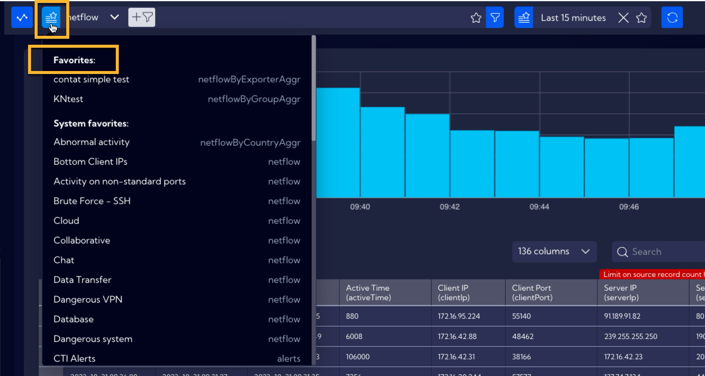

Additionally to the filters created by the user, the System includes ready-made, built-in filters created by the specialists of Sycope. They can be accessed from the **System favorites** section in the **Favorite Filters** pop-up menu.

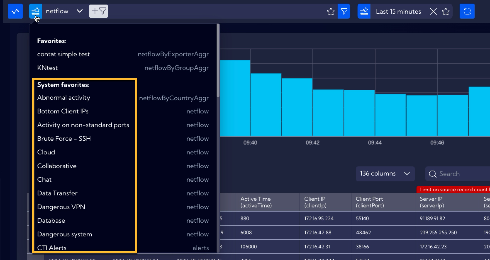

A list of all the built-in filters in the System is located in the [Build-in filters](/NQL/Built-in%20filters) table.

In the **[Configuration > Favorites > Filters]** menu, you can find a table with a list of user-created filters.

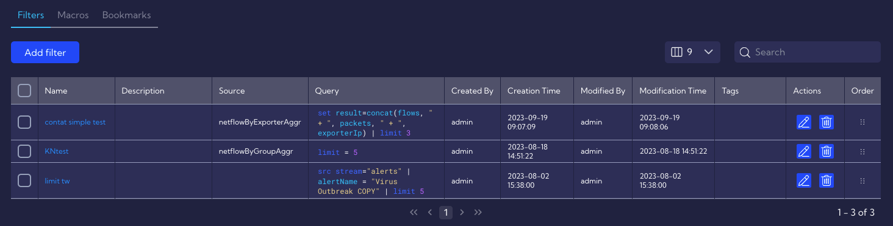

The table includes the following columns:

- **Name** - name of the filter
- **Description** - a short description of the filter
- **Source** - the source of data / data stream used by the filter
- **Query** - query in the NQL language
- **Created By** - name of the user who created the filter
- **Creation Time** - date of the creation of the filter by the user
- **Modified By** - name of the user who last modified the filter
- **Modification Time** - date of the last modification
- **Tags** - assigned tags
- **Action** - available actions
  - **Edit** - filter editing button
  - **Delete** - filter deletion button

## Creating a filter via the **[Configuration > Favorites > Filters]** menu

In order to create a filter in the  **[Configuration > Favorites > Filters]** menu, you must use the `Add filter`  button.

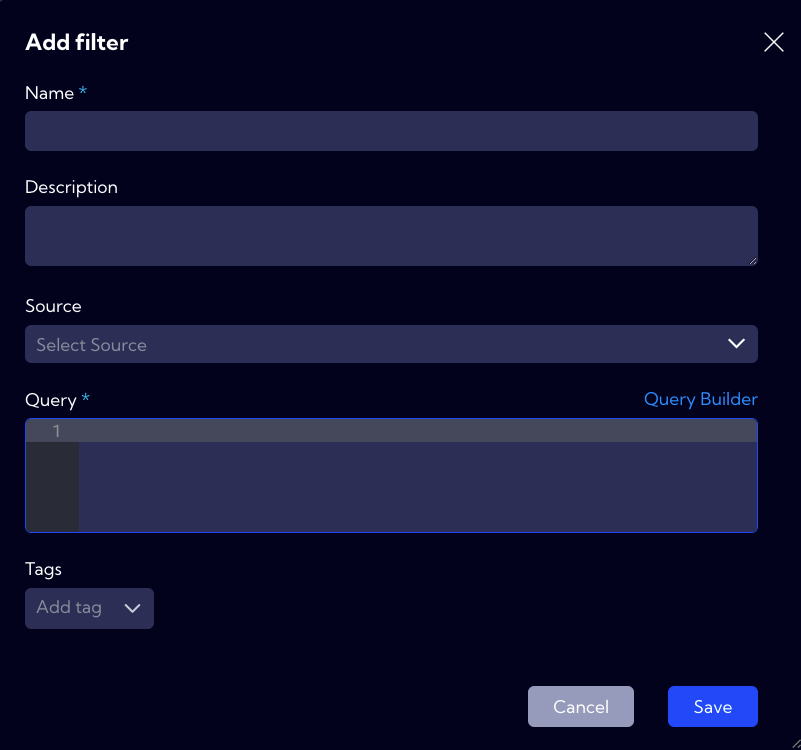

In the filter creation window, the following fields need to be filled out:

- **Name** - name of the filter
- **Description** - a short description
- **Source** - the data stream used by the filter
- **Query** - query in the NQL language
- **Tags** - tags assignment

### Example

As an example, create a filter that will use the `testdata` stream to filter people aged 22. Initially, fill out the **Name** and **Description** fields.

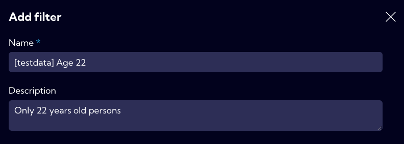

Now, select the `testdata` stream.

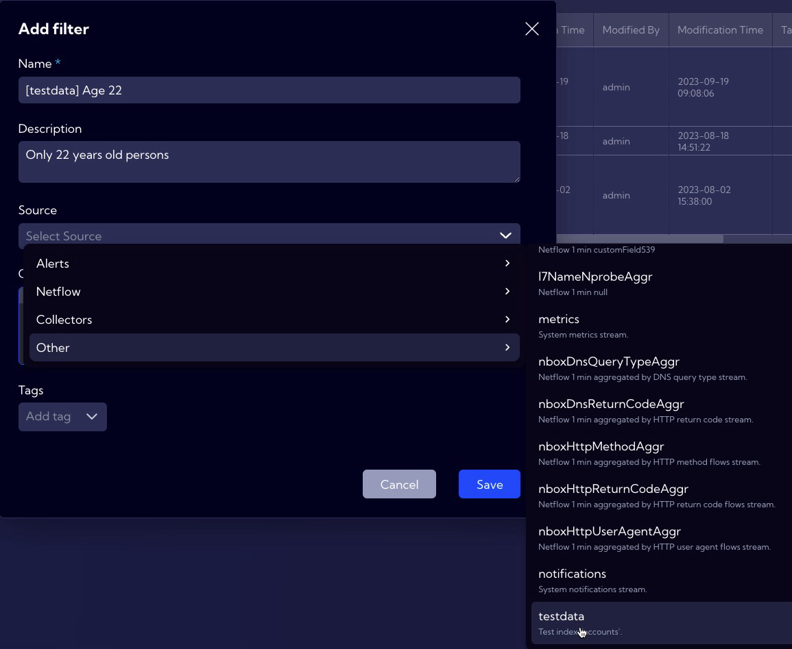

In the **Query** field, type the `age=22` phrase (during the typing, the system will suggest the commands/expressions. You can find more information on the NQL in the [NQL User Manual](/NQL/NQL%20documentation) document, as well as the entire NQL section of the documentation).

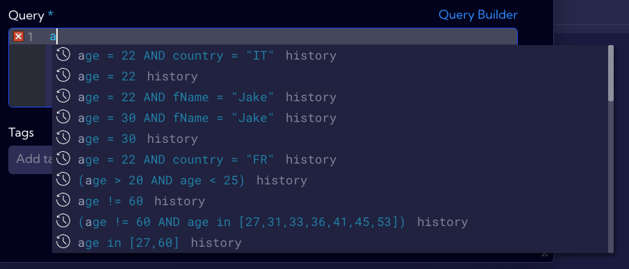

Next, you can (while it is not obligatory) assign a tag to the filter, while in this example, the `Test data` tag has been assigned. A complete filter looks like this:

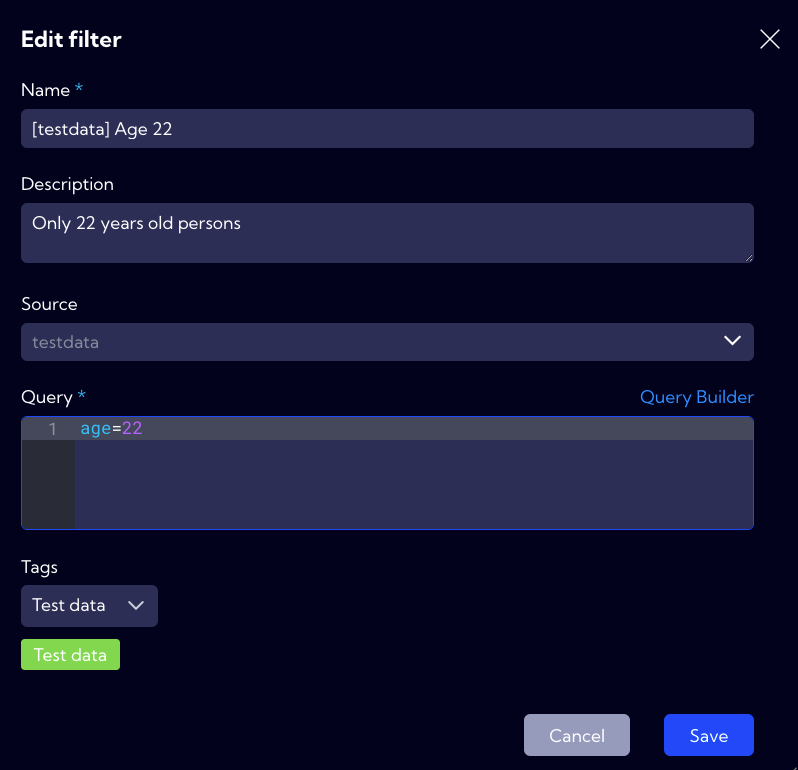

After saving the filter, it will be placed in the filter table, as well as in the pop-up menu in the **Search bar** in the **Favorites** section.

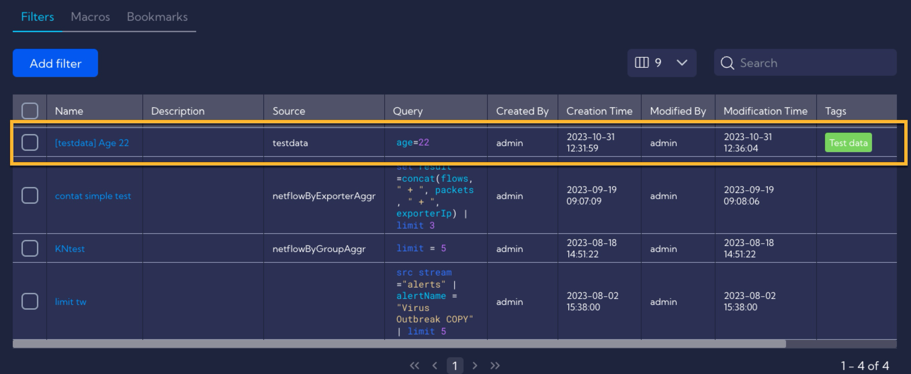

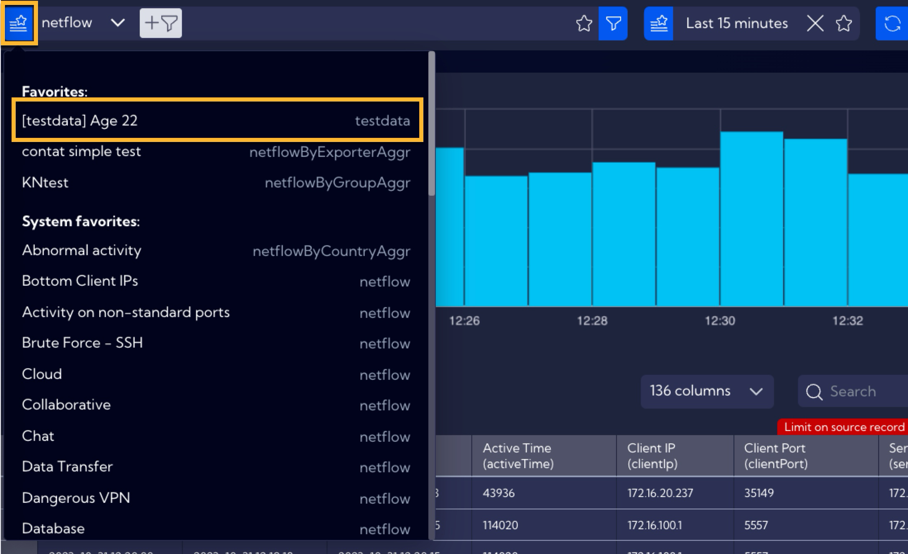

In order to use a filter you can, for example, in the [Raw Data] menu select the stream for which the filter has been created (in this example, it is the `testdata` stream). Then, select in the menu the time range appropriate for the given stream - in the case of the `testdata` stream, the data has a timestamp of 01.01.2023 - 01.02.2023.

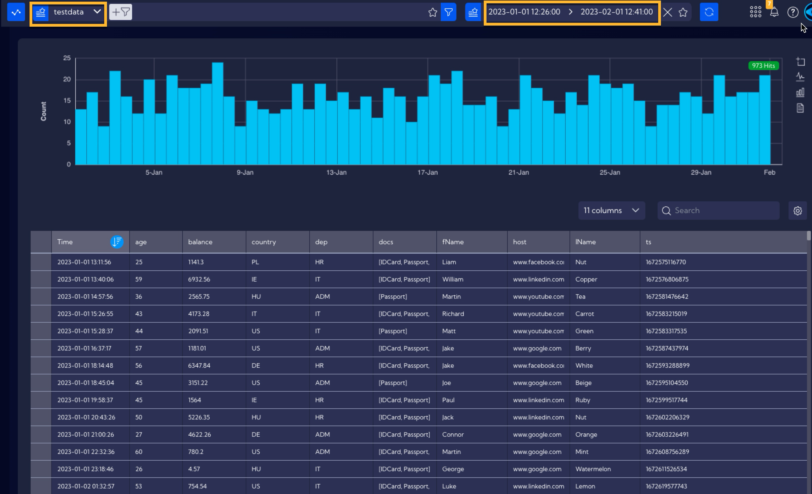

Then, from the **Favorite filters** menu in the **Search Bar**, select the created filter.

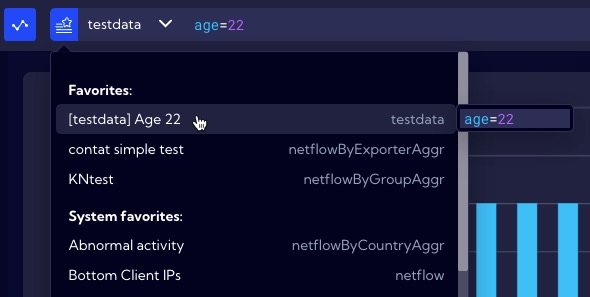

The filter has been saved into the **Search Bar**, and the table will now display the data only of people aged 22.

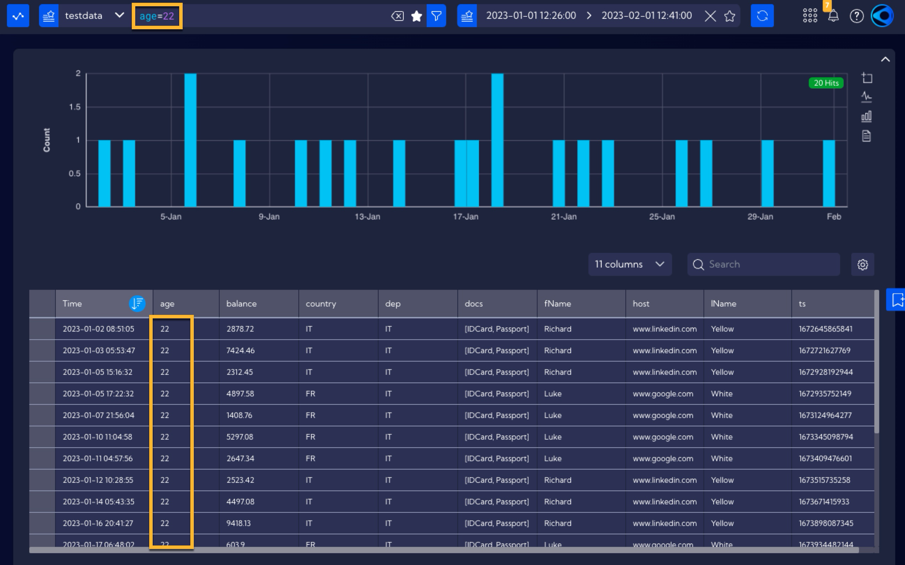

## Creating a filter from the level of the Search Bar

A favorite filter can be created and deleted also from the level of the **Search Bar**. Basing on the previous example, create a filter for the `testdata` stream that will display only people in the age of 22. For this purpose, you can, for example, use the [RAW Data] menu and select the `testdata` stream, as well as an appropriate time range (see example above).

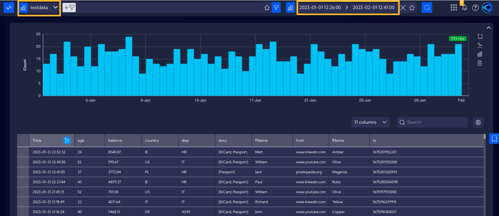

Next, you must enter the filtering expression in the **Search bar**. You can do this in two ways:

- **The first method**

  In the table, locate the value of `22` in the `age` column and by pointing it with your mouse push the plus button to add it to the filter in the **Search Bar**.

  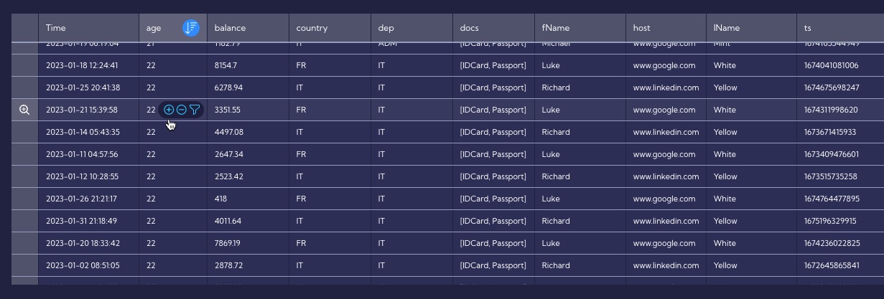

  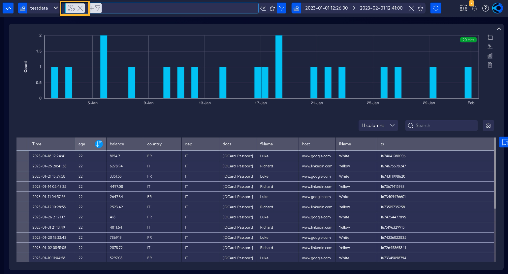

- **The second method**

  Go into advanced mode of the **Search bar** (you can find the documentation of the Search bar here: [Search bar documentation](/NQL/Searchbar))

  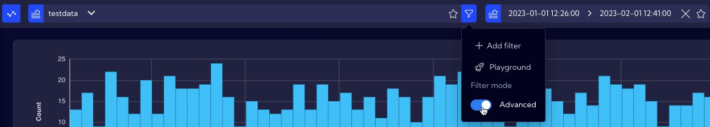

and then manually type in the value of the expression that constitutes the filter in the **Search bar**, which in this case is `age=22`

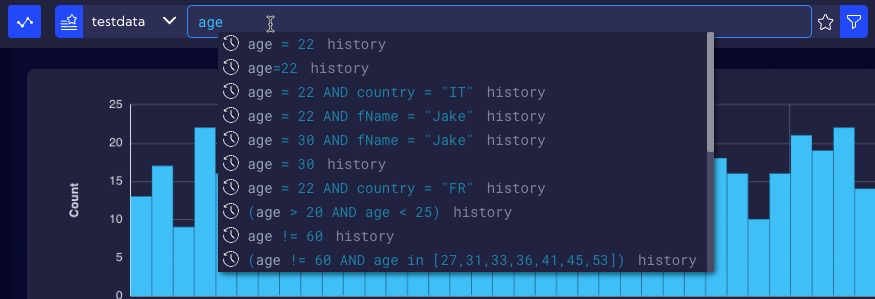

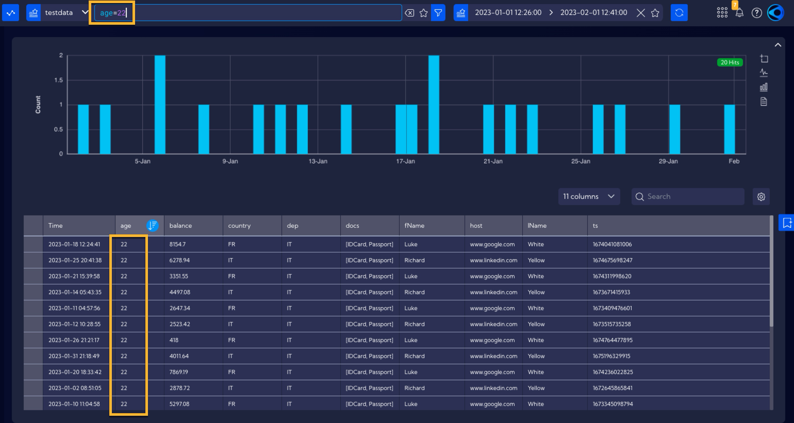

For a filter created in such a way (regardless of whether it was the first or the second method) to be added to the **Favorite Filters**, you must use the  icon in the Search bar.

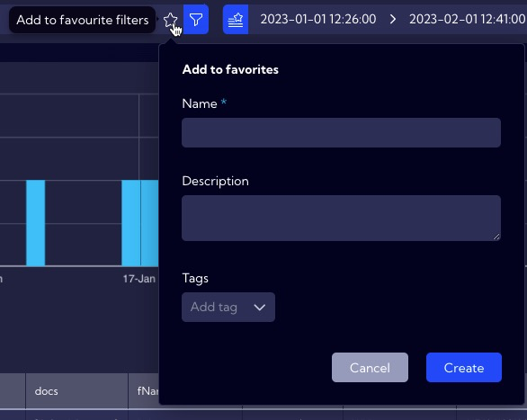

Then, fill out the appropriate fields just as in the method explained earlier for entering the filter from the **[Configuration > Favorites > Filters]** menu. 

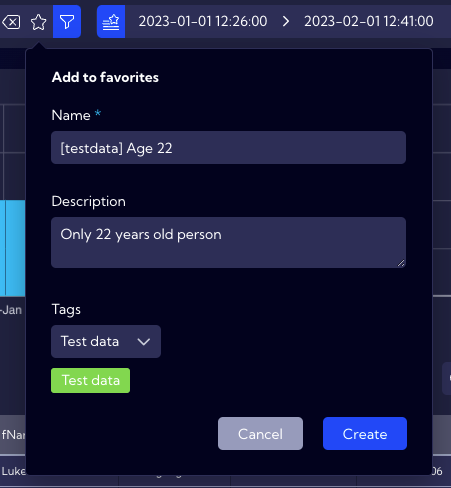

After clicking on the **Create** button, the filter will appear in the **Favorite Filters** menu, as well as in the list of filters in the table of the **[Configuration > Favorites > Filters]** menu.

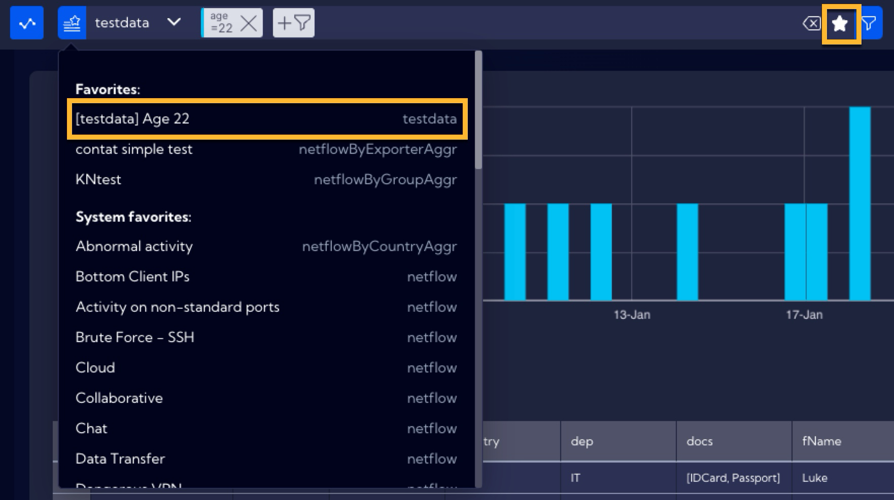

At the same time, the icon in the task bar will change its status and clicking it means to delete/remove the filter.

Therefore, the Favorite Filter can be removed from the level of the **Search Bar** with the use of this icon, as well as in the **[Configuration > Favorites > Filters]** menu by using the **Delete** button located in the table, in the **Action** column.

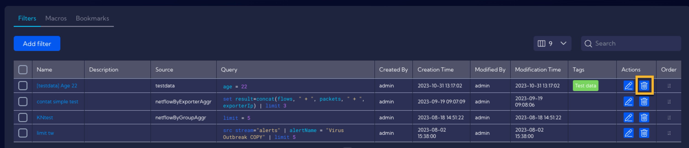
