# Shortcuts (Bookmarks & Drilldowns)

## Introduction

Shortcuts is an extension of the navigation method within the Sycope system. They have been created to facilitate and streamline the work within the system.

Shortcuts are divided into two basic types: [**Bookmark**](#bookmark) and [**Drilldown**](#drilldown).

## Bookmark

A Bookmark functions like a traditional bookmark known from web browsers. It allows for direct access to a previously defined and frequently visited location within the system, such as a dashboard with preset additional filters, or a specific widget, or even an external link to a frequently visited page, chat, or another system that we work with on a daily basis.

### Accessing Bookmarks

#### "Take a Shortcut!"

For a quick and easy access to availabale **Bookmarks** and **Drilldowns** from anywhere in the system click on the `Bookmark icon` in the upper-right corner.

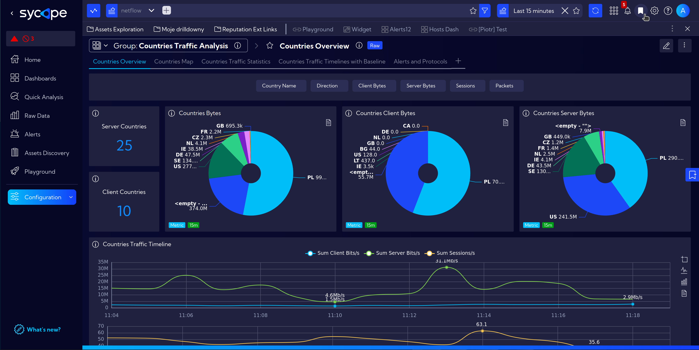

#### Access the `Shortcuts (Bookmarks & Drilldowns)` Section

Access the Shortcuts section via **[Configuration > Favorites]** which automatically takes us to the **Shortcuts (Bookmarks & Drilldowns)** tab.

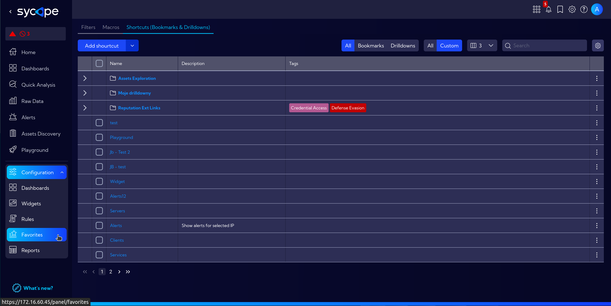

### Adding New Bookmark

New bookmarks can be added in various ways, as presented below.

#### Quick and Basic Way

While in the selected location within the system, click on the bookmark icon located on the right side.

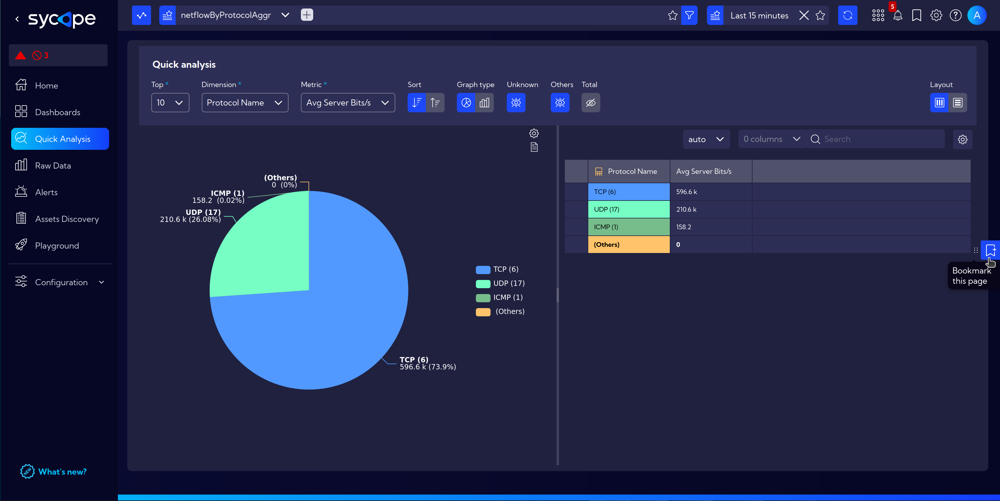

We set the **Name** and **Folder** where we want the bookmark to be saved, then save it.

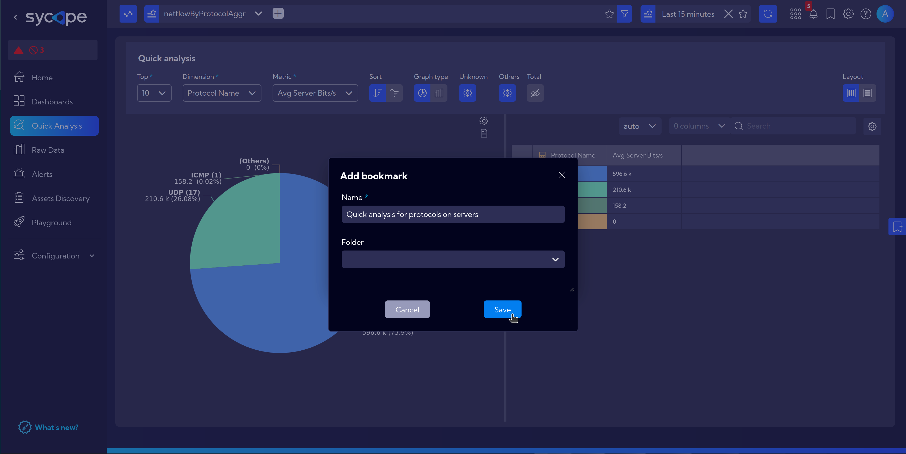

#### Advanced Way

Navigate to **[Configuration > Favorites]** and click `Add shortcut`.

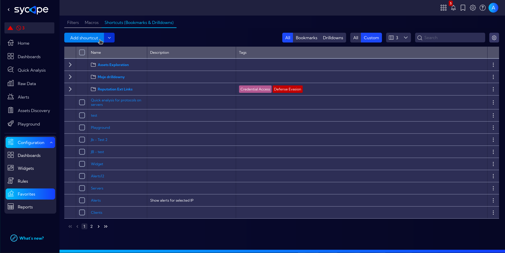

- Fill in the fields **Name** and **Description**.
- In the **Go to** section, specify the type:
  - **Url** - for an external webpage address or an internal link within Sycope.
  - **Dashboard** - choose the dashboard to which it should navigate.
  - **Widget** - select the widget to which it should navigate.
- In the **Show as** section:
  - **Bookmark**
  - **Drilldown (in context menu)** - more about [Drilldown](#drilldown)

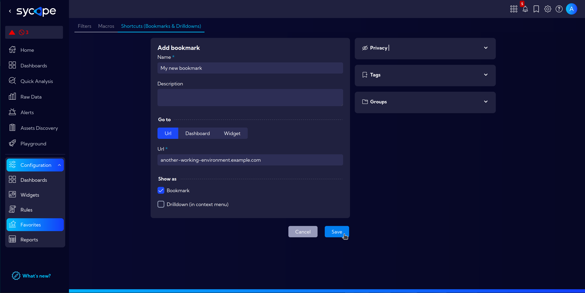

## Drilldown

Drilldown functions similarly to a Bookmark, with the key difference being that when a drilldown is invoked, a filter is immediately applied to customize the content to which we navigate.

It can be easily accessed via the context menu (right-click), then Drilldown folder and selected Drilldown, which opens a 'bookmark' with an applied filter based on the field value on which the right-click was performed as shown in [Basic Usage](#basic-usage) section.

:::tip Key Takeaway:
This functions as a new navigation method in Sycope, eliminating the need to know exactly where a particular widget/dashboard is located. After defining a widget, you can simply right-click on a specific field type anywhere in the system, and immediately see information from the widget/dashboard in the Drilldown.  
If something is missing, you can also add a new one from the right-click context menu without necessarily having to search in the settings.
:::

### Basic Usage

For example, in `[Menu > Raw Data]` right-click on the field with the selected IP address, then navigate to `Drilldown`.  
Here, available drilldowns with settings appropriate to the selected field are displayed.

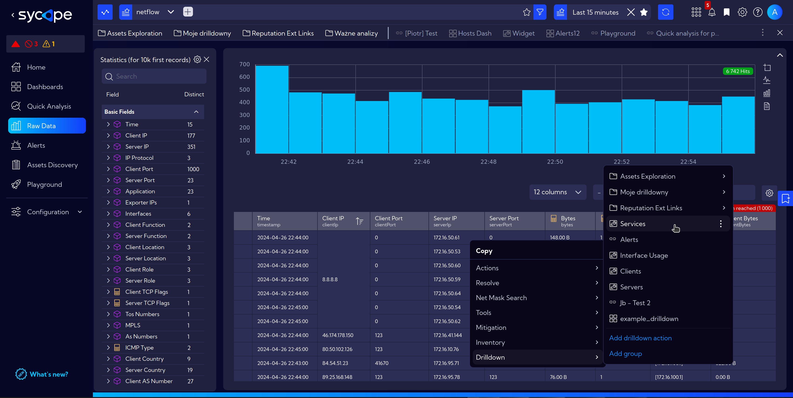

In this case, selecting `Services` displays a pop-up window with services running on the chosen host.

:::note
Notice the autmatically applied IP address filter in the **Top bar**.
:::

### Adding New Drilldown

Two equivalent ways to add a **Drilldown**:
- By clicking on the `Bookmark Icon`, then `Three dots` and `Add bookmark`
- or navigate to **[Configuration > Favorites]** and click `Add shortcut`

The third option for convenience is to add a drilldown from the context menu by right-clicking:

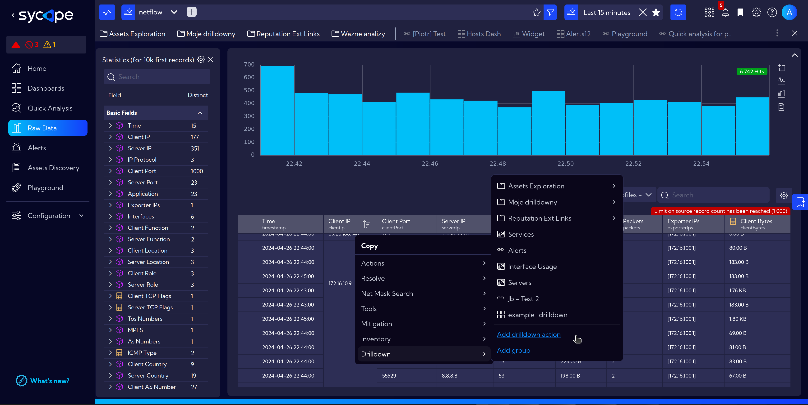

Next, in the opened window, similarly to [creating a **Bookmark** in Advanced Way](#advanced-way):
- Fill in the fields **Name** and **Description**.
- In the **Go to** section, specify the type:
  - **Url** - for an external webpage address or an internal link within Sycope.
  - **Dashboard** - choose the dashboard to which it should navigate.
  - **Widget** - select the widget to which it should navigate.
- In the **Show as** section:
  - **Bookmark** - more about [Bookmark](#bookmark)
  - **Drilldown (in context menu)**  

This time, we'll focus on selecting **Drilldown**, which extends the **Add bookmark** window with **Available for** field (detailed in the [**Drilldown Examples**](#drilldown-examples) section).

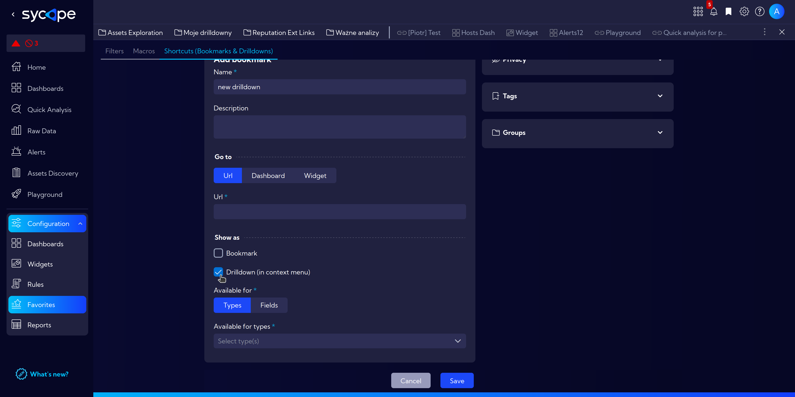

#### Drilldown Examples

##### Drilldown: Application Details Table

In this example, we are creating a drilldown that, when clicking on a field with an IP address, displays a widget presenting the table with details for applications running on specified host.

- Begin by adding a new drilldown.
  - Navigate to **[Configuration > Favorites]** and click `Add shortcut`.
  - Fill in the fields.
    - **Name**: ***app_details_table***
    - In the **Go to** section, select the type ***Widget***.
      - Select the widget: ***Applications Details Table***.
    - In the **Show as** section mark ***Drilldown (in context menu)***.
    - In the **Available for** select ***Types***.
      - And in **Available for types** choose ***ip***.
  - Finally click on `Save` button.

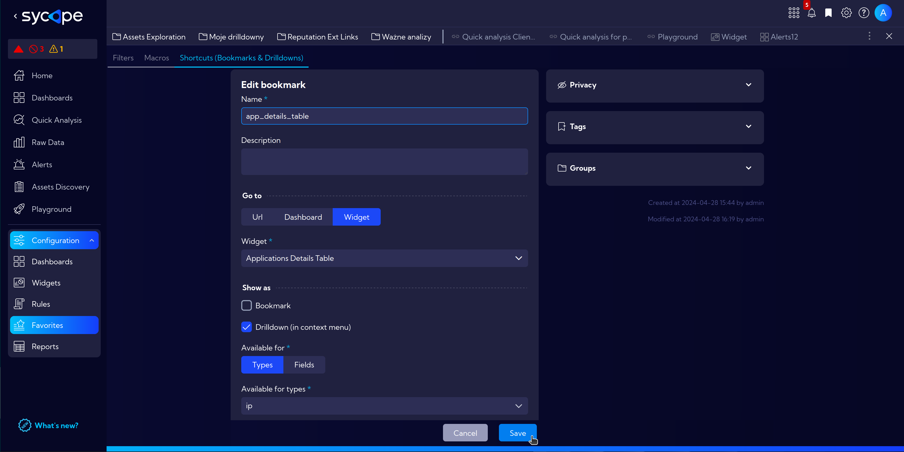

Now let's test our new drilldown in action.

- Navigate to `[Menu > Raw Data]`.
- Right-click on a field with selected Cilent, then ***Drilldown*** and ***app_details_table***.

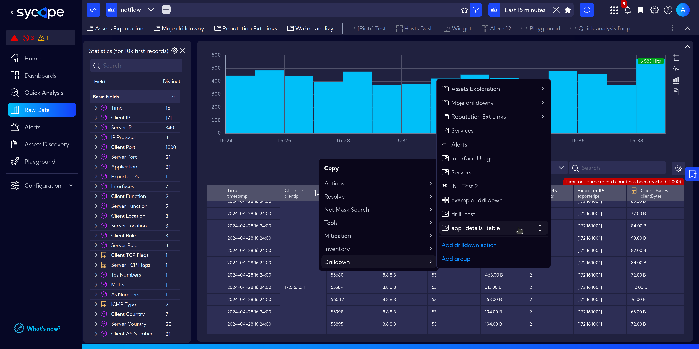

- The pop-up window displays a widget information with the added filter, i.e. the selected IP address.

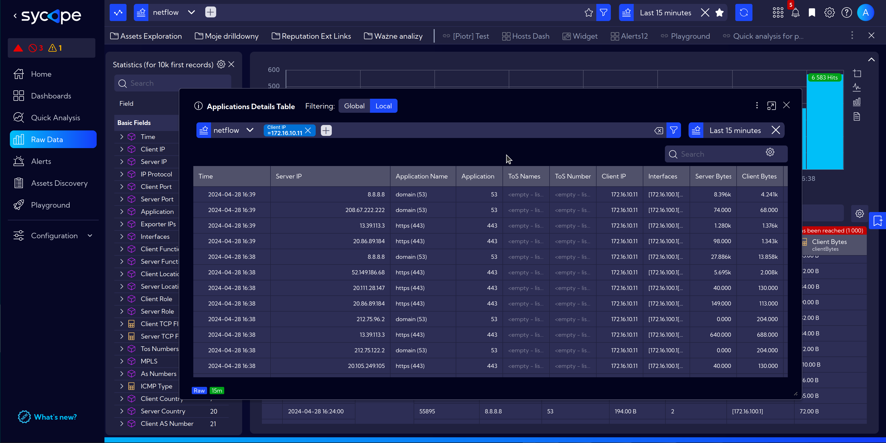

##### Drilldown: Countries Traffic Details

The next example demonstrates a drilldown for a selected field type with the country name.  
Invoking the drilldown will display traffic details for the selected country.

- Navigate to **[Configuration > Favorites]** and click `Add shortcut`.
- Fill in the fields.
  - **Name**: ***country_traffic***.
  - In the **Go to** section, select the type ***Widget***.
    - Select the widget: ***Countries Traffic Details***.
  - In the **Show as** section mark ***Drilldown (in context menu)***.
  - In the **Available for** select ***Fields***.
    - And in **Available for fields** as a **Source** choose ***Netflow*** > ***netflow***.

    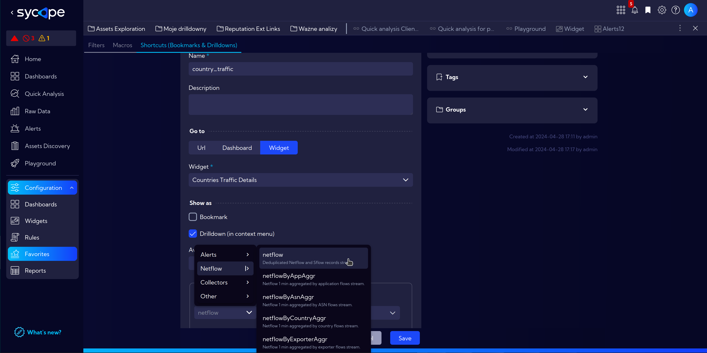

    - In the **Field name** search for ***country*** and mark ***Client Country*** and ***Server Country***.

    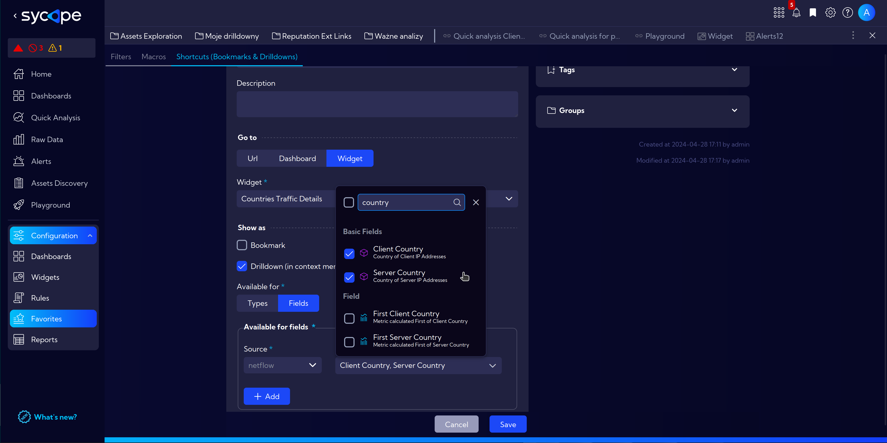

    - Finally: `Save`.

- To test this drilldown naviagte to `[Menu > Raw Data]` and make sure that the columns **Client Country** and **Server Contry** are selected and visible.

- Now right-click on a field with country symbol, select **Drilldown** and **country_traffic**

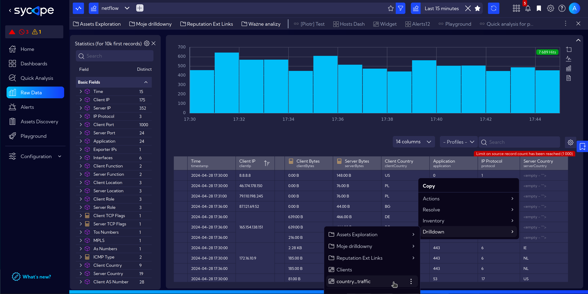

- This drilldown will be visible every time we right-click on the fields **Client Country** or **Server Country** in the NetFlow stream. Invoking it will open a window with ***Countries Traffic Details*** widget for selected country symbol.

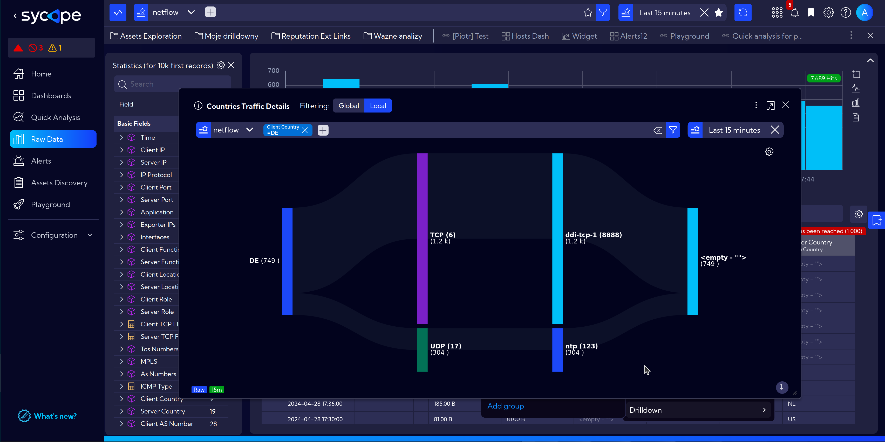
