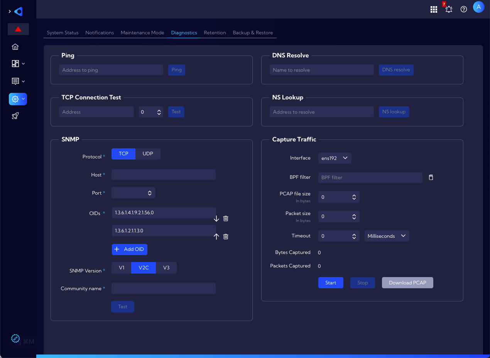

# Diagnostics

**[Settings > Support & Diagnostics > Diagnostics]** menu, there are several network tools.

The available network tools:

- **Ping** - simple ping connection test
- **TCP Connection Test** 
- **SNMP** - SNMP ver. 1/2/3 connection test
- **DNS Resolve** - a tool to resolve an individual hostname to an IP address
- **NS lookup** - a tool to resolve an IP address to an individual hostname
- **Capture Traffic** - a tool to capture packets from a selected network interface 

