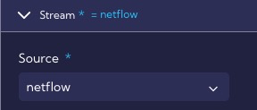
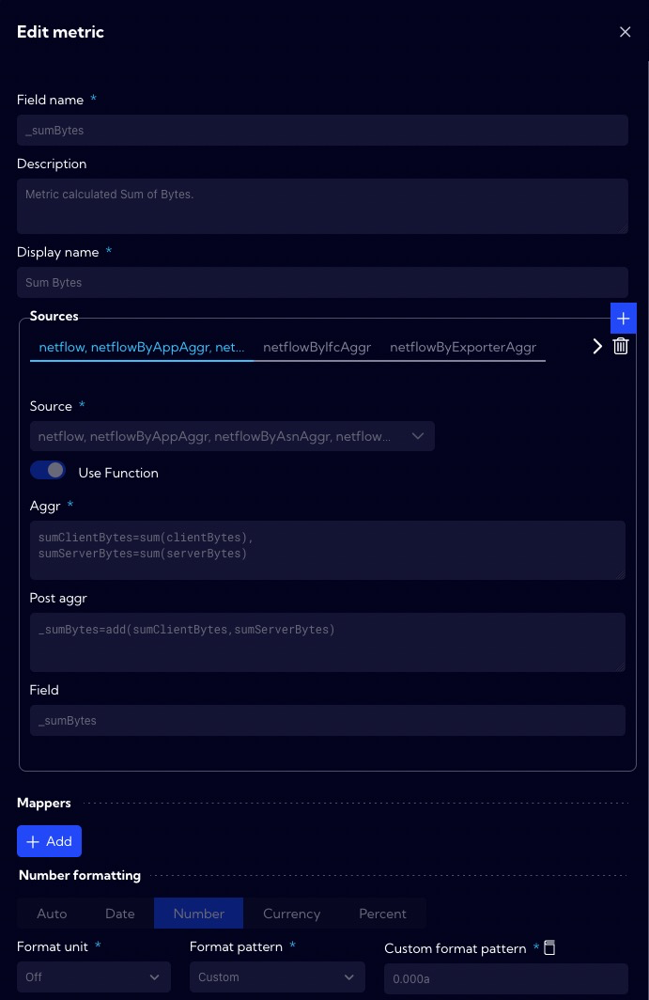
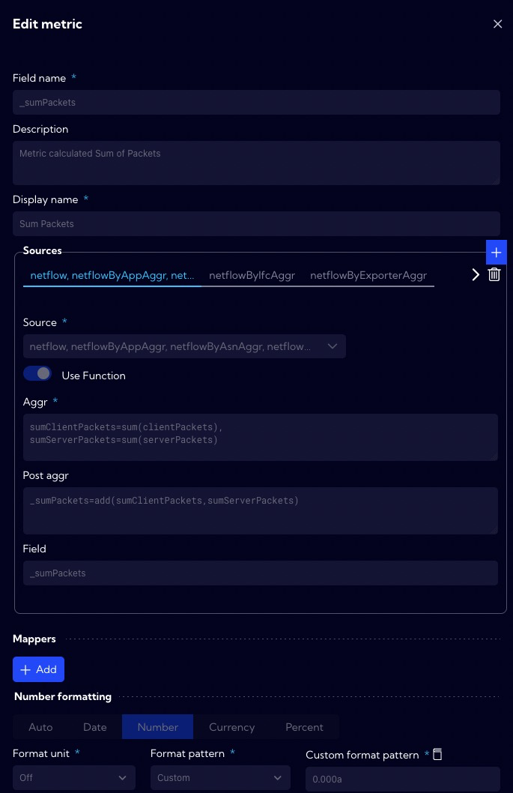
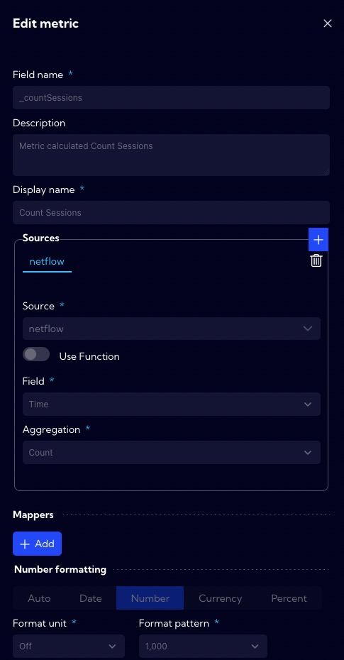
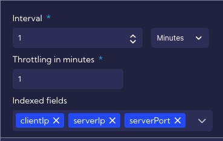
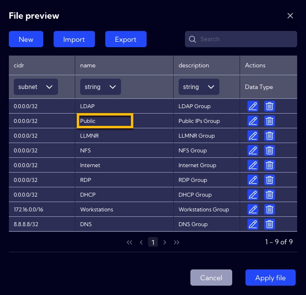
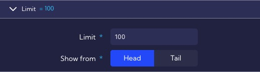

# Examples of rule creation - simple way

A simple method of a rule creation existing templates to design custom rules. In our example, we will configure a **Rule** based on the **DoS attack template**.

## Implementation

To design a new rule go to menu **[Alerts->Rule Set]** and then click **New rule** and select **From template** option.

A list of built-in rule templates is displayed. Select any template to get a preconfigured rule.

In our example, we will use the **DoS Attack** template. After selecting the template, a window with the configuration of the rule is displayed. The configuration is divided into sections.

## Overview of the rule template section

### Simple options

1. The **General** section contains general rule settings, such as the name, description, severity, or ATT&CK MITRE tactics and technique, for example.

   

   

   

2. In the **Stream** section, the data stream on which the rule will operate is specified, in our case it is the **netflow** stream.

   

3. In the **Time** section, the time interval for which the rule searches for correlations is specified, in our case it is for a period of 1 minute. 

4. In the **Values** section we specify the **metrics** it uses, we see that the rule uses, three **metrics**: **Sum Bytes**, **Sum Packets** and **Count Sessions**.

  

  
  
  Definitions of metrics are located in the **[Settings > Configuration > Objects > Metrics]**. The **Sum Bytes metric** calculates the total number of bytes in both directions (client <-> server).  
  
  The **Sum Packets metric** calculates the total number of packets in both directions (client <-> server).
  
  
  The **Count Sessions metric** calculates the number of sessions.
   

5. The **Categories** section defines fields by which the data are grouped. In this case, we are interested in grouping by the **Client IP**, **Server IP**, **Server Port**, **Client AS Name**, **Client Country**, **Server AS Name**, **Server Country** fields. We want to monitor DoS attacks on specific servers, so we need to group data by these fields.

   

6. In the **Schedule** section, we specify the interval every time the rule is executed and suppressed.

   

7. The **Thresholds** section defines the default threat exceedance thresholds of the rule that detects DoS attacks. Depending on the exceedance level, an alert is generated at the appropriate level: Minor, Major or Critical.

   

8. The **Actions** section specifies that all DoS alert levels will be stored in the alert table, and that the alert will display such **custom fields** as:  First Client Function, Join Client TCP Flags, First Server Function.

   
   

   

---

###  Advanced option

Clicking on the show advanced option switch gives you access to advanced template options.

1. In the **Time & Input filters** section, the **Filter by** setting specifies a condition for the **Public** function group. This condition means that threat detection applies only to IP addresses in the **Public** function group. In this filter, a collector `top1000IPsLast2Minutes` is also used. Its role is to pre-filter the data by collecting Top 10k IPs in Last 2 Minutes Timeline with the highest sessions (at least more than 1 k) and packets count more than 1k. You can find the collector configurations in the menu **[Settings > Configuration > Objects > Collectors]**.

   

   To find out what IP addresses are in the **Public** function group you need to go to **[Settings > Configuration > Objects > Lookups]** - groups-function. By default, there are no network ranges set (0.0.0.0/32), so in order for the rule to work properly, you need to add the appropriate subnets named **Public**. Therefore, before creating a rule from a given template, you should read its description and configure related objects.

   

2. In the **Sorting** section, we define the type of sorting in our case by **Sum Bytes**, and then, by **Sum Packets**.

   

   

3. The **Limit** section specifies that a rule can generate a maximum of **100 alerts** during a single execution, this was specified so that the correlation engine would not be overloaded in case of incorrect threshold configuration.

  

When creating a rule from **Template**, all parameters can be freely modified, and after clicking on **Create,** our rule will appear in the list of rules.

