# Release Notes

## ver. 2.6

### New Hosts & Subnets lookup

**Notice:** we added a new lookup called "Hosts & Subnets", crucial for the operation of the system. It contains information on subnets and devices important to the management of availability and security or the efficiency of the network – it stores the information on the device and subnet names, their location, network function, flow policy, services they provide, significance to the organization, assignment to an organizational unit/department of the company and so on. The lookup replaces the previous group lookups-* namely groups-subnet, groups-role, groups-private, groups-location and groups-function. The data from these lookups have been copied to the Hosts & Subnets lookup, and the previous lookups marked as deprecated. The built-in elements of the system such as views, rules or data streams will now only be utilizing the Hosts & Subnets lookup, although if any user objects still use any of the above-mentioned lookups, we advise to switch to the new lookup. 

### Multitenancy 

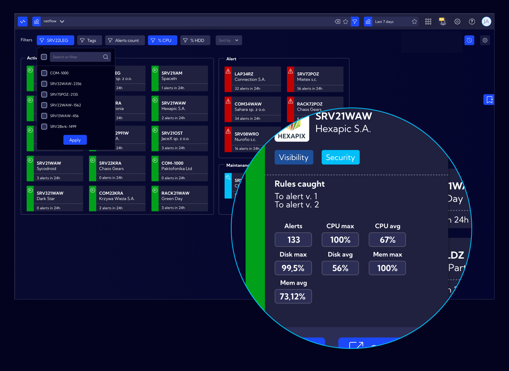

A functionality which allows for the service of multiple entities and/or independent IT networks from a single, central console. The module is intended for entities providing Network Operation Center or Security Operation Center services, e.g. telecommunications companies, the so-called shared service centers and IT integrators. The devices operate in two modes: Master Console and Tenant. 
The Master Console gathers information from the tenants such as device status, notifications, alerts and displays the information in a view specially prepared for this purpose. Each tenant has its own dedicated dashboard showing how the selected device works, what alerts it reports etc. From the Master Console level, we can also easily switch to the GUI of the tenant, as well as generate automatic, periodical reports in a PDF file and send it to companies in which the tenant is located.
A device in tenant mode is similar to a standalone installation – an additional option it has is the ability to set the connection with a Master installation and the rules configuration in such a way that specific alerts are sent specifically to the Master. Notifications and metrics regarding the work status of the tenant are sent in a similar way. With the help of defined authorization, the main administrator can specify what operations may be carried out on the tenant by the local administrator/user. 

### IT Asset Discovery 

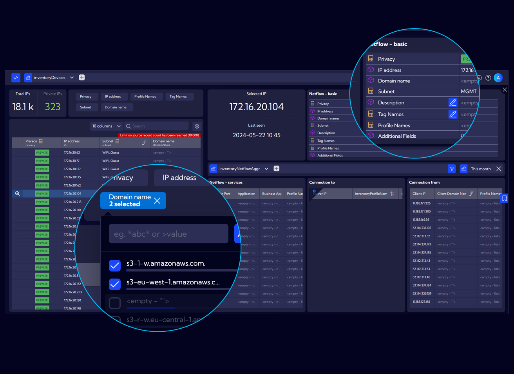

A functionality which allows for the utilization of the Netflow protocol for monitoring of existing resources in the network and recording of traffic between specified subnets, hosts or specific applications both in technical and business sense. The module allows for operation on large, wide networks in order to monitor and report discrepancies between the real world and that which is stated in the documentation of the network, systems, services or the application. Thanks to the application of AI, the module also allows for automatic clustering of network objects aiming to quickly identify the type of hosts that can be found in large networks. This means identification of object groups about which little is known based on passive analysis of network traffic characteristics. This way the system will help to identify objects such as workstations, servers, printers, card readers, OT and IoT systems and so on.

### Netflow forwarder 

A system operation mode allowing for the transfer of the received netflow to multiple network devices with the possibility of filtering the transmitted traffic in order to eliminate the netflow that is not needed for analysis, and at the same time, it is not possible not to send it from the source device. This functionality is very useful in large networks where junk traffic takes up a lot of resources to process and store and consequently not taken into account in the data analysis.

### Quick Setup 

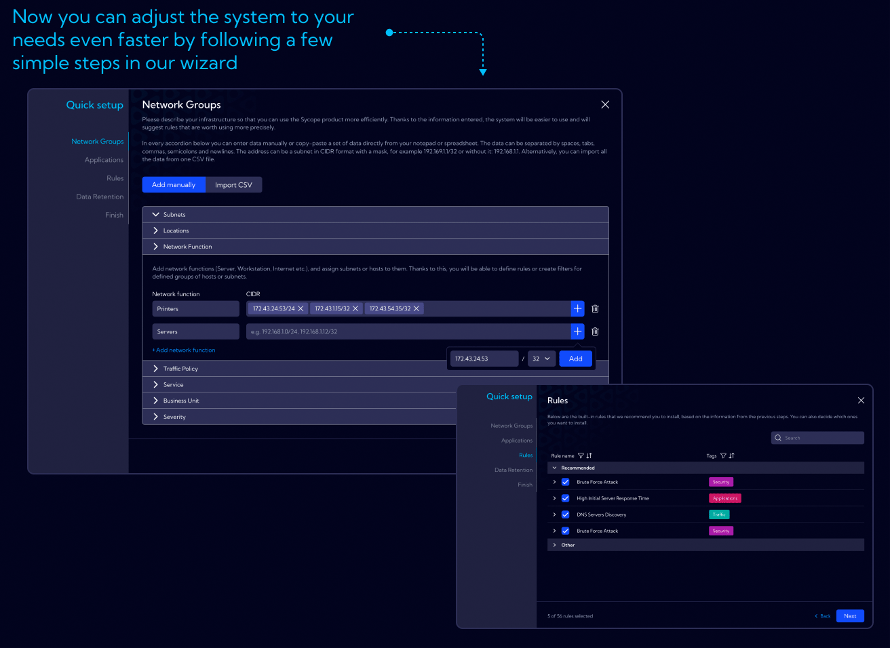

A functionality enabling quick configuration of the product and adjusting of its setting to the specifications of the client – completing basic lookups, enabling appropriate rules, setting appropriate data retention.

### Quick Analysis 

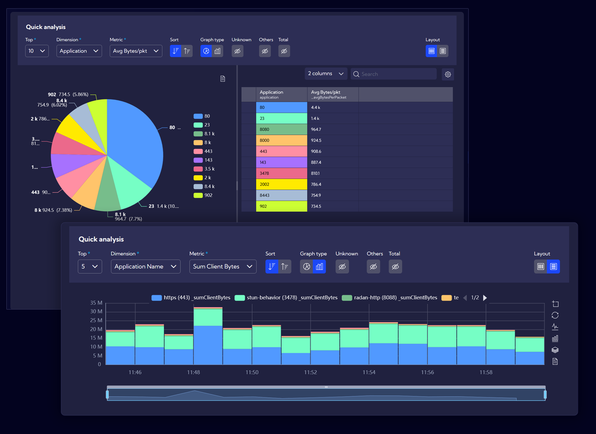

An easy-to-use view allowing for quick analysis of ad hoc data without the necessity to create widgets or dashboards.

### Widget Personalization 

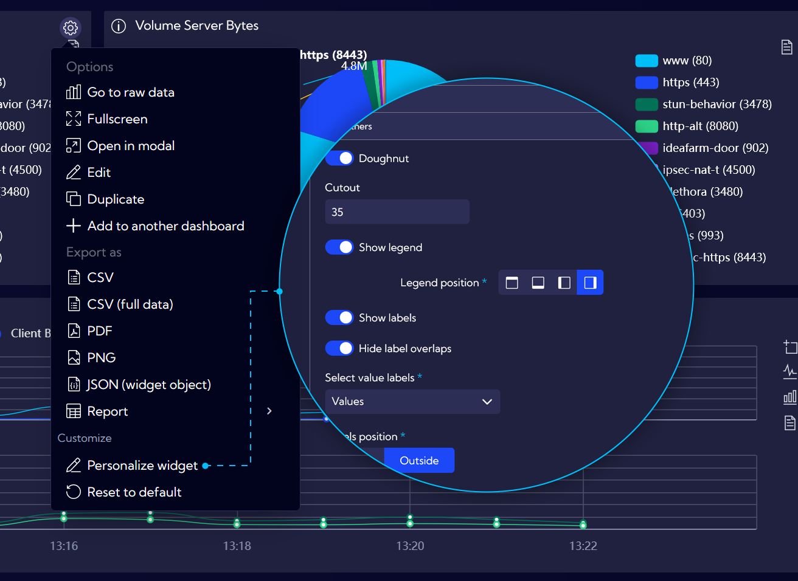

The ability to change the appearance and the displayed data without the necessity to edit the widget. Even users without editing authorization can adjust the way of displaying the data, e.g. change the sorting or limiting of the data, change the location of the legend or graph axis description according to their preferences. Such settings are separately saved for each user of the system.

### New Side Menu 

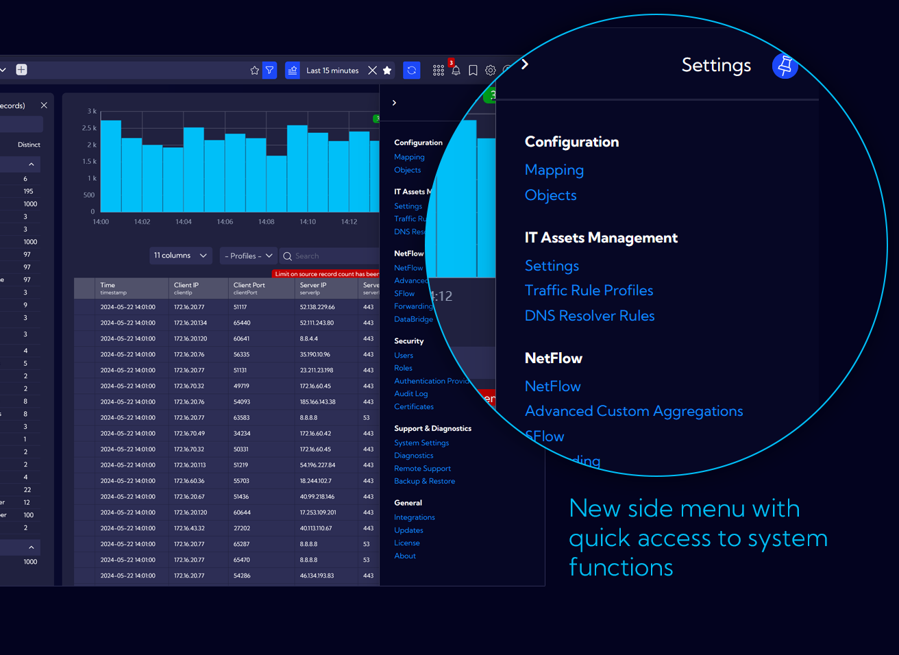

A separate part of the menu used for configuration, adjustment of the system and administrative actions moved to the right side and hidden in the cog icon in the upper menu.

### Context drilldowns 

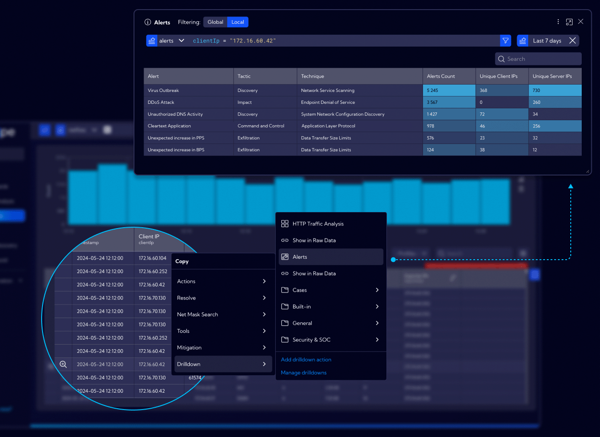

An ability to pin widgets, dashboards as well as references to external links to specified types of data fields in order to simplify and shorten the information analysis time presented in the GUI, for example, by clicking on the IP address in any given view in the system we can quickly display a table in a modal windows showing what alerts are related to such an address or a graph showing the used services, as well as what hosts were connected to that address.

### Bookmarks 

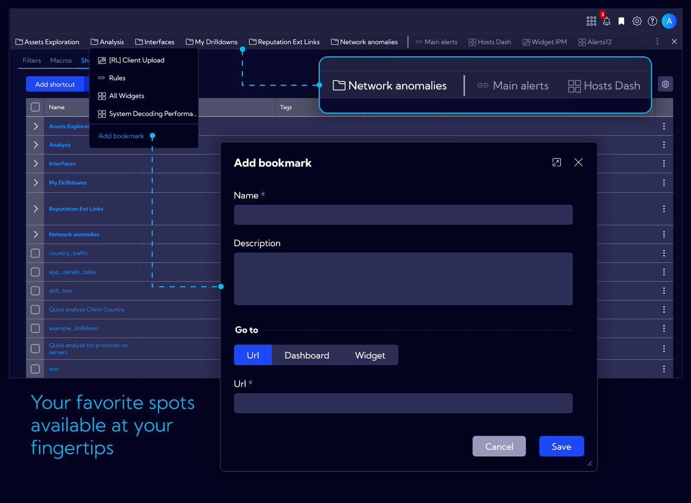

This feature provides the ability to define shortcuts to the most frequently visited elements of the system or analytical views, including the ones with favorite filters in use, and so on.

### Graphs 

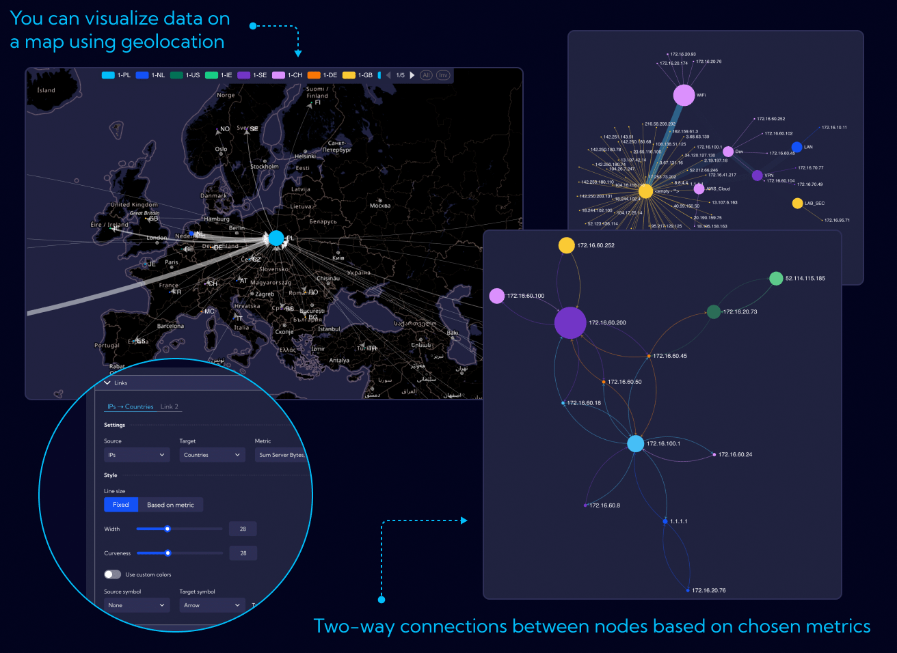

New data visualization capabilities in graphs, e.g. drawing of a graph on a map with positioning of points based on geolocation, including private subnets; capability of displaying multiple metrics on the edges (arrows) of the graph, e.g. incoming traffic on one arrow and outgoing traffic on the other; ability to control the size and color of points and graph edges based on a specific metrics, including conditional coloring when defined thresholds are exceeded, etc.

### Reports 

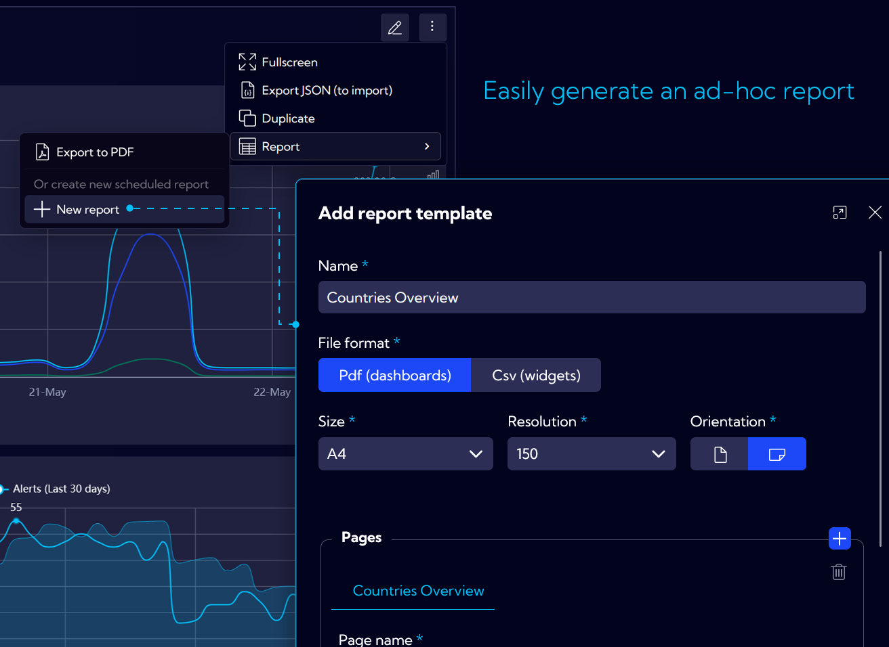

The possibility of defining new periodic reports and the ability to generate ad hoc reports (exporting the dashboard to a PDF file) has been simplified. Now, defining of reports, filters, recipients and schedules is done in one place.

### Grouping of objects 

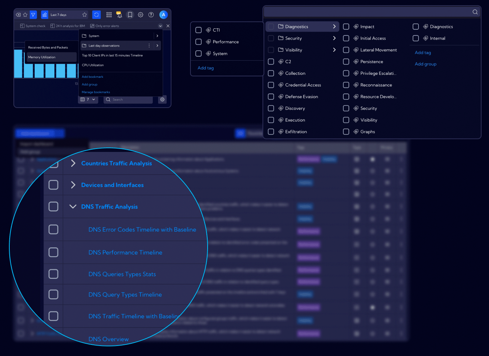

Components such as tags, filters, bookmarks can now be grouped for better management.

### Tables 

Options of blocking the column, rowspan and subheader, e.g. in the raw data view, as well as in the dashboard tables.

### New filtering modal

Smooth switching between simple and advanced modes in one window. A new way of adding to a filter from the searchbar – selection of the field and switching to simple mode by default. The ability to easily change the selected field without losing the entered values.

### Greater responsiveness of dashboards 

Adapting dashboards and widgets to the height of the screen on which they are displayed. The created views use the screen space in an optimal way, which makes them look even better than before.

### Change of default authorization 

All newly created objects in the system are given public access by default, i.e. each system user may read them (utilize them) and if we want to restrict them, it needs to be clearly stated, e.g. by changing the authorization to private or by sharing it with specific roles only.

### New appearance of tables, forms, modal windows, widgets. 

### Table profiles – predefined sets of columns per data source.

### Other

The ability to embed macros in other macros.

Service and function that calculates the number of unique IP addresses in the network.

Notification displayed as pop-ups.
