# Analysis

## Context Menu (Right Click Menu)

The context menu, accessible by right-clicking, contains different sets of possible actions depending on the type of data and the kind of field on which we click.

Let's look at the example below with the available options after clicking on the Time field in Raw Data.

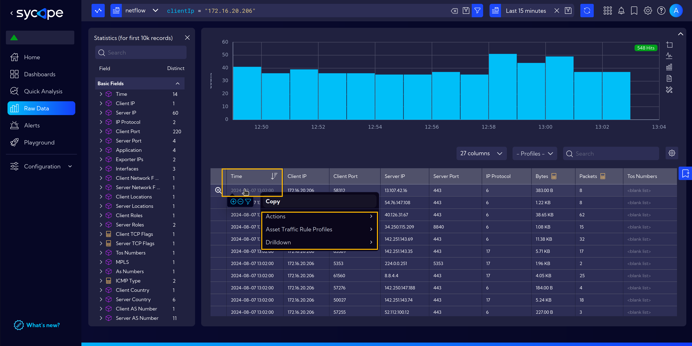

And another example of the context menu available after clicking on the field with the server IP address.

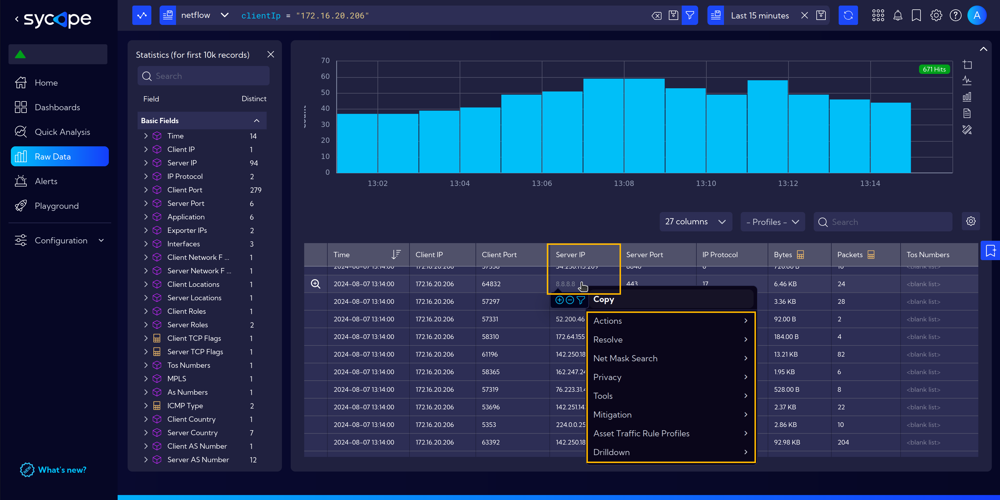

The context menu also works when we click on widgets. Additional useful options are then revealed.

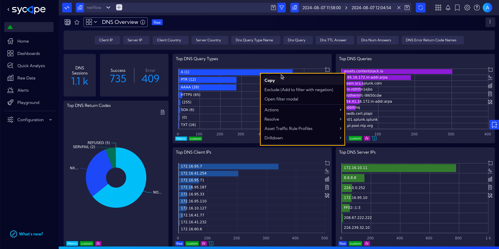

## Drilldowns

Drilldown is another navigation enhancement of the system. It allows discovering details that are not visible or accessible in the foreground view.  
Drilldowns are fully configurable. More about them can be found [here](/User-Guide/Configuration/Shortcuts#drilldown).   

However, for now, let's focus on two basic functionalities.

### Drilldowns assigned to widgets

To demonstrate this functionality, let's navigate to the **DNS overview** dashboard. Go to menu **`[Dashboards]`** and under **DNS Traffic Analysis** group find a **DNS Overview** dashboard.

Hovering over a widget reveals a small icon with an arrow in the bottom right corner of the widget.

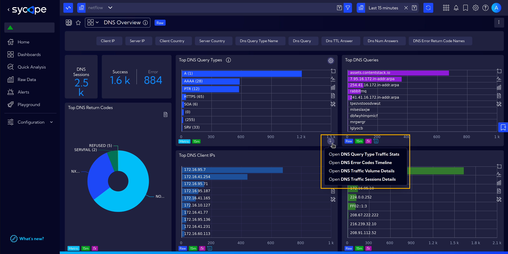

Clicking the icon brings up a context menu with drilldowns to choose from. After clicking on one of them, in this case, *DNS Error Code Timeline*, an additional window with a detailed view appears.

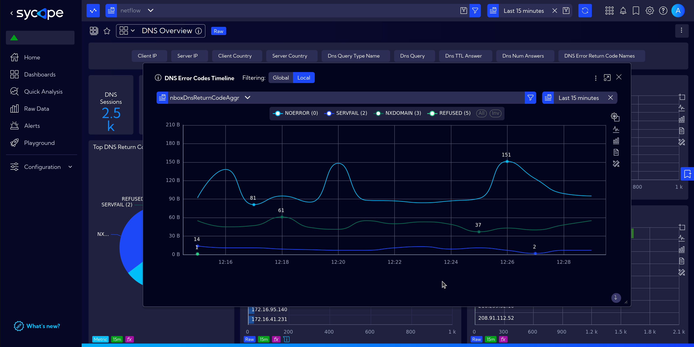

### Right Click Menu Drilldowns

The second type of drilldowns are those assigned to fields in tables and are accessible by right-clicking on the selected field.  
The content of the menu under the Drilldown entry varies depending on the type of data and the kind of field in the table cell.

The example below shows the selection of available drilldowns for a field containing an *IP address* in the *Server IP* column.

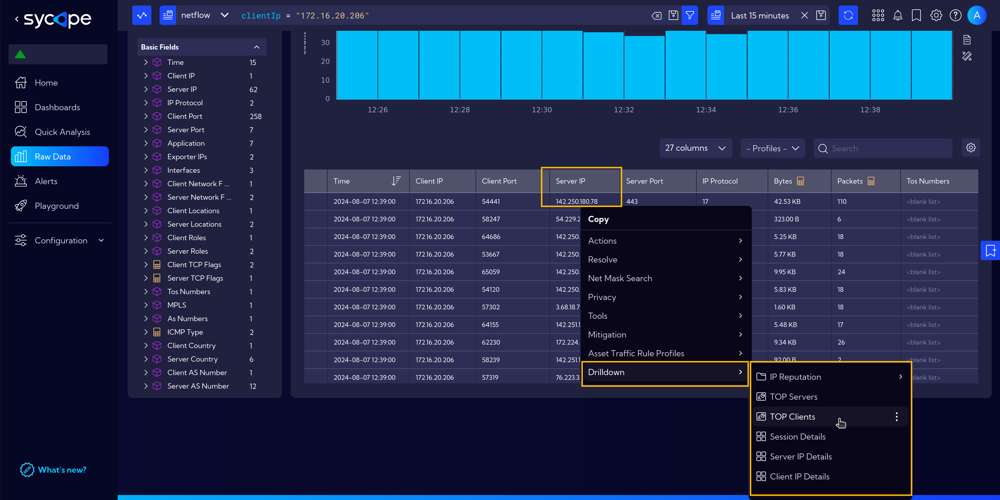

By selecting a different field, we have different drilldowns to choose from.  
In the next example, for data in the *IP Protocol* column, only the *Session Details* drilldown is available.

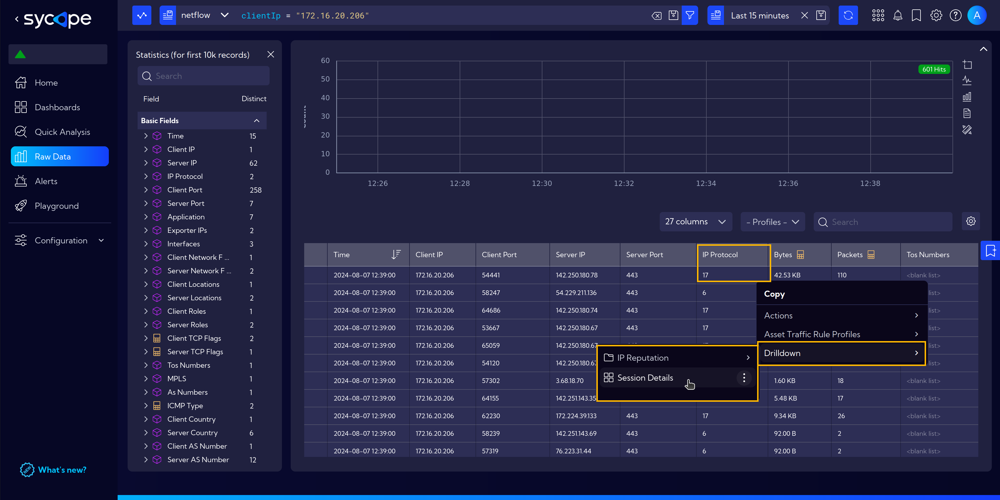

Additionally, it should be mentioned that drilldowns also come in different types. Some open an additional window with a widget, while others may direct to subsequent dashboards.

Returning to the example of the drilldown for the *Server IP* column. When we select the *TOP Clients* drilldown, a popup window with the widget's content will appear.

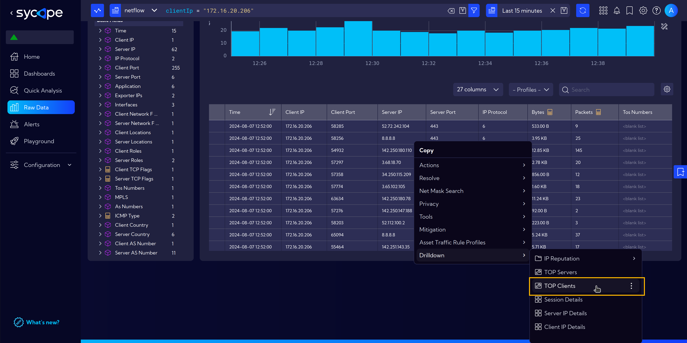

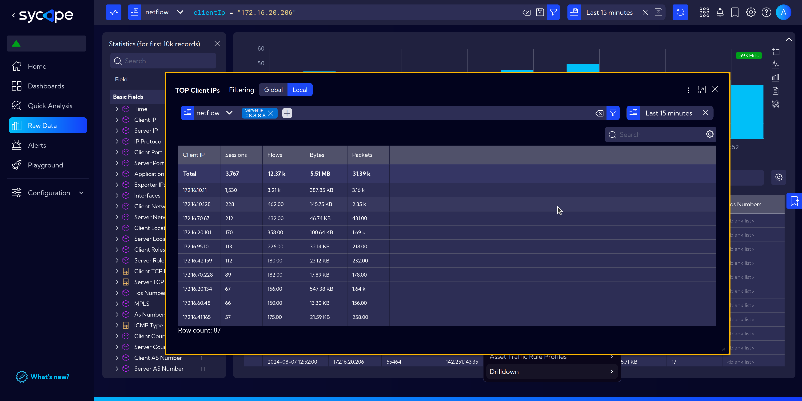

After selecting the *Server IP Details* drilldown, we will navigate to the corresponding dashboard.

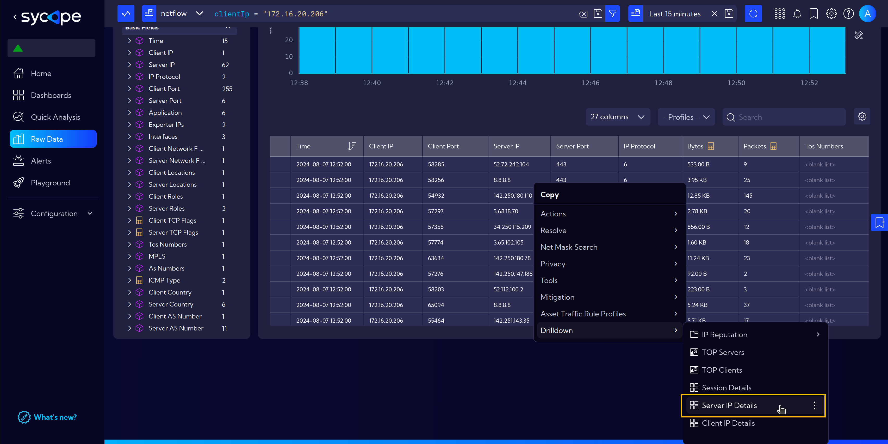

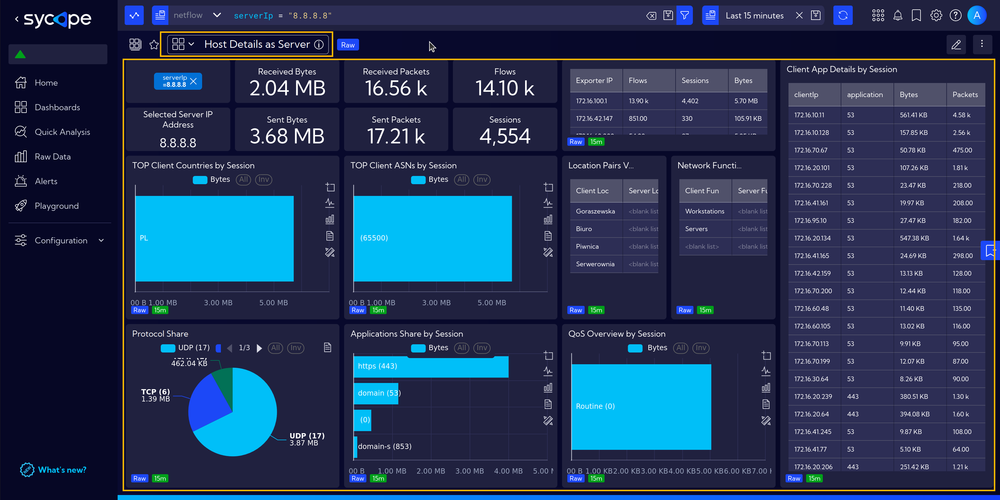

## Not Enough Data

The **Not Enough Data** notification appears in **`[Dashboards]`** or **`[Raw Data]`** views when there is insufficient data to generate full information for widgets within the selected time range.

For example, in the case below, we selected the time range from July 1 to July 31, 2024. The system is unable to display data for this period because, according to our current [Data Retention](/Installation-Guide/Quick-Setup#data-retention) settings, this data is no longer stored.

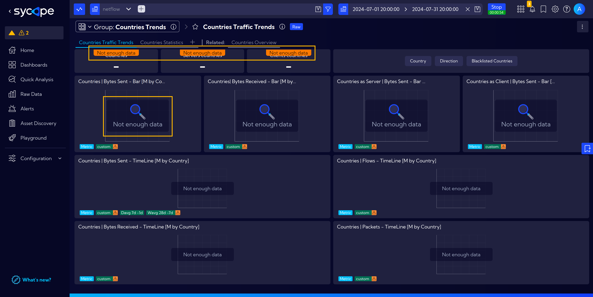

This is not the only case when such a notification is displayed.  
Another instance, shown below, more subtly indicates that we do not have all the necessary data to fully present the required information.  

The warning triangle icon indicates that we also lack sufficient data for the weekly baseline. When hovering the cursor over the icon, detailed information is displayed.

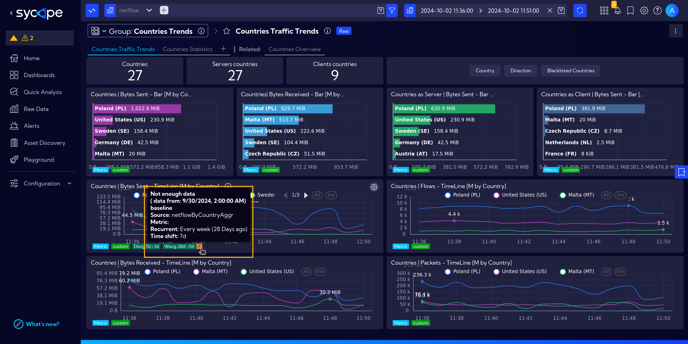

