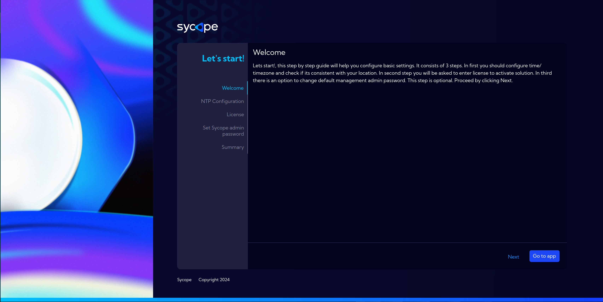
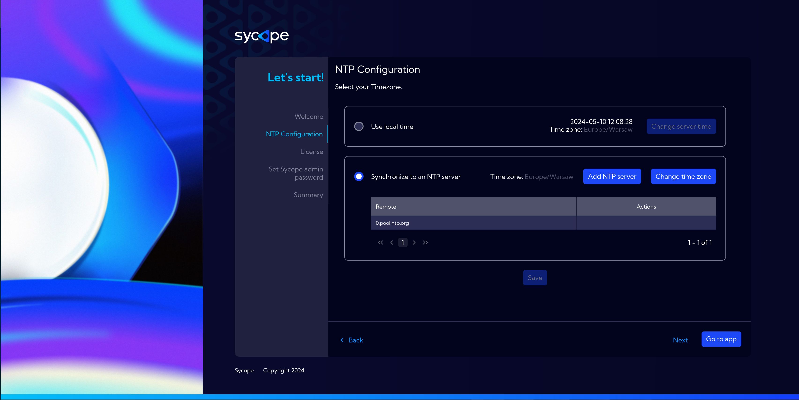
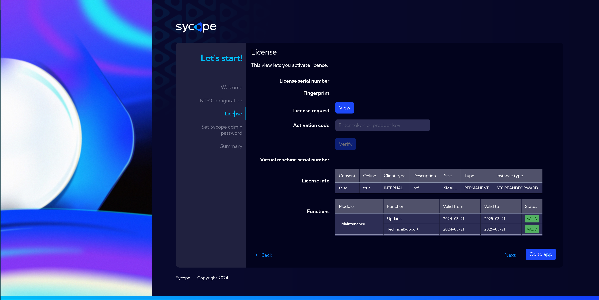
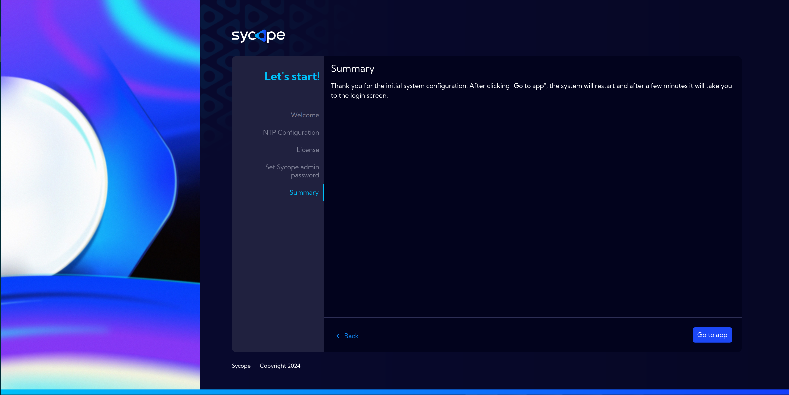

# Let's Start

After completing all previous steps, if the configuration has been done correctly, you can log into the System using a web browser. 

:::info
The **Sycope** default password and username for the **www interface**:
**user:** admin
**password:** qwerty
:::

:::danger
**It is highly recommended to change the default password !!!**
:::

In case of a fresh system after installation, the Sycope application is in an unactivated state. After launching it and logging in, a **Let's Start** form will appear.

## **Welcome**  

The ***Let's Start*** screen appears upon the first login to the machine and is used to fill in basic system options. The minimum requirement is to fill in the [license information4*2#license). The completion of other information is optional but recommended for smooth system operation.

## **NTP Configuration**  

On this screen, we select the appropriate time zone for the system's operation, which is important for scheduling various tasks within the system.  

Remember to save changes!

## **License**  

License activation is the minimum requirement for system startup.  
There are two activation options: automatic and manual. 

- Auto
    - Quick and Easy
    - Requires online connection to Sycope's License Server via https://updates.sycope.com
- Manual
    - Generate license request and complete **Company ID** and **License ID** fields
    - Suitable for offline environments

After activation, you can proceed to the application via `Go to app` button, which brings us to the next section [Quick Setup](/Installation-Guide/Quick-Setup).

### Automatic process

The automatic activation process can be executed after the **first** initial installation of the system. In this method, the process of entering company data, generating a request, activating on portal.sycope.com and uploading a license is done automatically in the background.

In order to be able to activate the System in this mode, the following conditions must be met:

- You must have the **License serial number** and the **Company ID** - you will get them from the Sycope support
- the server on which you install the Sycope system must have **Internet** access on **port 443** to the **updates.sycope.com** domain

:::caution

1. The process is **<u>one-time</u>** - once the ID pair is used, you will not be able to use it again. The appropriate message "License already activated" will pop up.
2. Renewal of licenses is possible **<u>only</u>** through a **manual process**.
3. Automatic activation does not allow uploading licenses as the machine already has one.
4. Automatic and manual activation processes are interrelated. This means that starting the license activation process in Manual mode and then interrupting it and trying to start the Automatic process may block it and you will have to start the Manual activation from the beginning.

:::

### Manual process

To activate the Sycope system in this mode, follow the steps below:

1. Log in to the **Sycope Portal** https://portal.sycope.com and check if you have an active **template** where you can make an upload license request.

2. Click the **Required information to create license request** icon, then check and save the information displayed in the **Company info** window

3. Using a **web browser**, log in to the installed **Sycope** system to be activated.

:::info

The **Sycope** default password and username for the **www interface**:

**user:** admin

**password:** qwerty

:::

:::danger

**It is highly recommended to change the default password !!!**

:::

4. Generate a License request. To do this, go to the **License tab**, click **Generate** and fill out the form with exactly the same information as the Company info in the **Sycope Portal**. After entering the information, click **Generate** on the form and copy the generated **License request**.

:::caution

The information entered in the **License request** form **<u>must be</u>** identical to that in the **Company info** form on the **Sycope Portal**. Any change or mistake will result in the rejection of the request. If the **License request** was **rejected**, correct the data and renew the **License request** by clicking the **Renew** button.

:::

:::caution

The **Renew license dialogue** deletes the current license key and generates a new license request for a new serial number. Please remember that a unique serial number is created for each license request and cannot be used in the license renewal process.

:::

5. Go to the **Sycope Portal** again, click the **Upload license request** icon and paste in the contents of the **License request.** Then click **Send**. A **wait_for_admin** status will appear next to the license. 

6. When the **license request** is approved by the Sycope Team, the license status on the Sycope Portal will change to **activated**. Click the **Activation token** icon and save the contents of the window to the clipboard.

7. Go to the **web browser** window and log back into the **Sycope** system. Go to the **License tab**, paste the **Activation token** into the **Activation Code field** and click **Verify**. If everything is done correctly, a **License activated successfully** message will appear.

   

   

   

   

8. Go to the system by clicking the **Go to app** button. The **Sycope** system is ready for use.

:::caution

After activation, the System needs about 15 minutes to start collecting data.

:::

## **Tenant configuration**  

These options are significant if this Sycope installation is intended to operate as a tenant in a Multitenancy system.  
More information on this topic can be found at [Multitenancy](/Multitenancy) and [Starting Instances and Connection to Master](/Multitenancy#starting-instances-and-connection-to-master).

## **Set Sycope admin password**

Changing the password for the system administrator.

## **Summary**

Thank you, that's all. Proceed to the system by clicking the `Go to app` button, which brings us to the next section [Quick Setup](/Installation-Guide/Quick-Setup).
