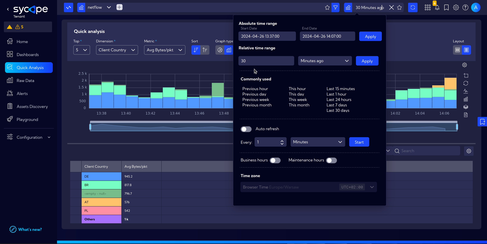
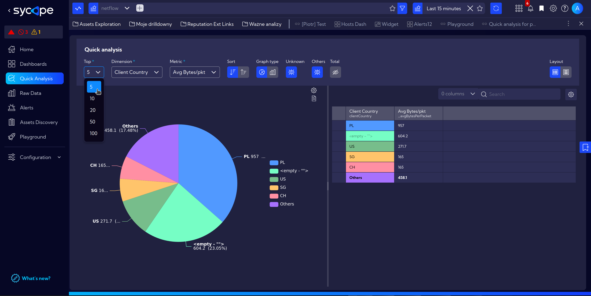
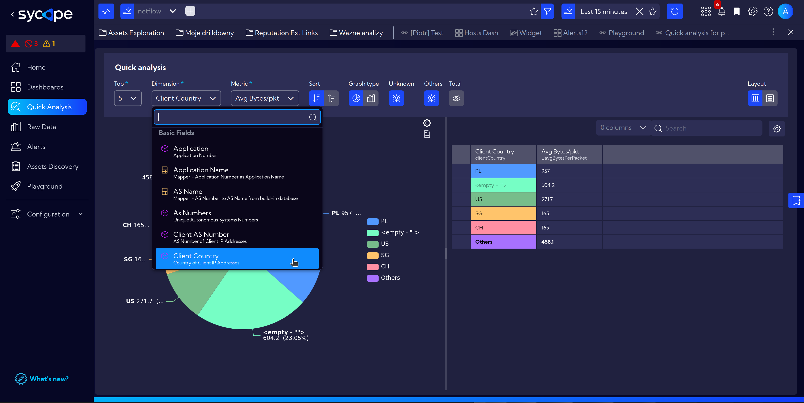
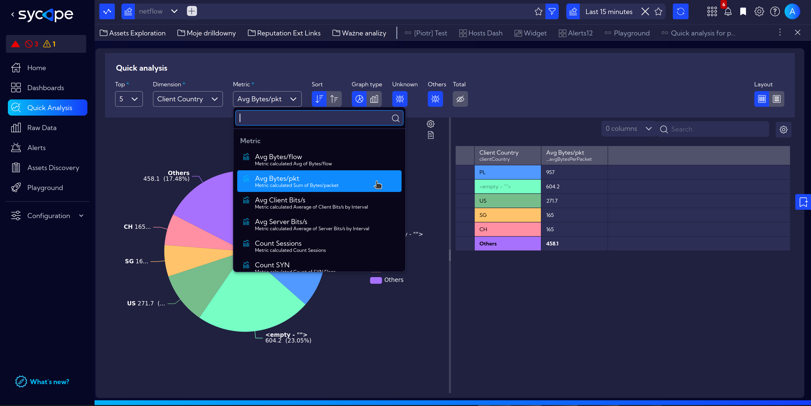
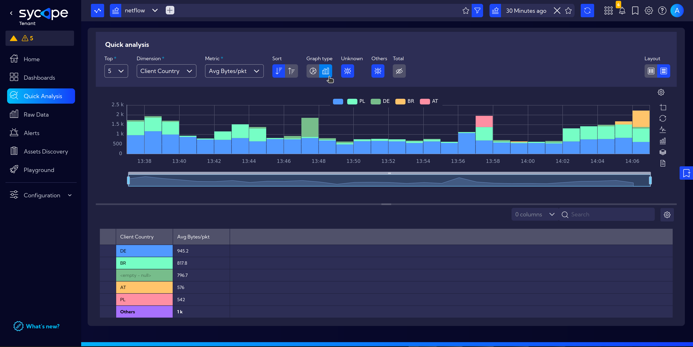
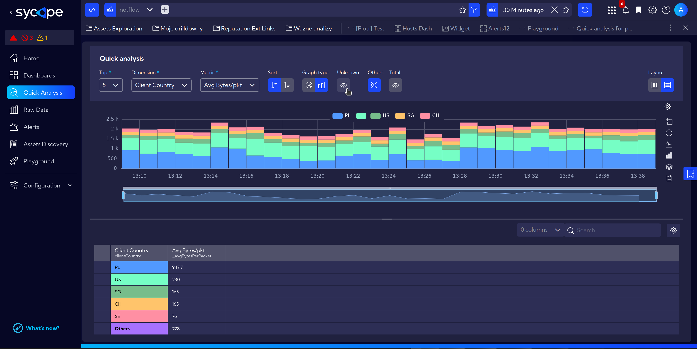
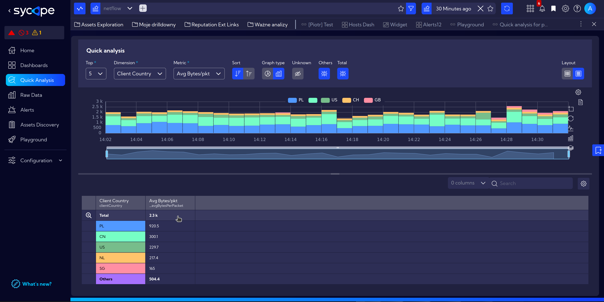
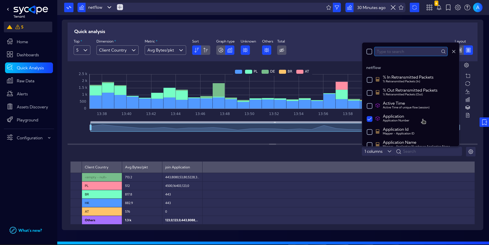

# Quick Analysis

**Quick Analysis** is a tool for quickly browsing and visualizing data in a simplified manner when we need specific information but don't know where to find it in the system, or when we don't have time to create separate Dashboards or Widgets.  
It offers simplified functions similar to browsing [Raw Data](/User-Guide/Raw-Data) or using [Playground](/User-Guide/Playground).

## Usage Example

In this simple case, we would like to check the average packet size in bytes for the top locations of clients by country with which our system communicates.

Navigate to `[Menu > Quick Analysis]`.  

The **Top Bar** in this view is fully functional. You can select the source stream and time range.  
In this case, we are interested in a 30-minute time interval.

In the **Quick Analysis** toolbar, select the necessary information from the available options.
- **Top** - show selected number of top results

- **Dimension** - select a Field or Measure, in this case select ***Client Country***

- **Metric** - select a Metric: ***AvgBytes/pkt***

- **Sort** - choose between ***Descending*** or ***Ascending***

- **Graph Type** - ***Agregate*** or ***Show in time***

- **Unknown** - choose wether to show or hide unlabelled data

- **Others** - show or hide ***Others*** information, in our case sum of ***AvgBytes/pkt*** from outside of the Top 5 results

- **Total** - show or hide 

- **Layout** - select Horizontal or Vertical ensuring clear and transparent data visualization

:::note
Additionally, it should be noted that we have the choice of displayed columns (dropdown menu `Columns`), therefore, we can include other necessary information in our view, such as the port numbers of running applications.

:::

## Saving as a Bookmark

If we intend to revisit this view frequently, we can add it to bookmarks by clicking on the icon on the right side of the page. More on [Bookmarks](/User-Guide/Configuration/Shortcuts#adding-new-bookmark).
