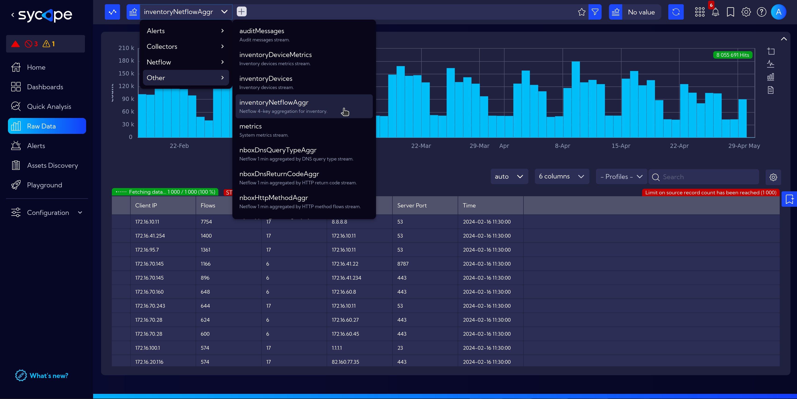
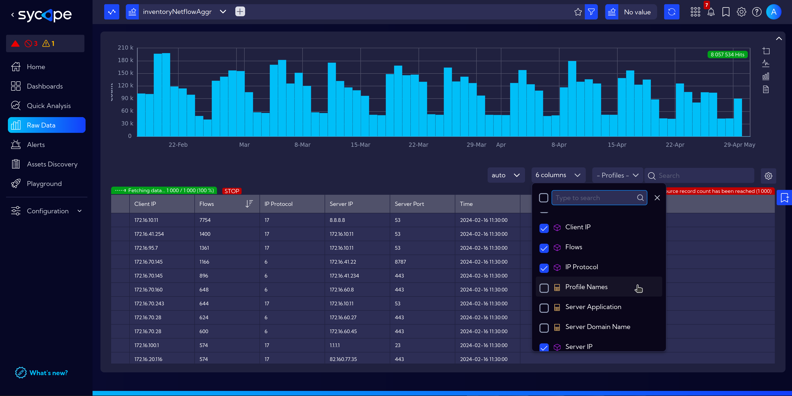
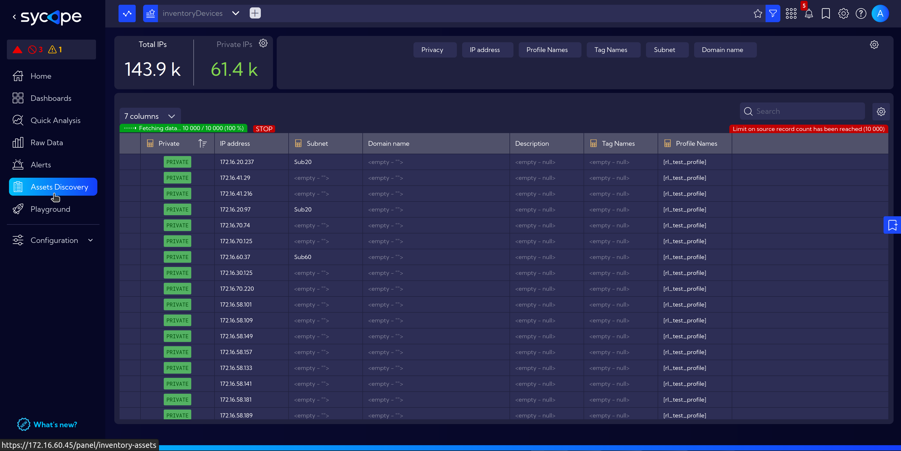
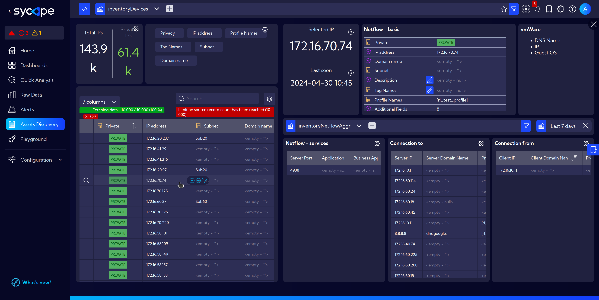
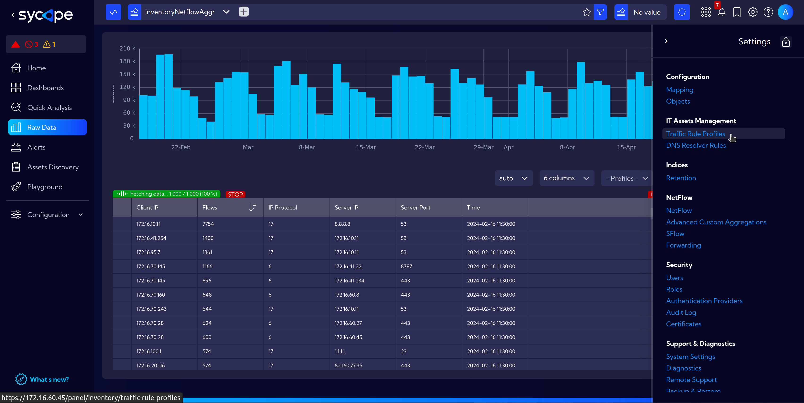
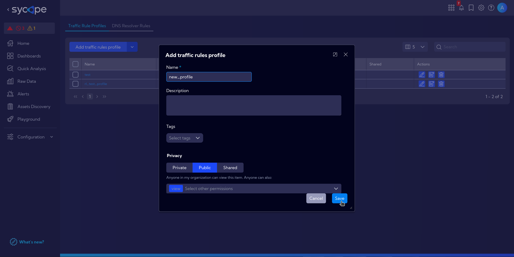
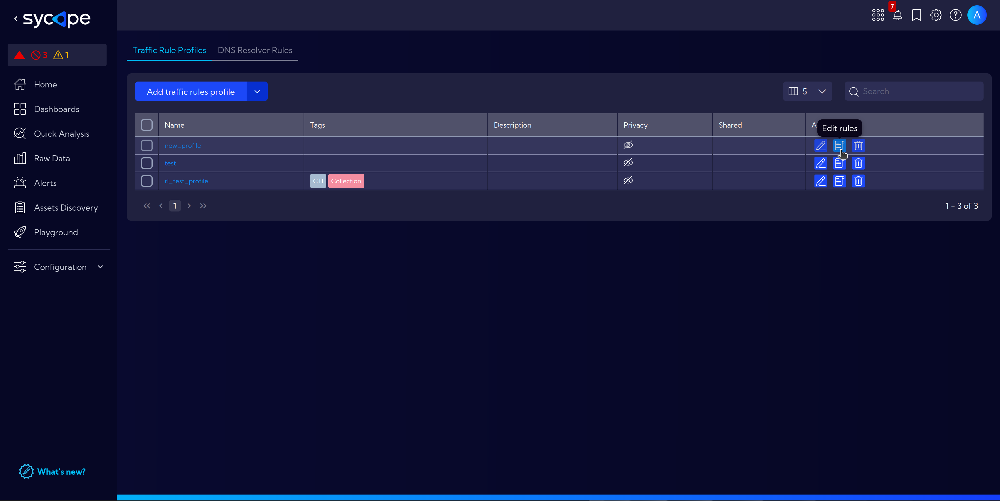
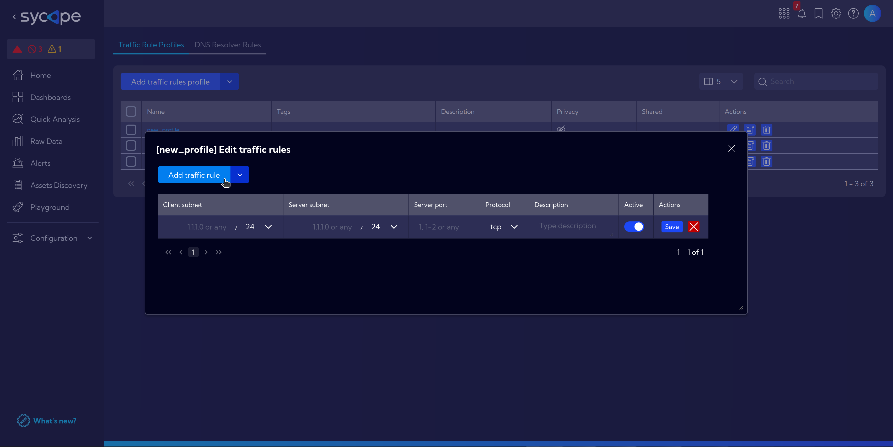

# Asset Discovery 

Asset Discovery is an independent module created to facilitate inventory management, focusing on devices, their usage, the connections between them and to/from the external hosts.  
It fulfills diverse requirements including asset tracking, monitoring usage, and ensuring accountability, all aimed at ***optimizing resource utilization*** and managing user activities.

Example application may be the assessment of the expanded company's structure and functionalities.
This involves examining the network's scale, available resources, operational aspects, and communication patterns. The aim is to reduce costs by optimizing licenses, consolidating services and hardware, and distributing expenses across different departments within the company.

## Netflow Streams

Asset Discovery to facilitate work utilizes three new Netflow streams: **inventoryDevices**, **inventoryDevicesMetrics**, and **inventoryNetflowAggr**.

In the **Top bar** under `[Menu > Raw Data]`, navigate to `netflow > Other` and select the appropriate stream.

- **inventoryDevices** 
    - Displays devices on the local network and their communication partners.
        - Differentiate between `PUBLIC` and `PRIVATE` traffic - filtering out unnecessary flows.

- **inventoryDevicesMetrics**
    - Auxiliary stream for efficiently capturing information about which devices were active and when.

- **inventoryNetflowAggr**
    - Primary stream for tracking connections between hosts (IP).
    - Limited amount of information for ease of navigation and search.
        - Columns visibility (adjustable in dropdown menu) limited to: Client IP, Flows, IP Protocol, Server IP, Server Port, Time
        
    - Data aggregations every 15 minutes, 1-hour and 1-day intervals enable efficient asset management.

## Usage Overview

In this brief overview of the module, we will focus on the functionality that serves as an entry point for further asset analysis.

- Navigate to `[Menu > Asset Discovery]`.

- Click on the selected host to open a detailed view, which presents:
    - **Selected IP** and **Last seen** information.
    - **Netflow - basic** - more detailed information.
    - **Top Bar** with selected ***inventoryNetflowAggr*** stream and, if selected, additional filters along with the customizable ***Time interval***
    - The sections below present:
        - **Netflow - services** - Services running on the host.
        - **Connection to** - List of connections from the host.
        - **Connection from** - List of connections to the host.

## Settings

To fully leverage the capabilities of the **Asset Discovery** module, it's essential to input basic information about the network's operations.

:::info
Navigate to [**`[Settings > IT Asset Discovery]`**](/User-Guide/Settings/IT-Asset-Discovery) for more information about Asset Discovery settings.
:::

## Examples

:::info
To check useful examples from Asset Discovery, go to [Asset Discovery Examples](/Examples/Asset-Discovery) section.
:::

<!-- ## Setting Profiles and Rules

To fully leverage the capabilities of the **Asset Discovery** module, it's essential to input basic information about the network's operations.

Creating profiles serves the purpose of grouping devices under a single label, where, for example, one service utilizes multiple devices: backend, frontend, load balancer, database, multi-node app.

- Navigate to **[Settings > IT Assets Management > Traffic Rule Profiles]**.

- Create a profile with `Add traffic rule profile` button, enter a name and click on `Save`.

- Next, click on **Edit Rules**.

- And then **Add Traffic Rule**, where you will need to fill in all the information about the company's network applications according to the company's documentation such as hosts addresses, ports, protocols and optionally short description for informative purposes.

 -->
