# Lookups

This menu **[Settings > Configuration > Mapping > Lookups]** can be used to create custom Lookups that may be applied in different places in the system.

Lookup is querying an additional database , CSV files, or it‘s own database with the specified value in order to map it or complete the data in a netflow session or alert with additional information. **Lookups** create their own fields in the system

The **Lookups** created in the system are listed in a table with the following columns:

**Name** - unique lookup name

**Status** - lookup status Active/Inactive

**Type** - Lookup type. There are five predefined types of lookups in the system: Asn, Country, CSV file, CSV file subnet, SNMP Interface

**Privacy** - privacy status icon

**Created By** - the name of the user who created the lookup

**Modified By** - the name of the user who last modified the lookup

**Modification Time** - last modification time

**Shared** - users who shared the object

**Tags** - assigned tags

**Action** 

- Edit - edit Lookup
- Duplicate -  creating an editable copy of the selected
- Delete - delete Lookup

:::info

The **Action** button does not appear for system preinstalled objects.

:::

---

As it was written above, the system implements six predefined types of lookups, which are listed in the table below.

| Lookup type    | Input keys | Output keys                                                | Description                                                  |
| :------------- | :--------- | :--------------------------------------------------------- | ------------------------------------------------------------ |
| Asn            | ip         | as.number, as.org                                          | A system lookup for mapping IP Addresses to AS Names and AS Numbers. |
| Compound       |            |                                                            | A lookup that contains data from other lookups.              |
| Country        | ip         | continent.code, continent.name, country.name, country.code | A system lookup for mapping IP Addresses to Country.         |
| CSV file       |            |                                                            | A lookup built on the basis of the content of the.csv file.  |
| SNMP Interface |            |                                                            | A system lookup based on SNMP poller designed for mapping Exporter IP and Exporter Interface to Interface Name, Interface Speed, Interface Description, Device Name, Device Description, Device Location. |
| Subnet         |            |                                                            | A lookup based on CSV and designed for grouping CIDR.        |

---

Pressing the **New lookup** button starts the wizard to create a **Lookup**.

For example, to create CSV file type **Lookup**, perform the following steps:

- In the first window, specify the type (see table above)
- Enter a name for the Lookup
- Data file

  - Edit csv button 
    - File preview
    - Specify Delimeter, Quote Chart and Escape character (Default values are [comma, quotation mark, quotation mark]
    - Choose the previously prepared CSV file and load it. Then confirm the operation by pressing the Apply file button.

---

**Privacy** - assigning privileges 

- **Private** - accessible to the owner
- **Public** - visible to all, but You can grant permission:
  - **DELETE**
  - **EDIT**
- Shared - accessible to one or more selected **User roles**. Available privileges are:
  - **Delete**
  - **Edit**
  - **View**

---

# Country and asn Lookup

The lookup which can be used to search data in the "GeoLite2-ASN.mmdb" and  "GeoLite2-Country.mmdb" files.
The lookup enables to search of dates from "BGP Autonomous System" ("GeoLite2-ASN.mmdb") and "Country" ("GeoLite2-Country.mmdb") by ip key.

### Input keys

| Key name | Type      | Description |
| -------- | --------- | ----------- |
| IP       | IpAddress |             |

### Output keys for Country

| Key name                 | Type            | Description                           |
| ------------------------ | --------------- | ------------------------------------- |
| continent                | Continent       | Full Continent object (MaxMind)       |
| continent.code           | String          | Continent code                        |
| continent.name           | String          | Continent full name                   |
| country                  | Country         | Full Country object (MaxMind)         |
| country.name             | String          | Country full name                     |
| country.code             | String          | Country code                          |
| registered.country       | Country         | ull Country object (MaxMind)          |
| registered.country.code  | String          |                                       |
| registered.country.name  | String          |                                       |
| represented.country      | Country         | ull Country object (MaxMind)          |
| represented.country.name | String          |                                       |
| represented.country.code | String          |                                       |
| full.response            | CountryResponse | Full CountryResponse object (MaxMind) |

### Output keys for ASN

| Key name      | Type        | Description                                            |
| ------------- | ----------- | ------------------------------------------------------ |
| as.number     | int         | AS Number                                              |
| as.org        | String      | The name of the organization assigned to the AS number |
| full.response | AsnResponse | Full CountryResponse object (AsnResponse)              |

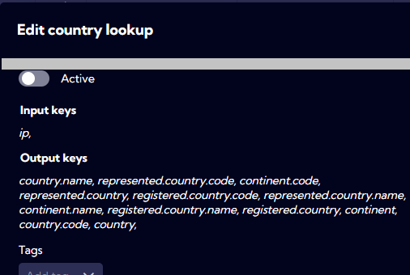

***

# CSV File Lookup

The lookup is created with a given csv file as a data source for search. 

### Name

The lookup name.

### Description

The description of the lookup.

### Edit file

In the csv file, the data will be searched by keys.

Adding the file, you must set four parameters:

| Param name    | Description                                            |
| ------------- | ------------------------------------------------------ |
| Delimiter     | Data fields delimiter file row.                        |
| QueoteChar    | The char which is a prefix and suffix for text values. |
| EscapeChar    | The char which is not interpreted in text values.      |
| File (button) | Chose the csv file                                     |

### Active

**Switched off** - the lookup is not available.

**Switched on** - the lookup is available.

### Tags

Mark a lookup with a specified tag.

### Input keys

| Key name                   | Type | Description |
| -------------------------- | ---- | ----------- |
| the first column of a file |      |             |

### Output keys

| Key name              | Type | Description |
| --------------------- | ---- | ----------- |
| 2..N column of a file |      |             |

***

# Compound Lookup

Add/Edit a new lookup of type compound, which searches by key(s) executing a sequence of one or many lookups.
The data of the first key found is returned, so the order of added lookups is important. 

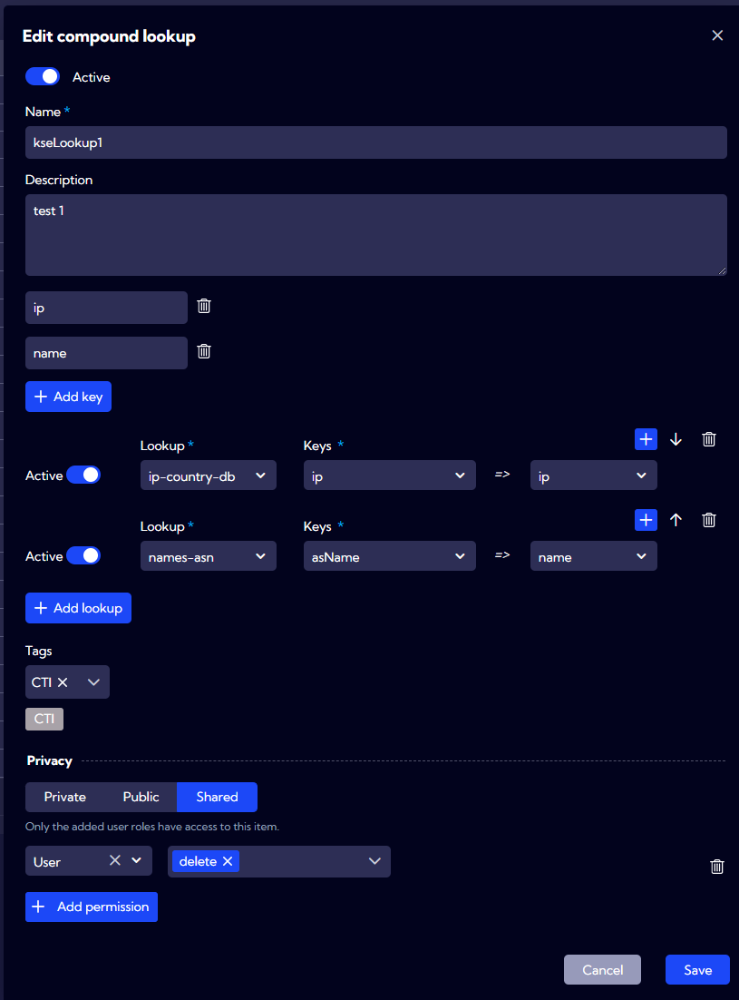

### Active

**Switched off** - the lookup is not available.

**Switched on** - the lookup is available.

### Name

The lookup name.

### Description

The description of the lookup.

### Add key

The list of keys (columns) of the lookup to search by.

### Add lookup

Add lookup data sources for search. Can be one or more lookups. For each source (lookup), we must define a mapping between source columns and current lookup keys (columns). The flag "Active" set to "off" means that the lookup will not be taken to account in the search execution sequence.

### Tags

Mark a lookup with specified tags.

***Example***

We want to create a lookup "ColorsAndBirds" with a content of data from two "simple" lookup files, "Colors" and "Birds". 

The content of the lookup csv file "Colors":

| ipColor      | colorName | flowInBytes | attrib |
| ------------ | --------- | ----------- | ------ |
| 172.169.34.5 | Yellow    | 45643       | a-b-b  |
| 192.168.0.23 | Green     | 45643       | b-x    |
| 87.98.0.23   | Blue      | 45643       | d-a-b  |

The content of the lookup csv file "Birds":

| ipBird        | nameB       | sourceChannel |
| ------------- | ----------- | ------------- |
| 198.132.45.46 | Sparrow     | TXR30         |
| 10.0.0.1      | Eagle       | IPP28         |
| 192.168.12.23 | Raven       | INTERNAL      |
| 10.0.1.2      | Nightingale | INTERNAL      |

The lookup will have two keys "ip" and "name. We identified data (values) for those columns in "Colors" and "Birds" under the different column names, so we need a mapping between a source column name and a lookup column.
The mapping is optional, a key is not mapped in a specified lookup, then the search by the key for that lookup will be ignored.

Mapping:

| source.column    | "ColorsAndBirds" key |
| ---------------- | -------------------- |
| Colors.ipColor   | ip                   |
| Colors.colorName | name                 |
| Birds.ipBird     | ip                   |
| Birds.nameB      | name                 |

The following compound lookup definition: 

creates a compound lookup "ColorsAndBirds" with the keys->values to search by:

| ip            | name        | othe columns... |
| ------------- | ----------- | --------------- |
| 172.169.34.5  | Yellow      | Colors.*        |
| 192.168.0.23  | Green       | Colors.*        |
| 87.98.0.23    | Blue        | Colors.*        |
| 198.132.45.46 | Sparrow     | Birds.*         |
| 10.0.0.1      | Eagle       | Birds.*         |
| 192.168.12.23 | Raven       | Birds.*         |
| 10.0.1.2      | Nightingale | Birds.*         |

so, if for example, the lookup key is "192.168.0.23","Green", then we get data from the corresponding row in Colors lookup.

***

# SNMP Interface Lookup:

The lookup with a data source from SNMP

### Name

The lookup name.

### Description

The description of the lookup.

### Polling settings

| Parameter                              | T Description                                                |
| -------------------------------------- | ------------------------------------------------------------ |
| Poll unresolved interfaces data every  | Number of query repeats in case no results were returned.    |
| Refresh existing interfaces data every | The refresh interval of existing data.                       |
| Default credentials EDED               | For each version of SNMP (v1, v2c, and v3), we can set security credentials params. |

### Input keys

| Key name    | Type            | Description                                  |
| ----------- | --------------- | -------------------------------------------- |
| exporterInt | List of Strings | The interfaces SNMP ID's taken from metrics. |
| exporterIp  | String          | The IP address of the host/exporter.         |

### Output keys

| Key name | Type   | Description                          |
| -------- | ------ | ------------------------------------ |
| if.name  | String | The name of an interface.            |
| if.speed | int    | The interface speed in bits per sec. |
| if.desc  | String | The interface description.           |
| dev.name | String | The name of a device.                |
| dev.desc | String | The Device description.              |
| dev.loc  | String | The device location.                 |

***

# Subnet Lookup:

Lookup checking whether an IP address belongs to a subnet. The data is loaded from a CSV file where the first column contains the subnet definitions.

### Name

The lookup name.

## Description

The description of the lookup.

### Mode

| Parameter   | Description                                                  |
| ----------- | ------------------------------------------------------------ |
| overlapping | The subnets can be comprised in itself and the result is a list of all matched to the IP. The list can be empty. |
| proper      | The subnets can't be comprised, and the result is exactly one found subnet or null. |

## Input keys

| Key name                   | Type                      | Description                                              |
| -------------------------- | ------------------------- | -------------------------------------------------------- |
| the first column of a file | Mixed (IpAddress, String) | Requires to be a valid representation of the IP address. |

### Output keys

The output keys depend on the columns in the input CSV file.

| Key name | Type | Description |
| -------- | ---- | ----------- |

---

# Lookup examples

## CSV File Lookup example

1. Go to **[Settings > Configuration > Mapping > Lookups]** and click `Add lookup`

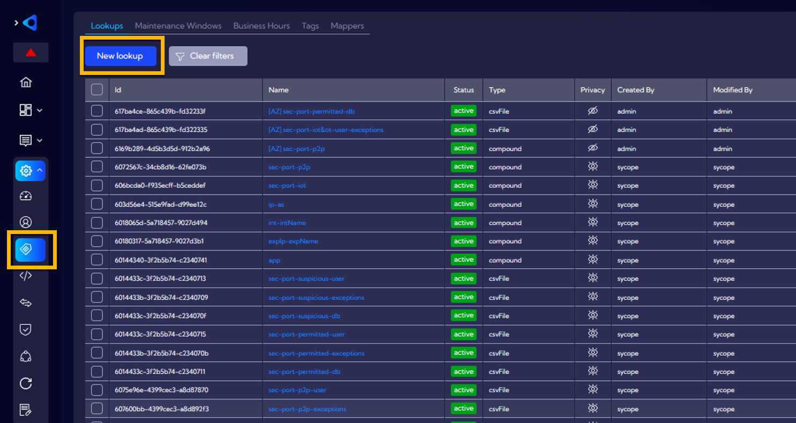

2. Choose the lookup type

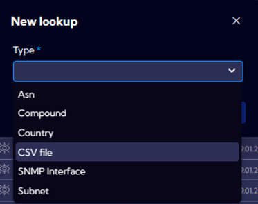

3. Complete the configuration settings for a new lookup

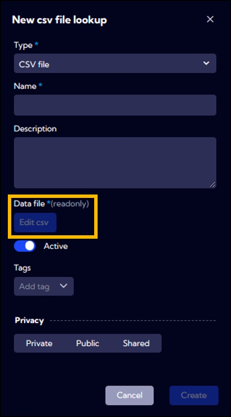

| **Parameter Name** | **Description**                                              |
| ------------------ | ------------------------------------------------------------ |
| **Name**           | Lookup name                                                  |
| **Description**    | Lookup description                                           |
| **Data File**      | Place to select the .csv file to import data. Once the CSV  File lookup is created, you can view its entries by pressing the „Edit csv” button. |
| **Active**         | Enabled/Disabled rule                                        |
| **Tags**           | Tags assigned to  the lookup                                 |
| **Privacy**        | Object access permission:   - Private (Only  the creator can view this item)   - Public  (Anyone in  my organization can view this item, Anyone can also Delete |

4. Choose a csv file

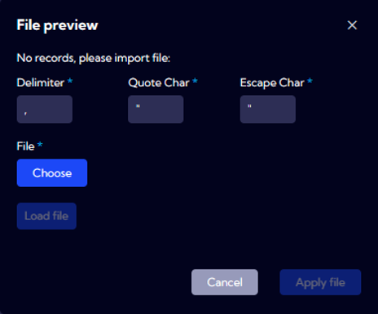

5. Load a csv file

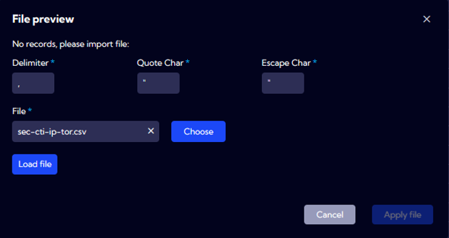

6. Choose a data type for imported data

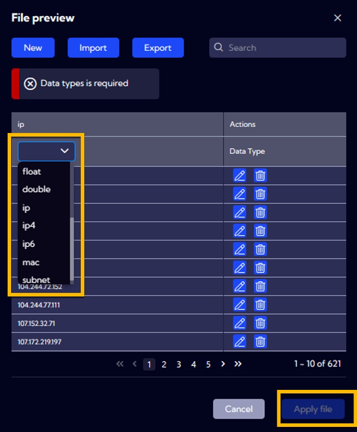

7. Review lookup settings and click **Save**

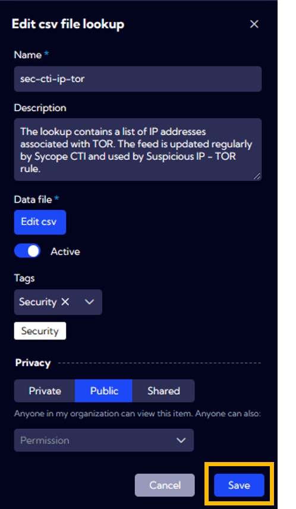

8. Usage the lookup in a filter

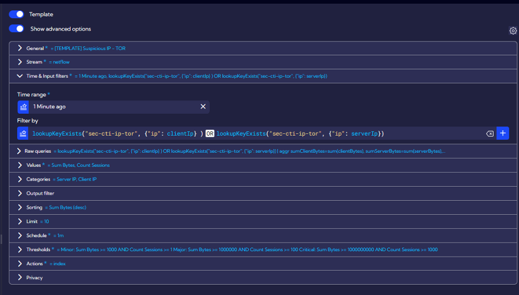

---

## Subnet Lookup example

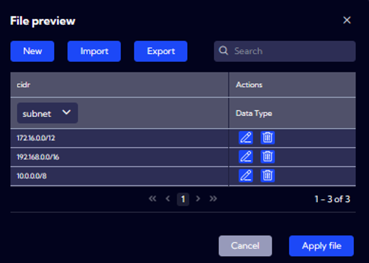

---

## SNMP interface Lookup example

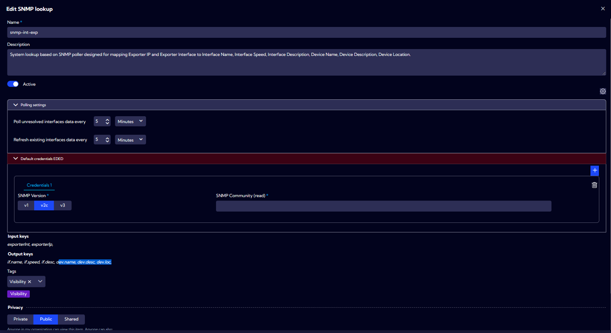

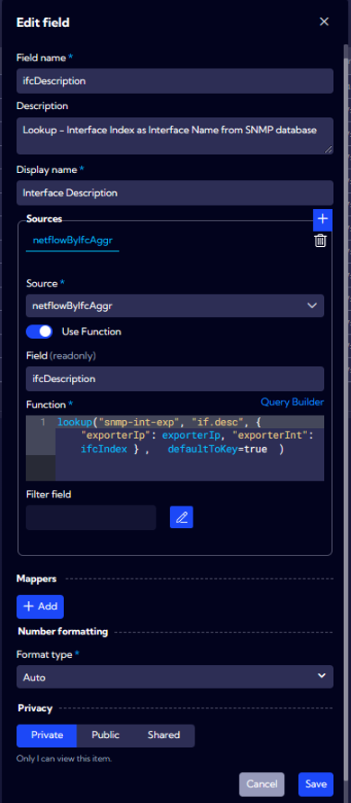

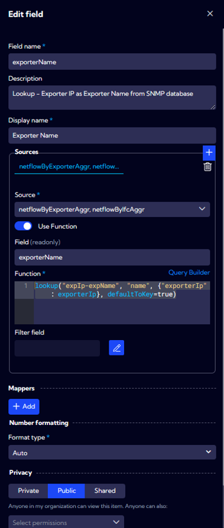
