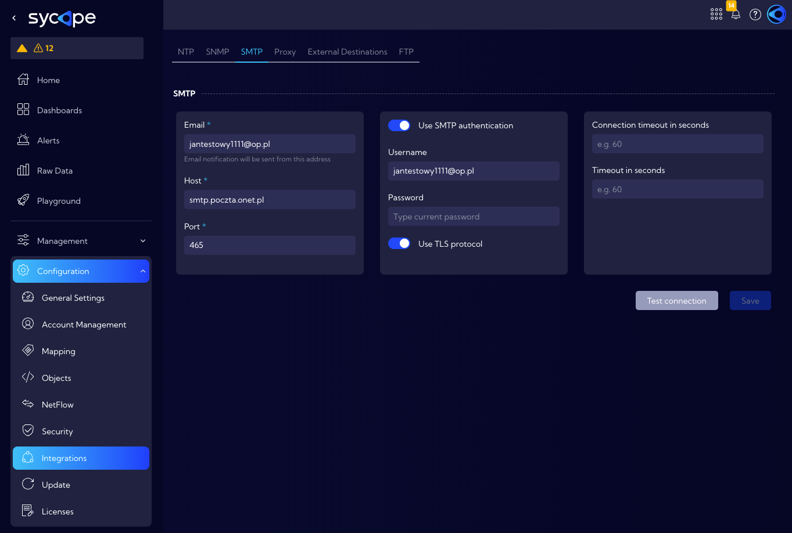
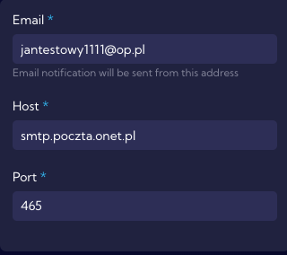
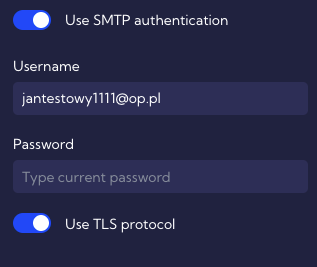
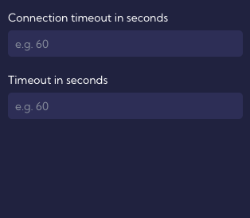
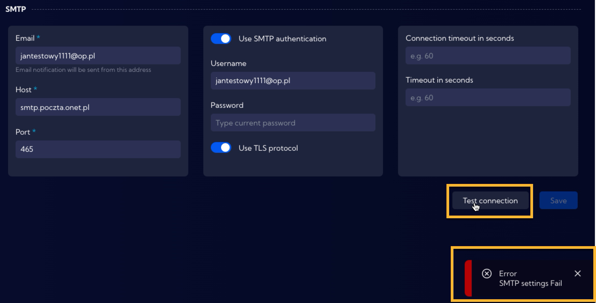

# SMPT

The **[Settings > General > Integrations > SMPT]** menu can be used to configure SMTP server connection parameters.

The configuration of SMPT functionality is divided into three sections which are described below.

### First section

In order to configure the SMTP server, you need to fill in a form consisting of the following fields:

- **Email** - email from which notifications will be sent
- **Host** -  host name
- **Port**  - service port

### Second section

In this section, security-related fields are configured. There are two switches available:

- **Use SMTP authentication** switch 
  - **Username** - user name
  - **Password** - password
- **Use TLS protocol** switch - to use **Transport Layer Security** (TLS) protocol

### Third section

In this section, fields related to the transmission process are configured. There are two fields:

- **Connection timeout in seconds** - here, you can specify the connection timeout in seconds
- **Timeout in seconds** - here, you can specify the timeout in seconds

 

### Test connection

After entering the appropriate parameters of the SMTP service, you can test the configuration by using the `Test connection` button.

