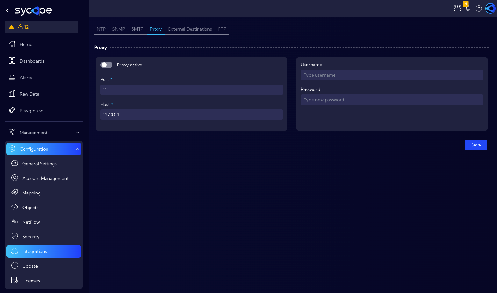

# Proxy

The **[Settings > General > Integrations > Proxy]** menu can be used to configure the proxy server parameters with which the Sycope system will be integrated.

There are the following lines:

- **Proxy active** switch - activate/deactivate proxy support 
- **Username** - proxy user name
- **Password** - proxy user password
- **Port** - service port
- **Host** - proxy server IP address

:::caution

Correct configuration of the proxy service in this menu will ensure correct communication with the **license server.**

:::

:::danger

If you use a proxy service in your network, you must exclude the https://updates.sycope.com website from it, otherwise the Sycope live update and security feed live update services will not work.

:::

