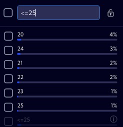
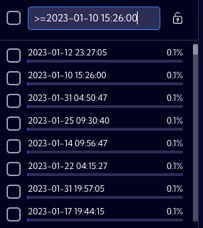
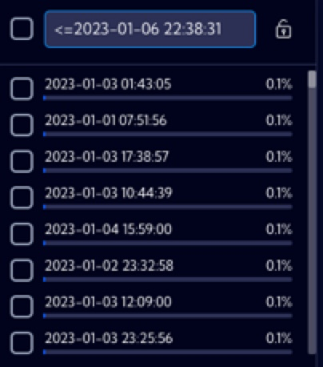
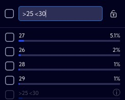

# Filtering

By using a single Filter you can also create more advanced filtration with the use of operators listed in the table below.

| Syntax            | Description                                                  | Example                                                      |
| ----------------- | ------------------------------------------------------------ | ------------------------------------------------------------ |
| `abc`;`*abc*`     | The search string is compared to every word in the field value, disregarding case sensitivity. |  |
| `abc*`            | The search string is matched by any string that begins with an `abc` string and is followed by zero or more characters of any type. |  |
| `*abc`            | The search string is matched by any string that ends with an `abc` string and is preceded by zero or more characters of any kind. |  |
| `"abc"`           | The search string is matched by a string including only the exact word or phrase enclosed within the quotation marks. |  |
| `>value`          | For numeric fields, the search string returns all records with a value greater than the specified `value`. |  |
| `>=value`         | For numeric fields, the search string returns all records with a value equal to or greater than the specified `value`. |  |
| `<value`          | For numeric fields, the search string returns all records with a value lower than the specified `value`. |  |
| `<=value`         | For numeric fields, the search string returns all records with a value equal to or lower than the specified `value`. |  |
| `>date`           | For numeric fields, the search string returns all date records with a value greater than the specified `data`. |  |
| `>=date`          | For numeric fields, the search string returns all date records with a value equal to or greater than the specified `data`. |  |
| `<date`           | For numeric fields, the search string returns all date records with a value lower than the specified `data`. |  |
| `<=date`          | For numeric fields, the search string returns all date records with a value equal to or lower than the specified `data`. |  |
| `<value1 >value2` | Combination of two values in one search. For numeric fields, the search string returns all records with a value lower than the specified `value1` **and** greater than `value2`. It works analogously for the other operators and their combinations (`<=;>=`) |  |
| `<date1 >date2`   | Combination of two date values in one search. For data value fields, the search string returns all records with a date value lower than the specified `date1` **and** greater than `date2`. It works analogously for the other operators and their combinations (`<=;>=`), |  |