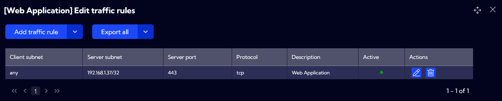
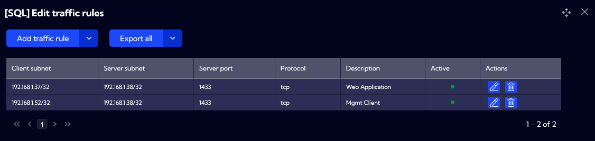
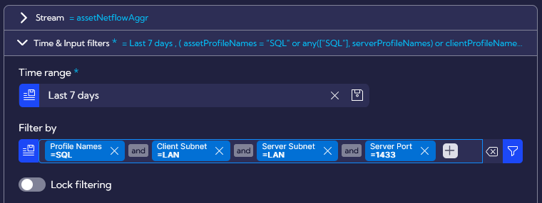
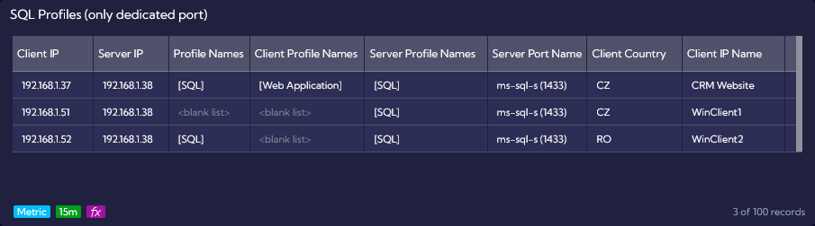
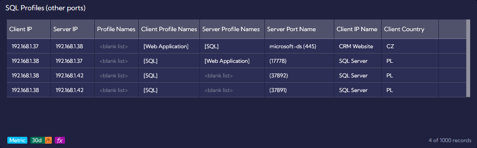

# Asset Discovery - SQL Example

**Traffic Rule Profiles** can be used to define **Client subnets** and **Server subnets** with port ranges for services. Depending on the specific use case, both fields support “any” keyword.

Using multiple profiles will also allow user to define relationships between servers, such as dependency between Web Application and Database Server. We will create such scenario below.

First, let’s create Web Application profile by going to [**`[Settings -> IT Asset Discovery -> Traffic Rule Profiles]`**](/User-Guide/Settings/IT-Asset-Discovery/Traffic-Rule-Profiles) menu. Following fields are defined:

- **Profile name**: Web Application

- **Client subnet**: “any” – allowing all IP addresses to access our Web Application

- **Server subnet**: 192.168.1.37/32 – including only one IP Address, which is our Web Application

- **Server port**: 443

- **Protocol**: tcp

- **Description**: Web Application 

Next, we want to create a second profile dedicated for dependency between Web Application and Database Server. Following fields are defined:

- **Profile name**: SQL

- **First Client subnet**: 192.168.1.37/32 – including only one IP address, which is our Web Application

- **Second Client subnet**: 192.168.1.52/32 – including only one IP address, which is Mgmt Client

- **Server subnet**: 192.168.1.38/32 – including only one IP address, which is our SQL Server

- **Server port**: 1433

- **Protocol**: tcp

- **Description**: SQL Server 

Now, we can verify how Sycope will map our profiles to different network connections, which were discovered using flow data.

Following input filters were used to create the first widget. For more information on how to create new widgets, please go to [**Widget Examples**](/Examples/Widget-Examples). 

For this widget, we are focusing only on network connections to the dedicated application port. 

We can see above that the first row contains all three matched profile columns. **Profile Names** is defined as SQL, **Client Profile Names** as Web Application and **Server Profile Names** as SQL. This is an ideal Server-to-Server scenario, where all profile names are matched and the connection is fulfilling all requirements.

There is also an unwanted connection to the Database Server, which in production environment would result in policy violation. Such matching can also trigger an alert with additional actions like sending request to ticketing system. Let’s discuss why specific fields are not populated for 192.168.1.51 and 192.168.1.52:

- **Profile Names** is matched when **Client IP**, **Server IP**, **Server port** and **Protocol** are all in line with profile definition. Values seen in NetFlow data are matching a profile: ClientIP is with Client Subnet, ServerIP is in Server Subnet, Server port is in Server port and Protocol is in Protocol.

- **Client Profile Names** is matched when **Client IP** is found in the **Server subnet** for another **Traffic Rule Profile**. Due to this approach, we are able to correctly identify dependencies between servers.

- **Server Profile Names** is matched when **Server IP** is found in **Server subnet** from **Traffic Rule Profiles**. **Server Port** is not used for **Server Profile Names** matching. When only this value is matched, it could indicate traffic on unwanted network port or unauthorized access.

To summarize, IP address 192.168.1.51 is not defined in our SQL Profile and due to that, **Profile Names** is not matching. Please remember that ***Client Profile Names*** is used for dependencies between servers, so correct **Client subnet** will not lead to correct matching for this field.

This is also the reason, why **Client Profile Names** is not matched for the connection between 192.168.1.52 and 192.168.1.38. However, we can see that **Profiles Names** is correct, because 192.168.1.52 is defined in **Client Subnet**. 

Our second widget is very similar, but the **Server port** input filter is excluding SQL port 1433. The purpose of this example is to present how the **Client Profile Names** can be matched to the **Server IP** from SQL profile.

We can see the connection between 192.168.1.38 and 192.168.1.42 on port 37892. Our Database Server is now on the Client side and such connections could indicate that there are other services apart from the database instance. 

User can use above example to verify different connections in the production environment. Depending on the use case, those could be for Server-to-Server or Client-to-Server conversations.
