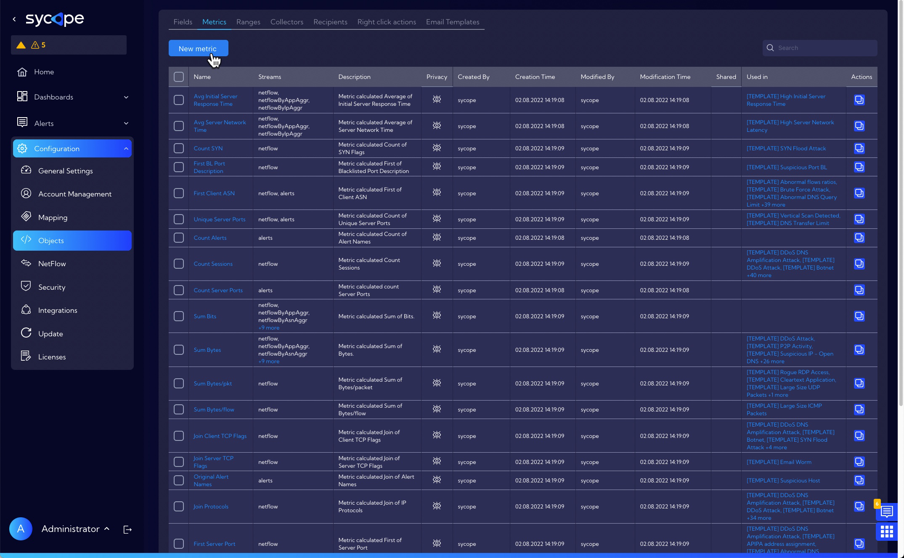
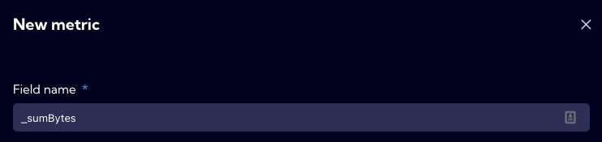
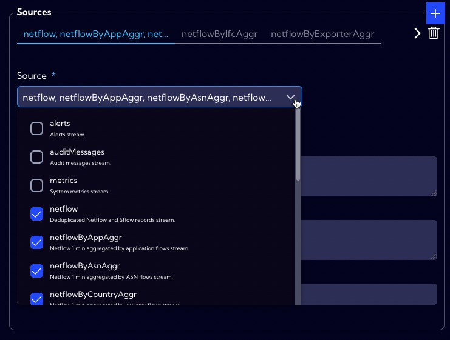
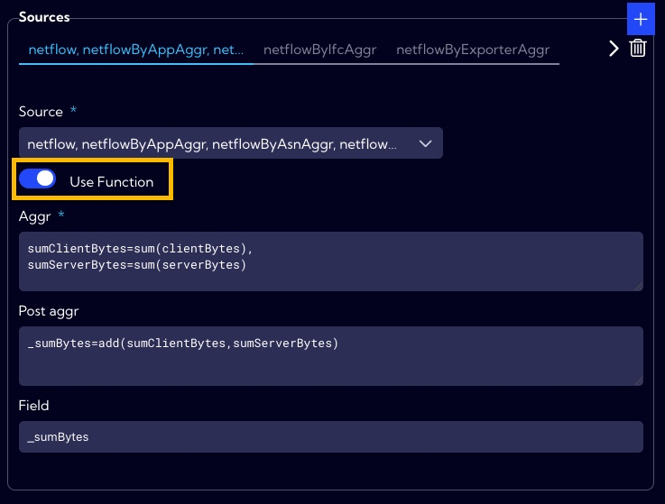
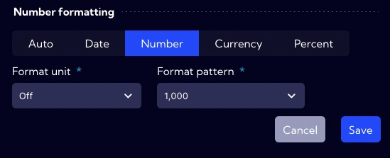
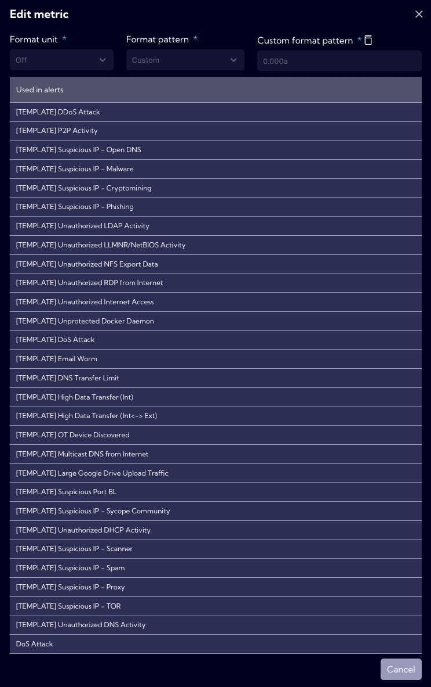

# Example of Metric creation - advanced metric - use function option

A **Metric** is a function that aggregates a given field and is used in **Widgets** and **Alerts**. Defining **Metrics** makes our work easier we can use them multiple times in different places in the system, for example, when creating a **Dashboard** composed of several **Widgets** that use the same **Metric**. Then, instead of creating the same **Metric** several times, you define the **Metric** once in metrics menu and just select it in **Widgets** without having to create and format it again. 

As an example of a metric using the **Use function** option, we will configure the **_sumBytes** metric. The components of this metric are two aggregations **sumClientBytes** and **sumServerBytes**.  A post aggregation is performed on these components as the sum of the two aggregation components **_sumBytes=add(sumClientBytes,sumServerBytes)**.

## Implementation

To create a **new metric**, go to **[Settings > Configuration > Objects > Metrics]** menu and click **Add metric** button.

The wizard for creating a new metric appears.

1. In the **Field name**, we enter the database name (NQL) of the new metric. The system adopts the following rules for creating names for metrics: we start the name of the metric with "_" then write the name of the aggregation and the name of the field. Thus, in our example, it will be _sumBytes .
   
   
2. In the **Display name**, we enter the name under which the new field will be visible in the system. In our example, the field name is **Sum Bytes**.
   
   
   
3. In the **Sources section**, we indicate in the **Source field** the stream or streams of data where there is a field that the metric will use.

  

4. We select **Use Function** and then, according to the description of the metric in the **Aggr field**, we specify two aggregations: `sumClientBytes=sum(clientBytes), sumServerBytes=sum(serverBytes)`.
   

5. In the **Post aggr** field, we enter the phrase:

   `_sumBytes=add(sumClientBytes,sumServerBytes)`.
   
   In the **Field** we enter the same name as in the **Field name**.

6. In the **Number formatting section**, we specify how to format the data in our new field. 
   
   
   
7. In the **Privacy** section, you can set permissions for the created item. If you want it to be visible to all users, you should set the Public option.
   
   
   
8. If all the necessary fields of the form have been correctly completed press **Save** button to save the created object.

At the bottom of the object creation form, after correct configuration, we can see in which elements of the system our newly created object is used.

