# Multitenancy

## General Information about the Sycope Multitenancy System

Multitenancy is an architecture of the Sycope system that allows overseeing multiple independent instances (Tenants) of the local Sycope applications through a single central console (Master). The primary purpose of Multitenancy is to provide partners with a unified Master platform tailored for monitoring multiple Tenants, rather than managing client networks. This approach ensures complete isolation and autonomy of each Tenant instance.

Within Sycope Multitenancy, each client can have their own instance of Sycope (Tenant), which operates locally, collecting and processing data from the client's network. Additional metadata from Tenants is then sent to the central Master console, where it is aggregated, monitored, and analyzed. As a result, administrators can track the performance and operation of each Tenant instance and take appropriate actions as needed.

### Master

The Master is the central management platform that enables efficient supervision of multiple Sycope instances. It is within the Master that administrators can monitor the performance and manage Tenant instances effectively, ensuring their operational integrity and compliance with licensing agreements. This includes checking for issues such as cpu and memory usage, disk space availability etc. The Master collects metadata sent by various Tenants, analyzes them, and takes appropriate actions based on the gathered information.

### Tenant

A Tenant is a local instance of the Sycope system at the client's site. Each Tenant operates independently, having its own settings, collecting, and processing data from the local client environment, ensuring complete isolation between different instances. The Tenant is responsible for transmitting metadata to the Master for analysis and further management.

### Licenses

Licenses are generated separately for each Sycope Master instance, Tenant instance, and stand-alone deployment.

## Starting Instances and Connection to Master

To begin working in the Multitenancy system, you should install and activate the license for the Master instance. The next step will be to install Tenants in the local networks of clients and go through the process of activating license, registering and connecting Tenants to the Master. To do this, you will need to perform [these steps](#steps-to-be-executed-on-master) on the Master, and then, in the respective Tenant, follow [these steps](#steps-to-be-executed-on-tenant) using the information obtained from the Master.

### Starting Instances

Master:
- Launching the instance on a virtual machine (VM).
- Registration with the appropriate license.

Tenant:
- Launching the instance on a virtual machine (VM).
- Registration with the appropriate license.

:::info
Check our [Installation Guide](/Installation-Guide)
:::

### Connecting to Master

Once the Master and Tenant are launched, we can proceed to the next steps, such as registering the Tenant on the Master and establishing their connection.

:::note
The Tenant will not operate without an activation connection to the Master.
:::

#### Steps to be executed on Master

- Register Tenant on the Master in **[Configuration > Tenants]** by clicking `New Tenant`.
  - Provide the client's name.
  - Provide the instanceName.
  - Automatic generation of GUID (unique Tenant ID).
  - Automatic generation of keyHash. 

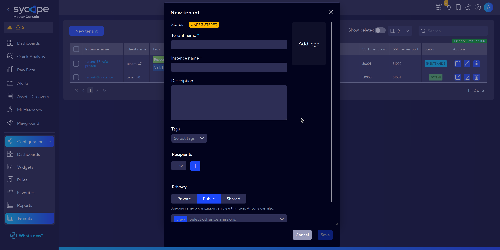

- The initial status `Unregistered` indicates that the Tenant is enrolled on the Master but not yet connected.

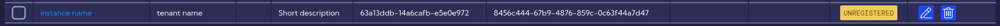

 #### Steps to be executed on Tenant

- Connect Tenant to the Master based on the information generated during Tenant registration on the Master:
  - Provide the GUID (generated on the Master).
  - Provide the keyHash (generated on the Master).
  - Provide the Master's IP.
  - Provide the Master's HTTPS service port (default 443).

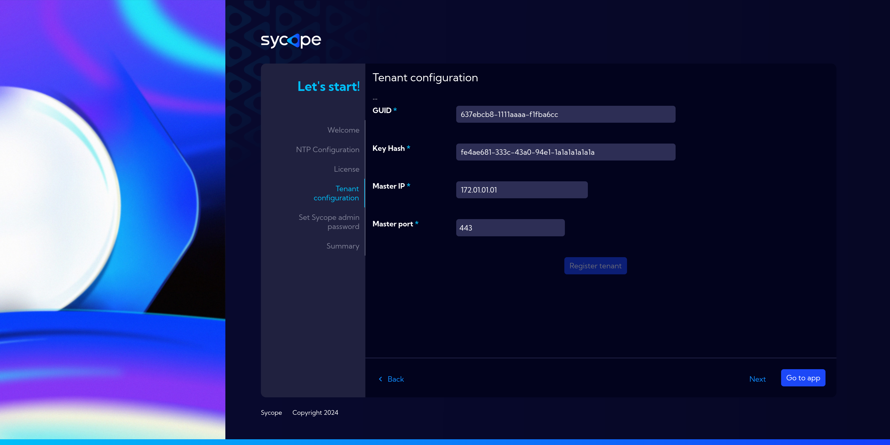

- Restart the Tenant machine:
  - After restarting the machine, it will connect to the Master and it's status in **[Configuration > Tenants]** will change to `Maintenance`.

#### Systems Connected

- After the connection, on the Master **[Configuration > Tenants]**, the status of the Tenant changes to `Maintenance`. This is an initial connection where the Tenant does not transmit all information.

- In `[Menu > Multitenancy]` we use the `Drag & Drop` method

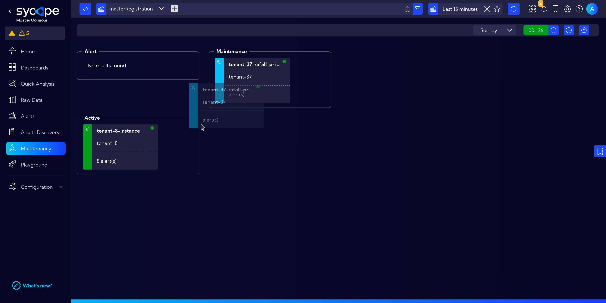

- To move the Tenant to the `Active` status.

In the next step, we proceed to [Operating the Master](#operating-the-master).

## Operating the Master

:::info Important
Make sure to complete first: [Starting Instances](#starting-instances) and [Connecting to Master](#connecting-to-master).
:::

The Master is a management console that serves as a central checkpoint for multiple Sycope instances (Tenants). It is within the Master that administrators can monitor, gather information, and manage Tenant instances. The Master collects metadata sent by various Tenants, analyzes them, and takes appropriate actions based on the gathered information.

In the sections below, the basic functions and capabilities provided by the Master are presented.

- [Monitoring Tenat States](#monitoring-tenant-states) - there you can check the status of connected Tenants, set and configure appropriate Dashboards helpful in monitoring states and generating reports, observe detailed information for a selected Tenant.
- [Metadata Preview from Tenants on the Master](#metadata-preview-from-tenants-on-the-master) - each Tenant sends its metadata stream to the Master, which is then analyzed on the Master. This section presents and describes the streams available from the Master, both those transmitted from Tenants and those generated by the Master itself.
- [Setting up Alert Rules on the Master](#setting-up-alert-rules-on-the-master) - description of setting up alerts on the Master.
- [Reports for Tenants generated on the Master](#reports-for-tenants-generated-on-the-master) - description of report generation settings on the Master.

### Monitoring Tenant States

In the `[Menu > Multitenancy]` view connected Tenants are presented in a division based on states **Alert**, **Maintenance** and **Active**.

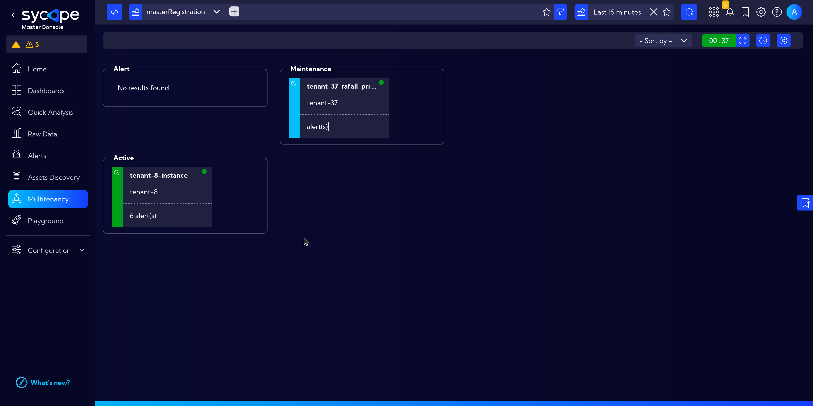

Description of tenants' states:

- **Maintenance** - Initial connection, Tenant does not transmit all information. This status is also used in the case of maintenance work on the Tenant.
  - Console access through tunnel available (access through `Configure` after hovering over the Tenant).
  - Metrics, notifications, or alerts are not yet being sent.
  - Rules on the master cannot modify the status.
  - Heartbeat service (verification of whether the connection has been lost) is not operational.

- **Active** - Full connection, gathering complete information from the Tenant.
  - Transfer of metrics, notifications, and alerts.
  - Activation of the heartbeat service (verification of whether the connection has been lost).
  - Ability to modify Tenant status in rules on the Master (Active - Alert).
  
- **Alert** - Occurs when an alert appears on the Tenant. 
  - Transitioning to/from Alert status based on rules Tossh Alert/ToActive set on the Master **[Configuration > Rules]**.
  - Alert rules set on the Tenant.

:::info Drag & Drop 
The basic manual method of changing a Tenant's status is through `Drag & Drop`.
:::

#### Detailed Tenant View

To display a detailed view of a Tenant, hover over the selected Tenant.

In the expanded card, basic information such as *CPU*, *Memory*, and *Disk usage* is presented.

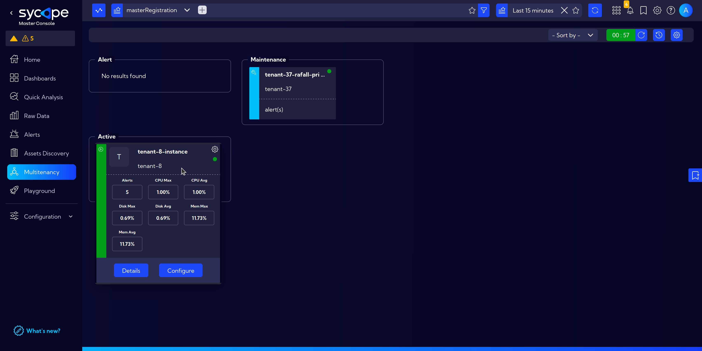

- Clicking on `Gear Icon` opens an **Edit tenant details**, where they can be adjusted to needs.
  - Tenant name
  - Instance name
  - Description
  - GUID
  - Key Hash
  - Tags
  - Recipients (Edit recipients for Reports) - specify the recipients of generated reports regarding the selected Tenant
  - Privacy
  - Configuration

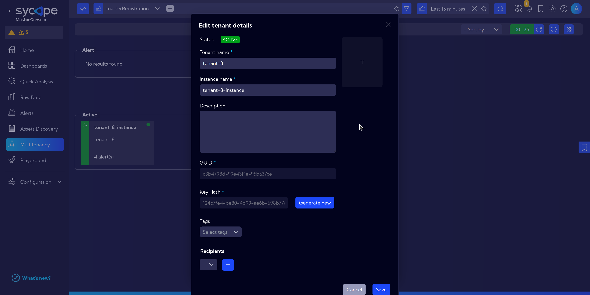

- Clicking on `Details` navigates to the previously configured Dashboard for the Tenant.
  
  :::tip Check first:
  For the `Details` button to function properly, it is necessary to create a Dashboard for the Tenant ([Setting Dashboards for Tenants](#setting-dashboards-for-tenants)) and configure the [Board Settings](#configure-board-settings).
  :::

- Clicking on `Configure` brings a console access through a tunnel.

#### Setting Dashboards for Tenants

Before proceeding, let's configure dashboards tailored for Tenants within the **[Configuration > Dashboards]** section.

- Begin by clicking `Add Dashboard`

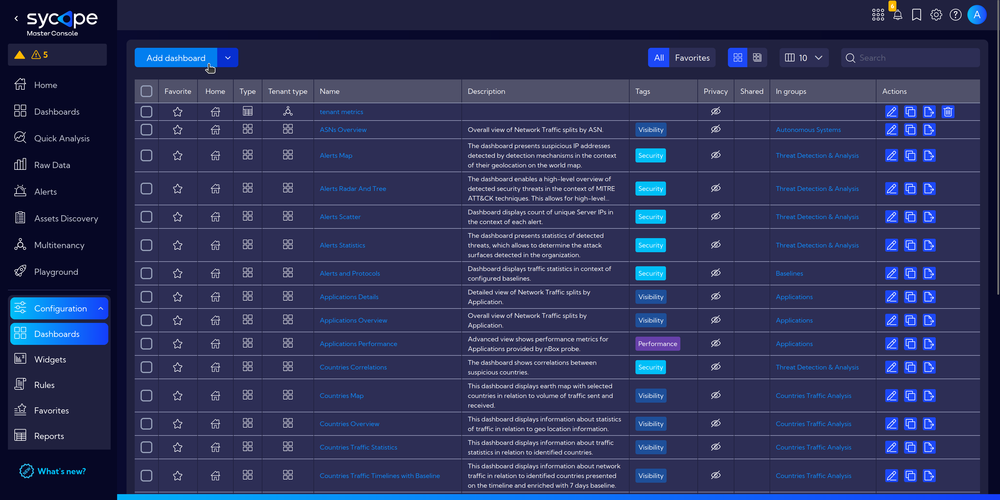

- Fill in basic information **Name**, **Description** and optional **Tag** (and **Category** within **Tag** section) then click `Apply`.

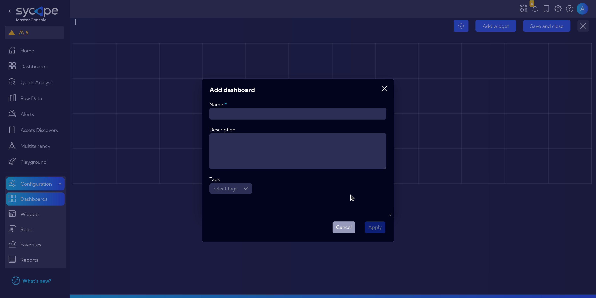

- On the newly created Dashboard click `(Gear Icon) > Preferences`

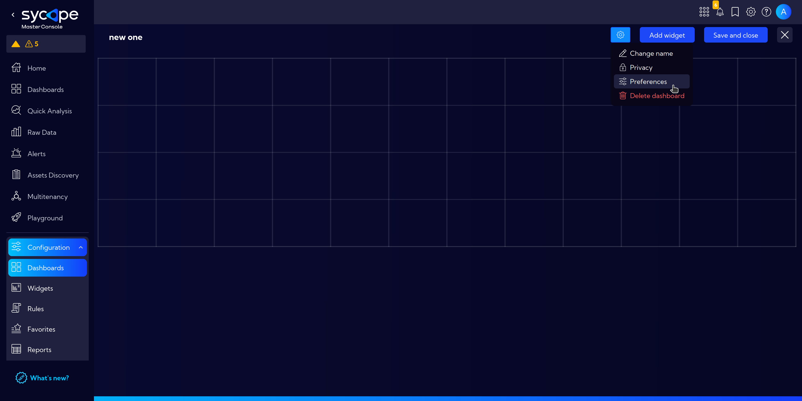

- And in section **Dashboard type** select *Tenants template*.

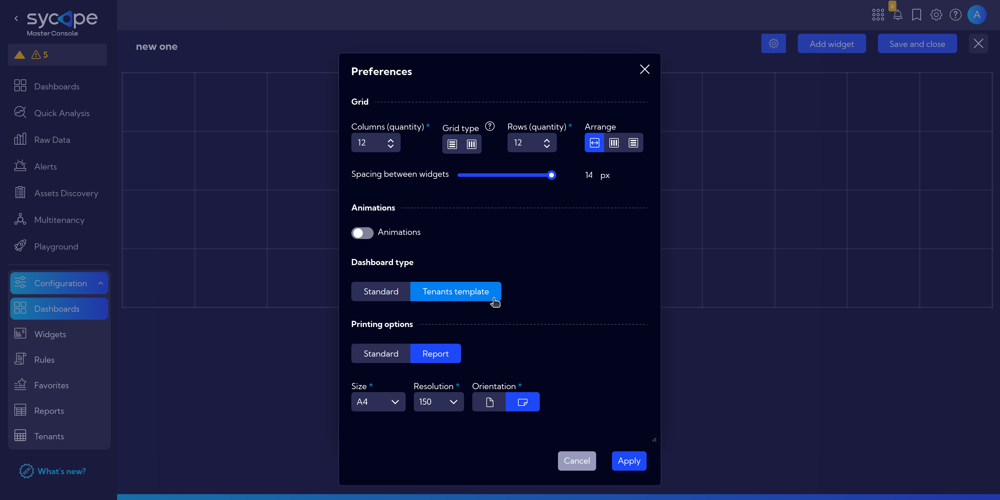

- Consider **Printing options** *Report* if you plan to use this Dashboard in generating reports (More information about the reports: [User Guide: Reports](/User-Guide/Configuration/Reports)).
- Click `Apply` to save changes.

- Customise the dashboard with `Add widget`.

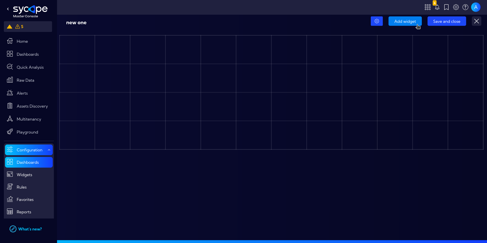

- Remember to click `Save and Close` when you finish.

:::info Important
In the *Tenant type* dashboard, all added widgets must use the same data stream.
:::

:::tip User Guide
More information about creating and customising dashboards: [User Guide: Dashboards](/User-Guide/Configuration/Dashboards)
:::

#### Configure Board Settings

Now that we have set up the Dashboard for tenants, we can enter the Board Settings and set the default dashboard for tenants.

- Access **Board Settings** by clicking `(Gear Icon)` in the right upper corner 

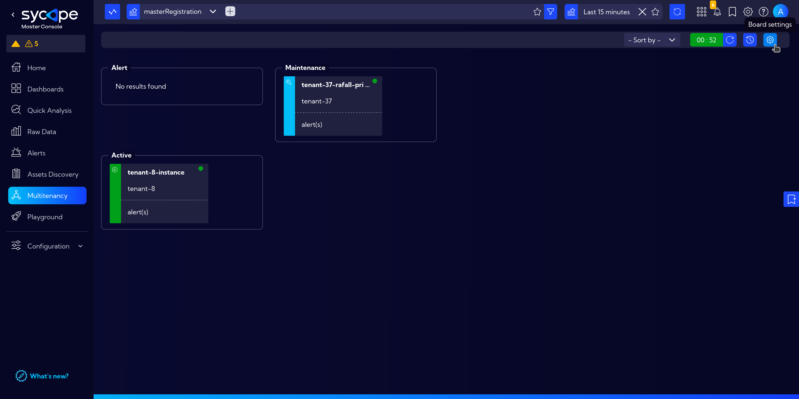

  - **Tenants Board Configs**
    - Auto-refresh delay (min) 
    - Display mode 
    - `Template for details` - From the dropdown menu, we select which Dashboard will be navigated to when clicking `Details` on [Detailed Tenant View](#detailed-tenant-view)
    - Heartbeat Thresholds 

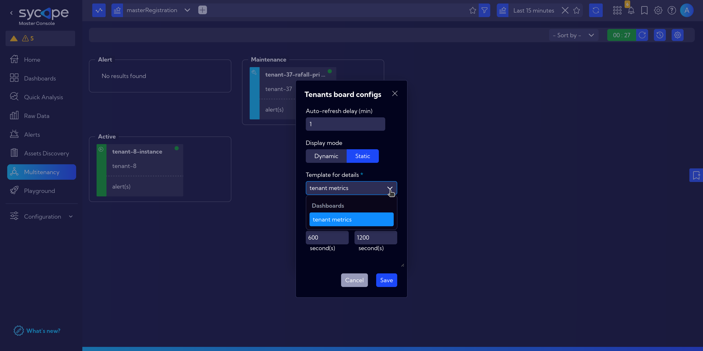

### Metadata Preview from Tenants on the Master

In `[Menu > Raw Data]`, the streams available on the Master are visible. Below is an overview of them along with a brief description.  
Here, we are mainly interested in the **Tenants** streams because that's where all the information collected from all Tenant instances is located.

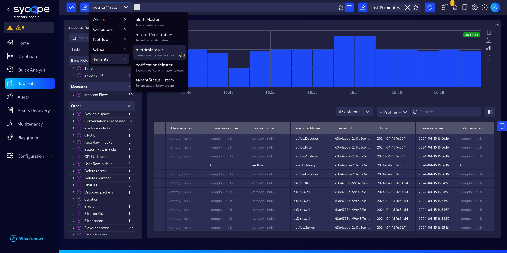

- **Streams**:
  - **Alerts**: Alerts on the Master
  - **Collectors**: Empty - Master does not collect its own information.
  - **netflow**: Empty - Master does not collect its own information.
  - **Other**: Shows only **auditMessages** and **notifications**, containing messages such as 'There is a new update ready'.
  - **Tenants**:
    - **alertsMaster**: Alerts on the Tenant that have been propagated to the Master.
    - **masterRegistration**: Registered and deleted Tenants.
    - **metricsMaster**: Stream where all metrics coming from Tenants are visible.
    - **notificationsMaster**: Notification stream originating from Tenants.
    - **tenantStatusHistory**: Stream where changes in Tenant statuses are visible.

:::info
More information about `Raw Data` and `Streams` under documentation section [User Guide > Raw Data](/User-Guide/Raw-Data) and [NQL User Manual](/NQL/NQL%20documentation#streams).
:::

### Setting up Alert Rules on the Master

On the Master instance, it is possible to set rules `ToAlert` and coupled `ToActive` related to information coming from Tenants. Notifications can be set for things like high CPU usage or low disk space.

:::tip
The standard setting of rules is done in the following way [User Guide: Reports](/User-Guide/Configuration/Reports) and [Examples: Setting Rules](/Examples/Rules%20Examples).
:::

Below is the workflow diagram for rules of type **alertStatus**:

- Go to **[Configuration > Rules]** and click `Add Rule`

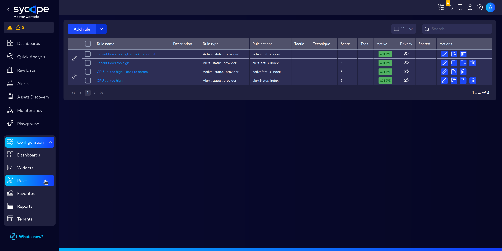

- In the `General` tab, select `Rule Type`: **To alert**

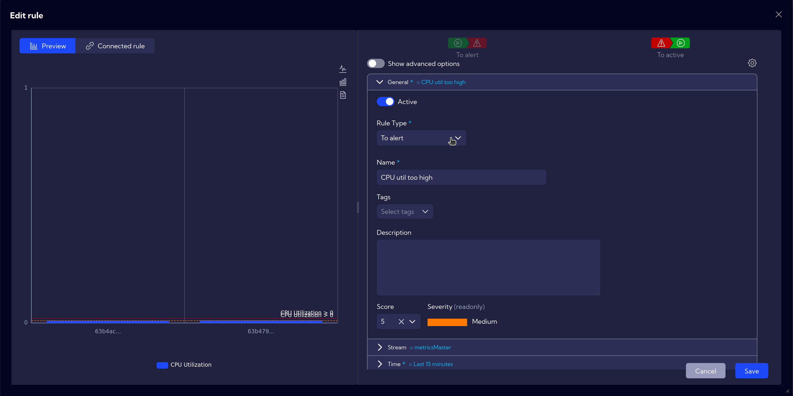

- Adjust other options as needed, especially choose the correct tenants' source stream

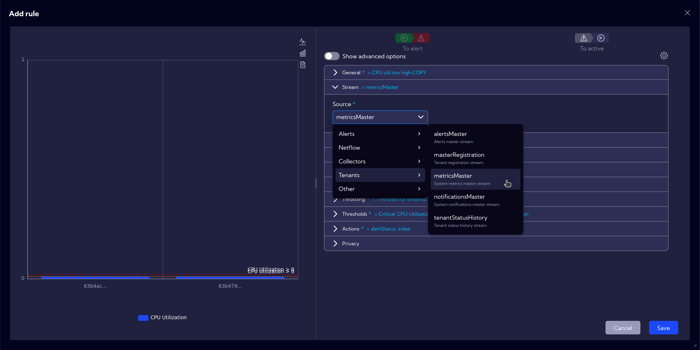

- In the `Actions` tab, select the special action `toAlert`

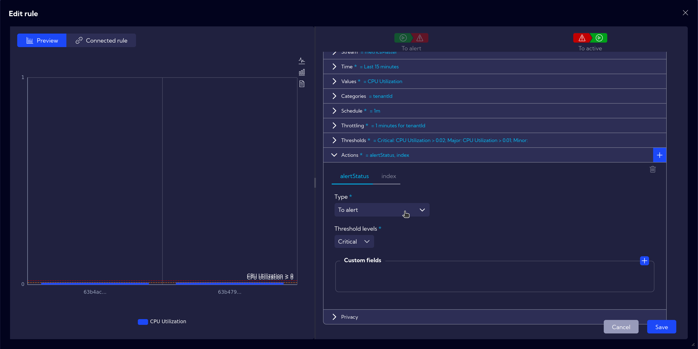

- Save by clicking `Save and add connected` to automatically create the opposite `toActive` rule

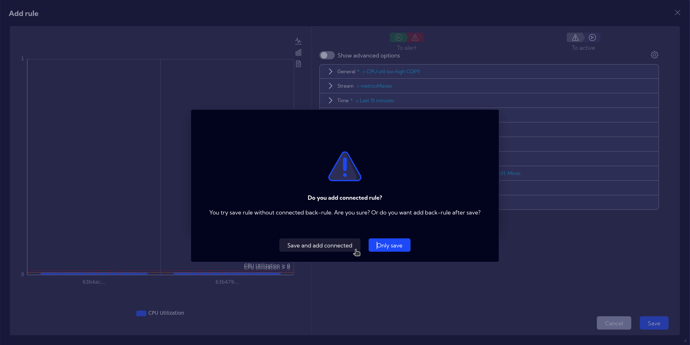

- Ensure that in the `Actions` tab, the `Type` is set **To active** and thresholds are correctly adjusted

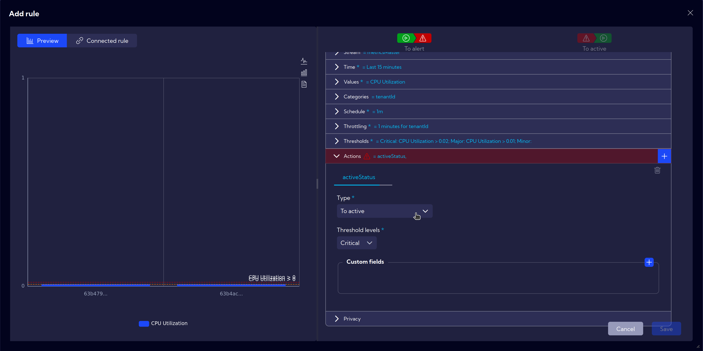

- Finally, click `Save` in the bottom-right corner to save the configuration.

### Reports for Tenants Generated on the Master

On the Master, centralized report generation for Tenants and sending them to specific individuals designated for Tenants is also possible. To initiate report generation and sending, first create a Dashboard with appropriate settings for Reports, and designate report recipients for each Tenant.

First, we need to [create Dashboards](#setting-dashboards-for-tenants) for Tenants with additional settings:

- `Preferences`:
  - `Dashboard Type`: `Tenant`
  - `Printing Options`: `Report`.

For each Tenant, we need to set recipients for report generation. This ensures that reports generated on the Master are sent to the appropriate recipients.

- **Setting Recipients for a Tenant's Report** in **[Configuration > Tenants]**:
  - Click on Tenant and `Edit Tenant`
  - In `Recipients` field select from a list or `+ Add new receiver`.

#### Report Settings

Once we have prepared dashboards and recipients, we proceed to **[Configuration > Reports]**:

- Select `Add Report` and fill-in basic information
- Choose correct **Orientation** (must correspond with previously created tenants' dashboard)
- The main difference in settings compared to the general reporting is **Report Type**: **Tenant**

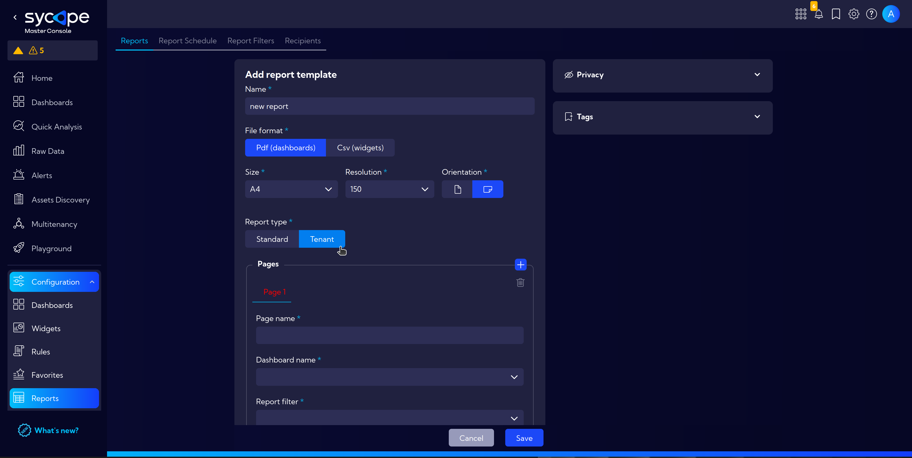

- Complete **Pages** section with **Page name**, **Dashboard name** and **Report filter**

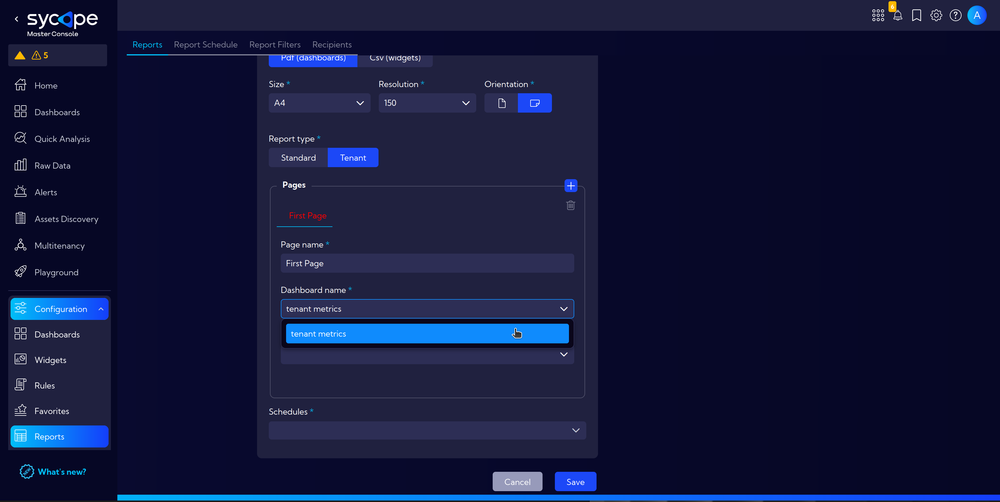

- If your **Report filter** dropdown menu is empty, simply create the new one and `Save`

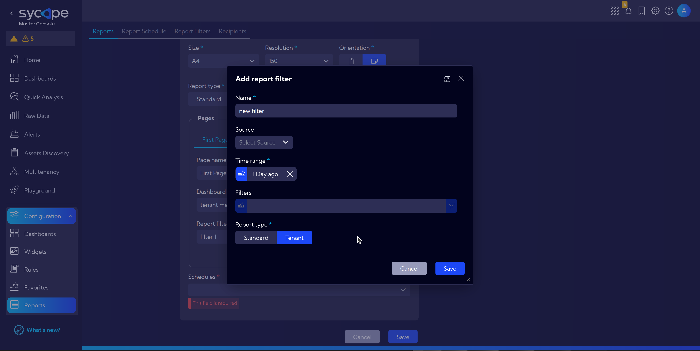

- In `Schedules` choose preferred one or click `Add report schedule` to create new
  - Set desired **Name** and time intervals in **Schedule**
  - Set **Report Type**: **Tenant** 
  - And select tenants for which report should be generated
  - `Save` the schedule

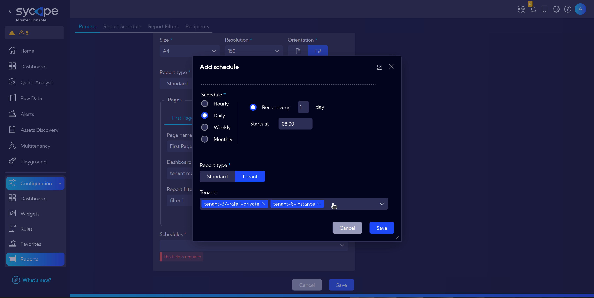

- And finally `Save` the report

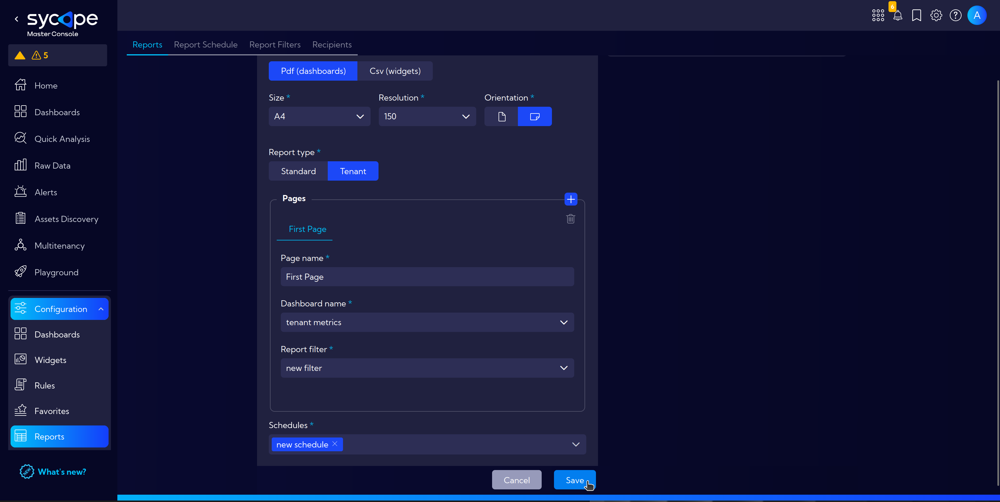

:::tip
More information about the reports: [User Guide: Reports](/User-Guide/Configuration/Reports).
:::
