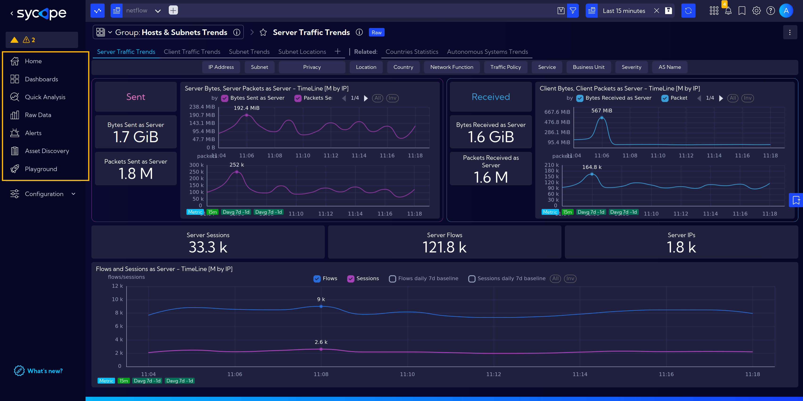
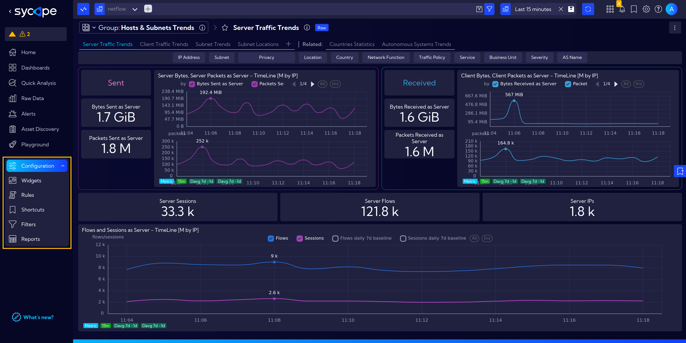
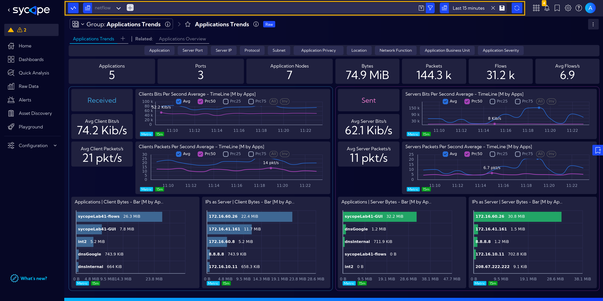
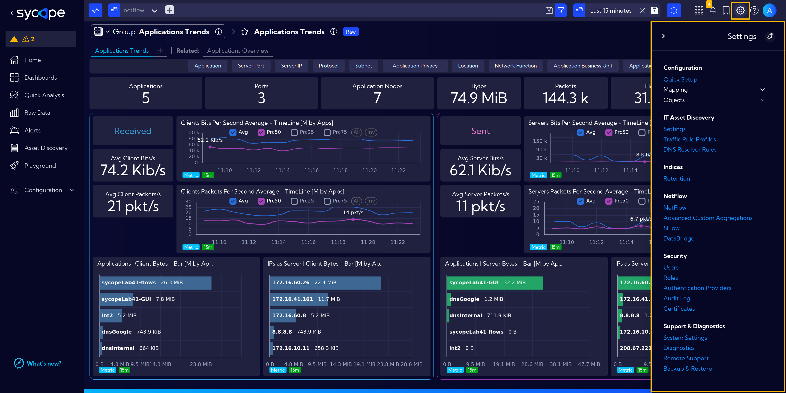

# User Interface

A brief introduction to the Sycope System main elements.

The main system window is divided into sections: [Menu](#menu), [Configuration](#configuration), [Search Bar](#search-bar), [Settings](#settings).

## Menu

**`Menu`** is the most frequently used element of the interface. We use it to easily navigate between the system modules: [**Home**](/User-Guide/Home), [**Dashboards**](/User-Guide/Dashboards), [**Quick Analysis**](/User-Guide/Quick-Analysis), [**Raw Data**](/User-Guide/Raw-Data), [**Alerts**](/User-Guide/Alerts), [**Asset Discovery**](/User-Guide/Asset-Discovery) and [**Playground**](/User-Guide/Playground).

## Configuration

The next element is [**`Configuration`**](/User-Guide/Configuration), where we find handy, frequently changed options in the system. It includes settings for **Widget**, **Rules**, and **Reports**.

## Search Bar

The **`Search Bar`** is located at the top of the window.  
It includes **Stream** selection, a **filtering** information window with options to add and modify filters. Remember that the set filters are saved and remain active as you navigate through the system.  
Further to the right is the **Time Bar**, where we set the desired time range for a presented data, whether it's 15 minutes, 24 hours, or any custom choice.

## Settings

Further to the right is the section with shortcuts to system functions, like **Notifications**, **Bookmarks** or **Help**, and the most important here is the `gear icon`, which opens [**`Settings`**](/User-Guide/Settings), where we modify the basic operation of the system.

