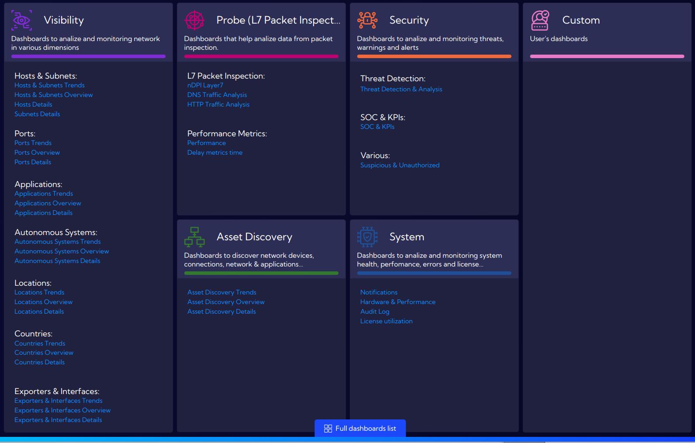
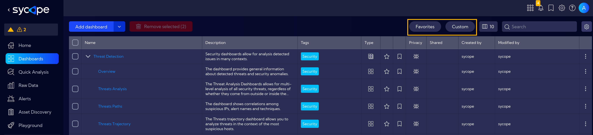
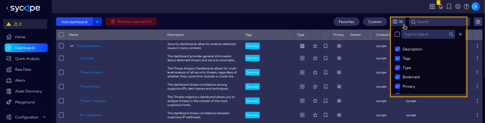
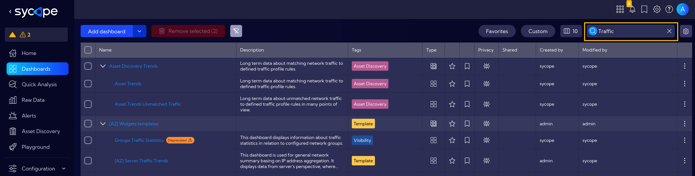
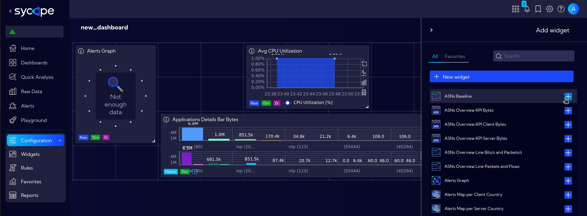
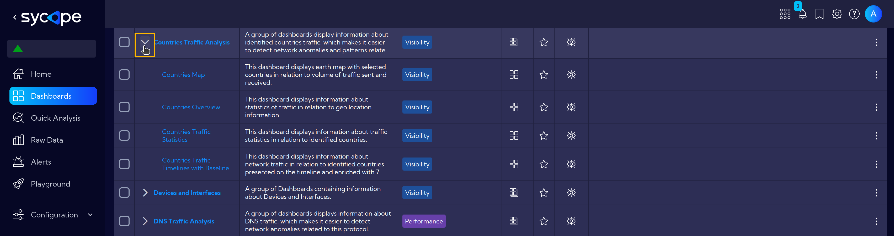
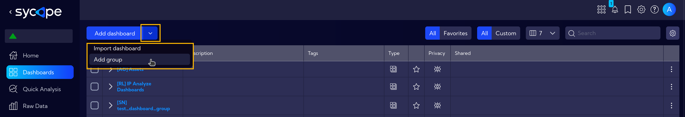
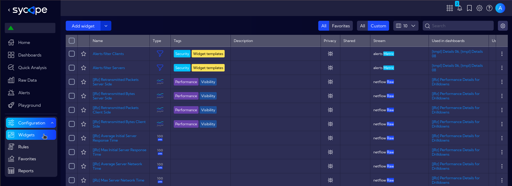
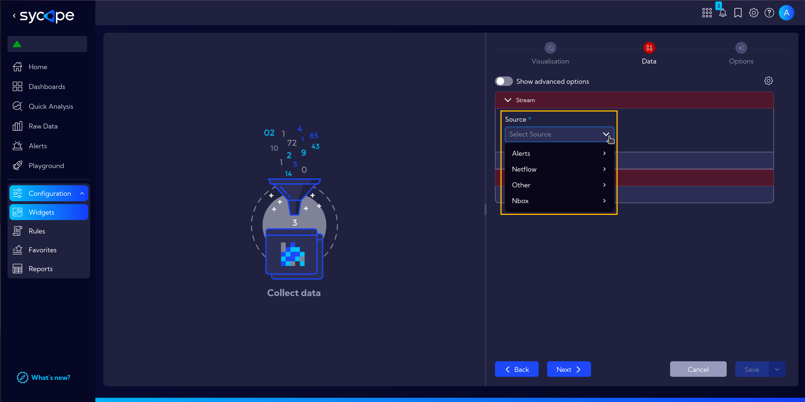

# Dashboards and Widgets

The Sycope system is structured as follows. The basic element that enables further construction is the widget, which allows us to present data from the system in many ways. We can place and position widgets on dashboards. In turn, we can combine dashboards into groups to make it easier to navigate between them. Here is a brief introduction to these building blocks.

## What is a Dashboard?

A dashboard is a flexible space that allows for the addition and arrangement of [widgets](#what-are-widgets) in terms of their position and size. For convenience, dashboards can be grouped, making them easier to manage.

Dashboards and their groups can be managed in the **`[Dashboards]`** menu.  

This menu includes a table with all available dashboards and groups.  

By clicking on **Full dashboards list** at the bottom of the page, we go to the table view with all available dashboards.

The top menu allows for filtering such as `Favorites` and `Custom`.

In this view, you can also customize the displayed columns, such as Type, Tags, Description etc.

And use the `Search Field` bar to find the necessary dashboard.

### Create and Configure a Dashboard

When creating a dashboard, we have the option to choose various [widgets](#what-are-widgets) from the library (the search bar helps in finding widgets), or we can create new ones according to our current needs.
Dashboards can be configured in various ways regarding the positioning of widgets, including the number of rows and columns, the arrangement of these rows and columns, and the size of margins.

### Groups of Dashboards

Dashboards can be combined into groups based on user needs. A single dashboard can belong to multiple groups.
The system includes pre-built dashboard groups designed for specific troubleshooting scenarios, available immediately after installation.

Click on the dropdown menu to show all dashboards in the group.

At any time, you can create your own group and organize dashboards according to your preferences.

## What are Widgets?

Widgets are elements that can display data from the system in various formats, such as line charts, pie charts, bar charts, tables, maps, graphs, etc.  

The Sycope system has a shared widget database, meaning a widget created once can be used in multiple dashboards. Changes to a widget are reflected in all dashboards where it is used.

Access the Widget Library with **`[Configuration > Widgets]`**:

### Setting Up Widgets

Creating a widget involves three or four steps, depending on the type of visualization you choose in the first step. By default, widgets work with a single data stream, and the main step in creating a widget is selecting this data stream. What are [streams](/Introduction/Streams)?.

## What's Next?

A step-by-step example of how to create a simple widget can be found [here](/Examples/Widget-Example-Simple), and for a more detailed example including a bar chart head [here](/Examples/Widget-Example-Advanced).

Go to [this section](/Examples/Create-Custom-Dashboard) to see a step-by-step guide on how to create an easy example dashboard.

