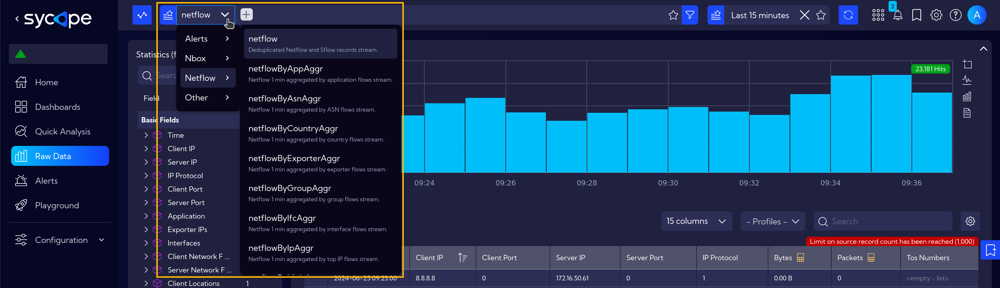
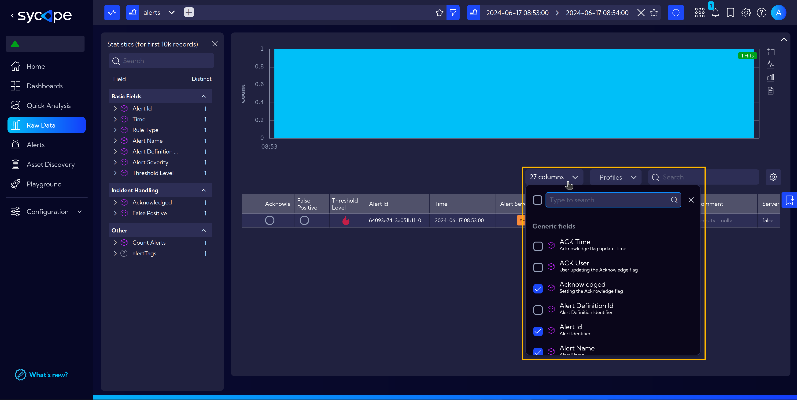
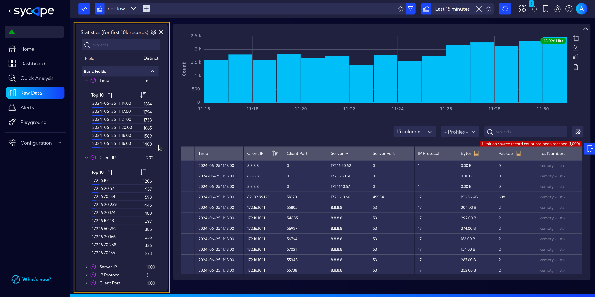
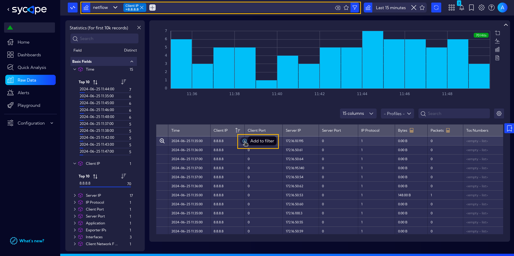
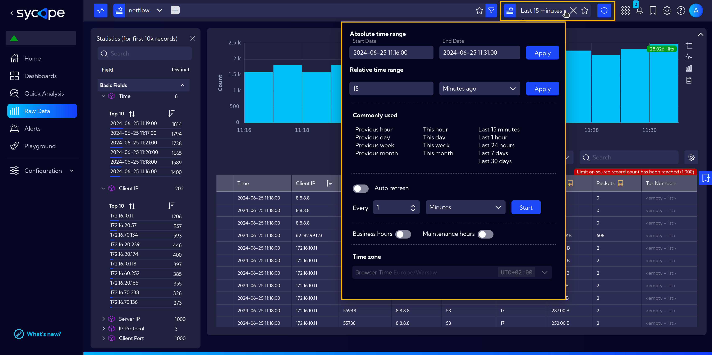

# Streams

## What are Streams?

Data streams in the system can be thought of as tables in a database. Each stream represents a data records, similar to rows in a table, and each record can have different fields, or columns.  
Streams are integral to various [widgets](/User-Guide/Configuration/Widgets), each typically using data from a single stream. However, advanced queries can pull data from multiple streams.  

Understanding and utilizing streams effectively is important for leveraging the full capabilities of the Sycope's data analysis and visualization tools.

## Key Characteristics of Streams

<!-- > `# TODO` -->

- Different Keys: Streams may have different keys (e.g., an IP address without direction), which can complicate filtering.
- Single Stream Usage: By default, each widget uses data from a single stream, though advanced queries can utilize multiple streams.
- Detailed Information: The stream containing the most detailed information from NetFlow is "netflow." Based on this stream, aggregated streams like "netflowbyIPaggr" are created.

## Exploring Streams in **`[Raw Data]`** menu

The best place to explore streams is the [**`[Raw Data]`**](/User-Guide/Raw-Data) menu, where you can directly examine them by changing the stream in the top left corner next to the search bar.

Data streams are categorized into groups: NetFlow, Assets Discovery, Alerts, Collectors etc.

Raw Data Columns and Statistics: 
- you can explore the available columns by clicking on `Columns` 

- and use the `Statistics` on the left to understand the fields better.

At the top of the page, there is a search bar where you can apply filters by typing or selecting data from a table with `+` icon.

To the right of the Search Bar, there is a time range selector where you can set the time range for the data visible in the stream.

:::note
Detailed Stream Documentation: For a comprehensive list and details of available streams, refer to the [System Data Streams Documentation](/User-Guide/Raw-Data/#system-data-streams).
:::
