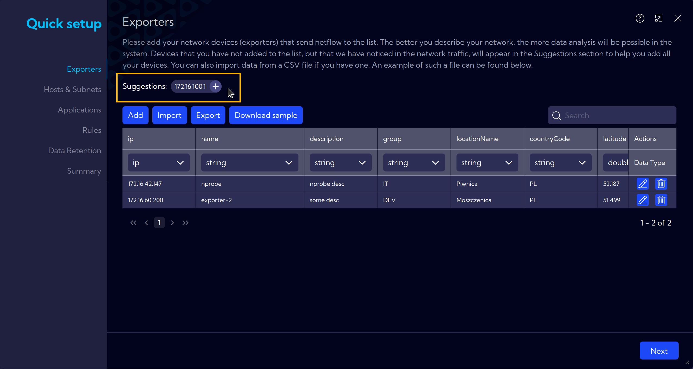
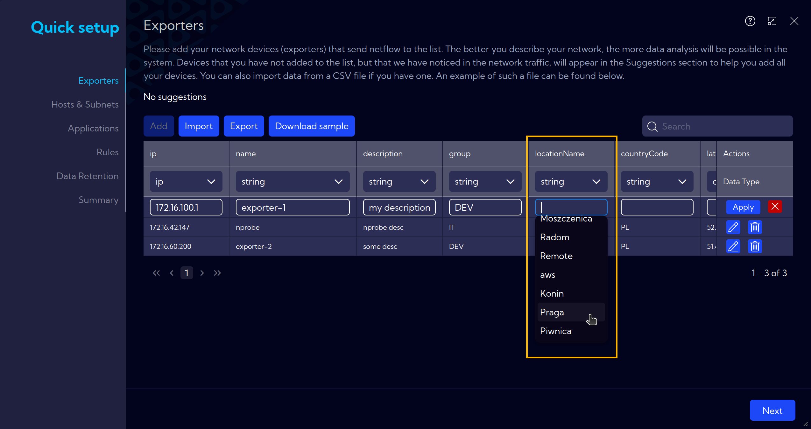
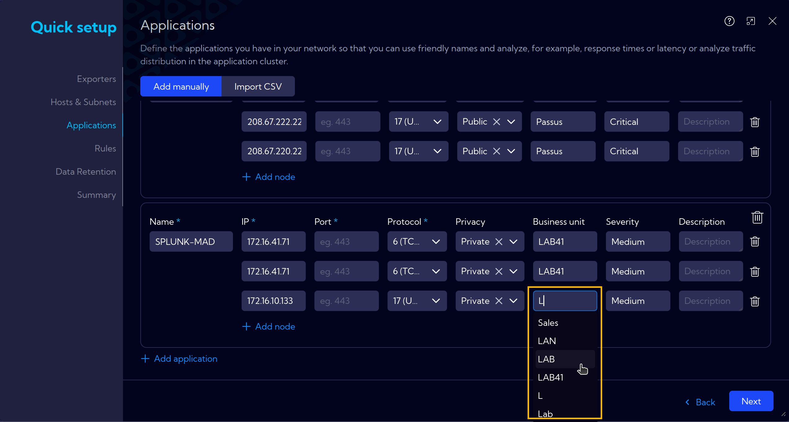
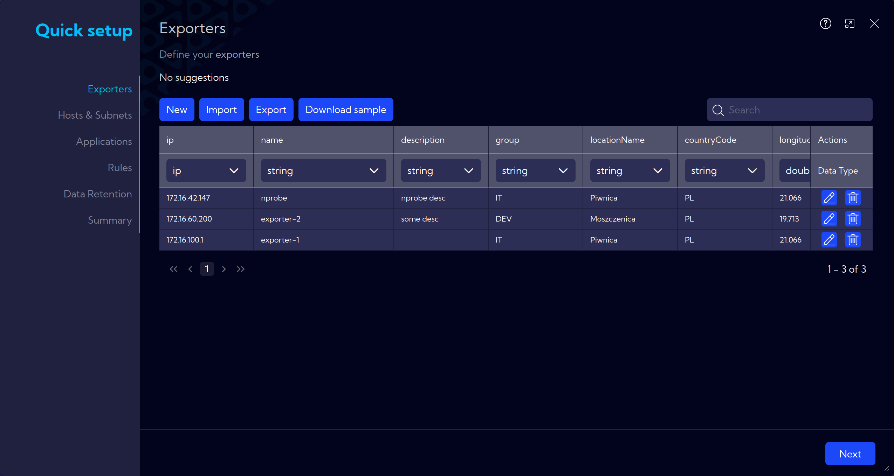
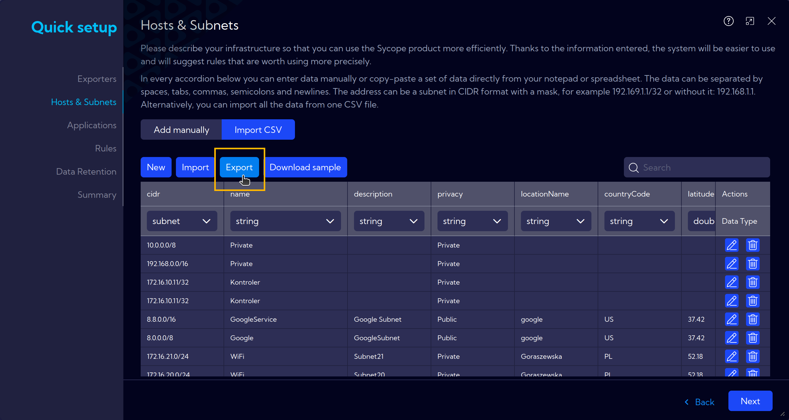
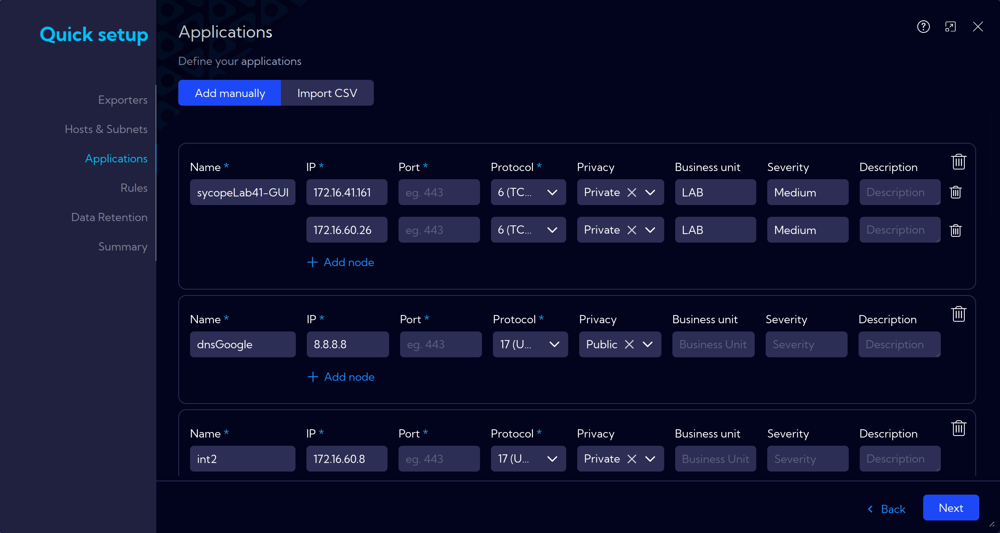
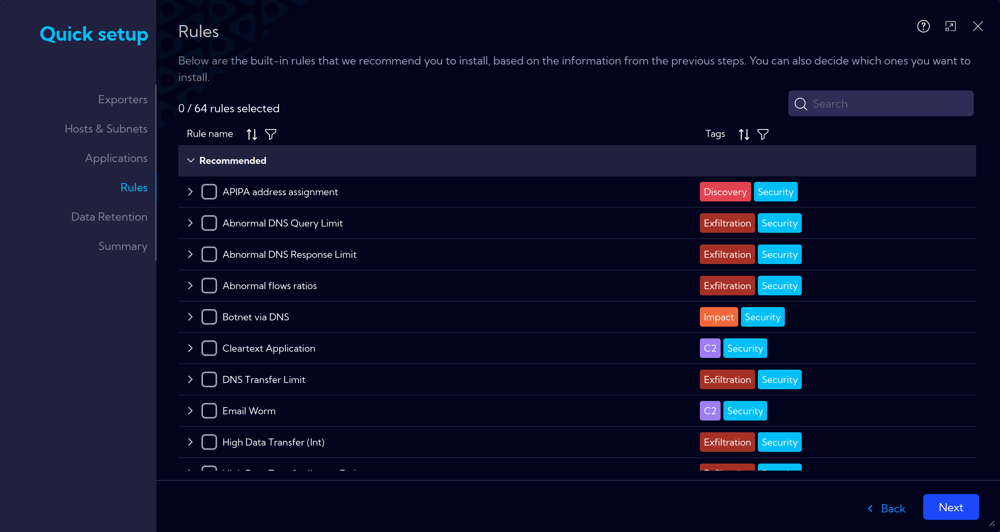
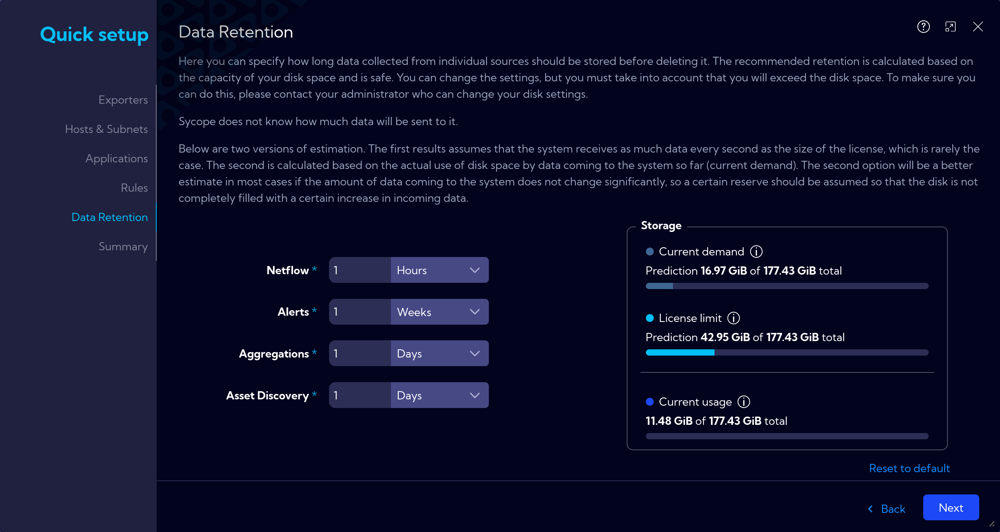
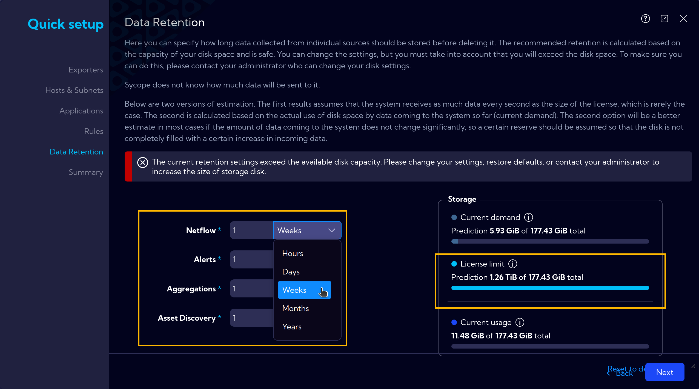

# Quick Setup

A setup wizard for initial system configuration, allowing you to start working immediately.

The completion of additional information is optional but recommended for smooth system operation.  

Furthermore, thorough completion enables immediate utilization of the Sycope system with a high level of customization tailored to our needs and access to its extensive functionality.

:::info
## Automated Data Entry Assistance and Suggestions

Our system assists you in data entry by providing suggestions based on detected network traffic and previously entered information. 
Suggestions are offered wherever possible, such as for Exporters and Services. 
Some fields are also auto-filled using this data to streamline the configuration process.  
The system requires at least 30 minutes of history to generate suggestions.

Examples:

### Exporter Suggestion

The system detects exporters present in the network, and they can be easily added using the plus button.

Next, while filling in the fields, automatic suggestions will be available to assist you.
As in the example below, when adding an application.

### Other Suggestions

Suggestions are also available in other areas of Quick Setup.  
As soon as the system has any recommendations, they will be visible and selectable.

:::

## Exporters

The Exporters section is where you define data exporters. It is separated from the main network infrastructure, often using a different address pool or location. 

## Hosts & Subnets

In this section, you will define the key components of your network infrastructure, such as hosts, subnets, and related attributes. Providing detailed infrastructure information helps optimize the Sycope system’s functionality. This enables the system to offer more accurate suggestions for configuration rules and improves its overall performance in monitoring and managing network activities.

`Add manually` or via `Import CSV`.

You can add this data manually by filling out the various fields and expanders or import it directly from a CSV file for faster setup.

### **Subnets**

Define the hosts and subnets within your network, enabling the system to better manage and analyze traffic and network structure.

### **Locations**

Setting physical locations for specific hosts: place and country. For example, this is useful in data visualization on graphs.

### **Network Functions**

Adding a network function description for quicker understanding of the purpose of a particular network.

### **Traffic Policies**

Adding a description of internet traffic, which can be useful for creating alert rules, for example, when a network with *No Internet access* connects to the internet.

### **Services**

Add services functions (DHCP, DNS, etc.) to specific addresses or subnets

### **Business Units**

Add business units (HR, Sales, etc.), and list subnets and assets for them.

### **Severities**

Assigning importance levels to host addresses or subnets.

:::tip
After entering the data manually, you can export it to a CSV file to save for future use. Under the `Import CSV` button at the top, there is the `Export` option.
:::

## Applications

`Add manually` or via `Import CSV`.

Information about applications running on specific hosts and assigned ports can be added. Additionally, details about the locations of additional instances of the application can also be included.

## Rules

In this section, there are built-in rules that we recommend you to install, based on the information from the previous steps.  
Alternatively, you can add your own rules at this point.
General information about Rules can be found at [**[Configuration > Rules]**](/User-Guide/Configuration/Rules)

## Data Retention

Here, we set how long collected data for **Netflow**, **Alerts**, **Aggregations**, and **Asset Discovery** will be stored on the machine. 

In the **Storage** window at the bottom row ***Current usage***, you can see how much disk space is currently occupied, while the middle row ***License limit*** represents the prediction assuming the number of flows fully saturates the capabilities of the purchased license.
The top row ***Current demand*** contains information about the predicted disk usage based on the real data currently being collected by the Sycope system.

If a longer data retention period is selected and the estimated disk space usage increases, an alert will appear with suggested actions to prevent the disk from filling up.

## Summary

A summary window with a visualization of the introduced changes.
After review and ensuring that everything is set according to the assumptions, proceed with the `Install` button.
