# Dashboards

A **Dashboard** is a visual representation of data designed for quick analysis of the network traffic data and for informational awareness.

**Dashboards** consist of **Widgets** – objects with a graphical representation of specific data which can be added, edited, positioned, deleted or modified as you like. The Sycope system allows users to set up multiple **Dashboards**. 

**Dashboards** can be combined into **groups** depending on the user's needs while a single **Dashboard** can belong to multiple **groups**.

A number of **Dashboard groups** created by our specialists to implement selected troubleshooting scenarios have been built into the System. These Dashboard groups are available to the user right after the System installation.

**Dashboards** and **Dashboards groups**, both built-in and user-created, are available for use in the **[Dashboards]** menu.

The initial view shows a list of built-in dashboards grouped by licenses. For more on this topic check the [Built-in-Content](/Introduction/Built-in-Content) in the Introduction section.

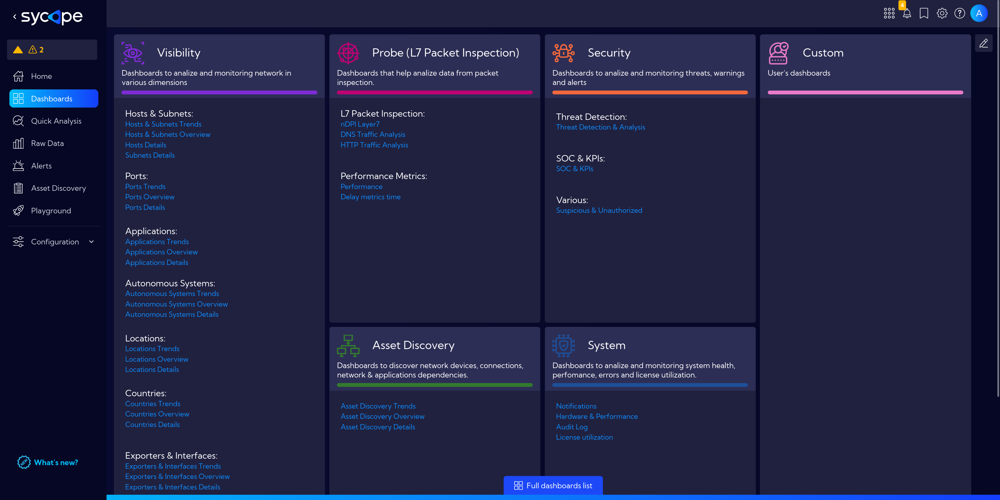

After clicking on **Full dashboards list** we go to a view of all dashboards that are available in the system in a table format.

In the top menu, there are the following options:

## Favorites

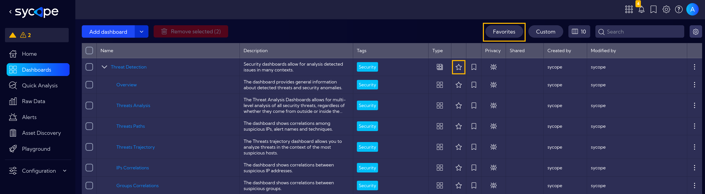
Clicking on a **Favourites** icon you can reduce the list of Dashboards/Dashboard groups and display only those marked as favorites. To add a Dashboard/Dashboard group to favorites, just click the icon in the Dashboards table. The white-filled icon indicates that the Dashboard or Dashboard group has been correctly added to favorites. 

## Dashboard Groups

Dashboards can be combined into Dashboard groups. The view in the table can be expanded to display all the dashboards located in the selected group.

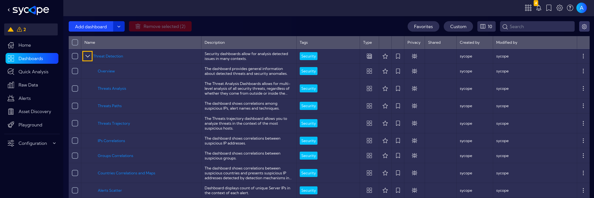

### Add/Edit Dashboard Group

To add a new **Dashboard group** or edit an existing one, go to **[Dashboards]** and click on **See full dashboards list** at the bottom of the Dashboards view.

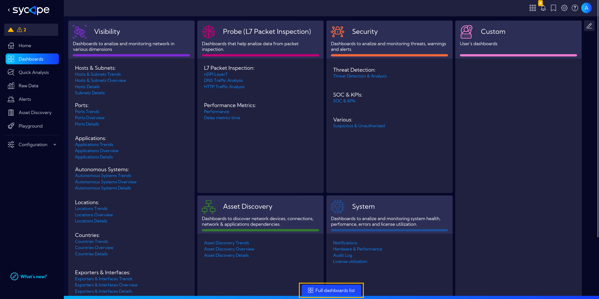

Click the dropdown menu next to `Add dashboard` button and select `Add group`.

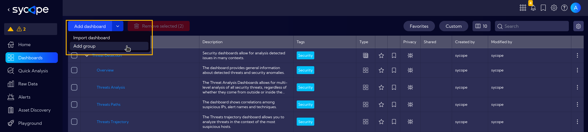

The Dashboard Group Wizard window with the following fields will appear:

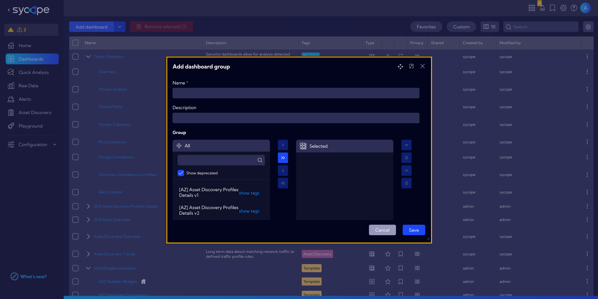

- **Name** - unique name of the Dashboard group

- **Description** - short description

- **Dashboards selector** - Here you can choose which **Dashboards** should belong to the created group. A **Dashboard** can belong to many groups. To add a **Dashboard** to a created group, find and select it in the list and then click `Add selected`.

  To add all **Dashboards** from the list to the group click ` Add all`.

- **Tags** - Tag assignment

- **Privacy** - you can grant permissions for a Widget

  - **Private** - accessible to the owner
  - **Public** - visible to all, but you can grant permission to:
    - **delete**
    - **edit**
  - **Shared** - accessible to one or more selected **User roles**. The available privileges are:
    - **delete**
    - **edit**

- Once the fields are filled in correctly and the save button is clicked, the **Dashboard group** will be created and added to the list of available groups in the System.

To **edit** a **Dashboard group**, click the `Edit` icon in the **Action** column.

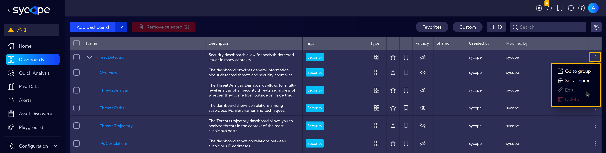

## Displayed columns

You can customize the number and type of columns which will be displayed in the table.

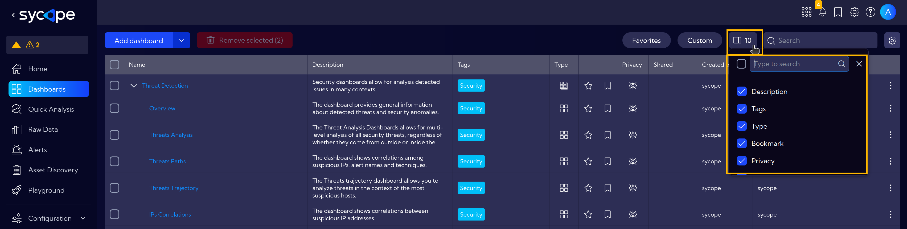

The following columns are available:

- **Type** - an icon indicating the type of row: Dashboard, Dashboard groups
- **Tags** - assigned tags
- **Description** - short description
- **Privacy** - an icon indicating the status of the object's rights
- **Shared** - the name of the user who shared the Dashboard
- **Created By** - the name of the user who created the Dashboard
- **Creation Time** - time when the object was created
- **Modified By** - the name of the user who last modified the Dashboard
- **Modification Time** - last modification time

## Search

- field where you can enter data to be searched in the table

## Add/Edit Dashboard

To add a Dashboard, click on the **Add Dashboard** button and fill in the fields in the pop-up window. 

In the pop-up window there are the following fields to fill in:

- **Name** - Dashboard name (mandatory)
- **Description** - short dashboard description
- **Tags** - you can add tags related to the Dashboard being created

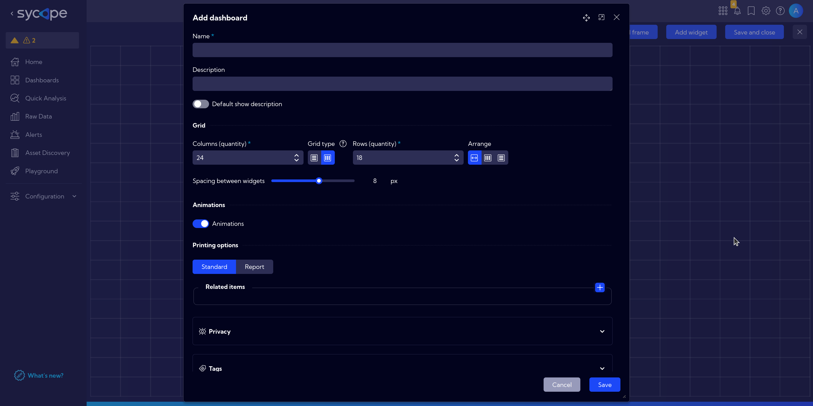

After clicking `Save`, a grid board on which you can place **Widgets** will appear.

To configure the Dashboard use the **top menu**.

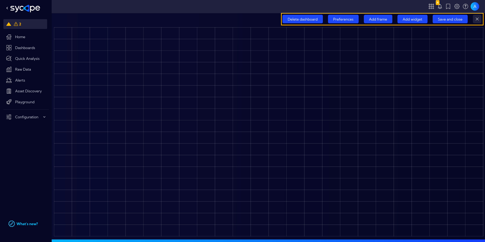

### Preferences

In the Preferences menu, we can find detailed settings for our new dashboard.

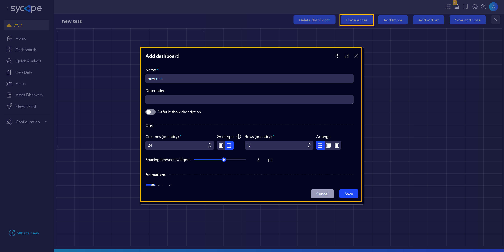

### Add frame

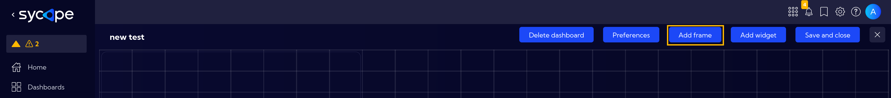

### Add widget

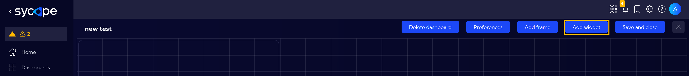

You can add **Widgets** from the list of **all** or **Favorites** Widgets in the System.  
Use **Search Field** to quickly find and select a widget.

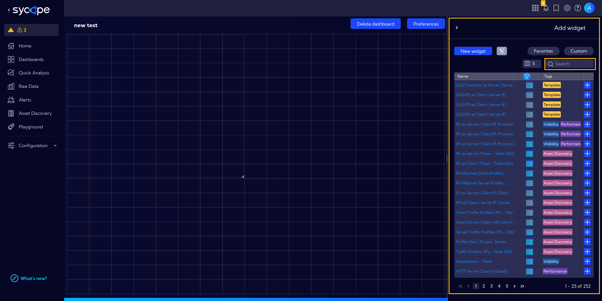

### Save and close

Click `Save and close` to complete configuration and save a **Dashboard**.

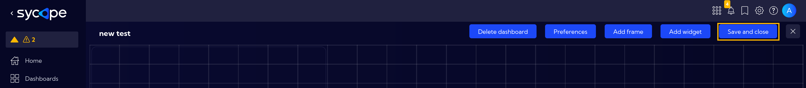

A saved **Dashboard** is placed in the table with a list of dashboards, and it is launched by clicking on its name.

:::info
A step-by-step example of how to create a simple widget can be found [here](/Examples/Widget-Example-Simple), and for a more detailed example including a bar chart head [here](/Examples/Widget-Example-Advanced).

Go to [this section](/Examples/Create-Custom-Dashboard) to see a step-by-step guide on how to create an easy example dashboard.
:::
