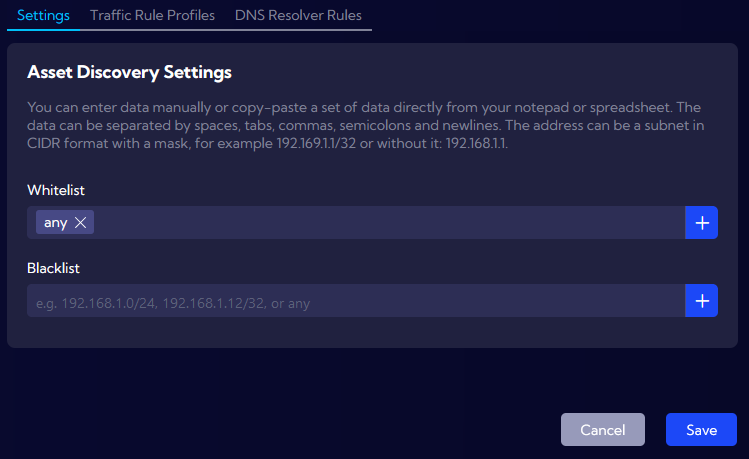

# Asset Discovery Settings

The **`[Settings > IT Asset Discovery > Settings]`** menu can be used to manage global whitelists and blacklists. User can define lists to include or exclude subnets and IP addresses from the inventory in Asset Discovery. Both public and private subnets are supported. 

The following combinations are supported:

- The **“any”** keyword for including all discovered addresses

- Subnets with a **specific CIDR**

- **individual IP addresses** by using CIDR /32 

Multiple entries are supported with the usage of spaces, tabs, commas, semicolons or newlines. User can also paste multiple entries from external sources such as text files or Excel spreadsheets. 

If a user requires all addresses and subnets to be visible in Asset Discovery, the best practice is to use **“any”** in the Whitelist field. 

## Examples

:::info
To check useful examples from Asset Discovery, go to [Asset Discovery Examples](/Examples/Asset-Discovery) section.
:::