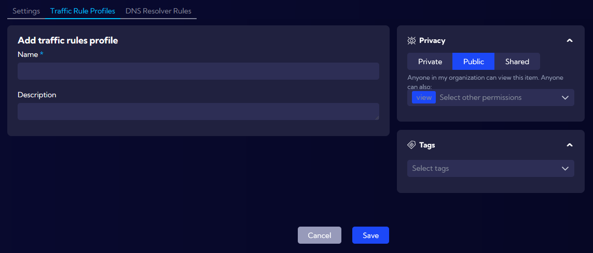
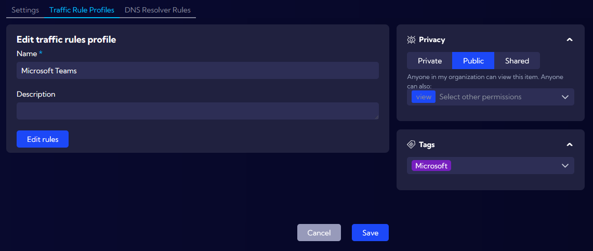
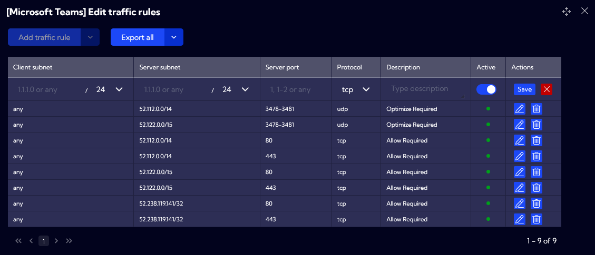
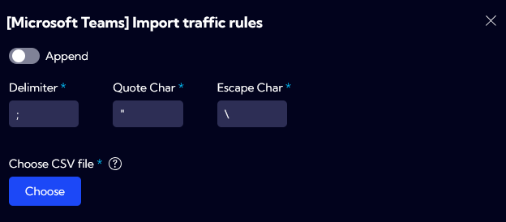
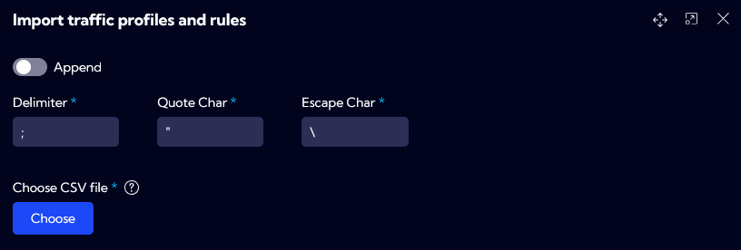
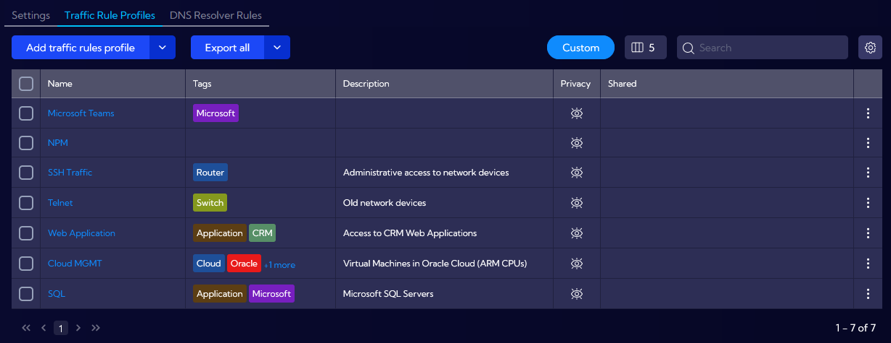

# Traffic Rule Profiles

The **`[Settings > IT Asset Discovery > Traffic Rule Profiles]`** menu can be used to create and manage traffic rule profiles.

Any potential modification to profiles will have an automatic outcome to Asset Discovery functionality and all its dashboards, including historical NetFlow data. 

The following options are available:

- **Add traffic rules profiles** allow users to create new profiles, which will be used to map traffic for both ***assetNetflowAggr*** and ***assetDevices*** streams.

First step includes defining **Name** and **Description** fields, as well as **Privacy** and **Tags**.

Privacy has three options: **Private** (only the owner can view this item), **Public** (anyone can view this item with optional delete/edit/grant permissions) and **Shared** (only the added user roles have access to this item).

**Tags** can be selected from the built-in list or user can create a new tag using Add tag button located in the dropdown list. Single profile supports multiple tags. 

In order to edit rules for a new profile, user is required to click on **Save** and next to click on its name from the **Traffic Rule Profiles** list.

This will allow accessing **Edit rules** option. 

After clicking **Edit rules**, **Edit traffic rules** window will appear for adding or modifying specific rules. 

The fllowing fields are supported:

- **Client subnet** – “any” for all subnets and addresses, specific subnet or individual IP address with CIDR 32

- **Server subnet** - “any” for all subnets and addresses, specific subnet or individual IP address with CIDR 32

- **Server port** – specific network port, port range or “any” for including all ports

- **Protocol** – TCP, UDP or “any” for including all

- **Description** – optional field for defining description to specific rule 

Rules can also be imported or exported using CSV format. Formatting example is available by expanding **Export all** option and clicking on **Download sample**.

User can import new rules by expanding **Add traffic rule** and clicking on **Import traffic rules**. Inside the window user can modify the default formatting for CSV file, before importing new rules.

- **Traffic Rule Profiles** also include options for importing and exporting profiles. **Import traffic rules profiles** is available by expanding **Add traffic rules profile**.

Inside the **Import traffic profiles and rules** window user can modify the default formatting for CSV file, before importing new profiles.

Formatting example is available by expanding **Export all** option and clicking on **Download sample**.

- Additional list filtering by showing **Custom** profiles, choosing visible **Columns** or using **Search** function

## Examples

:::info
To check useful examples from Asset Discovery, go to [Asset Discovery Examples](/Examples/Asset-Discovery) section.
:::