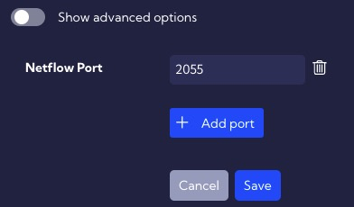
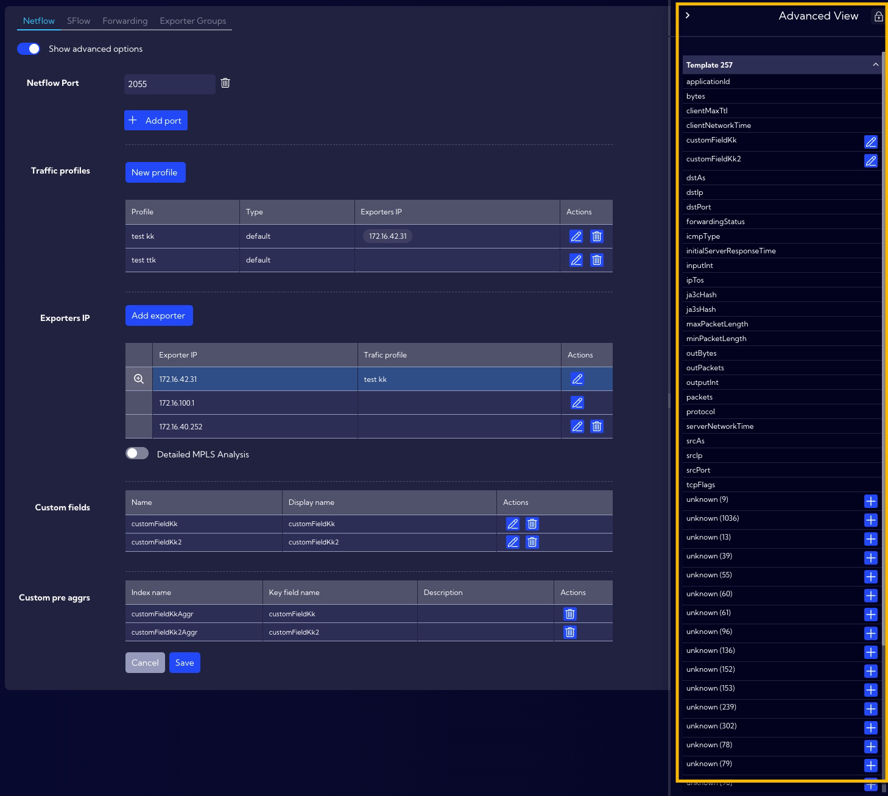
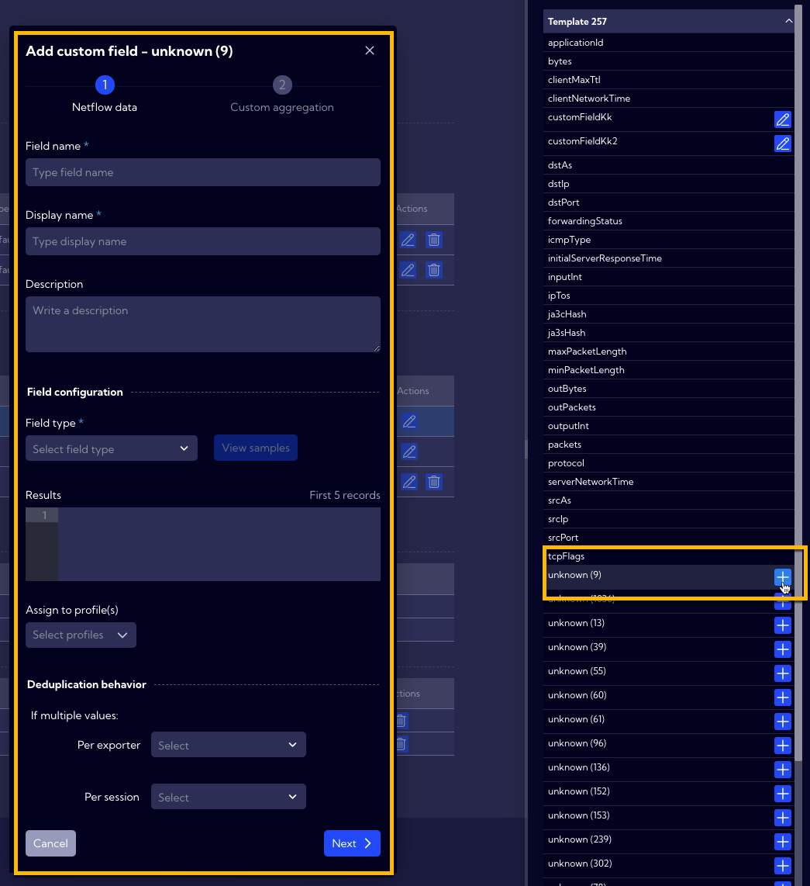
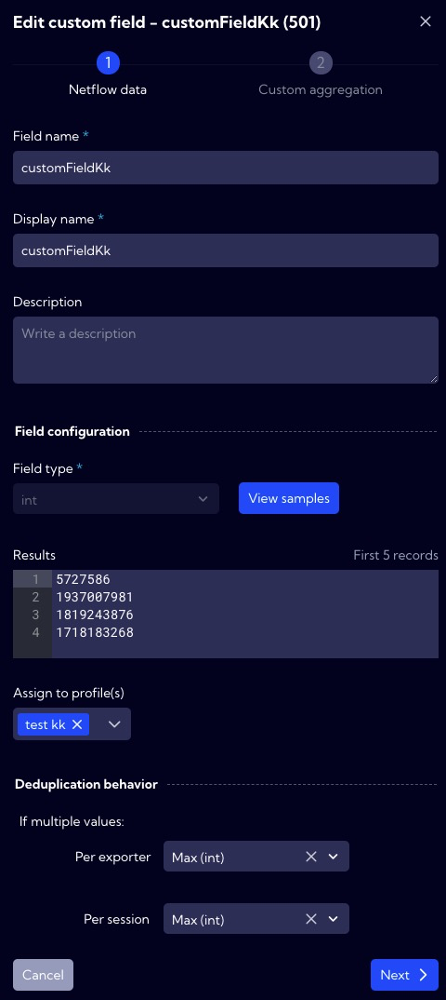
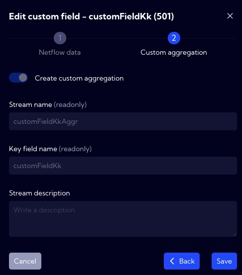
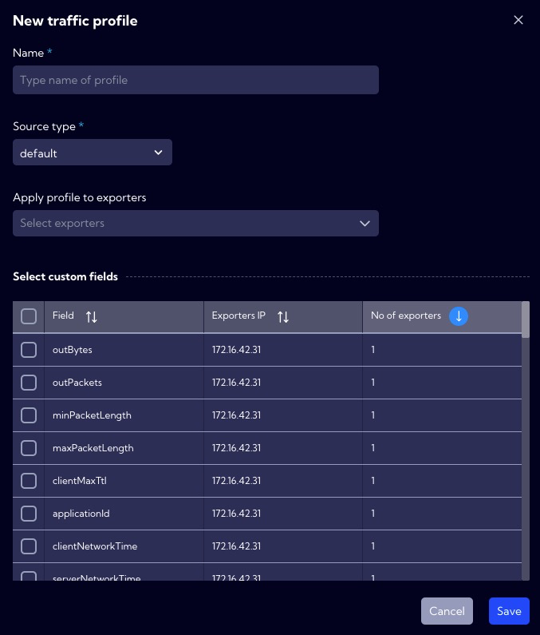
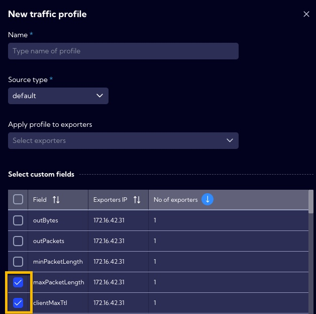

# NetFlow

This menu **[Settings > NetFlow > Netflow]** can be used to configure NetFlow parameters.

---

## Simple option 

In this menu, enter the port number for the NetFlow (**Netflow Port**), the default port is 2055.

---

## Advanced options

Available when the **Show advanced options** switch is on.

**Netflow Ports** - the default port is 2055. You can change or add a new port by pressing the plus button.

---

### Traffic profiles

**New profile** - you can add a new Netflow profile with this button. When creating it, you have to complete the following elements:

- **Name** - profile name.

- **Source type**
  - **asa**
  - **default**
  - **nbox**
  
- **Select custom fields** - here you can select from the table custom Netflow fields.

- **Apply to exporters** - here, you can assign a profile to the exporter.

  

The list of created **Profiles** is in the table with the following columns:

- **Profile** - profile name.
- **Type** - exporter type [**default**, **asa**, **nbox**].
- **Exporters IP** - exporter IP address.
- **Action**
  - Edit - edit selected **Profile**.
  - Delete - delete the selected **Profile**.

---

### Exporters IP

**Add exporter** - here, you can manually add an exporter.  After clicking, a new row will be added to the table where you must complete the **IP address** and assign Trafic profiles. 

After completing and pressing the **Save** button new exporter will be added to the System.

---

### Custom fields

The table contains fields added by the user.

To add a new **Custom field**, click on the **magnifying glass icon** next to the exporter in the **IP Exporter table**.

 When clicked, the **Advanced View** menu will appear on the right side of the screen. This menu contains all the fields for the exporter including unknown.

After clicking on the **plus icon**, the wizard for creating a user **custom field** will appear.

In the first step, you need to complete the fields related to netflow data, as in the example below.

In the second step, you need to complete the fields related to **Custom aggregation**, as below.

---

### Custom pre aggrs

The table contains aggregations created automatically based on custom fields created earlier.

---

## Creating new profile

Profiles allow defining fields of the NetFlow protocol to be analyzed by Sycope. You can create your profiles depending on your needs.

Create a new profile by pressing the **New profile** button then the profile creation wizard will appear.

**Name** - unique profile name.

**Source type** [**default**/**asa**] - The source from which the stream of neftlow comes - may be characteristic and differ for a particular device. In the System, the CISCO ASA device is defined in addition to the default source. 

**Apply profile to exporters** - Here, we assign a profile to the selected exporters.

**Choose advanced options** - In the table, we can select additional non-standard NetFlow fields available to the selected exporter. 

To finish creating a new profile, press the **Save** button. The new profile will appear on the list of available profiles in the system. 

:::caution

In order for the system to start analyzing additional NetFlow fields you need to check them !!!

:::
