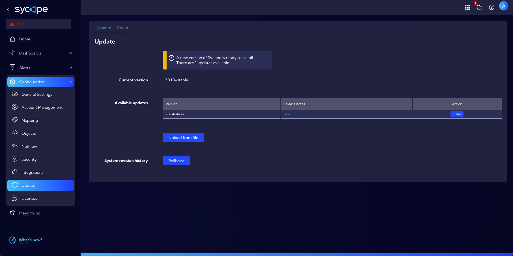

# Updates

This menu  **[Settings > General > Updates]** can be used to manage the system version.

The first information in this window is information about the availability of a new system version. Then there is the information **Current version** with the number of installed system version. Next there is a section called **Available updates** which contains a table with the following columns:

- **Version** - update version

- **Release date** - the release date of a particular version of the system

- **Release notes** - list of changes and improvements for a given system version

- **Action** - clicking the Install button starts the installation of the system update

  

Below is the section **System revision history** with the **Rollback** button used to restore the previous version of the system.

