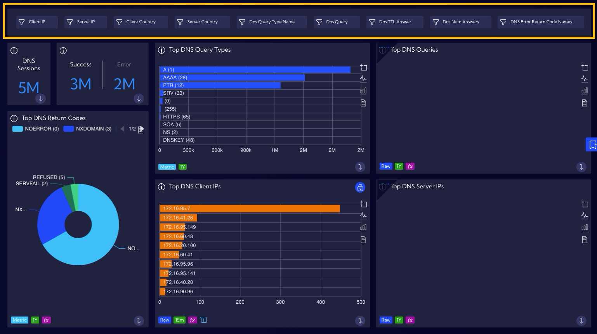
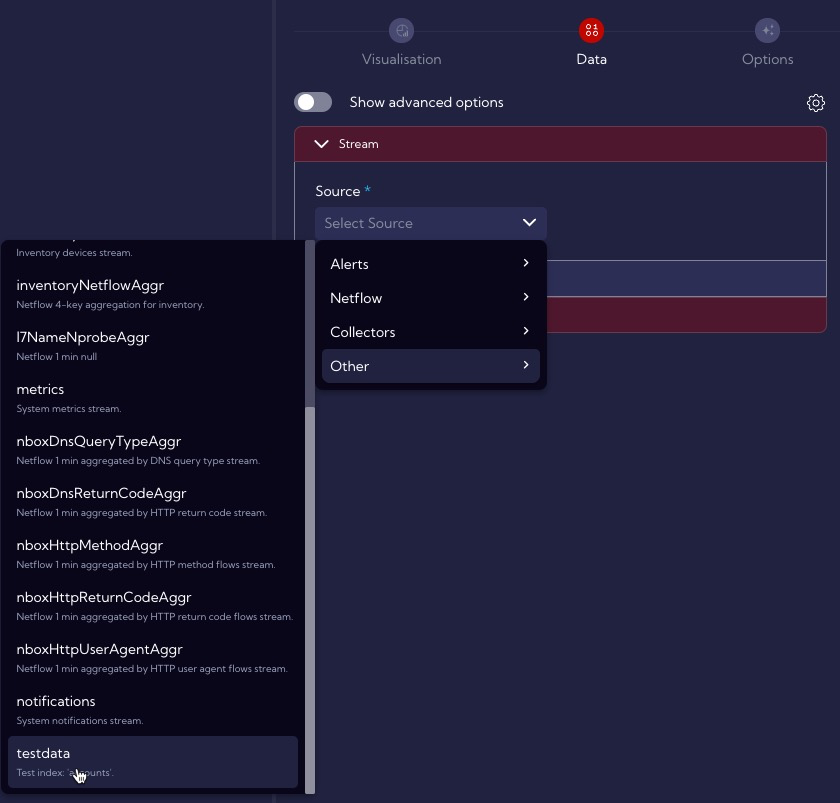
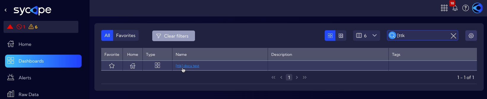
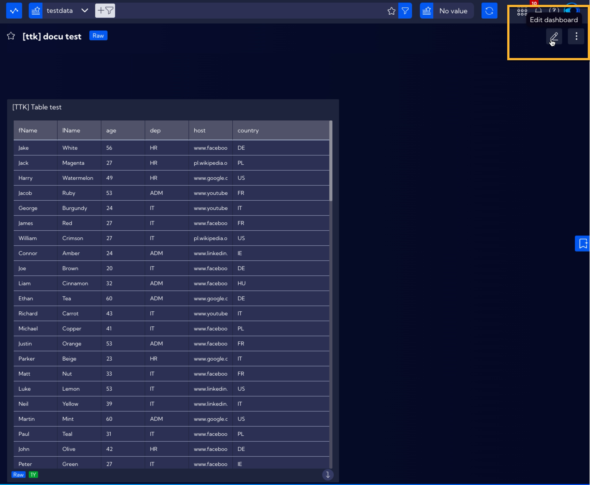
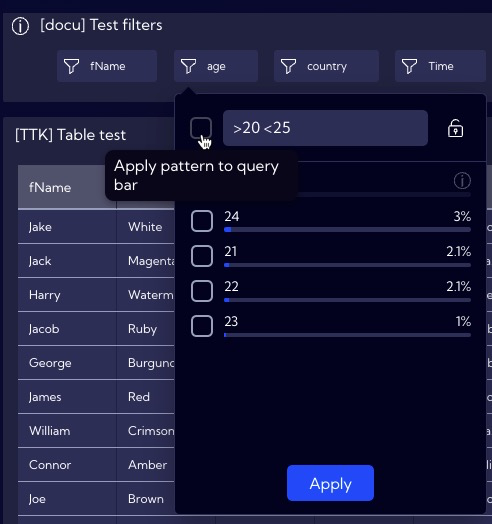
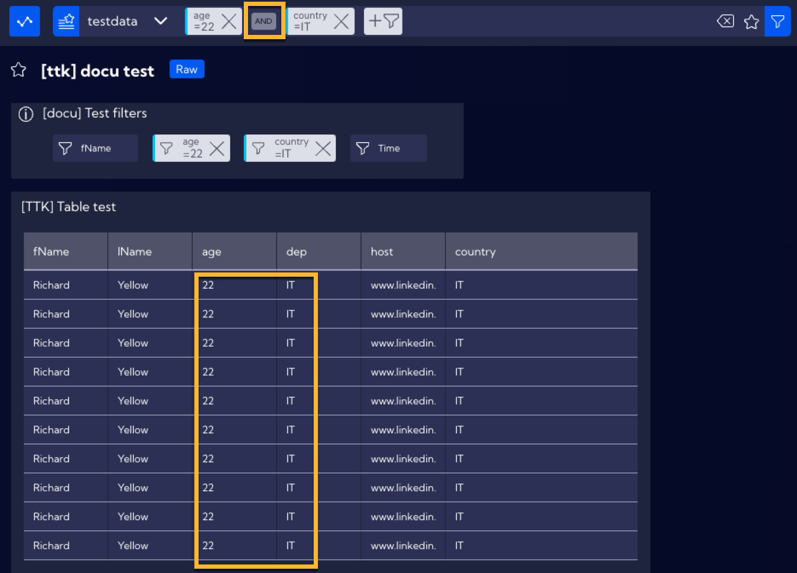

# Filters

The filters function is a special **Widget** (**Filters Widget**) allowing for the creation of a preliminary filter for each field in the selected data stream and the placing it in the **Dashboard**. By creating a **Filters Widget** for the key fields, you can drastically simplify the process of data analysis and therefore raise its effectiveness. This is due to the fact that the utilized filters are always available and can be connected with each other creating longer query strings.

## Example of creating a Filters Widget

In order to create a new Filters Widget, click the **[Configuration > Widgets]** menu, then click the `Add widget` button. A standard Widget creation wizard will appear.

In the `Visualisation` tab, fill in the `Title` field and, optionally, the `Description` and `Tags` fields, in the `Type of Visualisation` section, select Filters.

After filling out the required fields, you can move on to the Data section, which in this case is crucial. This example will be realized for the testdata stream that is typically implemented in the system and all users can utilize it for the purpose of learning and performing examples on their own.

:::tip

Test data were implemented into the Sycope system in the form of the testdata stream. It is simple data that are easily accessible after installing the system and may be used for the purpose of learning and performing the examples included in the documentation.

Please note that the test data has a time stamp within the period from 2023-01-01 to 2023-01-31 and therefore proper settings of the time filter should be used.

:::

In the Data section, use the Simple mode (without using the `Show advanced options` slider). The following image shows the required configuration within the individual tabs of the Data section. 

- **Stream Tab -> Source -> Other->** `testdata` 
  (select the testdata stream)

- **Time Tab -> 2023-01-01 to 2023-02-01** (this is because the same time period is used for the data in the testdata stream)

  

- **Dimension Tab** 

  In this tab, you select the field or fields which are supposed to be filtered. Let us assume that this example aims to provide the ability of quick filtering of the testdata stream in the fName, age country and Time fields. Therefore, add them and select them from the list.

  

  After selecting appropriate fields, they will appear on the left side of the creator.

  

  By clicking on a given filter, you can see if it has been properly configured and if it works in accordance with its desired setting.

  

Now, the Widget is ready and it needs to be saved by clicking the Save button. After saving, the widget will appear in the Widget list in the **[Configuration > Widgets]** menu. 

## Example of use

In order to use the previously created Filters Widget in the System, you need to place it in the Dashboard. For this purpose, navigate to the [**Dashboard**] menu and create a new or select a previously created Dashboard from the list.

For the purposes of this example, a Dashboard was created previously containing a Widget with a table of selected data from the testdata stream. After selecting the Dashboard, click on the Edit Dashboard icon and then on the Add Widget button and introduce the previously created Filters Widget.

After adding a Filters Widget, you can adjust its shape and placement in the Dashboard by clicking on the lower right active corner of the Widget. After that, save the configuration of the Dashboard.

### Using of a single Filter

For this example, let us assume that you want to display the people who are exactly 60 years old in a table. For this reason, use the Filter that was created for the age field.

By clicking on it, you can see the percentage of people of a specific age. On the list, locate, select and confirm the number 60.

Now, the table will display only the data of people aged 60, as assumed before.

Please note that the Filter will appear in the search bar. 

By using a single Filter, there is no limit of selecting a single value, you can select multiple valuse, for example, add people aged 27 to the existing table. Click on the age Filter and select an additional field next to the value of 27.

The table will now also contain data of people aged 27.

Now, let us consider a case where you would like the table to show people of all ages except for the age of 60. For this purpose, click on the age Filter and double-click the field next to the number 60, and the  (does not contain) sign will appear next to it.

As you can see, now the list does not show the data of people aged 60.

By using a single Filter you can also create more advanced filtration with the use of operators listed in the table below.

| Syntax            | Description                                                  | Example                                                      |
| ----------------- | ------------------------------------------------------------ | ------------------------------------------------------------ |
| `abc`;`*abc*`     | The search string is compared to every word in the field value, disregarding case sensitivity. |  |
| `abc*`            | The search string is matched by any string that begins with an `abc` string and is followed by zero or more characters of any type. |  |
| `*abc`            | The search string is matched by any string that ends with an `abc` string and is preceded by zero or more characters of any kind. |  |
| `"abc"`           | The search string is matched by a string including only the exact word or phrase enclosed within the quotation marks. |  |
| `>value`          | For numeric fields, the search string returns all records with a value greater than the specified `value`. |  |
| `>=value`         | For numeric fields, the search string returns all records with a value equal to or greater than the specified `value`. |  |
| `<value`          | For numeric fields, the search string returns all records with a value lower than the specified `value`. |  |
| `<=value`         | For numeric fields, the search string returns all records with a value equal to or lower than the specified `value`. |  |
| `>date`           | For numeric fields, the search string returns all date records with a value greater than the specified `data`. |  |
| `>=date`          | For numeric fields, the search string returns all date records with a value equal to or greater than the specified `data`. |  |
| `<date`           | For numeric fields, the search string returns all date records with a value lower than the specified `data`. |  |
| `<=date`          | For numeric fields, the search string returns all date records with a value equal to or lower than the specified `data`. |  |
| `<value1 >value2` | Combination of two values in one search. For numeric fields, the search string returns all records with a value lower than the specified `value1` **and** greater than `value2`. It works analogously for the other operators and their combinations (`<=;>=`) |  |
| `<date1 >date2`   | Combination of two date values in one search. For data value fields, the search string returns all records with a date value lower than the specified `date1` **and** greater than `date2`. It works analogously for the other operators and their combinations (`<=;>=`), |  |

Now, try to make the table display the data of people aged 20 to 25. In order to do so, you need to apply the `>20 <25` expression in the age Filter (please remember that you need to put a space between the conditions) and tick the selection field next to the expression (Apply pattern to query bar).

The table will now display only the data of people aged 20 to 25 and the filtering syntax will appear in the search bar, similarly to the previous examples.

### Using more than one filter

By using the Filters Widget, you can use a greater number of filters to create more complex filtration of data. In this example, the goal is to display the data of people aged 22 and coming from Italy (IT). In order to do so, use the age and country Filters, by selecting accordingly the values 22 and IT. the table will now display only the data of Italians aged 22.

Additionally, please note that in the search bar, a query has been created which shows that individual filters from the Filters Widget are combined with the use of the AND operator.

[Back to the widgets list](/User-Guide/Configuration/Widgets#widgets-add)
